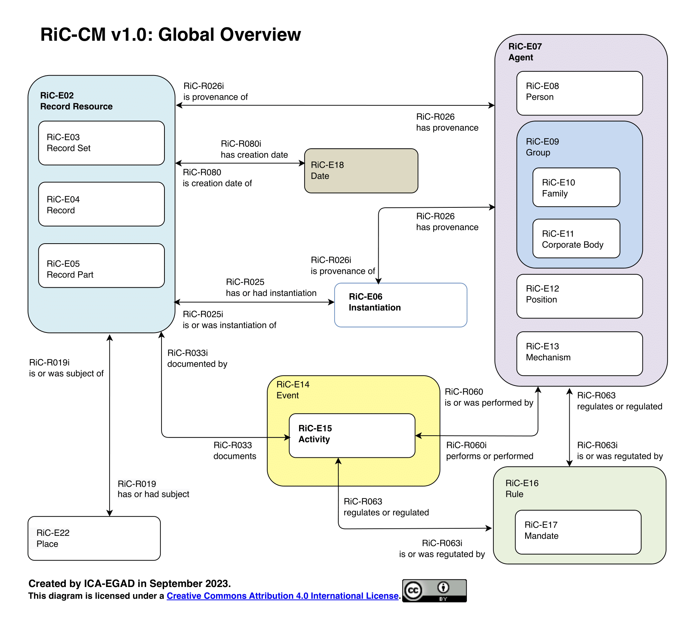
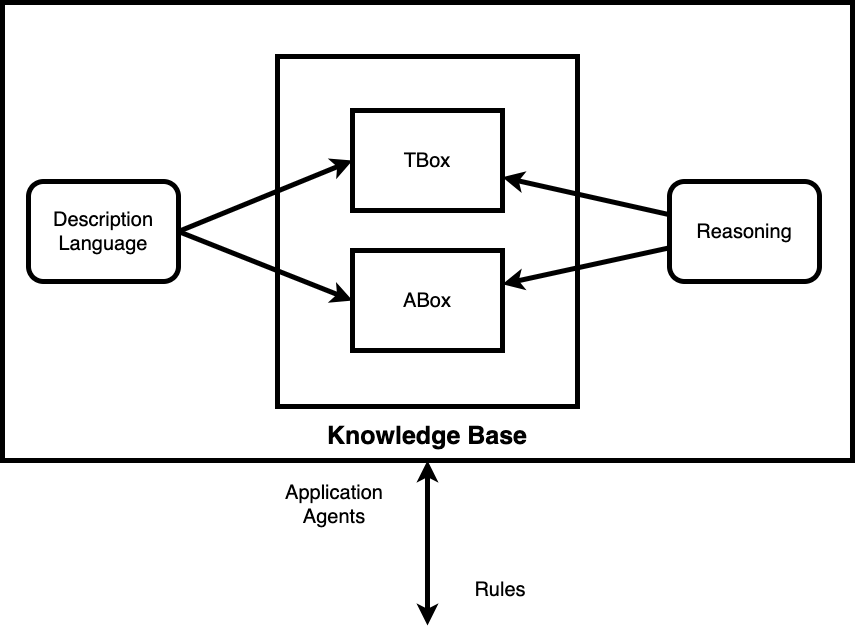
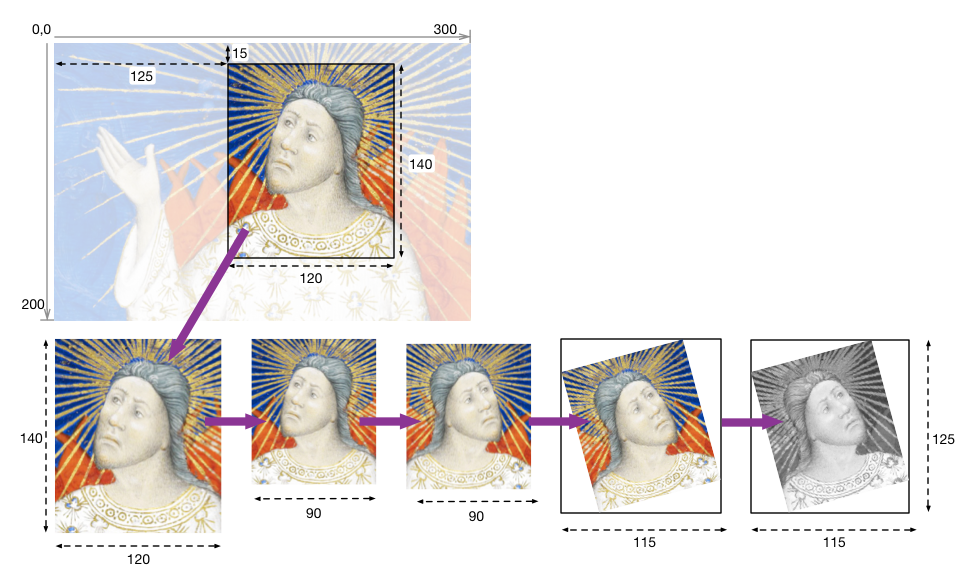
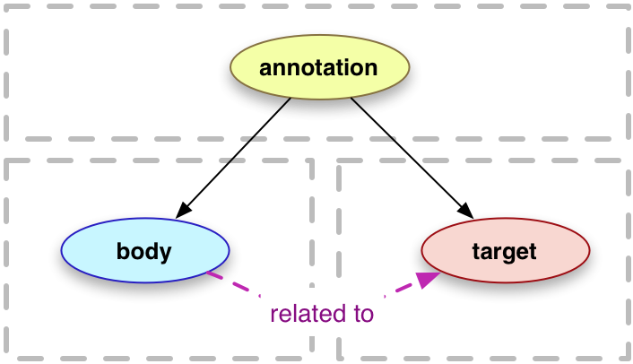

# Linked Open Usable Data for Cultural Heritage: Perspectives on Community Practices and Semantic Interoperability

PhD Thesis in Digital Humanities, completed as part of the Graduate School of Social Sciences' ({{ "G3S" | abbr | safe }}) doctoral programme. It was successfully defended on 18 November 2024 ([slides](https://julsraemy.ch/prezi/loud4ch-doctoral-examination.html)).

This page hosts a lightweight {{ "HTML" | abbr | safe }} version of my thesis, optimised for easier access and readability (_mindful of digital limitations and with some trade-offs_). The PDF version (e-dissertation) is available on the University of Basel's repository: https://doi.org/10.5451/unibas-ep96807 as well as on the Swiss National Library's catalogue: https://nbn-resolving.org/urn:nbn:ch:bel-bau-diss155487.  

  <h3>Dr. Julien A. Raemy</h3>
  
University of Basel, Basel, Switzerland

  

    <a href="https://orcid.org/0000-0002-4711-5759" target="_blank">
      
      https://orcid.org/0000-0002-4711-5759
    </a>
  

  <h3>Supervisors</h3>
  <ul>
    <li>
      Prof. Dr. Peter Fornaro (University of Basel) 
      <a href="https://orcid.org/0000-0003-1485-4923" target="_blank">
        
        https://orcid.org/0000-0003-1485-4923
      </a>
    </li>
    <li>Prof. Dr. Walter Leimgruber (University of Basel)</li>
    <li>
      Dr. Robert Sanderson (Yale University) 
      <a href="https://orcid.org/0000-0003-4441-6852" target="_blank">
        
        https://orcid.org/0000-0003-4441-6852
      </a>
    </li>
  </ul>

## Abstract {id="abstract"}

Digital technologies have fundamentally transformed how Cultural Heritage (CH) collections are accessed and engaged with. [Linked Open Usable Data](loud.html) ({{ "LOUD" | abbr | safe }}) specifications, including the [International Image Interoperability Framework (IIIF) Presentation API 3.0](https://iiif.io/api/presentation/3.0/), [Linked Art](https://linked.art), and the [W3C Web Annotation Data Model](https://www.w3.org/TR/annotation-model/), have emerged as web standards to facilitate the description and dissemination of these valuable resources. Despite the widespread adoption of {{ "IIIF" | abbr | safe }}, implementing {{ "LOUD" | abbr | safe }} specifications, particularly in combination, remains challenging. This is especially evident in the development and assessment of infrastructures, or sites of assemblage, that support these standards.

This research is guided by two perspectives: community practices and semantic interoperability. The first perspective assesses how organizations, individuals, and apparatuses engage with and contribute to the consensus-making processes surrounding {{ "LOUD" | abbr | safe }}. By examining these practices, the social fabrics of the {{ "LOUD" | abbr | safe }} ecosystem can be better understood. The second perspective focuses on making data meaningful to machines in a standardized, interoperable manner that promotes the exchange of well-formed information. This research is grounded in the {{ "SNSF" | abbr | safe }}-funded project, [Participatory Knowledge Practices in Analogue and Digital Image Archives](pia.html) ({{ "PIA" | abbr | safe }}) (2021–2025), which aims to develop a citizen science platform for three photographic collections from the Cultural Anthropology Switzerland ({{ "CAS" | abbr | safe }}) archives. Actor-Network Theory ({{ "ANT" | abbr | safe }}) forms the theoretical foundation, aiming to describe the collaborative structures of the {{ "LOUD" | abbr | safe }} ecosystem and emphasize the role of non-human actors.

Beyond its implementation within the {{ "PIA" | abbr | safe }} project, this research includes an analysis of the social dynamics within the {{ "IIIF" | abbr | safe }} and Linked Art communities and an investigation of Yale's Collections Discovery platform, [LUX](https://lux.collections.yale.edu/). The research identifies socio-technical requirements for developing specifications aligned with {{ "LOUD" | abbr | safe }} principles. It also examines how the implementation of {{ "LOUD" | abbr | safe }} standards in {{ "PIA" | abbr | safe }} highlights their potential benefits and limitations in facilitating data reuse and broader participation. Additionally, it explores Yale University's large-scale deployment of {{ "LOUD" | abbr | safe }} standards, emphasizing the importance of ensuring consistency between Linked Art and {{ "IIIF" | abbr | safe }} resources within the LUX platform for the {{ "CH" | abbr | safe }} domain.

The core methodology of this thesis is an actor- and practice-centered inquiry, focusing on a detailed examination of specific cosmologies within {{ "LOUD" | abbr | safe }}-driven communities, {{ "PIA" | abbr | safe }}, and LUX. This micro-perspective approach provides rich empirical evidence to unravel the intricate web of cultural processes and constellations in these contexts.

Key empirical findings indicate that {{ "LOUD" | abbr | safe }} enhances the discoverability and integration of data in {{ "CH" | abbr | safe }}, requiring community-driven consensus on model interoperability. However, significant challenges include engaging marginalized groups, sustaining long-term participation, and balancing technological and social factors. Strategic use of technology and the capture of digital materiality are critical, but {{ "LOUD" | abbr | safe }} also poses challenges related to resource investment, data consistency, and the broader implementation of complex patterns.

{{ "LOUD" | abbr | safe }} should lead efforts to improve the accessibility and usability of {{ "CH" | abbr | safe }} data. The community-driven methodologies of {{ "IIIF" | abbr | safe }} and Linked Art inherently foster collaboration and transparency, making these standards essential tools in evolving data management practices. Even for institutions and projects that do not adopt these specifications, the socio-technical practices of {{ "LOUD" | abbr | safe }} offer vital insights into effective digital stewardship and strategies for community engagement.

### Keywords {id="keywords"}
Actor-Network Theory; Community of Practice; Cultural Anthropology Switzerland; Cultural Heritage; Digital Infrastructure; International Image Interoperability Framework; Knowledge Practices; Linked Art; Linked Data; LUX; Participatory Archives; Photographic Archives; Semantic Interoperability; Web Annotation Data Model

## Table of Contents {id="toc"}

1. [Introduction](#cha:intro) 
2. [Context](#cha:context)
3. [Interlinking Cultural Heritage Data](#cha:literature)
4. [Exploring Relationships through an Actor-Network Theory Lens](#cha:theoretical)
5. [Research Scope and Methodology](#cha:scope)
6. [The Social Fabrics of IIIF and Linked Art](#cha:social-fabrics)
7. [PIA as a Laboratory](#cha:pia-laboratory)
8. [Yale’s LUX and LOUD Consistency](#cha:lux-consistency)
9. [Discussion](#cha:discussion)
10. [Conclusion](#cha:conclusion)

## 1. Introduction {id="cha:intro"}

Since its inception in 2011, the {{ "IIIF" | abbr | safe }} has revolutionised[^1] the accessibility of image-based resources. Initially driven by the needs of manuscript scholars, {{ "IIIF" | abbr | safe }} focused on two-dimensional images, but has since expanded to encompass a wide range of image-based resources, including audiovisual materials and, in the near future, {{ "3D" | abbr | safe }} images. Similarly, Linked Art, formally established in 2017, initially concentrated on art museum objects but has since broadened its scope to model a variety of {{ "CH" | abbr | safe }} entities, leveraging {{ "CIDOC-CRM" | abbr | safe }}, a renowned ontology in the museum and {{ "DH" | abbr | safe }} space. Both initiatives aim to break down silos: {{ "IIIF" | abbr | safe }} focuses on improving the presentation of digital objects, while both initiatives enhance their dissemination. Together, they make {{ "CH" | abbr | safe }} data more accessible through {{ "IIIF" | abbr | safe }} and more meaningful through Linked Art for machines. These efforts have primarily benefited the {{ "CH" | abbr | safe }} domain. 

A key commonality is that the main {{ "API" | abbr | safe }}s these communities create align with the {{ "LOUD" | abbr | safe }} design principles, either intentionally or empirically demonstrated through use cases. These principles enable software developers to develop compliant tools and services without needing to fully understand {{ "RDF" | abbr | safe }}, a syntax for representing information on the web. Additionally, they may not need to grasp all {{ "LOD" | abbr | safe }} principles, which promote the interlinking of data from diverse datasets using tools like {{ "KOS" | abbr | safe }} such as thesauri. {{ "WADM" | abbr | safe }}, a {{ "W3C" | abbr | safe }} standard, is also recognised as a {{ "LOUD" | abbr | safe }} specification. It provides a framework for creating interoperable annotations on web resources, facilitating the linking and sharing of data across different platforms and applications. These {{ "LOUD" | abbr | safe }} design principles include the right abstraction for the audience, few barriers to entry, comprehensibility by introspection, documentation with working examples, and the use of many consistent patterns rather than few exceptions. Additionally, both {{ "IIIF" | abbr | safe }} and Linked Art are driven by vibrant communities, mainly comprising {{ "GLAM" | abbr | safe }} and higher education institutions. 

While the standards and principles discussed have broad applications, it is important to clarify the scope of this dissertation. This work does not focus on {{ "KG" | abbr | safe }}s by assessing triplestores -- databases specifically designed to store and retrieve triples, which are the fundamental data structures in {{ "RDF" | abbr | safe }}. Similarly, it does not deal with evaluating {{ "SPARQL" | abbr | safe }} engines, which are specifically designed to query {{ "KG" | abbr | safe }}s. Additionally, this dissertation does not address the intersection of {{ "ML" | abbr | safe }} and {{ "IIIF" | abbr | safe }}, or the ontological reasoning of Linked Art. 

Instead, this dissertation concentrates on {{ "LOUD" | abbr | safe }}, the consistency of its standards, design principles and the vibrant communities behind it. It examines {{ "JSON-LD" | abbr | safe }} serialisation efforts and the crucial intersection required to establish robust semantic interoperability baselines between presentation and semantic layers. It also presents real-world use case implementations, both on a small scale in a laboratory and flexible space within the {{ "PIA" | abbr | safe }} research project, and on a large scale at Yale, exemplified by the LUX platform that provides access to (meta)data from {{ "YUL" | abbr | safe }}, {{ "YCBA" | abbr | safe }}, {{ "YUAG" | abbr | safe }}, and {{ "YPM" | abbr | safe }}. 

The focus is therefore on digital infrastructures capable of delivering {{ "JSON-LD" | abbr | safe }} files from the above specifications, which are primarily, though not exclusively, {{ "CH" | abbr | safe }} resources. It is more about the different actors -- both human and non-human -- that create and maintain these interconnected systems and the dynamic interactions that sustain them. The deployment of various {{ "LOUD" | abbr | safe }} specifications addresses the need for semantic interoperability between {{ "CH" | abbr | safe }} resources and disparate datasets by establishing a standardised approach to representing and linking data, ensuring that information can be seamlessly shared and understood across different platforms and contexts. 

This dissertation seeks to carve out a distinct niche by addressing an often-overlooked aspect of {{ "IIIF" | abbr | safe }} and Linked Art. {{ "IIIF" | abbr | safe }} is sometimes perceived and studied merely as a service or an appendix, with the content it delivers taking precedence. However, this PhD thesis positions {{ "IIIF" | abbr | safe }} as a first-class citizen worthy of in-depth study. Similarly, Linked Art, despite its potential and its relatively recent establishment, has been the subject of very few scholarly papers. This gap underscores the significance of {{ "LOUD" | abbr | safe }} in this context. Furthermore, this thesis elevates Linked Art to a position of primary importance, recognising its significance and advocating for its thorough examination. To thoroughly study {{ "LOUD" | abbr | safe }} and its adherence to design principles, it is essential to immerse ourselves actively in both communities -- an approach I have embraced for years. The thesis also emphasises the importance of participatory efforts and collaboration between research projects, which typically have shorter lifespans, and memory institutions, which need to implement technical standards as a *lingua franca*. In doing so, it reveals the mediating role of {{ "LOUD" | abbr | safe }} in advancing the heritage sphere. To truly understand {{ "IIIF" | abbr | safe }}, Linked Art, and to a lesser extent {{ "WADM" | abbr | safe }}, it is crucial to examine the social fabrics and consensus decision-making of each community. Among these considerations are how the specifications can be implemented pragmatically, and how the standards can support the implementation and maintenance of more extensive semantic interoperability efforts. 

The significance of this research lies in highlighting the commitment and diligence of the individuals and organisations that make up both the {{ "IIIF" | abbr | safe }} and Linked Art communities. It aims to demonstrate that community-driven practices, such as those exemplified by {{ "IIIF" | abbr | safe }} and Linked Art, have a potential that goes beyond the mere sharing of digital objects and their associated metadata. The more people who embrace these approaches and implement the associated specifications, the more society as a whole will benefit. Furthermore, this research illustrates that {{ "IIIF" | abbr | safe }} is no longer limited to two-dimensional images, that Linked Art is not restricted to artworks, and that {{ "WADM" | abbr | safe }} is a simple, content-agnostic standard that can be easily integrated into a range of systems. This adaptability is a strength of {{ "LOUD" | abbr | safe }} standards, which are designed to be simple yet effective. {{ "LOUD" | abbr | safe }} can serve a variety of purposes, primarily rooted in {{ "CH" | abbr | safe }}, but with the potential to extend its benefits to other sectors. The true beauty of {{ "LOUD" | abbr | safe }} lies in its ability to foster networking opportunities and transparent socio-technical practices, demonstrating its value beyond mere technical implementation. 

By emphasising these aspects, this dissertation highlights the wider impact of {{ "LOUD" | abbr | safe }} in promoting semantic interoperability and enhancing collaborative efforts within the heritage field and beyond. In addition, the implementation of standards through {{ "PIA" | abbr | safe }} underlines the potential for similar participatory or citizen science projects, while the LUX initiative serves as an illustrative example of robust infrastructure and cross-unit engagement. These examples demonstrate the practical applications and far-reaching implications of adopting {{ "LOUD" | abbr | safe }} standards in different contexts. 

This dissertation is structured across ten chapters, each building upon the previous ones up to Chapter 5 to provide a comprehensive understanding of the research. These initial chapters lay the foundation of the study, establishing the context, theoretical framework, and methodological approaches. After this foundational section, Chapters 6, 7, and 8 present empirical studies that, while interconnected, can be read independently if desired. These chapters offer detailed insights into specific aspects of the research and can be appreciated on their own or as part of the broader narrative.

The thesis continues with [Chapter 2](#cha:context), which extends this introduction by providing more information about the research setting, specifically {{ "PIA" | abbr | safe }}. [Chapter 3](#cha:literature) follows with an extensive literature review, offering a comprehensive overview of methods to interlink {{ "CH" | abbr | safe }} data. Next, [Chapter 4](#cha:theoretical) presents the theoretical framework, conceptualised as a toolbox and firmly rooted in {{ "ANT" | abbr | safe }}, guiding the analysis and discussion throughout the dissertation. Following this, [Chapter 5](#cha:scope) details the research scope and methodology, explaining the approaches and methods employed in the study.

Moving on to the empirical work, [Chapter 6](#cha:social-fabrics) sheds light on the social fabrics of {{ "IIIF" | abbr | safe }} and Linked Art, exploring the communities and practices that underpin these initiatives.[Chapter 7](#cha:pia-laboratory) then examines the implementation of {{ "LOUD" | abbr | safe }} standards
within {{ "PIA" | abbr | safe }}, highlighting the practical aspects and challenges encountered. This is followed by [Chapter 8](#cha:lux-consistency), which focuses on the LUX initiative at Yale, examining the underlying governance and interdepartmental ownership of the Yale Collections Discovery platform. The discussion of findings is presented in [Chapter 9](#cha:discussion), where the results from the empirical chapters are synthesised and analysed in relation to the theoretical framework. Finally, [Chapter 10](#cha:conclusion) concludes
the thesis, summarising the key insights and contributions of the
research while outlining potential directions for future study.

## 2. Context {id="cha:context"}

In this chapter, I will set the stage for my PhD thesis by providing important background information. First, in [Section 2.1](#sec:title), I will explain why I chose the title for my thesis. This will give you an understanding of the main focus and the direction of my research. Next, in [Section 2.2](#sec:pia), I will describe the {{ "PIA" | abbr | safe }} research project, which is central to my work. This section will cover the project's goals, significance, and overall framework. In [Section 2.3](#sec:pia-contribution), I will detail my specific contributions to the {{ "PIA" | abbr | safe }} project. I will emphasise how my work fits into the larger project and its importance to my thesis. Finally, in [Section 2.4](#sec:involvement_iiif_la), I will talk about my active participation in the {{ "IIIF" | abbr | safe }} and Linked Art communities. This section will highlight how my involvement in these communities has influenced my research and its broader implications.

### 2.1 PhD Title {id="sec:title"}

I chose the title ‘Linked Open Usable Data for Cultural Heritage: Perspectives on Community Practices and Semantic Interoperability’ as it encapsulates the essence of my research focus but I could have indeed chosen other ones.

During the initial stages of my research, multiple working titles were explored to capture the diverse facets of my interests and objectives. If I was quite sure about having in the title after the third iteration, I was quite unsure of what should follow and if a subtitle was actually needed at all. Amidst this dynamic progression, the underlying theme of my research remained steadfast -- to delve into the transformative potential of {{ "LOUD" | abbr | safe }} for {{ "CH" | abbr | safe }}.

I also opted to maintain in the title of my thesis subsection. While holds its appeal, my choice reflects a broader narrative that acknowledges the crucial role of {{ "CHI" | abbr | safe }}s and spotlighting the multifaceted nature of heritage preservation, encapsulating both its digital facets and the essential contribution of individuals and institutions in curating, interpreting, and making heritage accessible. 

As for the subtitle, while I do explore {{ "CoP" | abbr | safe }} as defined by @lave_situated_1991 and @wenger_communities_2011 through investigating the social fabrics of the {{ "IIIF" | abbr | safe }} and Linked Art communities, my main interest lies in the broader application of {{ "LOUD" | abbr | safe }} for describing and interlinking {{ "CH" | abbr | safe }} resources. Thus, I decided to opt for the more generic as the first axis or perspective. 

For the second perspective, I wanted to see how semantic interoperability can be achieved through standards adhering to the {{ "LOUD" | abbr | safe }} design principles, as they seem to be key enablers for seamless collaboration and knowledge exchange among practitioners. There was a time in my research when I envisaged decoupling and , perceiving them as two distinct dimensions. However, what really captivates me is the unification of these factors to facilitate collective reasoning for both humans and machines. 

In summary, this title reflects my enthusiasm for using web-based and community-driven technologies to transform the way we understand, share and value {{ "CH" | abbr | safe }}.

### 2.2 The PIA Research Project {id="sec:pia"}

I undertook my doctoral studies within the scope of the {{ "PIA" | abbr | safe }} research project financed by the {{ "SNSF" | abbr | safe }} under their Sinergia funding scheme from February 2021 to January 2025[^3]. The project aimed to analyse the interplay of participants, epistemological orders and the graphical representation of information and knowledge in relation to three photographic collections from {{ "CAS" | abbr | safe }}. It sought to bring together the world of data and things in an interdisciplinary manner, exploring the phases of the analogue and digital archive from a cultural anthropological, technical and design research perspective [@felsing_community_2023 p. 42]. As part of this endeavour, interfaces were developed to enable the collaborative indexing and use of photographic archival records [@chiquet_participatory_2023 p. 110]. I discuss in more detail the interdisciplinary components and briefly introduce the people involved in the project in [Subsection 2.2.1](#subsec:interdisciplinary), then talk about the photographic collections that were the overarching narrative of the research in [Subsection 2.2.2](#subsec:sgv_collections), and lastly in [Subsection 2.2.3](#subsec:pia_vision), the vision that we had put together.

The project, divided in three interdisciplinary teams, was led by the University of Basel through the Institute for Cultural Anthropology and European Ethnology[^4] (Team A) and the {{ "DHLab" | abbr | safe }}[^5] in collaboration with the {{ "DBIS" | abbr | safe }} group (Team B) as well as by the {{ "HKB" | abbr | safe }}[^6], an art school and department of the Bern University of Applied Sciences (Team C) [@felsing_community_2023 p. 43]. [Table 2.1](#tab:pia-team) lists the people who contributed to the project, broken down by the three teams and their particular perspectives.

<figure id="tab:pia-team" style="text-align: center;">
  <figcaption><strong>Table 2.1</strong>: PIA Team Core Members</figcaption>
  
  <table style="margin: 1em auto;">
    <thead>
      <tr>
        <th><strong>Perspective</strong></th>
        <th><strong>People</strong></th>
      </tr>
    </thead>
    <tbody>
      <tr>
        <td>A) Anthropological</td>
        <td>
          Prof. Dr. Walter Leimgruber, Team Leader and Dissertation Supervisor 
          Dr. Nicole Peduzzi, Photographic Restoration and Digitisation Supervisor 
          Regula Anklin, Conservation and Restoration Specialist (project partner at Anklin &amp; Assen) 
          Murielle Cornut, PhD Candidate in Cultural Anthropology 
          Birgit Huber, PhD Candidate in Cultural Anthropology 
          Fabienne Lüthi, PhD Candidate in Cultural Anthropology
        </td>
      </tr>
      <tr>
        <td>B) Technical</td>
        <td>
          Prof. Dr. Peter Fornaro, Team Leader and Dissertation Supervisor 
          Prof. Dr. Heiko Schuldt, Dissertation Supervisor (project partner at the University of Basel) 
          Dr. Vera Chiquet, Postdoctoral Researcher 
          Adrian Demleitner, Software Developer (2021-2023) 
          Fabian Frei, Software Developer (2023-2025) 
          Christoph Rohrer, Software Developer (2023-2025) 
          Julien A. Raemy, PhD Candidate in Digital Humanities 
          Florian Spiess, PhD Candidate in Computer Science
        </td>
      </tr>
      <tr>
        <td>C) Communicative</td>
        <td>
          Dr. Ulrike Felsing, Team Leader and Dissertation Supervisor 
          Prof. Dr. Tobias Hodel, Dissertation Supervisor (project partner at the University of Bern) 
          Daniel Schoeneck, Research Fellow 
          Lukas Zimmer, Designer (project partner at A/Z&amp;T) 
          Max Frischknecht, PhD Candidate in Digital Humanities
        </td>
      </tr>
    </tbody>
  </table>
</figure>

#### 2.2.2 Photographic Collections/Archives as Anchors {id="subsec:sgv_collections"}

{{ "CAS" | abbr | safe }} has historically been engaged in active collaborations that bridge the academic research and the public sphere, primarily through traditional analogue methods. The {{ "PIA" | abbr | safe }} project was created with the intention of exploring the complexities inherent in both analogue and digital approaches, and to encourage and investigate these collaborative endeavours between academia and the wider public. As such, {{ "PIA" | abbr | safe }} represents a paradigm shift within the scope of projects associated with or supported by {{ "CAS" | abbr | safe }}, facilitating the seamless integration of digital tools to explore multiple facets of participation and engagement. This transformative endeavour embodies a profound exploration of new intersections where scholarly endeavours intertwine with the active involvement of citizens.

{{ "PIA" | abbr | safe }} drew on three collections: one focusing on scientific cartography and titled (*Atlas der Schweizerischen Volkskunde*), a second from the estate of the photojournalist Ernst Brunner (1901--1979), and a third collection consisting of vernacular photography which was owned by the Kreis Family (1860--1970).

**SGV_05 {{ "ASV" | abbr | safe }}** consists of 292 maps and 1000 pages of commentary published from 1950 to 1995 --- an example of such a map is shown in [Figure 2.1](#fig:sgv-atlas). This collection was commissioned by the {{ "CAS" | abbr | safe }} to do an extensive survey of the Swiss population in the 1930s and 1940s on many issues pertaining, for instance, to everyday life, local laws, superstitions, celebrations or labour [@weiss_atlas_1940]. The contents were compiled by researchers and by people who were described as [^11]. Questions were asked about everyday habits, community rights, work, trade, superstitions, and many other topics [@schmoll_richard_2009; @schmoll_vermessung_2009]. This collection offers a snapshot of everyday life in Switzerland right before the beginning of a modernisation process that fundamentally changed lifestyles in all areas during the postwar period. A digitised version of the {{ "ASV" | abbr | safe }} would not only allow the results of that time to be enriched with further findings  [@schranz_critical_2021], but would also make transparent how knowledge was generated in cartographic form through a complex process along different types of media and actors. The restoration, digitisation, cataloguing and indexing efforts took all part throughout {{ "PIA" | abbr | safe }} under the supervision of Birgit Huber, who extensively based her doctoral research on this particular collection [see @huber_entdeckung_2023].

<figure id="fig:sgv-atlas" style="margin: 0 auto; text-align: center;">
  

  <figcaption>
    <strong>Figure 2.1</strong>: 
    Map from the SGV_05 Collection Relating to Question 93 Showing Walks and Excursions at Pentecost. {{ "ASV" | abbr | safe }}. {{ "CAS" | abbr | safe }}. CC BY-NC 4.0
  </figcaption>
</figure>

**SGV_10 Kreis Family** comprises approximately 20,000 loose photographic objects, where a quarter of them are organised and kept in 93 photo albums --- as illustrated by [Figure 2.2](#fig:sgv-kreis), from a wealthy Basel-based family and spanning from the 1850s to the 1980s. This private collection was acquired by {{ "CAS" | abbr | safe }} in 1991. The collection, which originally arrived in banana cases and was enigmatic due to the lack of clear organisation or accompanying information from the family, posed significant challenges. Despite these initial hurdles, {{ "CAS" | abbr | safe }} undertook meticulous efforts to catalogue and preserve its contents [@felsing_re-imagining_2024 p. 42]. The pictures were taken by studio photographers as well as by family members themselves. The Kreis Family collection represents a typical example of urban bourgeois culture and gives a comprehensive insight into the development of private photography over the course of a century [@pagenstecher_private_2009]. The photographic materials and formats are very diverse, ranging from prints to negatives, small, medium or large format photographs, black and white or colour. The collection also encompasses many photographic techniques, from the one-off daguerreotypes and ferrotypes, to the glass-based negatives that could be reproduced *en masse*, to the modern paper prints. While some of the albums and loose images were restored and digitised during the 2014 project, much of this work was completed during {{ "PIA" | abbr | safe }} and overseen by Murielle Cornut, whose doctoral investigation was centred on the study of photo albums [see @cornut_open_2023].

<figure id="fig:sgv-kreis" style="margin: 0 auto; text-align: center;">
  

  <figcaption>
    <strong>Figure 2.2</strong>: 
    A photo Album Page from the SGV_10 Collection, Bearing the Following Inscription: 
    <em>Botanische Excursion ins Wallis, Pfingster 1928</em>. 
    SGV_10A_00031_015. Kreis Family. {{ "CAS" | abbr | safe }}. 
    CC BY-NC 4.0
  </figcaption>
</figure>

**SGV_12 Ernst Brunner** is a donation of about 48,000 negatives and 20,000 prints to the {{ "CAS" | abbr | safe }} archives from Ernst Brunner, a self-taught photojournalist, who lived from 1901 to 1979 and who documented mainly in the 1930s and 1940s a wide range of folkloristic themes --- as shown by [Figure 2.3](#fig:sgv-brunner). He is one of the most important photographers of the era and one of the most outstanding visual chroniclers of Swiss society [@pfrunder_ernst_1995]. His photographs show rural lifestyles, but also urban motifs. In his late work, he led the documentation and research on farmhouses in a specific Swiss district, a project initiated by {{ "CAS" | abbr | safe }}. Before Ernst Brunner became an independent photojournalist in the mid-1930s, he worked as a carpenter, influenced by the ideas of the *Bauhaus* and *Neues Bauen* movements. This can also be seen in the aesthetics and formal language of his photography. If all the black and white negatives were digitised and recorded between 2014 and 2018, the digitisation of prints, which is a selection done by Ernst Brunner, was conducted at the end of the {{ "PIA" | abbr | safe }} research project. The latter was supervised by Fabienne Lüthi, whose PhD was about organisational systems and knowledge practices in the Ernst Brunner Collection.

<figure id="fig:sgv-brunner" style="margin: 0 auto; text-align: center;">
  

  <figcaption>
    <strong>Figure 2.3</strong>: 
    Picture from the SGV_12 Collection Showing Walkers Looking at the Timetable Train. 
    [Wanderer studieren den Fahrplan in der Bahnhofhalle]. 
    Lucerne, 1938. Ernst Brunner. SGV_12N_00716. {{ "CAS" | abbr | safe }}. 
    CC BY-NC 4.0
  </figcaption>
</figure>

Whereas for each of the PhD Candidates in Cultural Anthropology, a particular collection was assigned to them and its content was to varying degrees part of their subject of study, this was not exactly the same for the PhD Candidates in {{ "DH" | abbr | safe }}, including myself, and in Computer Science. Put differently, we had relative leeway in terms of what interested us in each or all of these three photographic collections. In my case, I briefly explain my contribution to the project more in and then in as part of the empirical portion of my thesis focusing on the deployment of {{ "LOUD" | abbr | safe }} specifications using the three {{ "CAS" | abbr | safe }} photographic collections.

Florian Spiess focused on the use of {{ "VR" | abbr | safe }} through vitrivr, a multimedia retrieval system developed by the {{ "DBIS" | abbr | safe }} research group at the Department of Mathematics and Computer Science [@spiess_multimodal_2022; @spiess_forschung_2023; @spiess_exploring_2024]. His work included experiments with {{ "PIA" | abbr | safe }}-related collections, such as the creation of virtual galleries clustered according to content-based similarity [see @peterhans_automatic_2022]. In the case of Max Frischknecht, his doctoral research centred on generative design[^12], a methodology to visualise dynamic cultural archives. He mostly worked on the {{ "ASV" | abbr | safe }} collection and on a mapping tool which is a cartographic visualisation designed to explore the {{ "CAS" | abbr | safe }} photographic archives [see @frischknecht_generating_2022; @eggmann_digitalisierung_2024].

It should also be mentioned that not only did we use the three collections of the {{ "CAS" | abbr | safe }} photographic archives within the project, but that both formal and informal meetings took place most commonly within the photographic archives at the Spalenvorstadt premises in the old Gewerbemuseum and later either at the on Allschwilerstrasse, though less frequently, or at Rheinsprung where the Institute for Cultural Anthropology and European Ethnology is located. This meant that there was a strong and sometimes blurred entanglement between those involved in the archives and the {{ "PIA" | abbr | safe }} core team members.

#### 2.2.3 Project Vision {id="subsec:pia_vision"}

Between December 2021 and March 2022, we worked together to develop and finalise a vision for the project[^13]. It includes seven key priorities, or pillars, which were meant to strengthen the interdisciplinary perspectives of {{ "PIA" | abbr | safe }}. Although ambitious, these elements were of paramount importance to us and served as a guiding blueprint for all {{ "PIA" | abbr | safe }} activities. Hereafter is a modified version of the vision[^14] taken from @cornut_annotations_2023 [p. 4].

1.  **Accessibility** by developing open interfaces and offering the     possibility of expanding the archive and turning it into an     instrument of current research that collects and evaluates knowledge     with the participation of other users (Citizen Science).

2.  **Heterogeneity** by making visible where, why and under what     circumstances the objects were created, how they were handled and     what path they have taken to get to and in the archive. We work on     visualisations that take into account the heterogeneous character of     archival materials and make their respective biographies visible.

3.  **Materiality** by conveying the material properties of the objects:     they have front and back sides, inscriptions, traces, development     errors, they are transparent, multi-layered or fabric-covered. They     tell of their origin, use, and peculiarities. We want to make this     knowledge accessible and understandable in digital form. To this     end, we also consider the necessary infrastructure involved in the     creation as part of their narrative: the restoration, the     relocation, the indexing, the storage devices, the research tools,     the display medium, as well as the process of repro-photography.

4.  **Interoperability** as a crucial component and which will be done     by supporting digital means that allow different stakeholders to     freely access and interact with the project's data. Both humans and     machines can use, contribute to, correct and annotate the existing     data in an open and interoperable manner, thus encouraging exchange     and the creation of new knowledge. To do this, we use web-based     standards that are widely adopted in the cultural heritage field.

5.  **Affinities** by leveraging data models and pattern recognition     which can uncover semantic relationships between entities that were     previously incomplete or difficult for users to access. Using     specific interfaces and visualisations, we make it possible to     explore digital assets and discover forms of relationships and     similarities between images.

6.  **{{ "AI" | abbr | safe }}** that     facilitates automated searches for simple image attributes such as     colour, shapes, and localisation of image components. It should also     become possible to recognise texts and object types for extracting     metadata.

7.  **Bias Management** by taking into account that associated metadata     was human-made[^15] and thus is never objective. Collections and     their metadata reflect biases or focus narrowly on selected areas     and perceptions. Machines working on the basis of such data     automatically reproduce the implicit biases in decision-making due     to so-called biased algorithms. Therefore, understanding the data     used for training and the algorithms applied for decision making is     crucial to ensure the integrity of the application of these     technologies in archives. We take ethical issues into account when     using {{ "AI" | abbr | safe }} and     visualisations, because the higher the awareness of a possible bias,     the faster it can be detected or brought up for consideration with     users.

As my thesis is notably concerned with semantic interoperability, **Interoperability** and **Affinities** are of particular importance to my PhD thesis, although I recognise the importance of all pillars. Each of these resonated with me and my fellow PhD Candidates. As we immersed ourselves in the vision of the {{ "PIA" | abbr | safe }} research project, it became a unifying thread that brought us together in our research ambitions. We found that all these priorities within the project spoke to us at different points and provided a strong point of communication and practice in the development of processes, prototypes or interfaces.

#### 2.3 Contribution to PIA and its Relevance to the Thesis {id="sec:pia-contribution"}

To develop a participatory platform, an open and sustainable technological foundation for facilitating the reuse of {{ "CH" | abbr | safe }} resources was needed [@raemy_applying_2021]. Throughout the {{ "PIA" | abbr | safe }} project, I was mainly involved in the extension of the data infrastructure, the uptake of {{ "IIIF" | abbr | safe }} as well as designing the data model, leveraging Linked Art and {{ "WADM" | abbr | safe }} [@raemy_interlinking_2024]. As a member of Team B, I undertook this PhD as a bridge between the different teams, mostly participating in discussions with the three doctoral candidates from Team A to further develop and agree on the {{ "CAS" | abbr | safe }} data model and with the software developers from my team to discuss the impact of the data model on our evolving --- yet transitory --- infrastructure as well as helping in implementing the {{ "API" | abbr | safe }}s adhering to the {{ "LOUD" | abbr | safe }} design principles.

It was necessary to redesign the data model within the context of a database migration, from Salsah to the {{ "DSP" | abbr | safe }}, that happened between November 2021 and March 2024. This updated version, based on the Knora Base Ontology[^16], corresponded to the needs of the {{ "CAS" | abbr | safe }} archives and to some extent to those of {{ "PIA" | abbr | safe }}, in particular to enable the PhD Candidates in Cultural Anthropology to make more precise assertions, whether in terms of descriptive metadata, or in the ability to link one object to another or to provide comments on these objects in several narrative forms.

Moreover, an assessment of the appropriate technical standards for improved usability of the objects by both humans and machines was carried out, as a basis for extending the capabilities provided by {{ "DaSCH" | abbr | safe }}, such as helping the software developers to implement {{ "SIPI" | abbr | safe }}[^17], a `C++` image server compatible with the {{ "IIIF" | abbr | safe }} Image {{ "API" | abbr | safe }} and build services that create {{ "IIIF" | abbr | safe }} Presentation API 3.0 resources.

While the theoretical framework of the thesis extends across the scope of {{ "PIA" | abbr | safe }}, the empirical part focuses on a specific set of findings derived from the research project outlined in , under the title . In this chapter, I discuss the data model and its refinement as well as the generation of custom {{ "IIIF" | abbr | safe }} Manifests during the specific digitisation, cataloguing and indexing efforts that took place throughout the project for the three {{ "CAS" | abbr | safe }} collections (SGV_05, SGV_10 and SGV_12) under investigation, the implementation of {{ "LOUD" | abbr | safe }} standards, and the overall design of the technological underpinnings.

#### 2.4 Involvement within the IIIF and Linked Art communities {id="sec:involvement_iiif_la"}

I must acknowledge the invaluable role that my involvement within the {{ "IIIF" | abbr | safe }} and Linked Art communities has played in shaping my journey as a trained information specialist and an aspiring {{ "DH" | abbr | safe }} practitioner. Being an active participant in both communities has not only broadened my understanding of the latest developments in the field but has also profoundly influenced the trajectory of this dissertation.

I have been involved within the {{ "IIIF" | abbr | safe }} community since October 2016 and the Working Groups Meeting that happened in The Hague[^18]. This significant journey was, in fact, initiated by a recommendation from my first supervisor, Peter Fornaro, during my time as an undergraduate doing an internship at the {{ "DHLab" | abbr | safe }}. Little did I know that this recommendation would lead me to be carrying out a PhD and looking at {{ "IIIF" | abbr | safe }} not only as community-driven standards but as an object of study. Engaging with the {{ "IIIF" | abbr | safe }} community exposed me to cutting-edge advances in image interoperability and standards, and fostered a deeper appreciation for the importance of digital representations of cultural heritage. Through collaborative discussions with experts from diverse backgrounds, I gained new perspectives on the potential of technology to advance humanities research and preserve our collective cultural memory.

Similarly, my involvement in the Linked Art community introduced me to the opportunities offered by {{ "LOUD" | abbr | safe }} and its transformative impact on research discourse. Exposure to Linked Data methodologies and the {{ "CIDOC-CRM" | abbr | safe }} has significantly influenced the way I have structured and interpreted the data in this dissertation, thereby enriching its scholarly breadth and rigour. I started to be actively involved in Linked Art at the beginning of my PhD in 2021, but I was already a by 2020, driven by the efforts of Rob Sanderson, my third supervisor. By mid-2023, I had become a member of the Editorial Board.

The individuals I have met and the knowledge shared in these vibrant communities have deeply informed my approach as a scholar. The invaluable connections and collaborations I have made have expanded my network of fellow researchers, educators, and experts, leading to fruitful discussions that have significantly shaped the research questions addressed in this thesis. The events and workshops organised by these communities have also provided immersive learning experiences, giving me first-hand insights into the tools, technologies and methodologies used in the context of describing and disseminating {{ "CH" | abbr | safe }} data. The dynamic ecosystem of these communities has served as an inspiring backdrop, fostering innovative thinking and encouraging a more holistic approach to my research.

## 3. Interlinking Cultural Heritage Data {id="cha:literature"}

Interlinking {{ "CH" | abbr | safe }} data is an important aspect of publishing heritage collections over the web, in particular by using {{ "LOD" | abbr | safe }} technologies to make assertions more easily readable and meaningful to machines [@marcondes_integrated_2021]. Due to the complexity of {{ "CH" | abbr | safe }} data and their intrinsic inter-relationships, it is necessary to define its nature and introduce controlled vocabularies and ontologies that can be integrated with existing web standards and interoperable with relevant platforms [@bruseker_cultural_2017; @hyvonen_using_2020].

Efforts to interlink {{ "CH" | abbr | safe }} data have brought about significant advancements, but challenges remain. One such challenge is finding a balance between completeness and precision of expression to ensure that the that {{ "CH" | abbr | safe }} data remain accessible and usable to a wider audience. Addressing this challenge, the Linked Open Usable Data ({{ "LOUD" | abbr | safe }}) design principles and the specifications that adhere to those, such as the {{ "IIIF" | abbr | safe }} Presentation {{ "API" | abbr | safe }} 3.0 and Linked Art, offer a promising approach [@raemy_enabling_2023]. By focusing on usability aspects from the perspective of software developers and data scientists involved in designing visualisation tools and data aggregation approaches, {{ "LOUD" | abbr | safe }} strives to enhance the overall user experience [@sanderson_keynote_2019].

Finding this equilibrium becomes crucial as {{ "CH" | abbr | safe }} data continues to grow in complexity and size, necessitating the seamless integration of native web technologies. The {{ "LOUD" | abbr | safe }} concept cultivates an environment that encourages the formation of vibrant {{ "CoP" | abbr | safe }} and the seamless integration of native web technologies, wherein an essential principle is the availability of comprehensive documentation supplemented with practical examples [@raemy_ameliorer_2022]. Moreover, the emphasis on leveraging widely adopted technologies enhances the interoperability of data and promotes its wider dissemination. With {{ "LOUD" | abbr | safe }} principles guiding the linking of {{ "CH" | abbr | safe }} data, the resulting web of knowledge becomes more than just a machine-readable resource; it transforms into a user-centric ecosystem where both accessibility of Linked Data and usability intersect to enable scholars and a wider audience to engage in the exploration and appreciation of {{ "CH" | abbr | safe }} [@newbury_loud_2018]. Finally, by fostering a collaborative, knowledge-sharing mindset, {{ "LOUD" | abbr | safe }} empowers software developers to implement data in a robust way, drawing insights from shared experiences [see @page_linked_2020].

In this chapter, which serves as the literature review of the PhD thesis, I attempt to draw on this brief introduction by dividing the insights into seven sections in order to provide an overview of the key concepts related to interlinking data in the {{ "CH" | abbr | safe }} domain. The literature review primarily encompasses works published up until December 2023, providing a comprehensive snapshot of the field's current state and its evolution. [Section 3.1](#sec:standout) discusses what makes {{ "CH" | abbr | safe }} data stand out and [Section 3.2](#sec:metadata) is about {{ "CH" | abbr | safe }} metadata standards, while [Section 3.3](#sec:movements) explores the technological trends, scientific movements and guiding principles that have shaped the field. [Section 3.4](#sec:linkeddata) provides an overview of the web as an open platform, which are essential to understanding the current landscape of interlinking {{ "CH" | abbr | safe }} data. [Section 3.5](#sec:loud) focuses on {{ "LOUD" | abbr | safe }}, while [Section 3.6](#sec:semantics-interoperability) looks at characterising the community practices and semantic interoperability dimensions for {{ "CH" | abbr | safe }}. Finally, in [Section 3.7](#sec:review-summary-insights), I summarise key elements from each section and within each of these I give some initial thoughts with respect to {{ "LOUD" | abbr | safe }}, and then conclude the chapter with some considerations on why we as a society need to care about {{ "CH" | abbr | safe }} data.

### 3.1 What Makes Cultural Heritage Data Stand Out? {id="sec:standout"} 

Here, I aim to establish the indirect territory of my study, as I am situated on a distinct plane that focuses on web technologies and standards --- as well as software and services that enable them --- as the subjects of investigation. However, it is crucial to acknowledge that {{ "LOUD" | abbr | safe }} specifications owe their existence to the available data that have served as case studies. Thus, their significance can be best understood through the lens of data and I recognise here the pivotal role played by {{ "CH" | abbr | safe }} practitioners --- encompassing individuals from research and memory institutions --- who have had a significant impact on specifying a series of web-based standards and who have helped to move forward the discovery of {{ "CH" | abbr | safe }} data and beyond, in particular those belonging to the public domain, in an open manner.

In [Subsection 3.1.1](#subsec:cultural-heritage), I provide an introduction to {{ "CH" | abbr | safe }} as recognised by the {{ "UNESCO" | abbr | safe }}. I explore the tangible, intangible, and natural dimensions of {{ "CH" | abbr | safe }}, laying the foundation for further discussions on its representation and preservation, notably by giving a first definition of {{ "CH" | abbr | safe }} data. Next in [3.1.2](#subsec:reprez), I look at the challenges of representation and embodiment of {{ "CH" | abbr | safe }} data. This subsection examines the challenges in describing and preserving its materiality or embodied aspects. Understanding the significance of collective efforts, communities, and the interplay of technologies. Thirdly, I discuss what I called ‘Collectives and Apparatuses’ in [3.1.3](#subsec:collective-apparatus) where I highlight how actors in terms of collaborative actions and apparatuses play a pivotal role in {{ "CH" | abbr | safe }}.

#### 3.1.1 Cultural Heritage {id="subsec:cultural-heritage"}

The legacy of {{ "CH" | abbr | safe }} encompasses physical artefacts and intangible aspects inherited from past generations, reflecting the history and traditions of societies. Meanwhile, {{ "CH" | abbr | safe }} constantly evolves due to complex historical processes, necessitating preservation and protection efforts to prevent its loss over time [@loulanski_revising_2006]. The dynamic nature of {{ "CH" | abbr | safe }} demands collaborative actions, including documentation and the use of a range of technologies.

The concept of {{ "CH" | abbr | safe }} is also characterised by perpetual evolution, mirroring the historical processes that shape societies over time. Social, political, economic, and technological shifts invariably influence the definition and perception of {{ "CH" | abbr | safe }}, prompting continuous reinterpretations and reevaluations of its significance. Over the years, the enthusiasm for the protection of cultural property has enriched the term with new shades of meaning. As societies undergo transformations, new layers of meaning and relevance are superimposed on existing {{ "CH" | abbr | safe }}, perpetually enriching its essence. As articulated by [@ferrazzi_notion_2021 p. 765]:

> ‘Cultural heritage’, as an abstract legacy or as a merge of tangible and intangible values, is able to encompass the totality of culture(s); in so, assuming a symbolic value that brings a clear break with all other terminologies. In conclusion, ‘cultural heritage’ as a legal term has demonstrated more than any others to be a real ensemble of historical stratification and cultural diversity.

The advent of globalisation and rapid advancements in technology have further accelerated the evolution of {{ "CH" | abbr | safe }}. Increased interconnectedness and cross-cultural interactions have led to the fusion of traditions and the emergence of novel cultural expressions. Moreover, the digital era has facilitated the dissemination of {{ "CH" | abbr | safe }} resources on a global scale, transcending geographical barriers and preserving cultural knowledge for future generations as [@portales_digital_2018].

Thus, the intriguing nature of {{ "CH" | abbr | safe }} resources can be attributed to their multifaceted and diverse characteristics. The conservation and promotion of these resources demand a nuanced comprehension of the various types of heritage resources, culminating in effective preservation and promotion strategies that can account for their heterogeneity [@windhager_visualization_2019].

According to [@unesco_institute_for_statistics_unesco_2009], {{ "CH" | abbr | safe }} includes tangible and intangible heritage. Tangible {{ "CH" | abbr | safe }} refers to physical objects such as artworks, artefacts, monuments, and buildings, while intangible {{ "CH" | abbr | safe }} comprises practices, knowledge, folklore and traditions that hold cultural significance [@munjeri_tangible_2004]. The concept of heritage has evolved through a process of extension to include objects that were not traditionally considered part of the heritage. The criteria for selecting heritage have also changed, taking into account cultural value, identity, and the ability of the object to evoke memory. This shift has led to the recognition and protection of intangible {{ "CH" | abbr | safe }}, challenging a Eurocentric perspective and embracing cultural diversity as a valuable asset for humanity [@vecco_definition_2010].

Conservation guidelines have broadened the concept of heritage to include not only individual buildings and sites but also groups of buildings, historical areas, towns, environments, social factors, and intangible heritage [@ahmad_scope_2006]. In 2019, another instance of {{ "UNESCO" | abbr | safe }} defines {{ "CH" | abbr | safe }} in an even more comprehensive manner, taking into account natural heritage:

> Cultural heritage is, in its broadest sense, both a product and a process, which provides societies with a wealth of resources that are inherited from the past, created in the present and bestowed for the benefit of future generations. Most importantly, it includes not only tangible, but also natural and intangible heritage. [@unesco_culture_for_development_indicators_methodology_2014 p. 130]

In thinking about the concept of {{ "CH" | abbr | safe }}, I find this last definition particularly resonant. This broader perspective is motivated by my interest with {{ "LOUD" | abbr | safe }} specifications as a research area, particularly because of their notable data agnosticism and as it resonated with @hyvonen_cultural_2012 [pp. 1-3]'s subdivision of {{ "CH" | abbr | safe }} as well. These services have the adaptability to process and use different types of data, transcending the boundaries of specific domains or disciplines. Although grounded in concrete {{ "CH" | abbr | safe }} cases, their potential to extend to any type of data, including those from {{ "STEM" | abbr | safe }}, is a compelling prospect that warrants further exploration, a point that I will explore later.

The following sub-subsections aim to briefly discuss tangible, intangible, and natural heritage, as well as providing a definition of {{ "CH" | abbr | safe }} data which can serve as a foundational reference for this thesis.

##### 3.1.1.1 Tangible Heritage {id="subsubsec:tangible"}

Tangible {{ "CH" | abbr | safe }} encompasses physical artefacts and sites of immense cultural significance that are passed through generations in a society [@vecco_definition_2010]. These objects are tangible manifestations of human creativity, representing artistic creations, architectural achievements, archaeological remains as well as collections held by {{ "CHI" | abbr | safe }}s.

One aspect of tangible {{ "CH" | abbr | safe }} is artistic creations such as paintings, sculptures and traditional handicrafts. These artefacts embody cultural values and artistic expressions and serve as essential reflections of a society's collective ethos. For example, artworks such as ‘Irises’ from Vincent van Gogh[^19] and Alberto Giacometti's ‘L'Homme qui Marche I’ [^20] are revered works of art that have deep cultural significance in Europe and all over the world.

The built heritage, including monuments, temples and historic buildings, is another important component of the tangible {{ "CH" | abbr | safe }}. These architectural marvels not only represent past civilisations, but also convey the social values and aspirations of their time. The Taj Mahal, an exemplary white marble structure in India, stands as a poignant testament to Mughal architecture. Closer to where I write this dissertation one can mention the Abbey of St Gall, a convent from the century which is inscribed on the {{ "UNESCO" | abbr | safe }} World Heritage List. In the context of urban heritage, conventional definitions of built heritage often focus narrowly on the architectural and historical value of individual buildings and monuments, which are well protected by existing legislation. However, the challenge is to preserve urban fragments - areas within towns and cities that may not qualify as designated conservation areas, but are of significant cultural and morphological importance [@tweed_built_2007]. For instance, [@rautenberg_lemergence_1998] proposes two categories of built {{ "CH" | abbr | safe }}: heritage by designation and heritage by appropriation. Heritage by designation involves experts conferring heritage status on sites, buildings, and cultural objects through a top-down approach, often without public participation. This method can be predictable and uncontroversial, but can be criticised for being elitist and neglecting unconventional heritage. On the other hand, heritage by appropriation emphasises community and public involvement in identifying and preserving cultural expressions, leading to a more inclusive and dynamic understanding of heritage.

Archaeological sites are also an integral part of the tangible {{ "CH" | abbr | safe }}, offering invaluable insights into past societies and ways of life. As per May 2024, {{ "UNESCO" | abbr | safe }}'s long list of World Heritage Sites includes 1,199 cultural and natural sites in 168 different state parties --- including 48 sites in transboundary regions[^21]. Sites such as Machu Picchu, an impressive Inca citadel in the Peruvian Andes, bear witness to the architectural achievements and cultural practices of ancient civilisations. If archaeological sites are invaluable, they face significant threats such as looting, destruction, exploitation, and extreme weather phenomena [@bowman_transnational_2008; @micle_archaeological_2014]. To safeguard them, conservation efforts must be case-specific and include documentation and assessment of experiences gained [@aslan_protective_1997].

The preservation of tangible {{ "CH" | abbr | safe }} extends beyond physical objects to include libraries, archives and museums that house collections of books, manuscripts, historical documents and artefacts.

Incidentally, the term “cultural property” is also employed as a related concept to tangible {{ "CH" | abbr | safe }}, encompassing both movable and immovable properties as opposed to less tangible cultural expressions [@ahmad_scope_2006]. Cultural property is protected by a number of international conventions and national laws. For instance, the Blue Shield[^22] --- an international organisation established in 1996 by four non-governmental organisations[^23] --- aims to protect and preserve heritage in times of armed conflict and natural disasters [@van_der_auwera_unesco_2013]. Its mission has been revised in 2016:

> The Blue Shield is committed to the protection of the world’s cultural property, and is concerned with the protection of cultural and natural heritage, tangible and intangible, in the event of armed conflict, natural- or human-made disaster. [@blue_shield_blue_2016 art. 2.1]

Overall, tangible {{ "CH" | abbr | safe }} is a testament to human ingenuity and cultural diversity, and serves as a bridge between the past and the present. Its preservation is a collective responsibility, ensuring that the legacy of past generations endures and the wealth of cultural diversity continues to enrich the fabric of society.

##### 3.1.1.2 Intangible Heritage {id="subsubsec:intangible"}

The concept of intangible heritage emerged in the 1970s and was coined at the {{ "UNESCO" | abbr | safe }} Mexico Conference in 1982 [@leimgruber_switzerland_2010] with the aim of protecting cultural expressions that were previously excluded from preservation efforts [@hertz_politiques_2018]. {{ "UNESCO" | abbr | safe }}'s previous focus had been on material objects, primarily from wealthier regions of the global North, leaving the intangible cultural heritage of the South overlooked. Attempts to protect intangible heritage through legal measures like copyright and patents were ineffective due to the collective nature of these cultural expressions and the anonymity of creators. The Convention acknowledges that intangible {{ "CH" | abbr | safe }} is essential for cultural diversity and sustainable development.

Below is the definition given by the *Convention for the Safeguarding of the Intangible Cultural Heritage*:

> ‘The Intangible Cultural Heritage’ means the practices, representations, expressions, knowledge, skills – as well as the instruments, objects, artefacts and cultural spaces associated therewith – that communities, groups and, in some cases, individuals recognize as part of their cultural heritage. This intangible cultural heritage, transmitted from generation to generation, is constantly recreated by communities and groups in response to their environment, their interaction with nature and their history, and provides them with a sense of identity and continuity, thus promoting respect for cultural diversity and human creativity. [@unesco_basic_2022]

According to {{ "UNESCO" | abbr | safe }}, intangible {{ "CH" | abbr | safe }} can be manifested in the following domains:

-   oral traditions and expressions, including language as a vehicle of     the intangible {{ "CH" | abbr | safe }};
-   performing arts;
-   social practices, rituals and festive events;
-   knowledge and practices concerning nature and the universe;
-   traditional craftsmanship.

Overall, intangible {{ "CH" | abbr | safe }} is a multifaceted concept that encompasses both traditional practices inherited from the past and contemporary expressions in which diverse cultural groups actively participate [@munjeri_tangible_2004; @leimgruber_was_2008]. It includes inclusive elements shared by different communities, whether they are neighbouring villages, distant cities around the world, or practices adapted by migrant populations in new regions. These expressions have been passed down from generation to generation, evolving in response to their environment, and play a crucial role in shaping our collective identity and continuity. Intangible {{ "CH" | abbr | safe }} promotes social cohesion, strengthens a sense of belonging and responsibility, and enables individuals to connect with different communities and society at large.

Central to the nature of intangible {{ "CH" | abbr | safe }} is its representation within communities. Its value goes beyond mere exclusivity or exceptional importance; rather, it thrives on its association with the people who preserve and transmit their knowledge of traditions, skills and customs to others within the community and across generations. The recognition and preservation of intangible {{ "CH" | abbr | safe }} depends on the communities, groups or individuals directly involved in its creation, maintenance and transmission. Without their recognition, no external entity can decide on their behalf whether a particular practice or expression constitutes their heritage. The community-based approach ensures that intangible {{ "CH" | abbr | safe }} remains authentic and deeply rooted in the living fabric of society, protected by those who care for and perpetuate it.

In Switzerland, the Winegrower's Festival in Vevey (*La Fête des Vignerons*), a plurisecular event celebrating the world of wine making [@vinckMetiersOmbreFete2019] and the Carnival of Basel (*Basler Fasnacht*) [@chiquet_how_2023] are examples of traditions that are listed among {{ "UNESCO" | abbr | safe }}'s intangible {{ "CH" | abbr | safe }}.

(In)tangibility is not always a straightforward concept and can indeed be blurred, i.e. it goes beyond the mere idea of materialisation. Many artefacts and elements of {{ "CH" | abbr | safe }} possess both tangible and intangible qualities that intertwine and complement each other, making the distinction less clear-cut.

For instance, this Male Face Mask, held at the Art Institute Chicago[^24], also known as ‘Zamble’, from the Guro people in the Ivory Coast holds dual significance as both a tangible and intangible {{ "CH" | abbr | safe }}. As a tangible object, the mask is a physical artefact made from wood and pigment, fabric, and various adornments, that combines animal and human features representing the Guro people's artistic skills. On the other hand, as an intangible cultural object, the Zamble mask carries profound spiritual and cultural meaning. It plays a significant role in commemorating the deceased during a man's second funeral. These second funerals are organised months or even years after the actual burial as a way to honour and remember the departed [see @haxaire_power_2009]. Thus, the preservation and appreciation of both the tangible and intangible aspects of the mask are essential to its cultural relevance.

Another example of the blurred line between tangible and intangible heritage is emphasised by @de_muynke_ears_2022 in recreating reported perceptions of the acoustics of Notre-Dame de Paris through a collaboration between sciences of acoustics and anthropology. The authors highlight the heritage value of how people subjectively perceive sound in a space, particularly in places of worship where sound and music are integral to the religious experience. The authors advocate integrating the study of both material and non-material aspects to understand the changing sonic environments of heritage buildings [@de_muynke_ears_2022 pp. 1-2]. @katz_digitally_2023 articulates that *‘acoustics is an intangible product of a tangible building’*. This integrated perspective could lead to a more holistic understanding of the dynamics between physical spaces and the perceptual and experiential dimensions attached to them.

##### 3.1.1.3 Natural Heritage {id="subsubsec:natural"}

Natural heritage, encompassing geological formations, biodiversity, and ecosystems of cultural, scientific, and aesthetic value, shares a significant overlap with {{ "CH" | abbr | safe }}. Many natural sites hold spiritual and symbolic importance for communities, becoming repositories of cultural memory and identity [@lowenthal_natural_2005]. Traditional ecological knowledge developed by various cultures also underscores the interconnectedness of cultural and natural heritage, as indigenous communities have accumulated wisdom on sustainable resource use and ecological balance [@azzopardi_what_2023]. Moreover, the conservation and sustainable management of natural heritage is often intertwined with efforts to protect {{ "CH" | abbr | safe }}, fostering a collective commitment to preserve these entangled legacies for future generations.

The link between natural and {{ "CH" | abbr | safe }} goes beyond their shared values; spatial overlaps further accentuate their interdependence. Natural sites may have cultural significance, while {{ "CH" | abbr | safe }} sites may be situated within natural landscapes. For example, a national park may include archaeological sites or culturally revered landscapes, thus intertwining the cultural and natural dimensions. This spatial intermingling highlights the inextricable relationship between human societies and the natural environment, as cultural practices and beliefs become intertwined with the landscapes they inhabit. In this way, the preservation of both natural and cultural heritage becomes essential not only for their intrinsic worth but also for sustaining the narrative of our shared human and environmental history.

Additionally, the distinction between nature and culture is not only subjective and dependent on human appreciation [@vandenhende_management_2017]. Rather, it is a concept intrinsically linked with the overarching framework of modernism, a perspective that has been critically examined and deconstructed by the influential sociologist and philosopher, Bruno Latour, that have argued that *‘we have never been modern’* [@latour_we_1993]. Latour's deconstruction of the modernist perspective extends to the recognition that the *‘the proliferation of hybrids has saturated the constitutional framework of the moderns’* [@latour_we_1993 p. 51]. This assertion underscores the fundamental challenge posed by hybrid entities -- those that blur the boundaries between nature and culture -- to the traditional categories upon which modernist thinking has been predicated. In essence, the concept of hybrids disrupts the neat divisions between the natural and social worlds that have been a hallmark of modernist discourse and provide us an opportunity to situate ourselves as ‘amodern’ as opposed to postmodern [@latour_postmodern_1990].

In addition to Latour's critique of the modernistic distinction between nature and culture, the concept of the ‘parasite’, as expounded by Michel Serres, one of the influential thinkers who significantly influenced Latour's intellectual development [@berressem_deja_2015]. It offers a valuable lens through which to examine the intricacies of interconnectedness and interdependence within our world. In his view, everything is enmeshed in a complex web of relationships that negates the existence of self-contained entities. Rather than seeing discrete and isolated entities, Serres invites us to see everything as an integral part of a larger system in which each component is inextricably dependent on the others [@serres_parasite_2014]. Together, these complementary perspectives invite us to reevaluate our understanding of the intricate tapestry of existence, emphasising the complexities of our relationship with the world.

Thus, the appreciation of nature and culture is not mutually exclusive, but rather forms a continuous and evolving relationship. The modern perspective has historically separated these realms, treating them as distinct and disconnected. However, a more inclusive approach dissolves this artificial boundary and recognises the interconnectedness of nature and culture [@haraway_encounters_2008; @haraway_staying_2016]. This paradigm shift challenges the traditional modern understanding and invites a more holistic view in which natural and cultural heritage are mutually constructed within a complex network of relationships.

Recognition of this relationship is essential in the context of heritage conservation and understanding. The dynamic interplay between nature and culture is recognised, and the acknowledgement of their coexistence promotes a more holistic approach to heritage conservation, where cultural practices, traditions and ecological systems are seen as interdependent aspects of the wider heritage tapestry. This recognition encourages us to see heritage sites not as isolated entities, but as part of a larger web of interconnectedness, and urges us to conserve and value both cultural and natural heritage with a shared responsibility. Adopting this interconnected perspective enables us to appreciate the profound connections between human societies and the natural world, and inspires a collective commitment to safeguarding these precious legacies for future generations.

##### 3.1.1.4 Cultural Heritage Data {id="subsubsec:chd"}

As I embark on the exploration of {{ "CH" | abbr | safe }} data, it is first necessary to establish a basic understanding of data in this context. At its core, data represents more than mere numbers and facts; it constitutes a collection of discrete or continuous values that are assembled for reference or in-depth analysis. In essence, data are the rich tapestry upon which the narratives of {{ "CH" | abbr | safe }} are woven, making its comprehension a critical prerequisite for our expedition into this domain.

Luciano Floridi --- a prominent philosopher in the field of information and digital ethics --- provides a thorough perspective on the term ‘data’ and offers valuable insights into its fundamental nature in its {{ "PI" | abbr | safe }}. He perceives *‘data at its most basic level as the absence of uniformity, whether in the real world or in some symbolic system. Only once such data have some recognisable structure and are given some meaning can they be considered information’* [@floridi_information_2010]. This initial definition sets the stage for a deeper exploration of Floridi's understanding of data, as he further focuses on its transformative journey into a more meaningful and structured form, which we will explore next.

Building upon Floridi's foundational concept of data as the absence of uniformity, his subsequent definition provides a more comprehensive perspective. In a previous work, @floridi_is_2005 [p. 357] argues that *‘data are definable as constraining affordances, exploitable by a system as input of adequate queries that correctly semanticise them to produce information as output’*. This definition highlights the dynamic role of data, not only as raw entities awaiting structure and meaning but also as elements imbued with the potential to constrain and guide systems towards the generation of meaningful information.

Transitioning from Floridi's concept of data, we progress to the view that data can be notably seen as interpretable texts within the {{ "DH" | abbr | safe }} perspective. According to (Owens, 2011) @owens_defining_2011: there are four main perspectives on how Humanists can engage with data:

-   **Data as constructed artefacts**: data are a product of human creation, not something inherently raw or neutral;
-   **Data as interpretable texts**: Humanists can interpret data as     authored works, considering the intentions of the creators and how     different audiences understand and use the data;
-   **Data as processable information**: data can be processed by computers, allowing various forms of visualisation, manipulation and     analysis, which can lead to further perspectives and insights;
-   **Data can hold evidentiary value**: data, as a form of human artefact and cultural object, can provide evidence to support claims     and arguments.

These considerations highlight the multifaceted nature of data within the field of {{ "DH" | abbr | safe }}. It is in this complex landscape that we recognise that data transcends its traditional role as a passive entity. As @rodighiero_mapping_2021 [p. 26, citing [@akrich_sociologie_2006]] suggests that *‘there is no doubt that data are full-fledged actors that take part in the social network the actor-network theory describes, in which both human and non-human intertwine and overlap’*. This notion -- rooted and borrowed from {{ "STS" | abbr | safe }} -- reinforces the idea that data, as an active and dynamic entity, plays a significant role in shaping the interactions between human and non-human actors in any digital spheres.

From these angles, I can look at the characteristics of {{ "CH" | abbr | safe }} data. @bruseker_cultural_2017 [p. 94] articulate that *‘data coming from the cultural heritage community comes in many shapes and sizes. Born from different disciplines, techniques, traditions, positions, and technologies, the data generated by the many different specializations that fall under this rubric come in an impressive array of forms’*.

In exploring {{ "CH" | abbr | safe }} data, it is important to recognise the inherent diversity stemming from diverse disciplines, techniques, and traditions. @bruseker_cultural_2017 [p. 94] aptly emphasise this, highlighting the extensive array of forms in which data manifests. This heterogeneity raises fundamental questions about the unity and identity of {{ "CH" | abbr | safe }} data --- a crucial aspect deserving acknowledgement within this context. As the authors astutely ponder:

>  It could be a natural problem to pose from the beginning: if the data of this community indeed presents itself in such a state of heterogeneity, does it not beg the question if there is truly an identity and unity to cultural heritage data in the first place? It could be argued that Cultural Heritage, as a term, offers a fairly useful means to describe the fuzzy and approximate togetherness of a wide array of disciplines and traditions that concern themselves with the human past.

Expanding on these insights, {{ "CH" | abbr | safe }} data refer to digital or data-driven affordances of {{ "CH" | abbr | safe }}[^25], embodying a rich and varied compilation of insights originating from a variety of disciplines, techniques, traditions, positions and technologies. It encompasses both tangible and intangible aspects of a society's culture as well as natural heritage. These data, derived from a wide range of disciplines, offer a latent capacity to support the generation of knowledge relating to historical time periods, geospatial areas, as well as current and past human and non-human activities. They are collected, curated and maintained by various entities such as libraries, archives, museums, higher education institutions, non-governmental organisations, indigenous communities and local groups as well as by the wider public.

Building further on the mosaic of {{ "CH" | abbr | safe }} data, three primary dimensions come to the fore: heterogeneity, knowledge latency, and custodianship.

- **Heterogeneity**:   As a fundamental characteristic, signifies the diverse forms and     origins that shape this invaluable reservoir of human heritage.     Different techniques and varying viewpoints in treating modelling     also contribute to this heterogeneity [@guillem_faire_2023].

- **Knowledge latency**:   It highlights the temporal dimension, presenting     {{ "CH" | abbr | safe }} data as a     repository of latent knowledge awaiting discovery and     interpretation. Notably, not all artefacts are -- or should be --     digitised, and even among those that are, (mis)representation and     challenges in interconnecting them persist     [@rossenova_iterative_2022]. Besides, the issue of structured data     -- or the lack of it -- reinforces the aspect of knowledge latency     [@haciguzeller_emerging_2021].

- **Custodianship**:   This dimension reinforces the essential role played by a variety of     entities, predominantly {{ "CHI" | abbr | safe }}s, in safeguarding and managing     resources, ensuring their preservation and accessibility for present     and future generations. However, it is very important to acknowledge     the great divide in terms of resources, with indigenous and local     communities often facing challenges in custodianship     responsibilities.

Taken together, these dimensions contribute to a comprehensive understanding of the nuanced fabric of {{ "CH" | abbr | safe }} data. They reveal the diversity of forms and origins, the temporal aspects and the responsible stewardship that are crucial to the sustainability of such data.

By shifting our focus to the sphere of humanities data, we broaden our scope to extend beyond the peculiarities of {{ "CH" | abbr | safe }} data. Drawing parallels between these areas allows us to grasp the interconnectedness of our heritage.

{{ "CH" | abbr | safe }} data usually refers to information about cultural artefacts, sites, and practices that hold historical or cultural significance. Humanities data encompasses information about human culture, history, and society, including literature, philosophy, art, and language [@tasovac_cultural_2020]. Both often involve ethical considerations, such as ownership, access, and preservation, and require a comprehensive understanding of their various meanings and values [@ioannides_towards_2019]. Moreover, @schoch_big_2013 explains that data in the humanities, such as text and visual elements, have unique qualities. While these analogue forms could be considered data, they lack the ability to be analysed computationally as they are non-discrete. The semiotic nature of language, text and art introduces dimensions tied to meaning and context, making the term ‘data’ problematic. Critics question its use because it conflicts with humanistic principles such as contextual interpretation and the subjective position of the scholar.

@schoch_big_2013 distinguish data in the humanities further into two core types: smart and big data. The former tends to be small in volume, carefully curated, but harder to scale such as digital editions. As for the latter, it describes voluminous and varied data and it loosely relies on the three &bigvee; by @laney_3d_2001: volume, velocity and variety (see [3.3.1.2](#subsubsec:big_data)). Yet, big data in the humanities differs significantly from other fields as it rarely requires rapid real-time analysis, is less focused on handling massive volumes, and instead deals with diverse, unstructured data sources. @schoch_big_2013 concludes by arguing that *‘I believe the most interesting challenge for the next years when it comes to dealing with data in the humanities will be to actually transgress this opposition of smart and big data. What we need is bigger smart data or smarter big data, and to create and use it, we need to make use of new methods’*.

Data processing offers great potential for humanities research as @owens_defining_2011 argues: *‘In the end, the kinds of questions humanists ask about texts and artifacts are just as relevant to ask of data. While the new and exciting prospects of processing data offer humanists a range of exciting possibilities for research, humanistic approaches to the textual and artifactual qualities of data also have a considerable amount to offer to the interpretation of data’*.

While the term ‘data’ in the context of the humanities may raise questions due to its semiotic and contextual complexities, it serves as a foundation for understanding both {{ "CH" | abbr | safe }} data and broader humanities data. The data originating from {{ "CH" | abbr | safe }} and the humanities are inherently intertwined, as they often share a similar nature and purpose for scholars. This strong interconnection leads to a collaborative relationship between the {{ "GLAM" | abbr | safe }} sector and the humanities or {{ "DH" | abbr | safe }}. Scholars in the humanities frequently rely on digitised cultural artefacts, historical records, linguistic resources, and literary works provided by {{ "GLAM" | abbr | safe }} institutions to gain valuable insights into human history, culture, and traditions. The digitisation efforts and research collaborations between these entities play a pivotal role in preserving {{ "CH" | abbr | safe }} data and advancing our understanding of diverse societies, fostering a deeper appreciation of our shared human heritage. {{ "CH" | abbr | safe }} data and humanities data are distinct from other scientific data due to their qualitative and subjective nature, which requires different methods of analysis than quantitative scientific data. They include archival and special collections, rare books, manuscripts, photographs, recordings, artefacts, and other primary sources that reflect the cultural beliefs, identity, and memory of a people [see @sabharwal_2_2015; @izu_sociocultural_2022].

In summary, while {{ "CH" | abbr | safe }} data and humanities data share some commonalities, they differ in terms of scope and subject matter. {{ "CH" | abbr | safe }} data focuses specifically on the preservation and documentation of physical artefacts and intangible attributes, while humanities data encompasses a broader range of disciplines within the humanities [@munster_digital_2019]. However, it is important to note that the distinction between {{ "CH" | abbr | safe }} data and humanities data can be blurred, as (meta)data should ideally be co-created and integrated across both domains.

#### 3.1.2 Representation and Embodiment of Cultural Heritage Data {id="subsec:reprez"}

Digital representation of {{ "CH" | abbr | safe }} data, while preserving their context and complexity, remain a significant challenge. Those representations, sometimes referred to as digital surrogates or digital twins [@conway_digital_2015; @shao_digital_2018; @semeraro_digital_2021], of {{ "CH" | abbr | safe }} data can potentially lead to a loss of context and a reduction in the richness of the {{ "CH" | abbr | safe }} represented. For instance, a digital image of a cultural artefact may not capture its materiality, such as its texture, weight, and feel, which are essential aspects of the artefact's cultural significance [@force_context_2021]. Furthermore, digital representations may also exclude vital social, cultural, and historical contexts surrounding the object, which is crucial to understanding its full cultural value [@cameron_beyond_2007].

This subsection is structured around two key dimensions. Firstly, it explores materiality, highlighting how digital representations may fail to capture important aspects that are integral to understanding the significance of {{ "CH" | abbr | safe }} resources. Secondly, it navigates the convergence and divergence between digitised {{ "CH" | abbr | safe }} and digital heritage.

##### 3.1.2.1 Materiality {id="subsubsec:materiality"}

Briefly, materiality refers to the physical qualities of an object or artefact, such as its colour, texture, and composition. As part of built heritage, the emphasis for materiality relates primarily to architecture, its associated techniques and the range of materials used in the construction or renovation of a building. More specifically, materiality acts as a pivotal factor in the transformation of disparate fragments of material culture into heritage, providing a vital link to the intangible facets of heritage. It contributes significantly to an individual's social position and ability to navigate specific social milieus, thereby determining their ability to transmit cultural knowledge and values to future generations. The transformative potential of materiality in this regard underscores its fundamental role in perpetuating heritage and the transmission of cultural legacies [@carman_where_2009]. The physical attributes of objects, including texture, colour and shape, can evoke different emotions and associations, shaping people's perceptions and memories of these events. Beyond retrospective influences, the potential of materiality extends to the creation of new memories and meanings, as exemplified by the use of materials such as glass in contemporary art. In such cases, materials evoke not only their inherent properties but also symbolic connotations, adding new layers of meaning and memory to the artistic narrative [@fiorentino_persistence_2023].

@edwards_photographs_2004 [p. 3] argue that materiality is not just concerned with physical objects in a positivist sense, but also involves complex and fluid relationships between people, images, and things. This relationship is influenced by social, cultural, and historical contexts, and plays a crucial role in shaping our perceptions and experiences of the world. Moreover, materiality is central to giving meaning to non-human entities [see @latour_actor-network_1996; @haraway_companion_2003; @star_institutional_1989], which emphasises the role of both humans and non-humans in shaping social and cultural phenomena. For {{ "CH" | abbr | safe }} data, diversity is at its core, as it allows for the exploration of different ways of knowing, experiencing, and expressing the world. Therefore, it is important to approach materiality not as a static and fixed concept, but as a dynamic and evolving phenomenon that is shaped by multiple forces [@hahn_digitale_2018 pp. 62-63]. When discussing materiality, there is also its negation, i.e. the notion of space or emptiness, such as how people interact with it through built heritage, which is regarded as a primordial medium of material culture, as expounded by @guillem_rcc8_2023 [p. 2]:

>  The most intuitive and foundational definition of architecture is the built thing, that is the architecture qua building or built work. Human beings continuously interact with the built materiality through the non-materiality of space. Space as emptiness is formed and defined by the materiality that affects its existence. That relation between fullness and emptiness is what makes possible architecture as lived and experienced space.

Materiality also offers a means of challenging dominant narratives and power structures, particularly the Western-centric perspective on {{ "CH" | abbr | safe }}. It gives greater recognition to the importance of intangible {{ "CH" | abbr | safe }}, which often takes a back seat to tangible objects in dominant narratives [@lenzerini_intangible_2011]. By highlighting the materiality of marginalised or forgotten elements, individuals can reclaim their heritage and challenge dominant narratives that marginalise certain groups, contributing to a more inclusive and accurate representation of {{ "CH" | abbr | safe }}.

The primary focus in terms of digitisation is also on preserving material-based knowledge, often overlooking the dynamic and living nature of intangibility. @hou_digitizing_2022 stress the crucial role of computational heritage and information technologies advances in preserving and improving access to intangible {{ "CH" | abbr | safe }}. Effectively documenting the ephemeral aspects of intangible heritage and communicating the knowledge that is deeply linked to individuals are pressing challenges. Recent initiatives seek to capture the dynamic facets of cultural practices, using visualisation, augmentation, participation and immersive experiences to enhance experiential narratives. There is a strong call for a strategic re-evaluation of the intangible {{ "CH" | abbr | safe }} digitisation process, emphasising the human body as a vessel for traditions and memories, such as capturing traditional Southern Chinese martial arts, who has been passed down colloquially from generations and needs a methodological approach to capture such embodied knowledge [see @adamou_facets_2023; @hou_ontology-based_2024].

Even in cases where considerable efforts have been devoted to digitisation of physical objects such as medieval manuscripts and rare books over the past few decades [@nielsen_digitisation_2008], a lingering concern persists regarding the authentic encounter with the original artefact, despite its enhanced accessibility through digital surrogates [@van_lit_digital_2020]. Material attributes present a persistent challenge to achieving full replication. Despite advances facilitated by techniques such as {{ "RTI" | abbr | safe }}, {{ "3D" | abbr | safe }} digitisation, or {{ "VR" | abbr | safe }} and {{ "AR" | abbr | safe }}, which offer better experiential immersion and are more effective than two-dimensional representations in addressing certain materiality concerns, the ability to replicate the multifaceted sensory experience associated with the original object, including the palpable emotions and spatial sensation, remains an ongoing endeavour, presenting a complex and multifaceted dimension of a challenge that is quite unlikely and may never be fully feasible [see @endres_digitizing_2019].

##### 3.1.2.2 Digitised Cultural Heritage and Digital Heritage {id="subsubsec:digitised_digital_heritage"}

The concepts of digitised {{ "CH" | abbr | safe }} and digital heritage intersect through the use of digital technology for the preservation, access, and dissemination of {{ "CH" | abbr | safe }} resources. Digitised {{ "CH" | abbr | safe }} focuses on converting physical artefacts into digital forms, ensuring their long-term preservation and accessibility through digital means. Conversely, digital heritage includes a broader range of digital tools and resources *‘to preserve, research and communicate cultural heritage’* (@munster_digital_2021 p. 2, citing [@georgopoulos_cipas_2018]).

Digitised {{ "CH" | abbr | safe }} acts as a critical bridge, facilitating a transition from traditional or analogue {{ "GLAM" | abbr | safe }} practices to a digital environment. This shift is pivotal in unlocking the potential of digitised {{ "CH" | abbr | safe }}. These values extend beyond scholarly pursuits, despite the majority of digitisation efforts being driven by research funding. In doing so, it becomes evident that the creative reuse and data-driven innovation stemming from digitised {{ "CH" | abbr | safe }} necessitate substantial and sustained investment in the {{ "GLAM" | abbr | safe }} sector. This investment is fundamental, especially amidst reduced funding due to years of austerity. @terras_value_2021 underscore this need, shedding light on the delicate balance required with commercial outcomes. They emphasised that leveraging {{ "CH" | abbr | safe }} datasets offers vast opportunities for technological innovation and economic benefits, urging professionals from various domains to collaborate and experiment in a low-risk environment.

Digital heritage[^26] encompasses a wide range of human knowledge and expression in cultural, educational, scientific and various other domains. In today's rapidly evolving technological landscape, an increasing amount of this knowledge is either digitally created or in the process of being converted from analogue to digital formats [@he_digital_2017]. These digital resources cover a wide range, including text, multimedia, software and more, and require deliberate and strategic management to ensure their long-term preservation. This valuable heritage, spread across the globe and expressed in multiple languages [@unesco_charter_2009].

In summary, digitised {{ "CH" | abbr | safe }} not only forges the path to digital heritage but also embodies an ever-evolving cultural landscape. Recognising the transformative potency with digital heritage is essential to enriching our understanding and engagement with our cultural roots. Both concepts are intimately embedded in {{ "CH" | abbr | safe }} and play a vital role as conduits.

#### 3.1.3 Collectives and Apparatuses {id="subsec:collective-apparatus"}

The collaborative efforts of collectives and the operation of various apparatuses play a fundamental part in shaping the preservation, interpretation and dissemination of cultural artefacts and practices. This subsection is concerned with the central contributions of human and non-human actors engaged in cooperative action and the *modus operandi* of various apparatuses, such as building (digital) infrastructures. Some of these considerations are drawn from {{ "STS" | abbr | safe }}, which are more fully captured in , serving as the theoretical framework for the thesis.

Bruno Latour's concept of the importance of collectives and apparatuses [see @latour_habiter_2022 p. 15] can be extrapolated to {{ "CHI" | abbr | safe }}s. Every institution's or project's ultimate success hinges on the collaboration and support of individuals, as well as the tools, systems and technologies they use. Indeed, paralleling {{ "CHI" | abbr | safe }}s with wider contexts suggests that collective efforts and apparatuses play a critical role in shaping the effectiveness of any institution. This highlights the importance of recognising the influence of both human and non-human entities in institutional functioning and underlines the need for a more comprehensive understanding of the dynamics involved therein.

{{ "ANT" | abbr | safe }} can be a useful lens to analyse the creation, use, and dissemination of {{ "CH" | abbr | safe }} data. {{ "ANT" | abbr | safe }} posits that actors are not independent entities but are instead part of a network that consists of both human and non-human entities. According to {{ "ANT" | abbr | safe }}, every actor, be it a person or a technology, is a node in the network and contributes to the overall functioning of the network [@latour_reassembling_2005; @callon_actor_2001]. When we apply this framework to {{ "CHI" | abbr | safe }}s, we can identify the different actors involved in the creation, use, and dissemination of {{ "CH" | abbr | safe }} data. These actors can include individuals, such as curators, conservators, and historians, as well as non-human entities, such as databases, digitisation equipment, and software. Moreover, this approach can help us understand the interactions between these actors and how they shape the overall functioning of {{ "CHI" | abbr | safe }}s. For instance, digitisation equipment can enable the creation of high-quality digital images of artefacts, which can then be disseminated globally through online platforms. Examining the Notre-Dame de Paris, one can discern the keystones at the summit of its arches as indispensable actors within its architectural narrative. These keystones, imbued with historical narratives and a non-human facet, played a central role in the (digital) rescue and subsequent restoration efforts following the tragic roof fire in April 2019. @guillem_faire_2023's study further elucidates this restoration journey, emphasising how the keystones, with their individual narratives and structural significance, contributed to the (digital) reassembly.

Building on this perspective, we can explore the importance of community involvement in the preservation and management of {{ "CH" | abbr | safe }} data, thereby increasing the potential for sustainable practices and inclusive engagement.

Local communities have an integral part to play in the management and preservation {{ "CH" | abbr | safe }} data, especially in the digital age where resources are often scarce for {{ "GLAM" | abbr | safe }} institutions. Community involvement has several benefits, including increased engagement and participation, access to local knowledge and expertise, and more sustainable and inclusive management and preservation practices [@ridge_12_2021]. For instance, geophysical technologies such as ground-penetrating radar have been used with great success in identifying and evaluating the depth, extent, and composition of {{ "CH" | abbr | safe }} resources for research and management purposes, easing tensions when working with sensitive ancestral places [@nelson_role_2021]. Collaborative environments can also help with {{ "CH" | abbr | safe }} information sharing and communication tasks because of the way in which they provide a visual context to users, making it easier to find and relate {{ "CH" | abbr | safe }} content [@respaldiza_hidalgo_metadata_2011].

Embarking on @brown_communities_2023 [pp. 6-7]'s insightful analysis, a prominent illustration of exemplary community practice can be found in the sphere of community museums in Latin America: *Inicio - Museos Comunitarios de América*[^27]. The author highlights the role of community engagement and leadership in the creation and operation of these museums. Such engagement ensures that these museums are not imposed from outside, but rather emerge organically as museums the community, resonating with its unique {{ "CH" | abbr | safe }} and identity. This approach is consistent with the ethos of *‘telling a story’*, building a future, which embodies a deep commitment to community empowerment and cultural preservation. This community-centric approach amplifies the museum's resonance with the community's lived experiences and historical narratives.

At the same time, institutions can also benefit from collaborating with peer communities like {{ "IIIF" | abbr | safe }} to promote greater access to their collections. {{ "IIIF" | abbr | safe }} provides a set of open standards for delivering high-quality digital objects online at scale, which can help memory and academic institutions share their collections with each other and with the wider public [@snydman_international_2015; @weinthal_iiif_2019]. By adopting {{ "IIIF" | abbr | safe }} standards, organisations can make their collections more discoverable and accessible to researchers, developers, and other {{ "CH" | abbr | safe }} professionals [@padfield_joseph_practical_2022]. Involvement in communities such as {{ "IIIF" | abbr | safe }} also helps to mitigate costs as they develop shared or adaptable resources and services [@raemy_international_2017].

Participation of communities in the management and preservation of {{ "CH" | abbr | safe }} resources is essential to ensure that {{ "CH" | abbr | safe }} is protected and accessible for future generations. By involving and participating in communities, {{ "GLAM" | abbr | safe }}s can tap into local as well as peer knowledge and expertise, making management and preservation practices more sustainable and inclusive. This approach also increases engagement and participation, ensuring that {{ "CH" | abbr | safe }} is valued and appreciated by the wider community. Thus, memory institutions need to collaborate closely with communities to ensure that {{ "CH" | abbr | safe }} data, and their underlying infrastructures and services, is being effectively curated [@delmas-glass_fostering_2020].

Closely related to this context, @star_ethnography_1999 points out the often unacknowledged role of infrastructure within society. She argues that infrastructures are necessary but often invisible and taken for granted:

> People commonly envision infrastructure as a system of substrates – railroad, lines, pipes and plumbing, electrical power plants, and wires. It is by definition invisible, part of the background for other kinds of work. It is ready-to-hand. This image holds up well enough for many purposes – turn on the faucet for a drink of water and you use a vast infrastructure of plumbing and water regulation without usually thinking much about it. [@star_ethnography_1999 p. 380]

@star_ethnography_1999 [pp. 381-382, citing [@star_steps_1994]] identifies nine dimensions to define infrastructure. They provide a comprehensive framework to comprehend the nuanced nature of infrastructure and its pervasive impact on diverse societal facets. The following dimensions are vital for analysing the often imperceptible, yet deeply embedded structures that constitute the foundational framework of both daily life and broader societal operations[^28]:

- **Embeddedness**:   Infrastructure is sunk into and inside of other structures, social     arrangements, and technologies. People do not necessarily     distinguish the several coordinated aspects of infrastructure.
- **Transparency**:   Infrastructure is transparent to use, in the sense that it does not     have to be reinvented each time or assembled for each task, but     invisibly supports those tasks.
- **Reach or scope**:   This may be either spatial or temporal -- infrastructure has reach     beyond a single event or one-site practice.
- **Learned as part of membership**:   Strangers and outsiders encounter infrastructure as a target object     to be learned about. New participants acquire a naturalised     familiarity with its objects, as they become members.
- **Links with conventions of practice**:   Infrastructure both shapes and is shaped by the conventions of a     community of practice.
- **Embodiment of standards**:   Modified by scope and often by conflicting conventions,     infrastructure takes on transparency by plugging into other     infrastructures and tools in a standardised fashion.
- **Built on an installed base**:   Infrastructure does not grow *de novo*; it wrestles with the inertia     of the installed based and inherits strengths and limitations from     that base.
- **Becomes visible upon breakdown**:   The normally invisible quality of working infrastructure becomes     visible when it breaks: the server is down, the bridge washes out,     there is a power blackout.
- **Is fixed in modular increments, not all at once or globally**:   Because infrastructure is big, layered, and complex, and because it     means different things locally, it is never changed from above.     Changes take time and negotiations, and adjustment with other     aspects of the systems are involved.

An appreciation of these dimensions is crucial to the analysis of the network of infrastructural systems that underpin contemporary society, and is necessary for the analysis of any digital infrastructure that manages {{ "CH" | abbr | safe }} data.

Digital infrastructures -- also known as e-infrastructures or cyberinfrastructures -- are forms of infrastructure that are essential for the functioning of today's society [see @jackson_understanding_2007; @ribes_sociotechnical_2010]. These kinds of infrastructure need to be understood as socio-technical systems, showcasing the interplay between technological components (such as hardware, software, and networks) and the social and organisational contexts in which they operate [@star_steps_1994]. According to @fresa_data_2013 [p. 33], digital {{ "CH" | abbr | safe }} infrastructures should be able to serve the research needs of humanities scholars as well as having dedicated services for education, learning, and general public access. In terms of requirements, @fresa_data_2013 [pp. 36-39] identifies three different layers of services: for content providers, for managing and adding value to the content, and for the research communities. For the latter, several sub-services tailored to research communities are listed. These encompass long-term preservation, {{ "PID" | abbr | safe }}s[^29], interoperability and aggregation, advanced search, data resource set-up, user authentication and access control, as well as rights management.

Overall, (digital) infrastructures are imperative apparatuses in preserving and sharing {{ "CH" | abbr | safe }} data. First, they support preservation by archiving digital artefacts and their metadata, protecting them from deterioration and loss. Secondly, these infrastructures facilitate accessibility, allowing a global audience to explore and appreciate cultural heritage online. Finally, they encourage interpretation and engagement, promoting cross-cultural understanding and knowledge sharing.

Moreover, infrastructure is a fundamental component that demands extensive investment, particularly in the creation of streamlined integration layers capable of interacting seamlessly with different systems. This can be exemplified by such institutions as the Rijksmuseum[^30] , where a well-constructed infrastructure allows for efficient integration and interaction with various technological and organisational systems [@dijkshoorn_building_2023]. This investment serves as the foundation for an institution's functionality, allowing for the smooth flow of data, the coordination of processes and the optimal use of resources. In a similar vein, @canning_power_2022 argue that the often invisible structures of metadata, particularly in Linked Data ontologies, play a crucial role in shaping the interpretation of data. These structures, while not immediately apparent, are imbued with value judgements and ideological implications, extending the impact of metadata beyond mere technicalities to encompass diverse and inter-sectional perspectives. This multidimensional ontological approach addresses the complexity and diversity of data sources, paralleling the need for sophisticated infrastructures in institutions like the Rijksmuseum. It underscores the importance of integrating inter-sectional feminist principles in information systems, reflecting a commitment to diverse ways of knowing and nuanced storytelling.

Furthermore, as all (meta)data requires storage, it raises an important concern in terms of the entrenched power dynamics governing knowledge representation within information systems, as pointed out by @canning_what_2023. This perspective, initially centred around museum objects, holds broader implications for all {{ "CH" | abbr | safe }} resources [see @simandiraki-grimshaw_what_2023]. Canning strongly advocates for the essential adaptation of databases to embrace a diverse array of epistemological approaches by introducing new types of affordances. Databases, despite their role in information preservation, wield significant influence that can inadvertently stifle diverse modes of knowledge interpretation and *‘can constrain ways of knowing’*. Furthermore, she compellingly argues that modifications to databases extend beyond technical adjustments; they are inextricably linked to shifts in institutional power dynamics and the enduring, often inequitable, power dynamics governing the world of museums -- *or any {{ "CHI" | abbr | safe }}s* -- and their curation.

In understanding the interplay of collectives and apparatuses, it is clear that key actors, including individuals, institutions, local and global communities, as well as the sophisticated fabric of (digital) infrastructures and their components, are deeply entangled and interconnected. These entities, both human and non-human, collectively shape and navigate the rich networks of human interactions and technologies that underpin the foundations of contemporary society.

### 3.2 Cultural Heritage Metadata {id="sec:metadata"}

This subsection offers insights into the importance of metadata in {{ "CH" | abbr | safe }}, underlining its role in enhancing the understanding and accessibility of cultural artefacts. It is structured into ~~three~~ **four**[^400] essential parts. I start with an introductory segment in [3.2.1](#subsec:metadata-introduction), then I explore the types and functions of metadata in [3.2.2](#subsec:types-functions), thirdly in [3.2.3](#subsec:metadata-standards), I outline some of the most important {{ "CH" | abbr | safe }} metadata standards, and finally in [3.2.4](#subsec:kos), I explore the use of {{ "KOS" | abbr | safe }}, such as generic classification systems and controlled vocabularies.

#### 3.2.1 Data about Data {id="subsec:metadata-introduction"}

For curating {{ "CH" | abbr | safe }} resources, metadata[^31], ‘data about data’, is probably one of the key concept that needs to be introduced here. Metadata permeate our digital and physical landscapes, playing a vital role in organising, describing and managing a vast array of information. Rather than being confined to a specific domain, they are ubiquitous and pervade many aspects of our everyday lives [@riley_understanding_2017 pp. 2-3]. From websites and databases to social media platforms and online marketplaces, metadata adds meaning to data, enabling users to understand their context, relevance and provenance. As an example, [Figure 3.1](#fig:meta-metadata) shows the metadata of a book[^32].

<figure id="fig:meta-metadata" style="margin: 0 auto; text-align: center;">
  

  <figcaption>
    <strong>Figure 3.1</strong>: Snapshot from the Swisscovery Platform Showing the Bibliographic Record of @zeng_metadata_2022
  </figcaption>
</figure>

Metadata are central to the management and preservation of {{ "CH" | abbr | safe }} data, providing essential information to ensure that data can be properly organised, discovered and retrieved. For example, they facilitate the understanding and interpretation of data, enabling scholars and the public to access and use them effectively [@constantopoulos_aspects_2008]. Metadata also help to ensure the long-term preservation and accessibility of {{ "CH" | abbr | safe }} data [@zeng_metadata_2022 pp. 490-491]. Providing metadata in a structured manner facilitates forms of aggregation, i.e. individuals and institutions being able to harvest and organise metadata from multiple sources or repositories into a centralised location [see @freire_survey_2017; @freire_metadata_2021]. In addition, the importance of metadata as a gateway to information is particularly compelling when the primary embodiment of a record is either unavailable or lost. In cases where resources, time constraints, sensitive content or strategic decisions prevent the digitisation of an item, metadata becomes the principal means of representation and access. If a physical record is lost or damaged, the metadata associated with that record acts as a proxy for the record.

@riley_understanding_2017 [p. 5] discusses the transformation of libraries over time. Initially, libraries moved from search terminals to the modern web-based resource discovery systems we use today. This shift was driven by advances in computerisation. Libraries' basic approach to metadata is ‘bibliographic’, deeply rooted in their traditional expertise in describing books. This approach involves providing detailed descriptions of individual items so that users can easily locate them within the library's collection.

On the other hand, archives use ‘finding aids’, which are descriptive inventories of their collections, coupled with historical context. These aids are essential for users to understand the material and to find groups of related items within the archive. The metadata used in archives allows for the contextualisation of materials, particularly papers of individuals or records of organisations, providing a richer understanding of the content.

Similarly, museums actively manage and track their acquisitions, exhibitions and loans through metadata. Museum curators use metadata to interpret collections for visitors, explaining the historical and social significance of artefacts and describing the relationships and connections between different objects. This helps to enhance the overall visitor experience and understanding of the artefacts on display or the digital resources on a particular website.

#### 3.2.2 Types and Functions {id="subsec:types-functions"}

{{ "CHI" | abbr | safe }}s share common objectives and concerns related to information management, as highlighted by @lim_metadata_2011 [pp. 484-485]. These goals typically include facilitating access to knowledge and ensuring the integrity of {{ "CH" | abbr | safe }} data. However, it is important to note that {{ "CHI" | abbr | safe }}s also differ widely in how they deal with metadata. Different domains have unique approaches and standards for describing the materials they collect, preserve and disseminate, and even within a single domain there are significant differences.

There have been different attempts to categorise the metadata landscape. For instance, @baca_setting_2016 identified the following five categories of metadata and their respective functions:

- **Administrative**:   Metadata used in managing and administering collections and     information resources, such as acquisition and appraisal information     or documentation related to repatriation.
- **Descriptive**:   Metadata used to identify, authenticate, and describe collections     and related trusted information resources. Finding aids, cataloguing     records, annotations by practitioners and end users, as well as     metadata generated by or through a given {{ "DAM" | abbr | safe }} system can often be classified as     descriptive metadata.
- **Preservation**:   Metadata related to the preservation management of collections and     information resources. Common examples of preservation metadata are     documentation of physical condition of resources or of any actions     taken to preserve resources, whether physical restoration or data     migration.
- **Technical**:   Metadata related to how a system functions or metadata behaves.     Examples include software documentation and digitisation     information.
- **Use**:   Metadata related to the level and type of use of collections and     information resources, such as circulation records, search logs, or     rights metadata.

Meanwhile @riley_seeing_2009, as illustrated in a comprehensive visualisation graph[^33], suggested seven functions, i.e. the role a standard play in the creation and storage and metadata, and seven purposes referring to the general type of metadata.

- **Functions**:   Conceptual Model, Content Standard, Controlled Vocabulary,     Framework/Technology, Markup Language, Record Format, and Structure     Standard.
- **Purposes**:   Data, Descriptive Metadata, Metadata Wrappers, Preservation     Metadata, Rights Metadata, Structural Metadata, and Technical     Metadata.

Almost a decade later, @riley_understanding_2017 [pp. 6-7] summarised metadata types into four groupings instead of the seven purposes previously mentioned. is removed from the list and technical, preservation and rights metadata are now grouped into a newly created administrative metadata category.

1. **Descriptive metadata**: For finding or understanding a resource
2. **Administrative metadata**: Umbrella term referring to the information needed to manage a resource or that relates to its creation  
   - **2.1 Technical metadata**: For decoding and rendering files  
   - **2.2 Preservation metadata**: Long-term management of files  
   - **2.3 Rights metadata**: Intellectual property rights attached to content
3. **Structural metadata**: Relationships of parts of resources to one another
4. **Markup Language**: Integrates metadata and flags for other structural or semantic features within content[^34].

This classification of metadata types and function differs to the categories identified by @baca_setting_2016 mostly due to the addition of structural metadata and markup language as their own categories [@zeng_metadata_2022 p. 19]. [Table 3.1](#tab:riley-metadata-types) lists the major types of metadata according to @riley_understanding_2017 [p 7] and include example properties and their primary uses.

<figure id="tab:riley-metadata-types" style="text-align: center;">
  <figcaption><strong>Table 3.1</strong>: Types of Metadata According to @riley_understanding_2017 [p. 7]</figcaption>
  
  <table style="margin: 1em auto;">
    <thead>
      <tr>
        <th><strong>Metadata (Sub)type</strong></th>
        <th><strong>Example properties</strong></th>
        <th><strong>Primary uses</strong></th>
      </tr>
    </thead>
    <tbody>
      <tr>
        <td>1. Descriptive metadata</td>
        <td>Title, Author, Subject, Genre, Publication date</td>
        <td>Discovery, Display, Interoperability</td>
      </tr>
      <tr>
        <td>2.1 Technical metadata</td>
        <td>File type, File size, Creation date, Compression scheme</td>
        <td>Interoperability, Digital object management, Preservation</td>
      </tr>
      <tr>
        <td>2.2 Preservation metadata</td>
        <td>Checksum, Preservation event</td>
        <td>Interoperability, Digital object management, Preservation</td>
      </tr>
      <tr>
        <td>2.3 Rights metadata</td>
        <td>Copyright status, Licence terms, Rights holder</td>
        <td>Interoperability, Digital object management</td>
      </tr>
      <tr>
        <td>3. Structural metadata</td>
        <td>Sequence, Place in hierarchy</td>
        <td>Navigation</td>
      </tr>
      <tr>
        <td>4. Markup languages</td>
        <td>Paragraph, Heading, List, Name, Date</td>
        <td>Navigation, Interoperability</td>
      </tr>
    </tbody>
  </table>
</figure>

Ultimately, metadata can also be leveraged to create more inclusive and diverse representations of {{ "CH" | abbr | safe }}. For instance, metadata can be used to document and promote underrepresented communities and their heritage, providing greater visibility and recognition. This approach aligns with the principles of decolonising {{ "CH" | abbr | safe }}, promoting equity and social justice by recognising and valuing diverse cultural perspectives, especially in the prevailing anglophone and Western-centric standpoint in {{ "DH" | abbr | safe }} [@mullaney_internet_2021; @mahony_cultural_2018].

Moreover, the distinction between data and metadata, as discussed in the work of @alter_view_2023, is not always distinct, leading to the concept of *‘semantic transposition’*. This complexity reflects in {{ "CH" | abbr | safe }} where what is considered metadata in one context might be primary data in another, underscoring the necessity for adaptable frameworks in data management. This understanding is crucial for fostering inclusive and diverse representations in {{ "CH" | abbr | safe }}, ensuring that all cultural narratives are appropriately documented and acknowledged.

#### 3.2.3 Standards {id="subsec:metadata-standards"}

Metadata standards play a crucial role in ensuring that data are organised and consistent, facilitating mutual understanding between different stakeholders [@raemy_enabling_2020]. {{ "CHI" | abbr | safe }}s such as {{ "GLAM" | abbr | safe }}s typically follow established conventions or standards when organising their resources. Current methods of cataloguing have historical roots dating back to the century, particularly with the development of cataloguing systems such as Antonio Panizzi's at the British Museum and Charles Coffin Jewett's efforts to mechanically duplicate entries at the library of the Smithsonian Institution [@zeng_metadata_2022 pp. 14-15].

Unique metadata standards, rules and models have been established and maintained within specific sub-fields. In addition, certain standards for information resources have been endorsed by authoritative bodies [@greenberg_understanding_2005], and some are used exclusively within specific domain communities [@hillmann_metadata_2008]. @riley_understanding_2017 [p. 5] underscores the predilection of {{ "CH" | abbr | safe }} metadata -- whether these standards emanate from libraries, archives, or museums -- toward accentuating descriptive attributes. The foundational {{ "CH" | abbr | safe }} metadata standards, primarily conceived to [@zeng_metadata_2022 p. 11], manifest this thematic focus. Within the {{ "CH" | abbr | safe }} domain, metadata standards vary widely in scope, and a number of different standards have been developed to meet different needs and priorities[^35] [@freire_availability_2018].

The following quoted passage sheds some light on the different approaches and levels of collaboration in metadata standardisation, namely among the library and museum sectors.

> Despite the striving for homogeneity, in practice, the production of metadata among  information  specialists  and  the  use  of  metadata  standards  is  already  marked by considerable diversity. This has come about for very pragmatic reasons. Different types of objects and collections require different types of metadata. The curatorial interest for particular information differs for example between images held  in  an  art  gallery  and  a  library,  as  does  the  information  specialists’ domain  expertise. Accordingly,  diversity  in  metadata  practice  seems  to  be  greatest  in  museums  as  they  are  the  institutions  that  govern  the  most  diverse  collections.  While the library sector has *‘systematically and cooperatively created and shared’* metadata standards since the 1960s, the museum sector, mostly handling images and objects, has been slower to establish such collaboration and consensus. [@dahlgren_diversity_2020 p. 244]

In this context, I want to focus on some metadata standards that have proved vital across libraries, archives, museums and galleries. These standards, which I will briefly describe, serve as the foundation for organising, describing, and enabling efficient access to vast and diverse collections. Of particular interest I will be taking a closer look at {{ "CIDOC-CRM" | abbr | safe }} as it serves as the cornerstone of Linked Art, a fundamental {{ "LOUD" | abbr | safe }} standard.

##### 3.2.3.1 Library Metadata Standards {id="subsubsec:library-metadata"}

In libraries, several metadata standards have played crucial roles in organising and accessing collections over the years. The most prevalent historical standard, {{ "MARC" | abbr | safe }}[^36], was a pilot project from the 1960s funded by the {{ "CLIR" | abbr | safe }} and led by the {{ "LoC" | abbr | safe }} to structure cataloguing data and distribute them through magnetic tapes [@avram_marc_1968 p. 3]. The standard evolved into {{ "MARC" | abbr | safe }}21 in 1999 [@zeng_metadata_2022 p. 418] -- as exemplified by [Code Snippet 3.1](#lst:marc21), providing a structured format for bibliographic records and related information in machine-readable form. It uses codes, fields, and sub-fields to structure data. Another significant historical standard is the {{ "AACR" | abbr | safe }}, published in 1967 and revised in 1978 that provides sets of rules for descriptive cataloguing of various types of information resources.

<figure id="lst:marc21" style="text-align: center;">
  <figcaption>
    <strong>Code Snippet 3.1</strong>: MARC21 Record of @zeng_metadata_2022 in the Swisscovery Platform
  </figcaption>
  
  <!-- Wrap the code block in a container that is displayed inline-block,
       centered as part of the figure, but left-aligned inside. -->
  

    <pre><code class="language-MARC21">
leader  01424nam a2200397 c 4500
001 991170746542405501
005 20220427104002.0
008 210818s2022    xxu      b    001 0 eng
010 ##$a  2021031231
020 ##$a9780838948750 $qBroschur
020 ##$a0838948758
035 ##$a(OCoLC)1264724191
040 ##$aDLC $bger $erda $cDLC $dCH-ZuSLS UZB ZB
042 ##$apcc
050 00$aZ666.7 $b.Z46 2022
082 00$a025.3 $223
082 74$a020 $223sdnb
100 1#$aZeng, Marcia Lei $d1956- $4aut $0(DE-588)136417035
245 10$aMetadata $cMarcia Lei Zeng and Jian Qin
250 ##$aThird edition
264 #1$aChicago $bALA Neal-Schuman $c2022
300 ##$axxvi, 613 Seiten $bIllustrationen
336 ##$btxt $2rdacontent
337 ##$bn $2rdamedia
338 ##$bnc $2rdacarrier
504 ##$aIncludes bibliographical references and index
650 #0$aMetadata
650 #7$aMetadata $2fast $0(OCoLC)fst01017519
650 #7$aMetadaten $2gnd $0(DE-588)4410512-5
776 08$iErscheint auch als $nOnline-Ausgabe $tMetadata $z9780838937969
776 08$iErscheint auch als $nOnline-Ausgabe $tMetadata $z9780838937952
700 1#$aQin, Jian $d1956- $4aut $0(DE-588)1056085541
856 42$3Inhaltsverzeichnis $qPDF $uhttps://urn.ub.unibe.ch/urn:ch:slsp:0838948758:ihv:pdf
900 ##$aOK_GND $xUZB/Z01/202203/klei
900 ##$aStoppsignal FRED $xUZB/Z01/202203
949 ##$ahttps://urn.ub.unibe.ch/urn:ch:slsp:0838948758:ihv:pdf
    </code></pre>
  

</figure>

{{ "AACR" | abbr | safe }} is no longer maintained and was replaced by {{ "RDA" | abbr | safe }}[^37] around 2010 to be a more adaptive standard to contemporary needs. {{ "RDA" | abbr | safe }}, while not a markup language like {{ "MARC" | abbr | safe }}, serves as a content standard that guides the description and discovery of resources, focusing on user needs and facilitating improved navigation of library collections. Its goal is to provide a flexible and extensible framework for the description of all types of resources, ensuring discoverability, accessibility, and relevance for users[^38] [@sprochi_where_2016 p. 130].

Libraries often leverage other standards to enrich their metadata practices. {{ "MODS" | abbr | safe }}[^39], introduced in 2002, offers a more flexible {{ "XML" | abbr | safe }}-based schema for bibliographic description, allowing for better integration with other standards and systems. It was initially developed to carry [@zeng_metadata_2022 p. 423]. {{ "MODS" | abbr | safe }} provides a balance between human readability and machine processing, making it suitable for a wide range of resources and use cases [@guenther_mods_2003 p. 139]. {{ "METS" | abbr | safe }}[^40], on the other hand, is a standard for encoding descriptive, administrative, and structural metadata regarding objects within a digital library. {{ "METS" | abbr | safe }}, developed as an initiative of the {{ "DLF" | abbr | safe }}, provides a flexible and extensible framework for structuring metadata, allowing for the packaging of complex digital objects [@cantara_mets_2005 pp. 238-239]. While {{ "MODS" | abbr | safe }} is primarily concerned with bibliographic information, {{ "METS" | abbr | safe }} focuses on structuring metadata for digital objects, making it particularly useful for digital libraries and repositories.

A further important standard is {{ "FRBR" | abbr | safe }}, a conceptual framework for understanding and structuring bibliographic data and access points. Originally developed by {{ "IFLA" | abbr | safe }} in 1997 as part of its functional requirements family of models, {{ "FRBR" | abbr | safe }} describes three main groups of entities, relationships, and attributes as illustrated by [Figure 3.2](#fig:frbr). The first group of entities are the foundation of the model which characterises four levels of abstraction: {{ "WEMI" | abbr | safe }} [@denton_functional_2006 p. 231]. {{ "FRBR" | abbr | safe }} has had a significant impact on the development of {{ "RDA" | abbr | safe }}, which is loosely aligned with the principles and structures defined by the conceptual framework, but as it isn't a data model *per se*; it does not inform how to record bibliographic information in day-to-day practice and focus heavily on textual resources[^42] [@sprochi_where_2016 pp. 130-131]. Furthermore, @cossham_models_2017 [p. 11] asserts that {{ "FRBR" | abbr | safe }} and {{ "RDA" | abbr | safe }}, *‘don't align well with the ways that users use, understand, and experience library catalogues nor with the ways that they understand and experience the wider information environment’*.

<figure id="fig:frbr" style="text-align: center;">
  <!-- The image itself -->
  
  
  <!-- Figure caption -->
  <figcaption>
    <strong>Figure 3.2:</strong> The FRBR Conceptual Framework.
    Adapted from @zou_constructing_2018 [p. 36]
  </figcaption>
</figure>

A further important standard in the field of library science is the {{ "LRM" | abbr | safe }}, which was introduced as a comprehensive conceptual framework. It provides a broad understanding of bibliographic data and user-centric design principles, aligning with {{ "FRBR" | abbr | safe }}. {{ "LRM" | abbr | safe }} defines key entities, attributes, and relationships important for bibliographic searches, interpretation, and navigation -- as shown in [Figure 3.3](#fig:lrm-relationships). It operates at the conceptual level and does not dictate data storage methods. Attributes in {{ "LRM" | abbr | safe }} can be represented as literals or {{ "URI" | abbr | safe }}s. The model is presented in a structured document format to support {{ "LOD" | abbr | safe }} applications and reduce ambiguity. During its development, a parallel process created {{ "FRBR" | abbr | safe }}oo (see [3.2.3.3](#subsubsec:museums-metadata)), a model that extends the original {{ "FRBR" | abbr | safe }} model by incorporating it into {{ "CIDOC-CRM" | abbr | safe }}. {{ "FRBR" | abbr | safe }}oo focuses on {{ "CH" | abbr | safe }} data and is more detailed than {{ "LRM" | abbr | safe }}, which is designed specifically for library data and follows a high-level, user-centric approach [@riva_ifla_2017 pp. 9-13]. The {{ "LRM" | abbr | safe }} model, known as {{ "LRM" | abbr | safe }}er[^44], was released in 2020 by {{ "IFLA" | abbr | safe }} [@zeng_metadata_2022 p. 163].

<figure id="fig:lrm-relationships" style="text-align: center;">
  
  <figcaption>
    <strong>Figure 3.3:</strong> Overview of Relationships in LRM 
    [@riva_ifla_2017 p. 86]
  </figcaption>
</figure>

{{ "BibFrame" | abbr | safe }}[^45] is another metadata standard in the library domain. It was initiated around 2011 by the {{ "LoC" | abbr | safe }} to be a successor of {{ "MARC" | abbr | safe }}, which had become obsolete [see @tennant_marc_2002] as well as being invisible to web crawlers and search engines preventing adequate discoverability of bibliographic resources [@sprochi_where_2016 p. 132]. {{ "BibFrame" | abbr | safe }} is a loosely {{ "RDF" | abbr | safe }}-based model [@sanderson_linked_2015], intending to improve the interoperability and discoverability of library resources. While the {{ "BibFrame" | abbr | safe }} model may not perfectly correspond with the {{ "WEMI" | abbr | safe }} entities outlined in {{ "FRBR" | abbr | safe }}, it is possible to effectively link {{ "BibFrame" | abbr | safe }} resources to {{ "FRBR" | abbr | safe }} entities, ensuring their compatibility [@sprochi_where_2016 p. 133]. {{ "BibFrame" | abbr | safe }} aims to transition from {{ "MARC" | abbr | safe }} by providing a more web-friendly framework, focusing on the relationships between entities, improving data sharing, and accommodating the digital environment. Conversely, @edmunds_bibframe_2023 argues that {{ "BibFrame" | abbr | safe }} is unaffordable and leads to elitism within libraries, with the main beneficiaries being well-funded institutions, particularly in North America, while placing a financial burden on others. This approach, endorsed by bodies such as the {{ "LoC" | abbr | safe }}, is criticised for its high cost, impracticality, inequity and limited benefits for cataloguers, libraries, vendors and the public they serve. In addition, the author highlights {{ "BibFrame" | abbr | safe }}'s lack of user friendliness, regardless of the intended users, and criticises the notion of adopting Linked Data for its own sake without substantial practical benefits.

##### 3.2.3.2 Archival Metadata Standards {id="subsubsec:archives-metadata"}

For archives, metadata standards like {{ "EAD" | abbr | safe }}[^46] and {{ "ISAD(G)" | abbr | safe }}[^47] have been pivotal. {{ "EAD" | abbr | safe }}, introduced in the mid-1990s -- it originated in 1993 and the first version of {{ "EAD" | abbr | safe }} was released in 1998, provides a hierarchical structure for representing information about archival collections, offering comprehensive descriptions that aid researchers, archivists, and institutions in managing and providing access to archival records. Its goal is to create a standard for encoding finding aids to improve accessibility and understanding of archival collections [@pitti_encoded_1999 pp. 61-62]. On the other hand, {{ "ISAD(G)" | abbr | safe }}, released in its first version in 1994 by {{ "ICA" | abbr | safe }}, offers a more general international standard for archival description, providing a framework for describing all types of archival materials, including fonds, sub-fonds, series, files, and items [@shepherd_application_2000 p. 57]. {{ "ISAD(G)" | abbr | safe }} aims to establish consistent and standardised archival description practices on a global scale, facilitating the sharing and exchange of archival information.

{{ "PREMIS" | abbr | safe }}[^48], is another metadata standard that was initially released in 2005 -- version 3.0 is the latest specification, published in 2016 -- and focuses on the preservation of digital objects, consisting of four interrelated entities: `Object`, `Event`, `Agent`, and `Rights` [@caplan_practical_2005 p. 111]. The main objective of {{ "PREMIS" | abbr | safe }} is to help institutions ensure the long-term accessibility of data by capturing key details about their creation, format, provenance, and preservation events. It is seen as an elaboration of {{ "OAIS" | abbr | safe }}, which categorises information required for preservation in several functional entities and types of information package [see @bates_open_2009 pp. 425-426] -- as illustrated by [Figure 3.4](#fig:oais), expressed through the mapping of preservation metadata onto the conceptual model [@zeng_metadata_2022 pp. 493-494].

<figure id="fig:oais" style="text-align: center;">
  
  <figcaption>
    <strong>Figure 3.4:</strong> OAIS Functional Model Diagram by @mathieualexhache_oais_2021
  </figcaption>
</figure>

The latest development in metadata standards for archives is the creation of {{ "RiC" | abbr | safe }}, which has been developed since 2012 by {{ "ICA" | abbr | safe }} [@clavaud_ica_2021 pp. 79-80]. {{ "RiC" | abbr | safe }} is structured into four complementary parts [@ica_expert_group_on_archival_description_records_2023 p. 1] intended to cover and replace existing archival standards such as {{ "ISAD(G)" | abbr | safe }}:

- **{{ "RiC" | abbr | safe }} Foundations of Archival Description**:   A brief description of the foundational principles and purposes of     archival description.
- **{{ "RiC" | abbr | safe }} Conceptual Model**:   A high-level framework for archival description[^49], as shown in [Figure 3.5](#fig:ric-cm).
- **{{ "RiC" | abbr | safe }}-O**:   The ontology[^50], which embodies a specific implementation of the     conceptual model. It is formally expressed in     {{ "OWL" | abbr | safe }} to make     archival description available using {{ "LOD" | abbr | safe }} techniques -- which facilitating     extensions [see @mikhaylova_extending_2023] -- and adheres to a     conceptual vocabulary specific to archival description. It provides     the ability to navigate and interpret complex archival holdings and     foster meaningful research and discovery. The ontology includes     seven main groups of entities: `Record`, `Agent`, `Rule`, `Event`,     `Date`, `Place`, and `Instantiation`.
- **{{ "RiC" | abbr | safe }} Application Guidelines**:   A part in development at the time of writing which will provide     practitioners and software developers with guidance and examples for     implementing the conceptual model and the ontology in records and     archival management systems.

<figure id="fig:ric-cm" style="text-align: center;">
  
  <figcaption>
    <strong>Figure 3.5:</strong> Global Overview of the Core Entities Defined by the RiC Conceptual Model. 
    Slightly Adapted from <a href="https://github.com/ICA-EGAD/RiC-O">https://github.com/ICA-EGAD/RiC-O</a>
  </figcaption>
</figure>

##### 3.2.3.3 Museum and Gallery Metadata Standards {id="subsubsec:museums-metadata"}

In the museum and gallery domain, various metadata standards and conceptual models have significantly contributed to the management, organisation, and accessibility of {{ "CH" | abbr | safe }} objects and artworks. Notable among these are {{ "CDWA" | abbr | safe }}, {{ "CCO" | abbr | safe }}, {{ "LIDO" | abbr | safe }}, {{ "CIDOC-CRM" | abbr | safe }}, as well as Linked Art.

{{ "CDWA" | abbr | safe }}[^51], developed in the mid-1990s and maintained by the Getty Vocabulary Program, and {{ "CCO" | abbr | safe }}[^52] created by the {{ "VRA" | abbr | safe }}[^53], introduced in the early 2000s, primarily focus on describing art and cultural artefacts, providing a framework for recording essential details like artist, title, medium, date, and provenance. {{ "CDWA" | abbr | safe }} is a comprehensive set of guidelines for cataloguing and describing various cultural objects, including artworks, architectural elements, material culture items, collections of works, and associated images. While not a data model itself, it offers a conceptual framework for designing data models and databases, as well as for information retrieval. It then evolved into {{ "CDWA" | abbr | safe }} Lite, an {{ "XML" | abbr | safe }} schema for data harvesting purposes [@baca_categories_2017 pp. 1-2].

{{ "CCO" | abbr | safe }} comprises of both rules and examples of the {{ "CDWA" | abbr | safe }} categories and the {{ "VRA" | abbr | safe }} Core 4.0 for describing, documenting, and cataloguing cultural works and their visual surrogates[^54] [@coburn_cataloging_2010 pp. 17-18]. Both {{ "CCO" | abbr | safe }} and {{ "CDWA" | abbr | safe }} are standards that the {{ "CIDOC" | abbr | safe }}[^55] recommends and supports for museum documentation.

{{ "LIDO" | abbr | safe }}[^56] is a {{ "CIDOC" | abbr | safe }} standard introduced in the early 2000s which offers a lightweight {{ "XML" | abbr | safe }}-based serialisation used for describing museum-related information -- as shown in [Code Snippet 3.2](#lst:lido-xml). It provides a format for the interchange of data about art and {{ "CH" | abbr | safe }} objects, complementing {{ "CDWA" | abbr | safe }} and {{ "CCO" | abbr | safe }} as it integrates and extends {{ "CDWA" | abbr | safe }} Lite with elements of {{ "CIDOC-CRM" | abbr | safe }} [@stein_using_2019 p. 1025]. Ultimately, {{ "LIDO" | abbr | safe }}'s goal is to enhance interoperability, accessibility, and the sharing of collection information, enabling institutions to connect and showcase their collections in diverse contexts [@coburn_lido_2010 p. 3]. {{ "LIDO" | abbr | safe }} is also a {{ "CIDOC" | abbr | safe }} Working Group, which are created to tackle particular issues or areas of interest[^57].

<figure id="lst:lido-xml" style="text-align: center;">
  <figcaption>
    <strong>Code 3.2:</strong> Example of a LIDO Object in XML from @lindenthal_lido_2023
  </figcaption>
  
  <!-- Wrap the code block in a container that is centered overall,
       but text is left-aligned inside. -->
  

    <pre><code class="language-xml">
&lt;lido:lido&gt;
    &lt;lido:lidoRecID
        lido:source="ld.zdb-services.de/resource/organisations/DE-Mb112"
        lido:type="http://terminology.lido-schema.org/lido00099"&gt;
        ld.zdb-services.de/resource/organisations/DE-Mb112/lido/obj/00076417
    &lt;/lido:lidoRecID&gt;
    &lt;lido:descriptiveMetadata xml:lang="en"&gt;
        &lt;lido:objectClassificationWrap&gt;
            &lt;lido:objectWorkTypeWrap&gt;
                &lt;lido:objectWorkType&gt;
                    &lt;skos:Concept
                        rdf:about="http://vocab.getty.edu/aat/300033799"&gt;
                        &lt;skos:prefLabel
                            xml:lang="en"&gt;
                            oil paintings (visual works)
                        &lt;/skos:prefLabel&gt;
                    &lt;/skos:Concept&gt;
                &lt;/lido:objectWorkType&gt;
            &lt;/lido:objectWorkTypeWrap&gt;
        &lt;/lido:objectClassificationWrap&gt;
        &lt;lido:objectIdentificationWrap&gt;
            &lt;lido:titleWrap&gt;
                &lt;lido:titleSet&gt;
                    &lt;lido:appellationValue
                        lido:pref="http://terminology.lido-schema.org/lido00169"
                        xml:lang="en"&gt;
                        Mona Lisa
                    &lt;/lido:appellationValue&gt;
                &lt;/lido:titleSet&gt;
            &lt;/lido:titleWrap&gt;
        &lt;/lido:objectIdentificationWrap&gt;
    &lt;/lido:descriptiveMetadata&gt;
&lt;/lido:lido&gt;
    </code></pre>
  

</figure>

{{ "CIDOC-CRM" | abbr | safe }}[^58], developed since 1996 by the {{ "CIDOC" | abbr | safe }} and more specifically maintained by the {{ "CRM-SIG" | abbr | safe }} --- which convenes quarterly[^59], is a formal and top-level ontology that offers a comprehensive conceptual framework for describing {{ "CH" | abbr | safe }} resources, allowing for a deep understanding of relationships between different entities, events, and concepts for museums [@doerr_cidoc_2003 pp. 75-76]. It aims to provide a common semantic framework for information integration, supporting robust knowledge representation and fostering collaboration and interoperability within the {{ "CH" | abbr | safe }} sector as it can also mediate different resources from libraries and archives. The latest stable version of the conceptual model is version 7.1.2[^60], published in June 2022, and comprises of 81 classes and 160 properties[^61] [see @bekiari_cidoc_2021].

Within the base ontology of {{ "CIDOC-CRM" | abbr | safe }} -- or CRMBase -- and despite the emergence of new developments and gradual changes, there is a fundamental and stable core that can be succinctly outlined. This fundamental structure acts as a basic orientation for understanding the way in which data is structured within {{ "CIDOC-CRM" | abbr | safe }}. Examining the hierarchical structure of CIDOC-CRM, one can identify the main top-level branches, namely:

- `E18 Physical Thing`:   This class comprises all persistent physical items with a relatively     stable form, human-made or natural.
- `E28 Conceptual Object`:   This class comprises non-material products of our minds and other     human produced data that have become objects of a discourse about     their identity, circumstances of creation or historical implication.     The production of such information may have been supported by the     use of technical devices such as cameras or computers.
- `E39 Actor`:   This class comprises people, either individually or in groups, who     have the potential to perform intentional actions of kinds for which     someone may be held responsible.
- `E53 Place`:   This class comprises extents in the natural space we live in, in     particular on the surface of the Earth, in the pure sense of     physics: independent from temporal phenomena and matter. They may     serve describing the physical location of things or phenomena or     other areas of interest.
- `E2 Temporal Entity`:   This class comprises all phenomena, such as the instances of     `E4 Periods` and `E5 Events`, which happen over a limited extent in     time.

Complemented by entities tailored for the documentation of `E41 Appellation` and `E55 Type`, the structure -- as shown in [Figure 3.6](#fig:CRMbase) -- provides a potent set of means to capture a broad range of general-level {{ "CH" | abbr | safe }} reasoning in a holistic manner [@bruseker_cultural_2017 pp. 111-112].

<figure id="fig:CRMbase" style="text-align: center;">
  
  <figcaption>
    <strong>Figure 3.6:</strong> CIDOC-CRM Top-Level Categories by @bruseker_cultural_2017 [p. 112]
  </figcaption>
</figure>

CRMBase, is supplemented by a series of extensions -- sometimes referred to as the {{ "CIDOC-CRM" | abbr | safe }} family of models -- intended to support various types of specialised research questions and documentation, such as bibliographic records or geographical data. These compatible models[^62], ordered alphabetically, include both works in progress and models to be reviewed by {{ "CRM-SIG" | abbr | safe }}[^63]. They comprise as follows:

- CRMact[^64]:    An extension that defines classes and properties for     integrating documentation records about plans for future activities     and future events.
- CRMarchaeo[^65]:    An extension of {{ "CIDOC-CRM" | abbr | safe }} created to support the archaeological     excavation process and all the various entities and activities     related to it.
- CRMba[^66]:    An ontology for documenting archaeological buildings. Its     primary purpose is to facilitate the recording of evidence and     material changes in archaeological structures.
- CRMdig[^67]:    An ontology to encode metadata about the steps and methods of     production (‘provenance’) of digitisation products and synthetic digital     representations such as 2D, {{ "3D" | abbr | safe }} or even animated models created by     various technologies.
- CRMgeo[^68]:    An ontology intended to be used as a global schema for     integrating spatio-temporal properties of temporal entities and     persistent items. Its primary purpose is to provide a schema     consistent with the {{ "CIDOC-CRM" | abbr | safe }} to integrate geoinformation using the     conceptualisations, formal definitions, encoding standards and     topological relations.
- CRMinf[^69]:    An extension of {{ "CIDOC-CRM" | abbr | safe }} that facilitates argumentation and     inference in descriptive and historical fields. It serves as a     universal schema for merging metadata related to argumentation and     inference, primarily focusing on these disciplines.
- CRMsci[^70]:    The Scientific Observation Model is an ontology that extends     {{ "CIDOC-CRM" | abbr | safe }}     for scientific observation, distinguishing the process from results     and providing a formal ontology for scientific data integration and     research modelling.
- CRMsoc[^71]:    An ontology for integrating data about social phenomena and     constructs that are of interest in the humanities and social     sciences based on analysis of documentary evidence.
- CRMtex[^72]:    An extension of {{ "CIDOC-CRM" | abbr | safe }} created to support the study of     ancient documents by identifying relevant textual entities and by     modelling the scientific process related with the investigation of     ancient texts and their features.
- {{ "FRBR" | abbr | safe }}oo[^73]:    An ontology intended to capture and represent the underling     semantics of bibliographic information which interprets the     conceptualisations of the {{ "FRBR" | abbr | safe }} framework.
- PRESSoo[^74]:    An ontology intended to capture and reresent the underling     semantics of bibliographic information about continuing resources,     and more specifically about periodicals (journals, newspapers,     magazines, etc.). PRESSoo is also an extension of     {{ "FRBR" | abbr | safe }}oo.

[Figure 3.7](#fig:CRMfamily) shows CRMbase and eight of the extensions previously outlined in a pyramid shape, where the lower you go in the pyramid, the more specialised the concepts.

<figure id="fig:CRMfamily" style="text-align: center;">
  
  <figcaption>
    <strong>Figure 3.7:</strong> CIDOC-CRM Family of Models. Diagram done and provided by 
    Maria Theodoridou (Institute of Computer Science, FORTH)
  </figcaption>
</figure>

Linked Art[^75], a recent addition to this landscape, is a community-driven initiative and a metadata application profile that has been in existence since the end of 2016 [@raemy_ameliorer_2022 pp. 136-137]. This community -- recognised as a {{ "CIDOC" | abbr | safe }} Working Group -- has created a common Linked Data model based on {{ "CIDOC-CRM" | abbr | safe }} for describing artworks, their relationships, and the activities around them (see [3.5.5](#subsec:linked-art)).

##### 3.2.3.4 Cross-domain Metadata Standards {id="cross-domain-metadata"}

There are a few cross-domain standards that have been used to describe {{ "CH" | abbr | safe }} resources. For instance, the Dublin Core Elements, containing the original core sets of fifteen basic elements, and Dublin Core Metadata Terms[^76], its extension, are widely used metadata standards for describing {{ "CH" | abbr | safe }} resources. It provides metadata properties and classes that are applicable to a wide range of resources [@weibel_dublin_2000]. Another good example is the {{ "EDM" | abbr | safe }} that has been specified so that national, regional and thematic aggregators in Europe can deliver resources of content providers to Europeana [see @charles_enhancing_2015; @freire_technical_2019].

Despite the presence of cross-domain standards and efforts to map between standards, whether from one version to another or across different domains, reconciling metadata from various sources remains a significant challenge in the {{ "CH" | abbr | safe }} sector. Institutions may collect metadata in different ways, using different standards and schemas, making it difficult to merge and compare metadata from different sources. Additionally, metadata may be incomplete, inconsistent, or contain errors, further complicating data reconciliation. To address these challenges, standardised, interoperable metadata are necessary to enable data sharing and reuse. While the use of different metadata standards can present challenges for data reconciliation, the adoption of standardised, interoperable metadata can facilitate data sharing and reuse, promoting the long-term preservation and accessibility of {{ "CH" | abbr | safe }} resources. Controlled vocabularies -- included in what @zeng_metadata_2022 [pp. 24-25] called *‘standards for data value’* -- such as those maintained by the Getty Research Institute[^77]: the {{ "AAT" | abbr | safe }}, the {{ "TGN" | abbr | safe }}, and the {{ "ULAN" | abbr | safe }}, as well as various kinds of {{ "KOS" | abbr | safe }} (see [3.2.4](#subsec:kos)). These vocabularies provide a common language for describing {{ "CH" | abbr | safe }} objects and can improve the interoperability of metadata across different institutions and communities.

Alongside metadata reconciliation comes also the question of aggregation. Apart from {{ "LIDO" | abbr | safe }} in museums, the general and current operating model for aggregating {{ "CH" | abbr | safe }} (meta)data is still the {{ "OAI-PMH" | abbr | safe }} [see @raemy_enabling_2020], which is an {{ "XML" | abbr | safe }}-based standard that was initially specified in 1999 and updated in 2002 [@lagoze_open_2002]. Alas, {{ "OAI-PMH" | abbr | safe }} does not align to contemporary needs [@van_de_sompel_reminiscing_2015], and there are now some alternative and web-based technologies for harvesting resources that are slowly being leveraged such as {{ "AS" | abbr | safe }} [@snell_activity_2017], a {{ "W3C" | abbr | safe }} syntax and vocabulary for representing activities and events in social media and other web application. It can also be easily extended and used in different contexts, such as it is the case with the {{ "IIIF" | abbr | safe }} Change Discovery {{ "API" | abbr | safe }} (see [3.5.3.3](#subsubsec:iiif-specs)) or with ActivityPub [@lemmer-webber_activitypub_2018], a decentralised {{ "W3C" | abbr | safe }} protocol being leveraged by Mastodon[^78], a federated and open-source social network.

Overall, the evolution of metadata standards in the {{ "CH" | abbr | safe }} domain paves the way for a more interconnected and accessible digital environment, thereby providing better access to disparate collections and facilitating cross-domain reconciliation. This transformation is complemented by a growing emphasis on web-based metadata aggregation technologies that are more suited to today's needs.

#### 3.2.4 Knowledge Organisation Systems {id="subsec:kos"}

{{ "KOS" | abbr | safe }}, also known as concept systems or concept schemes, encompass a wide range of instruments in the area of knowledge organisation. They are distinguished by their specific structures and functions [@mazzocchi_knowledge_2018 p. 54]. {{ "KOS" | abbr | safe }} include authority files, classification schemes, thesauri, topic maps, ontologies, and other related structures. Despite their differences in nature, scope and application, all share a common goal: to facilitate the structured organisation of knowledge and classification of information. According to @zeng_metadata_2022 [p. 284], *‘{{ "KOS" | abbr | safe }} have a more important function: to model the underlying semantic structure of a domain and to provide semantics, navigation, and translation through labels, definitions, typing relationships, and properties for concepts’*. This overarching intent underpins the practice of information management and retrieval.

The term {{ "KOS" | abbr | safe }} *‘became even more popular after the encoding standard Simple Knowledge Organization System ({{ "SKOS" | abbr | safe }}) was recommended by W3C’*, although the use of such systems can be traced back over 100 years, whereas others have been created in the advent of the web [@zeng_metadata_2022 p. 188]. According to @hill_integration_2002 [pp. 46-47, citing [@hodge_systems_2000]], {{ "KOS" | abbr | safe }} can be divided into four main groups: term lists, metadata-like models, classification and categorisation, as well as relationship models.

Term lists encompass authority files, dictionaries, and glossaries, serving as controlled sources for managing terms, definitions, and variant names within a knowledge organisation framework. Metadata-like models encompass directories and gazetteers, offering lists of names and associated contact information as well as geospatial dictionaries for named places, with can be extended for representing events and time periods. In the classification and categorisation domain, you find categorisation schemes and classification schemes that organise content, subject headings that represent controlled terms for collection items, and taxonomies that group items based on specific characteristics. Finally, relationship models feature ontologies, semantic networks, and thesauri, each capturing complex relationships between concepts and terms [@hill_integration_2002; @zeng_knowledge_2008]. [Figure 3.8](#fig:types-kos) represents an overview of the structure and functions of these four main groups, showcasing as well the subcategories of {{ "KOS" | abbr | safe }} previously mentioned. In this figure, the `x` characters indicate the extent to which each type of KOS embodies five key functions identified by @zeng_knowledge_2008, such as eliminating ambiguity or controlling synonyms.

In this subsection, I will explore four subcategories of {{ "KOS" | abbr | safe }}, each representing a continuum from a more linear to a more structured network. These include folksonomy, taxonomy, thesaurus, and ontology. These {{ "KOS" | abbr | safe }} have been selected due to their significant impact on the organisation and interlinking of data within the contexts of {{ "CHI" | abbr | safe }} practices and {{ "LOD" | abbr | safe }}. Furthermore, the intent of these systems is to help bridge the gap between human understanding and machine processing.

<figure id="fig:types-kos" style="text-align: center;">
  
  <figcaption>
    <strong>Figure 3.8:</strong> Overview of the Structures and Functions of KOS
    [@zeng_knowledge_2008 p. 161]
  </figcaption>
</figure>

##### 3.2.4.1 Folksonomy {id="subsubsec:foklsonomy"}

Positioned at one end of the organisational spectrum, folksonomies, also known as community tagging or social bookmarking, are characterised by their user-generated nature. These systems rely on individual users' tagging of content with keywords or tags that reflect their personal perspectives and preferences. Folksonomies as integration or reconciliation is often hard to achieve [@zeng_metadata_2022 p. 401]. However, they do provide a wealth of source material for studying social semantics [@zeng_metadata_2022 p. 403] and can be done in parallel to more structured {{ "KOS" | abbr | safe }}.

##### 3.2.4.2 Taxonomy {id="subsubsec:taxonomy"}

Moving towards the centre of the spectrum, taxonomies present a more structured approach to knowledge organisation. [@zeng_knowledge_2008 p. 169].

Taxonomies employ hierarchical classifications to systematically categorise information into distinct classes and sub-classes, or in a parent/child relationship [@saa_dictionary_taxonomy_2023] - as shown by [Code Snippet 3.3](#lst:taxonomy) [@niso_guidelines_2010 p. 18]. Taxonomy, in this context, extends beyond mere categorisation; it also establishes relationships.

<figure id="lst:taxonomy" style="text-align: center;">
  <figcaption>
    <strong>Code Snippet 3.3:</strong> Taxonomy Hierarchy
  </figcaption>
  
  <!-- This inline-block container is centered overall, but text is left-aligned. -->
  

    <pre><code class="language-marc21">
Chemistry
    Physical Chemistry
        Electrochemistry
            Magnetohydrodynamics
    </code></pre>
  

</figure>

##### 3.2.4.3 Thesaurus {id="subsubsec:thesaurus"}

Moving further along the spectrum, thesauri offer a more detailed and formalised method of organisation. They include not only hierarchical relationships but also explicit semantic connections between terms, making them valuable tools for information retrieval. As defined by @niso_guidelines_2010 [p. 9]: 

> A thesaurus is a controlled vocabulary arranged in a known order and structured so that the various relationships among terms are displayed clearly and identified by standardized relationship indicators.

For instance, consider a thesaurus related to photography, which encompasses categories for various aspects of photography, including photographic techniques, equipment, and materials. Within this taxonomy, ‘Kodachrome’ could be categorised not only as a specific type of colour film but also as a distinct photographic process. As a type, it could fall under the sub-category of ‘colour film photography’, and as a process, it would fit within the broader framework of ‘photographic techniques’.

The {{ "AAT" | abbr | safe }}, commonly employed in the {{ "CH" | abbr | safe }} domain, stands as a significant example of a thesaurus [@harpring_development_2010 p. 67]. Homosaurus[^79] is another example of a thesaurus with a distinct focus on enhancing the accessibility and discoverability of {{ "LGBTQ+" | abbr | safe }} resources and related information. Leveraging Homosaurus in metadata can effectively contribute to diminishing biases present in such data, an essential step in promoting inclusivity and equity within information systems [see @hardesty_mitigating_2021].

##### 3.2.4.4 Ontology {id="subsubsec:ontology"}

At the structured end of the spectrum, ontologies define complex relationships and attributes between concepts, whereby a series of concepts have been chosen to express what we understand, so that a computer can start making sense of our world. Ontologies are formalised {{ "KOS" | abbr | safe }}, enabling advanced data integration and {{ "KR" | abbr | safe }} for more sophisticated applications. The term is drawn from philosophy, where an ontology is a discipline concerned with studying the nature of existence, as articulated by @gruber_translation_1993 [pp. 199-200]:

> An ontology is an explicit specification of a conceptualization. The term is borrowed from philosophy, where an ontology is a systematic account of Existence. For knowledge-based systems, what “exists” is exactly that which can be represented.

There are different kinds of ontologies, including axiomatic formal ontologies, foundational ontologies, and domain-specific ontologies [@beretta_interoperabilite_2022]. These different types of ontologies cater to various knowledge representation needs. Foundational ontologies, such as {{ "DOLCE" | abbr | safe }} [^80], provide a high-level framework for modelling knowledge and offers a comprehensive system for representing entities, qualities, and relationships [see @masolo_wonder_2003; @borgo_dolce_2022].

{{ "DL" | abbr | safe }}s, a family of formal {{ "KR" | abbr | safe }} languages, play also a key role in developing ontologies and serve as the foundation for {{ "OWL" | abbr | safe }} (see [3.4.2](#sub:semanticweb)), notably by providing a logical formalism. {{ "DL" | abbr | safe }}s are characterised by their ability to provide substantial expressive power that goes well beyond propositional logic, while maintaining decidable reasoning [@chang_abox_2014].

In computer science, the concepts of {{ "ABox" | abbr | safe }} and {{ "TBox" | abbr | safe }}, both statements in {{ "KB" | abbr | safe }}s, are relevant to the structuring and enrichment of {{ "KG" | abbr | safe }}s [@giacomo_tbox_1996][^81]. The {{ "ABox" | abbr | safe }}, representing the ‘assertion’ or ‘instance’ level, encapsulates concrete data instances and their relationships, contributing to the factual knowledge of a given system. Conversely, the {{ "TBox" | abbr | safe }}, representing the ‘terminology’ or ‘schema’ level, defines the conceptual framework and hierarchies that govern the relationships and attributes of the instances. These two complementary components work in harmony to improve data interoperability, reasoning and knowledge sharing. [Figure 3.9](#fig:dl-system) depicts a high-level overview of a {{ "KB" | abbr | safe }} representation system.

<figure id="fig:dl-system" style="text-align: center;">
  
  <figcaption>
    <strong>Figure 3.9:</strong> Knowledge Base Representation System Based on @patron_embedded_2011 [p. 205]
  </figcaption>
</figure>

Consider a scenario around artwork provenance held in a museum. The {{ "ABox" | abbr | safe }} strives to encapsulate the rich narratives of individual artworks, tracing their journey through time, ownership transitions and exhibition travels. At the same time, the {{ "TBox" | abbr | safe }} creates a conceptual scaffolding, imbued with classes such as `Artwork`, `Creator`, and `Exhibition`, painting an abstract portrait that contextualises each artefact within a broader cultural tapestry. It is here that the {{ "DL" | abbr | safe }} comes in, harmonising the symphony with its logical relationships and axioms, i.e. a rule or principle widely accepted as obviously true [@baader_13_2007]. The {{ "DL" | abbr | safe }} is represented as 𝒦 = (𝒯, ℛ, 𝒜), where:

- 𝒯:   represents the {{ "TBox" | abbr | safe }}, defining the conceptual framework,     which encompasses the hierarchical relationships, classes, and     concepts within the {{ "KB" | abbr | safe }}.
- ℛ:   represents the set of binary roles, delineating the relationships     and connections between individuals or instances in the domain.     These roles facilitate the understanding of how entities relate to     one another within the {{ "KB" | abbr | safe }}.
- 𝒜:   represents the {{ "ABox" | abbr | safe }}, encompassing the specific assertions     or instances in the {{ "KB" | abbr | safe }}.

This symbiotic interplay ensures that the provenance of each artwork is not just a static account, but a dynamic, interconnected narrative. The {{ "ABox" | abbr | safe }}-{{ "TBox" | abbr | safe }} relationship thrives in the realm of reasoning. Imagine an axiom embedded in the {{ "TBox" | abbr | safe }}: ‘A work of art presented in an exhibition curated by a distinguished patron is of heightened cultural significance’, or here phrased in {{ "DL" | abbr | safe }} terms: ∃ `curates.Artwork.CulturalSignificance` ⊑ `true`. This axiom serves as a beacon to guide the system's reasoning. When an {{ "ABox" | abbr | safe }} instance of an artwork is woven into an exhibition curated by a prominent authority, the {{ "DL" | abbr | safe }}-informed engine responds by inferring an enriched cultural value that resonates beyond the artefact itself. This is where the {{ "TBox" | abbr | safe }} takes data and gives it life, producing insights that transcend the boundaries of individual instances. The {{ "KB" | abbr | safe }}, 𝒦, captures this orchestration, encapsulating the logical relationships for meaningful interpretation and knowledge discovery.

Overall, the relationship between {{ "ABox" | abbr | safe }} and {{ "TBox" | abbr | safe }} in {{ "DL" | abbr | safe }} is vital for achieving semantic clarity, enabling meaningful data integration, and facilitating advanced reasoning mechanisms. The museum provenance scenario showcases a precisely orchestrated convergence of assertion, terminology, and rigorous logical reasoning. This engenders a computational landscape where historical artefacts intricately mesh within the complex network of human history's data structures, seamlessly aligning with the underlying framework of algorithmic representation. These components enable software developers to harmonise disparate datasets, extract insightful knowledge, and support decision-making processes across a wide range of domains. In essence, the use of {{ "DL" | abbr | safe }}, {{ "ABox" | abbr | safe }}, and {{ "TBox" | abbr | safe }} in ontological {{ "KR" | abbr | safe }} enhances interoperability between different systems and allows for sophisticated reasoning and decision support.

Moving beyond these foundational concepts, it is noteworthy to consider the work of @ehrlinger_towards_2016, who address the need for a clear and standardised definition of {{ "KG" | abbr | safe }}s. They highlight the term's varied interpretations since its popularisation by Google in 2012 and propose a definitive, unambiguous definition to foster a common understanding and wider adoption in both academic and commercial realms. They define a {{ "KG" | abbr | safe }} as follows: ‘A knowledge graph acquires and integrates information into an ontology and applies a reasoner to derive new knowledge’. This definition crystallises the essence of {{ "KG" | abbr | safe }}s as dynamic and integrative systems that not only store but also process and enrich data through advanced reasoning. This conceptualisation underlines the transformative potential of {{ "KG" | abbr | safe }}s in various domains, bridging the gap between raw data and actionable insights.

Finally, it is important to recognise that the importance of ontologies extends beyond individual systems. Shared ontologies are a cornerstone of semantic interoperability, thus facilitating a paradigm shift in the way systems and applications communicate. As @sanderson_rdf_2013 argues: *’shared ontologies increases semantic interoperability’* and *‘shared identity makes it possible for graph to merge serendipitously’*. This shared understanding ensures that various entities can seamlessly connect and engage in meaningful interactions.

### 3.3 Trends, Movements, and Principles {id="sec:movements"}

Technological trends, scientific movements, and guiding principles have played a crucial role in shaping the landscape of contemporary research. In recent years, there has been an increased emphasis on the need for academic and {{ "CH" | abbr | safe }} practices to be more transparent, inclusive, and accountable. This shift reflects a broader trend towards integrating advanced technological solutions and open-science principles in heritage management. As such, understanding the evolution of {{ "CH" | abbr | safe }} becomes imperative to comprehend how these practices have adapted and transformed in response to these guiding trends.

The evolution of {{ "CH" | abbr | safe }} has been characterised by a series of technological and methodological shifts. Initially, the primary focus was on digitising physical artefacts to preserve information from degrading originals. This phase was crucial for transitioning tangible {{ "CH" | abbr | safe }} into a digital format, mitigating the risk of loss due to physical degradation. Following this, efforts shifted towards ensuring the persistence of digitised resources. This stage involved addressing challenges related to digital preservation, including data degradation and format obsolescence, to ensure the longevity of digital cultural assets.

The advent of open data principles marked the next phase in {{ "CH" | abbr | safe }} development. This approach facilitated broader access to information, aligning with contemporary values of transparency and inclusivity in, governmental, academic, and cultural contexts. Subsequently, the focus expanded to enhancing the utility of this data. This stage involved contextualising and enriching {{ "CH" | abbr | safe }} data, thereby increasing their applicability and relevance across various domains.

The current frontier in {{ "CH" | abbr | safe }} involves developing applications that leverage rich {{ "CH" | abbr | safe }} data. These applications serve not only as tools for engagement and education but also as justifications for the ongoing costs associated with data storage and archival. They illustrate the tangible benefits derived from preserving heritage resources, encompassing both cultural and economic returns. In summary, the trajectory of {{ "CH" | abbr | safe }} development mirrors broader technological and societal trends, transitioning from preservation to active utilisation. This progression underscores the dynamic nature of research and {{ "CH" | abbr | safe }} processes, highlighting the evolving requirements for transparency, inclusivity, and accountability in {{ "CH" | abbr | safe }} management.

While automation has significantly enhanced the efficiency of digitisation processes in {{ "CH" | abbr | safe }}, cataloguing and indexing remain complex challenges. The intricacies involved in accurately understanding and categorising resources necessitate more than just technological solutions; they require context-aware and culturally sensitive approaches. Here, {{ "ML" | abbr | safe }} offers promising perspectives. {{ "ML" | abbr | safe }}, particularly in its advanced forms like deep learning, can assist in cataloguing and indexing by analysing large datasets to identify patterns, categorise content, and even suggest metadata. This can be particularly useful in handling large volumes of {{ "CH" | abbr | safe }} data, where manual processing is time-consuming and prone to human error. Typical applications of {{ "ML" | abbr | safe }} in this field include image recognition for identifying and classifying visual elements in artefacts, {{ "NLP" | abbr | safe }} for analysing textual content, and pattern recognition for sorting and organising data based on specific characteristics. Furthermore, prospective developments may entail the refinement of metadata mapping and the enhancement of quality control mechanisms. Moreover, {{ "ML" | abbr | safe }} algorithms can be trained to recognise stylistic elements, historical contexts, and other nuances that are essential for accurate cataloguing in {{ "CH" | abbr | safe }}. However, it is crucial to note that the effectiveness of {{ "ML" | abbr | safe }} depends heavily on the quality and diversity of the training data. Biases in this data can lead to inaccuracies in cataloguing and indexing. Thus, a collaborative approach, where {{ "ML" | abbr | safe }} is supplemented by expert human oversight, is often the most effective strategy.

Overall, this section provides a comprehensive overview of ~~six~~ **three**[^400] technological trends as well as five key scientific movements and guiding principles that are shaping research and how universities and {{ "GLAM" | abbr | safe }}s should provide environments, services, and tools with a view to collecting and disseminating content. By exploring each of these trends, movements, and principles, we can gain a deeper understanding of how research and {{ "CH" | abbr | safe }} processes are permeated by dynamic movements and how resources can be made more transparent, inclusive and accountable, as well as how data can be made available to human and non-human users.

#### 3.3.1 Current and Emerging Technological Trends in Cultural Heritage {id="subsec:current-emerging-trends"}

I will explore some current and emerging technological trends in {{ "CH" | abbr | safe }}, organised into three components: Linked Data, big data, and {{ "AI" | abbr | safe }}. Each represents a critical driver shaping the landscape and practices of heritage data. The three trends have been around for a few decades, with the ‘Linked Data’ principles and underlying standards coming from the late 1990s, ‘big data’ being coined in 1990 and {{ "AI" | abbr | safe }} in 1956.

Before considering the trends discussed hereafter, note that current technological developments do not exist in isolation, but tend to intertwine and act synergistically. A vivid example of this interplay can be seen in {{ "AI" | abbr | safe }} and its latent impact on the semantic web, particularly in facilitating more efficient querying and crawling processes such as the LinkedDataGPT proof-of-concept service[^82] from Liip on the City of Zurich that combines ChatGPT --- a generative {{ "AI" | abbr | safe }} solution --- on top of a Linked Data portal to facilitate querying open datasets [@stocker_use_2023]. Inversely {{ "AI" | abbr | safe }} can be fed by data on the web to learn and reason, as outlined by @gandonWebScienceArtificial2019.

##### 3.3.1.1 Linked Data {id="subsubsec:linked_data"}

Linked Data, and most precisely {{ "LOD" | abbr | safe }}, is a set of design principles adhering to {{ "RDF" | abbr | safe }} which is a significant approach to interconnect data on the web in order to make semantic queries more useful [@berners-lee_semantic_2001]. In other words, this standardisation allows data to be not only linked, but also openly accessible and reusable. As noted by @gandonWebScienceArtificial2019 [p. 115, citing [@gandon_pour_2017]]:

> The Web was initially perceived and used as a globally distributed hypertext space for humans. But from its inception, the Web has always been more: its hypermedia architecture is in fact linking programs world-wide through remote procedure calls.

This deeper understanding of the web's architecture as a conduit for linking programs on a global scale holds profound implications. It signifies that the web is not merely a medium for accessing information but a dynamic environment where data-driven programs interact, exchange data, and collaborate across geographical boundaries. In this context, Linked Data emerges as a powerful enabler, providing a structured and standardised approach for these programs to communicate and share meaningful data [@bizer_linked_2008].

In the context of {{ "CH" | abbr | safe }}, institutions such as museums, libraries and archives can publish their collections using Linked Data principles, enabling a web of linked information that is accessible to all. As this dissertation's main topic revolves around Linked (Open) (Usable) Data, two dedicated sections have been written within this literature review in [Section 3.4](#sec:linkeddata) and [Section 3.5](#sec:loud).

Beyond formal {{ "LOD" | abbr | safe }}, {{ "CHI" | abbr | safe }}s may also link their databases or collections in more informal ways. This interconnection may take the form of shared metadata, common identifiers, or simply hyperlinks. These links can enhance the user experience by supporting a more seamless navigation between related items or pieces of information. For instance, a parallel strategy is the use of graph-based data representation, i.e. property graph which consists of a set of objects or vertices, and a set of arrows or edges connecting the objects, that are most likely not {{ "RDF" | abbr | safe }}-compliant [see @bermes_modelisons_2023]. Graph databases, such as Neo4j[^83] which is quite prevalent in {{ "DH" | abbr | safe }} [see @webber_programmatic_2012; @drakopoulos_semantically_2019; @darmont_data_2020], allow for efficient storage and retrieval of interconnected data through nodes representing entities and relationships linking them.

##### 3.3.1.2 Big Data {id="subsubsec:big_data"}

Big Data refers to extremely large and complex datasets that exceed the capabilities of traditional data processing methods and tools. It encompasses a massive volume of structured, semi-structured and unstructured data that is currently flooding across a variety of sectors, companies and organisations [see @emmanuel_defining_2016]. The characteristics of big data are often described by the three ⋁ model [@laney_3d_2001]:

- **Volume**:   Big data refers to a massive amount of data. This can encompass a     spectrum of data sizes, extending from {{ "GB" | abbr | safe }} and {{ "TB" | abbr | safe }}, to {{ "PB" | abbr | safe }}[^84] and beyond. The sheer size of     the data is a key aspect of big data, making traditional database     systems inadequate for storage and analysis.
- **Velocity**:   Data is being generated and collected at an unprecedented rate.     Social media posts, sensor data, online transactions and more are     constantly being generated, requiring real-time or near real-time     processing and analysis.
- **Variety**:   Big data comes in a variety of formats, including structured data     (e.g. databases), semi-structured data (e.g.     {{ "XML" | abbr | safe }},     {{ "JSON" | abbr | safe }}) and     unstructured data (e.g. text, images, video). The variety of data     types requires flexible processing methods.

In addition to the three ⋁ model, two more characteristics are often included [@saha_data_2014 p. 1294]:

- **Veracity**:   It refers to the quality of the data, including its accuracy,     reliability and trustworthiness. Big data sources can be inherently     uncertain or inaccurate, and addressing data quality is a critical     challenge.
- **Value**:   Extracting value and actionable insights from big data is the     ultimate goal. Analysing and interpreting Big data should lead to     better decision-making, improved business strategies, as well as     enhanced {{ "UX" | abbr | safe }}[^85].

Regarding the two latter dimensions, @debattista_linked_2015 argue that that Linked Data is the most suitable technology to increase the value of data over conventional formats, thus contributing towards the value challenge in Big Data. As for veracity, they describe a semantic pipeline with eight key metrics to address the veracity dimension. Building on this technological foundation, the integration of Linked Data and Big Data analytics takes centre stage.

Big data analytics can be employed on {{ "CH" | abbr | safe }} content to uncover insights and correlations that can be used in decision-making. @barrile_big_2022 [p. 2708] highlight the transformative potential of using big data by investigating how analytical approach can enhance conservation strategies, aid resource allocation and optimise the management of {{ "CH" | abbr | safe }} resources. @poulopoulos_digital_2022 [pp. 188-189] emphasise that emerging technology trends, including big data, have a significant impact on related research areas such as {{ "CH" | abbr | safe }}. Big data primarily originates from sources such as social media, online gaming, data lakes[^86], logs and frameworks that generate or use significant amounts of data. They stress that the incorporation of multi-faceted analytics in the {{ "CH" | abbr | safe }} domain is an area of active research, and present a data lake that provides essential user and data/knowledge management functionalities. However, they emphasise a crucial consideration - the need to bridge the theoretical foundations of disciplines such as cultural sociology with the technological advances of big data.

##### 3.3.1.3 Artificial Intelligence {id="subsubsec:ch_ai"}

{{ "AI" | abbr | safe }} has been coined for the first time by John McCarthy, an American computer scientist and cognitive scientist, during the 1956 Dartmouth Conference, which is often considered the birth of {{ "AI" | abbr | safe }} as an academic field [@andresen_john_2002 p. 84]. According to the @oxford_english_dictionary_artificial_2023, {{ "AI" | abbr | safe }} is described as follows:

> The capacity of computers or other machines to exhibit or simulate intelligent behaviour; the field of study concerned with this. In later use also: software used to perform tasks or produce output previously thought to require human intelligence, esp. by using machine learning to extrapolate from large collections of data.

While {{ "AI" | abbr | safe }} is not the central focus of my PhD thesis, I acknowledge its impact in several instances. As a rapidly developing technology, {{ "AI" | abbr | safe }} has the potential to significantly transform various aspects of society, including the way we describe, analyse, and disseminate {{ "CH" | abbr | safe }} resources. It is worth mentioning that I endeavour to engage in a broader discourse concerning the domain of {{ "AI" | abbr | safe }}. In this context, I use the acronyms {{ "AI" | abbr | safe }} to talk about the overarching domain or its ethics, and {{ "ML" | abbr | safe }} to discuss the specifics of methodologies and algorithmic approaches, while refraining from delving into the intricacies of Deep Learning, which is a distinct subdomain within {{ "ML" | abbr | safe }}.

{{ "AI" | abbr | safe }} and {{ "ML" | abbr | safe }} offer great potential for digitising, curating and analysing {{ "CH" | abbr | safe }}, leveraging the vast digital datasets from {{ "CHI" | abbr | safe }}s. Some of the examples include text recognition mechanisms using {{ "OCR" | abbr | safe }} and {{ "HTR" | abbr | safe }}, {{ "NLP" | abbr | safe }} and {{ "NER" | abbr | safe }} for enriching unstructured text, as well as object detection methods for finding patterns within still and moving images [@neudecker_cultural_2022; @sporleder_natural_2010]. Textual works can also be analysed, for instance for sentiment analysis [see @susnjak_applying_2023], and generated using {{ "LLM" | abbr | safe }} -- a variety of {{ "NLP" | abbr | safe }}, such as BERT or ChatGPT, which predicts the likelihood of a word given the previous words present in recorded texts. However, challenges such as data quality and biases in {{ "AI" | abbr | safe }} persist [@neudecker_cultural_2022].

In addition, there are still uncertainties regarding the licensing and reuse of {{ "CH" | abbr | safe }} datasets by {{ "ML" | abbr | safe }} algorithms[^87]. @neudecker_cultural_2022 emphasises the importance of well-curated digitised {{ "CH" | abbr | safe }} resources that are openly licensed, accompanied by relevant metadata, and accessible through {{ "API" | abbr | safe }}s or download dumps in various formats. These curated resources have the potential to address the existing gap in this domain.

Building on the theme of enhancing {{ "CH" | abbr | safe }} through digital technologies, @mcgillivray_digital_2020 explore the synergies and challenges found at the intersection of {{ "DH" | abbr | safe }} and {{ "NLP" | abbr | safe }}. {{ "DH" | abbr | safe }} is aptly described as *‘a nexus of fields within which scholars use computing technologies to investigate the kinds of questions that are traditional to the humanities [...] or who ask traditional kinds of humanities-oriented questions about computing technologies’* [@fitzpatrick_reporting_2010]. This broad characterisation encapsulates the transformative potential of digital tools, including {{ "ML" | abbr | safe }} techniques, in enriching humanities research.

@mcgillivray_digital_2020 highlight the critical need for bridging the communication gap between {{ "DH" | abbr | safe }} and {{ "NLP" | abbr | safe }} to drive progress in both fields. They propose increased interdisciplinary collaboration, encouraging {{ "DH" | abbr | safe }} researchers to actively utilise {{ "NLP" | abbr | safe }} tools to refine their research methodologies. A primary challenge in this convergence is the application of {{ "NLP" | abbr | safe }} to the complex, historical, or noisy texts often encountered in {{ "DH" | abbr | safe }} research. They conclude by advocating for stronger cooperation between practitioners in these fields. This collaborative effort is vital for harnessing the full potential of {{ "ML" | abbr | safe }} in analysing and interpreting {{ "CH" | abbr | safe }}.

The use of {{ "ML" | abbr | safe }} scripts in the context of {{ "CH" | abbr | safe }} --- and beyond --- is inherently limited by their applicability, namely when dealing with historical photographs. In such cases, the use of algorithms that are mostly trained and grounded in contemporary image data becomes quite incongruous due to the dissimilarity in temporal contexts. This dilemma is exemplified by datasets such as Microsoft's Common Object in Context (COCO)[^88] [@fleet_microsoft_2014], where the available data are predominantly contemporary photographic content, which is misaligned with the historical nuances inherent in most of the digitised {{ "CH" | abbr | safe }} images. @coleman_managing_2020 corroborates that a sound approach would be for {{ "ML" | abbr | safe }} practitioners to collaborate with libraries as they can draw practical lessons from critical data studies and the thoughtful integration of {{ "AI" | abbr | safe }} into their collections, using guidelines from {{ "DH" | abbr | safe }}. She also advocates that as handing handing over datasets would be a disservice to library patrons and that *‘Librarians need to master the instruments of AI and employ them both to learn more about their own resources—to see and analyze them in new ways—and to help shape applications of AI with the expertise and ethos of libraries.’*

Ethical concerns, particularly regarding social biases and racism, are prevalent in technologies like ImageNet, where facial recognition may yield {{ "AI" | abbr | safe }} statements with strong negative connotations [@neudecker_cultural_2022]. Addressing this, @gandonWebScienceArtificial2019 suggest the production of {{ "AI" | abbr | safe }} services that are *‘benevolent-by-design for the good of the Web and society’*. Furthermore, @floridi_good_2023 introduces the double-charge thesis, asserting that all technology design is a moral act, challenging the neutrality thesis. He emphasises that technologies are not neutral and can be influenced by a dynamic equilibrium of values, predisposing them towards morally good or evil directions.

As mentioned previously, the {{ "ML" | abbr | safe }} training datasets are often not enough representative to be properly leveraged in the {{ "CH" | abbr | safe }} sector [@strien_introduction_2022]. Fine-tuning is now a topic though and new ground truth datasets have been created and tailored for the needs of {{ "CH" | abbr | safe }}, such as Viscounth[^89], a large-scale {{ "VQA" | abbr | safe }} dataset --- i.e a dataset containing open-ended questions about images which requires an understanding of vision, language and commonsense knowledge to answer [@goyal_making_2017] --- for {{ "CH" | abbr | safe }} in English and Italian [see @becattini_viscounth_2023].

@jaillant_unlocking_2022 argue that the governance of {{ "AI" | abbr | safe }} ought to be carried out in partnership with {{ "GLAM" | abbr | safe }} institutions. However, while this collaboration has been proposed as a promising way forward, it still requires further exploration and evaluation, particularly with regards to the specific challenges and opportunities that it presents. On the one hand, the involvement of {{ "GLAM" | abbr | safe }}s in {{ "AI" | abbr | safe }} governance could enhance the development of digital {{ "CH" | abbr | safe }} projects that promote social justice and equity. However, on the other hand, this collaboration raises several challenges, such as the need to address issues of privacy, data protection, and intellectual property rights, and to ensure that the values and perspectives of {{ "GLAM" | abbr | safe }} professionals are adequately represented in the development of {{ "AI" | abbr | safe }} algorithms and systems. Therefore, it is crucial to examine the specific challenges and opportunities of this collaboration and to develop appropriate frameworks and guidelines that enable effective and ethical governance of {{ "AI" | abbr | safe }} in the {{ "GLAM" | abbr | safe }} sector.

One of these platforms that address these issues is AI4LAM, which is an international and participatory community focused on advancing the use of {{ "AI" | abbr | safe }} in, for and by libraries, archives, and museums[^90]. The initiative was launched by the National Library of Norway and Stanford University Libraries in 2018 inspired by the success of the {{ "IIIF" | abbr | safe }} community. Another agency is the AEOLIAN Network[^91], {{ "AI" | abbr | safe }} for Cultural Organisations, which investigates the role that {{ "AI" | abbr | safe }} can play to make born-digital and digitised cultural records more accessible to users [@jaillant_applying_2023 p. 582].

As an illustrative case, the {{ "LoC" | abbr | safe }}'s exploration into {{ "ML" | abbr | safe }} technologies, as highlighted by @allen_why_2023, demonstrates a strategic commitment to enhancing the accessibility and utility of its diverse collections. This initiative reflects the {{ "LoC" | abbr | safe }}'s acknowledgement of the transformative potential of {{ "ML" | abbr | safe }}, balanced with a cautious approach due to the necessity for accurate and responsible information stewardship. The {{ "LoC" | abbr | safe }} faces several challenges in applying {{ "ML" | abbr | safe }}, particularly the limitations of commercial {{ "AI" | abbr | safe }} systems in handling its varied materials and the requirement for substantial human intervention. This cautious exploration into {{ "ML" | abbr | safe }} is indicative of a broader trend in {{ "CHI" | abbr | safe }}s, where maintaining a balance between embracing technological advancements and preserving authenticity and integrity is crucial.

The specific experiments and projects undertaken by the {{ "LoC" | abbr | safe }} in the realm of {{ "ML" | abbr | safe }} are diverse and illustrative of the institution's comprehensive approach to innovation. For instance, image recognition systems have been tested for identifying and classifying visual elements in artefacts, a task that requires a nuanced understanding of historical and cultural contexts. In another initiative, speech-to-text technology was employed to transcribe spoken word collections, confronting challenges such as accent recognition and audio quality variation. Additionally, the {{ "LoC" | abbr | safe }} explored the potential of {{ "ML" | abbr | safe }} in enhancing search and discovery capabilities through projects like Newspaper Navigator[^92], which aimed to identify and extract images from digitised newspaper pages.

These experiments not only highlight the potential of {{ "ML" | abbr | safe }} in transforming the way {{ "LoC" | abbr | safe }} manages and disseminates its collections but also reveal the complexities and limitations inherent in these technologies. As @allen_why_2023 notes, the ongoing research and experimentation in {{ "ML" | abbr | safe }} at the {{ "LoC" | abbr | safe }} are critical in revolutionising access and discovery in the cultural heritage sector. These efforts, while facing challenges, represent a diligent integration of advanced technologies, upholding principles of responsible custodianship and setting a precedent for similar institutions globally in the adoption and adaption of {{ "ML" | abbr | safe }} and {{ "AI" | abbr | safe }} in {{ "CHI" | abbr | safe }}s.

The integration of {{ "LLM" | abbr | safe }} and {{ "KG" | abbr | safe }} presents a groundbreaking opportunity, particularly within the realm of {{ "CHI" | abbr | safe }}s, where there is already considerable expertise. This is aptly demonstrated in the work of @pan_large_2023, which elucidates the harmonisation between explicit knowledge and parametric knowledge, i.e. knowledge derived from patterns in data, as learned by models such as {{ "LLM" | abbr | safe }}s. The authors highlight three key areas for the advancement of {{ "KR" | abbr | safe }} and processing:

1.  **Knowledge Extraction**, where {{ "LLM" | abbr | safe }}s improves the extraction of knowledge     from diverse sources for applications such as information retrieval     and {{ "KG" | abbr | safe }}     construction;
2.  **Knowledge Graph Construction**, which involves     {{ "LLM" | abbr | safe }}s in tasks     such as link prediction and triple extraction from data, albeit with     challenges in precision and management of long tail entities;
3.  **Training {{ "LLM" | abbr | safe }}s     Using {{ "KG" | abbr | safe }}s**, where     {{ "KG" | abbr | safe }}s provides     structured knowledge for {{ "LLM" | abbr | safe }}s, helping to build retrieval-augmented     models on the fly, enriching {{ "LLM" | abbr | safe }}s with world knowledge and increasing its     adaptability.

In a report for the University of Leeds in the UK, @pirgova-morgan_looking_2023 explores the potential and practical implications of {{ "AI" | abbr | safe }} in libraries. The project, forming part of the university's ambitious vision for digital transformation, aims to understand how {{ "AI" | abbr | safe }} can be effectively integrated into library services. This research looks at both the use of general {{ "AI" | abbr | safe }} for long term strategic planning and specific {{ "AI" | abbr | safe }} applications for improving {{ "UX" | abbr | safe }}, process optimisation and enhancing the discoverability of collections. The methodology used in this study involves a multi-faceted approach including desk-based assessments, a university-wide survey and expert interviews. Specifically, the study highlights the following key findings:

- **{{ "AI" | abbr | safe }} for {{ "UX" | abbr | safe }} and Process Optimisation**:   The integration of {{ "AI" | abbr | safe }} technologies offers substantial     opportunities for improving user experiences in libraries. This     includes optimising library processes, enhancing collections     descriptions, and improving their discoverability.
- **Challenges and Opportunities of {{ "AI" | abbr | safe }} Application**:   While {{ "AI" | abbr | safe }}     presents exciting possibilities, its practical application in     library settings faces challenges. These include evaluating specific     {{ "AI" | abbr | safe }} technologies     in the unique context of the University of Leeds, ensuring they     align with the institution's needs and goals.
- **Perceptions of {{ "AI" | abbr | safe }} in Libraries**:   The report reveals varying perceptions among librarians and users     regarding {{ "AI" | abbr | safe }}.     This includes views on how {{ "AI" | abbr | safe }} can contribute to resilience,     awareness of climate change, and practices promoting equality,     diversity, and inclusion.
- **Role of {{ "AI" | abbr | safe }} in Strategic Library Development**:   General {{ "AI" | abbr | safe }}     technologies are seen as instrumental in shaping long-term     strategies for libraries, highlighting the need for ongoing     adaptation and development in response to evolving     {{ "AI" | abbr | safe }} capabilities.
- **Expert Perspectives on {{ "AI" | abbr | safe }} in Libraries**:   Interviews with experts from around the world underscore the     importance of understanding both general and specific applications     of {{ "AI" | abbr | safe }}. These     insights help in identifying priority areas where AI can     significantly enhance library operations and services.

These insights from the University of Leeds report illustrate the complex impact of {{ "AI" | abbr | safe }} on library services, from enhancing user interaction to influencing strategic decision-making, while also emphasising the importance of adapting {{ "AI" | abbr | safe }} applications to specific institutional needs.

It must be also stated that {{ "AI" | abbr | safe }} lacks inherent intelligence and consciousness, and have been ultimately built by people. An important concern, namely with {{ "LLM" | abbr | safe }}, is the perceptual illusion of cognitive interaction, where the machine appears to be engaging in dialogue and reasoning, when in fact it is generating content through predictive algorithms [see @ridge_enriching_2023]. Furthermore, regarding the topic of data colonialism, poor people in underprivileged nations are often burdened with the responsibility of cleaning up the toxic repercussions of {{ "AI" | abbr | safe }}, shielding affluent individuals and prosperous countries from direct exposure to its harmful effects[^93].

Concluding this segment, it is essential to perceive {{ "ML" | abbr | safe }} algorithms as uncertain *‘socio-material configurations’*, which can be seen as both powerful and inscrutable, demanding an axiomatic and problem-oriented approach in their understanding and application. @jaton_we_2017 elaborates on this by examining how these algorithms, while technologically complex, are firmly rooted in and shaped by the social, material, and human contexts in which they are developed. Beyond their computational complexity, these algorithms are deeply embedded in the process of constructing . These ground truths are not inherent or fixed; instead, they emerge from collaborative efforts that reflect the varied inputs of actors. This process underscores the algorithms as socio-material constructs, influenced by the characteristics and contexts of their creators. Understanding algorithms in this light highlights their deep integration with human actions and societal norms, offering a more nuanced view of their design and implementation [see @jaton_assessing_2021; @jaton_groundwork_2023].

#### 3.3.2 Scientific Movements and Guiding Principles {id="subsec:scientific-movements-guiding-principles"}

First, [3.3.2.1](#subsubsec:open-scholarship) examines the movement towards more open and transparent forms of research. Open scholarship is a broad concept that encompasses practices such as open access publishing, open data, open source software, and open educational resources. The subsection explores the benefits and challenges of open scholarship, and how it can help to increase the accessibility and impact of research data.

Then, [3.3.2.2](#subsubsec:citizen) explores the growing trend of involving members of the public in scientific research. Citizen science and citizen humanities involve collaborations between scientists and non-expert individuals, with the aim of generating new knowledge or solving complex problems. The subsubsection examines the benefits and challenges of citizen science and citizen humanities, and how they can help to democratise research.

[3.3.2.3](#subsubsec:fair) examines the set of guiding principles designed to ensure that research outputs are {{ "FAIR" | abbr | safe }}. It explores the importance of each data principle for research integrity, reproducibility, and collaboration, and provides examples of how they can be implemented in practice.

[3.3.2.4](#subsubsec:care) explores the importance of ethical and culturally sensitive data governance practices for indigenous communities that are materialised through {{ "CARE" | abbr | safe }}. These principles provide a framework for managing data in a way that is consistent with the values and cultural traditions of indigenous communities. This part explores as well the challenges and opportunities of implementing the {{ "CARE" | abbr | safe }} Principles for Indigenous Data Governance.

Finally, [3.3.2.5](#subsubsec:collections-data) explores the concept of ‘Collections as Data’, a perspective that has emerged from the practical need and desire to improve decades of digital collecting practice. This approach re-conceptualises collections as ordered digital information that is inherently amenable to computational processing.

##### 3.3.2.1 Towards Open Scholarship {id="subsubsec:open-scholarship"}

According to the FOSTER[^94], Open Science can be described as *‘[...] the practice of science in such a way that others can collaborate and contribute, where research data, lab notes and other research processes are freely available, under terms that enable reuse, redistribution and reproduction of the research and its underlying data and methods.’* [@foster_open_2019].

In recent years, the principles of Open Science, that historically include Open methodology, Open source, Open data, {{ "OA" | abbr | safe }}, Open peer review, as well as open educational resources, have become increasingly important as they emphasise transparency, collaboration and accessibility in scientific research [@bezjak_open_2019]. Open methodology refers to the sharing of research processes and methods, allowing other researchers to reproduce and build on existing work [see @vicente-saez_open_2018]. Open source software and tools enable researchers to collaborate, while open data practices promote the sharing of research data in ways that are accessible, discoverable and reusable by others[^95]. Open access seeks to remove financial and other barriers to accessing scientific knowledge, while open peer review provides greater transparency and accountability in the publication process. Finally, open educational resources encourage the sharing of teaching and learning materials, thereby facilitating the dissemination of knowledge and skills.

@unesco_preliminary_2019 conducted a preliminary study of the technical, financial and considerations related to the promotion of Open Science. This research underscored the necessity for a holistic approach to Open Science and stressed the significance of tackling international legal matters, as well as the existing challenges stemming from unequal access to justice, which can hinder global scientific collaboration. This study laid the groundwork for a recommendation on making *‘[...] multilingual scientific knowledge openly available, accessible and reusable for everyone, to increase scientific collaborations and sharing of information for the benefits of science and society, and to open the processes of scientific knowledge creation’* [@unesco_implementation_2021 p. 7]. {{ "UNESCO" | abbr | safe }} identified five types of access related to Open Science: infrastructures, societal actors, as well as associated and diverse knowledge systems where dialogue is needed. This includes acknowledging the rights of indigenous peoples and local communities to govern and make decisions on the custodianship, ownership, and administration of data on traditional knowledge and on their lands and resources. [Figure 3.10](#fig:unesco-open-science) provides a visual summary of this.

<figure id="fig:unesco-open-science" style="text-align: center;">
  
  <figcaption>
    <strong>Figure 3.10:</strong> Open Science Elements, Redrawn Slide from Presentation of 
    Ana Persic [@morrison_redrawn_2021 citing [@persic_building_2021]]
  </figcaption>
</figure>

While Open Science offers numerous benefits, it also presents challenges and potential drawbacks that warrant careful consideration. One major concern is the risk of exacerbating inequities between researchers from well-resourced institutions and those from less privileged backgrounds. Open access publishing often entails significant costs in the form of article processing charges, which can disproportionately burden researchers without adequate funding support [@burchardt_researchers_2014]. Additionally, Open Science practices relying on open protocols may be vulnerable to misuse, such as automated bots excessively crawling open repositories or datasets. This can lead to overloading systems, unauthorised data extraction, or unintended uses of research outputs [see @irish_bots_2023; @li_good_2021]. These risks underscore the importance of balancing openness with safeguards that ensure equitable participation and secure, sustainable access to research materials.

These challenges are particularly relevant in the context of {{ "DH" | abbr | safe }}, a field that harnesses the promise and impact of digital technologies and methodologies for the study and understanding of cultural phenomena. The adoption of Open Science principles has contributed to greater collaboration, transparency and accessibility in research practices in this field. Open data practices are particularly relevant, as they allow scholars to work with large and complex datasets, including digitised archives and social media data. Open educational resources can also be used to support the dissemination of {{ "CH" | abbr | safe }} literacy and skills, enabling wider audiences to engage with such resources. However, ensuring that such openness does not exacerbate inequities or introduce vulnerabilities requires thoughtful implementation.

In addition to the principles of Open Science, the concept of Open Scholarship has been introduced by [@tennant_tale_2020] as a broader approach that encompasses the arts and humanities and goes beyond the research community to the wider public. Open Scholarship emphasises the importance of making research and scholarship accessible to a wider audience, including non-experts, educators and policy makers. It can be particularly relevant to the arts and humanities, as they often deal with complex cultural materials and narratives that have wider societal implications. By making their work openly accessible and engaging with non-experts, humanities researchers can contribute to public discourse, promote cultural understanding, and inform policy and decision-making. Open scholarship can also support greater collaboration and innovation within the Arts and Humanities by enabling researchers to work collaboratively across disciplines and with a wide range of constituents. For instance, open educational resources can be used to develop collaborative teaching and learning materials that draw on the expertise of scholars and practitioners from different disciplines, while open data practices can facilitate the sharing and reuse of {{ "CH" | abbr | safe }} materials.

Conversely, @knochelmann_open_2019 advocates for the term Open Humanities as a dedicated discourse that would within the humanities. Notably, he argues that Open Humanities should adapt key Open Science elements to the Humanities' unique context. In the case of preprints, the challenges in the humanities, such as limited discipline-specific preprint servers and linguistic diversity, require tailored solutions to encourage adoption. Open peer review in the humanities should accommodate the field's subjectivity and diverse perspectives. Concerns about liberal copyright licenses revolve around potential misrepresentation and plagiarism, highlighting the importance of maintaining scholarly integrity regardless of the chosen license. Knochelmann's proposal underscores the need for context-sensitive approaches to promote openness and collaboration while respecting humanities' distinct characteristics.

Overall, the principles of Open Science provide a framework for promoting greater collaboration, transparency and accessibility in research practices. Yet, the challenges discussed underscore the need for careful adaptation to address inequities, cybersecurity concerns, and field-specific nuances. The concept of Open Scholarship, which stresses the importance of making research and scholarship accessible to wider audiences, can be instrumental in broadening the impact of research in both natural sciences and the humanities, as Open Science encourages greater collaboration and innovation across disciplines. Ultimately, this underscores the need for adaptation and positions all academic disciplines as essential contributors to societal understanding, cultural preservation and informed decision-making, while ensuring the sustainability and integrity of open practices.

##### 3.3.2.2 Citizen Science, Citizen Humanities {id="subsubsec:citizen"}

Citizen Science and Citizen Humanities are approaches that involve the public in scientific and humanities research, respectively. They have become increasingly popular in recent years as a means of democratising research and engaging the public in academic initiatives.

Citizen Science, as articulated by @irwin_citizen_1995, embodies a fundamental commitment to sourcing knowledge beyond the confines of academia, with a deliberate focus on addressing the concerns and interests of the public. This perspective underscores the transformative power of Citizen Science, making it a catalyst for a more democratic approach to scientific endeavours.

@bonney_citizen_1996's perspective complements this vision by framing Citizen Science as a collaborative process where amateur enthusiasts actively participate in data collection for academic science, all the while gaining a deeper understanding of scientific principles and processes. In this light, Citizen Science emerges as an ideal vehicle for science education and a potent tool for enhancing public appreciation of scientific pursuits.

These viewpoints loosely align with the Oxford English Dictionary's definition, characterising Citizen Science as *‘scientific work undertaken by members of the general public, often in collaboration with or under the direction of professional scientists and scientific institutions’* and traces the earliest evidence of the term in 1989 [@oxford_english_dictionary_citizen_2023]. As such, Citizen Science stands as a harmonious intersection of public engagement, education, and scientific inquiry, amplifying the voice of non-academic contributors and democratising the scientific landscape.

The public can play a vital role in data collection, analysis, and interpretation. This involvement can take the form of participating in wildlife sightings tracking, monitoring water quality, or assessing air pollution. By participating in these activities, citizens become direct contributors to the generation of valuable scientific data. The transformative power of Citizen Science extends across a wide spectrum of scientific disciplines, emphasising its capacity to democratise and broaden the reach of scientific endeavours [see @vohland_science_2021].

Citizen Science is a form of co-creation, whether viewed as an innovation-oriented means of value creation [@jansma_co-creation_2022] or as a more radical form of empowerment, reinforces the democratisation of the research process [@metz_co-creative_2019]. It amplifies the voice of non-academic participants in scholarly pursuits, reflecting a profound shift in the way science is conducted. This collaborative model demonstrates how public engagement enriches the scientific landscape, allowing for the inclusion of different perspectives and a wider range of voices in the pursuit of knowledge. Furthermore, engaging in participatory practices also involves elements of ‘phronesis’ [^96] [see @mehlenbacher_expertise_2022], encompassing moral, affective, and care-oriented dimensions.

Trust is also a foundational and indispensable element in the landscape of participatory initiatives [see @dahlgren_diversity_2020]. The success and sustainability of projects within Citizen Science heavily rely on establishing and maintaining trust among all stakeholders involved. This trust extends in multiple directions. First and foremost, participants must trust the project organisers and platforms that host these initiatives. They must have confidence that their contributions will be used responsibly and ethically, with respect to their time and effort. When contributors are assured that their involvement is valued and that the data they provide serves a meaningful purpose, their motivation to participate and provide accurate information is bolstered. Conversely, project organisers and institutions also need to instil trust in participants. Transparency in project objectives, methodology and data use is paramount. Clear and consistent communication is essential to address participants' concerns and provide feedback on the impact of their contributions. This two-way trust is the foundation of successful participatory projects and facilitates long-term engagement.

Citizen Humanities where members of the public can participate in activities such as crowdsourced transcription, tagging, and annotation of digital {{ "CH" | abbr | safe }} materials. These activities can help to uncover new knowledge and insights, as well as to make {{ "CH" | abbr | safe }} materials more accessible to a wider audience [@strasser_citizen_2018]. It is important to note that within the context of these terms, Citizen Science is often regarded as the broader concept, encompassing both Citizen Science and Citizen Humanities. While the primary distinction between the two may, in some cases, appear to be terminological, in practice, they both exemplify the principles of open and inclusive research, akin to the concepts of Open Science and Open Humanities discussed in the preceding subsection. These approaches foster collaboration and engagement between researchers and the public, deepening the public's understanding and appreciation of the research process as a whole [@zourou_citizen_2022]. This inclusive perspective, even if those participatory activities have been more widely used in natural sciences than in the humanities [@lowry_is_2021], underscores Citizen Science as an umbrella term encompassing both scientific and humanities endeavours, each enriched by the active participation of the public.

While Citizen Science involves the public in research, they differ from crowdsourcing projects in several ways. Crowdsourcing typically involves the outsourcing of tasks to a large group of people, often through online platforms, with the aim of completing a specific task or project [@ridge_crowdsourcing_2017]. In contrast, Citizen Science focuses more on engagement and collaboration, with the goal of involving the public in the research process and generating new knowledge. That being said, there is also a convergence between Citizen Science with crowdsourcing projects. In many cases, Citizen Science initiatives may also involve crowdsourcing tasks, such as collecting or annotating data. Similarly, crowdsourcing projects may involve elements of Citizen Science, particularly when they aim to engage the public in scientific or {{ "CH" | abbr | safe }} research [@ridge_5_2021].

For instance, @haklay_citizen_2013 [pp. 115-116] distinguish four categories or levels of participation in Citizen Science projects, each serving as a rung on the ladder of public engagement. The levels are as follows:

- Level 1. **Crowdsourcing**:   In this level, citizens act as sensors and volunteered computing     resources.
- Level 2. **Distributed intelligence**:   Here, citizens serve as basic interpreters and volunteered thinkers.
- Level 3. **Participatory science**:   At this stage, citizens actively participate in problem definition     and data collection.
- Level 4. **Extreme Citizen Science**:   In the highest level, citizens engage in collaborative science that     encompasses problem definition, data collection, and analysis.

When applied in the context of Citizen Humanities, public participation takes diverse forms. This involvement can encompass activities such as the public's engagement in archaeological finds recording, as demonstrated by the Finnish Archaeological Finds Recording Linked Open Database (SuALT) project [@wessman_citizen_2019]. Another illustration is the case of the Citizen-Led Urban Environmental Restoration project where *‘young citizen scientists [in Jamaica and the United States] worked closely with museum scientists to restore two environmentally degraded urban sites’* [@commock_connecting_2023]. In terms of crowdsourcing of {{ "CH" | abbr | safe }} data or more broadly in the humanities, @owens_digital_2013 [p. 121] discusses two primary challenges associated with integrating the concept. He highlights that both the terms and pose certain problems. Successful crowdsourcing initiatives in libraries, archives, and museums, as he notes, typically do not rely on extensive crowds, and they are far from resembling traditional labour outsourcing endeavours. Furthermore, Owens emphasises that the central focus of such initiatives is not on amassing large crowds but rather on cultivating engagement and participation among individuals in the public who have a genuine interest.

As Citizen Humanities broadens its scope to encompass a wider public engagement in {{ "DH" | abbr | safe }} and {{ "CH" | abbr | safe }} research, successful collaborations between {{ "DH" | abbr | safe }} and relevant research infrastructures have shown promising results [@fiser_boost_2018; @simpson_zooniverse_2014]. Furthermore, the integration of scientific and curatorial knowledge plays a pivotal role in {{ "CH" | abbr | safe }} and humanities studies, uncovering previously unknown contextual information within original materials [@france_integrating_2014]. As illustrated by institutions like the National Library of Estonia, the shift towards human-centred approaches and the development of {{ "DH" | abbr | safe }} services exemplify the expansion of Citizen Humanities [@andresoo_hundred-year-old_2018].

Incorporating user-generated or user-enhanced metadata still presents several challenges [@raemy_applying_2021]. One major challenge is ensuring the quality and consistency of the data. Another challenge is managing the large volume of data generated by users. With increasing numbers of participants and contributions, it can become difficult to process and organise the data in a way that is useful for research and for the broader public. As @dahlgren_diversity_2020 argue:

> Participatory metadata production has been valued for its potential to reduce the workload of the heritage institutions and make possible speedier digitization. However, in practice, little of the resulting metadata has been reinserted into the institutions databases and used in-house by information specialists.  

This challenge is compounded by the fact that user-generated metadata may be unstructured, making it more difficult to analyse and interpret. To address these challenges, it can be helpful to have a robust data curation strategy, maintained by a team that can communicate with participants on a regular basis, as well as tools and technologies that enable efficient data processing and analysis. {{ "LOD" | abbr | safe }} can also be a useful approach for organising and linking diverse sources of information, enabling researchers to incorporate different perspectives and opinions into their analysis. This form of participation often involves micro-tasks, akin to ‘puzzle-like’ tasks, connecting users closely with the subjects they are describing [see @ridge_enriching_2023]. The dynamics of participatory projects are intriguing and multifaceted. As expressed by @dahlgren_diversity_2020:

> [It] is the often tightly curated top–down design of crowdsourcing platforms where participation is wide in terms of numbers of participants but small in terms of what those participants are allowed to do. The second involves the preconception that the crowd per se, because of its sheer size, in some ways represents a diversity of perspectives and experiences, an idea which is often put forward as one of the benefits of participatory metadata production.

Five recommendations outlined by [@ridge_recommendations_2023], specifically geared towards the {{ "CH" | abbr | safe }} domain, can serve as valuable guidance for various participatory endeavours. These recommendations encompass:

- **Infrastructure**:   ensuring platform sustainability by supporting existing tools     alongside new developments;
- **Evidencing and Evaluation**:   creating an evaluation toolkit to emphasise impact and wider     benefits;
- **Skills and Competencies**:   establishing a self-guided skills assessment tool and workshops for     upskilling;
- **{{ "CoP" | abbr | safe }}**:   funding international knowledge-sharing events like informal     meetups, low-cost conferences, and peer review panels, ensuring     inclusivity beyond limited regional funding projects;
- **Incorporating Emergent Technologies and Methods**:   providing support for educational resources and workshops to     anticipate the opportunities and implications of emerging     technologies.

These recommendations offer a versatile framework that can be applied to various participatory efforts, transcending the boundaries of specific domains and promoting a more inclusive and effective approach to public engagement in research and collaborative initiatives. By adhering to these measures, Citizen Science projects can better flourish, fostering a collaborative and proficient community of practitioners. Rather than creating new infrastructure, research projects should leverage and extend existing ones, such as Zooniverse[^97], a generic Citizen Science portal and FromThePage[^98], a transcribing platform. 

In summary, both Citizen Science and Citizen Humanities represent participatory methods of inquiry. While they have gained popularity, critical discussions regarding their potential limitations, notably in terms of diversity, are integral to their ongoing development. These critical discussions encompass issues like the challenge of addressing notions of volunteer --- thus unpaid -- labour, lack of diversity, and countering the dominance of traditional, often exclusive scientific practices [see @stengers_another_2018]. These conversations serve as essential drivers for the evolution of participatory approaches, prompting a reevaluation and refinement of their methodologies to ensure greater inclusivity and equity [@lewenstein_is_2022].

##### 3.3.2.3 FAIR Data Principles {id="subsubsec:fair"}

The {{ "FAIR" | abbr | safe }} data principles[^99] were developed to ensure that three types of entities -- namely data, metadata, as well as infrastructures -- are Findable, Accessible, Interoperable, and Reusable. The four key principles of {{ "FAIR" | abbr | safe }} and their underlying 15 sub-elements or facets are as follows [@wilkinson_fair_2016]:

**F. Findable** --- (Meta)data should be easy to find for both humans and computers.     Machine-readable metadata are essential for automatic discovery of     datasets and services.
- F1   (Meta)data are assigned a globally unique and         {{ "PID" | abbr | safe }}
- F2   Data are described with rich metadata (defined by R1)
- F3   Metadata clearly and explicitly include the identifier of the         data they describe
- F4   (Meta)data are registered or indexed in a searchable resource

**A. Accessible** --- Once the user finds the required data, she/he/they need to know how     they can be accessed, possibly including authentication and     authorisation.

- A1  (Meta)data are retrievable by their identifier using a         standardised communications protocol
    - A1.1  The protocol is open, free, and universally implementable
    - A1.2  The protocol allows for an authentication and authorisation             procedure, where necessary
- A2  Metadata are accessible, even when the data are no longer         available

**I. Interoperable** --- The data usually need to be integrated with other data. In addition,     the data need to interoperate with applications or workflows for     analysis, storage, and processing.
- I1  (Meta)data use a formal, accessible, shared, and broadly         applicable language for knowledge representation.
- I2  (Meta)data use vocabularies that follow         {{ "FAIR" | abbr | safe }}         principles
- I3  (Meta)data include qualified references to other (meta)data

**R. Reusable** --- The ultimate goal of {{ "FAIR" | abbr | safe }} is to optimise the reuse of data. To     achieve this, metadata and data should be well-described so that     they can be replicated and/or combined in different settings.
- R1  (Meta)data are richly described with a plurality of accurate and         relevant attributes
    - R1.1  (Meta)data are released with a clear and accessible data             usage license
    - R1.2  (Meta)data are associated with detailed provenance
    - R1.3  (Meta)data meet domain-relevant community standards

Originally introduced to improve data management and sharing in the life sciences, the {{ "FAIR" | abbr | safe }} principles have evolved into a widely adopted framework that transcends research disciplines. They have been adopted in a wide range of fields, including astronomy [@otoole_fair_2022], genomics [@corpas_fair_2018], environmental science [@crystal-ornelas_enabling_2022] and the humanities. In particular, {{ "FAIR" | abbr | safe }} principles have been applied to make historical archives, artworks or linguistic datasets more openly available for human users and search engines. Moreover, {{ "CHI" | abbr | safe }}s have embraced {{ "FAIR" | abbr | safe }} principles as guidelines and best practices, employing them in the deployment of repositories, virtual research environments or data platforms [@hahnel_how_2020; @beretta_challenge_2021].

Yet, the concept of {{ "FAIR" | abbr | safe }} data management practices in the humanities is not always straightforward as demonstrated by @gualandi_what_2022 at the University of Bologna in Italy. The study, involving 19 researchers from the Department of Classical Philology and Italian Studies were interviewed to investigate the concept of ‘data’ in the humanities, particularly in relation to the {{ "FAIR" | abbr | safe }} principles. The study identified 13 types of research data based on participant input, such as publications, primary sources (manuscripts, artworks), digital representations of {{ "CH" | abbr | safe }} resources, but also websites, events, or standards. Thus, suggesting that within {{ "FAIR" | abbr | safe }}, should encompass all inputs and outputs of humanities research. The research also emphasised the importance of methodologies and collaboration in managing research effectively, emphasising the need for clarity and consensus in applying {{ "FAIR" | abbr | safe }} data principles within the field.

Indeed, implementing {{ "FAIR" | abbr | safe }} can be complex due to the variety of data types and existing practices. Such complexity requires structured methods. As [@jacobsen_fair_2020 p. 11] point out, {{ "FAIR" | abbr | safe }} is not a standard, it is a guide that needs implementations based on interpretations.

Similarly, @dunning_are_2017 [pp. 187-188] emphasise the multifaceted nature of the {{ "FAIR" | abbr | safe }} Data Principles and the need to view compliance as an aspirational objective. Their research reveals challenges in achieving full compliance, with specific difficulty in the Interoperable and Re-usable facets. They advocate for basic policy implementation in areas like {{ "PID" | abbr | safe }}, metadata, licensing, and protocols, alongside transparent documentation. Additionally, the authors stress the importance of using {{ "HTTPS" | abbr | safe }} -- an extension of {{ "HTTP" | abbr | safe }} (see [3.4.1](#sub:webarchi)) -- to ensure secure data transmission and accessibility. Finally, the authors stress the importance of collaboration between (data) archivists and researchers.

@go_fair_fairification_2016 -- an initiative that aims to implement the {{ "FAIR" | abbr | safe }} data principles -- outlined a seven-step {{ "FAIR" | abbr | safe }}ification process, which includes essential stages in the transformation of data, as illustrated by [Figure 3.11](#fig:fairification). These steps begin with the retrieval of non-{{ "FAIR" | abbr | safe }} data, followed by in-depth analysis to understand the content and structure of the data. The process then requires the creation of a semantic model that accurately defines the meaning and relationships of the data in a computational way, often involving the integration of existing ontologies and vocabularies. The fourth step involves linking data through the application of Semantic Web technologies, thereby improving interoperability and integration with disparate data sources. In addition, the assignment of a clear licence is highlighted as a separate step, emphasising its key role in enabling data reuse and open access. As a sixth step, metadata need to be assigned in order to support data discovery and access. Finally, the {{ "FAIR" | abbr | safe }}ified data is deployed or published with its associated metadata and licence, ensuring that it can be accessed and discovered by search engines, even if authentication and authorisation requirements are in place. As a result, the new {{ "FAIR" | abbr | safe }} dataset can now be more conveniently aggregated with other data sources, making it more straightforward to raise research questions across multiple sources.

<figure id="fig:fairification" style="text-align: center;">
  
  <figcaption>
    <strong>Figure 3.11:</strong> The FAIRification Process. Adapted from 
    @go_fair_fairification_2016
  </figcaption>
</figure>

A further illustration of how {{ "FAIR" | abbr | safe }} can be deployed is the conceptualisation of the {{ "FDO" | abbr | safe }}, which includes a strong binding of various types of metadata [@schultes_fair_2019 pp. 7-9]. The members of the @european_commission_directorate_general_for_research_and_innovation_turning_2018 [p. 35] underline that the establishment of a {{ "FAIR" | abbr | safe }}-compliant ecosystem hinges on the {{ "FDO" | abbr | safe }} concept, an implementation framework to develop scalable cross-disciplinary capabilities. As illustrated in [Figure 3.12](#fig:fdo-model), data must be assigned {{ "PID" | abbr | safe }}s and accompanied by detailed metadata to ensure reliable discoverability, usability and citation. They also argue to use widely accepted file formats and adhering to community-specific metadata standards as well as vocabularies to support interoperability and reuse.

<figure id="fig:fdo-model" style="text-align: center;">
  
  <figcaption>
    <strong>Figure 3.12:</strong> The FDO Model 
    [@european_commission_directorate_general_for_research_and_innovation_turning_2018]
  </figcaption>
</figure>

@soiland-reyes_updating_2022 highlight the potential of {{ "LOD" | abbr | safe }} to drive the adoption of {{ "FDO" | abbr | safe }} within research infrastructures. While this approach provides specifications and tools, the proliferation of standards and metadata vocabularies poses challenges to interoperability and implementation. To address these hurdles, the authors present the use of {{ "FAIR" | abbr | safe }} Signposting[^101], which enables straightforward navigation to core {{ "FDO" | abbr | safe }} properties, without the need for complex content negotiation heuristics.

In summary, the {{ "FAIR" | abbr | safe }} data principles comprise four key principles or 15 facets that provide a comprehensive framework for data management and sharing. While processes are in place to facilitate their implementation, the path to {{ "FAIR" | abbr | safe }}ness can be complex, with interoperability and compliance challenges. A key element is the thoughtful mapping of different metadata standards and the strategic incorporation of Linked Data technologies. The {{ "FDO" | abbr | safe }} approach is equally relevant to the {{ "CH" | abbr | safe }} sector, supporting the preservation, accessibility and sharing of {{ "CH" | abbr | safe }} data and resources. The sharing of code, accompanied by comprehensive documentation, also enhances such an ecosystem by facilitating the exchange of valuable technical knowledge and resources.

##### 3.3.2.4 CARE Principles for Indigenous Data Governance {id="subsubsec:care"}

The {{ "CARE" | abbr | safe }}[^102] Principles were developed to protect Indigenous data sovereignty [@carroll_care_2020] as complementary guidelines to {{ "FAIR" | abbr | safe }}. The principles are as follows:

- C. **Collective Benefit**:   Data should be collected and used in a way that benefits the     community as a whole, rather than just individuals or organisations.
- A. **Authority to Control**:   Indigenous communities should have control over their own data,     including how it is collected, stored, and used.
- R. **Responsibility**:   Those who collect and use Indigenous data have a responsibility to     ensure that it is used ethically and responsibly.
- E. **Ethics**:   Indigenous data governance should be guided by ethical principles     that reflect the values and beliefs of the community.

The concept of adhering to the {{ "CARE" | abbr | safe }} principles is vital for promoting equitable data practices. {{ "CARE" | abbr | safe }} are built upon existing data reuse principles like {{ "FAIR" | abbr | safe }} but also integrate the efforts of Indigenous-led networks focused on Indigenous data governance and research control. While {{ "FAIR" | abbr | safe }} emphasise data accessibility, {{ "CARE" | abbr | safe }} go beyond that by considering actions aligned with the needs and intentions of individuals and communities connected to the data [@carroll_operationalizing_2021]. By embedding CARE-informed data practices into project design, the ethical and responsible use of Indigenous data can be enabled to improve inclusive policies and services [@robinson_caring_2021].

##### 3.3.2.5 Collections as Data {id="subsubsec:collections-data"}

In the same vein of {{ "FAIR" | abbr | safe }} and {{ "CARE" | abbr | safe }} should be mentioned the that originated from a meeting of {{ "GLAM" | abbr | safe }} practitioners in Vancouver, Canada in April 2023 that builds on the [^103] done in 2017 [@padilla_always_2017]. The statement highlights the growing global engagement with collections as data. It promotes the responsible computational use of collections to empower memory, knowledge and data practitioners. It emphasises ethical concerns, openness and participatory design, as well as the need for transparent documentation and sustainable infrastructure. The statement, comprising of ten recommendations, also recognises the potential impact of data consumption by {{ "AI" | abbr | safe }}, and the importance of considering climate impacts and exploitative labour [@padilla_vancouver_2023]. More specifically, the following ten principles have been established for anyone with (meta)data stewardship responsibilities:

1.  Collections as Data development aims to encourage computational use     of digitised and born digital collections.
2.  Collections as Data stewards are guided by ongoing ethical     commitments.
3.  Collections as Data stewards aim to lower barriers to use.
4.  Collections as Data designed for everyone serve no one.
5.  Shared documentation helps others find a path to doing the work.
6.  Collections as Data should be made openly accessible by default,     except in cases where ethical or legal obligations preclude it.
7.  Collections as Data development values interoperability.
8.  Collections as Data stewards work transparently in order to develop     trustworthy, long-lived collections.
9.  Data as well as the data that describe those data are considered in     scope.
10. The development of collections as data is an ongoing process and     does not necessarily conclude with a final version.

In a final report, @padilla_collections_2023 underscore the transformative potential of the Collections as Data paradigm, particularly in the context of {{ "GLAM" | abbr | safe }}s. The principles and case studies highlighted in the report offer a roadmap for organisations to responsibly and ethically engage with their collections in the digital era. It is imperative to recognise that the journey towards fully realising its potential is ongoing and requires a commitment to continual evaluation and adaptation. This involves not only adhering to established principles but also being responsive to emerging technological trends, societal changes, and evolving ethical considerations. The role of {{ "AI" | abbr | safe }} in shaping the future of Collections as Data is particularly noteworthy. As {{ "AI" | abbr | safe }} continues to advance, it offers both opportunities and challenges in terms of enhancing access and insights into collections while also necessitating careful consideration of ethical implications, such as bias and privacy. Furthermore, the growing emphasis on climate impacts and sustainable practices in data stewardship is a crucial aspect that aligns with global efforts towards environmental responsibility.

Building on the discussion of the principles and initiatives surrounding Collections as Data, an in-depth analysis was carried out to assess the compliance of repositories, projects and platforms from six organisations with the checklist, namely the British Library[^104], the National Library of Scotland[^105], {{ "LoC" | abbr | safe }}[^106], the Royal Danish Library[^107], Meemoo[^108], and the Miguel de Cervantes Virtual Library[^109] [@candelaChecklistPublishCollections2023a p. 13]. Although several institutions have opened access to their collections through {{ "API" | abbr | safe }}s, such as {{ "IIIF" | abbr | safe }}s capabilities, challenges remain in fully embracing the Collections as Data principles. Barriers include resource limitations and the balance between making collections widely available through simplified access and downloads. In addition, different items within the checklist may require different levels of maturity and prioritisation, often requiring collaborative efforts. Initial results show that the checklist is a valuable tool for identifying relevant issues for individual institutions, although prioritisation may vary according to context and user needs. Collaborative initiatives between institutions are underway to improve the practical implementation and user experience, particularly in the structuring of datasets [@candelaChecklistPublishCollections2023a pp. 20-21].

While there are still relatively few examples of institutions that have fully adopted the Collections as Data principles, several case studies -- such as at the Royal Library of Belgium, which is materialised through DATA-KBR-BE[^110] [see @chambers_collections_2021] -- and initiatives offer valuable insights. For instance, @candelaChecklistPublishCollections2023a [p. 7] outline a checklist tailored to {{ "GLAM" | abbr | safe }} institutions to publish Collections as Data[^111]. They devised 11 criteria, including the provision of clear licensing for dataset reuse without restrictions, citation guidelines, comprehensive documentation, the use of public platforms, sharing examples of dataset use, structuring the data, providing machine-readable metadata, participation in collaborative edition platforms, offering {{ "API" | abbr | safe }} access to the repository, developing a dedicated portal page, and defining clear terms of use. These recommendations serve as a structured framework to enhance accessibility, usability, and interoperability, fostering engagement with cultural and historical collections.

A further notable advancement that has been done in the area of publishing Collections as Data is the contribution of @alkemade_datasheets_2023. They have outlined a series of recommendations for developing datasheets or modular templates designed for {{ "CH" | abbr | safe }} datasets. This initiative holds significant importance for {{ "GLAM" | abbr | safe }}s, facilitating the structured organisation of their data, notably for seamless integration with {{ "ML" | abbr | safe }} tools where they propose to provide a description of how content have been influenced by digitisation. Their work highlights the need for documentation, focusing on tailored metrics, biases, and system integration. The proposed datasheets aim to detail the creation, selection, and digitisation processes, enhancing transparency and addressing the distinctive challenges of digital {{ "CH" | abbr | safe }} data. Emphasising a narrative approach to articulating biases, the author acknowledges the complex historical context and ethical implications.

### 3.4 Open Web Platform and Linked Data {id="sec:linkeddata"}

The web, created at the {{ "CERN" | abbr | safe }} in 1989 by Tim Berners-Lee[^112], has enabled scholars and {{ "CH" | abbr | safe }} practitioners to access and analyse vast amounts of data in new ways, thereby opening the door to the creation of federated datasets and {{ "KG" | abbr | safe }}s. At the heart of this transformation are two pivotal concepts: the Open Web Platform and Linked Data. The Open Web Platform refers to a set of technologies and standards that allow for the creation and sharing of content on the web. Linked Data, on the other hand, refers to a set of principles and technologies that enable the publication and interlinking of data on the web, creating a web of data that can be easily navigated and used by humans and machines alike.

Recognising the Web as an environment that supports a wide range of applications beyond traditional browser-based interactions is becoming increasingly important. Platforms such as social networks like Facebook, Twitter, Instagram, and Mastodon, streaming services such as Netflix and Disney+, as well as cloud-based applications, all leverage web technologies even when not accessed via a traditional web browser. These platforms are integral to the web ecosystem, highlighting the web's role as a foundational platform for diverse digital interactions and data exchanges.

In the context of the Internet, it is important to note that much of what we know today about it is the result of developments by many individuals and organisations. However, a significant milestone was the development of the TCP/IP protocol by Vinton Cerf and Robert E. Kahn in the 1970s [see @cerf_protocol_1974]. This protocol became the standard networking protocol on the ARPANET in 1983, marking the beginning of the modern Internet [@leiner_past_1997]. Understanding the differentiation between the Internet and the web is crucial. The former is a global network of interconnected computers that communicate using Internet protocols, forming the infrastructure that enables online communication. The web, or World Wide Web, is a service built on top of the Internet, leveraging {{ "HTTP" | abbr | safe }} to transmit data. While the Internet provides the underlying connectivity, the web offers a way to access and share information through websites and links. This differentiation is vital in comprehending how the web, as a part of the Internet, has evolved into a versatile and ubiquitous platform supporting a wide array of applications.

This section, divided into five subsections, explores some of the key concepts underlying the Open Web Platform and Linked Data, and their applications in the {{ "CH" | abbr | safe }} field.

First, [3.4.1](#sub:webarchi) examines the foundational principles and technologies that underpin the Open Web Platform. This includes an overview of principles, protocols such as {{ "HTTP" | abbr | safe }}, and the use of {{ "URI" | abbr | safe }}s to identify resources on the web. This part also explores the different types of web architectures such as the client-server model or the concept of web services, which allow for the exchange of data and functionality across different applications and systems.

[3.4.2](#sub:semanticweb) explores the vision of the web as a giant, interconnected database of structured data that can be queried and manipulated by machines. The subsection examines the technologies and standards that make up the Semantic Web, including {{ "RDF" | abbr | safe }}, {{ "RDFS" | abbr | safe }}, {{ "OWL" | abbr | safe }}, and {{ "SPARQL" | abbr | safe }}.

Subsection [3.4.3](#sub:ldprinciples) examines the set of principles designed to promote the publication and interlinking of data on the web. The subsection explores the four principles of Linked Data - using {{ "URI" | abbr | safe }}s to identify resources, using {{ "HTTP" | abbr | safe }} to retrieve resources, providing machine-readable data, and linking data to other data.

Subsection [3.4.4](#sub:5star) examines the set of criteria for publishing data on the web in a way that makes it easily discoverable, accessible, and usable. The subsection describes the Five-Star and Seven-Star deployment schemes, which include criteria such as providing data in a structured format, using open standards, and providing a machine-readable license.

Finally, [3.4.5](#sub:5star) explores the specific application of {{ "LOD" | abbr | safe }} in the {{ "CH" | abbr | safe }} domain. The subsection provides examples of how {{ "CHI" | abbr | safe }}s such as museums, libraries, and archives are using Linked Data to make their datasets more accessible and discoverable on the web.

Overall, this section provides a comprehensive overview of the key concepts and technologies underlying the web as an open and linked platform, and their applications in the {{ "CH" | abbr | safe }} field and more broadly for any scientific endeavours as that the web started with *‘the philosophy that much academic information should be freely available to anyone’* [@nelson_d-lib_2022; @berners-lee_worldwideweb_1991]. Through exploring these concepts, we can gain a deeper understanding of how the web is evolving into a more open, interconnected, and data-driven platform, and how this evolution is transforming the way we access, use, and share information.

#### 3.4.1 Web Architecture {id="sub:webarchi"}

The web architecture has played a very important role in the development of scholarly research and {{ "CH" | abbr | safe }} practices, enabling new forms of collaboration, data sharing and interdisciplinary research. By providing a standardised and interoperable framework based on open standards for sharing and accessing data [@berners-lee_long_2010], it has facilitated the open exchange of information, even if citation, i.e. has always been an issue, particularly for scholarly outputs [@lagoze_web-based_2012 p. 2223].

Web architecture is a conceptual framework led by the {{ "W3C" | abbr | safe }} that underpins and sustain the World Wide Web [@jacobs_architecture_2004], created to be [@berners-lee_world-wide_1994]. It encompasses the architectural bases of identification, interaction, and format -- also referred to as representation where {{ "HTTP" | abbr | safe }} provides the technical mechanisms for transmitting and accessing information.

The web architecture is based on a set of identifiers, such as {{ "URI" | abbr | safe }}s, which are used to uniquely identify resources on the web. These identifiers play a crucial role in enabling users to find, access, and share information on the web, and they help to ensure that web-based systems are both user-friendly and interoperable. Here, it is valuable to distinguish between three key concepts: {{ "URI" | abbr | safe }}, {{ "URL" | abbr | safe }}, and {{ "URN" | abbr | safe }}, as a {{ "URI" | abbr | safe }} can be further classified as a locator, a name, or both [@berners-lee_uniform_2005 p. 7] -- as shown in [Figure 3.13](#fig:uri-url-urn).

- **{{ "URI" | abbr | safe }}**:   It is the overarching term encompassing both     {{ "URL" | abbr | safe }}s and     {{ "URN" | abbr | safe }}s. It serves     as a generic identifier for any resource on the web.     {{ "URI" | abbr | safe }}s can be used     to uniquely identify resources, regardless of the specific naming or     addressing scheme employed.
- **{{ "URL" | abbr | safe }}**:   It is a subset of {{ "URI" | abbr | safe }}s and refers to web addresses that     specify not only the resource's identity but also its location or     how to access it. {{ "URL" | abbr | safe }}s often include the protocol (such as     {{ "HTTP" | abbr | safe }}) and the     resource's specific location (e.g., a domain and path).
- **{{ "URN" | abbr | safe }}**:   It is another subset of {{ "URI" | abbr | safe }}s that emphasise the resource's identity     rather than its location or how to access it.     {{ "URN" | abbr | safe }}s are designed     to be persistent and unique, making them suitable for resources that     are intended to be recognised and referenced over time. While URLs     may change as resources move or evolve, {{ "URN" | abbr | safe }}s should remain constant.

<figure id="fig:uri-url-urn" style="text-align: center;">
  
  <figcaption>
    <strong>Figure 3.13:</strong> Overlap and Difference between URI, URL, and URN
  </figcaption>
</figure>

Interaction between web agents, i.e. a person or a piece of software acting in the information space on behalf of a person, entity or process, over a network involves {{ "URI" | abbr | safe }}s, messages and data. Web protocols, such as {{ "HTTP" | abbr | safe }}, are message-based. Messages can contain data, resource metadata, message data, and even metadata about the metadata of the message, typically for integrity checking [@jacobs_architecture_2004].

The Web Architecture allows for multiple Representations of a Resource. In this context, a data format specification becomes pivotal, encapsulating an agreement on how to correctly interpret the representation of data, as articulated by [@jacobs_architecture_2004]:

> A data format specification embodies an agreement on the correct interpretation of representation data. The first data format used on the Web was Hypertext Markup Language (HTML). Since then, data formats have grown in number. Web architecture does not constrain which data formats content providers can use. This flexibility is important because there is constant evolution in applications, resulting in new data formats and refinements of existing formats. Although Web architecture allows for the deployment of new data formats, the creation and deployment of new formats (and agents able to handle them) is expensive. Thus, before inventing a new data format (or “meta” format such as XML), designers should carefully consider re-using one that is already available.

Access can also be mediated by content negotiation, which is a mechanism employed in web communication to determine the most appropriate representation of a resource to be sent to a client based on the client's preferences and the available representations [@lagoze_web-based_2012 pp. 2223-2224].

At its core, web architecture is based on a set of architectural principles that guide the design and development of web-based systems and applications. These principles include concepts such as orthogonality, extensibility, error handling, and protocol-based interoperability. Orthogonality allows the evolution of identification, interaction, and representation independently. Extensibility is key, enabling technology to adapt without compromising interoperability. Error handling addresses diverse errors, from predictable to unpredictable, ensuring seamless correction. Finally, the web's protocol-based interoperability fosters communication across varied contexts, outlasting entities and facilitating the longevity of shared technology [@jacobs_architecture_2004]. Overall, these principles help to ensure that the web remains robust, reliable, and flexible.

Web architectures can be categorised into several types, each offering a specific approach to designing and structuring web-based systems. Here, I will focus on the following three types of architectures -- shown in [Figure 3.14](#fig:webarchi-types): the client-server model, the three-tier model, and {{ "SOA" | abbr | safe }}.

<figure id="fig:webarchi-types" style="text-align: center;">
  
  <figcaption>
    <strong>Figure 3.14:</strong> Types of Web Architectures: Client-server Model, Three Tier Model, SOA
  </figcaption>
</figure>

The client-server model partitions the responsibilities between two key components: the client, which represents the user interface or user-facing part of the system, and the server, which is responsible for storing and serving data. In this model, clients and servers communicate to perform various functions, such as requesting and delivering information [@oluwatosin_client-server_2014 pp. 67-68].

The three-tier model is another significant web architecture that introduces an additional layer between the client and server, resulting in a three-part structure. This architecture is designed to further segregate and manage the system's components [@wijegunaratne_three-tier_1998 pp. 41-42]. The three tiers typically consist of the presentation tier (the user interface), the application tier (responsible for logic and processing), and the data tier (where data storage and retrieval occur).

{{ "SOA" | abbr | safe }} is a web architecture that emphasises the creation and utilisation of services as the central building blocks of a system. Services in this context are self-contained, modular units of functionality that can be accessed and used independently by various components of a web application. These services are designed to be loosely coupled, meaning they can interact with other services without a deep dependency on one another. Overall, *‘{{ "SOA" | abbr | safe }} is a paradigm for organizing and packaging units of functionality as distinct services, making them available across a network to be invoked via defined interfaces, and combining them into solutions to business problems.’* [@laskey_service_2009 p. 101].

{{ "SOA" | abbr | safe }} can encompass various communication protocols, such as {{ "REST" | abbr | safe }}, which is a prominent architectural style for designing networked applications [@fielding_architectural_2000], primarily leveraging {{ "HTTP" | abbr | safe }}. {{ "REST" | abbr | safe }}ful services, i.e. applications that complies with the {{ "REST" | abbr | safe }} constraints, are designed to work with existing capabilities rather than creating new standards, frameworks and technologies [@battle_bridging_2008 p. 62]. These services are built around a set of constraints, including statelessness, a uniform interface, resource-based identification, and the use of standard request methods such as `GET`, `POST`, `PUT`, and `DELETE` [@tilkov_brief_2017].

The following are all the specified request methods enabling clients to perform a wide range of operations on resources[^113] [@fielding_http_2022 p. 72]:

- **GET**:   Transfer a current representation of the target resource.
- **HEAD**:   Same as `GET`, but only transfer the status line and header section.
- **POST**:   Perform resource-specific processing on the request payload.
- **PUT**:   Replace all current representations of the target resource with the     request payload.
- **DELETE**:   Remove all current representations of the target resource.
- **CONNECT**:   Establish a tunnel to the server identified by the target resource.
- **OPTIONS**:   Describe the communication options for the target resource.
- **TRACE**:   Perform a message loop-back test along the path to the target     resource.

{{ "REST" | abbr | safe }}ful services, with their emphasis on using standardised {{ "HTTP" | abbr | safe }} methods and resource-based identification, offer a versatile means of designing web services and {{ "API" | abbr | safe }}s. Their simplicity and compatibility with the web's core protocols make them a practical choice for implementing various web-based applications. In the context of the Semantic Web, {{ "REST" | abbr | safe }}ful services can serve as a crucial component for accessing and exchanging graph data [see @lee_learning_2011].

#### 3.4.2 The Semantic Web {id="sub:semanticweb"}

The Semantic Web is [@berners-lee_semantic_2001 p. 35]. It was already in [@berners-lee_realising_1999]'s vision and prediction that the web, in its next phase, could be understood by machines, i.e. shifting from a traditional web of documents to a web of data. @bauer_linked_2012 [p. 25] articulates that *‘[t]he basic idea of a semantic web is to provide cost-efficient ways to publish information in distributed environments. To reduce costs when it comes to transferring information among systems, standards play the most crucial role.’*.

At the heart of the Semantic Web lies the foundation of {{ "RDF" | abbr | safe }}. The original {{ "RDF" | abbr | safe }} specification, known as the {{ "RDF" | abbr | safe }} Model and Syntax, serves as the underlying mechanism that establishes the basic framework of {{ "RDF" | abbr | safe }}. This framework provides the cornerstone to facilitate the exchange of data among automated processes [@lassila_resource_1999]. A fundamental component within {{ "RDF" | abbr | safe }} is the {{ "RDF" | abbr | safe }} triple as shown in [Equation 3.1](#eq:rdf-triple), comprising three essential elements: the subject (<em>s</em>), the predicate (<em>p</em>), and the object (<em>o</em>). In an {{ "RDF" | abbr | safe }} triple, the subject is the resource or entity about which a statement is made, the predicate is the relationship or property describing that statement, and the object is the value or resource associated with the statement. 

  

    <em>s</em>
    
      
        &rarr;
        
          <em>p</em>
        
      
    
    <em>o</em>
  

  
<strong>Equation 3.1:</strong> Triple Pattern Notation

{{ "RDF" | abbr | safe }} statements are reminiscent of the semiotic triangle of @ogden_meaning_1930 [p. 11] --- as illustrated in [Figure 3.15](#fig:triangle) --- where the referent is tantamount to the predicate of a triple. This analogy emphasises the intrinsic relationship between communication, representation and knowledge organisation. It highlights how both language and structured data rely on the establishment of connections and relationships to effectively convey meaning.

<figure id="fig:triangle" style="text-align: center;">
  
  <figcaption>
    <strong>Figure 3.15:</strong> The Semiotic Triangle by [@ogden_meaning_1930].
  </figcaption>
</figure>

[Figure 3.16](#fig:rdf-graph) is an {{ "RDF" | abbr | safe }} graph about myself and where I was born leveraging mostly Schema.org[^114], a collaborative project and Linked Data vocabulary used to create structured data markup on websites. This graph consists of vertices and edges, where vertices can be either {{ "URI" | abbr | safe }}s or literal values, and the edges represent relationships between them. In plain language, the graph asserts that there is a person represented by the {{ "URL" | abbr | safe }} `https://www.example.org/julien-a-raemy`, who has a given name ‘Julien Antoine’ and a family name ‘Raemy’. The person's birthplace is specified as an {{ "URL" | abbr | safe }} from Wikidata, which is of type `schema:Place`. Additionally, there's a statement indicating that the birthplace is named ‘Fribourg’.

<figure id="fig:rdf-graph" style="text-align: center;">
  
  <figcaption>
    <strong>Figure 3.16:</strong> Example of an RDF Graph
  </figcaption>
</figure>

In the subject-predicate-object syntax of {{ "RDF" | abbr | safe }}, the subject can be either a {{ "URI" | abbr | safe }} or a blank node[^115]. The predicate is an {{ "URI" | abbr | safe }}, like `schema:givenName`, and its aim is to establish connections between subjects and objects, describing the nature of the relationship. The object is either an {{ "URI" | abbr | safe }}, a blank node or a literal, such as or . Objects can also act as subjects if they are identifiable, allowing for the expansion and interconnection of {{ "RDF" | abbr | safe }} graphs.

The original specification proved too broad, leading to confusion and a subsequent effort yielded an updated specification and new documents such as {{ "RDF" | abbr | safe }}/XML [@beckett_rdfxml_2004], which express an {{ "RDF" | abbr | safe }} graph as {{ "XML" | abbr | safe }}, a syntax specification recommendation in 2004 and later revised in 2014 as part of the RDF 1.1 document set [@gandon_rdf_2014], which also introduces the notion of an {{ "RDF" | abbr | safe }} dataset that can represent multiple graphs [@cyganiak_rdf_2014]. [Code Snippet 3.4](lst:rdfxml) is the {{ "RDF" | abbr | safe }}/{{ "XML" | abbr | safe }} serialisation of the earlier graph.

<figure id="lst:rdfxml" style="text-align: center;">
 <figcaption>
<strong>Code 3.4:</strong> RDF/XML Serialisation of the RDF Graph
</figcaption>
 <!-- Wrap the code block in a container that is centered overall,
 but text is left-aligned inside. -->

<pre><code class="language-xml">
&lt;?xml version="1.0" encoding="utf-8" ?&gt;
&lt;rdf:RDF xmlns:rdf="http://www.w3.org/1999/02/22-rdf-syntax-ns#"
         xmlns:schema="http://schema.org/"&gt;
  &lt;schema:Person rdf:about="https://www.example.org/julien-a-raemy"&gt;
    &lt;schema:givenName&gt;Julien Antoine&lt;/schema:givenName&gt;
    &lt;schema:familyName&gt;Raemy&lt;/schema:familyName&gt;
    &lt;schema:birthPlace&gt;
      &lt;schema:Place rdf:about="https://www.wikidata.org/entity/Q36378"&gt;
        &lt;schema:name&gt;Fribourg&lt;/schema:name&gt;
      &lt;/schema:Place&gt;
    &lt;/schema:birthPlace&gt;
  &lt;/schema:Person&gt;
&lt;/rdf:RDF&gt;
</code></pre>

</figure>

@idehen_semantic_2017 highlights a significant concern regarding the earlier representations of the Semantic Web and how it is portrayed. These portrayals often place undue emphasis on the pivotal role of {{ "XML" | abbr | safe }} as an ostensibly obligatory component in Semantic Web development. To him, this historical perspective, particularly prominent around the year 2000, erroneously positioned {{ "XML" | abbr | safe }} as a superior alternative to {{ "HTML" | abbr | safe }} for constructing the Semantic Web.

As illustrated by [Figure 3.17](#fig:semweb-cake), @idehen_semantic_2017's revision embodies a Semantic Web layer cake that encompasses several technical or conceptual components.

- **Smart Applications and Services**:   These systems are constructed declaratively, as opposed to using an     imperative approach, with a flexible integration of data models,     interaction, and visualisation.
- **Trust**:   It is established through verifiable claims regarding identity, the     source of content, and related issues.
- **Proof**:   It provides a basis for building trust, such as leveraging     authentication tiers.
- **Transmission Security**:   It pertains to safeguarding data during its transit over networks.     This protection is achieved by implementing established protocols,     such as {{ "TLS" | abbr | safe }},     which includes inherent cryptographic support for ensuring the     confidentiality and integrity of data as it travels across     communication channels.
- **Unifying Logic**:   In this component, {{ "FOL" | abbr | safe }}[^116] assumes a central role by     providing the fundamental schema for modelling and comprehending     data. These propositions serve as the core building blocks for     problem-solving and decision-making, offering a universal and     abstract structure that can be applied across various domains and     applications[^117].
- **Rules**:   They serve as the foundation for conducting reasoning and inference,     such as using {{ "SHACL" | abbr | safe }}, which is used to specify integrity     constraints for data entry when constructing structured data with     {{ "RDF" | abbr | safe }}. At this     level, mapping languages such as {{ "R2RML" | abbr | safe }} and {{ "RML" | abbr | safe }} have a part to play.     {{ "R2RML" | abbr | safe }} is a     powerful language for expressing customised mappings from relational     databases to {{ "RDF" | abbr | safe }} datasets [see @das_r2rml_2012]. On     the other hand, {{ "RML" | abbr | safe }} extends these capabilities beyond     relational databases, allowing for the transformation of various     types of data sources, including {{ "CSV" | abbr | safe }}, {{ "XML" | abbr | safe }}, and {{ "JSON" | abbr | safe }} files, into {{ "RDF" | abbr | safe }} [see @dimou_rdf_2022]. Both languages     are instrumental in bridging the gap between     non-{{ "RDF" | abbr | safe }} data     sources and the Semantic Web.
- **Query**:   This can be achieved by employing {{ "SPARQL" | abbr | safe }} for retrieving and manipulating data     on structured {{ "RDF" | abbr | safe }} statements.
- **Dictionaries**:   Collections of formal definitions (also referred to as vocabularies     or ontologies) that describe entity and entity relationship types.     They provide a structured framework for defining and organising     concepts, properties, and relationships, which aids in modelling     knowledge in a systematic and machine-readable manner. Some of the     commonly used dictionary languages include     {{ "RDFS" | abbr | safe }}, which is     a simple vocabulary language used to define basic schema information     for {{ "RDF" | abbr | safe }},     {{ "SKOS" | abbr | safe }} designed     for representing and organising some {{ "KOS" | abbr | safe }}s, particularly in the context of     thesauri and taxonomies, as well as {{ "OWL" | abbr | safe }}.
- **Abstract Language**:   It is done by leveraging the {{ "RDF" | abbr | safe }} syntax (as shown in [Equation 3.1](#eq:rdf-triple)) as a     basis.
- **Sentence Part Identifiers**:   To identify resources on the web, {{ "IRI" | abbr | safe }}s[^118] or {{ "URI" | abbr | safe }}s can be used.
- **Document Types**:   Different serialisations of {{ "RDF" | abbr | safe }} exist within the Semantic Web, such     as {{ "RDF" | abbr | safe }}/{{ "XML" | abbr | safe }}, Turtle or     {{ "JSON-LD" | abbr | safe }}[^119].
- **Semantic Web of Linked Data**:   The final component that holds the rest together; originating from     Tim Berners-Lee's vision (see [3.4.3](#sub:ldprinciples)).

<figure id="fig:semweb-cake" style="text-align: center;">
  
  <figcaption>
    <strong>Figure 3.17:</strong> Tweaked Semantic Web Technology Layer Cake 
    by @idehen_semantic_2017
  </figcaption>
</figure>

Following on from the components outlined in [Figure 3.17](#fig:semweb-cake), I will look in more detail at further {{ "RDF" | abbr | safe }} features, serialisations, and {{ "RDF" | abbr | safe }}-based standards for representing, querying or validating graphs. In doing so, I will touch on some considerations related to the inference and reasoning of {{ "RDF" | abbr | safe }} graphs.

[Code Snippet 3.5](#lst:turtle) is a Turtle serialisation of [Figure 3.16](#fig:rdf-graph). Turtle, a {{ "W3C" | abbr | safe }} standard, is a notation is a way to express this data in a structured and machine-readable format [@wood_linked_2014 p. 44]. It is a common syntax used for representing {{ "RDF" | abbr | safe }} data. It allows people to create statements in a more friendly manner than in an {{ "RDF" | abbr | safe }}/{{ "XML" | abbr | safe }} serialisation [@beckett_rdf_2014]. Here are some of the most important features:

- `@ prefix`:   It is used to declare namespace prefixes at the beginning of a     Turtle document. These prefixes are used to shorten     {{ "URI" | abbr | safe }}s, making the     {{ "RDF" | abbr | safe }} data more     readable and helps to avoid repeating long     {{ "URI" | abbr | safe }}s.
- Resource Notation:   In Turtle, resources ({{ "URI" | abbr | safe }}s) are typically enclosed in angle     brackets: `< >`.
- Literals:   Literal values like strings, numbers, and dates are represented     directly without angle brackets.
- Comments:   Turtle allows for comments, which are preceded by a hash symbol.

<figure id="lst:turtle" style="text-align: center;">
 <figcaption>
<strong>Code Snippet 3.5:</strong> Turtle Serialisation of the RDF Graph
</figcaption>
 <!-- Wrap the code block in a container that is centered overall,
 but text is left-aligned inside. -->

<pre><code>
@ prefix rdf: <http://www.w3.org/1999/02/22-rdf-syntax-ns#> .
@ prefix schema: <http://schema.org/> .

<https://www.example.org/julien-a-raemy>;
     rdf:type schema:Person ;
    schema:givenName "Julien Antoine" ;
    schema:familyName "Raemy" ;
    schema:birthPlace <https://www.wikidata.org/entity/Q36378> .

<https://www.wikidata.org/entity/Q36378>
     rdf:type schema:Place ;
    schema:name "Fribourg" .
</code></pre>

</figure>

To query {{ "RDF" | abbr | safe }}-based graphs, {{ "SPARQL" | abbr | safe }} is leveraged. It is a query language as well as a protocol designed for querying and manipulating {{ "RDF" | abbr | safe }} data. It allows users to retrieve specific information from {{ "RDF" | abbr | safe }} datasets, making it a fundamental tool for working with Linked Data [@wood_linked_2014 pp. 99-100]. The {{ "SPARQL" | abbr | safe }} query provided in [Code Snippet 3.6](#lst:sparql) is aimed at extracting the name of a person from a given {{ "RDF" | abbr | safe }} graph. The query uses {{ "RDF" | abbr | safe }} predicates associated with the given name and family name properties, concatenating them to form the person's complete name. The answer to the query, based on the provided {{ "RDF" | abbr | safe }} data, would be the complete name of the person, which in this case is ‘Julien Antoine Raemy’. It showcases the versatility of {{ "SPARQL" | abbr | safe }}, offering a flexible and expressive means of interacting with {{ "RDF" | abbr | safe }} data. By specifying patterns and conditions, this query identifies and combines relevant information.

<figure id="lst:sparql" style="text-align: center;">
 <figcaption>
<strong>Code Snippet 3.6:</strong> SPARQL Query Against the RDF Graph
</figcaption>
 <!-- Wrap the code block in a container that is centered overall,
 but text is left-aligned inside. -->

<pre><code class="language-sparql">
PREFIX rdf: <http://www.w3.org/1999/02/22-rdf-syntax-ns#>
PREFIX schema: <http://schema.org/>

SELECT ?name WHERE {
  <https://www.example.org/julien-a-raemy> schema:givenName ?givenName ;
                                            schema:familyName ?familyName .
  BIND(CONCAT(?givenName, " ", ?familyName) AS ?name)
}
</code></pre>

</figure>

While {{ "RDF" | abbr | safe }}'s simplicity is one of its strengths, it can also pose limitations when it comes to expressing nuanced details, tracing the origins of statements, and addressing the intricacies of logical reasoning. {{ "RDF" | abbr | safe }}'s foundational model, which relies on triples to establish relationships between resources, may not always capture the full depth of knowledge and inferences that more complex {{ "KR" | abbr | safe }} languages or systems can achieve.

As such, {{ "RDF" | abbr | safe }} reification, as expounded by @massari_representing_2023, emerges as a pivotal mechanism to enrich {{ "RDF" | abbr | safe }}. It stands as a mechanism that allows for the explicit representation of statements about statements in {{ "RDF" | abbr | safe }}. This technique facilitates the modelling of metadata or provenance information about {{ "RDF" | abbr | safe }} triples. In other words, {{ "RDF" | abbr | safe }} reification allows you to describe when and by whom a particular statement was made, adding a layer of context and traceability to {{ "RDF" | abbr | safe }} data. This is particularly valuable in scenarios where data lineage, trustworthiness, and attribution need to be maintained.

Furthermore, {{ "RDF" | abbr | safe }} 1.2 introduces the concept of ‘quoted triples’, i.e. *‘an RDF triple that is used as the subject or object of another triple’* [@hartig_rdf_2023]. Quoted triples are a powerful extension to the {{ "RDF" | abbr | safe }} model, enabling the inclusion of entire {{ "RDF" | abbr | safe }} triples within other triples. This feature adds a layer of expressiveness to {{ "RDF" | abbr | safe }}, making it more versatile in representing complex relationships and data structures.

Deduction of entity class membership is an essential aspect of {{ "KR" | abbr | safe }}, and in this regard, {{ "RDFS" | abbr | safe }} plays a pivotal role [@brickley_rdf_2014]. {{ "RDFS" | abbr | safe }}, with its foundation in formal semantics, provides a framework for verifying properties like `rdfs:domain` and `rdfs:range` associated with given properties [@bruns_26_2023].

[Code Snippet 3.7](#lst:rdfs) showcases how {{ "RDFS" | abbr | safe }} can be leveraged. In this example, {{ "RDFS" | abbr | safe }} class and property are specified. For instance, `schema:Person` and `schema:Place` are classes using `rdf:type` `rdfs:Class`, and property characteristics, including domains and ranges, using `rdf:Property`, `rdfs:domain`, and `rdfs:range` have been defined to create basic {{ "RDFS" | abbr | safe }}.

<figure id="lst:rdfs" style="text-align: center;">
 <figcaption>
<strong>Code Snippet 3.7:</strong> Example of using RDFS to Determine Class Membership and Property Definitions
</figcaption>
 <!-- Wrap the code block in a container that is centered overall,
 but text is left-aligned inside. -->

<pre><code class="language-turtle">
@ prefix rdf: &lt;http://www.w3.org/1999/02/22-rdf-syntax-ns&gt; .
@ prefix rdfs: &lt;http://www.w3.org/2000/01/rdf-schema#&gt; .
@ prefix schema: &lt;http://schema.org/&gt; .

schema:Person rdf:type rdfs:Class .
schema:Place rdf:type rdfs:Class .

schema:givenName rdf:type rdf:Property ;
    rdfs:domain schema:Person ;
    rdfs:range rdfs:Literal .

schema:familyName rdf:type rdf:Property ;
    rdfs:domain schema:Person ;
    rdfs:range rdfs:Literal .

schema:birthPlace rdf:type rdf:Property ;
    rdfs:domain schema:Person ;
    rdfs:range schema:Place .

schema:name rdf:type rdf:Property ;
    rdfs:domain schema:Place ;
    rdfs:range rdfs:Literal .
</code></pre>

</figure>

{{ "RDFS" | abbr | safe }}, when used in conjunction with other reasoning methods, enhances the overall inferential capabilities of {{ "RDF" | abbr | safe }}, enabling more profound insights and {{ "KR" | abbr | safe }}. For example, {{ "OWL" | abbr | safe }} allows authors to decide how expressive they want to be, given the computational realities involved, which is not the case with {{ "RDFS" | abbr | safe }}.

Indeed, for modelling ontologies in the Semantic Web, {{ "OWL" | abbr | safe }} is the preferred language. It is a powerful and widely used language for developing ontologies that can be leveraged as metadata vocabularies on the web [@zeng_metadata_2022 p. 63] and provides a framework for creating, sharing, and reusing ontologies. {{ "OWL" | abbr | safe }} is a key component in the Semantic Web, enabling the formal representation of knowledge and complex relationships. {{ "OWL" | abbr | safe }} possesses several key features that make it a powerful language for modelling ontologies. Firstly, it provides a well-defined formal semantics, allowing computers to infer new knowledge and make logical deductions based on the information encoded in the ontology. Additionally, {{ "OWL" | abbr | safe }} supports a rich vocabulary of constructs for defining classes, properties, and individuals, enabling the creation of complex and structured ontologies.

[Code Snippet 3.8](#lst:owl) is an example of an ontology using {{ "OWL" | abbr | safe }} in Turtle. Two classes, `ex:Person` and `ex:Place`, along with two properties: `hasName` and `hasBirthPlace` have been defined. The `ex:Person` class is constrained to have a name, which is specified as a datatype property with a string value. Additionally, each `ex:Person` is required to have a `hasBirthPlace`, which is defined as an object property with a reference to the `ex:Place` class.

<figure id="lst:owl" style="text-align: center;">
 <figcaption>
<strong>Code Snippet 3.8:</strong> Example of a OWL-based Ontology
</figcaption>
 <!-- Wrap the code block in a container that is centered overall,
 but text is left-aligned inside. -->

<pre><code class="language-turtle">
@ prefix rdf: &lt;http://www.w3.org/1999/02/22-rdf-syntax-ns#&gt; .
@ prefix rdfs: &lt;http://www.w3.org/2000/01/rdf-schema#&gt; .
@ prefix owl: &lt;http://www.w3.org/2002/07/owl#&gt; .
@ prefix ex: &lt;http://example.org/ontologies#&gt; .

ex:Person rdf:type owl:Class .
ex:Place rdf:type owl:Class .

ex:hasName rdf:type owl:DatatypeProperty .
ex:hasBirthPlace rdf:type owl:ObjectProperty .

ex:Person rdfs:subClassOf [
    rdf:type owl:Restriction ;
    owl:onProperty ex:hasName ;
    owl:someValuesFrom xsd:string
] .

ex:Person rdfs:subClassOf [
    rdf:type owl:Restriction ;
    owl:onProperty ex:hasBirthPlace ;
    owl:someValuesFrom ex:Place
] .
</code></pre>

</figure>

{{ "OWL" | abbr | safe }} is grounded in {{ "DL" | abbr | safe }} [@ma_paraconsistent_2009 p. 197], striking a balance between expressiveness and computational complexity, making it well-suited for automated reasoning. There are different versions of {{ "OWL" | abbr | safe }}, including {{ "OWL" | abbr | safe }} Lite, {{ "OWL" | abbr | safe }} {{ "DL" | abbr | safe }}, and {{ "OWL" | abbr | safe }} Full, which vary in terms of their expressive power and reasoning capabilities. {{ "OWL" | abbr | safe }} 2, introduced in 2009, extended the original {{ "OWL" | abbr | safe }} specification with additional features and improvements [@w3c_owl_working_group_owl_2012]. [Figure 3.18](#fig:owl-structure) provides an overview of {{ "OWL" | abbr | safe }}, highlighting its main building blocks in terms of syntax as well as semantics.

<figure id="fig:owl-structure" style="margin: 0 auto; text-align: center;">
 
<figcaption>
<strong>Figure 3.18</strong>:
 Structure of OWL 2 [@w3c_owl_working_group_owl_2012]
</figcaption>
</figure>

Turning to {{ "SHACL" | abbr | safe }}, a {{ "W3C" | abbr | safe }} standard defined in 2017, it provides a valuable framework for validating data graphs against specific shapes and constraints. Shapes are templates that specify the expected structure, properties, and validation rules for a particular class of resources, while constraints are rules or conditions applied to data instances to ensure they conform to the structure and validation criteria defined by a shape. Overall, {{ "SHACL" | abbr | safe }} is primarily used for data validation and quality assessment [@knublauch_shapes_2017].

[Code Snippet 3.9](#lst:shacl) is an example of {{ "SHACL" | abbr | safe }} could be used to validate the {{ "RDF" | abbr | safe }} data graph of . The following shapes and constraints have been defined:

-   `schema:PersonShape` which corresponds to `schema:Person`;
-   `schema:PlaceShape` which relates to `schema:Place`;
-   `sh:targetClass` to specify the target class;
-   `sh:path` to specify the property path;
-   `sh:minCount` to ensure that the specified properties are required;
-   `sh:nodeKind` `sh:IRI` to specify that the `schema:birthPlace`     property should have {{ "IRI" | abbr | safe }} values.

<figure id="lst:shacl" style="text-align: center;">
 <figcaption>
<strong>Code Snippet 3.9:</strong> Example of a SHACL Document in Turtle that can be Used to Validate the RDF Graph
</figcaption>
 <!-- Wrap the code block in a container that is centered overall,
 but text is left-aligned inside. -->

<pre><code class="language-turtle">
@ prefix rdf: &lt;http://www.w3.org/1999/02/22-rdf-syntax-ns#&gt; .
@ prefix schema: &lt;http://schema.org/&gt; .
@ prefix sh: &lt;http://www.w3.org/ns/shacl#&gt; .

schema:PersonShape
    a sh:NodeShape ;
    sh:targetClass schema:Person ;
    sh:property [
        sh:path schema:givenName ;
        sh:minCount 1 ;
    ] ;
    sh:property [
        sh:path schema:familyName ;
        sh:minCount 1 ;
    ] ;
    sh:property [
        sh:path schema:birthPlace ;
        sh:minCount 1 ;
        sh:nodeKind sh:IRI ;
    ] .

schema:PlaceShape
    a sh:NodeShape ;
    sh:targetClass schema:Place ;
    sh:property [
        sh:path schema:name ;
        sh:minCount 1 ;
    ] .
</code></pre>

</figure>

One thing to realise, however, is that there are limitations when it comes to reasoning with controlled vocabularies and constraints in {{ "SHACL" | abbr | safe }}. While it excels in data validation and quality assurance, {{ "SHACL" | abbr | safe }} is not inherently a comprehensive reasoning framework. In their study, @sacramento_considering_2022 [p. 129] noted that there is still a challenge in harnessing the potential of ontologies' axioms to deduce information and derive implicit facts. While ontologies are instrumental in structuring knowledge and relationships between concepts, the efficient utilisation of axioms for reasoning remains an ongoing challenge.

#### 3.4.3 Linked Data Principles {id="sub:ldprinciples"}

By exploiting the core structure of the web's architecture, Linked Data maximises its potential to enable the widespread distribution of information on a global scale. This approach makes effective use of the fundamental elements of the Web and is consistent with its principles of simplicity, decentralisation and openness. As a result, Linked Data exploits the optimal structural equilibrium of the web, allowing content from disparate servers to be assembled seamlessly into a unified repository of global knowledge. This harmonious convergence of principles has driven the remarkable growth of the Web over the past few decades, demonstrating its ability to provide an integrated platform for information exchange. The four principles of Linked Data, as outlined by [@berners-lee_linked_2006] are:

1.  Use {{ "URI" | abbr | safe }}s as names     for things
2.  Use {{ "HTTP" | abbr | safe }}     {{ "URI" | abbr | safe }}s so that     people can look up those names.
3.  When someone looks up a {{ "URI" | abbr | safe }}, provide useful information, using     the standards (e.g. {{ "RDF" | abbr | safe }}, {{ "RDFS" | abbr | safe }}, {{ "SPARQL" | abbr | safe }}, etc.)
4.  Include links to other {{ "URI" | abbr | safe }}s so that they can discover more things.

By following these principles, Linked Data enables structured data to be published and interlinked on the Web, creating a graph of data that can be accessed and navigated by both humans and machines. These principles are closely related to the Semantic Web, which is an extension of the web that aims to give information well-defined meaning, enabling computers and people to work together more effectively [@heath_principles_2011].

> The glue that holds together the traditional document Web is the hypertext links between {{ "HTML" | abbr | safe }} pages. The glue of the data web is {{ "RDF" | abbr | safe }} links. [@bizer_linked_2008 p. 1265] 

Some of the challenges highlighted by @bizer_linked_2009 as a retrospective ten years after the launch of {{ "RDF" | abbr | safe }} were and still remain an issue:

- **User Interfaces and Interaction Paradigms**:   Challenges persist in designing user interaction paradigms for     applications based on dynamically assembled data. These challenges     include navigating between entities and managing data sources within     an integrated view.
- **Application Architectures**:   The potential for scalability issues in on-the-fly link traversal     and federated querying suggests that extensive crawling and caching     could become the standard for timely data access.
- **Schema Mapping and Data Fusion**:   While most applications display data from diverse sources, they     often lack deeper integration. Achieving integration involves     mapping terms from different vocabularies and resolving data     conflicts. Data sources can publish correspondences to help clients     transform data between schemata.
- **Link Maintenance**:   Link maintenance in evolving sources is a research challenge.     Outdated links can affect system efficiency. Solutions include     periodic link recalculation, data source update feeds, and central     registries.
- **Licensing**:   Applications using web data need access to specifications governing     data reuse and republishing. Frameworks for publishing such     specifications are vital for encouraging data owners' participation     and providing legal assurance to data consumers.
- **Trust, Quality and Relevance**:   Representing data trustworthiness in integrated views is a research     challenge. Heuristic methods for assessing data quality should be     leveraged.
- **Privacy**:   Safeguarding privacy may require technical and legal measures, as     well user awareness.

These challenges serve as a foundation for exploring {{ "LOD" | abbr | safe }} practices in the subsequent subsection, where I introduce two deployment schemes.

#### 3.4.4 Deployment Schemes for Open Data {id="sub:5star"}

{{ "LOD" | abbr | safe }} is a potent blend of Linked Data and Open Data that is both linked and uses open sources. {{ "LOD" | abbr | safe }} is defined as Linked Data released under an open licence that does not prevent it from being reused free of charge.

In 2010, Tim Berners-Lee introduced the Five-Star Open Data Deployment Scheme[^120], also known as Five-Star Open Data or Five-Star Linked Data, to provide a structured framework for publishing and promoting data on the web. The scheme, as illustrated by [Figure 3.19](#fig:5-star), comprises five progressively more demanding criteria that define the level of openness and accessibility of data.

<figure id="fig:5-star" style="margin: 0 auto; text-align: center;">
 
<figcaption>
<strong>Figure 3.19</strong>:
 Five-Star Deployment Scheme for Open Data
</figcaption>
</figure>

1.   The first star indicates that the data are available on the web in any     format, setting a basic level of accessibility.
2.   Moving on to the second star, data should be made available in a     machine-readable, structured format that allows for easier     processing and analysis. This eliminates the need to interpret     unstructured information and promotes efficient use of data.
3.  The third star builds on the second by emphasising the importance of using     non-proprietary formats such as {{ "CSV" | abbr | safe }} rather than vendor- or     platform-specific formats such as Microsoft Excel. This promotes     interoperability and avoids vendor lock-in, ensuring wider access     and use of the data.
4.  The fourth star takes the criteria further by requiring that data be     published using open standards specified by the     {{ "W3C" | abbr | safe }}, in     particular {{ "RDF" | abbr | safe }}     and {{ "SPARQL" | abbr | safe }}.     These standards improve the integration and linking of data across     the Web, enabling richer and more meaningful analysis.
5.  The highest standard, represented by the fifth star, incorporates all of     the previous criteria and requires that data not only be in a     non-proprietary format and conform to {{ "W3C" | abbr | safe }} standards, but also be linked to     other {{ "LOD" | abbr | safe }}. This     interconnectedness enables a broader and richer web of data,     increasing its value and utility in a global context.

By adhering to these progressively stringent criteria, data providers can contribute to a more open and connected web, fostering a collaborative environment for data consumption and analysis. The Linked Data Principles and the Five-Star Open Data Deployment Scheme share commonalities, including adherence to open standards and linking data with other sources. However, the rating system offers greater specificity and provides a well-defined path for data publishers to improve openness and interconnection of data.

Yet, @hasnain_assessing_2018 noted in their study around assessing {{ "FAIR" | abbr | safe }} against the Five-Star Deployment Scheme that while {{ "LOD" | abbr | safe }} emphasises data openness, {{ "FAIR" | abbr | safe }} additionally requires a stated licence for access, incorporating the concept of reusability with consideration of licensing agreements and contextual information such as provenance. As such, {{ "FAIR" | abbr | safe }} can be seen as an extension of {{ "LOD" | abbr | safe }}, focusing on user needs and incorporating aspects of separation of core data and metadata, including licensing considerations, while {{ "LOD" | abbr | safe }} remains an idealistic approach centred on open data.

In complement and in response to the Five-Star model, @hyvonen_linked_2014 proposed an extended Seven-Star model to address some further key challenges in dataset reuse: the difficulty in assessing how suitable the data are for a particular application purpose. They highlighted that datasets often lack clear definitions or descriptions of the schemas or vocabularies they use, making it difficult to effectively understand the characteristics of the data. Furthermore, even when both the data and its schema are available, assessing the data's conformance to the schema is hampered by the data quality issues that are prevalent in the Semantic Web. To mitigate these challenges and to encourage data publishers, they introduced two additional stars.

6.  The sixth star is awarded if the schemas or vocabularies used in the     dataset are explicitly described and published alongside the     dataset, unless these schemas are already available elsewhere on the     Web. This documentation improves the understanding of the structure     and organisation of the data.
7.  To attain the seventh star, the quality of the dataset in terms of the     schemas it uses must also be explicitly described. This information     enables users to assess whether the quality of the data meets their     specific requirements and provides a valuable tool for determining     the suitability of the dataset for their intended applications.

The Seven-Star model thus extends Berners-Lee's Five-Star Open Data Deployment Scheme to provide a comprehensive framework for improving the clarity, usability and applicability of open data on the web[^121].

#### 3.4.5 Linked Open Data in the Cultural Heritage Domain {id="sub:lodch"}

In this subsection, I will present several illustrative cases of {{ "CH" | abbr | safe }} projects or {{ "CHI" | abbr | safe }}s that have engaged or are engaging with {{ "LOD" | abbr | safe }}, offering insights into some of the processes, benefits or challenges, such as issues related to sustainability and community engagement.

The application of {{ "LOD" | abbr | safe }} in the {{ "CH" | abbr | safe }} domain has received considerable attention due to its ability to improve the quality and visibility of data provided by institutions, especially from {{ "GLAM" | abbr | safe }}s [@candela_migration_2018 p. 481]. Equally, the development of {{ "DH" | abbr | safe }} has seen a growing interest in Linked Data, where research projects have increasingly adopted semantic enrichment approaches to improve the quality, annotation, and visibility of their data such as the Pelagios network[^122] [see @isaksen_pelagios_2014], while at the same time encouraging a more self-sustaining environment [see @zeng_semantic_2019].

According to @davis_linked_2021 [p. 21:5], the {{ "CH" | abbr | safe }} sector's involvement in Linked Data research began approximately a decade to 15 years ago, with a notable peak around 2015. @davis_linked_2021 [pp. 21:7-21:8] identified some key players within the {{ "CH" | abbr | safe }} sector that have been involved in the implementation of Linked Data, among the most prominent: universities, university libraries, national libraries, government bodies, as well as museums. Within this context, the authors identified eight prominent themes that emerged to signify the motivations behind this interest. These themes included meeting research needs, exploring Linked Data, meeting the needs of users, improving discoverability, fostering interoperability, educational initiatives, meeting the needs of {{ "GLAM" | abbr | safe }} institutions, as well as prioritising preservation efforts [@davis_linked_2021 pp. 21:9-21:10]. Moreover, @candela_ontological_2023 assert that {{ "LOD" | abbr | safe }} is also a motivation using advanced methods and techniques for publishing and reusing digital collections.

The deployment of {{ "LOD" | abbr | safe }} is primarily evident through publication of datasets, which I will highlight here in three different ways, ranging from the most rudimentary form of publication to the most complex. First, records may be accompanied by a representation conforming to the {{ "RDF" | abbr | safe }} syntax, which can be downloaded in {{ "RDF" | abbr | safe }}/{{ "XML" | abbr | safe }} or Turtle. A second approach involves establishing a content negotiation mechanism that enables both humans and machines to access metadata. Thirdly and on a more occasional basis, platforms have implemented a {{ "SPARQL" | abbr | safe }} service allowing for federated queries, either on a dedicated web interface or through a {{ "CLI" | abbr | safe }} [@raemy_ameliorer_2022 pp. 132-133, citing [@papadakis_linked_2015]].

This publication effort is carried out not only by libraries, archives, and museums but also by aggregation platforms such as Europeana[^123] [@purday_think_2009], which provides access to millions of digitised books, images, and audiovisual resources from European {{ "CHI" | abbr | safe }}s. Europeana uses {{ "LOD" | abbr | safe }} to create rich, interconnected descriptions of these resources, making it easier for users to discover and explore related resources across different institutions and collections [@poulopoulos_digital_2022 p. 6].

Europeana is a project funded by the European Union that aims to promote a sense of European identity by aggregating metadata from national and local heritage institutions onto a single digital platform [@freire_cultural_2018; @raemy_enabling_2020]. The {{ "EDM" | abbr | safe }} is the core of the project, which leverages standardised thesauri and vocabularies to provide semantic contextualisation for {{ "CH" | abbr | safe }} resources and allow for semantic operations on metadata [@charles_enhancing_2015]. However, the overarching nature of {{ "EDM" | abbr | safe }} may not deliver the level of granularity that all {{ "CHI" | abbr | safe }}s require to accurately document their resources. Despite this, memory institutions accept the sacrifice of accuracy to be part of a Europe-wide collection that promotes a sense of Europeanness. The study by @capurro_europeana_2020 traces how a standardised European metadata structure plays a role in governing local and national heritage institutions and enacting a European mindset. The {{ "EDM" | abbr | safe }} may allow heritage stakeholders to benefit from Europeana's online exposure while also contributing to the creation of a European identity.

The landscape of {{ "LOD" | abbr | safe }} research project predominantly originates from prominent institutions and national aggregators within the Europeana network. For instance, the {{ "BnF" | abbr | safe }} has made substantial contributions through its data service[^124] [@simon_publishing_2013]. Additionally, the Swedish National Heritage Board[^125] for metadata aggregation has played a crucial role in metadata aggregation, as outlined in the work of @smith_linked_2021 [pp. 67-69]. Furthermore, the Dutch Digital Heritage Network[^126] has been actively engaged in the management of {{ "KOS" | abbr | safe }}s [@scharnhorst_knowledge_2023].

Another example of {{ "LOD" | abbr | safe }} in the {{ "CH" | abbr | safe }} domain that has already been mentioned is the Getty Research Institute's controlled vocabularies, which provides access to data on art history, architecture, and related fields. The initiative uses Linked Data principles to create a network of interlinked resources, including artists, artworks, and publications, allowing researchers to explore complex relationships between different {{ "CH" | abbr | safe }} resources [@harpring_development_2010; @cobb_journey_2015]. Similarly, authority records such as the {{ "GND" | abbr | safe }}, the {{ "LCSH" | abbr | safe }}, or a collaborative structured service such as Wikidata, a collaboratively edited {{ "KG" | abbr | safe }}, have gained significance and have become hubs connecting various identifiers and promoting the use of related concepts [@thalhath_wikidata_2021; @chardonnens_gestion_2020]. Moreover, @lodi_semantic_2017 highlight that interconnected {{ "CH" | abbr | safe }} resources should be managed separately due to diverse definitions and classifications in the {{ "GLAM" | abbr | safe }} sector.

While quite a few (well-funded) libraries have played a crucial role in advancing Linked Data in the {{ "CH" | abbr | safe }} domain, there remain substantial challenges. @raza_application_2019 [p. 11] underline these challenges, including issues related to cataloguing, the adoption of new standards, a proliferation of vocabularies and ontologies, and the absence of data access agreements. Additionally, challenges include a scarcity of Linked Data tools and expertise, mapping difficulties, ownership disputes, and the management of multilingual and heterogeneous data. Similarly, @banerjee_linked_2020's critique of {{ "LOD" | abbr | safe }} highlights that Linked Data terminology often seems unnecessarily complex and obscure. He emphasises that Linked Data is most effective for technical challenges with well-maintained metadata, ontologies and vocabularies. He considered for instance that the application of Linked Data in general library use quite inappropriate due to the complexity mismatch and limited practical benefits. The author suggests that its use should be reserved for specific domains with comprehensive vocabularies, and warns against its indiscriminate adoption for tasks better suited to simpler, established methods.

For instance, in Switzerland, efforts were made to enhance data accessibility and interoperability through the development of `linked.swissbib.ch`. This platform was designed to serve as the {{ "LOD" | abbr | safe }} counterpart to Swissbib, a comprehensive meta-platform of bibliographic resources [@prongue_modelling_2015 pp. 125-126]. The initial process of creating this data complement involved transforming bibliographic {{ "MARC" | abbr | safe }}/{{ "XML" | abbr | safe }} records into {{ "JSON-LD" | abbr | safe }}, a structured data format conducive to Linked Data integration [@keller_swissbib_2018 p. 166]. This transformation played a foundational role in preparing the data for inclusion in `linked.swissbib.ch`. However, it is important to note that the meta-platform Swissbib, along with its envisioned Linked Data service, `linked.swissbib.ch`, is no longer in existence and at the time of writing, there is no active Linked Data service directly equivalent to `linked.swissbib.ch` for libraries in Switzerland.

Transitioning from the conventional logic of data publication, @hyvonen_using_2020 [p. 187-190] suggests that there is a need for a transition in the use of Semantic Web portals, shifting from a data publication logic to one of analysis and the serendipitous discovery of knowledge. He categorises three generations of portals:

1.  Portals for search and browsing which can handle data harmonisation,     aggregation, search, and navigation.
2.  Portals with tools for distant reading that provides users with an     integrated set of tools for interactive research problem-solving.
3.  Portals for serendipitous knowledge discovery based on     {{ "AI" | abbr | safe }} and which may     automatically address research queries based on constraints set by     scholars and savvy users.

While @hyvonen_using_2020 asserts that while {{ "DH" | abbr | safe }} and {{ "CHI" | abbr | safe }}s have contributed to the deployment of second-generation systems, the path forward necessitates a greater emphasis on source criticism and the proficient use of sophisticated computing tools to reach the third stage. This progression is essential to expand the scope and capabilities of {{ "DH" | abbr | safe }} and beyond.

@bernasconi_linked_2023 [p. 12] corroborate this viewpoint some extent as they assert that  {{ "LOD" | abbr | safe }}-driven {{ "GUI" | abbr | safe }}s should be able to integrate different interaction paradigms *‘to support the creation and exploration for data models by domain experts who may not pose a strong technical background on ontologies and RDF’*. For example, the LOD4Culture project[^127] is an initiative aimed at accessing {{ "CH" | abbr | safe }} data. LOD4Culture has implemented a {{ "REST" | abbr | safe }}ful {{ "API" | abbr | safe }} as detailed by @vega-gorgojo_lod4culture_2023. However, it is important to note that, even though an {{ "API" | abbr | safe }} is used, the underlying technology driving the system remains {{ "SPARQL" | abbr | safe }}.

As highlighted earlier, Linked Data's journey in the {{ "CH" | abbr | safe }} domain has witnessed significant attention, with its potential benefits and capabilities as well as its limitations. @davis_linked_2021 [p. 21:2, citing [@linden_hype_2015]] discuss that Gartner's 2015 Hype Cycle[^128] placed Linked Data in the and predicted that it would reach the within the next 5 to 10 years. Linked data has the potential to improve interoperability, information sharing and standard practices in the {{ "CH" | abbr | safe }} sector, in line with its goals of sharing resources and advancing knowledge.

Furthermore, @davis_linked_2021 [pp. 21:13-21:14]'s literature review on {{ "CH" | abbr | safe }} leveraging {{ "LOD" | abbr | safe }} reflects the alignment of collaboration, research needs, education, discoverability and interoperability with the ideals of the Linked Data movement and the overarching vision of the Semantic Web. However, their emphasis on the need for {{ "CHI" | abbr | safe }}s to prioritise collaboration for effective Linked Data project implementation underscores a critical aspect of this landscape.

In the context of my literature review, a notable research gap emerges, highlighting the importance of interactions with the data and the paramount role of collaboration. Furthermore, it is crucial to acknowledge that a number of {{ "LOD" | abbr | safe }} projects or platforms have not been actively maintained, and those that have are more likely to belong to wealthy institutions. Therefore, a comprehensive exploration of the {{ "LOUD" | abbr | safe }} design principles and their underlying specifications, is necessary. This exploration is particularly valuable because beneath the surface of {{ "LOUD" | abbr | safe }} standards lies the potential for community-driven practices enabling different degrees of semantic interoperability, ranging from basic to sophisticated.

### 3.5 Linked Open Usable Data {id="sec:loud"}

According to @sanderson_community_2016, the Semantic Web remains a compelling concept, with {{ "RDF" | abbr | safe }} graphs offering powerful capabilities for modelling reality, enabling computers to infer novel information more effectively. However, Sanderson contends that querying {{ "RDF" | abbr | safe }} graphs is complex, requiring a prior understanding of the structure. He notes that , highlighting challenges such as the lack of a clear start and end in {{ "XML" | abbr | safe }} serialisation compared to graphs, the difficulty of handling documents in triplestore storage, and sub-optimal visualisation practices. This aligns with @target_whatever_2018's argument that achieving the Semantic Web on a global scale is quite challenging. Yet, despite these challenges, some of the Semantic Web's intent is now achievable thanks to the creation and deployment of {{ "JSON-LD" | abbr | safe }}. Notably, this serialisation can be treated as regular {{ "JSON" | abbr | safe }}, a lightweight data interchange format heavily used by software developers, or as a graph [@raemy_analysis_2023], providing flexibility in representation and addressing some of the issues mentioned previously.

Transitioning into the domain of community-driven and {{ "JSON-LD" | abbr | safe }}-based specifications and their transformative potential, {{ "LOUD" | abbr | safe }} emerges as a key player. It is a term coined by @sanderson_keynote_2019, who has been involved in the conception and maintenance of the standards discussed in this section, which is organised into six parts.

Beginning with [3.5.1](#subsec:loud-principles), I explore the five core design principles or characteristics of {{ "LOUD" | abbr | safe }}. Then, [3.5.2](#subsec:loud-review) presents a systematic review of {{ "LOUD" | abbr | safe }}. Subsection [3.5.3](#subsec:iiif) provides an overview of {{ "IIIF" | abbr | safe }}, encompassing its inception, community, specifications, and the {{ "IIIF" | abbr | safe }} ecosystem. Subsection [3.5.4](#subsec:wadm) delves into the specifics of {{ "WADM" | abbr | safe }}, a {{ "W3C" | abbr | safe }} standard provides a structured framework for representing annotations on the web. Then, [3.5.5](#subsec:linked-art) goes into the history, conceptual model, {{ "API" | abbr | safe }} and standards for Linked Art. It also explores the community around Linked Art and its current or planned implementations. Finally, [3.5.6](#subsec:loud-implications) discusses the implications and opportunity that {{ "LOUD" | abbr | safe }} brings to the field of {{ "CH" | abbr | safe }} and the humanities at large.

#### 3.5.1 LOUD Design Principles {id="subsec:loud-principles"}

One of the main purposes of {{ "LOUD" | abbr | safe }} is to make the data more easily accessible to software developers, who play a key role in interacting with the data and building software and services on top of it, and to some extent to academics. As such, striking a delicate balance between the dual imperatives of data completeness and accuracy, which depend on the underlying ontological construct, and the pragmatic considerations of scalability and usability, becomes imperative. Similar to Tim-Berners Lee's Five Star Open Data Deployment Scheme, five design principles underpin {{ "LOUD" | abbr | safe }}[^129].

<ol type="a">
    <li><b>The right Abstraction for the audience</b>: Developers do not need the same level of access to data as     ontologists, in the same way that a driver does not need the same     level of access to the inner workings of their car as a mechanic.     Use cases and requirements should drive the interoperability layer     between systems, not ontological purity.</li>
    <li><b>Few Barriers to entry</b>: It should be easy to get started with the data and build something.     If it takes a long time to understand the model, ontology,     {{ "SPARQL" | abbr | safe }} query     syntax and so forth, then developers will look for easier targets.     Conversely, if it is easy to start and incrementally improve, then     more people will use the data.</li>
    <li><b>Comprehensible by introspection</b>:   The data should be understandable to a large degree simply by     looking at it, rather than requiring the developer to read the     ontology and vocabularies. Using {{ "JSON-LD" | abbr | safe }} lets us to talk to the developer in     their language, which they already understand. In other words, the     data can be treated as a document serialised in     {{ "JSON" | abbr | safe }} and/or as     a graph.</li>
    <li><b>Documentation with working examples</b>:   You can never intuit all of the rules for the data. Documentation     clarifies the patterns that the developer can expect to encounter,     such that they can implement robustly. Example use cases allow     contextualisation for when the pattern will be encountered, and     working examples let you drop the data into the system to see if it     implements that pattern correctly.</li>
    <li><b>Few exceptions, instead many consistent patterns</b>:   Every exception that you have in an {{ "API" | abbr | safe }} (and hence ontology) is another rule     that the developer needs to learn in order to use the system. Every     exception is jarring, and requires additional code to manage. While     not everything is homogeneous, a set of patterns that manage     exceptions well is better than many custom fields.</li>
</ol>

The concerns articulated by @hyvonen_linked_2014 in their Seven-Star Model in terms of schema and data validation are also indirectly addressed by the {{ "LOUD" | abbr | safe }} design principles. Conceptualisations of {{ "LOUD" | abbr | safe }} specifications and their representation, mostly through usable {{ "API" | abbr | safe }}s -- echoing human-centred approach for developing them as articulated by [@myers_improving_2016], address schema concerns. For data validation, best practices and validators developed by the {{ "IIIF" | abbr | safe }} and Linked Art communities come into play. Moreover, {{ "LOUD" | abbr | safe }} indirectly respond to the needs of scientists who advocate that and emphasise treating research objects, data, as first class citizens for reproducibility purposes [see @bechhofer_why_2013].

Highlighting the success of the practices that guided {{ "IIIF" | abbr | safe }}, @sanderson_importance_2020 identifies three systems adhering to the LOUD design principles: {{ "IIIF" | abbr | safe }} and specifically the third version of the Presentation {{ "API" | abbr | safe }}, {{ "WADM" | abbr | safe }}, and Linked Art. These three systems are complementary and can be used either separately or in conjunction. [Figure 3.20](#fig:loud_infra) illustrates an high-level overview of an infrastructure combining all three of the {{ "LOUD" | abbr | safe }} specifications.

<figure id="fig:loud_infra" style="margin: 0 auto; text-align: center;">
 
<figcaption>
<strong>Figure 3.20</strong>:
 Example of a LOUD-Driven Infrastructure [@felsing_community_2023 p. 43]
</figcaption>
</figure>

In summary, the {{ "LOUD" | abbr | safe }} design principles, guided by considerations of accessibility, ease of use, comprehensibility, documentation, and consistency, not only address crucial concerns raised by Linked Data practitioners but also respond to the evolving needs of the {{ "CH" | abbr | safe }} and scientific communities emphasising data reproducibility. In the following subsection, I will explore the presence and impact of {{ "LOUD" | abbr | safe }} and their underlying principles in the scholarly landscape.

#### 3.5.2 LOUD: Systematic Review {id="subsec:loud-review"}

This subsection deals with a systematic review of academic references and ongoing projects related to {{ "LOUD" | abbr | safe }}. It examines how the concept is mentioned in the academic literature.

To conduct this systematic review, I employed the weight of evidence framework[^130] developed by @gough_weight_2007 [p. 218-219]. This framework consists of nine criteria, starting with formulating the review question and developing a protocol. In this case, the review question was formulated as a Boolean query, as shown in [Equation 3.2](#eq:boolean), due to the absence of an existing systematic review for {{ "LOUD" | abbr | safe }}. The criteria also include defining inclusion and exclusion criteria for papers and conducting a systematic search strategy across academic databases. Screening, mapping, data extraction, quality and relevance appraisal, synthesis, and communication and engagement are other essential steps in this framework.

For the systematic review, I used a specific Boolean search query[^131] to identify relevant research papers and resources. The query, as presented in [Equation 3.2](#eq:boolean), was applied across academic databases, including Google Scholar[^132], Semantic Scholar[^133], Web of Science, and Scopus. Specifically, the query seeks references containing either ‘Linked Open Usable Data’ or ‘LOUD Design Principles’ or ‘LOUD Principles’ or instances of ‘LOUD’ combined with any of the three recognised standards adhering to its design principles: {{ "IIIF" | abbr | safe }}, Linked Art, and {{ "WADM" | abbr | safe }}.

     <strong>Q</strong> = “Linked Open Usable Data” &or; “LOUD Design Principles” &or; “LOUD Principles”       &nbsp;&nbsp;&nbsp;&nbsp; “LOUD” &and; “IIIF” &or; “LOUD” &and; “Linked Art” &or; “LOUD” &and; “Web Annotation”   
 
  
<strong>Equation 3.2:</strong> Executed Boolean Query

In Google Scholar, 60 results were returned, with 41 deemed relevant. Semantic Scholar's results were not available due to difficulties with the search process as it yielded more than 800k results. Web of Science returned no relevant results, and Scopus provided four results, of which three were unique items. I also queried the Zenodo repository[^134], resulting in 25 hits, including two conference papers, one journal article, and one working paper. The remaining results included presentations or datasets, mostly associated with my own work.

<figure id="tab:loud-review" style="text-align: center;">
 <figcaption><strong>Table 3.2</strong>: Summary of Database Search Results on {{ "LOUD" | abbr | safe }}</figcaption>
<table style="margin: 1em auto;">
<thead>
<tr>
<th><strong>Database</strong></th>
<th><strong>Total Items</strong></th>
<th><strong>Relevant Entries</strong></th>
<th><strong>Unique Entries</strong></th>
</tr>
</thead>
<tbody>
<tr>
<td>Google Scholar</td>
<td>60</td>
<td>41</td>
<td>41</td>
</tr>
<tr>
<td>Semantic Scholar</td>
<td>N/A</td>
<td>N/A</td>
<td>N/A</td>
</tr>
<tr>
<td>Web of Science</td>
<td>0</td>
<td>0</td>
<td>0</td>
</tr>
<tr>
<td>Scopus</td>
<td>4</td>
<td>4</td>
<td>3</td>
</tr>
<tr>
<td>Zenodo</td>
<td>25</td>
<td>4</td>
<td>2</td>
</tr>
<tr style="border-top: 2px solid #000; font-weight: bold; background-color: #f5f5f5;">
<td>Total</td>
<td>89</td>
<td>48</td>
<td>46</td>
</tr>
</tbody>
</table>
</figure>

As of mid-November 2023, the systematic review yielded a total of 46 results, covering the period between 2018 and 2023. These results are summarised in [Table 3.2](#tab:loud-review). For more detailed information about each reference, including their type, language, source database, and categorisation, refer to [Table 3.3](#tab:loud-paper). For instance, the references were predominantly written in English (37), with additional contributions in German (5), French (2), and one reference being bilingual in German and French. Additionally, one paper was in Japanese. I also highlighted in yellow the nine references I took part in.

<figure id="tab:loud-paper" style="text-align: center;">
 <figcaption><strong>Table 3.3</strong>: Summary of the {{ "LOUD" | abbr | safe }} Systematic Review</figcaption>
<table style="margin: 1em auto;">
<thead>
<tr>
<th><strong>Reference</strong></th>
<th><strong>Type</strong></th>
<th><strong>Lang.</strong></th>
<th><strong>DB</strong></th>
<th><strong>Cat.</strong></th>
</tr>
</thead>
<tbody>
<tr>
<td>[@alexiev_museum_2018]</td>
<td>Journal Article</td>
<td>eng</td>
<td>Google Scholar</td>
<td>&alpha;1</td>
</tr>
<tr>
<td>[@harpring_linking_2018]</td>
<td>Conference Paper</td>
<td>eng</td>
<td>Scopus</td>
<td>&alpha;1</td>
</tr>
<tr>
<td>[@newbury_loud_2018]</td>
<td>Conference Paper</td>
<td>eng</td>
<td>Google Scholar</td>
<td>&alpha;3, &beta;</td>
</tr>
<tr>
<td>[@pohl_lobid_2018]</td>
<td>Journal Article</td>
<td>ger</td>
<td>Google Scholar</td>
<td>&alpha;4, &gamma;</td>
</tr>
<tr>
<td>[@cossu_labours_2019]</td>
<td>Journal Article</td>
<td>eng</td>
<td>Google Scholar</td>
<td>&alpha;1, &beta;</td>
</tr>
<tr>
<td>[@france_linked_2019]</td>
<td>Conference Paper</td>
<td>eng</td>
<td>Scopus</td>
<td>&alpha;1, &beta;</td>
</tr>
<tr>
<td>[@hofmann_ding-editionen_2019]</td>
<td>Journal Article</td>
<td>ger</td>
<td>Google Scholar</td>
<td>&alpha;1</td>
</tr>
<tr>
<td>[@klammt_loud_2019]</td>
<td>Journal Article</td>
<td>ger, fre</td>
<td>Google Scholar</td>
<td>&alpha;2</td>
</tr>
<tr>
<td>[@klic_digital_2019]</td>
<td>PhD Thesis</td>
<td>eng</td>
<td>Google Scholar</td>
<td>&alpha;1, &beta;</td>
</tr>
<tr>
<td>[@nakamura_open_2019]</td>
<td>Conference Paper</td>
<td>jpn</td>
<td>Google Scholar</td>
<td>&alpha;1, &beta;</td>
</tr>
<tr>
<td>[@sanderson_keynote_2019]</td>
<td>Conference Paper</td>
<td>eng</td>
<td>Google Scholar</td>
<td>&alpha;3, &beta;</td>
</tr>
<tr>
<td>[@thiery_sphere_2019]</td>
<td>Working Paper</td>
<td>eng</td>
<td>Zenodo</td>
<td>&alpha;4</td>
</tr>
<tr>
<td>[@van_ginhoven_art_2019]</td>
<td>Journal Article</td>
<td>eng</td>
<td>Google Scholar</td>
<td>&alpha;1</td>
</tr>
<tr>
<td>[@brown_towards_2020]</td>
<td>Conference Paper</td>
<td>eng</td>
<td>Google Scholar</td>
<td>&alpha;1</td>
</tr>
<tr>
<td>[@delmas-glass_fostering_2020]</td>
<td>Journal Article</td>
<td>eng</td>
<td>Google Scholar</td>
<td>&alpha;3, &beta;</td>
</tr>
<tr>
<td>[@paquet_linked_2020]</td>
<td>Journal Article</td>
<td>eng</td>
<td>Google Scholar</td>
<td>&alpha;2</td>
</tr>
<tr>
<td>[@romein_state_2020]</td>
<td>Journal Article</td>
<td>eng</td>
<td>Google Scholar</td>
<td>&alpha;1</td>
</tr>
<tr>
<td>[@schmidt_sparqling_2020]</td>
<td>Conference Paper</td>
<td>eng</td>
<td>Google Scholar</td>
<td>&alpha;1</td>
</tr>
<tr>
<td>[@thiery_linked_2020]</td>
<td>Journal Article</td>
<td>ger</td>
<td>Google Scholar</td>
<td>&alpha;1</td>
</tr>
<tr>
<td>[@thiery_sparqling_2020]</td>
<td>Conference Paper</td>
<td>eng</td>
<td>Google Scholar</td>
<td>&alpha;1, &gamma;</td>
</tr>
<tr>
<td>[@bogdani_sparqling_2020]</td>
<td>Conference Paper</td>
<td>eng</td>
<td>Google Scholar</td>
<td>&alpha;1, &gamma;</td>
</tr>
<tr>
<td>[@brown_linking_2021]</td>
<td>Conference Paper</td>
<td>eng</td>
<td>Google Scholar</td>
<td>&alpha;1</td>
</tr>
<tr>
<td>[@delmas-glass_lessons_2021]</td>
<td>Book Chapter</td>
<td>eng</td>
<td>Google Scholar</td>
<td>&alpha;2, &beta;</td>
</tr>
<tr>
<td>[@pohl_how_2021]</td>
<td>Journal Article</td>
<td>eng</td>
<td>Google Scholar</td>
<td>&alpha;1</td>
</tr>
<tr style="background-color: #FFFFCC;">
<td>[@raemy_applying_2021]</td>
<td>Conference Paper</td>
<td>eng</td>
<td>Google Scholar</td>
<td>&alpha;1, &beta;</td>
</tr>
<tr>
<td>[@roberts_paper_2021]</td>
<td>Journal Article</td>
<td>eng</td>
<td>Google Scholar</td>
<td>&alpha;1</td>
</tr>
<tr>
<td>[@adamou_shout_2022]</td>
<td>Journal Article</td>
<td>eng</td>
<td>Google Scholar</td>
<td>&alpha;3</td>
</tr>
<tr>
<td>[@binding_linked_2022]</td>
<td>Journal Article</td>
<td>eng</td>
<td>Google Scholar</td>
<td>&alpha;1</td>
</tr>
<tr>
<td>[@hopkins_glossary_2022]</td>
<td>Journal Article</td>
<td>eng</td>
<td>Google Scholar</td>
<td>&alpha;1</td>
</tr>
<tr>
<td>[@lemos_proposal_2022]</td>
<td>Journal Article</td>
<td>eng</td>
<td>Scopus</td>
<td>&alpha;1</td>
</tr>
<tr>
<td>[@middle_investigating_2022]</td>
<td>PhD Thesis</td>
<td>eng</td>
<td>Google Scholar</td>
<td>&alpha;4</td>
</tr>
<tr style="background-color: #FFFFCC;">
<td>[@raemy_ameliorer_2022]</td>
<td>Conference Paper</td>
<td>fre</td>
<td>Google Scholar</td>
<td>&alpha;3, &beta;</td>
</tr>
<tr>
<td>[@roke_pragmatic_2022]</td>
<td>Journal Article</td>
<td>eng</td>
<td>Google Scholar</td>
<td>&alpha;1</td>
</tr>
<tr>
<td>[@schmidtPracticesLinkedOpen2022a]</td>
<td>Journal Article</td>
<td>eng</td>
<td>Google Scholar</td>
<td>&alpha;2, &beta;</td>
</tr>
<tr>
<td>[@wigg-wolf_frankfurt_2022]</td>
<td>Journal Article</td>
<td>ger</td>
<td>Google Scholar</td>
<td>&alpha;1</td>
</tr>
<tr style="background-color: #FFFFCC;">
<td>@cornut_annotations_2023</td>
<td>Journal Article</td>
<td>eng</td>
<td>Google Scholar</td>
<td>&alpha;3, &beta;</td>
</tr>
<tr style="background-color: #FFFFCC;">
<td>[@felsing_community_2023]</td>
<td>Conference Paper</td>
<td>eng</td>
<td>Google Scholar</td>
<td>&alpha;2, &beta;</td>
</tr>
<tr>
<td>[@llewellyn_enriching_2023]</td>
<td>Conference Paper</td>
<td>eng</td>
<td>Zenodo</td>
<td>&alpha;1</td>
</tr>
<tr style="background-color: #FFFFCC;">
<td>[@manz_recommended_2023]</td>
<td>Conference Paper</td>
<td>eng</td>
<td>Google Scholar</td>
<td>&alpha;3, &beta;</td>
</tr>
<tr>
<td>[@petz_linked_2023]</td>
<td>Journal Article</td>
<td>ger</td>
<td>Google Scholar</td>
<td>&alpha;3</td>
</tr>
<tr style="background-color: #FFFFCC;">
<td>[@raemy_characterising_2023]</td>
<td>Report</td>
<td>eng</td>
<td>Google Scholar</td>
<td>&alpha;2, &beta;</td>
</tr>
<tr style="background-color: #FFFFCC;">
<td>[@raemy_elaboration_2023]</td>
<td>Conference Paper</td>
<td>fre</td>
<td>Google Scholar</td>
<td>&alpha;1, &beta;</td>
</tr>
<tr style="background-color: #FFFFCC;">
<td>[@raemy_enabling_2023]</td>
<td>Conference Paper</td>
<td>eng</td>
<td>Google Scholar</td>
<td>&alpha;1, &beta;</td>
</tr>
<tr style="background-color: #FFFFCC;">
<td>[@raemy_analysis_2023]</td>
<td>Pre-print</td>
<td>eng</td>
<td>Google Scholar</td>
<td>&alpha;4, &beta;</td>
</tr>
<tr>
<td>[@toth-czifra_research_2023]</td>
<td>Report</td>
<td>eng</td>
<td>Google Scholar</td>
<td>&alpha;1, &beta;</td>
</tr>
<tr>
<td>[@brughmans_linked_2023]</td>
<td>Book Chapter</td>
<td>eng</td>
<td>Google Scholar</td>
<td>&alpha;1</td>
</tr>
</tbody>
</table>
</figure>

To categorise the papers, I employed a classification scheme with three main categories: &alpha;, &beta;, and &gamma;. Within α, there are four subcategories: &alpha;1 (**Mention**) for papers mentioning {{ "LOUD" | abbr | safe }}, &alpha;2  (**Description**) for those providing descriptions, &alpha;3 (**Principles**) for explanations of the design principles, and &alpha;4 (**Analysis**) for comparative analyses. &beta; (**Standards**) represents papers mentioning recognised {{ "LOUD" | abbr | safe }} standards, i.e. {{ "IIIF" | abbr | safe }}, {{ "WADM" | abbr | safe }}, and Linked Art, while &gamma; (**Application**) covers {{ "LOUD" | abbr | safe }} applications or reflection to other standards. Some papers fall into multiple categories. [Figure 3.21](#fig:loud-references-stacked) displays the distribution of references across these categories, categorised by year. 

<figure id="fig:loud-references-stacked" style="margin: 0 auto; text-align: center;">
 
<figcaption>
<strong>Figure 3.21</strong>:
 LOUD References Ordered by Year and &alpha; Sub-categories
</figcaption>
</figure>

- &alpha;1 -- **Mention**:   Papers that mention {{ "LOUD" | abbr | safe }} as a new concept, accounting for 30     out of 46 papers. For instance, @alexiev_museum_2018 introduced     {{ "LOUD" | abbr | safe }} as a     novel moniker or approach to Linked Data.
- &alpha;2 -- **Description**:   Papers providing descriptions of what {{ "LOUD" | abbr | safe }} is, including varying perspectives on     its target audience, such as human-readability or data practitioners     [@schmidtPracticesLinkedOpen2022a; @adamou_shout_2022].
- &alpha;3 -- **Principles**:   Papers explaining {{ "LOUD" | abbr | safe }} design principles, often authored by     a small group that know each other such as     @delmas-glass_fostering_2020 or myself. They also frequently     referenced {{ "IIIF" | abbr | safe }} and Linked Art.
- &alpha;4 -- **Analysis**:   Papers that interpret and reuse {{ "LOUD" | abbr | safe }} design principles for diverse     applications, offering comparative analyses or presenting case     studies. For instance, @thiery_sphere_2019 proposed a model of seven     data spheres, with {{ "LOUD" | abbr | safe }} as the sphere and     {{ "LOUD" | abbr | safe }} and     {{ "FAIR" | abbr | safe }} together     in the sphere. In another case, @pohl_lobid_2018 highlights the     importance of the principles for lobid[^135], a     {{ "LOD" | abbr | safe }} service in     Germany that consists of {{ "GUI" | abbr | safe }}s and {{ "API" | abbr | safe }}s.

[Figure 3.22](#fig:loud-references-venn) depicts Venn diagrams illustrating all six intersections of these categories, revealing how different aspects of {{ "LOUD" | abbr | safe }} are covered in the literature.

<figure id="fig:loud-references-venn" style="margin: 0 auto; text-align: center;">
 
<figcaption>
<strong>Figure 3.22</strong>:
 LOUD References as Venn Diagrams for Each of the Six Intersections
</figcaption>
</figure>

Several papers related to archaeology also made references to {{ "LOUD" | abbr | safe }} in the context of the CAA Data Dragons Interest Group's work on semantics and {{ "LOUD" | abbr | safe }}[^136]. Furthermore, a search on popular search engines, specifically Bing and Google, revealed the existence of a research project named simply {{ "LOUD" | abbr | safe }}. This project, initiated in 2019 by the Royal Museum for Central Africa in Belgium[^137], was delayed due to the COVID-19 pandemic and is now being considered for future re-initiation.

Further research should explore projects that implement a combination of the above standards, without necessarily mentioning {{ "LOUD" | abbr | safe }}. It is important to note that a quick search will show many {{ "IIIF" | abbr | safe }} implementations that reference {{ "WADM" | abbr | safe }}, but it is mainly due to the Presentation {{ "API" | abbr | safe }} data model's dependence on this specification. However, such mentions of {{ "WADM" | abbr | safe }} often do not indicate active adoption of web annotations for broader purposes. In these cases, while these projects still adhere to the design principles of {{ "LOUD" | abbr | safe }} by implementing {{ "IIIF" | abbr | safe }}, I would argue that the full potential of {{ "LOUD" | abbr | safe }} is realised through a combination of specifications, especially when it comes to achieving semantic interoperability[^138].

As I move on to explore {{ "IIIF" | abbr | safe }}, {{ "WADM" | abbr | safe }}, and Linked Art in the following subsequent subsections, it is worth noting that these systems, as exemplified by @sanderson_importance_2020, embody and adhere to the foundational principles of {{ "LOUD" | abbr | safe }}, showcasing their practical applicability in diverse contexts.

#### 3.5.3 International Image Interoperability Framework (IIIF) {id="subsec:iiif"}

In essence, the {{ "IIIF" | abbr | safe }}[^139] serves as both a model for presenting and annotating content, as well as a global community that develops shared {{ "API" | abbr | safe }}s, implements them in software, and exposes interoperable content.

To explore these aspects, this subsection on {{ "IIIF" | abbr | safe }} is divided into four parts. First, in [3.5.3.1](#subsubsec:iiif-inception), I look at the genesis of the framework. Next, [3.5.3.2](#subsubsec:iiif-community) unravels the {{ "IIIF" | abbr | safe }} community. Moving forward, [3.5.3.3](#subsubsec:iiif-specs) offers an overview of the existing and forthcoming {{ "API" | abbr | safe }}s, extensions, and the development process of {{ "IIIF" | abbr | safe }} standards. Finally, in [3.5.3.4](#subsubsec:iiif-ecosystem), I outline the ecosystem, encompassing some of the compliant software, as well as the institutions and projects that have implemented {{ "IIIF" | abbr | safe }} specifications -- sometimes referred to as the {{ "IIIF" | abbr | safe }} universe.

##### 3.5.3.1 Inception {id="subsubsec:iiif-inception"}

{{ "IIIF" | abbr | safe }} was initially established in 2011. Its birth emerged as a community-based initiative that crystallised from the convergence of two pivotal endeavours. One strand of this narrative revolved around the imperative to facilitate the seamless exchange of high-definition images over the internet [@snydman_international_2015 p. 16]. This aspiration arose as a practical solution to mitigate the proliferation of duplicated images required for distinct projects. The desire to avert the necessity of sending substantial volumes of image data via conventional methods, such as mailing {{ "TB" | abbr | safe }} of data on hard drives, led to the contemplation of a web-based approach for sharing images that could break down silos.

In his talk during the 2019 {{ "IIIF" | abbr | safe }} Annual Conference, @cramer_iiif_2019 underscored the genesis of this facet of {{ "IIIF" | abbr | safe }}'s inception, also highlighting the [^140] where a plan was hatched informally in 2011 over dinner between technologists from the Stanford University Library, Oxford University and the British Library [@raemy_international_2017 p. 13] for distributing at scale image-based resources. As @emanuel_chapter_2018 [p. 125] asserts: *‘a clear, focused emphasis on collaboration and interoperability, between both institutions and technical approaches, can provide significant relief from this conundrum[^888], and can provide value for organisational members and technological end-users alike’* .

The second strand, interwoven with the first, emanated from the explorations and experiments surrounding the interoperability of digitised medieval manuscripts. The {{ "DMSTech" | abbr | safe }} at Stanford, operational from 2010 to 2013, provided the fertile ground for these reflections [@robineau_introduction_2019]. These deliberations ultimately coalesced into the formulation of the Shared Canvas Data Model[^141], a model which employs a Linked Data approach based on Open Annotations and {{ "OAI-ORE" | abbr | safe }}[^142] [see @sanderson_sharedcanvas_2011] -- a set of standards and protocols to facilitate the description and exchange of aggregations of web resources -- to collaboratively describe digital facsimiles of physical objects, primarily in the {{ "CH" | abbr | safe }} domain where instances of the model are consumed by rendering platforms with a view to *‘understanding the relationships between the constituent text, image, audio or other resources’* [@sanderson_shared_2013]. The roots of this modelling effort can be traced back to @sanderson_linking_2003's PhD thesis, where the first manuscript description was crafted based on an electronic edition of Froissart's Chronicles, a prose history of the Hundred Years' War written in the century.

Robert Sanderson's recollections, shared on the {{ "IIIF" | abbr | safe }} Slack Workspace[^143] in April 2022, provide an invaluable account of the early phases. The narrative unfolds in the mid-2000s when discussions between Tom Cramer, Stuart Snydman (both at Stanford University at the time), and himself at conferences such as the {{ "DLF" | abbr | safe }} Forum commenced. This discourse centred on the challenges and prospects of interoperability for medieval manuscripts. Concurrently, {{ "LANL" | abbr | safe }} was engaged in developing Djatoka, an image server leveraging JPEG2000 and an OpenURL-based {{ "API" | abbr | safe }}[^144] [@chute_introducing_2008]. Sanderson's move to Los Alamos in 2008 marked a turning point, as the convergence of ideas and resources paved the way for tangible progress. Funding from the Mellon Foundation[^145] catalysed the evolution of {{ "IIIF" | abbr | safe }}. A parallel Mellon grant bolstered the development of Open Annotation, a precursor to the Web Annotation standard. This confluence set the stage for {{ "IIIF" | abbr | safe }}'s embryonic phase. As the project progressed, collaboration expanded to include a wide range of partners. Lessons learned from manuscript interoperability were extrapolated and refined, culminating in pragmatic adjustments. The evolution included key refinements, including the adoption of {{ "JSON-LD" | abbr | safe }} as the sole manifest format and the establishment of a coherent {{ "API" | abbr | safe }} structure [@snydman_international_2015 p. 18].

Tracing the development of {{ "IIIF" | abbr | safe }}, as highlighted in this timeline[^146], reveals a sequence of pivotal milestones. Among these, the establishment of the Shared Canvas Data Model, a subject previously touched upon, stands out as a significant step. This timeline, while informative, is not all-encompassing but effectively underscores the essential moments shaping {{ "IIIF" | abbr | safe }}. The journey from visionary dialogues to the concerted collaborative efforts showcases the collective ingenuity pivotal in enhancing digital image accessibility and interoperability. A notable milestone in this journey was the first officially listed {{ "IIIF" | abbr | safe }} working meeting, which took place in Cambridge, England, in September 2011. This event symbolises the global commitment and the evolutionary stride of the {{ "IIIF" | abbr | safe }} initiative.

Stanford University played a pivotal role in rebuilding the Mirador viewer[^147], a key milestone that exemplifies the spirit of community-driven effort in the {{ "IIIF" | abbr | safe }} initiative [@zundert_not_2018 p. 2]. This endeavour, later augmented through a collaborative partnership with Harvard University Library, highlights the cooperative dynamics and collective contributions that have been fundamental to the success and advancement of {{ "IIIF" | abbr | safe }}. The {{ "UV" | abbr | safe }}[^148] served as an additional client, validating {{ "IIIF" | abbr | safe }}'s interoperability aspirations [@raemy_international_2017 p. 30]. The availability of the people behind {{ "OSD" | abbr | safe }}[^149], facilitated these advancements [@raemyAnalysisUsabilityAutomatically2024 p. 76].

The maturation of {{ "IIIF" | abbr | safe }} was marked by incremental achievements, with Stanford's active stewardship from 2014 to 2016 playing a pivotal role. The project's multifaceted requirements found a harmonious synthesis within a supportive community. Financial resources, technical infrastructure, a coherent data model, and the collective dedication of engaged participants converged to transform {{ "IIIF" | abbr | safe }} from an abstract concept into a tangible reality [@hadro_introduction_2019].

##### 3.5.3.2 IIIF Community {id="subsubsec:iiif-community"}

The {{ "IIIF" | abbr | safe }} community stands as the cornerstone of the framework's ongoing development and widespread adoption. It encompasses a broad spectrum of institutions and individuals. Their collaborative efforts are pivotal in crafting, upholding, and advocating for the {{ "IIIF" | abbr | safe }} specifications and tools. This community-led approach guarantees that {{ "IIIF" | abbr | safe }} aligns with the dynamic requirements of {{ "CH" | abbr | safe }} entities and the wider {{ "DH" | abbr | safe }} sphere.

While the majority of {{ "IIIF" | abbr | safe }} participants hail from North America, the United Kingdom, and Western Europe, the framework's reach is continually extending globally, with new adopters implementing {{ "IIIF" | abbr | safe }}-compliant solutions worldwide [@raemy_international_2017 pp. 14-15]. Initially centred around {{ "GLAM" | abbr | safe }}s, {{ "IIIF" | abbr | safe }} is increasingly garnering interest from various domains, including organisations in the {{ "STEM" | abbr | safe }} sector [see @moutsatsos_devops_2017; @kiley_publishing_2016], such as delivering digital pathology data by leveraging the {{ "IIIF" | abbr | safe }} Image {{ "API" | abbr | safe }} behind the scenes through an in-browser tiling mechanism [@bhawsar_imagebox3_2023] or by converting tiles from storage instances compliant with the {{ "DICOM" | abbr | safe }}[^150] standard [@jodogne_use_2023].

Within the {{ "IIIF" | abbr | safe }} community, several dedicated groups focus on both community engagement and technical specifications[^151]. These groups, fundamental to the discourse and evolution of {{ "IIIF" | abbr | safe }}-related matters, convene regularly and welcome participation from all interested parties [@hadro_newcomers_2022].

The structure of these groups falls into two categories. Community Groups engage in discussions on themes and topics pertinent to their focus areas, often showcasing demos of related work and recent implementations. Current active groups include {{ "3D" | abbr | safe }}, Archives, {{ "A/V" | abbr | safe }}, Maps, Museums, and Outreach, with the Manuscripts, Design, and Newspapers groups currently on hiatus. {{ "TSG" | abbr | safe }}s are concentrated on collaborative efforts towards specific objectives related to the {{ "IIIF" | abbr | safe }} {{ "API" | abbr | safe }}s. Current active {{ "TSG" | abbr | safe }}s are the {{ "3D" | abbr | safe }} {{ "TSG" | abbr | safe }}, Maps {{ "TSG" | abbr | safe }}, Authorization Flow, and Content Search. Furthermore, {{ "IIIF" | abbr | safe }} has witnessed the successful completion of several {{ "TSG" | abbr | safe }}s. The Discovery {{ "TSG" | abbr | safe }} completed its work in 2023, leaving behind a number of specifications and deliverables. The Text Granularity {{ "TSG" | abbr | safe }} completed its mission in 2019 with the publication of the Text Granularity Extension. The {{ "A/V" | abbr | safe }} {{ "TSG" | abbr | safe }} concluded its work with the release of the Presentation {{ "API" | abbr | safe }} 3.0 in June 2020, and subsequently evolved into the {{ "A/V" | abbr | safe }} Community Group. Both group types thrive on an ethos of open community interaction, encouraging active involvement from all members of the {{ "IIIF" | abbr | safe }} community. New groups can emerge in accordance with the {{ "IIIF" | abbr | safe }} Groups Framework[^152].

{{ "IIIF" | abbr | safe }} has also orchestrated various events[^153], including working group meetings, training sessions, online gatherings, and annual in-person conferences rotating amongst continents (at the moment, {{ "IIIF" | abbr | safe }} conferences have only been held in either North America or Europe), to facilitate ongoing development and broaden institutional engagement.

The {{ "IIIF-C" | abbr | safe }}[^154], established in 2015 by 11 founding institutions --- including the initial three original institutions --- aims to achieve several objectives to steer and sustain the {{ "IIIF" | abbr | safe }} initiative [@cramer_iiif_2015]: providing uniform and rich access to digitised resources, defining and maintaining {{ "API" | abbr | safe }}s that support interoperability, and developing shared technologies for an enhanced {{ "UX" | abbr | safe }} in handling digitised materials. Although originating within libraries, the {{ "IIIF" | abbr | safe }} community has expanded to encompass museums, archives, {{ "CH" | abbr | safe }} aggregators, commercial entities, and technology companies, thereby fostering novel opportunities for interaction and collaboration across different sectors.

The {{ "IIIF" | abbr | safe }} community's structure also includes key committees for editing the specifications and coordinating community processes, each playing a vital role in the framework's governance and progress.

-   Editorial Committee[^155]: This committee convenes on a regular     basis, working closely with both group types. Their primary     responsibility involves proposing new technical specifications and     updating existing ones.
-   {{ "CoCo" | abbr | safe }}[^156]:     This committee is instrumental in ensuring the     {{ "IIIF" | abbr | safe }} community     advances in a sustainable, coordinated manner, driven by community     consensus. Comprising both members and non-members of     {{ "IIIF-C" | abbr | safe }},     {{ "CoCo" | abbr | safe }}     represents a broad spectrum of the community. It advises on various     {{ "IIIF" | abbr | safe }}     activities, including policy development, formation of new groups,     and maintaining the overall health of community groups.

Although originating within libraries, the {{ "IIIF" | abbr | safe }} community has expanded to encompass museums, archives, commercial entities, and technology companies, thereby fostering novel opportunities for interaction and collaboration across different sectors. As of the current writing, the {{ "IIIF-C" | abbr | safe }} consists of 67 members, illustrating the growing global interest and investment in the {{ "IIIF" | abbr | safe }} initiative. The governance of the {{ "IIIF-C" | abbr | safe }} is overseen by three key committees, each playing a distinct role in the consortium's operations:

-   {{ "Exec" | abbr | safe }}: Tasked     with steering the strategic direction and overseeing budgetary     decisions, this committee convenes biannually. Initially, it     comprised representatives from the first 11 founding members of the     Consortium, augmented by two additional elected members. Since 2021,     {{ "Exec" | abbr | safe }} positions     are elected annually by the consortium membership, with terms being     staggered.
-   Operating Committee: This committee, drawn from staff of     {{ "Exec" | abbr | safe }}, includes     roles such as a Chair, Vice-Chair, and Treasurer, along with three     at-large members. Meeting monthly, the Operating Committee works to     ensure that the strategic directives set by     {{ "Exec" | abbr | safe }} are     effectively implemented.
-   {{ "TRC" | abbr | safe }}[^157]:     Composed of appointees from {{ "IIIF-C" | abbr | safe }} member institutions with technical     expertise, this committee convenes monthly. Their primary function     is to vote on the approval or rejection of proposed amendments to     the specifications, cookbook recipes, and {{ "TSG" | abbr | safe }} initiatives.

These committees, through their collective efforts, play a crucial role in the structured and effective governance of {{ "IIIF-C" | abbr | safe }}. Their guidance and strategic decision-making are instrumental in steering the mission of {{ "IIIF" | abbr | safe }} and ensuring the fulfilment of its overarching goals. This foundation of leadership and collaboration within the consortium sets the stage for the development and refinement of {{ "IIIF" | abbr | safe }} specifications, the subject of the next subsection. As I transition to this topic, I will explore the technical backbone of the framework, highlighting how these specifications have become essential in advancing interoperability across {{ "CH" | abbr | safe }} platforms.

##### 3.5.3.3 IIIF Specifications {id="subsubsec:iiif-specs"}

Currently, {{ "IIIF" | abbr | safe }} has defined six {{ "API" | abbr | safe }}s[^158]. The most prominent are the Image and Presentation {{ "API" | abbr | safe }}s, both updated to version 3 in June 2020, often referred to as the core {{ "IIIF" | abbr | safe }} {{ "API" | abbr | safe }}s. Complementing these are the Content Search and Authorization Flow {{ "API" | abbr | safe }}s, both in version 2 (released in 2022 and 2023, respectively), and slated for future updates to align with the core {{ "API" | abbr | safe }}s. In addition, the Change Discovery and Content State {{ "API" | abbr | safe }}s, both in version 1.0, are relevant to the discovery and aggregation and/or sharing of {{ "IIIF" | abbr | safe }} resources. All (recent) specifications are working with {{ "JSON-LD" | abbr | safe }} 1.1., which is for instance consistent with i18n language[^159].

The development of the {{ "IIIF" | abbr | safe }} specifications is firmly rooted in the {{ "IIIF" | abbr | safe }} design principles [@applebyIIIFDesignPrinciples2018]. These principles, which have influenced similar methodologies such as the {{ "LOUD" | abbr | safe }} design principles, are articulated across 13 main components. They encapsulate a methodology that prioritises clear, practical goals, aligning with shared use cases to ensure the specifications meet the developer's needs effectively. This approach, focusing on simplicity, minimal barriers to entry, and adherence to good web and Linked Data practices, has been crucial in making the {{ "API" | abbr | safe }}s both user-friendly and technically sound. Notably, the design principles advocate for ease of implementation and internationalisation, promoting a flexible yet cohesive structure. These principles do not directly express usability but rather represent objective constructs that naturally lead to usable and accessible data[^160] [@raemy_analysis_2023 pp. 7-8].

The Editorial Committee of {{ "IIIF" | abbr | safe }}, responsible for writing these specifications, adheres to these principles and a specific process[^161], ensuring that the resulting {{ "API" | abbr | safe }}s are not only performant but also seamlessly integrate within existing technologies and standards. The {{ "IIIF" | abbr | safe }} Editorial Process encompasses two primary components: the Community Process and the Editorial Committee Process. The Community Process involves open discussions on {{ "IIIF" | abbr | safe }}-Discuss[^162], GitHub[^163], and various group meetings for proposals and feedback. Essential to this process is the demonstration of use cases by at least two institutions, rigorous evaluation and testing of new features, and a thorough community review overseen by {{ "TRC" | abbr | safe }}. Specifications are subject to continuous revision with a release frequency guided by semantic versioning, balancing community input with the need for stability.

The editors make use of web best practices, including terminologies as defined in {{ "RFC" | abbr | safe }} 2119 [see @bradner_key_1997] of the {{ "IETF" | abbr | safe }}, a standards organisation mainly responsible for the Internet protocol suite. Additionally, the process involves clear documentation of editorial participation, with a structured approach for suggesting changes primarily via GitHub. Changes undergo strict acceptance criteria, requiring consensus among editors before merging. Regular meetings, both in-person and virtual, are crucial for editors to discuss ongoing work and coordinate efforts. This dual-component process ensures thoughtful, inclusive, and responsive evolution of {{ "IIIF" | abbr | safe }} specifications, catering to the diverse needs of the community.

In the following paragraphs I will undertake an exploration of each of the {{ "IIIF" | abbr | safe }} {{ "API" | abbr | safe }}s. Special emphasis will be placed on the core {{ "API" | abbr | safe }}s due to their integral role in the {{ "IIIF" | abbr | safe }} ecosystem. While providing a rich insight into the Image and Presentation {{ "API" | abbr | safe }}s, I will also discuss the particularities of the Content Search, Authorization Flow, Change Discovery, and Content State {{ "API" | abbr | safe }}s, highlighting their contributions to the overall breadth of the {{ "IIIF" | abbr | safe }} specifications.

The {{ "IIIF" | abbr | safe }} Image {{ "API" | abbr | safe }}, defined as a {{ "REST" | abbr | safe }}ful web service, responds to standard {{ "HTTPS" | abbr | safe }} requests with an image [@applebyIIIFImageAPI2020], in other words, it is an agreement between an image client and an image server to get the pixels [@robson_bl_2021].

The {{ "API" | abbr | safe }} uses its own {{ "URI" | abbr | safe }} syntax and offers two primary modes of interaction -- both of which are hereafter exemplified with the syntax and an {{ "URL" | abbr | safe }} working with the specification -- so that users can easily pan, deep zoom, manipulate, cite, and share regions of interest of an image.

The two modes of interaction are as follows:

- Retrieving an image derived from the underlying image content. The parameters define the characteristics of the returned image, all separated by a slash.  `scheme://server/prefix/identifier/region/size/rotation/quality.format`  
<https://iiif.dasch.swiss/0801/3eIbRgj63JP-CrShE6LBcTB.jpx/full/max/0/default.jpg>

- Requesting details about the image service, including characteristics and available functionality. It is serialised as a {{ "JSON-LD" | abbr | safe }} document.  `scheme://server/prefix/identifier/info.json`   <https://iiif.dasch.swiss/0801/3eIbRgj63JP-CrShE6LBcTB.jpx/info.json>

[Figure 3.23](#fig:imageapi-transformation) shows the sequence of parameters of the {{ "URI" | abbr | safe }} syntax that needs to be interpreted by compliant software (`region` then `size` then `rotation` then `quality` then `format`), as well as showcasing different manipulations that are available. In this case, the image has been cropped to *125,15,120,140* as its coordinate, has a width of *90* pixels, is mirrored and then rotated by *345* degrees, and returned in a *grey* -- or rather according to the specification -- quality. This would give the following {{ "URL" | abbr | safe }}: `https://example.org/image42/125,15,120,140/90,/!345/gray.jpg`

<figure id="fig:imageapi-transformation" style="margin: 0 auto; text-align: center;">
 
<figcaption>
<strong>Figure 3.23</strong>:
 IIIF Image API Order of Implementation [@applebyIIIFImageAPI2020]
</figcaption>
</figure>

Furthermore, it is mandatory for the image information document to delineate the extent of {{ "API" | abbr | safe }} support, i.e. the set of parameters and features that are supported by the image service, by denoting the compliance level as the value of the profile property. This compliance level must align with one of the three levels (*0*, *1*, or *2*) outlined in the Image API Compliance document[^164].

The chosen compliance level should represent the highest level that meets all the requirements. Some of these go beyond image manipulation and include {{ "HTTP" | abbr | safe }} features such as server response behaviours and {{ "CORS" | abbr | safe }}, which is a mechanism that allows or restricts resources on a web page to be requested from another domain outside the domain from which the first resource was served. {{ "CORS" | abbr | safe }} is a protocol that is particularly relevant for {{ "IIIF" | abbr | safe }} services, as it involves accessing and displaying images hosted on different servers or domains, necessitating careful management to ensure seamless access while maintaining web security protocols [see @van_kesteren_fetch_2023]. To assist in achieving or verifying compliance with the {{ "IIIF" | abbr | safe }} Image {{ "API" | abbr | safe }}, an image service can refer to the Image {{ "API" | abbr | safe }} Validator[^165], a tool designed to assist service providers in achieving compliance with the specification.

The result is that the {{ "IIIF" | abbr | safe }} Image {{ "API" | abbr | safe }} provides a well-defined image retrieval format that is easy to implement. It provides sufficient detail to drive zoomable image viewers. The {{ "URL" | abbr | safe }}s are designed to be intuitive, allowing easy manipulation by users. In addition, these {{ "URL" | abbr | safe }}s are optimised for caching and scalability, improving performance and efficiency.

As for the {{ "IIIF" | abbr | safe }} Presentation {{ "API" | abbr | safe }}, based on {{ "JSON-LD" | abbr | safe }}, it provides the necessary information about the structure and layout of objects or collections to drive a remove viewing experience. As such, its primary purpose is to display human-readable descriptive information, i.e. some minimal descriptive and legal metadata, rather than offering semantic metadata for search engines[^166] [@applebyIIIFPresentationAPI2020]. Loosely based on the Shared Canvas Data Model, it incorporates four main resource types: Collection, Manifest, Canvas, and Range, each serving distinct functions within the {{ "API" | abbr | safe }} framework. In addition, the specification make use of types that are defined by {{ "WADM" | abbr | safe }}, such as `AnnotationCollection`, `AnnotationPage`, `Annotation`, and `Content` (see [3.5.4](#subsec:wadm)). A diagram of the Presentation {{ "API" | abbr | safe }} data model is shown in [Figure 3.24](#fig:prezi3-model).

<figure id="fig:prezi3-model" style="margin: 0 auto; text-align: center;">
 
<figcaption>
<strong>Figure 3.24</strong>:
 IIIF Presentation API Data Model [@applebyIIIFPresentationAPI2020]
</figcaption>
</figure>

The {{ "IIIF" | abbr | safe }} Manifest plays a key role as it encapsulates the structure and attributes of a compound object. It contains essential data required for a client application to accurately display the content to users. Typically, each Manifest is dedicated to delineating the presentation of a single complex entity, which could be diverse in nature, ranging from a book or a sculpture to a musical album. The Manifest thus serves as a crucial intermediary, translating complex object properties into a format that is both accessible and comprehensible to users engaging with digital representations of these objects. In the context of the Presentation {{ "API" | abbr | safe }}, the Manifest is perhaps one of the most important resource types, acting as the cornerstone for how digital content is structured and presented within the {{ "IIIF" | abbr | safe }} ecosystem. [Code Snippet 3.10](#lst:iiifmanifestexample) shows an example of a basic Manifest from the cookbook recipes[^167], which are published by the community to encourage publishers to adopt common patterns when modelling {{ "IIIF" | abbr | safe }} resources. To provide a clearer understanding, the following is a detailed breakdown of the structure this {{ "IIIF" | abbr | safe }} Manifest.

- `@ context`:   This defines the context for interpreting the     {{ "JSON-LD" | abbr | safe }}     document. In this case, it points to the {{ "IIIF" | abbr | safe }} Presentation     {{ "API" | abbr | safe }} 3 context.
- `id`:   This is the unique identifier of the Manifest, pointing to its     location on the web.
- `type`:   Specifies that this {{ "JSON-LD" | abbr | safe }} document represents a     {{ "IIIF" | abbr | safe }} Manifest.
- `label`:   It provides a human-readable label for the manifest in different     languages. Here, it is labelled in English as .
`items`:   An array of items within the Manifest. This Manifest contains one     `item`, a Canvas.
- `Canvas`:   Represents a single canvas that can contain one or more images or     content resources. It includes its own `id`, `type`, `label`,     `height`, and `width`. The `items` array within the Canvas contains     an `AnnotationPage`.
- `AnnotationPage`:   Represents a page within the canvas that can contain annotations. It     has its own `id`, `type`, and contains an array of `items`, each an     Annotation.
- `Annotation`:   An annotation associates a region of an image with descriptive or     interpretive information. It has its own `id`, `type`, `motivation`     (here as ‘painting’), and `body` which contains detailed information about the     image being annotated, including `id`, `type`, `format`, `height`,     `width`, and `service`.
- `service`:   It contains information about the {{ "IIIF" | abbr | safe }} Image Service for the image.
- `target`:   It specifies the target Canvas to which the annotation is     associated.

<figure id="lst:iiifmanifestexample" style="text-align: center;">
 <figcaption>
<strong>Code Snippet 3.10:</strong> Example of a IIIF Manifest
</figcaption>
 <!-- Wrap the code block in a container that is centered overall,
 but text is left-aligned inside. -->

<pre><code class="language-json">
{
  "@ context": "http://iiif.io/api/presentation/3/context.json",
  "id": "https://iiif.io/api/cookbook/recipe/0005-image-service/manifest.json",
  "type": "Manifest",
  "label": {
    "en": [
      "Picture of Göttingen taken during the 2019 IIIF Conference"
    ]
  },
  "items": [
    {
      "id": "https://iiif.io/api/cookbook/recipe/0005-image-service/canvas/p1",
      "type": "Canvas",
      "label": {
        "en": [
          "Canvas with a single IIIF image"
        ]
      },
      "height": 3024,
      "width": 4032,
      "items": [
        {
          "id": "https://iiif.io/api/cookbook/recipe/0005-image-service/page/p1/1",
          "type": "Annotation",
          "items": [
            {
              "id": "https://iiif.io/api/cookbook/recipe/0005-image-service/annotation/p0001-image",
              "type": "Annotation",
              "motivation": "painting",
              "body": {
                "id": "https://iiif.io/api/image/3.0/example/reference/918ecd18c2592080851777620de9bcb5-gottingen/full/max/0/default.jpg",
                "type": "Image",
                "format": "image/jpeg",
                "height": 3024,
                "width": 4032,
                "service": [
                  {
                    "id": "https://iiif.io/api/image/3.0/example/reference/918ecd18c2592080851777620de9bcb5-gottingen",
                    "profile": "level1",
                    "type": "ImageService3"
                  }
                ]
              },
              "target": "https://iiif.io/api/cookbook/recipe/0005-image-service/canvas/p1"
            }
          ]
        }
      ]
    }
  ]
}
</code></pre>

</figure>

In summary, this {{ "IIIF" | abbr | safe }} Manifest describes a Canvas with a single {{ "IIIF" | abbr | safe }} image, and the image is associated with an an `Annotation` that provides additional information about the image. The Manifest also includes metadata such as a label and unique identifiers for various components.

In addition to the core functionalities, the {{ "IIIF" | abbr | safe }} Presentation {{ "API" | abbr | safe }} is augmented by three formally approved extensions:

- navPlace Extension:   Enhancing the {{ "IIIF" | abbr | safe }} Presentation     {{ "API" | abbr | safe }} with the     `navPlace` property, defined using GeoJSON-LD[^168] for geographic     coordinates.
- Text Granularity Extension:   This extension offers a standard for indicating text granularity     levels in annotations, especially useful for     {{ "OCR" | abbr | safe }} software,     manual transcriptions, or existing digitised text.
- Georeference Extension:   Leveraging {{ "WADM" | abbr | safe }}, it provides a pattern for     georeferencing {{ "IIIF" | abbr | safe }} Presentation 3     {{ "API" | abbr | safe }} `Canvases`     and images from the {{ "IIIF" | abbr | safe }} Image {{ "API" | abbr | safe }}.

{{ "IIIF" | abbr | safe }} Presentation {{ "API" | abbr | safe }} resources such as Manifest and Collection can be validated against a dedicated Presentation {{ "API" | abbr | safe }} Validator[^169]. This tool ensures that these resources conform to the specification, guaranteeing their correctness within the framework.

If Version 3.0 of the Presentation {{ "API" | abbr | safe }} was released only a few years ago, the need for a specification that can formally display and disseminate {{ "3D" | abbr | safe }} objects has been widely recognised across various domains. Addressing this demand, ongoing work on an upgraded version of the {{ "IIIF" | abbr | safe }} Presentation {{ "API" | abbr | safe }} (Version 4.0) to accommodate {{ "3D" | abbr | safe }} resources holds great promise [@haynes_evolving_2023]. While particularly relevant to the {{ "CH" | abbr | safe }} sector, as highlighted by @raemy_elaboration_2023 and @manz_recommended_2023 where conventional dissemination approaches struggle to effectively convey the depth and complexity of {{ "3D" | abbr | safe }} artefacts, there are specific challenges beyond visual representation. These challenges include accurately representing the lighting conditions that affect the object's appearance and capturing the spatial orientation, such as handedness (defining the coordinate system: where does the coordinate _x_, _y_, _z_ have to be and in which direction). Such enhancements of the forthcoming {{ "IIIF" | abbr | safe }} Presentation {{ "API" | abbr | safe }} have the potential to empower institutions and industries beyond {{ "CH" | abbr | safe }}.

Certain key features have already been firmly established, particularly in regard to the integration of 3D content. A new resource type known as a `Scene` will be introduced to better accommodate 3D content and sits besides Canvas in the updated data model. This `Scene` is characterised by an infinite boundless space, where the origin (_0_,_0_,_0_) is at the centre rather than on the top-left corner as it is the case with still images, and is structured around a right-handed coordinate system. Within this system, movement along the Y-axis is interpreted as upward, while movement along the Z-axis signifies forward progression. Importantly, `Canvases` can be effectively nested within these `Scenes`, and likewise, `Scenes` have the capacity to be nested within other `Scenes` [@haynes_iiif_2023]. As @rossenova_iiif_2023 importantly argues, *‘the 3D specification would need to ensure that viewers can both implement a “minimum viable product” for user interaction and remain interoperable, as well as include more complex interactions and still specify those in a standards-compliant way’*. This advancement could potentially enable the presentation of collections in immersive formats, transforming access, engagement and cross-platform interoperability.

[Figure 3.25](#fig:iiif-core-apis-viewer) illustrates the integration of the core {{ "API" | abbr | safe }}s within Mirador. Elements highlighted in blue are rendered via the Image {{ "API" | abbr | safe }}, while those in red are facilitated by the Presentation {{ "API" | abbr | safe }}. It is important to note that the Image {{ "API" | abbr | safe }} can function independently or in conjunction with the Presentation {{ "API" | abbr | safe }} for additional viewing capabilities. Additionally, there is no direct counterpart to the Image {{ "API" | abbr | safe }} for {{ "A/V" | abbr | safe }} content; instead, {{ "A/V" | abbr | safe }} specifics are conveyed using the `duration` property of the Presentation {{ "API" | abbr | safe }}.

<figure id="fig:iiif-core-apis-viewer" style="margin: 0 auto; text-align: center;">
 
<figcaption>
<strong>Figure 3.25</strong>:
 The Interaction of the Core IIIF APIs in Mirador
</figcaption>
</figure>

Shifting focus to the additional {{ "IIIF" | abbr | safe }} {{ "API" | abbr | safe }}s, the Content Search {{ "API" | abbr | safe }} plays a vital role in enhancing the framework's functionality. The specification facilitates searching within textual annotations and provides the mechanism for performing these searches within the {{ "IIIF" | abbr | safe }} context [@applebyIIIFContentSearch2022]. To add a Content Search service to a {{ "IIIF" | abbr | safe }} Manifest, an {{ "URI" | abbr | safe }} must be provided through the `service` property. Then the client, such as Mirador or the {{ "UV" | abbr | safe }}, will use it to create a valid query. An auto-complete service can also be embedded, further enriching the {{ "UX" | abbr | safe }} by streamlining the search process.

The Authorization Flow {{ "API" | abbr | safe }} outlines four mechanisms for accessing restricted content to either initiate an interaction with an access control system or to give a client enough information bout the user's state with respect to the content provider. These mechanisms are: access service, token service, probe service, as well as logout service. The access service typically manifests as a user interface provided by the content host, which the client opens in a new tab, usually leading to the provider's login page. The token service plays a crucial role wherein the client acquires an access token, necessitating presentation of the same authorising credentials to the token service as the browser would to the related access-controlled resource. The probe service, as defined in this specification, is an endpoint used by the client to ascertain the user's association with the access-controlled resource it represents. This is applicable for both access-controlled content resources and image information documents (`info.json`) that produce access-controlled image responses. Additionally, there is an optional logout service, designed to facilitate user logout [@applebyIIIFAuthorizationFlow2023].

The Change Discovery {{ "API" | abbr | safe }} is designed for machine-to-machine interfaces, primarily serving {{ "IIIF" | abbr | safe }}-aware systems. It enables content providers to efficiently publish lists of links to their content, which facilitates easy discovery and synchronisation for consuming systems [@appleby_iiif_2021]. The {{ "API" | abbr | safe }} is based on the {{ "W3C" | abbr | safe }} {{ "AS" | abbr | safe }} standard, ensuring a consistent and universally understandable pattern for publishing content changes. The {{ "API" | abbr | safe }} designates {{ "IIIF" | abbr | safe }} Collections and Manifests as primary access points for published content. Activities describing changes to these resources, and potentially to other types like {{ "IIIF" | abbr | safe }} Image {{ "API" | abbr | safe }} endpoints.

Central to the {{ "API" | abbr | safe }}'s utility is its ability to allow content providers to articulate the specifics of how their content has evolved. This includes providing details on content that has been deleted or is no longer available. This optimisation significantly helps consuming systems in retrieving only those resources that have been modified since their last update, thereby streamlining the update process. The specification defines three distinct levels of conformance, each offering a different depth of information about the changes to {{ "IIIF" | abbr | safe }} resources.

- Level 0:   It offers a straightforward list of resources along with their     {{ "URI" | abbr | safe }}s, focusing on     basic interoperability.
- Level 1:   It enhances the list by adding timestamps and ordering, allowing     consuming applications to process changes more efficiently.
- Level 2:   It provides comprehensive information about the types of activities     undertaken, such as the creation, modification, and deletion of     resources, thus giving a detailed insight into the content changes. [Code Snippet 3.11](#lst:iiifchangediscovery) shows an example of a Level 2 `Activity`.

<figure id="lst:iiifchangediscovery" style="text-align: center;">
 <figcaption>
<strong>Code Snippet 3.11:</strong> Example of a Level 2 Activity Compliant with the IIIF Change Discovery API @appleby_iiif_2021
</figcaption>

<pre><code class="language-json">
{
  "type": "Create",
  "object": {
    "id": "https://example.org/iiif/1/manifest",
    "type": "Manifest"
  },
  "endTime": "2017-09-20T00:00:00Z"
}
</code></pre>

</figure>

In the Change Discovery {{ "API" | abbr | safe }}, the `rdfs:seeAlso` property from the Presentation {{ "API" | abbr | safe }} is a vital feature that enhances the discoverability and understanding of {{ "IIIF" | abbr | safe }} resources [@raemy_enabling_2020 p. 16]. This property is used to reference external documents containing richer and more detailed information about the content being presented. The specification also provides a structured approach for the organisation and processing of `OrderedCollection` and `OrderedCollectionPage`. This includes clear directives on how activities within these structures are managed and accessed.

In terms of network considerations, the Change Discovery {{ "API" | abbr | safe }} addresses critical aspects such as handling media types and activities for access-restricted content. These considerations ensure that the network interactions remain efficient and reliable, even in scenarios where content accessibility is dynamically changing. Additionally, the {{ "IIIF" | abbr | safe }} community deployed a {{ "IIIF" | abbr | safe }} Registry[^170] to give access to {{ "IIIF" | abbr | safe }} resources and streams that are compatible with the Change Discovery {{ "API" | abbr | safe }}.

Finally, the Content State {{ "API" | abbr | safe }} enables deep-linking into objects and annotations from search results, aiding users in sharing specific {{ "IIIF" | abbr | safe }} content [@appleby_iiif_2022]. Specifically, a content state is a {{ "JSON-LD" | abbr | safe }} data structure that can be leveraged by {{ "IIIF" | abbr | safe }} clients to load and present a particular part of a resource, such as region of a Canvas in a Manifest, playing a particular point in a recording, displaying multiple targets from a comparison view, and embedding search results. Because the content states are serialised in {{ "JSON" | abbr | safe }}, these must be encoded in the base64url format, a variant of the base64 encoding designed to be safe for use in {{ "URL" | abbr | safe }}s as it avoids using special characters [see @josefsson_base16_2006]. In summary, as @crane_what_2020 argues, the specification is .

[Figure 3.26](#fig:contentstate-buddha) displays a {{ "IIIF" | abbr | safe }} Manifest, specifically of *The Life of Buddha, first book (Shaka no Honji, jō)*, hosted by e-codices[^171]. This resource is accessed through Jalava[^172], a directory tree-based interface that aggregates {{ "IIIF" | abbr | safe }}-compliant repositories. It also includes a custom viewer, which enables the sharing of resources based on the {{ "IIIF" | abbr | safe }} Content State {{ "API" | abbr | safe }} in {{ "JSON" | abbr | safe }} and base64url formats.

<figure id="fig:contentstate-buddha" style="margin: 0 auto; text-align: center;">
 
<figcaption>
<strong>Figure 3.26</strong>:
 <em>Cologny, Fondation Martin Bodmer, Cod. Bodmer 600a: The Life of Buddha, First Book (Shaka no Honji, jō)</em> Embedded in Jalava, a Customised Client from Durham University Compliant with the IIIF Content State API
</figcaption>
</figure>

Collectively, these {{ "API" | abbr | safe }}s, extensions and validators are not only fundamental components that enable the framework, they are also anchored by a set of well-defined design principles and an editorial process. This combination ensures improved interoperability and utility across different digital platforms, while maintaining consistent and usable standards that reflect the evolving needs of the community.

In order to effectively deploy {{ "IIIF" | abbr | safe }}, it is important for the system building blocks to have a comprehensive understanding of the different {{ "API" | abbr | safe }}s involved. For a basic {{ "IIIF" | abbr | safe }} solution, the images need to be delivered in compliance with the Image {{ "API" | abbr | safe }}s through a web service. Then, a series of scripts can be used to generate {{ "IIIF" | abbr | safe }} resources, which combine the relevant metadata and data structure. These can be displayed within {{ "IIIF" | abbr | safe }}-compliant viewers. Deploying a more advanced {{ "IIIF" | abbr | safe }} architecture that can manage and save annotations, restrict access to certain objects, inform the {{ "IIIF" | abbr | safe }} community of changes made within its own collection, or search for {{ "OCR" | abbr | safe }} text requires a more complex environment. This involves deploying multiple types of servers and different libraries. [Figure 3.27](#fig:iiif-archi) illustrates an example of a {{ "IIIF" | abbr | safe }} architecture with the six {{ "API" | abbr | safe }}s.

<figure id="fig:iiif-archi" style="margin: 0 auto; text-align: center;">
 
<figcaption>
<strong>Figure 3.27</strong>:
 Example of a IIIF Architecture Implementing the Six APIs
</figcaption>
</figure>

As I move from the underlying technical structure to its practical application, the next subsection takes a closer look at the {{ "IIIF" | abbr | safe }} ecosystem. This includes a diverse range of compliant software and implementations, each contributing to the widespread adoption and versatility of {{ "IIIF" | abbr | safe }}. By exploring these elements, it is possible to gain a comprehensive understanding of how {{ "IIIF" | abbr | safe }} is being operationalised and integrated into various environments.

##### 3.5.3.4 IIIF Ecosystem {id="subsubsec:iiif-ecosystem"}

This segment explores the composition of the {{ "IIIF" | abbr | safe }} ecosystem, particularly focusing on how its suite of shared {{ "API" | abbr | safe }}s has been integrated into software and the institutions that have made their resources compliant with the specifications.

The adoption of {{ "IIIF" | abbr | safe }} by diverse organisations marks a significant turning point plays a crucial role in dismantling silos. This fosters enhanced communication and interoperability between various software platforms. As a result, users gain access to a richer array of options for viewing and interacting with digital resources. This transformation, catalysed by the widespread adoption of {{ "IIIF" | abbr | safe }}, is illustrated in [Figure 3.28](#fig:iiif-ecosystem), showcasing the dynamic and interconnected nature of the {{ "IIIF" | abbr | safe }} ecosystem.

<figure id="fig:iiif-ecosystem" style="margin: 0 auto; text-align: center;">
 
<figcaption>
<strong>Figure 3.28</strong>:
 Example of a IIIF Ecosystem of Software
</figcaption>
</figure>

The suite of {{ "IIIF" | abbr | safe }}-compliant software encompasses a diverse range of tools, each catering to specific aspects of the framework. Central to this suite are image servers, predominantly tailored to align with the {{ "IIIF" | abbr | safe }} Image {{ "API" | abbr | safe }}, such as IIPImage[^174], Cantaloupe[^175], or {{ "SIPI" | abbr | safe }}[^176]. Complementing these servers are image viewers, designed to be compatible with either the Image {{ "API" | abbr | safe }} alone, like {{ "OSD" | abbr | safe }} and Leaflet-{{ "IIIF" | abbr | safe }}[^177], or with both of the core {{ "IIIF" | abbr | safe }} {{ "API" | abbr | safe }}s. With the release of the version 3.0 of the Presentation {{ "API" | abbr | safe }}, {{ "A/V" | abbr | safe }} players have also been developed, which frequently comply with the Image {{ "API" | abbr | safe }} as well. Examples of known clients that support the Image and Presentations {{ "API" | abbr | safe }}s 3.0 are Mirador, the {{ "UV" | abbr | safe }}, Annona[^178], Clover[^179], and Ramp[^180]. As the support and behaviour vary, a dedicated viewer matrix[^181] was created by Glen Robson, the {{ "IIIF-C" | abbr | safe }} Technical Coordinator.

Additionally, the ecosystem includes an array of tools and libraries which offer pre-written code segments essential for constructing and manipulating {{ "IIIF" | abbr | safe }} resources. For narrative and website creation, there are specialised exhibition and guided viewing tools such as Storiiies[^182] and Exhibit[^183], adding a storytelling dimension to the experience. Moreover, validators play a critical role in ensuring compliance and accuracy, while annotation servers and clients offer advanced functionalities for enriching digital resources with contextual and interpretive information. Together, these components form a comprehensive and versatile toolkit, enabling a wide range of applications and enhancing the utility of {{ "IIIF" | abbr | safe }} resources.

The evolving software landscape has witnessed a notable expansion in {{ "IIIF" | abbr | safe }} compatibility, where a larger number of software applications now align with the {{ "IIIF" | abbr | safe }} specifications. This shift is evident in the growing support for one or more of the {{ "IIIF" | abbr | safe }} {{ "API" | abbr | safe }}s, with a particular emphasis on the Image {{ "API" | abbr | safe }} or both core {{ "API" | abbr | safe }}s [@rabun_scoping_2016]. In May 2016, recognising the need to provide guidance and support to both newcomers and software developers within the {{ "IIIF" | abbr | safe }} community, a curated collection titled [^184] was initiated. This resource compiles a comprehensive array of {{ "IIIF" | abbr | safe }}-compliant tools, tutorials, and descriptive links, organised to facilitate easy navigation and understanding of the {{ "IIIF" | abbr | safe }} ecosystem. It serves as an invaluable resource, offering insights and directions for those embarking on their journey with {{ "IIIF" | abbr | safe }}, as well as helping developers in finding the necessary tools and information to integrate {{ "IIIF" | abbr | safe }} specifications effectively into their projects.

{{ "IIIF" | abbr | safe }} has been embraced by a variety of institutions worldwide, spanning from state and national libraries to aggregators, museums, archives, and universities. Examples include Austria's national library, the British Library, {{ "BnF" | abbr | safe }}, Israel's national library, aggregators like Europeana, the Digital Public Library of America, and the Wikimedia Foundation, museums such as the Victoria & Albert Museum, the alters Art Museum, and the {{ "YCBA" | abbr | safe }}, archives such as the Swiss Federal Archives, the Blavatnik Foundation Archive, and the National Film and Sound Archive of Australia, as well as academic institutions such as Leiden University, University of Edinburgh, and Université Paris Cité. These implementations showcase the versatility of {{ "IIIF" | abbr | safe }}, illustrating its ability to cater to a wide spectrum of {{ "CH" | abbr | safe }} needs.

In Switzerland, {{ "IIIF" | abbr | safe }} has seen significant uptake, primarily within the library and academic sectors. Institutions like {{ "DaSCH" | abbr | safe }}, e-manuscripta, e-rara, Kunstmuseum Basel, the Swiss Federal Archives, and the University of Geneva have all adopted {{ "IIIF" | abbr | safe }} to some extent. Notably, both core {{ "IIIF" | abbr | safe }} {{ "API" | abbr | safe }}s, in their Version 2.0, saw their initial implementation by e-codices[^185], the Virtual Manuscript Library of Switzerland, in December 2014 [@raemy_international_2017 p. 24]. It marked a strategic shift towards integrating modern open-source technologies, such as {{ "OSD" | abbr | safe }}, in the overhaul of their digital platform [@fritschi_e-codicesvirtual_2017 pp. 245-246]. This early adoption not only demonstrated e-codices' commitment to using the latest state-of-the-art digital tools, but also paved the way for the wider adoption of {{ "IIIF" | abbr | safe }} standards in digital libraries.

Scoping the whole so-called {{ "IIIF" | abbr | safe }} universe is complex as there is no mandatory requirement -- and there probably shouldn't be one -- to tell the {{ "IIIF" | abbr | safe }} community that you have implemented the {{ "API" | abbr | safe }}s or that you have developed tools that are compliant with the specifications. In terms of specifications, mostly the core {{ "IIIF" | abbr | safe }} {{ "API" | abbr | safe }}s are implemented, such as shown in different investigations [see @raemy_daschcon_2023; @raemy_suggested_2019]. The {{ "IIIF" | abbr | safe }} community has also carried out several surveys, targeted at institutions implementing the standards in 2017, 2020, and 2023 [@raemy_characterising_2023 p. 2]. In 2017, the number of images compatible with the {{ "IIIF" | abbr | safe }} Image {{ "API" | abbr | safe }} was estimated to be over 335 million [@raemy_international_2017 p. 27], probably under-representing the real number. At the time of writing, it is likely that there are over 2 billion images compliant with the Image {{ "API" | abbr | safe }}, as the Internet Archive alone hosts over 1 billion of them.

The latest 2023 {{ "IIIF" | abbr | safe }} Implementation Survey, receiving 80 responses, showcased a diverse range of institutions including 26 libraries, 11 museums (some encompassing combinations like museum and research library), 16 universities or research institutions, seven archives, five service providers, as well as four software providers. It is quite representative to what is known to {{ "IIIF-C" | abbr | safe }} and the wider community, with participation and implementations mostly from libraries, museums, and universities from North America and Europe. Most surveyed institutions currently support IIIF, with a few in the planning stage. The number of {{ "IIIF" | abbr | safe }}-compatible resources varies widely, ranging from fewer than a thousand to over a million in some cases. Popular IIIF-compliant image servers include Cantaloupe and IIIPImage. Mirador and {{ "UV" | abbr | safe }} are commonly used viewers. JPEG2000 and TIFF are the predominant image formats used across the surveyed institutions. A portion of the institutions actively contribute staff time or funding to shared IIIF tools and projects, highlighting a collaborative approach within the {{ "IIIF" | abbr | safe }} community.

Navigating the world of {{ "IIIF" | abbr | safe }} resources can be a challenging endeavour, given their vast and varied nature. To assist in this task, a comprehensive guide has been developed, providing valuable insights and directions on how to locate {{ "IIIF" | abbr | safe }} resources effectively[^186]. As an illustration, [Figure 3.29](#fig:cultural-japan) presents the entry of the Cultural Japan platform[^187], which aggregates {{ "IIIF" | abbr | safe }}-compliant of and about Japan [see @machiya_improvement_2023].

<figure id="fig:cultural-japan" style="margin: 0 auto; text-align: center;">
 
<figcaption>
<strong>Figure 3.29</strong>:
 Screenshot of the Cultural Japan Platform in the IIIF Guides
</figcaption>
</figure>

While the {{ "IIIF" | abbr | safe }} ecosystem is dynamic and evolving, it is important to note that its expansion and development are predominantly observed within {{ "GLAM" | abbr | safe }} and academic institutions, mostly in wealthy countries. This skew indicates that while {{ "IIIF" | abbr | safe }} specifications have gained traction and proving to be influential in the {{ "DH" | abbr | safe }} and {{ "CH" | abbr | safe }} domains, their adoption is not uniformly distributed globally. The concentration of {{ "IIIF" | abbr | safe }} tools and implementations in certain regions underscores the need for broader outreach and support to enable more diverse and widespread adoption. Despite its current geographical and sectoral concentration, the framework's capability to enhance access, interaction, and preservation of digital resources remains significant, offering a promising avenue for the future of digital archival work on an international scale.

#### 3.5.4 Web Annotation Data Model {id="subsec:wadm"}

The {{ "WADM" | abbr | safe }}[^188], a {{ "W3C" | abbr | safe }} standard established in 2017 and influenced by the outcomes of the {{ "OAC" | abbr | safe }}[^189] resulting from several years of effort [see @haslhofer_open_2011], provides an extensible and interoperable framework for creating and sharing annotations across various platforms.

{{ "WADM" | abbr | safe }} is designed to support both simple and complex use cases, such as linking content to specific data points or multimedia resources. It standardises annotations for interoperability and easy integration into existing collections, using {{ "JSON-LD" | abbr | safe }} for serialisation, which integrates annotations into the web's structured data ecosystem. The model adopts Linked Data principles, emphasising interoperable and flexible structures for annotations [@sanderson_designing_2013].

Annotations in {{ "WADM" | abbr | safe }} link resources, referred to as `body` and `target`. The `target` is the resource being annotated, while the `body` contains the annotation content, which can be text, images, or other media. This structure allows a single annotation to relate to multiple resources, ensuring compatibility with web architecture and facilitating cross-platform sharing [@sanderson_web_2017]. [Figure 3.30](#fig:wadm-model) illustrates this three-part model.

<figure id="fig:wadm-model" style="margin: 0 auto; text-align: center;">
 
<figcaption>
<strong>Figure 3.30</strong>:
 WADM High-level Overview [@sanderson_web_2017]
</figcaption>
</figure>

The model outlines various components of an annotation [@sanderson_web_2017]:

- `@ context`:   A property defining the {{ "JSON" | abbr | safe }}'s meaning as an `Annotation`. Each     `Annotation` must include one or more `@ context` values, with     <http://www.w3.org/ns/anno.jsonld> as a mandatory inclusion. If only     one value is present, it should be a string.
- id:   A property identifying the `Annotation` with a unique     {{ "IRI" | abbr | safe }}. Each     `Annotation` must have exactly one identifying     {{ "IRI" | abbr | safe }}.
- type:   A relationship specifying the `Annotation`'s type. Each `Annotation`     should have one or more types, including the `Annotation` class.
- Annotation:   A class representing web annotations. Each `Annotation` must be     specified with `type`.
- body:   A relationship linking the `Annotation` to its `body`. An     `Annotation` can have one or more `body` relationships, but it is     possible to have none.
- target:   A relationship linking the `Annotation` to its `target`. Each     `Annotation` must have one or more `target` relationships.

[Code Snippet 3.12](#lst:wadm1) is an example of a basic annotation.

<figure id="lst:wadm1" style="text-align: center;">
 <figcaption>
<strong>Code Snippet 3.12:</strong> Example of Basic Annotation According to WADM @sanderson_web_2017
</figcaption>

<pre><code class="language-json">
{
  "@ context": "http://www.w3.org/ns/anno.jsonld",
  "id": "http://example.org/anno1",
  "type": "Annotation",
  "body": "http://example.org/post1",
  "target": "http://example.com/page1"
}
</code></pre>

</figure>

Annotations can link to different types of resources, including external web resources, embedded text, or specific segments of a resource. They can also include lifecycle information, agent details, intended audience, accessibility features, motivations, rights information and other identities.

[Code Snippet 3.13](#lst:wadm2) shows an example of an annotation with a `motivation` and a `purpose`.

<figure id="lst:wadm2" style="text-align: center;">
 <figcaption>
<strong>Code Snippet 3.13:</strong> Example of an Annotation According to WADM with a motivation and a purpose @sanderson_web_2017
</figcaption>

<pre><code class="language-json">
{
  "@ context": "http://www.w3.org/ns/anno.jsonld",
  "id": "http://example.org/anno15",
  "type": "Annotation",
  "motivation": "bookmarking",
  "body": [
    {
      "type": "TextualBody",
      "value": "readme",
      "purpose": "tagging"
    },
    {
      "type": "TextualBody",
      "value": "A good description of the topic that bears further investigation",
      "purpose": "describing"
    }
  ],
  "target": "http://example.com/page1"
}
</code></pre>

</figure>

Annotations can be organised into collections or pages for easy reference and management. An `AnnotationCollection` manages a potentially large number of annotations, maintaining its own descriptive and creation information, and includes references to the first page of annotations. Each `AnnotationPage` contains an ordered list of some or all annotations within the collection.

{{ "WADM" | abbr | safe }} has played a key role in several areas, particularly in extending the functionality of the {{ "IIIF" | abbr | safe }} Presentation {{ "API" | abbr | safe }} data model. Beyond the {{ "IIIF" | abbr | safe }} space, the influence of {{ "WADM" | abbr | safe }} extends into other areas, demonstrating its versatility and wide applicability.

In the field of knowledge management, [@rossenova_wikidata_2022 p. 10] uses {{ "WADM" | abbr | safe }} to annotate {{ "3D" | abbr | safe }} content within an instance of Wikibase[^190], a suite of {{ "KB" | abbr | safe }} software used by Wikidata for managing {{ "LOD" | abbr | safe }}. Additionally, {{ "WADM" | abbr | safe }} finds application in the field of musicology, where it aids in the annotation of musical notes, thus enriching the study and understanding of music through a digital lens [@weigl_notes_2021 pp. 26-27]. The importance of {{ "WADM" | abbr | safe }} has been also important in the domain of data quality assessment [@wei_dqaf_2016 p. 24]. Moreover, the {{ "VR" | abbr | safe }} gaming industry has also embraced {{ "WADM" | abbr | safe }} to enrich the generated {{ "KG" | abbr | safe }}s [@rousi_supporting_2021 pp. 100-101]. This application demonstrates the standard's potential in creating immersive and interactive digital experiences.

Incorporating all the discussed aspects of {{ "WADM" | abbr | safe }}, it is evident that this model offers a comprehensive and flexible framework for web annotations. The {{ "WADM" | abbr | safe }}'s capacity to handle diverse annotation types, from simple text to complex multimedia segments, and its consideration of aspects like resource lifecycle, rights information, and accessibility, make it a robust tool for web-based annotations. Envisioning {{ "WADM" | abbr | safe }}-driven storytelling, it could serve as a potent means to convey *hypotyposes* --- picturesque descriptions of scenes or events. This aligns with the concept of multimedia assemblage of archival objects, as discussed by @bachimont_archive_2021 and revisited in the context of web annotations[^191], highlighting the potential of {{ "WADM" | abbr | safe }} in transforming the presentation and interpretation of content into dynamic, contemporary narratives.

In contrast to {{ "IIIF" | abbr | safe }} and Linked Art, {{ "WADM" | abbr | safe }} stands out as the only recognised {{ "LOUD" | abbr | safe }} standard that doesn't concurrently function as an active community. In the event that updates to {{ "WADM" | abbr | safe }} are required, a dedicated {{ "W3C" | abbr | safe }} working group would need to be re-established or revamped[^192]. This necessity contrasts with the community-driven evolution seen in {{ "IIIF" | abbr | safe }} and Linked Art, where ongoing community engagement and collaboration play a crucial role in their development and updating processes.

#### 3.5.5 Linked Art {id="subsec:linked-art"}

Linked Art[^193] is a community-driven initiative working together to define a {{ "LOUD" | abbr | safe }} specification for describing {{ "CH" | abbr | safe }}, primarily artworks, designed to operate across {{ "CHI" | abbr | safe }}s, facilitating the publication and use of a common body of knowledge. As such, Linked Art presents itself as *‘providing a standards based metadata profile, which consistently solves problems from real data, is designed for usability and ease of implementation, which are prerequisites for sustainability’* [@sanderson_understanding_2023]. Specifically, the community develops and maintains a shared data model, or profile, based on {{ "CIDOC-CRM" | abbr | safe }} as well as a {{ "JSON-LD" | abbr | safe }}-based {{ "API" | abbr | safe }} to interact with the data [@cornut_annotations_2023, p. 10].

Linked Art presents a layered framework that distinguishes between the conceptual and implementation aspects of its model. This stratification is key to understanding how the Linked Art profile and its {{ "API" | abbr | safe }} are situated within a broader context of shared abstractions and sustainable implementations [@sanderson_cultural_2020].

- **Shared Abstraction Level**:   The conceptual model is encoded by the ontology, which is refined by     vocabularies.
    - Conceptual Model:   This represents an abstract way of conceptualising the world in         a holistic, consistent, and coherent manner. A conceptual model         can express just about anything anyone wishes to document.         Linked Art is based on {{ "CIDOC-CRM" | abbr | safe }}, an event-based framework.
    - Ontology:   This involves a shared set of terms that encode the conceptual         model in a logical and machine-actionable way. This layer aims         for the correctness of data. Linked Art uses the         {{ "RDF" | abbr | safe }}         encoding of {{ "CIDOC-CRM" | abbr | safe }} 7.1.3, with a few other         extensions like CRMdig and properties and classes created by the         Linked Art community, as well as other commonly used         {{ "RDF" | abbr | safe }}         namespaces such as Dublin Core and {{ "RDFS" | abbr | safe }} for disambiguating closely         related property names.
    - Vocabulary:   A curated set of terms specific to sub-domains, making the         ontology more concrete and applicable. The Getty Vocabularies         are used in Linked Art to further classify the main core         entities from {{ "CIDOC-CRM" | abbr | safe }}.
- **Sustainable Implementations Level**:   The shared abstraction level is specialised by a profile and     available through an {{ "API" | abbr | safe }}.
    - Profile:   It entails a selection of appropriate abstractions from the         conceptual model, aimed at encoding the scope of what can be         described. In the case of Linked Art, its profile is mainly         focused on describing artworks.
    - {{ "API" | abbr | safe }}:   This involves a selection of appropriate technologies to provide         access to data managed using the profile. Like the other         {{ "LOUD" | abbr | safe }}         specifications, the Linked Art {{ "API" | abbr | safe }} is serialised in         {{ "JSON-LD" | abbr | safe }}         and follows the {{ "REST" | abbr | safe }} architectural principles.

[Figure 3.31](#fig:la-overview) illustrates these layers, delineating the transition from shared abstractions (in blue) to their sustainable implementations (in green) in the Linked Art ecosystem.

<figure id="fig:la-overview" style="margin: 0 auto; text-align: center;">
 
<figcaption>
<strong>Figure 3.31</strong>:
 Abstraction and Implementation Level of Linked Art. Adapted from @sanderson_linked_2021
</figcaption>
</figure>

Embarking on an exploration of Linked Art, this subsection unfolds in four distinct yet interconnected segments. First, [3.5.5.1](#subsubsec:la-history) offers a historical perspective on the development and evolution of Linked Art. This is followed by [3.5.5.2](#subsubsec:la-model), which provides an in-depth examination overview of the model, detailing its structure and patterns. Subsequently, [3.5.5.3](#subsubsec:la-api) explores the architectural and design principles of the Linked Art {{ "API" | abbr | safe }}, including its protocol, core constructs, and the array of entity endpoints it recommends. The subsection culminates with [3.5.5.4](#subsubsec:la-implementations), where I look at the community dynamics surrounding Linked Art and how the specification has been, or will be, implemented.

##### 3.5.5.1 History {id="subsubsec:la-history"}

Linked Art officially came into existence in 2017 [@raemy_characterising_2023 pp. 1-2]. However, its roots can be traced back to November 2016 with the creation of its first GitHub repository[^194], marking the beginning of the community. The initiative gained significant momentum in January 2019, when it commenced hosting open community calls, inviting broader participation and engagement[^195].

In the same year, Linked Art received financial support in the form of grants from both the Kress Foundation[^196], known for its dedication to advancing the field of art history, and the {{ "AHRC" | abbr | safe }}[^197], a major funding body in the United Kingdom. This support from two esteemed organisations has strengthened Linked Art's capabilities and resources, allowing it to expand its scope and organise five face-to-face meetings; three in 2019 and two in 2023 -- delayed due to the COVID-19 pandemic.

The official recognition of Linked Art as a {{ "CIDOC" | abbr | safe }} Working Group in 2020 marks another milestone in its development. This recognition not only confirms the importance and relevance of Linked Art within the international museum sector, but also increases its visibility.

The evolution of Linked Art was significantly influenced by two key precedents: the {{ "AAC" | abbr | safe }}[^198] and Pharos[^199], the International Consortium of Photo Archives. {{ "AAC" | abbr | safe }}, a consortium of fourteen American art museums, played a critical role in promoting the adoption of agreed-upon {{ "LOD" | abbr | safe }} practices for artworks [@knoblock_lessons_2017]. On the other hand, Pharos brought together a network of photographic archives [@delmas-glass_fostering_2020].

@fink_american_2018 [p. 35] highlights the philosophical alignment between Linked Art and {{ "AAC" | abbr | safe }}. She notes that *‘[Linked Art] describes the philosophy that shaped the AAC target model. It indicates the model will be updated by applying it to other data sets, such as the Getty Museum and Pharos, The International Consortium of Photo Archives, with the intention of having it serve as a resource for the broad museum community’*. While AAC's alignment with Linked Art's philosophy is evident, Pharos' engagement with the community has followed a distinct path. Initially closely aligned with Linked Art, Pharos eventually branched off, adopting unique modelling practices and decided to deploy their own instance of ResearchSpace[^200], an open source semantic web platform, to aggregate and align data from partner institutions.

The creation of {{ "AAC" | abbr | safe }}'s dates back to 2014, and in 2016 it published its target model based on {{ "CIDOC-CRM" | abbr | safe }}. This model embodied a design philosophy similar to that of Linked Art, characterised by its adaptability to different museum infrastructures. The well-structured and strategic design of the {{ "AAC" | abbr | safe }} target model laid a solid foundation for the development of functional applications and influenced the approach and methodology adopted by Linked Art in its subsequent evolution.

Linked Art's development and growth are also significantly intertwined with the trajectory of {{ "IIIF" | abbr | safe }} [see @daga_integrating_2022]. This connection is evident in the way Linked Art has emulated {{ "IIIF" | abbr | safe }}'s principles and methodologies. In addition, a few core people collaborate in both initiatives [@raemy_characterising_2023 p. 11].

The release of the Linked Art {{ "API" | abbr | safe }} V1.0, scheduled for the course of ~~December 2024~~[^400] February 2025[^500], represents a significant turning point in the evolution of the standard, but it is worth noting that several earlier implementations had already laid the groundwork for its adoption. These implementations not only provided valuable insights into the data model and the {{ "API" | abbr | safe }}'s potential but also served as a catalyst for its refinement and enhancement.

##### 3.5.5.2 Linked Art Data Model {id="subsubsec:la-model"}

At its core, Linked Art is a data model[^201] or metadata application profile[^202] that draws extensively from the {{ "RDF" | abbr | safe }} implementation of the version 7.1.3 of {{ "CIDOC-CRM" | abbr | safe }} [see @bekiari_cidoc_2024]. The Getty Vocabularies -- namely {{ "AAT" | abbr | safe }}, {{ "ULAN" | abbr | safe }}, and {{ "TGN" | abbr | safe }} -- are leveraged as core sources of identity for domain-specific terminology. {{ "JSON-LD" | abbr | safe }} 1.1 is chosen as the preferred serialisation format, promoting clarity and interoperability. This framework constructs common patterns, integrating conceptual models, ontologies, and vocabulary terms. These elements are derived from real-world scenarios and contributions from the diverse participants and institutions within the Linked Art community [@sanderson_introduction_2019].

In the area of data provenance, the work of @ram_new_2009 on the W7 model stands as an example. This ontological framework conceptualises data provenance through seven interconnected facets: ‘what’, ‘when’, ‘where’, ‘how’, ‘who’, ‘which’, and ‘why’. Each of these elements serves as a means to monitor and understand events impacting data throughout its existence. Importantly, the W7 model demonstrates flexibility and adaptability in capturing the nuances of provenance for data across diverse domains. The Linked Art data model, in its domain-specific application, particularly resonates with five of these facets: ‘what’, ‘where’, ‘who’, ‘who’, and ‘when’ [@sanderson_importance_2020]. This focus facilitates a nuanced tracking and interpretation of the key aspects of data provenance, as visually captured in [Figure 3.32](#fig:linkedart_50k) [^203].

<figure id="fig:linkedart_50k" style="margin: 0 auto; text-align: center;">
 
<figcaption>
<strong>Figure 3.32</strong>:
 Linked Art from 50,000 Feet [@raemyEnablingParticipatoryData2023Poster adapted from [@sanderson_importance_2020]]
</figcaption>
</figure>

There are a few base patterns[^204] that every resource should have for it to be a useful part of the world of Linked Data [@raemy_analysis_2023 p. 11]. The core properties, types and classifications are listed hereafter.

- `@ context`:   It contains a reference to the context mapping. It is a property of     the document pointing to <https://linked.art/ns/v1/linked-art.json>.
- `id`:   It captures the {{ "URI" | abbr | safe }} that identifies the object. Every     resource must have exactly one `id`, and it must be an     {{ "HTTP" | abbr | safe }}     {{ "URI" | abbr | safe }}.
- `type`:   It captures the class of the object, or `rdf:type` in     {{ "RDF" | abbr | safe }}. Every     resource must have exactly one class. This allows software to align     the data model with an internal, object oriented class based     implementation.
- `_label`:   It captures a human readable label as a string, intended for     developers or other people reading the data to understand what they     are looking at. Every resource should have exactly one label, and     must not have more than one. It is just a string, and does not have     a language associated with it -- if multiple languages are available     for the content, then implementations can choose which is most     likely to be valuable for a developer looking at the data.
- `classified_as`:   {{ "CIDOC-CRM" | abbr | safe }}     needs to be extended for effective application. To facilitate this,     Linked Art employs the `classified_as` property, which is designed     to link to a term within a controlled vocabulary, offering a     mechanism for expansion and customisation. Specifically, it is     `P2_has_type` with a different mapping in the `@ context` document to     avoid the collision with `rdf:type`.

The {{ "JSON-LD" | abbr | safe }} serialisation displayed in [Code Snippet 3.14](#lst:nightwatch1) represents a practical application of the properties previously discussed, exemplifying the modelling of Rembrandt's *The Night Watch*[^205]. This particular use case was not only a central focus during the Linked Art face-to-face meeting held in Amsterdam in October 2023 [@sanderson_understanding_2023] but also serves as an illustrative example in various core scenario modellings highlighted here. This extract and the ones that follow offer a glimpse of how Linked Art effectively captures artwork metadata and presents it in a structured format.

<figure id="lst:nightwatch1" style="text-align: center;">
 <figcaption>
<strong>Code Snippet 3.14:</strong> The Night Watch: Representation in the Linked Art Data Model Including URI; Class; Label; and Classification
</figcaption>
 <!-- Wrap the code block in a container that is centered overall,
 but text is left-aligned inside. -->

<pre><code class="language-json">
{
  "@ context": "https://linked.art/ns/v1/linked-art.json",
  "id": "https://example.org/object/42",
  "type": "HumanMadeObject",
  "_label": "The Night Watch",
  "classified_as": [
    {
      "id": "http://vocab.getty.edu/aat/300033618",
      "type": "Type",
      "_label": "Painting"
    },
    {
      "id": "http://vocab.getty.edu/aat/300133025",
      "type": "Type",
      "_label": "Work of Art"
    }
  ]
}
</code></pre>

</figure>

Linked Art categorises controlled vocabulary terms[^206] into three distinct classes to facilitate validation and interoperability. This classification is key to ensuring that data adheres to consistent rules across different implementations.

- Required:   These terms must be used to be considered valid, as they form the     bedrock of classification.
- Recommended:   Terms in this category are strongly suggested for use. They     contribute significantly to the quality and coherence of data. While     their usage is encouraged, there may be valid reasons for opting     out.
- Listed:   These terms are put forward to promote uniformity and wider adoption     of common practices. While their use is not mandatory, employing     them aligns with the established practices of the Linked Art     community.

[Code Snippet 3.15](#lst:nightwatch2) shows how names, identifiers and statements are represented in Linked Art. Names, distinct from the `_label` property which serves as internal documentation, are essential for user-facing resources. Every entity that should be visible to an end-user, be it an object, person, group, or event, is recommended to have at least one specific name. This is achieved using the `identified_by` property with a `Name` resource, where the actual name is specified in the `content` property. Identifiers are handled similarly but employ the `Identifier` class. They are often classified to distinguish between various types, like internal system numbers and accession numbers. This classification helps in differentiating and understanding the origins and nature of each identifier. Statements come into play where data does not support the specificity that the full ontology allows or when information is best conveyed in human-readable form. This could include descriptions like medium or materials, rights or usage statements, dimensions, or edition statements. In scenarios where there is descriptive text about the resource, regardless of the type of description, the `referred_to_by` property is used to record this textual information.

<figure id="lst:nightwatch2" style="text-align: center;">
 <figcaption>
<strong>Code Snippet 3.15:</strong> The Night Watch: Representation in the Linked Art Data Model Including Names; Identifiers; and Statements
</figcaption>

<pre><code class="language-json">
{
  "@ context": "https://linked.art/ns/v1/linked-art.json",
  "id": "https://example.org/object/42",
  "type": "HumanMadeObject",
  "_label": "The Night Watch",
  (...),
  "identified_by": [
    {
      "type": "Name",
      "_label": "The Night Watch (English)",
      "content": "The Night Watch",
      "classified_as": [
        {
          "id": "http://vocab.getty.edu/aat/300404670",
          "type": "Type",
          "_label": "Primary Name"
        }
      ],
      "language": [
        {
          "id": "http://vocab.getty.edu/aat/300388277",
          "type": "Language",
          "_label": "English"
        }
      ]
    },
    {
      "type": "Identifier",
      "_label": "Night Watch Object Identifier",
      "content": "SK-C-5",
      "classified_as": [
        {
          "id": "http://vocab.getty.edu/aat/300404621",
          "type": "Type",
          "_label": "Repository number"
        }
      ]
    }
  ],
  "referred_to_by": [
    {
      "type": "LinguisticObject",
      "classified_as": [
        {
          "id": "http://vocab.getty.edu/aat/300435429",
          "type": "Type",
          "_label": "Material Statement",
          "classified_as": [
            {
              "id": "http://vocab.getty.edu/aat/300418049",
              "type": "Type",
              "_label": "Brief Text"
            }
          ]
        }
      ],
      "content": "Oil on Canvas",
      "language": [
        {
          "id": "http://vocab.getty.edu/aat/300388277",
          "type": "Language",
          "_label": "English"
        }
      ]
    }
  ]
}
</code></pre>

</figure>

The use of an intermediate `Activity` entity, rather than direct links, allows for richer descriptions and associations. This approach enables linking multiple actors, places, techniques, and timespans to a single activity, enhancing the depth of cultural heritage data representation. Here are the following properties:

- `carried_out_by`:   It identifies who carried out the activity, linking it to people or     groups.
- `took_place_at`:   It specifies where the activity occurred, associating it with     specific locations.
- `technique`:   It describes how the activity was carried out, detailing methods or     techniques used.

Furthermore, Linked Art incorporates a minimal `TimeSpan` model for activities, utilising properties `begin_of_the_begin` and `end_of_the_end`. These properties record the beginning and end of the `TimeSpan`, respectively. Both activities, all encapsulated within the `produced_by` property, and timespans are exemplified in [Code Snippet 3.16](#lst:nightwatch3).

<figure id="lst:nightwatch3" style="text-align: center;">
 <figcaption>
<strong>Code Snippet 3.16:</strong> The Night Watch: Representation in the Linked Art Data Model Including Activities and Timespans
</figcaption>

<pre><code class="language-json">
{
  "@ context": "https://linked.art/ns/v1/linked-art.json",
  "id": "https://example.org/object/42",
  "type": "HumanMadeObject",
  "_label": "The Night Watch",
  (...),
  "produced_by": {
    "type": "Production",
    "carried_out_by": [
      {
        "id": "http://vocab.getty.edu/ulan/500011051",
        "type": "Person",
        "_label": "Rembrandt, Harmensz van Rijn"
      }
    ],
    "took_place_at": [
      {
        "id": "http://vocab.getty.edu/tgn/7006952",
        "type": "Place",
        "_label": "Amsterdam"
      }
    ],
    "technique": [
      {
        "id": "http://vocab.getty.edu/aat/300053343",
        "type": "Type",
        "_label": "Painting"
      }
    ],
    "timespan": {
      "type": "TimeSpan",
      "begin_of_the_begin": "1642-01-01",
      "end_of_the_end": "1642-12-31",
      "identified_by": [
        {
          "type": "Name",
          "content": "1642",
          "classified_as": [
            {
              "id": "http://vocab.getty.edu/aat/300404669",
              "type": "Type",
              "_label": "Display Label"
            }
          ]
        }
      ]
    }
  }
}
</code></pre>

</figure>

In essence, Linked Art's basic patterns revolve around a few principles: {{ "URI" | abbr | safe }}s for web identification of entities and records, a small yet impactful set of classes (ontology) coupled with an extensive array of classifications (vocabulary). Core elements such as names, identifiers, statements, and classifications are universally applicable to every entity. The concepts of activities and partitioning enable connections and detailed specificity between entities.

Within the data model, further key patterns have been recognised and established. These include object descriptions, people and organisations, places, digital integration (such as describing {{ "IIIF" | abbr | safe }}-compliant resources and pointing to their {{ "JSON-LD" | abbr | safe }} {{ "API" | abbr | safe }} context -- as shown in [Figure 3.33](#fig:linkedart_iiif)), provenance of objects, collections and sets, exhibitions of objects, primary sources of information, assertion level metadata, and dataset level metadata [@raemy_analysis_2023 p. 12]. This classification provides a robust framework to distinguish between the physicality of objects, the abstract nature of works, and the human or collective agents involved.

<figure id="fig:linkedart_iiif" style="margin: 0 auto; text-align: center;">
 
<figcaption>
<strong>Figure 3.33</strong>:
 Linked Art Digital Integration: Possible Description of Available IIIF resources
</figcaption>
</figure>

Particularly, objects are differentiated as `HumanMadeObject`[^208], physical entities with tangible presence, and `DigitalObject`, representing digital files. Works include `PropositionalObject` (abstract concepts not tied to text or visuals), `LinguisticObject` (textual works like ‘The Lord of the Rings’), and `VisualItem` (visual works, such as ‘The Night Watch’). Actors are classified as `Person` (individuals with intentional action) or `Group` (collectives).

Linked Art extends the notion of actors to non-humans who are responsible, albeit temporarily, for activities under the category of persons. `Place` entities are defined as fixed geographical locations with identifiable coordinates. For concepts, `Type` represents broad categories or classifications, supplemented by specific concepts such as `Language`, `Material`, `Currency` and `MeasurementUnit`. The `Set` class is defined as an unordered group that is unique to Linked Art, as opposed to `E78 Curated Holding` in {{ "CIDOC-CRM" | abbr | safe }}, which emphasises physical and purposefully preserved sets.

Furthermore, `Activity` in Linked Art, especially `Provenance` and `Exhibition`, offer explicit connections between entities, setting Linked Art apart from other data models. Here, objects are distinct from works and provide a context, while people, groups, and places are entities in their own right [@sanderson_understanding_2023].

Each of these patterns has an essential function in the structured representation and organisation of a wide range of data. This includes data about artworks, the artists who created them, the places associated with those artworks, digital representations, historical background, as well as information about collections, exhibitions and the rich metadata that supports this rich tapestry of {{ "CH" | abbr | safe }} [@raemy_analysis_2023 p. 12].

##### 3.5.5.3 Linked Art API and Standards for Linked Art {id="subsubsec:la-api"}

In Linked Art, a clear distinction exists between the model and the {{ "API" | abbr | safe }}. The model is inherently flexible, allowing for a wide range of representations, while the {{ "API" | abbr | safe }} is tailored for software developers, providing a more defined and structured interaction mechanism. In this section I will look at the characteristics of the Linked Art {{ "API" | abbr | safe }} and other specifications relevant to Linked Art, such as {{ "HAL" | abbr | safe }} or {{ "AS" | abbr | safe }}.

Linked Art, drawing inspiration from {{ "IIIF" | abbr | safe }}, espouses a set of design principles[^209] aimed at fostering usability and interoperability [@sanderson_semantic_2023]. These principles emphasise the importance of defining scope through shared use cases and designing for internal utility, while adhering to the axiom of simplicity. They advocate for making easy tasks straightforward and complex tasks achievable, without over-reliance on specific technologies. Embracing {{ "REST" | abbr | safe }} and leveraging the benefits of web caching, these guidelines are grounded in {{ "REST" | abbr | safe }}ful architecture and the efficient use of network resources. As such, the Linked Art {{ "API" | abbr | safe }} revolves around the use of {{ "URI" | abbr | safe }}s as both identifiers and locators. It is also important not to infer information about the publisher based on the {{ "URI" | abbr | safe }} structure and to prefer {{ "HTTPS" | abbr | safe }} for security. Additionally, the principles prioritise designing for {{ "JSON-LD" | abbr | safe }}, employing {{ "LOD" | abbr | safe }} methodologies, and adhering to established standards and best practices wherever feasible. A key focus is on defining criteria for success to facilitate extensibility, thereby ensuring a robust and adaptable framework for Linked Art's implementation.

Further delving into the specifics of the Linked Art {{ "API" | abbr | safe }} in terms of requirements, four key areas are listed: trivial to implement, consistency across representations, division of information, and {{ "URI" | abbr | safe }} requirements [@raemy_analysis_2023 p. 13].

Linked Art advocates for trivial implementation. The framework is designed such that even hand-crafted files on disk are feasible for deployment, though automation may be preferred for managing larger data volumes. A key aspect is the consistency across representations, ensuring that each relationship is contained within a single document. This approach aids in maintaining clarity and coherence in data structuring. Moreover, Linked Art emphasises the division of information across different representations, adopting a structured approach that scales from many to few. For example, in the context of a book, the structure would flow from the page level to the book, and eventually to the collection, delineating a clear hierarchy of information. Additionally, the identity and {{ "URI" | abbr | safe }} requirements in Linked Art are strategically designed. One-to-one relationships are embedded directly and do not necessitate separate {{ "URI" | abbr | safe }}s. This simplifies the data model and enhances its accessibility. Furthermore, the {{ "URI" | abbr | safe }}s for records are devoid of any internal structure, adhering to a principle of simplicity and straightforward usability. This approach ensures that the model remains user-friendly and easily navigable, making it an efficient tool for representing and managing {{ "CH" | abbr | safe }} data.

The division of the graph in Linked Art ensures no duplication of definitions across records. Full {{ "URI" | abbr | safe }}s are used for references, simplifying client processing. Embedded structures, even if potentially identifiable, do not carry {{ "URI" | abbr | safe }}s to avoid unnecessary complexity. At the moment, there are eleven endpoints[^210] in the Linked Art {{ "API" | abbr | safe }}, loosely based on the conceptual model presented previously:

1.  **Concepts**: Types, Materials, Languages, and others, as full     records rather than external references
2.  **Digital Objects**: Images, services and other digital objects
3.  **Events**: Events and other non-specific activities that are     related but not part of other entities
4.  **Groups**: Groups and Organisations
5.  **People**: Individuals
6.  **Physical Objects**: Physical things, including artworks, buildings     or other architecture, books, parts of objects, and more
7.  **Places**: Geographic places
8.  **Provenance Activities**: The various events that take place during     the history of a physical thing
9.  **Sets**: Sets, including Collections and sets of objects used for     exhibitions
10. **Textual Works**: Texts worthy of description as distinct entities,     such as the content carried by a book or journal article
11. **Visual Works**: Image content worthy of description as distinct     entities, such as the image shown by a painting or drawing

Each of these endpoints is accompanied by detailed documentation outlining the required and permitted patterns, complemented by a corresponding {{ "JSON" | abbr | safe }} schema[^211].

Linked Art has investigated to use of both {{ "HAL" | abbr | safe }}, an {{ "IETF" | abbr | safe }} {{ "RFC" | abbr | safe }}, and {{ "AS" | abbr | safe }} for managing back-links and harvesting content. {{ "HAL" | abbr | safe }} links, which are media types for representing resources and their relations with hyperlinks [see @kelly_json_2023], are simple and reliable, with existing tooling including validation. It should play a fundamental role in addressing redundancy for Linked Art by mitigating response bloating between {{ "API" | abbr | safe }} responses. They are placed at the top level of {{ "JSON-LD" | abbr | safe }} documents, not treated as properties but as part of the {{ "API" | abbr | safe }} [@raemy_analysis_2023 p. 17][^212]. {{ "AS" | abbr | safe }}, already implemented by the {{ "IIIF" | abbr | safe }} Change Discovery {{ "API" | abbr | safe }}, provides a common paging model across various standards, allowing for flexible data aggregation.

Overall, {{ "API" | abbr | safe }}s for the Linked Art prioritise {{ "JSON" | abbr | safe }} for syntax, appealing to the software developer audience. By implementing Linked Art records in {{ "JSON-LD" | abbr | safe }} and using {{ "HAL" | abbr | safe }} links for back-links, along with {{ "HAL" | abbr | safe }} for search and aggregation, the specifications offer consistency, usability, and ease of implementation without the need for specialised technologies, yet retaining semantic richness. Essentially, implementing those specifications means adopting the model itself.

##### 3.5.5.4 Community and Implementations {id="subsubsec:la-implementations"}

The Linked Art community[^213] boasts a diverse and international membership primarily from museums and universities in North America and Europe. Key institutions such as The National Gallery of Art (USA), The J. Paul Getty Trust, the Museum of Modern Art, the Frick, the Rijksmuseum, and the Victoria and Albert Museum, alongside universities and research centres like Oxford, Yale, {{ "FORTH" | abbr | safe }}, {{ "DHLab" | abbr | safe }}, and ETH Zurich, are among the earlier and active participating institution in the community. Other organisations such as Europeana and the American Numismatics Society have also been involved.

Linked Art has seen significant project-based support and investigation, notably from the University of Oxford e-Research Centre[^214]. This includes initiatives like the [^215] and [^216], both supported by {{ "AHRC" | abbr | safe }} funding. These projects exemplify the collaborative and research-focused ethos at the heart of the Linked Art initiative. In the area of collaborative projects, Linked Art lists partners such as Pre-Raphaelites Online[^217] and Linked Conservation Data[^218] on its website. These partnerships highlight the diverse applications of Linked Art across different domains, from art history to conservation practices, underlining its adaptability and relevance to a wide range of {{ "CH" | abbr | safe }} endeavours.

From a library and archives perspective, the LD4 Art & Design Affinity Group in the USA[^219], extending beyond museums to encompass libraries and archives, has listed Linked Art as a relevant initiative emphasising its cross-disciplinary appeal.

Several institutions have already adopted various implementations of Linked Art, each tailoring it to their specific needs and due to the release of Version 1.0 being delayed. Yale's LUX Collection Discovery platform (see ) stands out as a flagship implementation [@raemy_characterising_2023 p. 26]. Additionally, digital platforms like The Art and Life of Georgia O'Keeffe, the Getty Museum Collection, the Getty Vocabularies, Van Gogh Worldwide, and the Rijksmuseum have either implemented or are planning to implement Linked Art.

However, the adoption of Linked Data in European museums and beyond remains limited, with few institutions displaying digital objects online. For instance, @france_addressing_2021 argued that structuring data internally using the Linked Art model might be premature due to its ongoing development. This highlights the importance of establishing a stable implementation of Linked Art to facilitate broader adoption and unlock its full potential in the {{ "CH" | abbr | safe }} sector. Moreover, while @klic_digital_2019 [p. 23] mentions that Linked Art utilises the {{ "CIDOC-CRM" | abbr | safe }} ontology to its full expressiveness, there appears to be a lack of clarity or common understanding among readers regarding the precise nature and characteristics of Linked Art, which is a streamlined profile.

One potential driver for wider implementation is the integration of Linked Art with existing standards, akin to the {{ "EODEM" | abbr | safe }}[^220], a framework that enables museum databases to export an import object data more easily. Establishing standardised mechanisms for data exchange could enhance the accessibility and applicability of Linked Art for more institutions. Additionally, the {{ "SARI" | abbr | safe }} Reference Models[^221] and platforms like Arches[^222], developed by the Getty Conservation Institute[^223] and World Monuments Fund[^224], present promising opportunities for implementing Linked Art in various software and partnership settings.

Overall, while Linked Art does not aim for perfect semantic interoperability, it strives for practical generalisation, positioning itself as a potential benchmark for accessing and aggregating digital collections. Its development and implementation across a spectrum of {{ "CHI" | abbr | safe }}s underscore its role as a transformative tool in the field, as suggested by @raemy_enabling_2023. As the community continues to grow and evolve, Linked Art holds the promise of shaping the future of digital {{ "CH" | abbr | safe }}, fostering greater connectivity and understanding across diverse collections and practices.

#### 3.5.6 Implications and Opportunities for the Cultural Heritage Domain and the Humanities {id="subsec:loud-implications"}

In envisioning the ideal scenario for the {{ "CH" | abbr | safe }} domain and the humanities, the integration of {{ "LOUD" | abbr | safe }} technologies presents unprecedented opportunities. While {{ "IIIF" | abbr | safe }} has laid a foundational path, the full spectrum of {{ "LOUD" | abbr | safe }} specifications potentially catalyses a more profound transformation in how we interact with and understand {{ "CH" | abbr | safe }} data. This transformation prompts us to ponder two critical questions:

-   *How are {{ "LOUD" | abbr | safe }}     technologies reshaping traditional humanities?* This question probes     into the ways {{ "LOUD" | abbr | safe }} is influencing human interaction,     societal communication, and the broader fabric of our cultural     discourse. It challenges us to consider the evolving role of     technology in mediating our understanding of history, culture, and     the arts.
-   *As new data becomes increasingly accessible and novel tools for     data analysis emerge, how will LOUD enable the formulation of new     research questions?* This inquiry looks at the potential of     {{ "LOUD" | abbr | safe }} to unlock     uncharted territories of knowledge, offering researchers ways to     interrogate and interpret the vast expanse of human history and     cultural expression.

The implications of {{ "LOUD" | abbr | safe }} extend beyond technological innovation; they invite a reexamination of our methodologies, perspectives, and frameworks. {{ "KR" | abbr | safe }} is inherently subjective, influenced by the context and intent behind data collection and modelling. While it is crucial to understand the epistemic underpinnings of knowledge, the {{ "LOUD" | abbr | safe }} principles advocate a balanced approach with usability at the forefront.

Does {{ "LOUD" | abbr | safe }}, and its precursor {{ "LOD" | abbr | safe }}, represent a paradigm shift in the {{ "CH" | abbr | safe }} domain and for {{ "DH" | abbr | safe }} at large, akin to the transformative changes described by Thomas Kuhn in his seminal work on the structure of scientific revolutions [@kuhn_structure_1994]? This ecosystem of models suggests a substantial shift not only in technological capabilities but also in epistemological frameworks. {{ "LOUD" | abbr | safe }} serves as a unifying common denominator, simplifying the complex landscape of digital {{ "CH" | abbr | safe }} to hopefully making it more accessible for exploration and interconnection.

### 3.6 Characterising Community Practices and Semantic Interoperability {id="sec:semantics-interoperability"} 

In this section, I will define the two main axes or perspectives of my thesis, chiefly in [3.6.1](#subsec:community-practices) and in [3.6.2](#subsec:semantic-interoperability). These two concepts, while distinct, are deeply interwoven, each playing a critical role in the advancement and application of {{ "CH" | abbr | safe }}.

Community practices in {{ "CH" | abbr | safe }} are foundational to the collaborative and collective efforts that drive the field, ranging across various stakeholders, from {{ "DH" | abbr | safe }} practitioners, librarians, archivists, and curators to {{ "CHI" | abbr | safe }}s. This focus on community practices leads us to consider how these collaborative networks communicate and operate effectively on a technical level, which brings us to the concept of semantic interoperability.

Semantic interoperability is crucial in elevating community practices to a higher intellectual plane. It represents the technical backbone that enables these diverse communities to not only share data but also to understand and interpret data consistently and accurately across different systems. This seamless integration and interpretation of semantic data are what allow community practices to transcend beyond simple data exchange to more meaningful and impactful collaborations. By bridging these communal aspects of collaboration with the technical necessities of data exchange, semantic interoperability ensures that the collective efforts in {{ "CH" | abbr | safe }} are not only shared but also effectively leveraged and understood.

Thus, the transition from community practices to the intricacies of semantic interoperability reflects a natural progression from collaborative engagement to the technical enablers that make such sophisticated interactions possible.

#### 3.6.1 Community Practices {id="subsec:community-practices"}

This subsection explores the concepts of community, practices, and community practices, as well as explores the distinctions and overlaps between community practices and {{ "CoP" | abbr | safe }}. To fully grasp the nuances of community practices, it is essential first to understand what constitutes a and what is meant by . Following this, I will examine how these elements synergies within community practices. Lastly, this exploration will contrast these practices with {{ "CoP" | abbr | safe }}, highlighting both their characteristics and areas of intersection.

A community is a group of people who share common interests, values, goals or characteristics and come together to form a social unit. Communities can be based on geographical location, shared hobbies, cultural background or any other common factor. In an effort to capture the multifaceted nature of communities, I have selected three definitions from the @oxford_english_dictionary_community_2023, each highlighting a different aspect of what constitutes a community. These definitions reflect the diversity and complexity inherent in the concept of a community.

Community is:

- *‘A body of people who live in the same place, usually sharing a common cultural or ethnic identity’*
- *‘A group of people who share the same interests, pursuits, or occupation, esp. when distinct from those of the society in which they live.’*
- *‘An online facility, such as an electronic bulletin board, forum, or chat room, where users can share information or discuss topics of mutual interest.‘*

The first definition emphasises the traditional, geographical-based community, often bound by a shared cultural or ethnic identity. This perspective, rooted in the physical coexistence of individuals within a specific locale, aligns with the observations by @jewkes_meanings_1996 that can be variably interpreted, often constructed differently by its members and external observers. They argue that these varied interpretations, although they may not be consistent, are nonetheless meaningful, as each interpreter gives the concept of community a specific, albeit subjective, significance.

The second definition broadens the scope to include groups formed around shared interests, pursuits, or occupations. This acknowledges that communities are not solely confined to geographic boundaries but can be formed around any shared interest or activity, regardless of physical proximity. @mcmillan_sense_1986 expand on this by emphasising the psychological aspects of community, such as a sense of belonging, influence, and shared emotional connection. They highlight the critical role of boundaries, personal investment, and shared symbols in fostering a strong sense of community, illustrating how these elements contribute to the formation and sustenance of community ties.

Lastly, the third definition brings in the contemporary dimension of online communities. Here, @hammond_what_2017 points out that online communities are distinguished by their reliance on technology for interaction, yet share fundamental aspects with traditional communities, such as a sense of connection, trust, and reciprocal interaction. Hammond underscores that online communities vary in strength and depth, reflecting the evolving nature of community in the digital age. This perspective highlights the complexity of communities in today's world, where interactions transcend physical boundaries and are increasingly mediated by digital platforms.

Looking at practices, it becomes apparent that they encompass a wide range of activities, including routines, habits, skills, methods and regular activities undertaken by individuals. These elements are deeply influenced by a potent combination of cultural, social and personal factors that play a key role in shaping both individual behaviour and societal norms. The @oxford_english_dictionary_practice_2023 provides insightful definitions of practice that illuminate its multifaceted nature.

Practice is:

- *‘The actual application or use of an idea, belief, or method, as opposed to the theory or principles of it; performance, execution, achievement; working, operation.’*
- *‘The habitual doing or carrying on of something; usual, customary, or constant action or performance; conduct.’*

Building upon the earlier discussion of practices, @foucault_subject_1982 [pp. 780-781]'s theory offers a critical lens through which to further examine their societal impact. Foucault's perspective suggests that practices are not simply personal or cultural habits but are deeply embedded within, and influenced by, broader societal power structures and knowledge systems [@haugaard_foucault_2022 p. 345]. In this light, the definitions provided previously by the @oxford_english_dictionary_practice_2023 acquire additional layers of meaning. The first definition, which views practice as the practical application of ideas, beliefs, or methods, resonates with Foucault's idea that practices are where theoretical concepts materialise into actions that both reflect and reinforce existing power dynamics and knowledge paradigms. These practices are not merely acts of execution or operation; they are instrumental in the embodiment of power relations within everyday activities. The second definition, highlighting the habitual nature of practices, aligns with Foucault's view on the subtlety of power. Here, routine behaviours and customary actions are seen as vehicles through which power is exerted and normalised, subtly shaping individual behaviours and societal norms. This habitual aspect of practices contributes to the ongoing process of subject formation, subtly guiding the normalisation of certain discourses and power structures. Thus, from a Foucauldian perspective, practices bridge the theoretical and the habitual, playing a pivotal role in the dynamics of power and knowledge within society [see @demenchonok_michel_2018].

As for community practices, they encompass a diverse array of shared activities, behaviours, and rituals that play a key role in strengthening the bonds among community members and defining their collective identity. These practices serve as the fabric that weaves individuals together within a particular community, shaping its character and reinforcing its sense of belonging. Moreover, community practices are not static but rather dynamic, evolving over time to adapt to changing needs, values, and goals of the community. Communities formed around shared interests, pursuits, or occupations, such as hobbyist groups, professional associations, or activist collectives, engage in practices that are geared toward collaborative efforts and the advancement of common goals.

In line with @weil_community_1996, building community practices involves reinforcing the connections among individuals, groups, organisations, and communities in both geographic and functional terms. The author emphasises the need for activities and policies that foster positive relationships and support problem-solving resources within communities. This is particularly relevant in addressing the challenges posed by socio-economic disparities, racial tensions, and the disappearance of jobs for low-skilled workers. Weil's approach to community building advocates for proactive social work at grassroots and inter-organisational levels, focusing on empowerment and social development. These practices are aimed at enabling communities to not only cope with their problems but also to create sustainable solutions that align with the values of social justice and participatory democracy. Especially pertinent is the emphasis on economic development strategies that can provide communities, particularly those on the economic margins, with greater security and sustainability. This aligns with the broader social work goal of fostering inclusive, equitable, and non-discriminatory communities.

{{ "CoP" | abbr | safe }} represent a distinct form of community characterised by their members sharing a common professional or intellectual interest. In such communities, individuals collaborate with the goal of advancing their expertise within the specific domain they are passionate about. Key features of {{ "CoP" | abbr | safe }} include a shared body of knowledge, a cohesive community of people who actively engage in interaction and collective learning, and the presence of shared practices that organically evolve over time, as described by @wenger_communities_2011. Notably, the entire {{ "DH" | abbr | safe }} community has been likened to a {{ "CoP" | abbr | safe }} [see @siemens_communities_2016] and specific initiatives, such as the {{ "LINCS" | abbr | safe }}[^225] recognised themselves as such [@brown_linking_2021 p. 1], highlighting @wenger_communities_2011's description on people that *‘share a concern or  passion for something they do and learn ho to do it better as they itneract regulrly’*.

Evolution of {{ "CoP" | abbr | safe }}, as critiqued by @li_evolution_2009, reveals a journey from a focus on situated learning and the novice-expert dynamic to broader applications in organisational development and competitiveness. Initially, {{ "CoP" | abbr | safe }} centred on the development of professional identity through interactions in social environments. This focus shifted to personal growth, trajectories of participation (peripheral versus core), and eventually, to {{ "CoP" | abbr | safe }} as tools for enhancing organisational effectiveness. The adaptability and evolving interpretation of {{ "CoP" | abbr | safe }}, however, present challenges in defining and maximising their effectiveness. This evolution suggests a need for strategies that balance personal growth with organisational goals and optimise the {{ "CoP" | abbr | safe }} characteristics, such as fostering interactions, knowledge sharing, and a sense of belonging. Interventions that enhance relationship building and promote knowledge exchange are essential for optimising the function of {{ "CoP" | abbr | safe }} in various settings.

According to @bishop_transparency_2003, the convergence of information artefacts and communities of practice, especially in library science, is a dynamic and reciprocal process. Information artefacts not only shape but are also shaped by the practices and needs of these communities. The interaction between {{ "CoP" | abbr | safe }} and information systems, as discussed, is crucial for the development of effective and transparent information systems. This is similar to the collaborative practices seen in groups like {{ "IIIF" | abbr | safe }}, where shared standards and open communication among diverse institutions enhance access and interaction with digital collections. For library science, understanding and supporting {{ "CoP" | abbr | safe }} and these collaborative practices is essential for adapting to technological advancements and evolving user needs. The socio-technical perspective offered highlights the importance of considering both social interactions and technical aspects in designing and managing information systems within libraries.

To provide a comprehensive understanding, let's examine the essence of the concepts of and {{ "CoP" | abbr | safe }}:

- **Community practices**:   are shared activities and rituals that strengthen bonds among     members, define identity, and adapt over time to serve common goals,     shaping the character of the community.
- **{{ "CoP" | abbr | safe }}**:   represent a specific type of community where individuals engage in     collaborative learning and knowledge-sharing practices centred     around a shared professional domain or interest. While     {{ "CoP" | abbr | safe }} are a     subset of community practices, community practices encompass a wider     range of shared activities and rituals that can extend beyond the     boundaries of professional or interest-based groups.

Within this context, it is essential to assess the mechanisms by which actors become entangled in consensus-making processes. Community practices often serve as a foundational framework for consensus-building, providing the common ground upon which diverse stakeholders converge. These practices not only define a community's identity but also shape the way decisions are made, knowledge is shared, and values are upheld.

The next subsection explores the second axis of this thesis, which is intricately intertwined with community practices. {{ "LOUD" | abbr | safe }} specifications, especially {{ "IIIF" | abbr | safe }} and Linked Art standards, represent community-driven endeavours that hold the key to achieving semantic interoperability. These standards provide a shared foundation upon which organisations, individuals, and apparatuses can build, facilitating more effective communication, and reinforcing the consensus-making processes that has been discussed.

#### 3.6.2 Semantic Interoperability {id="subsec:semantic-interoperability"}

This subsection serves as a baseline exploration of the concepts of semantics, interoperability, and the powerful synergy they form in the space of information exchange known as semantic interoperability.

To begin, semantics can range from simple, general definitions of data elements to highly specific and complex definitions that fully describe the context, relationships, and constraints of the data within a particular domain or system. According to the @oxford_english_dictionary_semantics_2023, semantics in linguistics are the *‘the meaning of signs; the interpretation or description of such meaning; (chiefly Semiotics) the study of the meaning of signs, and of the relationship of sign vehicles to referents’*, as well as the branch of linguistics or philosophy concerned with meaning in language. Whereas in computing, it relates *‘to the meaning of the strings in a programming language’*. It is essential to recognise that semantics provide the basis for shared understanding, both in language and technology.

In terms of a more formal definition, the {{ "SDI" | abbr | safe }} can serves as a basis for what semantic information is. @floridi_is_2005 [p. 367] describes semantic information as *‘well-formed, meaningful, and truthful data’* This definition can be formally represented using {{ "FOL" | abbr | safe }} as:

    &forall;x [W(x) &and; M(x) &and; T(x)] &rarr; S(x)
 
  
<strong>Equation 3.3:</strong> Semantic Information

Here is a breakdown of and the three criteria that data *(x)* must satisfied to be considered as representing semantic information *S(x)*:
<ol>
    <li>x must be well-formed, denoted as W(x).</li>
    <li>x must be meaningful, denoted as M(x).</li>
    <li>x must be truthful, denoted as T(x).</li>
</ol>

In simpler terms, ‘for all data x, if x is well-formed, meaningful, and truthful, then x represents semantic information’. 

Transitioning to interoperability, it extends beyond basic compatibility, ranging from systems that can exchange data without errors [@fafalios_workflow_2023] to more sophisticated levels of interoperability where systems can effectively use the data being exchanged to support a wide range of tasks and operations.

Shedding light on the perspective of the {{ "W3C" | abbr | safe }} [see @etemad_w3c_2023 6.3.2.], @raemy_analysis_2023 [p. 22] have taken a stance in positioning {{ "LOUD" | abbr | safe }} through the prism of interoperability: *‘Interoperability is a state in which two or more tested, independently developed technological systems can interact successfully according to their scope through the implementation of agreed-upon standards’*.

To delve deeper into the nuances of interoperability, it is important to understand that it can take various forms, as outlined by @ouksel_semantic_1999. These forms manifest in different ways, and some examples and descriptions, drawing insights from various sources, are being explored here:

- **System interoperability**:   which provides interactions between distributed objects and     components.
- **Syntactic interoperability**:   is accomplished when several systems of information discover and     access information within transmitted objects. As examples of     protocols to enable syntactic interoperability between institutional     repositories that have been widely used in the     {{ "CH" | abbr | safe }} field are     {{ "OAI-PMH" | abbr | safe }} and     {{ "OAI-ORE" | abbr | safe }}     [see @van_de_sompel_reminiscing_2015; @freire_aggregation_2018].
- **Structural interoperability**:   involves using standardised data formats to enable seamless     communication between systems, such as {{ "RDF" | abbr | safe }} in the Semantic Web.
- **Semantic interoperability**:   which will be discussed hereafter.

Exploring the practical application of interoperability in the {{ "STEM" | abbr | safe }}, the {{ "HIMMS" | abbr | safe }}[^226] - an American non-profit organisation founded in 1961 dedicated to transforming the global health ecosystem through information and technology -- outlines four levels of interoperability [@himss_interoperability_2020]:

- Foundational (Level 1):   This first level establishes the inter-connectivity requirements     needed for one system or application to securely communicate data to     and receive data from another.
- Structural (Level 2):   It defines the format, syntax and organisation of data exchange     including at the data field level for interpretation.
- Semantic (Level 3):   It provides for common underlying models and codification of the     data including the use of data elements with standardised     definitions from publicly available value sets and coding     vocabularies, providing shared understanding and meaning to the     user.
- Organisational (Level 4):   It includes governance, policy, social, legal and organisational     considerations to facilitate the secure, seamless and timely     communication and use of data both within and between organisations,     entities and individuals. These components enable shared consent,     trust and integrated end-user processes and workflows.

These levels illustrate the multifaceted nature of interoperability and its role in enhancing data exchange in common models.

Moreover, open standards play a pivotal role in fostering interoperability, aligning with the enrichments policy of Europeana [@manguinhas_enrichments_2023 p. 7]. Yet, the openness of a standard alone may not guarantee widespread adoption. As highlighted by @nelson_25_2020 [@nelson_d-lib_2022], successful interoperability often depends on having a significant platform, whether through commercial influence or active community engagement. In essence, a core ingredient for successful interoperability specifications is a substantial presence, either in the form of commercial influence or engaged communities. In their words:

> Because of [the growing global adoption of open standards] by GLAM institutions, especially [IIIF specifications stand] as a testimony that rich interoperability for distributed resource collections is effectively achievable. But other promising specifications that aim for the same holy grail are struggling for adoption, and, many times, lack of resources is mentioned as a reason. While that undoubtedly plays a role, it did not stand in the way of rapid adoption of protocols that have emerged from large corporations, such as the Google-dominated schema.org. This consideration re-emphasizes that a core ingredient of a successful interoperability specification, and hence of achieving an interoperable global information web, is a large megaphone, either in the guise of commercial power or active community engagement. [@nelson_d-lib_2022 pp. 8-9]

In the context of semantic interoperability, {{ "CIDOC-CRM" | abbr | safe }} defines it as *‘the capability of different information systems to communicate information consistent with the intended meaning’*. More specifically, the intended meaning comprises of the following elements [@bekiari_cidoc_2021 p. 18]:

1.  the data structure elements involved;
2.  the terminology appearing as data;
3.  the identifiers used in the data for factual items such as places,     people, objects, etc.

Furthermore, @sacramento_considering_2022 [p. 124] provides a comprehensive definition of semantic or content interoperability, emphasising the simultaneous exchange of data and meaning. This is achieved through metadata and controlled, shared vocabularies.

> Semantic (content) interoperability is the ability of computer systems to unambiguously exchange data using a shared meaning, independently of their hardware, software, or platforms. It is concerned not just with the packaging of data (syntax), but the simultaneous transmission of the meaning with the data (semantics). This is accomplished by adding data about the data (metadata) and linking each data element to a controlled, shared vocabulary (ontology).

As such, by following @floridi_is_2005 [@floridi_philosophy_2011]'s logic of {{ "SDI" | abbr | safe }}, semantic interoperability can be defined as the seamless exchange of well-formed, meaningful, and truthful data between distinct systems.

The principle that governs the exchange of data between entities needs to be defined. It ensures that when two entities, represented by *y* and *z*, exhibit semantic interoperability denoted as *I(y)* and *I(z)* respectively, and there exists a seamless exchange mechanism *E* between them, then certain conditions must hold true for the exchanged data *x*. In {{ "FOL" | abbr | safe }}, it can be formally expressed as follows:

&forall;y &forall;z [I(y) &and; I(z) &and; E(y,z)]
 
  
<strong>Equation 3.4:</strong> Information Exchange

[Equation 3.4](#eq:exchange_fol) asserts that for all entities *y* and *z*, if they exhibit semantic interoperability and there is a seamless exchange mechanism between them, certain criteria regarding the exchanged data must be met. Specifically, it implies that for any data "x" being exchanged between *y* and *z*, the three conditions of {{ "SDI" | abbr | safe }} presented in must also be satisfied.

The complete implication can be expressed as:

&forall;y &forall;z [I(y) &and; I(z) &and; E(y,z)] &rarr; [&forall;x (W(x) &and; M(x) &and; T(x)) &rarr; E(y,z) &and; S(x)]
 
  
<strong>Equation 3.5:</strong> Semantic Interoperability

Simply put, [Equation 3.5](#eq:semanticinteroperability_fol) can be summarised it this way: ‘For all *y*, for all *z*, if both *y* and *z* exhibit Semantic Interoperability *I* and there is a seamless exchange *E* between *y* and *z*, then for any data *x* being exchanged between them, *x* must be well-formed, meaningful, and truthful’.

Moreover, building upon this definition of semantic interoperability, it is crucial to recognise that the exchange of well-formed or meaningful data hinges on specific constructs within information systems. Delving into this relationship, @scharnhorst_knowledge_2023 [p. 1115] emphasise the close connection between the creation of controlled vocabularies and the paradigms emerging within research. They articulate that:

> The creation of specific KOS is intrinsically connected to the innovativeness of new systems of thought in research and inherently non-interoperable. For service providers supporting humanities research and providing access to cultural heritage data the challenge lies in  balance between accommodating specific communities and their needs and fostering data exchange across communities. Part of this balance is realized via an emerging network of connected services. This problem is actually shared by all knowledge domains, and not specific to the humanities. What is needed to further foster the implementation of semantic interoperability is to explicitly discuss the context in which it is introduced, including its main target (findability, accessibility, or re-use), its function for research and beyond, and levels of maturity and sustainability when it comes to new technological solutions.

This observation underscores the imperative nature of addressing these socio-technical requirements to enhance semantic interoperability. Achieving this capability enables different systems to communicate information consistently with the intended meaning, thereby promoting seamless and meaningful data exchange.

In conclusion, the concept of semantic interoperability, encompassing semantics and interoperability, forms a crucial axis of my research. The synergy between these elements and their profound influence on data exchange will be central to my exploration of {{ "LOUD" | abbr | safe }} through various lenses.

### 3.7 Summary and Preliminary Insights {id="sec:review-summary-insights"} 

This section provides a summary of what has been discussed in this literature review as well as some preliminary insights with regard to the {{ "LOUD" | abbr | safe }} ecosystem, chiefly the design principles, communities, standards, and the implementations. It follows the flow of the present chapter and is organised into five subsequent parts. Finally, in [3.7.7](#subsec:summary-why-we-care), I end with a few reflections on why we ought to care about {{ "CH" | abbr | safe }} data in the wider sense.

#### 3.7.1 Cultural Heritage Data {id="subsec:summary-ch-data"}

{{ "CH" | abbr | safe }} data are unique and require different --- or adjacent -- methods of analysis than quantitative scientific data. The diversity of {{ "CH" | abbr | safe }} data, including tangible, intangible, and natural heritage, presents a challenge in preserving and promoting these resources effectively. Representing {{ "CH" | abbr | safe }} data in digital form can also be challenging, as it may lead to a loss of context and complexity. To address these challenges, a comprehensive understanding of the various types of heritage resources, their meanings, and values is necessary, along with an effective preservation and valorisation strategy that considers their heterogeneity. For this, I find that we need a vision that takes into account the diversity of human and non-human entities, entangled in community-based socio-technical activities, whether local, interdisciplinary or global. The following provides a concise summary of the key aspects explored in the first section, addressing the distinctive nature of {{ "CH" | abbr | safe }} data.

- **The dimensions of {{ "CH" | abbr | safe }} data**:   I argue that three key dimensions need to be taken into consideration for {{ "CH" | abbr | safe }} data: heterogeneity, knowledge     latency, and custodianship.

- **Representing and embodying {{ "CH" | abbr | safe }} data**:   I discuss that the faithful recreation of materiality in digitised     and digital-born resources appears to be a significant issue and     that it needs to be treated as new types of affordances or     surrogates. Moreover, while achieving a high degree of digital     material fidelity may be challenging, it is important to acknowledge     that accessibility remains a paramount concern in this context.

- **Collectives and apparatuses are entangled**:   Actors, encompassing individuals, institutions, local and global     communities, along with the (digital) infrastructures and their     components, are deeply interwoven. These human and non-human     entities collaboratively shape and navigate the complex networks of     interactions and technologies that form society. Within this     context, {{ "ANT" | abbr | safe }}     emerges as a valuable theoretical framework for understanding these     close relationships and interdependencies.

#### 3.7.2 Cultural Heritage Metadata {id="subsec:summary-metadata"}

A variety of different metadata standards have emerged, tailored to different functions and purposes, with some dating back to the 1960s, particularly in library settings. However, the majority of other traditional {{ "CH" | abbr | safe }} metadata standards have emerged between the 1990s and the 2000s. In terms of descriptive metadata standards and conceptual models, {{ "MARC" | abbr | safe }}, {{ "ISAD(G)" | abbr | safe }}, {{ "CDWA" | abbr | safe }}, {{ "CIDOC-CRM" | abbr | safe }} are being supplemented -- or gradually substituted -- by models and profiles like {{ "LRM" | abbr | safe }}, {{ "RiC" | abbr | safe }}, and Linked Art, which -- to some extent -- align with Linked Data principles, enabling richer relationships and enhancing access to vast and diverse collections.

These evolving metadata standards support a more interconnected, open, and accessible information landscape, enabling researchers, practitioners, and the public that should hopefully navigate and explore {{ "CH" | abbr | safe }} resources more effectively[^227], especially when they are used in conjunction with controlled vocabularies, facilitating cross-domain reconciliation. As for aggregation of {{ "CH" | abbr | safe }} (meta)data, alternative web-based technologies to {{ "OAI-PMH" | abbr | safe }} appear to be viable options, using {{ "AS" | abbr | safe }} in particular.

#### 3.7.3 Trends, Movements, and Principles {id="subsec:summary-movements"}

{{ "CH" | abbr | safe }} data is intrinsically intertwined with broader trends including Big Data and {{ "AI" | abbr | safe }}, serving as both a reflection and a product of these influences. Yet it is vital to recognise that {{ "CHI" | abbr | safe }}s and {{ "DH" | abbr | safe }} practitioners are -- or should be -- instrumental in shaping and curating such data. They not only shape and curate them, but also inform and drive the very trends that permeate across our data landscape. Their values, actions and methodologies represent critical drivers in the process, guiding the collection, preservation, and interpretation of {{ "CH" | abbr | safe }} data.

The scientific movements and guiding principles of Open Science/Open Scholarship, Citizen Science/Citizen Humanities, {{ "FAIR" | abbr | safe }}, {{ "CARE" | abbr | safe }}, and Collections as Data collectively permeate and shape {{ "CH" | abbr | safe }} data. While the first two represent dynamic movements actively involving scholarly practices or the public, the other three are more concerned with the system in which data is situated. {{ "LOUD" | abbr | safe }} design principles and standards, which are more content-centric, bolster the effectiveness of these principles and movements, fostering open and accessible {{ "CH" | abbr | safe }} data through their real-world applicability.

#### 3.7.4 Linked Open Data {id="subsec:summary-lod"}

The Open Web Platform and Linked Data are foundational to the evolution of scholarly research and {{ "CH" | abbr | safe }} practices, enabling the creation of federated datasets and {{ "KG" | abbr | safe }}s. The section explores these concepts and their applications in the {{ "CH" | abbr | safe }} domain.

The web architecture, underpinned by principles, protocols, and identifiers like {{ "URI" | abbr | safe }}, {{ "URL" | abbr | safe }}, and {{ "URN" | abbr | safe }}, facilitates the exchange of data and functionality across applications and systems. It emphasises architectural principles such as orthogonality and protocol-based interoperability and explores various web architectures, including the client-server model and {{ "SOA" | abbr | safe }}.

The Semantic Web, a vision for a web understood by machines, relies on standards like {{ "RDF" | abbr | safe }}, {{ "RDFS" | abbr | safe }}, {{ "OWL" | abbr | safe }}, and {{ "SPARQL" | abbr | safe }}. The limitations of {{ "RDF" | abbr | safe }} in complex {{ "KR" | abbr | safe }} can be mitigated to some extent with {{ "RDF" | abbr | safe }} reification and quoted triples. {{ "SHACL" | abbr | safe }} is also introduced for data graph validation.

Linked data principles promote the publication and interlinking of data on the web, creating a web of data that is navigable and usable. Challenges in Linked Data implementation include {{ "GUI" | abbr | safe }}s, application architectures, schema mapping, link maintenance, licensing, trust, quality, relevance, and privacy, enhancing the web's potential as an open, interconnected platform.

Deployment schemes like the Five-Star and Seven-Star models provide criteria for publishing open data. These models address the clarity, usability, and applicability of open data, emphasising schema documentation and data quality.

Finally, the application of {{ "LOD" | abbr | safe }} in the {{ "CH" | abbr | safe }} sector is explored through examples like Europeana. Despite its potential in improving data quality and visibility, challenges persist, including issues related to cataloguing, adoption of new standards, and the complexity of Linked Data terminology. The section underscores the need for collaboration and community-driven practices for effective {{ "LOD" | abbr | safe }} implementation.

#### 3.7.5 LOUD: Design Principles, Communities, Standards {id="subsec:summary-loud"}

{{ "LOUD" | abbr | safe }} focuses on improving data accessibility primarily for software developers. It balances data completeness and practical considerations like scalability and usability. Its design principles are:

<ol type="a">
    <li>Right Abstraction for the Audience: Tailoring data access to specific user needs.</li>
    <li>Few Barriers to Entry: Simplifying initial engagement with the data.</li>
    <li>Comprehensibility by Introspection: Ensuring data is largely self-explanatory.</li>
    <li>Documentation with Working Examples: Providing clear guidelines and practical use cases.</li>
    <li>Consistent Patterns Over Exceptions: Reducing complexity through uniform patterns.</li>
</ol>

The systematic review of {{ "LOUD" | abbr | safe }} in scholarly literature employed the weight of evidence framework. A Boolean query identified relevant papers, with findings showing 46 relevant references from 2018-2023, mainly in English. These papers were categorised into four main categories: mentions of {{ "LOUD" | abbr | safe }}, descriptions of {{ "LOUD" | abbr | safe }}, explanations of {{ "LOUD" | abbr | safe }} design principles, and comparative analyses where the{{ "LOUD" | abbr | safe }} principles have been reused in various applications.

{{ "LOUD" | abbr | safe }} integrates technologies, mostly community-driven, like {{ "IIIF" | abbr | safe }}, {{ "WADM" | abbr | safe }}, and Linked Art. {{ "IIIF" | abbr | safe }} facilitates the sharing of high-resolution images and audiovisual content through a series of specifications, {{ "WADM" | abbr | safe }} provides a standard for creating and sharing annotations across various platforms, and Linked Art provides a model and an {{ "API" | abbr | safe }} specification for semantically describing {{ "CH" | abbr | safe }}. Together, they demonstrate a transformative potential in how {{ "CH" | abbr | safe }} data is interacted with and understood, reshaping traditional humanities and opening new research opportunities.

#### 3.7.6 Community Practices and Semantic Interoperability {id="subsec:summary-perspectives"}

In the exploration of community dynamics and the intricacies of data exchange, two axes or perspectives come into focus in my PhD: community practices and semantic interoperability. These axes represent not just isolated concepts but comprehensive frameworks that influence how communities function and thrive in an interconnected world. Community practices, as shared activities and rituals, weave the fabric of collective identity within communities, while semantic interoperability acts as the bridge for meaningful and truthful data exchange between different systems.

Both community practices and semantic interoperability will permeate the empirical parts of the thesis as I explore {{ "LOUD" | abbr | safe }} for {{ "CH" | abbr | safe }} through different prisms. These axes serve as critical lenses through which we can dissect and analyse the dynamics, challenges, and opportunities that arise within this landscape.

#### 3.7.7 The Case for Cultural Heritage Data {id="subsec:summary-why-we-care"}

One thing that has been partially touched upon but not strongly asserted in this chapter is *‘why do we really care about cultural heritage?’*

The importance of {{ "CH" | abbr | safe }} data as primary and secondary sources for {{ "DH" | abbr | safe }} practitioners transcends the mere definition, interlinking, and preservation of these sources. The undertaking, notwithstanding technological assistance, can be inherently challenging, contingent upon numerous interdependencies.

Moreover, it is deeply rooted in our response to many pressing global challenges, including the far-reaching consequences of climate change largely caused and accelerated by human activities. In an era characterised by profound disruptions, exemplified by events such as heatwaves, fires, droughts, floods, rising sea levels, and the resultant migrations driven by these environmental changes, which affect not only humans but the entire biosphere, it becomes increasingly important to emphasise the societal responsibilities that accompany our engagement with {{ "CH" | abbr | safe }} as well as {{ "DH" | abbr | safe }} practices in the Anthropocene [see @nowviskie_digital_2015].

## 4. Exploring Relationships through an Actor-Network Theory Lens {id="cha:theoretical"}

> As Jim Clifford taught me, we need stories (and theories) that are just big enough to gather up the complexities and keep the edges open and greedy for surprising new and old connections. [@haraway_staying_2016 p. 101]

This chapter serves as the theoretical framework of the dissertation, and its primary goals are to elucidate the theoretical underpinnings and provide a comprehensive toolbox for addressing the identified problem. In the preceding literature review chapter, I highlighted the issue that necessitates attention around interlinking {{ "CH" | abbr | safe }}. The theoretical framework, sometimes referred to as the ‘toolbox’, which can be likened to ‘tools’ the that will be employed to understand and address this problem.

Here, the primary purpose of this chapter is to offer an in-depth exploration of the tools -- which comprises various theories, propositions, and concepts -- delineating their characteristics, behaviours, historical applications, interrelationships, relevance to the study's objectives, and potential limitations. Subsequently, the next chapter will elucidate how these tools will be operationalised in the research process.

The theoretical framework of this study is firmly rooted in {{ "ANT" | abbr | safe }}, which will be pursued systematically throughout the research. {{ "ANT" | abbr | safe }} is a constructivist approach that seeks to elucidate the fundamental dynamics of societies. Unlike traditional perspectives that restrict the concept of an ‘actor’ -- or ‘actant’ -- to individual humans, {{ "ANT" | abbr | safe }} expands this notion to encompass non-human and non-individual entities [see @callon_actor-network_1999; @callon_actor_2001; @latour_actor-network_1996; @latour_reassembling_2005].

{{ "ANT" | abbr | safe }} goes beyond the mere identification of actors and networks; it embodies a comprehensive methodology for exploring the intricate interplay of socio-technical systems. {{ "ANT" | abbr | safe }} distinguishes itself not only by recognising both human and non-human entities - from individuals and technological artefacts to organisations and standards - as actors (or actants), but also by examining their roles within heterogeneous networks of aligned interests. This approach facilitates a nuanced understanding of enrolment and translation processes, where diverse interests are aligned to form cohesive networks, and the concept of irreversibility, which describes the stabilisation of these networks over time. In addition, {{ "ANT" | abbr | safe }} introduces the concepts of black boxes and immutable mobiles, highlighting the persistent yet mobile nature of network elements such as software standards that transcend spatial and temporal boundaries [@lee_actor-network_1997 pp. 468-470]. These concepts are instrumental in dissecting the dynamics of {{ "IIIF" | abbr | safe }} and Linked Art specifications, which can be considered either full-fledged actors or immutable mobiles, depending on the context of the network under consideration. This dual perspective underscores {{ "ANT" | abbr | safe }}'s role as both a theoretical lens and a methodological tool, providing a robust framework for dissecting the fabric of socio-technical assemblages and enriching our understanding of {{ "DH" | abbr | safe }} and {{ "CH" | abbr | safe }} interconnections.

Additionally, the theoretical framework is enriched by integrating complementary perspectives from Donna Haraway's {{ "SK" | abbr | safe }}, Susan Leigh Star's {{ "BO" | abbr | safe }}, and Luciano Floridi's {{ "PI" | abbr | safe }}. Each of these frameworks contributes uniquely to our understanding of {{ "LOUD" | abbr | safe }} and its socio-technical landscape. Haraway's approach emphasises the contextually-embedded nature of knowledge, underscoring the importance of diverse perspectives in shaping our understanding of technological phenomena [see @haraway_situated_1988]. The concept of {{ "BO" | abbr | safe }} provides a framework for examining the role of {{ "LOUD" | abbr | safe }} technologies as mediators among varied groups, highlighting the importance of flexibility and adaptability in technological systems [see @star_institutional_1989; @star_this_2010]. Meanwhile, {{ "PI" | abbr | safe }} offers a foundational perspective, viewing information as an intrinsic part of the reality that shapes and is shaped by technologies [see @floridi_philosophy_2011]. Collectively, these theories complement the {{ "ANT" | abbr | safe }}-based approach by providing a multi-faceted understanding of the complexities inherent in {{ "LOUD" | abbr | safe }}, its technologies, and the communities involved.

This {{ "ANT" | abbr | safe }}-grounded toolbox is composed of three elements:

1.  Demonstrating how non-human entities exert agency.
2.  Identifying the human and non-human actors involved in these     processes.
3.  Investigating the concept of translation and the process by which a     network can be represented by a single entity.

For example, when considering the design of the {{ "PIA" | abbr | safe }} data model, a full-fledged actor in its own right, and more broadly for any {{ "KR" | abbr | safe }} system, pertinent questions arise about the influences exerted by the various groups of individuals involved in the process. These questions concern not only their interactions with each other but also their impact on the manifestation of the model and, consequently, how {{ "KR" | abbr | safe }}s can influence the various actors, both during its implementation and throughout its creation. In addition, the data model is composed of parts always bigger than the sum of their individual characteristics, as each part not only contributes to the overall functionality but also embodies a complex network of relationships and interactions. This viewpoint, inspired by @latour_whole_2012, asserts that in the realm of social connections, following Gabriel Tarde's monadological approach -- i.e., viewing each individual or element as a self-contained universe or 'monad' with its own unique properties and relations [see @tarde_social_2000] -- individual elements (such as stakeholders or data points) often carry more information and potential than what is apparent when they are viewed solely as components of a larger system. In this perspective, the complexity and richness of each individual element often surpasses the aggregate. Thus, the model, potentially acting as a boundary object when not aligned with standardised processes, serves as a site of negotiation and alignment among different stakeholders. As @haraway_staying_2016 [p. 104] poetically puts it, software could also be defined as *‘imploded entities, dense material semiotic “things”’*, a notion that underscores the entanglement of information, technology, and materiality.

This chapter is organised into four sections, corresponding to the three aforementioned aspects and an additional section focusing on the revised epistemological foundations.

First, [Section 4.1](#sec:implosion) explores the dissolution of rigid distinctions between human and non-human actors, emphasising the dynamic and interdependent nature of such relationships. This exploration is fundamental in understanding the broader implications of standards and community engagements in any field.

Then, [Section 4.2](#sec:collective) examines how collectives composed of differing actors can be assembled into a cohesive network where each entity's agency and influence are recognised. In this section, the concepts of quasi-object of {{ "BO" | abbr | safe }} are introduced to elucidate the role of shared objects and concepts in mediating and facilitating interactions among diverse groups within a network.

[Section 4.3](#sec:translation) investigates the translation process where actors negotiate, modify, influence, and align their interests and identities in the formation and maintenance of networks. Additionally, {{ "PI" | abbr | safe }}, particularly the {{ "SLMS" | abbr | safe }} approach, is introduced here to provide a structured understanding of how information and knowledge are conceptualised, managed, and communicated within these networks, offering a deeper insight into the dynamics of standard adoption and community interaction in collaborative efforts.

Finally, [Section 4.4](#sec:epistemo) revises the epistemological foundations to address the nuanced inquiries presented later in the empirical chapters. In this section, {{ "SK" | abbr | safe }} is introduced, emphasising the importance of context-specific and perspective-driven knowledge in shaping our understanding of technological and cultural phenomena. This concept, developed by Donna Haraway, advocates for a more critical and reflexive view of knowledge, recognising that all knowledge is situated within specific cultural, historical, and personal contexts. This approach challenges the notion of objective or universal knowledge, asserting that all understanding is partial, located, and contingent. The incorporation of {{ "SK" | abbr | safe }} is crucial for comprehending how different actors' perspectives and experiences influence the implementation and interpretation of {{ "LOUD" | abbr | safe }} standards. It helps in examining how these standards and community participation in {{ "IIIF" | abbr | safe }} and Linked Art are perceived and enacted differently across various social fabrics, particularly contrasting settings where these standards and communities are not engaged. Central to this discussion is the question, This question serves as a common thread, leading into the main research question: ‘How to situate Linked Open Usable Data and to what extent has {{ "LOUD" | abbr | safe }} shaped or will shape the perception of Linked Data in the broader context of cultural heritage and digital humanities’. Throughout these sections, {{ "ANT" | abbr | safe }} forms the underlying common thread, with the other theories augmenting and enriching this comprehensive theoretical framework.

Overall, the theoretical framework will be drawn upon to explore what @manovich_cultural_2017 [pp. 60-61] refers to as *‘everything and everybody’*. Borrowing from Haraway's concept of Tentacular Thinking, this approach recognises the interconnectedness and interdependence of all elements within the research scope, from the minutiae of technical details to the broader societal implications [see @haraway_tentacular_2016]. This comprehensive view is essential for addressing the detailed nuances of technical implementations, yet it is also crucial for understanding their wider societal implications, and for considering the multi-layered complexities involved in the implementation and perception of {{ "LOUD" | abbr | safe }}.

### 4.1 Implosion of the Boundaries: Non-humans have Agency {id="sec:implosion"} 

The @oxford_english_dictionary_agency_2023 assigns two primary sets of meanings to the term ‘agency’. The first pertains to *‘a person or organisation acting on behalf of another, or providing a particular service’*. The second, of greater relevance to this discussion, relates to an *‘action, capacity to act or exert power’*. This second definition is further elaborated as an *‘action or intervention producing a particular effect; means, instrumentality, mediation’*.

The concept of agency has been a central theme in various philosophical and sociological discourses. In ancient philosophy, both Plato and Aristotle contributed foundational ideas to the concept of agency, each offering distinct perspectives that have significantly influenced subsequent thought.

Plato, known for his theory of ideal forms, presented a dualistic view of reality, distinguishing between the world of forms (ideas) and the physical world. Within this framework, he saw agency as the soul's ability to recognise and conform to these ideal forms [@watson_free_1975 p. 209]. For Plato, true agency involved transcending the physical and sensory world and directing one's actions according to reason and intellect. This pursuit of knowledge and truth was seen as the highest form of agency, with actions aimed at realising eternal and immutable truths. Plato's vision of agency is closely tied to knowledge, virtue and the pursuit of the good, as seen in his portrayal of the philosopher-king in , who governs himself and the state with wisdom and insight [see @plato_republic_360bce].

Aristotle, Plato's student, offered a more practical and empirical approach. He incorporated agency into his broader ethical framework, placing emphasis on the ability to act virtuously and to make decisions in accordance with a *telos* or purpose. Aristotle regarded every action and choice as directed towards an end, and this teleological approach is key to understanding his concept of agency. Agency in Aristotle's philosophy is deeply intertwined with the notions of potentiality and actuality, where potentiality represents inherent capabilities and actuality is their realisation through action. This perspective reinforces the importance of rational deliberation, moral virtue, and the realisation of potentiality in human life. In addition, Aristotle emphasised the role of choice (*prohairesis*) and practical wisdom (*phronesis*) in guiding deliberate, rational and virtuous action [see @charles_aristotle_2017].

These ancient philosophical perspectives, with Plato's focus on reason and alignment with the ideal, and Aristotle's emphasis on practical wisdom and virtue, set the stage for later philosophical explorations of agency by modern thinkers such as David Hume (1711-1776), Immanuel Kant (1724-1804), and Georg Wilhelm Friedrich Hegel (1770-1831). In their perspectives, agency is understood as an individual's capacity to act in the world, based on intentionality and rationality [@pippin_idealism_1991]. Hume's empiricist approach saw agency as closely tied to the experiences and perceptions of the individual, underlining the role of personal choices and mental states [see @schier_hume_1986]. Kant's critical philosophy stressed the importance of autonomy and moral law in agency, which he understood as the capacity of individuals to act according to universal moral principles derived from reason. Hegel offered a more dialectical approach, seeing agency as part of a broader historical and social process in which the actions of the individual are interwoven with the unfolding of rational will in history. These classical views of agency focus primarily on human agents and their conscious, intentional actions.

In contrast to these traditional perspectives, the advent of {{ "ANT" | abbr | safe }} and the works of Bruno Latour, John Law, Madeleine Akrich, and Michel Callon, mark a significant shift. These academics argue for a more inclusive understanding of agency, where non-human entities --- ranging from technological artefacts to animals and even ideas --- can also be agents that influence and shape the course of social events. This perspective is a departure from the anthropocentric view of agency and opens up new ways of understanding social dynamics and networks.

The concept of the , as introduced by Algirdas Julien Greimas (1917-1992), is pivotal in this context. In Greimas' semiotic theory, an actant can be any entity, human or non-human, that contributes to the progress of a narrative. This concept significantly expands the traditional narrative framework established by Vladimir Propp (1895-1970), which focused mainly on human characters and their roles in folk tales. Propp's analysis focused on the actions and roles of these character types, which he categorised into a standardised framework. Greimas' approach to narratives, as referenced by @boullier_medialab_2018, emphasises the potential of any entity to play a role in a story, thereby expanding the narrative scope.

> The agency’s move is based on a well-known but seldom mentioned loan from Greimas’ 1966 semiotics. The concept of “actant” allowed the potential arrangement of any entity that populated the narratives to be aligned beyond Propp’s tradition. While Greimas’ formalism was certainly not preserved, the principle allowed for more open stories to be told and the concept of “allies” to be formalised, in particular, which extended the idea of “adjuvants” and “opponents” (without this being done from a strategic perspective, contrary to some interpretations). @boullier_medialab_2018

This idea of actant resonates strongly within {{ "ANT" | abbr | safe }}, as it aligns with the theory's aim to dissolve the strict dichotomy between human and non-human actors. In {{ "ANT" | abbr | safe }}, actants are not limited to individuals or even sentient beings; they include any entity that can affect or be affected by the network. This redefinition of agency through the lens of {{ "ANT" | abbr | safe }} and the concept of the actant is a cornerstone in understanding the complex, interconnected networks that constitute social and technological realms. It allows for a broader and more nuanced understanding of how various elements within a network interact and influence one another, regardless of their traditional classification as human or non-human.

{{ "ANT" | abbr | safe }} provides a radical redefinition of agency, challenging the modernist and post-modernist interpretations. It proposes an viewpoint [@latour_postmodern_1990], dissolving the dichotomy between human and non-human agency, and focusing on the network dynamics in a society where *‘contemporary
techno-science consist of intersections or “hybrids” of the human subject, language, and the external world of things, and these hybrids are as real as their constituent’* [@bolter_remediation_1999 p. 57]. Agency, in {{ "ANT" | abbr | safe }}, includes not just intentional actions but the capacity of any entity to affect or be affected in a relational network [@latour_actor-network_1996]. This expansive view of agency, influenced by the concept of the actant and informed by Greimas' semiotics, offers a more holistic understanding of actors within networks.

Adopting a Latourian approach, researchers such as anthropologists and sociologists are encouraged to observe the balance between human and non-human properties within networks. This balanced observation is crucial for a full understanding of the dynamics within these structures [@latour_we_1993 p. 96]. By acknowledging the agency of both human and non-human agents, and by recognising the blurred boundaries between subjects and objects, researchers can gain deeper insights into the complex interplay of forces that shape social realities.

### 4.2 Assembling the Collective {id="sec:collective"}

Following the exploration of agency in the previous section, the assembly of collectives is examined. This process involves identifying a myriad of actors, both human and non-human, and understanding how they coalesce into actor-networks. The assembly of such a collective, a differing cosmos of socio-technical agents, is predicated on the recognition of each actor's unique agency and the dynamic interplay of relationships that bind them together.

The transformation challenges of tools for {{ "DH" | abbr | safe }} and object knowledge, as discussed by @camus_digital_2013, highlight the complexities involved in integrating {{ "DH" | abbr | safe }} with traditional scholarly practices. The author emphasises the need for a nuanced approach to the digitisation and dissemination of {{ "CH" | abbr | safe }} resources, underscoring the pivotal role of collaborative efforts in bridging the gap between technology and humanities scholarship. This analysis aligns with the {{ "ANT" | abbr | safe }} perspective, which advocates for recognising the contributions of diverse actors within the wider {{ "DH" | abbr | safe }} ecosystem.

Within the {{ "LOUD" | abbr | safe }} ecosystem, a diverse set of actors comprises individual contributors, institutions, and several groups and committees, each with its own set of objectives. This ensemble also includes specifications and compatible software that facilitate interoperability, as well as end users. Interestingly, the majority of these end users remain unaware --- whether through seamless integration or simply because their interaction does not require conscious recognition --- that their digital interactions are often mediated by or compliant with {{ "LOUD" | abbr | safe }} standards. This diversity underscores the importance of understanding how different actors, their objectives, and their contributions shape the development and adoption of {{ "LOUD" | abbr | safe }} specifications and practices.

Transitioning from the depiction of the {{ "LOUD" | abbr | safe }} ecosystem's varied participants, the concept put forth by @gandon_web_2019 for an envisioned web architecture introduces a composed of diverse natural intelligences -- such as humans, connected animals and plants -- and artificial intelligences, including entities capable of reasoning and learning. This shift marks a deeper recognition of the layered interactions that form the backbone of digital platforms, and points to a future where technology adapts to embrace a wider range of intelligences within the structure of the web.

Classifying these diverse actors involves understanding their roles and interactions within the network. Quasi-objects and {{ "BO" | abbr | safe }}s provide frameworks for this classification, enabling a nuanced understanding of the socio-technical assemblage and facilitating communication among its varied components.

The foundation established by {{ "ANT" | abbr | safe }}, incorporating the concept of from @serres_parasite_2014 challenges traditional categorisations by embodying characteristics of both subjects and objects. This conceptual framework is crucial for appreciating how non-human entities can exhibit agency and actively participate in social networks, thus broadening our understanding of actor-network dynamics.

Quasi-objects, existing in a state of flux and embodying characteristics of both subjects and objects, challenge our conventional understanding of agency. Concurrently, the concept of {{ "BO" | abbr | safe }}s is introduced, enriching the {{ "ANT" | abbr | safe }}-grounded toolbox by highlighting the role of shared objects and concepts in mediating and facilitating interactions among diverse groups within the network. Unlike quasi-objects, which symbolise a hybrid state between subjectivity and objectivity, {{ "BO" | abbr | safe }}s focus on interaction and communication. They are crucial in collaborative efforts, especially in diverse and interdisciplinary settings, by maintaining a common identity across various contexts while being interpreted differently in each. Understanding the distinction and the interplay between quasi-objects and {{ "BO" | abbr | safe }}s is vital for comprehending the dynamics of actor-networks. The introduction of {{ "BO" | abbr | safe }} in this section elucidates their role in mediating complex socio-technical interactions, highlighting the importance of {{ "BO" | abbr | safe }} in community-based initiatives and their broader impact. Star's reflection on {{ "BO" | abbr | safe }}s underscores their significance:

> Boundary objects are objects which are both plastic enough to adapt to local needs and constraints of the several parties employing them, yet robust enough to maintain a common identity across sites. They are weakly structured in common use, and become strongly structured in individual-site use. They may be abstract or concrete. They have different meanings in different social worlds but their structure is common enough to more than one world to make them recognizable, a means of translation. The creation and management of boundary objects is key in developing and maintaining coherence across intersecting social worlds [@star_ethnography_1999 p. 393]

The relevance of {{ "BO" | abbr | safe }} extends to the restructuring of residual categories through cycles of standardisation attempts that create said boundary objects as illustrated in [Figure 4.1](#fig:bo-residual). This cycle emphasises the negotiation and alignment among different stakeholders, underscoring the adaptive and flexible nature of {{ "BO" | abbr | safe }} in managing the complexities of standardisation and the varied interpretations across social worlds [see @star_this_2010].

<figure id="fig:bo-residual" style="text-align: center;">
  
  <figcaption>
    <strong>Figure 4.1:</strong> Relationships Between Residual Categories, BOs, and 
    Standardisation Attempts. Adapted from @star_this_2010
  </figcaption>
</figure>

The integration of concepts such as quasi-objects and {{ "BO" | abbr | safe }}s within the {{ "ANT" | abbr | safe }}-based toolbox necessitates a reevaluation of existing ontological frameworks. This shift leads to a more interconnected understanding of societal dynamics, recognising the central role of diverse actors in forming networks.

The adoption of these concepts in {{ "ANT" | abbr | safe }} requires a re-evaluation of existing ontologies. This re-evaluation involves redefining our understanding of agency, action and influence to include a wide range of actors, both human and non-human. This approach leads to a more nuanced and interconnected understanding of society, where traditional boundaries between different types of actors are actively re-imagined. In this way, {{ "ANT" | abbr | safe }} argues for a network-like ontology and social theory that can fully integrate the influence and interactions of disparate actors within society [@latour_actor-network_1996 p. 370].

In engaging with the complexities of assembling the collective, we encounter the necessity to cease replicating the , as discussed by @derrida_mal_2008. This principle, which dictates the preservation and accumulation of knowledge under a single authority or location, is challenged by the fluid and distributed nature of {{ "ANT" | abbr | safe }}'s networks. Derrida's critique invites a rethinking of how knowledge and information are curated and disseminated, echoing the {{ "ANT" | abbr | safe }} perspective that stresses the distributed, multifaceted interactions of actors within a network. The dialogue with Derrida's deconstruction of the archive complements the {{ "ANT" | abbr | safe }} approach by advocating a more open, inclusive understanding of how socio-technical collectives are formed and maintained.

For instance, the examination of {{ "BO" | abbr | safe }}s in the context of queer identities illustrates the potential of these concepts to challenge and redefine traditional typologies, offering new perspectives on identity and community formation within socio-technical networks [see @junginger_categorizing_2021].

Having assembled our collective and identified the diverse actor-networks, the focus shifts to exploring the relationships and communication mechanisms among them. This exploration, conducted in the subsequent section, is crucial for understanding how different actors -- ranging from quasi-objects to boundary objects -- contribute to and shape the collective narrative and functionality of a given network.

### 4.3 The Translation Process {id="sec:translation"}

The translation process within {{ "ANT" | abbr | safe }} refers to the dynamics of establishing associations and networks among diverse actors. Latour describes translation as a specialised relation that transforms mediators into coexistent entities without directly transferring causality. This concept underscores the complexity of interactions within networks, emphasising the creation and maintenance of associations that extend beyond mere causal relationships.

> [The] word “translation” now takes on a somewhat specialised meaning: a relation that does not transport causality but induces two mediators into coexisting [@latour_reassembling_2005 p. 119]

Associations within {{ "ANT" | abbr | safe }} evolve continuously, demonstrating the ongoing and emergent nature of actor-networks. They materialise through the interactions and negotiations among actors. This perspective broadens the understanding of networks by stressing their fluid nature.

Understanding the dynamics of actor-networks requires an exploration of the ways in which actors influence each other. This is especially important in order to capture the nuanced roles and interactions within these networks. A key contribution in this area has been made by Latour, who suggests a compelling structure for disentangling these interactions as ‘mediation’. Latour's conceptualisation is particularly insightful in that it breaks down the nature of influence into distinct yet interrelated processes. The essence of his argument can be summarised as follows:

> This capacity of actors to influence each other was defined by @latour_reassembling_2005 as mediation, further broken down into four types: interference, composition, black boxing, and delegation. Interference appears when one actor interferes with the goal of another. In composition, the actors influence the common goal of the network together. Black-boxing is when gradual complexification of actors (and their interrelations) reaches a point where treating the constellation as a single actor becomes more meaningful, and delegation is when meaning and expression is delegated to non-human objects.  [@czahajda_live_2022 p. 3]

In the context of the {{ "LOUD" | abbr | safe }} space, treating a constellation of actors necessitates a focus on delegation, a process pivotal for understanding how meanings and functions are assigned within networks. This emphasis on delegation underscores the necessity of expanding our epistemological horizons to encompass {{ "PI" | abbr | safe }}. Integrating {{ "PI" | abbr | safe }} offers a comprehensive framework for analysing how information not only mediates relationships within these networks but also influences the reality of digital ecosystems. Such an expanded perspective is essential for a thorough understanding of the dynamics within the {{ "LOUD" | abbr | safe }} ecosystem and its broader implications.

{{ "PI" | abbr | safe }} is conceived as a groundbreaking approach that examines the nature and dynamics of information. It explores how information fundamentally structures reality and thereby shapes the entities within it, termed or informational organisms. These entities are embedded in information environments where they engage and interact in a vast information ecosystem. @floridi_information_2010's work illuminates the ways in which information underpins and transforms our understanding of reality, and suggests that living in the information age means recognising our role and identity as part of a complex, interconnected informational world. This perspective invites a deeper reflection on the implications of living in the midst of vast information networks, and urges a re-evaluation of how information influences human identity, society and our wider interaction with the digital and natural worlds.

Diving deeper into Floridi's {{ "PI" | abbr | safe }}, the {{ "LoA" | abbr | safe }} concept emerges as a critical tool for dissecting the intricacies of complex computational systems, including {{ "LOUD" | abbr | safe }}-compliant ecosystems. This approach, fundamental to {{ "PI" | abbr | safe }} [@ganascia_abstraction_2015], aids in navigating the multifaceted layers and perspectives inherent in these systems [@angius_philosophy_2021], particularly those structured around client-server architectures. {{ "LoA" | abbr | safe }} provide a structured way to analyse and understand complex systems by breaking them down into different layers or perspectives. Each level focuses on specific aspects of the system, allowing for a clearer analysis of its components and their interactions. By advocating for a separation of concerns, the {{ "LoA" | abbr | safe }} framework equips us with a strategic method to manage and simplify complexity, enabling a focused examination of distinct abstraction levels within digital ecosystems [@van_leeuwen_floridis_2014].

Building on the foundation laid by Floridi's {{ "LoA" | abbr | safe }}, @selbst_fairness_2019 critique the fair {{ "ML" | abbr | safe }} field's reliance on abstraction and modular design for achieving fairness, identifying five abstraction traps that highlight the challenges of applying computational interventions to societal contexts without considering the interplay between social context and technical systems. This critique underscores the relevance of incorporating a socio-technical perspective in this thesis, emphasising the need to make use of {{ "STS" | abbr | safe }} methodologies in the design process to avoid these abstraction traps.

Considering the insights from @selbst_fairness_2019, this thesis will explore four levels of {{ "LoA" | abbr | safe }} and one transversal dimension within {{ "LOUD" | abbr | safe }} ecosystems, acknowledging that each can act as its own actor-network or collectively form a singular network. These levels, from low to higher abstraction, include Algorithmic and Computational Processes, Infrastructure, Data Model, and Representation and Display. Societal implications, integrated across all levels, will address the broader cultural and social impacts.

- **Algorithmic and Computational Processes**:   This level explores the specific algorithms, such as image     conversion scripts or sorting algorithms, and computational     frameworks leveraged within the {{ "LOUD" | abbr | safe }} ecosystem. For example, analysing how     a recommendation algorithm influences the accessibility of digital     resources.
- **Infrastructure**:   It focuses on the servers, cloud-based services, and micro-services     that support the ecosystem. This includes assessing the deployment     of server architectures that facilitate scalable data storage and     retrieval, like using Amazon Web service or GitHub Pages for hosting     {{ "LOUD" | abbr | safe }} data.
- **Data Model**:   It covers the organisation and structuring of data, including     metadata standards and {{ "LOUD" | abbr | safe }} specifications. An example would be     examining how {{ "CIDOC-CRM" | abbr | safe }} is used in Linked Art.
- **Representation and Display**:   This level not only encompasses the     {{ "JSON-LD" | abbr | safe }}     outputs for effective data sharing and interlinking but also focuses     on how users see and interact with {{ "LOUD" | abbr | safe }} representations across different     platforms -- browsers, viewers, and players. It examines the     {{ "GUI" | abbr | safe }} that make     digital collections accessible and engaging. For example, how a     virtual gallery allows users to explore a digital exhibit.

In the exploration of {{ "LOUD" | abbr | safe }} ecosystems, the concepts of ‘immediacy’ and ‘hypermediacy’, as delineated by @bolter_remediation_1999, provide additional insightful perspectives on the role of interfaces as {{ "LoA" | abbr | safe }}. Immediacy refers to the design of interfaces that aim to create a seamless, transparent {{ "UX" | abbr | safe }}, making the technology invisible and allowing for direct interaction with the content. This is evident in interfaces such as {{ "OSD" | abbr | safe }}, which displays high-resolution images and strives to provide a smooth and immersive viewing experience by minimising the perceptibility of the {{ "API" | abbr | safe }}-compliant resource. On the other hand, hypermediacy emphasises the presence and visibility of the medium, drawing attention to the various forms of mediation. Interfaces embodying hypermediacy offer a multi-layered, heterogeneous presentation, making users aware of the different media elements and their interactions, e.g. Exhibit for storytelling purposes. This duality enriches the user's digital encounter, underscoring the need for {{ "LOUD" | abbr | safe }}-compliant tools and services to mediate these experiences effectively. By embracing these concepts, the framework can strategically leverage interfaces to either conceal or reveal the intricacies of the digital medium, facilitating a nuanced engagement with information ecosystems. [Figure 4.2](#fig:LoA-LOUD) presents a comprehensive view of the {{ "LOUD" | abbr | safe }} ecosystem's {{ "LoA" | abbr | safe }}, enriched by the inclusion of societal implications as a cross-cutting dimension and the incorporation of immediacy and hypermediacy as critical concepts at the representation and display level for understanding user interaction and interface design.

<figure id="fig:LoA-LOUD" style="text-align: center;">
  
  <figcaption>
    <strong>Figure 4.2:</strong> Exploring Levels of Abstraction in LOUD Ecosystems: Integrating Societal
    Implications with the Concepts of Immediacy and Hypermediacy
  </figcaption>
</figure>

The {{ "SLMS" | abbr | safe }} scheme, which includes a framework for each identified {{ "LoA" | abbr | safe }}, equips this research with a comprehensive lens for analysing computational systems, revealing how they can be effectively combined with {{ "ANT" | abbr | safe }}. This methodology, as depicted in [Figure 4.3](#fig:slms), enriches the exploration of digital ecosystems. This combination offers a unique perspective on understanding the interplay between computational entities and the broader networks they inhabit. The {{ "SLMS" | abbr | safe }} scheme can be summarised as follows:

- **System**:   This refers to any entity or collection of entities that can be     studied. It could be anything from a physical object, a biological     entity, to a social or computational system.
- **{{ "LoA" | abbr | safe }}**:   Floridi emphasises the importance of levels of abstraction in     understanding and analysing systems. A level of abstraction is a way     of observing a system, focusing on certain aspects while ignoring     others. It's a conceptual framework or lens through which we can     understand complex systems.
- **Model**:   At each level of abstraction, we create models of the system. These     models are simplifications or representations of the system that     highlight certain features while omitting others, based on the     chosen level of abstraction.
- **Structure**:   This refers to the organisation or arrangement of the components     within the system, as understood or represented at a given level of     abstraction.

<figure id="fig:slms" style="text-align: center;">
  
  <figcaption>
    <strong>Figure 4.3:</strong> The SLMS According to [@floridi_method_2008]
  </figcaption>
</figure>

@gobbo_what_2016 expand on the {{ "SLMS" | abbr | safe }} scheme by highlighting the challenges and intricacies of quantifying and qualifying computational information. They advocate for a comprehensive methodology that appreciates both the physical and conceptual dimensions of data, facilitating a deeper understanding of programmable artefacts and their informational content. This perspective not only complements the analytical capabilities of {{ "ANT" | abbr | safe }} but also opens new avenues for investigating the dynamics of information and technology.

As I venture to revise the epistemological foundations and introduce Haraway's concept of {{ "SK" | abbr | safe }}, it becomes increasingly manifest that the integration of {{ "ANT" | abbr | safe }} with Floridi's {{ "PI" | abbr | safe }} and the insights of computational information theory provides a robust framework for exploring the complexities of digital and networked environments. This interdisciplinary approach lays the groundwork for a comprehensive exploration of the digital world, emphasising the importance of situated, contextual knowledge in understanding and navigating the digital landscape.

### 4.4 Epistemological Foundations {id="sec:epistemo"}

This section establishes the epistemological foundations, presenting {{ "ANT" | abbr | safe }}, {{ "BO" | abbr | safe }}, and {{ "PI" | abbr | safe }}, alongside Donna Haraway's {{ "SK" | abbr | safe }}. Rather than synthesising these theories, this chapter places an emphasis on situating {{ "LOUD" | abbr | safe }} within a feminist perspective to construct a new materialistic foundation reminiscent of Haraway's ‘alignment in tentacular worlding’ [@haraway_staying_2016 p. 42]. This assemblage seeks to navigate the controversies and mappings within {{ "LOUD" | abbr | safe }}-like communities, applying a Tardian approach to trace the spreadability of ideas @latour_whole_2012.

To analyse the relevant actor-networks effectively, especially being part of both the {{ "IIIF" | abbr | safe }} and Linked Art communities, a particular lens is required. {{ "ANT" | abbr | safe }}, while expansive, has faced criticism for its perceived flatness in analysing networks. Here, Haraway's {{ "SK" | abbr | safe }} becomes instrumental, providing a stance that enriches the {{ "ANT" | abbr | safe }}-grounded theoretical framework with a comprehensive lens that prioritises context in shaping knowledge. {{ "SK" | abbr | safe }} emphasises that knowledge is always situated, partial, and contextually produced, offering a critical perspective on determining relevance within networks. {{ "SK" | abbr | safe }} complements {{ "ANT" | abbr | safe }} by adding depth to the analysis of actor-networks. It highlights the significance of context -- both human and non-human -- in the production of knowledge, thereby enriching the theoretical framework with a nuanced lens for exploring the dynamics within the {{ "LOUD" | abbr | safe }} space.

{{ "SK" | abbr | safe }}, as articulated by @haraway_situated_1988, emphasises the contextual nature of knowledge and challenges the pursuit of an objective, universal truth divorced from the position of the knower. Haraway's framework, which integrates standpoint theory, concedes that knowledge is inherently shaped by its social, cultural and historical context, and supports an understanding of knowledge as partial and situated. This approach, noting the influence of epistemological privilege and intersectionality, argues against universalism by stressing the importance of being conscious of the specific perspectives and biases that inform one's understanding. The relevance of {{ "SK" | abbr | safe }} to {{ "ANT" | abbr | safe }} lies in its complementary perspective of acknowledging the diverse, context-specific factors that influence knowledge production within networks, enriching {{ "ANT" | abbr | safe }}'s analysis of actor-networks by incorporating a critical, reflexive lens on the situatedness of knowledge.

In forging this theoretical framework, I seek to transcend the notion of merely ‘cobbling together’ disparate ideas. Instead, I aim to weave their contributions into a coherent web of thought, ensuring a seamless and comprehensive framework that embodies the essence of their respective insights, one that transcends disciplinary boundaries. The theoretical framework can be synthesised as follows, elegantly interweaving distinct yet complementary perspectives to enrich our understanding of socio-technical ecosystems:

- {{ "SK" | abbr | safe }}, by     advocating for an understanding of knowledge as inherently partial     and situated, complements {{ "ANT" | abbr | safe }} by adding depth to the analysis of     actor-networks. It enriches the theoretical framework with a nuanced     lens for exploring the dynamics within the     {{ "LOUD" | abbr | safe }} space.
- {{ "BO" | abbr | safe }} further     refine this framework by offering a means to characterise actors and     mediate interactions within the network, facilitating connectivity     and translation among diverse groups.
- {{ "PI" | abbr | safe }} enriches     {{ "ANT" | abbr | safe }} by framing     information as a fundamental element in actor-network interactions.     It offers insights into the different {{ "LoA" | abbr | safe }}, or different actor-networks, each     with a different perspective or granularity, and how information is     created, shared, and used, and how these processes influence the     relationships and dynamics within networks.

[Figure 4.4](#fig:sympoiesis) illustrates how these theories intertwine to form the epistemological foundation of this research, demonstrating the synergistic potential of combining {{ "ANT" | abbr | safe }} with {{ "SK" | abbr | safe }}, {{ "BO" | abbr | safe }}, and {{ "PI" | abbr | safe }} to navigate the complexities of digital ecosystems in the {{ "CH" | abbr | safe }} field.

<figure id="fig:sympoiesis" style="text-align: center;">
  
  <figcaption>
    <strong>Figure 4.4:</strong> A Sympoiesis of Theories: 
    ANT Entangled with SK, BO, and PI
  </figcaption>
</figure>

Concluding this chapter, the developed toolbox lays a coherent foundation for empirical research, poised to explore the dynamics within actor-networks. This exploration is not entirely novel in the context of {{ "CH" | abbr | safe }}, as exemplified by @guillem_faire_2023's use of {{ "ANT" | abbr | safe }} to spotlight the keystones that were destroyed by the fire at Notre-Dame de Paris. As this narrative unfolds into [Chapter 5](#cha:scope), the {{ "ANT" | abbr | safe }}-based toolbox, enriched with amodern and feminist perspectives, will be instrumental in navigating the forthcoming empirical landscapes.

## 5. Research Scope and Methodology {id="cha:scope"}

This chapter delineates the Research Scope and Methodology, laying the groundwork for the empirical exploration within this thesis.

Structured into five key sections, this chapter outlines the methodological framework adopted to explore the purposes of the research and specifies the systematic approach used to consider the outcomes. It initiates with the presentation of research questions in [Section 5.1](#sec:rq) and hypotheses in [Section 5.2](#sec:hyp) that are crucial for evaluating {{ "LOUD" | abbr | safe }} within the {{ "CH" | abbr | safe }} context. Following this, [Section 5.3](#sec:obj) details the objectives aimed to be achieved based on the research findings. The methodology, elaborated in [Section 5.4](#sec:methodo), encompasses the research methods, data creation, collection, curation, modelling, analysis, alongside considerations of limitations and ethics. The final section, [5.5](#sec:contribution-dh), defines some of the scholarly implications of the thesis, highlighting its substantial contributions to {{ "DH" | abbr | safe }} and the broader field of the humanities. This discourse encapsulates the implications of the research, affirming its value and positioning within the scholarly community.

Throughout this thesis, the two pivotal perspectives, *Community Practices* and *Semantic Interoperability*, serve as threads interwoven across chapters. While certain research questions, hypotheses, and objectives are specifically aligned with one perspective, others bridge both, showcasing their interconnected relevance.

### 5.1 Research Questions {id="sec:rq"}

Within this thesis, the primary research question seeks to critically evaluate the role and impact of {{ "LOUD" | abbr | safe }}, exploring how it influences and integrates within the fields of {{ "CH" | abbr | safe }} and {{ "DH" | abbr | safe }}. This research seeks, in part, to uncover the depth of {{ "LOUD" | abbr | safe }}'s contribution to these disciplines, and to explore its potential to reshape the perception and use of Linked Data. Framing the central inquiry of this investigation, the primary research question is articulated as follows:

*How can the concept of Linked Open Usable Data be situated within the broader framework of cultural heritage and digital humanities, and to what extent has it influenced -- or is likely to influence -- the perception and use of Linked Data in these fields?*

In order to explore this overarching question, three specific research questions have been formulated to probe deeper into the socio-technical dynamics of {{ "LOUD" | abbr | safe }}:

- RQ01:   What are the socio-technical requirements for developing     specifications in line with the {{ "LOUD" | abbr | safe }} design principles?
- RQ02:   How does the implementation of {{ "LOUD" | abbr | safe }} standards within the     {{ "PIA" | abbr | safe }} research     project contribute to understanding their potential benefits and     limitations in terms of facilitating data reuse and broader     participation?
- RQ03:   What are the implementation strategies, challenges and outcomes of     Yale's large-scale deployment of {{ "LOUD" | abbr | safe }} standards, and how does ensuring the     consistency of Linked Art and {{ "IIIF" | abbr | safe }} resources within the LUX platform     contribute to the {{ "CH" | abbr | safe }} domain?

These questions collectively aim to illuminate the multifaceted implications of {{ "LOUD" | abbr | safe }}, paving the way for a nuanced understanding of its benefits and challenges. The subsequent section will transition into the hypotheses derived from these research inquiries, further delineating the expected insights and contributions of this investigation.

### 5.2 Hypotheses {id="sec:hyp"}

Transitioning from the research questions, this section posits a main assumption based on the expectation that {{ "LOUD" | abbr | safe }} design principles, being grassroots-driven and based on consensus and transparency, will foster greater acceptance within {{ "CH" | abbr | safe }} and {{ "DH" | abbr | safe }} fields. Despite the nascent recognition of {{ "LOUD" | abbr | safe }} as a distinct entity and its perception as a technical utility rather than part of a broader socio-technical ecosystem, these hypotheses aim to explore the multifaceted impacts of {{ "LOUD" | abbr | safe }} standards on these disciplines.

The hypotheses outlined below seek to elucidate the dynamics and potential outcomes identified in the research questions:

- HYP01:   Grassroots initiatives to establish functional communities take     significant commitment from all sides and are frequently developed     slowly since the majority of those participating or interested can     only be extensively committed for brief periods of time. However,     the efforts undertaken within these initiatives, such as the     development of {{ "LOUD" | abbr | safe }}-compatible standards, are generally     successful in the medium to long term.
- HYP02:   The {{ "PIA" | abbr | safe }}     research project's implementation of {{ "LOUD" | abbr | safe }} standards, leveraging shared     {{ "API" | abbr | safe }}s such as the     {{ "IIIF" | abbr | safe }} and     Linked Art specifications, will shed light on the potential benefits     and limitations of these standards in facilitating data reuse and     wider participation in the context of {{ "CH" | abbr | safe }} and {{ "DH" | abbr | safe }}. We anticipate that digital     infrastructures using {{ "LOUD" | abbr | safe }} standards should be able to improve     the long-term accessibility and re-usability of     {{ "CH" | abbr | safe }} data, thereby     encouraging active participation and engagement by diverse user     communities.
- HYP03: The research aims to demonstrate that Yale's large-scale     implementation of {{ "LOUD" | abbr | safe }} standards involves a variety of     practices. It is expected that while {{ "LOUD" | abbr | safe }} standards such as the     {{ "IIIF" | abbr | safe }}     {{ "API" | abbr | safe }}s have become     more accessible for implementation, challenges remain due to     specific skills and resource constraints within     {{ "CHI" | abbr | safe }}s. It also     aims to showcase how overcoming these challenges and ensuring the     consistency of Linked Art and {{ "IIIF" | abbr | safe }} resources within the LUX platform     contributes significantly to the advancement of shared processes and     accessibility within the {{ "CH" | abbr | safe }} domain, ultimately facilitating more     widespread and effective use of {{ "CH" | abbr | safe }} data.

In summary, these hypotheses underpin the aim of the thesis to examine the influence and operationalisation of {{ "LOUD" | abbr | safe }}, setting the stage for a detailed exploration of the objectives in the following section.

### 5.3 Objectives {id="sec:obj"}

This section aims to define the concrete objectives that guide the empirical exploration of {{ "LOUD" | abbr | safe }}. Through leveraging {{ "ANT" | abbr | safe }} epistemological foundations, these objectives are crafted to dissect various aspects of {{ "LOUD" | abbr | safe }}'s integration, adoption, and impact. Each objective targets a specific dimension, from community consensus and participation to the practical implementation within {{ "PIA" | abbr | safe }} and evaluation of {{ "LOUD" | abbr | safe }} standards in Yale. More specifically, five objectives have been identified. They do not maintain a 1:1 relationship with what was being presented earlier as two objectives are linked for the first and the third hypothesis and research question.

- OBJ01.1:   Analysing consensus building and advocacy initiatives across the     {{ "IIIF" | abbr | safe }} and     Linked Art communities
- OBJ01.2: Examining community participation, the evolutionary adoption of     {{ "LOUD" | abbr | safe }} standards     and their potential with regard to scientific movements and     principles
- OBJ02: Implementing and evaluating {{ "LOUD" | abbr | safe }} standards in an explorative setting
- OBJ03.1: Reporting how Yale has rolled out {{ "LOUD" | abbr | safe }} standards on a large scale
- OBJ03.2: Verifying Linked Art and {{ "IIIF" | abbr | safe }} consistency across the LUX platform

These objectives are explored extensively in three empirical chapters, offering a detailed insight into the operationalisation and impact of {{ "LOUD" | abbr | safe }} standards. In the following section, the methodology used to achieve these objectives is discussed in greater detail.

### 5.4 Methodology {id="sec:methodo"}

This section is designed to rigorously address several pivotal questions that underpin the research approach, reflecting on the epistemological and ontological stances guiding this study. It explores the selection and application of data collection tools, detailing their relevance and the implications of their use, alongside the timing and demographic details of data collection. This section also looks at the analytical tools used, discussing their significance, implications and any ethical considerations that arose.

The methodology of this research is streamlined into three parts. This consolidation provides a holistic overview, starting with an outline of the research methods presented in each of the empirical chapters in [5.4.1](#subsec:outline), through a combined exploration of data creation, collection, curation and modelling, to an examination of data analysis. The section concludes by addressing the overall limitations and ethical considerations of the research in [5.4.2](#subsec:overall-limitations) and [5.4.3](#subsec:ethical-considerations), ensuring a careful and ethically sound approach to the study of {{ "LOUD" | abbr | safe }}.

#### 5.4.1 Outline of the Research Methods {id="subsec:outline"}

This subsection clarifies the multifaceted approach to data collection, creation, curation, modelling and analysis that is central to the empirical chapters that follow. By interweaving quantitative and qualitative methods, this research not only navigates the landscapes of cultural processes, but also bridges the micro-macro divide in the study of cultural constellations. Each empirical pursuit is dissected in detail, spotlighting the ways and means used to unveil the underlying dynamics at play.

At its core, this thesis seeks to unravel the intricate web of cultural processes and constellations through a lens that is both micro in perspective and rich in empirical evidence. It emphasises an actor and practice-centred inquiry, as articulated by @bischoff_historische_2014 [p. 160]. This study aligns with such a perspective, aiming to dissect and understand cultural phenomena through a detailed examination of specific cosmologies, like those of {{ "LOUD" | abbr | safe }}-driven communities, the {{ "PIA" | abbr | safe }} research project, and Yale's LUX.

The attempt to understand a particular cosmology requires immersion in the practices and dynamics of the communities at its heart. Inspired by @latour_laboratory_1986, this research situates itself within the vibrant ecosystems of the {{ "IIIF" | abbr | safe }} and Linked Art communities. As an active participant, the research reflects the intricacies of a laboratory where the fusion of practices unfolds, providing a rich tapestry of insights into the research objectives.

Embracing the role of a ‘praxiographer’ [^228], in the vein of @mol_body_2002, this exploration goes beyond mere observation. It addresses the of research, emphasising the situated, embodied practices that shape knowledge production. This praxiographic lens foregrounds the complex, often tacit, processes through which the communities' cosmologies are enacted and understood. It acknowledges that these practices are not just observed but are actively participated in, thereby crafting a nuanced narrative of the research landscape. This approach aligns with Mol's advocacy for a more embodied and engaged form of inquiry, one that recognises the researcher as an integral component of the knowledge ecosystem, contributing to and being shaped by the evolving dynamics of community practices.

Recognising the transformative potential of digital methods, this study echoes @venturini_social_2009's call as well for a paradigm shift. It emphasises the need to fuse digital tools and data with traditional approaches, thereby enriching micro-analyses of interactions with insights into broader macro-structures. This not only challenges existing methodologies, but also invites a reappraisal of the dichotomies that have long governed the social sciences and humanities at large, and argues for a deeper engagement with the complexities of the digital sphere.

As outlined in [Table 5.1](#tab:research-axes), the empirical chapters are meticulously aligned with the research's overarching axes, offering a panoramic view of the questions, hypotheses, and objectives steering this inquiry. This segmentation underscores the nuanced exploration of community practices, semantic interoperability, and their intersections, paving the way for a comprehensive understanding of the cultural and technological fabrics under investigation.

<figure id="tab:research-axes" style="text-align: center;">
 <figcaption><strong>Table 5.1</strong>: Empirical Chapters: Research Axes and Scope Overview</figcaption>
<table style="margin: 1em auto;">
<thead>
<tr>
<th><strong>Chapter</strong></th>
<th><strong>Empirical Research</strong></th>
<th><strong>Community Practices</strong></th>
<th><strong>Semantic Inter-operability</strong></th>
<th><strong>Research Scope</strong></th>
</tr>
</thead>
<tbody>
<tr>
<td>Chapter 6</td>
<td>Assessment of Practices in IIIF and Linked Art Communities</td>
<td>YES</td>
<td>To some extent</td>
<td>RQ01/HYP01 – OBJ01.1, OBJ01.2</td>
</tr>
<tr>
<td>Chapter 7</td>
<td>Deployment of LOUD within PIA</td>
<td>To some extent</td>
<td>YES</td>
<td>RQ02/HYP02 – OBJ02</td>
</tr>
<tr>
<td>Chapter 8</td>
<td>Review of a Large-Scale LOUD Implementation and Data Consistency within LUX</td>
<td>YES</td>
<td>YES</td>
<td>RQ03/HYP03 – OBJ03.1, OBJ03.2</td>
</tr>
</tbody>
</table>
</figure>

Embarking on this research journey requires a versatile approach that encompasses data creation, collection, curation, modelling and analysis. This approach not only ensures a robust empirical foundation, but also fosters a dynamic interaction with the data, allowing new insights and perspectives to emerge. The following narrative will explore these dimensions, highlighting the central role of each in shaping the contours of this scholarly enterprise. Through this lens, the research not only contributes to academic discourse, but also navigates the challenges and opportunities presented by {{ "LOUD" | abbr | safe }} in the {{ "CH" | abbr | safe }} field.

- **Data Creation and Collection**:   This includes an in-depth look at the types of data collected from     different sources and the strategies adopted to create either new     datasets or workflows. The process combines the collection of     existing data relevant to the analysis of     {{ "LOUD" | abbr | safe }}     ecosystems and the creation of new datasets to explore     under-researched areas, thereby ensuring a strong empirical base for     the study.
- **Data Curation and Modelling**:   Data curation is essential for ensuring data integrity and     usability, which are essential for reliable analysis and improved     user satisfaction. This process involves the rigorous management of     data, including essential components such as data cleansing,     matching and conversion, to ensure that data remains accurate,     accessible and meaningful for its intended use. Furthermore, data     modelling is characterised as a rich process involving the     definition of domain ontologies, the schema mapping, and the     transformation of data into semantic graphs. This process is crucial     for the effective integration and interpretation of data     [@ciula_modelling_2016; @fafalios_workflow_2023].     @andraschke_virtuelle_2020 [p. 132] emphasises the crucial role of     data modelling in facilitating insightful interpretations of reality     and extending datasets for more in-depth analysis. In addition,     @meunier_humanites_2017 [pp. 40-42] highlights the widespread     application of (conceptual) modelling within {{ "DH" | abbr | safe }}, stressing its necessity, stemming     from the semiotic complexity of the field's diverse subjects, which     conceptual modelling skilfully navigates, thus enabling a deeper     understanding and exploration of interdisciplinary domains.
- **Data Analysis**:   Drawing on @bischoff_historische_2014 [p. 163], it emphasises the     necessity of critical source evaluation through consistent criticism     and heuristic classification, transforming historical fragments into     meaningful sources by posing insightful inquiries. This foundational     approach underscores the importance of evaluating sources within     their historical and heuristic contexts, ensuring that the data     analysis remains grounded in a comprehensive understanding of the     source material. Incorporating the reflective process of considering     the researcher's own position, as advised by historical ethnography,     enriches the data analysis further. This methodology serves a dual     purpose: it acts as an epistemological guide for achieving a dense     description of actors, practices, and situations, and it aids in the     reflection of the research process itself by acknowledging the     researcher's situated knowledge [@bischoff_historische_2014 p.     164-165]. Such an approach not only deepens the cognitive objectives     of the research but also enhances the transparency and reflexivity     of the analytical process.
- **Research Outcomes**:   This research aims to produce a range of outputs, from raw data to     highly structured analyses. These outcomes are intended to serve not     only as a testament to the empirical rigour applied, but also as a     beacon for further scholarly inquiry. Raw outputs provide unmediated     insights into the data collection and generation processes, while     more structured outputs will provide deep dives into the nuances of     {{ "LOUD" | abbr | safe }}     ecosystems, underpinned by robust data curation, modelling and     comprehensive analysis.

In the following three parts (sub-subsections [5.4.1.1](#subsubsec:outline-chap1), [5.4.1.2](#subsubsec:outline-chap2), and [5.4.1.3](#subsubsec:outline-chap3)), dealing with the empirical research, a diagram is provided to illustrate the process from data collection or generation to the results that will be explored in later chapters. [Figure 5.1](#fig:scope-template) provides a visual template detailing the specific shapes and colours used to represent different stages and components of the research process. This schematic representation helps to fully understand the progression from initial data gathering to the analytical findings that form the basis of subsequent discussions.

<figure id="fig:scope-template" style="margin: 0 auto; text-align: center;">
 
<figcaption>
<strong>Figure 5.1</strong>:
 Research Outline Visual Template
</figcaption>
</figure>

##### 5.4.1.1 Assessment of Practices in IIIF and Linked Art Communities {id="subsubsec:outline-chap1"}

[Chapter 6](#cha:social-fabrics) engages with the social fabrics of {{ "IIIF" | abbr | safe }} and Linked Art, aiming to achieve two objectives through a mixed-methods approach. The research process and steps undertaken are detailed in [Figure 5.2](#fig:scope-social-fabrics).

<figure id="fig:scope-social-fabrics" style="margin: 0 auto; text-align: center;">
 
<figcaption>
<strong>Figure 5.2</strong>:
 Research Outline for Assessing the IIIF and Linked Art Practices
</figcaption>
</figure>

For the first objective, which is to analyse capacity-building and advocacy initiatives within the {{ "IIIF" | abbr | safe }} and Linked Art communities, data was collected from - generically referred to here as - guidelines on each initiative's website, such as cookbook recipes to help create resources and principles, as well as meeting minutes produced in Google Docs and GitHub issues. The meeting minutes from Google Docs were extracted with the help of a tool and a series of Python scripts. As for the guidelines, a matrix was prepared for the qualitative data, while the more quantitative data was extracted using the GitHub {{ "API" | abbr | safe }}. A first analysis was performed by aggregating and structuring all the data in CSV files according to the levels of abstraction discussed in the previous chapter, here in terms of category (e.g. viewer, type of support, {{ "JSON" | abbr | safe }} similarity, etc.). Further analysis was carried out using NetworkX[^229], a sophisticated Python library designed for the analysis of networks between social entities and their information exchange [@hagberg_exploring_2008]. This tool allows the generation of visual representations that aim to achieve the goals of {{ "SNA" | abbr | safe }}. {{ "SNA" | abbr | safe }} is understood here more as an analytical goal realised through visual means than as a methodological tool [see @akhtar_social_2014]. It complements the theoretical framework based on {{ "ANT" | abbr | safe }}, enriching it with a quantitative and visual approach to studying the interconnectedness of actors and the influence of these connections on the distribution of information and resources. By incorporating {{ "SNA" | abbr | safe }}, this research seeks to uncover the rich network of relationships and patterns between actors within {{ "LOUD" | abbr | safe }} ecosystems, with visualisations that can be effectively realised through tools such as Gephi[^230], a network analysis and visualisation software [@bastian_gephi_2009]. For GitHub issues, a case study was conducted to show how an issue going through the {{ "IIIF" | abbr | safe }} review process works.

As for the second objective, it consists of analysing the adoption surveys that have been carried out within the {{ "IIIF" | abbr | safe }} community over the years on the adoption of its specifications and creating my own survey on {{ "LOUD" | abbr | safe }}'s socio-technical characteristics. For the latter, Google Forms was used and the raw data has been made available after a pseudonymisation stage. Graphs and statistics were created using Python, in particular using its pandas library[^231], as well as employing RStudio[^232] to produce various files for publication in a final report. 

Finally, the main scripts and outcomes of this empirical research were made available through a GitHub repository[^233].

##### 5.4.1.2 Deployment of LOUD within PIA {id="subsubsec:outline-chap2"}

The deployment of {{ "LOUD" | abbr | safe }} standards and the underlying tools and software required to implement them within the {{ "PIA" | abbr | safe }} project is covered in [Chapter 7](#cha:pia-laboratory). The implementation and analysis process has a single objective, captured in [Figure 5.3](#fig:scope-pia).

<figure id="fig:scope-pia" style="margin: 0 auto; text-align: center;">
 
<figcaption>
<strong>Figure 5.3</strong>:
 Research Outline for Deploying LOUD Standards in the PIA Project
</figcaption>
</figure>

In keeping with the chapter's title, it describes a laboratory effort focused on creating and transforming data into resources that conform to {{ "LOUD" | abbr | safe }} standards. Initially, data was extracted from Salsah[^234], a digital platform developed by {{ "DaSCH" | abbr | safe }} that stores images and metadata from the {{ "CAS" | abbr | safe }} photographic archives. This involved using a Python script to extract CSV, JSON and TIFF files. The process required specific image conversion steps -- TIFF to JPEG2000 -- to facilitate their distribution via {{ "SIPI" | abbr | safe }}, a {{ "IIIF" | abbr | safe }} Image API server developed by the {{ "DHLab" | abbr | safe }}. In addition, the {{ "IIIF" | abbr | safe }} Presentation {{ "API" | abbr | safe }} 3.0 and Change Discovery {{ "API" | abbr | safe }} 1.0 resources were generated by an early-stage micro service. In parallel with the development of Linked Art data, a workflow prototype[^235] was created in collaboration with members of the University of Oxford, based on a preliminary {{ "JSON" | abbr | safe }} {{ "API" | abbr | safe }} designed for the {{ "PIA" | abbr | safe }} project. At the same time, a revised data model was developed to ensure compatibility with the requirements of {{ "DSP" | abbr | safe }}, setting the stage for the migration of (meta)data from Salsah. This foundational work enabled the subsequent updating of resources to conform to the Linked Art standard, taking advantage of the established workflow.

##### 5.4.1.3 Review of a Large-Scale LOUD Implementation and Data Consistency within LUX {id="subsubsec:outline-chap3"}

The aims of [Chapter 8](#cha:lux-consistency) are to analyse how the Yale University has rolled out the LOUD specifications as part of LUX, Yale Collections Discovery, and also to assess the consistency of Linked Art and {{ "IIIF" | abbr | safe }} resources within the LUX platform. These two objectives are depicted in [Figure 5.4](#fig:scope-lux).

<figure id="fig:scope-lux" style="margin: 0 auto; text-align: center;">
 
<figcaption>
<strong>Figure 5.4</strong>:
 Research Outline for Reviewing LOUD Implementation and Data Consistency within LUX
</figcaption>
</figure>

The first objective was to document the collaborative efforts of Yale employees involved in the development of LUX. To achieve this, I conducted both group and one-on-one interviews and recorded these discussions. These recordings were first transcribed using Whisper[^236], an advanced speech recognition tool developed by OpenAI. To ensure accuracy, I meticulously checked and amended the transcriptions. I then performed thematic analysis on the transcripts, now formatted as CSV files, and consolidated the revised verbatim transcripts into a Markdown document. This extensive process provided the basis for writing a report comprising selected quotes, as well as an analysis using simple topic modelling to extract key themes [see @benabdelkrim_opening_2020], which provides distant reading insights.

The second objective was to verify the consistency of Linked Art and {{ "IIIF" | abbr | safe }} resources. Once the data had been collected, an effort was made templating the identified patterns by selecting various resources qualitatively and validating them quantitatively using a {{ "JSON" | abbr | safe }} validator. For {{ "IIIF" | abbr | safe }} resources, the Presentation {{ "API" | abbr | safe }} Validator[^237] designed by {{ "IIIF-C" | abbr | safe }} was leveraged. All of this data, along with the scripts, was compiled and analysed onto a GitHub repository[^238].

#### 5.4.2 Overall Limitations {id="subsec:overall-limitations"}

The overall limitations of this thesis cover several key areas, reflecting the constraints encountered in the study of {{ "LOUD" | abbr | safe }}.

The extent of initiatives and infrastructure supporting {{ "LOUD" | abbr | safe }} standards is another critical limitation. The variability in support and implementation across platforms and projects may affect the generalisation of the study's findings, suggesting the need for broader engagement and standardisation efforts amongst {{ "CH" | abbr | safe }} practitioners. Moreover, the influence of platforms' formatting power on the dissemination and reception of {{ "LOUD" | abbr | safe }} standards cannot be overlooked @boullier_medialab_2018, highlighting the need for a nuanced understanding of how platform-specific affordances shape scholarly communication and knowledge exchange. Moreover, according to @nyhan_pursuing_2023, at , the integration of {{ "LOUD" | abbr | safe }} within {{ "DH" | abbr | safe }} faces challenges despite its seemingly low-tech orientation in practice and tool adoption. This situation echoes McCarty's discussion of the need for a , suggesting that while some of the tools developed by the wider {{ "IIIF" | abbr | safe }} community are accessible, they still require a significant level of technical expertise. It emphasises the importance of harmonising traditional scholarly methods with digital tools to enrich humanistic research, and urges a critical evaluation of the limitations and potential of digital tools to ensure that they complement rather than constrain scholarly inquiry.

Obtaining data from individuals and their {{ "CHI" | abbr | safe }}s through generic investigation echoes @bourdieu_homo_1988's theory of fields[^239] and therefore may not capture the full socio-technical landscape of {{ "LOUD" | abbr | safe }} ecosystems. This approach may overlook the wider range of actors and their interactions that are crucial for a holistic understanding of the impact of {{ "LOUD" | abbr | safe }}.

The implementation of {{ "LOUD" | abbr | safe }} standards and practices within the {{ "PIA" | abbr | safe }} project served as an experimental ground for testing the semantic model and data reuse in a participatory manner, revealing the gap between theoretical constructs and their practical implementation. This discrepancy underscores the challenges of deploying layered data models in real-world interfaces, and highlights potential limitations in empirical validation and {{ "UX" | abbr | safe }} insights.

Digital methods, while instrumental, may not fully capture the nuanced diffusion of ideas, a central tenet in {{ "ANT" | abbr | safe }} where non-humans are given agency. This gap points to the need for methodological innovations that can better account for the dynamics of idea diffusion within and across networks. In addition, the *‘zooming effect’* introduces methodological constraints, demonstrating that the depth of analysis is often limited by the computational resources available. This limitation affects the scale at which data can be analysed, potentially distorting the understanding of network dynamics and interaction patterns [see @boullier_medialab_2018].

In summary, while these identified areas represent the primary limitations of this research, it is important to acknowledge that the range of limitations may not be exhaustive. The intrinsic multilayered nature of {{ "LOUD" | abbr | safe }} necessitates ongoing review and negotiation across modes of research that bridges theoretical frameworks with empirical realities.

#### 5.4.3 Ethical Considerations {id="subsec:ethical-considerations"}

Moving on from exploring general limitations, it is equally essential to address the ethical considerations inherent in undertaking such research. The {{ "LOUD" | abbr | safe }} community, predominantly composed of members from the Global North and characterised by a lack of diversity in terms of gender and ethnicity, presents specific ethical challenges. This composition raises concerns about inclusivity and representation, and points to the need for conscious efforts to ensure that the development and application of {{ "LOUD" | abbr | safe }} standards do not inadvertently perpetuate existing inequalities or biases.

Furthermore, the dominance of privileged circles within the {{ "LOUD" | abbr | safe }} community underscores the importance of adopting ethical research practices that actively seek to amplify underrepresented voices. Engaging with a wider range of stakeholders, including those from marginalised communities, is crucial to fostering a more inclusive and equitable {{ "DH" | abbr | safe }} and {{ "CH" | abbr | safe }} landscape. This approach not only enriches research with diverse perspectives, but also aligns with broader ethical commitments to social justice and equality.

Ultimately, ethical considerations extend to the methods used to analyse and interpret data within {{ "LOUD" | abbr | safe }} ecosystems. Ensuring transparency, respecting privacy and acknowledging the limitations of one's own research stance are fundamental to ethical scholarship. By addressing these ethical dimensions, the thesis aims to contribute thoughtfully and responsibly to the ongoing discourse around {{ "LOUD" | abbr | safe }} in the heritage domain and to advocate for practices that promote diversity, inclusivity and equity.

While this thesis navigates the realities of {{ "LOUD" | abbr | safe }} for {{ "CH" | abbr | safe }} and addresses overarching limitations and ethical considerations, it's paramount to acknowledge the inherent privilege of conducting such research as PhD Candidate in {{ "DH" | abbr | safe }} in Switzerland. While this work aims to highlight and mitigate issues of inclusivity and representation, the ability to address all facets of marginalisation is limited. This recognition serves as a basis for advocating for a more inclusive and equitable approach in future research endeavours.

### 5.5 Contribution to the (Digital) Humanities {id="sec:contribution-dh"} 

My thesis aims to contribute to the humanities, increasingly digital, by situating itself at the intersection of {{ "DH" | abbr | safe }} and {{ "STS" | abbr | safe }}. Addressing the disillusionment with digital methods identified by [@venturini_methodes_2015;@venturini_reality_2018], my research addresses issues such as the overly narrow yet ambitious notions of digital traces, the fluctuating levels of awareness and confidence in their production, the misconception of equating digital methods with mere automation, and the misplaced hope of easily applying traditional quantitative methods to digital traces.

{{ "CH" | abbr | safe }} resources, documented and preserved by cross-border memory institutions, are increasingly interconnected through digital platforms. The role of web architecture, in particular {{ "LOD" | abbr | safe }} technologies and henceforth standards conforming to {{ "LOUD" | abbr | safe }} design principles, is central in this context. The incorporation of shared methodologies, as seen in the {{ "IIIF" | abbr | safe }} community, exemplifies the socio-technical interactions that are central to the scholarly and heritage domains. These community-driven technologies facilitate not only the description and contextualisation of {{ "CH" | abbr | safe }} records, but also their integration into scholarly discourse, thus underlining the vital role of community practices and semantic interoperability in improving accessibility, interoperability and engagement within the humanities.

In an effort to transcend the conventional boundaries of academic dissemination, I have decided to produce both a PDF version of the thesis intended for the university's repository and an HTML version of the thesis, and I plan to make the structured data of the dissertation available via Linked Art {{ "API" | abbr | safe }} endpoints, time permitting. This endeavour not only embraces the ethos of open scholarship and self-publishing as discussed by @capadisli_linked_2020, but also ventures into experimental territories of knowledge representation. By considering diverse and niche use cases, this work seeks to extend the methodological framework of {{ "DH" | abbr | safe }} and encourage a broader and more nuanced engagement with {{ "LOUD" | abbr | safe }}.

## 6. The Social Fabrics of IIIF and Linked Art {id="cha:social-fabrics"}

This chapter unfolds as a foray into the social fabrics of the {{ "IIIF" | abbr | safe }} and Linked Art communities, and represents the first of three empirical chapters within this doctoral thesis. In this endeavour, I seek to disentangle the many threads that make up these communities, with the aim of identifying the essential strands that contribute to their collective weave. Drawing on [@haraway_staying_2016 p. 116], this investigation explores the extent to which their fabric encompasses an entanglement of *‘people, critters and apparatuses’* [@haraway_staying_2016 pp. 128-129], examining dependencies as highlighted by [@latour_habiter_2022 p. 71]. In doing so, I attempt to shed light on the interplay of relationships that form the backbone of {{ "IIIF" | abbr | safe }} and Linked Art, unveiling the complex tapestry of collaboration and interconnectedness that defines them.

With respect to scope, this chapter considers the socio-technical dynamics required to produce specifications that are aligned with the {{ "LOUD" | abbr | safe }} design principles. The central hypothesis is that although grassroots efforts to forge active communities require substantial and sustained commitment, these efforts typically succeed in the medium to long term. The analysis focuses on how consensus building and advocacy within the {{ "IIIF" | abbr | safe }} and Linked Art communities promote the adoption of {{ "LOUD" | abbr | safe }}. It also examines the role of community participation in the evolutionary adoption of these standards.

Most of the (technical) documentation related to this empirical investigation, such as Python scripts, raw data, and diagrams, is made accessible through GitHub[^241]. This open repository serves not only as a resource for replicating and verifying the findings but also exemplifies a commitment to transparency, in keeping with the ethos of the {{ "IIIF" | abbr | safe }} and Linked Art communities.

The chapter begins in [Section 6.1](#sec:iiif-la-foundations), where I delve into some of the foundations of the {{ "IIIF" | abbr | safe }} and Linked Art communities. The first objective, concerning consensus building and advocacy within these digital communities, is addressed in more detail in [Section 6.2](#sec:consensus). This section unpacks the collaborative strategies and initiatives that are central to promoting standards adoption and community cohesion. Following this, [Section 6.3](#sec:community-participation-loud) focuses on the second objective by analysing community participation and adoption of {{ "LOUD" | abbr | safe }} standards.

In [Section 6.4](#sec:synthesis-insights-6), the chapter synthesises the findings from the previous analyses, weaving together the threads of the research to provide a comprehensive overview of the terrain explored. The chapter concludes in [Section 6.5](#sec:perspectives-6), where reflections and forward-looking perspectives consider the wider implications of the study's findings for the future of the {{ "IIIF" | abbr | safe }} and Linked Art communities, anticipating the challenges and opportunities on the horizon.

### 6.1 Exploring the Foundations {id="sec:iiif-la-foundations"}

The core objective of the {{ "IIIF" | abbr | safe }} and Linked Art communities is the creation and maintenance of specifications. Through these specifications, which act as mediators, there is the potential for a harmonious symphony of technology and purpose. At the heart of this ecosystem is the {{ "API" | abbr | safe }}, mediated by the {{ "JSON-LD" | abbr | safe }}'s {{ "API" | abbr | safe }} `@ context`, which provides clarity and cohesion to the standards being developed and implemented. Validators ensure compliance with the specifications, with software conforming to these standards and encapsulating the layered abstractions that define the technological landscape.

For this potential to be fully realised, however, it is imperative that those within these communities possess resources that not only comply with these shared {{ "API" | abbr | safe }}s, but also embody them. This embodiment is facilitated by an underlying infrastructure that includes servers, scripts, micro-services and other technological components, as well as viewers, players and browsers that render compliant (meta)data.

In this respect, while specifications serve as the foundational goal, the broader vision of achieving harmony through technology and purpose requires the active participation of community members. They are tasked with fostering an ecosystem where specifications are not only developed and maintained, but brought to life through practical implementation. This requires a commitment to true collaboration within and across community boundaries, and a concerted effort to implement best practices, especially in user interface design. Such a commitment ensures that the integration of vision and execution is not just a theoretical ideal, but a lived reality that reflects the shared aspirations of both {{ "IIIF" | abbr | safe }} and Linked Art and their respective constituencies.

The complexity of the {{ "IIIF" | abbr | safe }} community provides a rich area for exploration, in contrast to Linked Art, where community interactions are more streamlined and occur primarily through fortnightly calls[^242]. This complexity is vividly illustrated in [Figure 6.1](#fig:iiif-community-overview), which describes the range of entities within the framework. The decision to focus on {{ "IIIF" | abbr | safe }} is motivated by its rich constellation of committees, working groups and supporting institutions, providing a deeper dive into the development of digital standards in a robust community setting.

<figure id="fig:iiif-community-overview" style="margin: 0 auto; text-align: center;">
 
<figcaption>
<strong>Figure 6.1</strong>:
 Overview of the IIIF Community
</figcaption>
</figure>

In the diagram, a colour scheme helps to identify the different components of the {{ "IIIF" | abbr | safe }} ecosystem: entities in purple represent people, resources and institutions that are part of the {{ "IIIF-C" | abbr | safe }}. Light pink highlights the committees associated with the consortium, reflecting the structural elements that support the governance and operational dynamics of the consortium. Soft blue denotes the community committees, including the {{ "CoCo" | abbr | safe }} and the Editorial Committee, which are central to guiding community initiatives and maintaining specifications. Green identifies the community and {{ "TSG" | abbr | safe }}s, highlighting the collaborative spirit that drives the development of {{ "IIIF" | abbr | safe }}. Finally, yellow identifies essential resources and tools, such as the specifications or cookbook recipes, highlighting the practical outputs that enable the adoption and implementation of the {{ "API" | abbr | safe }}s.

This visual representation serves not only as a guide to the organisational structure of the {{ "IIIF" | abbr | safe }} community, but also as a representation of the vibrant interaction between disparate entities. It highlights the integral role of both the formal {{ "IIIF-C" | abbr | safe }} bodies and the wider community in fostering a culture around interoperability, facilitating collaboration and sharing best practice. This comprehensive approach to community engagement and standards development underscores the concerted effort needed to move the digital scholarship and {{ "CH" | abbr | safe }} fields forward. The interconnectedness depicted underscores the role of essential platforms, facilitating their evolution. For instance, both the {{ "IIIF" | abbr | safe }} and Linked Art communities maintain accessible Google Drives, where meeting minutes on Google Docs, often linking to GitHub issues, underscore the technical discourse within these initiatives. In addition, the use of dedicated Slack workspaces for continuous conversations further reinforces the importance of regular engagement.

The following sections explore in more depth the processes of consensus building and the advocacy initiatives as well as the engagement of the community that not only promote adherence to specifications, but also encourage best practices. Such endeavours are foundational to fostering a {{ "LOUD" | abbr | safe }} ecosystem characterised by community-driven commitment to a few standards, yet embracing a multitude of implementations. This rich tapestry of connected knowledge and practices ensures the digital heritage domain is both universally accessible and deeply engaging.

### 6.2 Consensus Building and Advocacy Initiatives {id="sec:consensus"} 

The analysis examines the mechanisms of capacity building and advocacy within the {{ "IIIF" | abbr | safe }} and Linked Art communities, focusing on three key areas.

Initial research centres on [6.2.1](#subsec:meetings), exploring the different types of meetings that play a crucial role in both community engagement and the wider collaborative process, with illustrations from the {{ "IIIF" | abbr | safe }} Discovery {{ "TSG" | abbr | safe }} and Linked Art meeting minutes. Attention then shifts to [6.2.2](#subsec:gh-issues), highlighting the role of GitHub in facilitating code and use case documentation, particularly within {{ "TRC" | abbr | safe }}, as a testament to the community's collaborative spirit and commitment to transparency. Finally, [6.2.3](#subsec:guidelines) examines community guidelines and best practice efforts, discussing how each community provides resources that transcend the standards, such as the {{ "IIIF" | abbr | safe }} cookbook recipes and Linked Art patterns, to guide and encourage further community contributions and foster interoperability.

#### 6.2.1 Types of Meetings and Engagement Opportunities {id="subsec:meetings"}

Meetings within the {{ "IIIF" | abbr | safe }} and Linked Art communities are essential for collaboration, sharing insights and steering the direction of projects and standards. These predominantly virtual meetings are orchestrated by designated chairs and follow structured agendas to maximise productivity and inclusivity. {{ "IIIF" | abbr | safe }} meetings vary in frequency - fortnightly, monthly or quarterly - reflecting the dynamic needs of different parties. Linked Art, which maintains a consistent rhythm, meets fortnightly. Each meeting begins with a roll call, which allows participants to register their presence or send their regrets in advance, a gesture that underlines their interest even if they are absent. To further enhance the collaborative nature of these discussions, one or more participants are asked to take the role of note-taker for each meeting.

A foundational element of these meetings is the ongoing, mostly asynchronous, collection of use cases, primarily facilitated through GitHub. Although the initial sessions heavily focus on gathering these use cases, the practice continues across all stages of development and discussion. Each meeting is structured around a predefined agenda, ensuring focused and productive sessions that typically span one hour. Additionally, meetings are announced at least a day in advance. This process ensures that discussions about the implications of use cases and their potential integration into documents -- such as specifications, early drafts or recipes -- are grounded in a broad and inclusive collection of community inputs, pending subsequent approval or implementation.

In addition to virtual sessions, face-to-face meetings provide invaluable opportunities for deeper engagement. Within {{ "IIIF" | abbr | safe }}, the annual conference acts as a catalyst for stakeholders to meet -- whether as part of the official programme or in parallel sessions. In addition, ad-hoc in-person meetings have also been instrumental in driving significant progress, such as the inclusion of audiovisual resources in the Presentation {{ "API" | abbr | safe }} 3.0 and the ongoing efforts to include {{ "3D" | abbr | safe }} materials in the forthcoming version of this specification.

The Linked Art initiative, although newer, has held five major face-to-face meetings, three before the COVID-19 pandemic and two in 2023. The fourth meeting, held in New Haven, CT, USA, focused on resolving outstanding issues to finalise the first version of the standard. The practical implications of developing the Linked Art {{ "API" | abbr | safe }}, alongside the deployment of the LUX platform, illustrate the tangible outcomes of these meetings. Many discussed issues were long-standing, exacerbated by the pandemic. For instance, discussions around rights statements[^244] and {{ "API" | abbr | safe }} Displacements and/or Transclusions[^245] have highlighted the evolving requirements and challenges faced by the community. It also became clear that discussions on identity -- encompassing nationality, gender, and ethnicity -- had matured, enabling new insights and considerations. These discussions are delicate, often challenged by inherent biases and assumptions in metadata assignment, highlighting the need for a more inclusive and diverse approach to identity representation within {{ "CH" | abbr | safe }}.

Furthermore, while discussions about extending the {{ "CIDOC-CRM" | abbr | safe }} hierarchy to include new properties or classes - such as the `Transfer` class and the inclusion of non-human actors - take place within the broader {{ "CRM-SIG" | abbr | safe }}, Linked Art approaches these considerations from a different perspective[^246]. Unlike {{ "CRM-SIG" | abbr | safe }}, where ontological purity is a major concern, Linked Art prioritises more practical applicability and flexibility in modelling {{ "CH" | abbr | safe }} data. This leads to decisions where Linked Art has, for pragmatic reasons, created its own classes and leveraged existing classes designed for human entities to encompass non-human actors. This approach, while departing from strict ontological standards, aims to address immediate modelling needs within the community, recognising that it may occasionally compromise semantic interoperability for the sake of broader and more inclusive data representation practices.

Transitioning from these theoretical and practical considerations, I delve into detailed case studies of community interactions as this section explores specific series of meetings by looking at the notes taken during them -- in [6.2.1.1](#subsubsec:iiif-tsg-meetings) meetings from the {{ "IIIF" | abbr | safe }} Discovery {{ "TSG" | abbr | safe }}[^247], a completed {{ "IIIF" | abbr | safe }} group, and in [6.2.1.2](#subsubsec:la-meetings) the ongoing fortnightly meetings of the Linked Art initiative.

This exploration provides a lens into the number of meetings, the people involved and the outcomes that shape the evolving landscapes of both communities. Meeting minutes from both groups were extracted using a tool developed by @bainbridge_extract_2021 to streamline the process of extracting texts from Google Docs into organised spreadsheets. This data then underwent a cleaning and curation process to ensure accuracy and consistency for analysis and visualisation[^248].

##### 6.2.1.1 IIIF Discovery TSG Meetings {id="subsubsec:iiif-tsg-meetings"}

The {{ "IIIF" | abbr | safe }} Discovery {{ "TSG" | abbr | safe }} formally ended its work in summer 2022, but continued to meet several times until March 2023. The purpose of the Discovery {{ "TSG" | abbr | safe }} was to address the critical need for interoperable resources to be easily discoverable. Recognising the importance of standardised discovery processes, the group aimed to develop specifications to improve the findability and reusability of {{ "IIIF" | abbr | safe }} resources. This initiative focused on adopting existing techniques and tools, facilitating their widespread use within the community, and supporting the creation of infrastructure such as registries. Key deliverables from the group comprise the Change Discovery {{ "API" | abbr | safe }} and the Content State {{ "API" | abbr | safe }}.

In addition to these {{ "API" | abbr | safe }}s, the {{ "TSG" | abbr | safe }} focused its efforts on producing essential documentation and support materials to facilitate the wider adoption and implementation of these standards. This includes the creation of a Registry of (Metadata) Profiles[^249], which serve as a mechanism for discovery-related metadata profiles to leverage through the `seeAlso` property in {{ "IIIF" | abbr | safe }} Manifests. A note on {{ "SEO" | abbr | safe }} guidelines was also produced[^250], with a view to improving search engine ranking of web pages containing {{ "IIIF" | abbr | safe }} resources.

[Figure 6.2](#fig:barchart-tsg-meeting-attendance) shows that 84 people, represented as individual horizontal bars, attended a total of 101 Discovery {{ "TSG" | abbr | safe }} meetings. Each person attended an average of 10.49 meetings, but the median attendance was 2. This illustrates a significant imbalance in participation: a small core group was highly active and contributed to the majority of discussions, while a larger number of participants attended less frequently.

<figure id="fig:barchart-tsg-meeting-attendance" style="margin: 0 auto; text-align: center;">
 
<figcaption>
<strong>Figure 6.2</strong>:
 Stacked Bar Chart Showing IIIF Discovery TSG Meeting Attendance
</figcaption>
</figure>

A closer look at meeting attendance over the years reveals a gradual decline in participation, providing insights into the operational dynamics of the Discovery {{ "TSG" | abbr | safe }} and engagement trends. Initially, in 2017, there were 20 meetings with 42 unique participants and an average attendance of 12.35 per meeting. In 2018, while the number of meetings increased to 22, the number of unique participants decreased to 35 and the average attendance decreased to 8.73.

In 2019, the number of meetings decreased to 18 with 26 unique participants, and the average attendance further decreased to 7.78. The trend continued in 2020 with 15 meetings, 20 unique participants and an average attendance of 8.2. In 2021, there were 17 meetings with a slightly higher pool of 23 unique participants and an average attendance of 7.94.

The most significant decline occurred in 2022, when only 6 meetings were held, with 13 unique participants and an average attendance of 5. This decline continued in 2023, with only 3 meetings, 7 unique participants and an average attendance of 4.67. This significant reduction in engagement can be explained by the fact that the majority of the group's objectives and outputs had been achieved by the summer of 2022, leading to a natural reduction in the need and frequency of meetings as the project neared completion.

The data also highlights the centrality of `github.com` in discussions and collaborations, as evidenced by over 400 hyperlinks to GitHub issues, pull requests and other GitHub-related content mentioned during meetings. In addition to GitHub, other frequently referenced domains include `iiif.io` with 169 mentions and `docs.google.com` with 139 mentions, reflecting the use of official documentation and shared documents for referencing standards. In addition, `www.w3.org` was mentioned 60 times, demonstrating its relevance for {{ "W3C" | abbr | safe }} standards aligned with {{ "IIIF" | abbr | safe }} practices. This frequency underscores GitHub's essential role as a central platform for facilitating communication and project development within the {{ "IIIF" | abbr | safe }} Discovery {{ "TSG" | abbr | safe }}, alongside these other critical resources.

As the Discovery {{ "TSG" | abbr | safe }} wrapped up its active phase, its contributions to the {{ "IIIF" | abbr | safe }} community proved significant, setting critical standards for interoperability. However, the full impact of its work remains to be seen. To date, only a limited number of institutions have implemented the Change Discovery {{ "API" | abbr | safe }}, and while some viewers support the basics of the Content State {{ "API" | abbr | safe }}, the full intent of the standard has been realised predominantly through demo clients. This scenario underscores the ongoing challenge within the community: not only to develop these capabilities, but also to deploy and use them widely.

##### 6.2.1.2 Linked Art Meetings {id="subsubsec:la-meetings"}

Now transitioning into the Linked Art meeting minutes, some parallels with the {{ "IIIF" | abbr | safe }} Discovery {{ "TSG" | abbr | safe }} meetings can be observed, yet with distinct dynamics reflective of its ongoing activity. This analysis provides a snapshot of the Linked Art meetings from January 2019 to March 2024. The group convenes fortnightly to deliberate on refining the model and the {{ "API" | abbr | safe }}, with a strong emphasis on releasing the first stable version and integrating the patterns and specification into various platforms.

[Figure 6.3](#fig:barchart-la-meeting-attendance) indicates participation trends over this period, showing that 130 different individuals attended the 115 meetings held, predominantly in a virtual format, with five of these meetings being face-to-face[^253]. Each participant attended an average of 13.57 of sessions, but the median attendance was only 2, indicating a very long tail of participation. This suggests a core group of highly engaged members who contribute consistently, while a larger number of participants engage more sporadically. This distribution highlights the challenges and successes of sustaining engagement over time, particularly in a volunteer-driven context where continuous engagement can be difficult to maintain.

<figure id="fig:barchart-la-meeting-attendance" style="margin: 0 auto; text-align: center;">
 
<figcaption>
<strong>Figure 6.3</strong>:
 Stacked Bar Chart Showing Linked Art Meeting Attendance
</figcaption>
</figure>

A detailed examination of meeting attendance over the years for the Linked Art initiative reveals an active yet fluctuating participant engagement. In 2019, the year began with 26 meetings and included 53 unique participants, each attending an average of 17.88 sessions. This high level of involvement suggests robust initial interest and active participation in the foundational phases of the initiative.

However, subsequent years showed a slight decrease in engagement: 2020 hosted 23 meetings with 34 unique participants and an average attendance dropping to 15.48. In 2021, the meetings slightly increased to 25 with 48 unique participants, averaging 13.92 attendees per session. The year 2022 saw 19 meetings with 46 participants and an average of 14.74, showing a stabilisation in engagement levels despite fewer meetings.

The year 2023 continued with 18 meetings, and an increase in unique participants to 57, suggesting a widening of the community base, with an average attendance of 14.11 per meeting. The early data for 2024 shows 4 meetings with 25 unique participants and a relatively high attendance rate of 15.25, indicating sustained, albeit selective, engagement.

The data also underscores the significance of `github.com` as a pivotal platform for discussion and collaboration within the Linked Art meetings, with over 431 links pointing to GitHub highlighting its use for project management and technical discussions. Other frequently mentioned domains include `docs.google.com` with 35 references and `linked.art` with 44 mentions, reflecting their roles in documentation and project-specific discussions, respectively. Domains such as `www.getty.edu` and `vocab.getty.edu` were also significant, cited 10 and 9 times respectively, indicating the integration of controlled vocabularies in standardising terminologies within the Linked Art context.

While the Linked Art group originally had optimistic goals of releasing the first stable version of the specifications by 2020 and then 2021, the actual release is now expected to occur in 2024. This extended timeline, while longer than originally planned, has had an unforeseen benefit: it has allowed various platforms to experiment more extensively with implementing the evolving model, even in the absence of a finalised standard. Such experimental implementations have not only helped to refine the specifications through practical application, but have also fostered a richer understanding among actors of how the model can be adapted and used. Although Linked Art focuses primarily on museum artworks and their relationships, treating them as first-class citizen resources within the digital representation sphere, there is an observable shift towards embracing the broader {{ "GLAM" | abbr | safe }} domain. This broadening of scope suggests significant potential for Linked Art to impact a wider range of {{ "CHI" | abbr | safe }}s, improving cross-domain semantic interoperability while maintaining a hands-on orientation.

#### 6.2.2 Collaborative Development through GitHub Documentation {id="subsec:gh-issues"}

Within {{ "IIIF" | abbr | safe }} and Linked Art, GitHub has solidified its position as a central hub for collaboration across both communities, further illustrating the pragmatic approach adopted towards research and development [see @scroggie_github_2023]. This preference for GitHub, complemented by the use of universally accessible tools like Google Drive for documentation, illustrates a pragmatic shift towards platforms that facilitate broad participation and collaboration. Such practices are integral to the collaborative process, enhancing transparency, and efficiency in addressing and resolving issues [@escamilla_its_2023].

[Figure 6.4](#fig:use-case-api-1) illustrates the journey from a conceptual use case to its technical realisation within both the {{ "IIIF" | abbr | safe }} and Linked Art communities, highlighting the shared methodologies despite the different governance structures. The diagram begins with the community's identification and documentation of a use case, which leads to the creation of a corresponding GitHub issue. This issue acts as a nexus for collaborative discussion, leading to the creation of a GitHub pull request proposing specific changes or additions to the specifications. The figure highlights the critical role that community editors and reviewers play in this sequence, and the collaborative vetting process that ensures that proposals are consistent with the technical and philosophical ethos of the communities. For {{ "IIIF" | abbr | safe }}, this process extends to formal review mechanisms involving the {{ "TRC" | abbr | safe }}, which ensures adherence to established standards and eventually validation against a validator if needed. In contrast, Linked Art, while using a similar collaborative and open platform for discussion and documentation, manages this process without a formal {{ "TRC" | abbr | safe }}, relying on broader community engagement and consensus, especially from its Editorial Board.

<figure id="fig:use-case-api-1" style="margin: 0 auto; text-align: center;">
 
<figcaption>
<strong>Figure 6.4</strong>:
 Illustrative Diagram of the GitHub-Based Process for Approving and Integrating Use Cases
</figcaption>
</figure>

[Figure 6.5](#fig:use-case-api-2) details the process undertaken by the {{ "IIIF" | abbr | safe }} community to review and integrate a specific GitHub issue[^254], the validation of the Image and Presentation {{ "API" | abbr | safe }}s 3.0 that happened in May 2020[^255]. This detailed illustration shows the relationships and interactions between the various actors, and highlights the structured approach to consensus building, specification development and implementation by compatible software. The process begins with a human collective, such as the {{ "IIIF" | abbr | safe }} Editorial Committee, identifying and proposing changes, which are then carefully discussed and voted on by {{ "TRC" | abbr | safe }} members using platforms such as GitHub and Zoom. The involvement of the {{ "TRC" | abbr | safe }} is critical, providing the formal review and approval necessary for the adoption of changes, marked by key milestones such as the release of the API 3.0 Release Candidate. This figure emphasises the essential role of compliance and compatibility checks against the {{ "JSON-LD" | abbr | safe }} {{ "API" | abbr | safe }} `@ context` and the relevant validators, ensuring that updates are seamlessly integrated into the wider {{ "IIIF" | abbr | safe }} ecosystem, supporting a wide range of compliant clients.

<figure id="fig:use-case-api-2" style="margin: 0 auto; text-align: center;">
 
<figcaption>
<strong>Figure 6.5</strong>:
 Detailed Illustration of the GitHub-Enabled Approval Process by the TRC for the Image and Presentation APIs 3.0
</figcaption>
</figure>

The approval of both specifications by 30 members of the {{ "TRC" | abbr | safe }} marks a significant milestone, reflecting a substantial level of consensus for such a key initiative. While this level of participation is remarkable in the context of other use cases, it also demonstrates the difficulty of achieving widespread participation. The fact that not all {{ "TRC" | abbr | safe }} members were present or voted on these crucial specifications, and that not every institution within the {{ "IIIF-C" | abbr | safe }} consistently sends a representative, suggests areas for improvement in engagement and representation within the decision-making processes of the community[^256].

Despite these challenges, there's a great deal of trust within the community in those who manage the development and implementation of the specifications. Many institutions and developers are diligently adapting their content and software to meet or upgrade to the latest specifications. However, without a concentrated authority to enforce compliance, deviations occur. These range from instances where cross-institutional interoperability remains achievable despite unorthodox approaches, to scenarios where outright anti-patterns are deployed, underscoring the diverse adherence to the {{ "API" | abbr | safe }}s[^257].

While there is no of implementations within the {{ "IIIF" | abbr | safe }} or Linked Art community, understanding and addressing these deviations is crucial for the ecosystem's health. Moreover, as both communities maintain open and shared specifications, the responsibility falls on the community itself to oversee and assess how the standards are leveraged across different settings.

#### 6.2.3 Community Guidelines and Best Practice Efforts {id="subsec:guidelines"}

As highlighted in the literature review, {{ "IIIF" | abbr | safe }} and to some extent Linked Art publish guidelines, primarily on their website. These resources are designed to facilitate the discovery of standards-compliant resources across different platforms and to assist individuals, projects and organisations in implementing these standards. This dissemination of knowledge plays a key role in enabling a wide range of users to effectively engage with and use {{ "IIIF" | abbr | safe }} and Linked Art specifications, in many cases mediated by external interfaces.

These best practices are critical as they demonstrate the full potential of the specifications and, in the case of Linked Art, demonstrate the full promise of the model. However, when moving from one client to another, one often encounters {{ "BO" | abbr | safe }}s, as parts of a resource may be supported differently or not at all [see @raemy_back_2022]. In the context of Linked Art, starting with the model before considering the implementation of API endpoints can lead to complex situations. This complexity arises when considering cases of transclusion, as the rigidity of the {{ "API" | abbr | safe }} requires careful consideration of how different aspects of the model are represented and accessed across endpoints, necessitating a nuanced approach to integrating the model with {{ "API" | abbr | safe }} capability.

To further understand the nuances of these guidelines and best practices, in March 2024 I undertook an in-depth exploration of the {{ "IIIF" | abbr | safe }} cookbook recipes in [6.2.3.1](#subsubsec:iiif-cookbook) and Linked Art patterns in [6.2.3.2](#subsubsec:la-patterns). This exploration was done to be reasonably grounded in {{ "SNA" | abbr | safe }} using NetworkX and Gephi Lite, allowing commonalities within this set of guidelines to be discovered and visualised.

##### 6.2.3.1 IIIF Cookbook Recipes {id="subsubsec:iiif-cookbook"}

[Figure 6.6](#fig:iiif-cookbook-gephi) illustrates a network derived from the {{ "IIIF" | abbr | safe }} cookbook recipes and their support across various viewer clients, including {{ "UV" | abbr | safe }}, Mirador, Annona, Ramp, Clover, and the navPlace Viewer[^259]. In this graph, nodes represent either specific {{ "IIIF" | abbr | safe }} Cookbook Recipes, identified by unique slugs and labelled with descriptive titles, or viewer clients, serving as the primary agents interacting with these recipes. The edges between nodes are colour-coded to signify the degree of support -- ‘yes’ for full support or ‘partial’ -- for each recipe by the respective client.

<figure id="fig:iiif-cookbook-gephi" style="margin: 0 auto; text-align: center;">
 
<figcaption>
<strong>Figure 6.6</strong>:
 Exploring IIIF Cookbook Recipes by Support with Gephi Lite
</figcaption>
</figure>

The allocation of node colours, predicated on their modularity class, categorises the recipes, elucidating their thematic relevance and grouping within the {{ "IIIF" | abbr | safe }} ecosystem. This classification sheds light on the recipes' roles and their significance to the community, from simple manifest creation to more complex implementations like audio, video, and multi-volume work representations. The size of each recipe node quantitatively reflects the extent of client support, visually emphasising recipes that have garnered widespread adoption or those that may require further advocacy. In a more analytical lens, the graph unveils the pivotal roles of Mirador and {{ "UV" | abbr | safe }} within the framework, underscoring their centrality and indispensability in the broad spectrum of implementing the core {{ "API" | abbr | safe }}s. Concurrently, it delineates specific trajectories, such as Annona and Mirador's inclination towards annotations, and Ramp's association with audiovisual content.

In terms of {{ "JSON" | abbr | safe }} Path analysis, a thorough examination was conducted to discern patterns and insights regarding the structure and use of properties across the {{ "IIIF" | abbr | safe }} Cookbook Recipes. Although this analysis was meticulously performed, it did not yield any particularly striking results or unexpected insights[^260].

For content similarity, leveraging the cosine similarity scores from the analysis, two pairs of recipes emerged as notably identical, showcasing the closest thematic and content-based connections within the dataset. The recipes ‘Embedding HTML in descriptive properties’[^261] and ‘Rights statement’[^262] shared the highest similarity score of 0.672318, indicating a significant overlap in their content and approach. This high degree of similarity suggests that these recipes, while distinct in their focus, employ comparable structures or narratives. Another pair, ‘Support Deep Viewing with Basic Use of a IIIF Image API Service’[^263] and ‘Image in Annotations’[^264], also demonstrated a notable similarity score of 0.541640.

Additionally, the examination sheds light on the significant re-use of fixtures or content links across the recipes, which underscores the foundational role of these materials within the {{ "IIIF" | abbr | safe }} ecosystem. The repeated utilisation of specific resources, such as the image captured during the 2019 {{ "IIIF" | abbr | safe }} Conference in Göttingen, Germany[^265], which appears 41 times across various guides, exemplifies how readily available and central these resources have become in demonstrating {{ "IIIF" | abbr | safe }} capabilities. Similarly, audio and video fixtures from Indiana, such as the Mahler Symphony Audio[^266] and the Lunchroom Manners Video[^267], highlight the framework's adaptability and richness in managing a diverse range of multimedia content. However, it also highlights a certain tendency towards using readily available or well-known resources, often those directly provided by the {{ "IIIF" | abbr | safe }} community or known to be in the public domain. This practice, while practical, sometimes leads to a lack of diversity in the resources used, underscoring an opportunity for the {{ "IIIF" | abbr | safe }} Cookbook authors to explore and integrate a wider array of materials.

##### 6.2.3.2 Linked Art Patterns {id="subsubsec:la-patterns"}

Turning the analytical gaze to Linked Art, I extend my exploration to the patterns that underpin this vibrant ecosystem. This progression makes it possible to discern the web of relationships that animate the Linked Art data model, mirroring here the methodological approach through graphs with the {{ "IIIF" | abbr | safe }} cookbook recipes.

[Figure 6.7](#fig:la-patterns-gephi) presents a graph where nodes symbolise Linked Art patterns[^268]. The edges in this visualisation represent the relationships derived from the patterns' data, notably in terms of model components and their (sub)category. The colour of each node is determined by the pattern's category, signifying the thematic or functional group to which it belongs. Meanwhile, the edge colour is informed by the source nodes, providing insight into the directionality and origin of each relationship.

<figure id="fig:la-patterns-gephi" style="margin: 0 auto; text-align: center;">
 
<figcaption>
<strong>Figure 6.7</strong>:
 Exploring Linked Art Patterns by Category with Gephi Lite
</figcaption>
</figure>

A diverse array of 136 patterns emerges, categorised under themes such as [^269], which serve as the foundation for resource description and interaction. The analysis identifies a comprehensive list of patterns, each addressing specific aspects of {{ "CH" | abbr | safe }} data modelling. Notably, some patterns function as sub-patterns, inheriting their parent name as one of their categories. Exploration of pattern similarity within the Linked Art model reveals noteworthy connections[^270], reflecting the integrated and comprehensive nature of the model. While these findings underscore the versatility and depth of the framework, its true value extends to practical applications. The insights gained from these similarities provide a rich resource for optimising Linked Art implementations in real-world scenarios, suggesting a broad potential for reuse in various {{ "CH" | abbr | safe }} contexts.

It's important to recognise that, like the {{ "IIIF" | abbr | safe }} cookbook recipes, this graph represents a snapshot in time, reflecting the entities and relationships documented up to a certain point. While this visualisation provides a window into the modelling efforts within Linked Art, other examples using different entities could be explored, recognising the dynamic and evolving nature of the initiative.

### 6.3 Community Participation and LOUD Standards: Adoption and Impact {id="sec:community-participation-loud"} 

This section addresses the objective of examining community participation, alongside the evolutionary adoption of {{ "LOUD" | abbr | safe }} standards and their potential impact with respect to scientific movements and principles. In pursuit of this objective, data were collected from adoption surveys conducted within the {{ "IIIF" | abbr | safe }} community, enriched further by insights drawn specifically for this study on the socio-technical characteristics of both {{ "IIIF" | abbr | safe }} and the Linked Art community. This comprehensive dataset [see @raemy_pseudonymised_2023] serves as a foundation for our exploration, offering a unique lens through which the dynamics of community engagement, technological adoption, and the overarching influence of {{ "LOUD" | abbr | safe }} standards.

Following the publication of a detailed survey report on the characteristics of {{ "IIIF" | abbr | safe }} and Linked Art [see @raemy_characterising_2023], this section presents a comprehensive summary of its findings. The survey has provided insightful revelations into the dynamics of community engagement, preferred practices and tools, barriers to wider participation and the resulting implications for the {{ "CH" | abbr | safe }} sector. These findings underscore the central role of open standards and collaborative efforts in shaping practices, and provide a nuanced understanding of how these communities contribute to the development and adoption of {{ "LOUD" | abbr | safe }} standards.

Conducted between March and May 2023[^271], the online survey attracted 79 participants from 20 countries[^272]. It was targeted to individuals involved in {{ "IIIF" | abbr | safe }} and Linked Art, but also people that have heard of the communities or the specifications. The survey's structure included sections tailored to gauge involvement in either or both communities, with branching logic to ensure relevance to participants' experiences. It captured data on socio-demographics, organisational affiliation, and the extent of participants' involvement in community events, activities, and calls, offering a window into the communities' composition and engagement patterns.

Results highlighted a global distribution of participants, with a noticeable concentration in the Global North, and indicated a wide range of engagement levels, from passive awareness to active participation in community events and activities. The findings underscore the communities' commitment to fostering global collaboration, despite challenges such as geographical and institutional representation biases. The survey serves as a foundational effort to map the landscape of these communities, identifying areas for growth and increased inclusivity.

The survey findings reveal a core group of individuals actively involved in both the {{ "IIIF" | abbr | safe }} and Linked Art communities, underscoring the depth of engagement among key members. This involvement reflects a collaborative spirit and a shared dedication to advancing the digital cultural heritage landscape.

[Figure 6.8](#fig:iiif_calls_engagement) illustrates the dynamics of this engagement within the {{ "IIIF" | abbr | safe }} community, mapping out the timeline of involvement and highlighting the active participation in community calls. It shows the year of {{ "IIIF" | abbr | safe }} involvement along the `x`-axis against participant IDs on the `y`-axis, representing engagement through point size for {{ "IIIF" | abbr | safe }} call participation over the past year. It highlights a pattern of greater participation from members involved since 2016 or earlier, with one instance of engagement traced back to 2009, demonstrating the impact of long-term involvement and hinting at early contributions to the {{ "IIIF" | abbr | safe }} community's evolution. Participants who are only involved in the Linked Art community are not included in this plot.

<figure id="fig:iiif_calls_engagement" style="margin: 0 auto; text-align: center;">
 
<figcaption>
<strong>Figure 6.8</strong>:
 Year of Involvement in the IIIF Community [@raemy_characterising_2023 p. 20]
</figcaption>
</figure>

Following on from the visualisation of {{ "IIIF" | abbr | safe }}'s community engagement, the responses of 52 participants are analysed in [Figure 6.9](#fig:iiif_principles), which situates {{ "IIIF" | abbr | safe }}'s contributions within broader scientific and data governance movements. The data reveals a strong recognition of {{ "IIIF" | abbr | safe }}'s pivotal role in several areas: a substantial majority affirm its importance to Open Science and Citizen Science initiatives, illustrating its far-reaching benefits. Participants also highlighted {{ "IIIF" | abbr | safe }}'s substantial contribution to the {{ "FAIR" | abbr | safe }} principles, particularly in the areas of interoperability and reusability, demonstrating its effectiveness in promoting a more connected and accessible digital research environment. However, further research is needed to fully assess {{ "IIIF" | abbr | safe }}'s adherence to the {{ "CARE" | abbr | safe }} Principles for Indigenous Data Governance, suggesting a potential area for future developmental focus.

<figure id="fig:iiif_principles" style="margin: 0 auto; text-align: center;">
 
<figcaption>
<strong>Figure 6.9</strong>:
 Situating IIIF to Movements and Principles [@raemy_characterising_2023 p. 21]
</figcaption>
</figure>

Shifting the emphasis to Linked Art, analysis of the engagement of 16 participants in [Figure 6.10](#fig:linked_art_principles) provides a nuanced view of the role of Linked Art in relation to the same scientific and governance movements. Although the pool of participants is smaller, resulting in a more limited data set, the responses still provide useful insights. Participants recognise Linked Art's potential contributions to Open Science and Citizen Science, albeit to a lesser extent than {{ "IIIF" | abbr | safe }}. In addition, the feedback highlights Linked Art's strong capabilities in interoperability, in line with the {{ "FAIR" | abbr | safe }} principles, particularly in the areas of discoverability, accessibility and reusability. These findings highlight the need for further empirical studies to validate and refine Linked Art's alignment with {{ "CARE" | abbr | safe }}, and provide a clear direction for future research and community engagement strategies.

<figure id="fig:linked_art_principles" style="margin: 0 auto; text-align: center;">
 
<figcaption>
<strong>Figure 6.10</strong>:
 Situating Linked Art to Movements and Principles [@raemy_characterising_2023 p. 22]
</figcaption>
</figure>

Following the survey's broad findings on participant distribution and engagement, we transition to a focused exploration of the {{ "IIIF" | abbr | safe }} and Linked Art communities' characteristics. Through this research, I seek to gain a better understanding of the contributions and challenges faced by these communities.

- Community Engagement:   The survey revealed a vibrant ecosystem of practitioners committed     to the ideals of {{ "IIIF" | abbr | safe }} and Linked Art. A significant     proportion of respondents actively contribute to both initiatives,     embodying a spirit of cross-community collaboration. This strong     commitment is indicative of a shared vision for the future of     digital cultural heritage, where collective effort and knowledge     sharing are fundamental pillars.
- Practices and tools:   Looking at the communities' technological preferences, there is a     strong trend towards open standards and interoperable tools. This     trend is not only a testament to the technical rigour of the     communities, but also aligns with the {{ "FAIR" | abbr | safe }} and {{ "CARE" | abbr | safe }} principles. Such adherence ensures     that digital artefacts and the frameworks used to manage them are     accessible, interoperable, reusable and ethically managed, fostering     a digital ecosystem that is inclusive and equitable.
- Barriers to Involvement:   Despite the thriving community and progressive adoption of open     standards, the survey identifies critical barriers to wider     participation. The most prominent of these is the need for more     inclusive outreach and comprehensive support for newcomers. This     challenge highlights an area of opportunity for community growth,     requiring initiatives aimed at lowering barriers to entry and     fostering an environment that welcomes diverse perspectives and     expertise.
- Impact on {{ "CH" | abbr | safe }}:   The contribution of {{ "IIIF" | abbr | safe }} and Linked Art to the heritage domain     is profound, particularly in enhancing accessibility,     interoperability, and reusability. The survey highlights the central     role that {{ "IIIF" | abbr | safe }}     and Linked Art play in democratising access to heritage data,     enabling richer, more connected narratives that span time and     geography. {{ "IIIF" | abbr | safe }} has expanded into various domains,     while Linked Art remains focused on art-related objects for a     smaller audience.

### 6.4 Synthesis and Insights {id="sec:synthesis-insights-6"}

This section synthesises the present chapter and provides some and insights that can be learned from the social fabrics of {{ "IIIF" | abbr | safe }} and Linked Art.

Behind the visible activities like meetings lies a preponderance of preparatory work managed by co-chairs, editorial boards, or driven by community-generated use cases. This foundational work often predetermines the direction and outcomes of formal gatherings. Meeting patterns indicate initial high attendance, which peaks at certain project milestones before declining. Scheduling meetings to accommodate broader global participation, particularly from Asia and Oceania, should be considered to enhance inclusivity, although the primary interaction remains asynchronous.

GitHub serves as a critical hub for community engagement, with a core group of active contributors who often consistently attend meetings. This platform lowers the barrier to decision-making within the community, although it also reflects biases similar to those found in {{ "FLOSS" | abbr | safe }} communities in terms of inclusiveness. The assertion that *‘standards are made by the people who show up, and not nearly enough people are showing up’* as posited by @cramer_w3c_2016, underscores the critical role of active participants in shaping these standards. However, when individuals from privileged backgrounds wield disproportionate influence in these participatory roles, the issue of over-representation comes into sharp focus.

This demographic homogeneity can give rise to several challenges, including the perpetuation of biases and the neglect of pivotal issues of relevance to underrepresented or marginalised groups. Such imbalances can lead to standards that inadequately reflect the comprehensive spectrum of societal needs and realities. Furthermore, participation in these standardisation processes is itself a privilege, a point underscored by @capadisli_social_2023, suggesting the need for greater inclusivity in these influential roles. Moreover, the assumption that internet access and digital devices are universally available is critically examined in works such as @czahajda_live_2022, which uses {{ "ANT" | abbr | safe }} to reveal key actors in the digital landscape. This echoes the issues of the {{ "IIIF" | abbr | safe }} community, where the generation of IIIF resources presupposes means that may not be accessible to all, particularly outside the Global North and among non-English speakers.

The {{ "IIIF" | abbr | safe }} Cookbook recipes and Linked Art patterns demonstrate the tension between the creation of advanced specifications and their practical implementation by platforms. While new recipes and patterns continue to emerge, actual implementation in software and tools lags behind, reflecting a gap between ideation and practical application. For instance, the {{ "IIIF" | abbr | safe }} community is actively developing customised tools, particularly for annotations, aimed at catering to users with advanced needs. These tools are designed to enhance usability and functionality but have yet to achieve widespread deployment. This ongoing development indicates that the community is still navigating the optimal routes to broad adoption and interoperability, striving to balance sophisticated requirements with general usability. As another example, the question of how digital frameworks represent non-human entities remains a point of discussion within Linked Art, reflecting wider societal challenges in ensuring that diverse perspectives are included in digital and cultural narratives.

Survey findings also underscore the need for ongoing efforts to develop {{ "LOUD" | abbr | safe }} standards that foster an inclusive, dynamic digital ecosystem. Future strategies should include creating educational resources and frameworks that support interdisciplinary collaboration and reduce barriers to participation.

In summary, as the {{ "IIIF" | abbr | safe }} and Linked Art communities progress, their continued relevance will increasingly depend on their ability to embrace diverse perspectives and adapt to changing technological and cultural landscapes. The concept of *sympoietic collaboration*, inspired by Donna Haraway's ideas in @haraway_staying_2016 [pp. 86-87], illustrates this path forward. ‘Sympoiesis‘, or making-with, in contrast to ‘autopoiesis’, or self-making, portrays these communities not just as isolated entities but as interdependent networks. This interdependence must extend to incorporating new voices into ideas, meetings, and implementations, fostering vibrant ecosystems where diverse contributions enrich the shared narrative. By prioritising mutual collaboration over individual autonomy, sympoietic collaboration aims to enrich the field, ensuring that digital heritage remains dynamic and inclusive. Pragmatically, this discussion will be continued in the following section, where I will explore specific perspectives and suggest potential pathways forward.

### 6.5 Perspectives {id="sec:perspectives-6"}

This section reflects on the empirical findings of this chapter and outlines prospective avenues for both the {{ "IIIF" | abbr | safe }} and Linked Art communities, emphasising strategic steps forward in community engagement, technical innovation, and culminating in discussing integration practices.

#### 6.5.1 Enhancing Community Engagement {id="subsec:community-engagement"}

Both the {{ "IIIF" | abbr | safe }} and Linked Art communities face challenges in transforming increased membership into active participation. Despite a tenfold increase in members on platforms like {{ "IIIF" | abbr | safe }} Slack workspace over the past 7-8 years, this has not translated into proportional growth in contributions. Advocacy efforts need to focus on making these platforms more welcoming and integrating passive members into active roles. One of these efforts in the {{ "IIIF" | abbr | safe }} community is the Ambassadors programme[^273], which could be expanded. For Linked Art, it is essential to increase engagement through clear role definitions and regular interactive sessions that go beyond the technicalities of the model, including workshops and webinars. These efforts should aim to demystify the participation process and encourage more diverse community involvement.

While the primary tools for collaboration in the {{ "IIIF" | abbr | safe }} and Linked Art communities are hosted by {{ "GAFAM" | abbr | safe }} -- namely GitHub and Google Drive -- there are growing calls to consider alternatives that may better align with open-source values and data sovereignty concerns. Codeberg[^274], as an alternative to GitHub, represents one such possibility. However, transitioning to new platforms could be a significant undertaking, requiring considerable effort and adaptation. Exploring these options could help mitigate the risks associated with reliance on major tech conglomerates and foster a more decentralised approach to digital resource management, though the change would be quite tremendous and involve significant logistics.

#### 6.5.2 Technical Development {id="subsec:technical-development"}

The technical backbone of both the {{ "IIIF" | abbr | safe }} and Linked Art communities relies on the continuous development and maintenance of essential tools.

For {{ "IIIF" | abbr | safe }}, this includes servers and clients such as Cantaloupe, Mirador, and {{ "UV" | abbr | safe }}. These tools not only need regular updates to stay compliant with evolving standards but also require careful management of dependencies, such as upgrading to the latest versions of underlying technologies like React for Mirador, to avoid security vulnerabilities [see @white_10_2023]. Similarly, Linked Art's integration efforts must focus on enhancing interoperability with broader standards like {{ "RiC" | abbr | safe }} and Schema.org, which will improve its usability across various {{ "DAM" | abbr | safe }}s. This effort should be supported by the development of targeted guidelines that cater to different technical levels and user groups, and the creation or availability of comprehensive workflows and tools essential for the uptake of the standard.

These measures are crucial for ensuring the broader adoption and sustainability of {{ "IIIF" | abbr | safe }} and Linked Art. By keeping technological infrastructure up-to-date and secure, and by enhancing interoperability with other standards, the communities can accommodate a wider range of platforms and users. Additionally, providing clear guidelines and accessible tools is essential for lowering entry barriers, thereby facilitating a more widespread and effective implementation of these standards across diverse environments.

#### 6.5.3 Integration Practices {id="subsec:integration-practices"}

Robust governance is essential for sustaining the technical infrastructure and community cohesion in both {{ "IIIF" | abbr | safe }} and Linked Art. Establishing diverse expert governance bodies can guide strategic developments and ensure adherence to best practices. These bodies should also address the preservation of institutional knowledge to maintain continuity amidst changes. The role of initiatives like iiif-commons[^275] is critical here, as they lower barriers to entry and support the development of both general-purpose and specialised tools, accommodating a wide range of community needs[^276].

{{ "LOUD" | abbr | safe }} entities, in the context of this analysis, can be perceived as *‘[a construction of] new properties to perceive in the world’* [p.251 @nyhan_pursuing_2023 citing [@anderson_after_2014]], suggesting that these entities do more than just exist; they actively shape our understanding and engagement with {{ "CH" | abbr | safe }}. By rearranging data and metadata in unprecedented ways, {{ "LOUD" | abbr | safe }} instances allow us to see connections and interactions that were previously obscured. This conceptual framework not only enriches our interaction with digital archives, but also challenges us to rethink how these technologies can be used to foster a more inclusive and dynamically interconnected cultural landscape.

Ultimately, the synthesis of insights from the {{ "IIIF" | abbr | safe }} and Linked Art initiatives provides a robust framework for future growth. By fostering an environment that encourages sympoietic collaboration and integrates diverse perspectives, these communities can continue to thrive and lead in the creation of open ecosystems. Integrating new voices and adapting to the shifting technological landscape will be crucial for the continued relevance of the {{ "IIIF" | abbr | safe }} and Linked Art communities.

The following two chapters look at the practical implementation of their respective {{ "API" | abbr | safe }}s in a research project and on larger systems, illustrating their versatility and implications in a number of different settings.

## 7. PIA as a Laboratory {id="cha:pia-laboratory"}

> [D]igital environments are, of course, themselves socio-technical assemblages, with agency, affective and material qualities. [@caraffa_photographs_2011 p. 48]

This chapter focuses on an empirical exploration of the implementation and evaluation of {{ "LOUD" | abbr | safe }} standards within the {{ "PIA" | abbr | safe }} project, which runs from February 2021 to January 2025. Specifically, the discussion covers the refinement of the data model, the creation of bespoke {{ "IIIF" | abbr | safe }}-compliant resources, Linked Art templating and the technological framework to undertake the digitisation, cataloguing and indexing of the associated {{ "CAS" | abbr | safe }} photographic collections (SGV_05, SGV_10 and SGV_12).

This is an attempt to consider how the {{ "PIA" | abbr | safe }} project's implementation of {{ "LOUD" | abbr | safe }} standards enhances our understanding of their potential to facilitate data reuse and wider participation. I argue that the implementation of shared {{ "API" | abbr | safe }} allows for a prompt understanding of the benefits and limitations of these standards, drawing on the expertise and contributions of the extended communities. Expected outcomes include improved accessibility and reusability of heritage data, as well as wider engagement with diverse user communities. The aim is to implement and evaluate these standards in an exploratory setting to assess their impact on long-term engagement. The choice of {{ "PIA" | abbr | safe }} as a testing ground is suited both to the fluidity of research environments and to the possibility of experimenting with different modes of practice. Research agendas are inherently transient and flexible, making {{ "PIA" | abbr | safe }} a dynamic space for the uptake and evaluation of {{ "LOUD" | abbr | safe }} standards. This approach not only deepens the understanding of these technologies, but also increases the flexibility to adapt to emerging capabilities.

In [Section 7.1](#baseline-pia), I begin by providing an overview of the infrastructure baseline that was established at the start of the project and the data that was aggregated to set the stage for a thorough assessment of the research. The application and impact of {{ "LOUD" | abbr | safe }} standards within the research project will be explored in [Section 7.2](#sec:loud-explorative), a section that is crucial to deriving actionable insights and understanding the wider impact of {{ "LOUD" | abbr | safe }} in a real-world and relatively short-term context. The synthesis of these findings in [Section 7.3]() provides a comprehensive overview of the impact and potential benefits of {{ "LOUD" | abbr | safe }} standards on participatory knowledge practices.

The chapter concludes with [Section 7.4](), which offers insights into the future implications of this work for research and practice, for what will be done until the end of the {{ "PIA" | abbr | safe }} project or beyond.

### 7.1 Data and Infrastructure Baseline at the Project Onset {id="baseline-pia"} 

The journey of the analogue archives of {{ "CAS" | abbr | safe }} began at the end of the century with the creation of the first archives by the {{ "SSFS" | abbr | safe }} in 1896, now known as {{ "CAS" | abbr | safe }}. They began collecting photographs in the 1930s and have approximately 300,000 objects spread across 30 collections. This first phase, which continued well into the era of digitisation, consisted of maintaining and expanding analogue archives. Over time, as social and cultural contexts evolved, so did archival practices and technologies. Early photographic collections were central to shaping national identities and cultural origins during periods of significant industrial and social change [see @caraffa_introduction_2015]. These collections were not simply repositories of existing cultural elements, but were instrumental in constructing the very notions of culture they purported to document through the systematic collection, archiving and interpretation of images and materials.

In the early 2010s, the second stage began, involving the digitisation of approximately 105,000 photographs, in collaboration with the {{ "DHLab" | abbr | safe }} and the restoration atelier of Anklin & Assen [@graf_fotoarchiv_2019]. This phase included the development of a database for the digitised images and the addition of metadata to these images. The move to digital archives offered many benefits, including easier classification, access from anywhere, and increased security through redundant storage [see @rosenthaler_international_2016]. Moreover, as the physical life of analogue originals diminishes and reproduction becomes more difficult, digitisation has become an essential strategy not only for preservation but also for redefining collections as integral components of {{ "CH" | abbr | safe }} in today's knowledge society.

The digital transformation of the {{ "CAS" | abbr | safe }} archives has involved a network of interconnected actors, primarily centred around the University of Basel. The analogue {{ "CAS" | abbr | safe }} archives are stored on one of the university's premises, underlining the collaborative ties and shared resources between the Institute of Cultural Anthropology and European Ethnology and the broader university framework [@leimgruberVolkskundeZurKulturwissenschaft2011; @eggmann_interview_2010]. The digitisation initiative, overseen by the {{ "DHLab" | abbr | safe }}, reinforces the university's key role in the digital preservation and management of {{ "CH" | abbr | safe }} [@fornaro_digital_2020]. After its inception as a project within the {{ "DHLab" | abbr | safe }}, {{ "DaSCH" | abbr | safe }} became an independent entity in 2021, operating as a national research data infrastructure with substantial support from the {{ "SNSF" | abbr | safe }}, with the University of Basel continuing as the hosting institution [@rosenthaler_dasch_2015; @gautschy_swiss_2022]. This transition underlines the integral role of the University of Basel in the management of digital archives. In addition, the {{ "PIA" | abbr | safe }} project, involving similar stakeholders such as the Institute and the {{ "DHLab" | abbr | safe }}, and now also the {{ "HKB" | abbr | safe }} as design experts, with {{ "DaSCH" | abbr | safe }} overseeing the long-term preservation of the (meta)data @cornut_annotations_2023.

Among the practices for cataloguing and indexing the photographic archives of {{ "CAS" | abbr | safe }} was, and still is, spreadsheet-based processing of metadata according to a specific data model agreed upon with the {{ "DHLab" | abbr | safe }}, and uploading this along with the associated data, i.e. the digitisations, onto the Salsah platform, which was the first virtual research environment developed for {{ "DaSCH" | abbr | safe }}. The metadata uploads could be corrected at any time using an online mass editor on Salsah, and sometimes the digitised objects were uploaded first, sometimes in parallel with the metadata, depending on the needs and resources available.

[Figure 7.1](#fig:old-cas-data-model) shows a rather elementary data model of {{ "SSFS" | abbr | safe }}, which was still in use at the beginning of the {{ "PIA" | abbr | safe }} project. It is primarily centred on photographic objects, through `sgv:Image`, `sgv:Album` or `sgv:Tonbildschau`, although it already had links to other types of entities, whether people or subjects, or links to Geonames[^278] for geographical referencing. While this model aligns with the spirit of Linked Data, its integration was quite basic; apart from using Dublin Core for titles (`dc:title`), there were no other subproperties or mappings being actively implemented [^279]. 

<figure id="fig:old-cas-data-model" style="margin: 0 auto; text-align: center;">
 
<figcaption>
<strong>Figure 7.1</strong>:
 Overview of the Legacy SSFS Data Model
</figcaption>
</figure>

Additionally, the naming convention for properties did not fully adhere to camel case[^280], which combines words or phrases by capitalising all words following the first word and removing spaces (e.g., `CamelCase`), often used to improve readability and compatibility in coding environments. The eight classes of the {{ "SSFS" | abbr | safe }} data model are as follows:

- `sgv:Collection`:   This class is representative of one of the archive's photographic     collections. While the material of 17 different collections was     partially or fully available through Salsah, 20 were already     described at this level.
- `sgv:Image`:   This is the most widely used class of the data model representing     digitised images, totalling around 105,000. This class also includes     the largest number of properties, whether for a title, date or     location, or to specify the format or type of object, or links     representing the subject(s) covered by the image, or to identify the     people or institutions depicted in it.
- `sgv:Album`:   This is an intermediate class between `sgv:Image` and     `sgv:Collection` for objects belonging to a photographic album. This     class was conceived for visualisation purposes by integrating the     notion of sequence number, but was only realised conceptually.
- `sgv:Tonbildschau`:   A series of diapositives that were originally shown through a     carousel slide projector. Like `sgv:Album`, this is also an     intermediate layer, and 26 resources from the SGV_13 collection were     assigned to it.
- `sgv:Film`:   The photographic archives also hold a number of audiovisual     materials, such as filmed anthropological interviews. 34 films, all     from the SGV_01 collection, were uploaded onto Salsah.
- `sgv:Sequence`:   The sequences are oral transcriptions of a `sgv:Film`. For each     film, a series of sequences has been associated, generally under the     time constraint and therefore includes a property to mark an     interval. 290 resources belong to this class.
- `sgv:Persons`:   They may be individuals, groups of individuals or legal entities.     2515 resources were identified using this class.
- `sgv:Subject`:   These are monitored topics specifying recurring keywords, but which     do not necessarily come from controlled vocabularies. 3005 entries     were identified as subjects.

Furthermore, a series of lists completes this legacy data model, notably on the accepted formats (through `has:Format`), medium (via `hasModel`), and types of photographic objects (via `hasObjecttype`), in which a hierarchy was created and is maintained by {{ "CAS" | abbr | safe }}.

A dedicated website has also been created to present the digitised photographic archives, aggregating (meta)data from the Salsah {{ "API" | abbr | safe }}. On this interface, and still at the time of writing in April 2024, visitors can access around the images digitally preserved by {{ "DaSCH" | abbr | safe }}, although some of these have not yet been catalogued and/or digitised.

This phenomenon can be clearly illustrated by the three corresponding {{ "CAS" | abbr | safe }} collections studied over the course of the {{ "PIA" | abbr | safe }} research project. In the SGV_05 collection, which comprises approximately 90,000 objects, none had been catalogued or digitised prior to the initiation of {{ "PIA" | abbr | safe }}, with these processes beginning concurrently once the project commenced. However, not all items in this collection are slated for digitisation or fine cataloguing. In the case of the SGV_10 collection, although over 12,000 photographs were digitised and catalogued, the level of detail in this cataloguing remains minimal. Regarding the Kreis Family collection, approximately fifty photo albums had yet to be digitised. For the SGV_12 collection, while more than 47,000 black and white negatives were successfully digitised and catalogued, there remained over 10,000 prints yet to be processed. These prints, a curated selection by the photographer Brunner, are organised within boxes according to a nomenclature established by the photographer himself. Additionally, some of these objects from these three collections needed to be restored prior to digitisation[^281].

The following consideration regarding the assignment of identifiers within the {{ "CAS" | abbr | safe }} photographic archives is intended to provide additional contextual information. Understanding the structure of these identifiers is important, particularly for images without extensive associated metadata, as the identifiers themselves provide valuable clues as to the original format of the items and the collection to which they belong. This systematic approach to naming helps to infer details that are not always explicitly documented elsewhere within the metadata.

- **Collection Prefix**:   All identifiers start with `SGV_`, followed by a two-digit number     which represents the specific collection within the     {{ "CAS" | abbr | safe }} archives.     For example, `SGV_10` represent the Kreis Family collection.
- **Item Type**:   After the collection number, a letter or letters denote the type of     item. Each type has a designated letter:
    - `A` for Albums (e.g., `SGV_10A_00001`)
    - `D` for Dias (slides) (e.g., `SGV_10D_00001`)
    - `N` for Negatives (e.g., `SGV_10N_00001`)
    - `P` for Positives (photographic prints) (e.g., `SGV_10P_00001`)
    - `S` for Schriftliches (written documents) (e.g.,         `SGV_10S_00001`)
    - `G` for Gegenstand (objects) (e.g., `SGV_10G_00001`)
    - `F` for Film (e.g., `SGV_10F_00001`)
    - `T` for Ton (sound recordings) (e.g., `SGV_10T_00001`)
- **Sequential Number**:   Following the item type, there is an underscore followed by a     sequence number formatted with leading zeros. This number uniquely     identifies each item within its type and collection. For example,     the first album in the `SGV_10` collection would be `SGV_10A_00001`.
- **Special Identifiers for Carousel Items**:   Some collections, such as those involving carousels, have additional     components in their identifiers. After the type and sequential     number, additional identifiers may include a carousel number and     position within that carousel, separated by underscores. For     instance, `SGV_13D_22_00001_a` indicates the first item in the 22nd carousel of the `SGV_13D` collection, position `a`.

Initially, the database migration from Salsah to {{ "DSP" | abbr | safe }} was scheduled to be completed by the start of the project in 2021. However, delays meant that this task extended nearly to the project's conclusion, necessitating some extraction and handling of (meta)data, especially at the beginning of {{ "PIA" | abbr | safe }}. This ongoing requirement significantly influenced the project workflow and data management strategies, underscoring the dynamic nature of managing large-scale digital archives.

The migration to {{ "DSP" | abbr | safe }} also provided an opportunity to redesign the data model to better meet the needs of both {{ "CAS" | abbr | safe }} and {{ "PIA" | abbr | safe }}. A balance had to be struck between minting new {{ "PIA" | abbr | safe }}-specific properties and dealing with the extension of the model on the research project so as not to overload the {{ "CAS" | abbr | safe }} data model. The development of {{ "DSP" | abbr | safe }} started as a replacement for Salsah and consists of three main components: {{ "DSP" | abbr | safe }}-APP, {{ "DSP" | abbr | safe }}-{{ "API" | abbr | safe }} and {{ "DSP" | abbr | safe }}-TOOLS. {{ "DSP" | abbr | safe }}-APP is the {{ "GUI" | abbr | safe }} that allows users to view and edit data directly in their browser, improving accessibility and interaction. {{ "DSP" | abbr | safe }}-{{ "API" | abbr | safe }} acts as the core of the software stack, an {{ "RDF" | abbr | safe }} database that provides {{ "API" | abbr | safe }} access to data, enabling data interactions. Finally, {{ "DSP" | abbr | safe }}-TOOLS is a command-line tool for uploading data models and large datasets to a {{ "DSP" | abbr | safe }} server, streamlining the data integration process.

One of the challenges was to integrate {{ "LOUD" | abbr | safe }} standards within these processes and to coordinate this implementation alongside the myriad satellite activities of the research project. In the following section, I will delve into the specifics of these efforts and discuss how collaboration and technological adaptation were managed concurrently with the main objective tied to my thesis within {{ "PIA" | abbr | safe }}.

### 7.2 LOUD Standards in an Explorative Setting {id="sec:loud-explorative"} 

{{ "PIA" | abbr | safe }} has envisioned the development of processes, tools and interfaces to generate and make visible knowledge in a participatory manner. The purpose is to enable intuitive access and exploration, based on the example of three collections from the {{ "CAS" | abbr | safe }} photographic archives. To this end, we have used a variety of face-to-face, virtual and hybrid formats: plenary meetings every six weeks, group and thematic meetings at different intervals, meetings between PhD students, sprint meetings among developers or designers, project-related courses, as well as internal and external workshops. Additionally, we had to navigate the creation of a technical infrastructure that would allow us to begin our research activities independently or in tandem with the ongoing database migration, restoration, and digitisation efforts. This infrastructure setup was critical to ensure that our research could proceed without too much delay, even as fundamental records management tasks were being completed.

With a view to achieving semantic interoperability affordances beyond or in parallel with the development of {{ "GUI" | abbr | safe }}-based tools, I, with the help of my colleagues, have approached the deployment and establishment of {{ "LOUD" | abbr | safe }} specifications and practices within the project incrementally, as a way of addressing the needs of different audiences, whether human or machine, but also as an attempt to extend participation beyond the set of tools being developed specifically for {{ "PIA" | abbr | safe }}. As such, the two main {{ "IIIF" | abbr | safe }} {{ "API" | abbr | safe }}s were first implemented to streamline access to image-based resources and to facilitate user annotation of resources in accordance with {{ "WADM" | abbr | safe }}. Then, an endpoint compatible with the {{ "IIIF" | abbr | safe }} Change Discovery {{ "API" | abbr | safe }} to support ongoing updates and changes was deployed. On the Linked Art front, a conceptual model mapping the current classes and properties, and boilerplate documents were created, followed by the roll-out of a preliminary version to coincide with the ongoing development of the initiative's first stable specification release. Not only does Linked Art serve as a benchmark for accessing {{ "CH" | abbr | safe }} semantic metadata, but also as an alternative endpoint that expands the scope and accessibility of data interactions.

[Figure 7.2](#fig:infra-constellation) presents a synoptic - and asynchronously processed - overview of the {{ "PIA" | abbr | safe }} technical infrastructure, providing a high-level perspective focusing on {{ "API" | abbr | safe }}s and (meta)data integration rather than the various {{ "GUI" | abbr | safe }}-based prototypes. This view helps to outline the phased implementation of the infrastructure, which will be explored hereafter, starting with (meta)data extraction, followed by an explanation of the updated {{ "CAS" | abbr | safe }} data model. I will then look at the {{ "IIIF" | abbr | safe }} Image {{ "API" | abbr | safe }} and the {{ "IIIF" | abbr | safe }} Presentation {{ "API" | abbr | safe }} along with {{ "WADM" | abbr | safe }}, moving on to {{ "IIIF" | abbr | safe }} Change Discovery and concludes with an overview of the metadata {{ "API" | abbr | safe }}s, including Linked Art. Each of these components plays an important role in the project's architecture. The systematic deployment of these processes and standards has been strategically designed to build layers of semantic interoperability incrementally.

<figure id="fig:infra-constellation" style="margin: 0 auto; text-align: center;">
 
<figcaption>
<strong>Figure 7.2</strong>:
 Synoptic View of the PIA Infrastructure: Showcasing its Connection to DSP and the CAS Photo Archive Website
</figcaption>
</figure>

#### 7.2.1 Metadata Extraction and Integration {id="subsec:metadata-extraction"}

For the extraction of (meta)data, we used and extended a Python-based workflow originally developed by {{ "DaSCH" | abbr | safe }}[^283]. The primary script helped us to export data in {{ "XML" | abbr | safe }} and images in various formats. Further, the script's ability to filter and batch-download data according to specific parameters, such as project identifier or resource type, streamlined the management of large datasets. This process of exporting images from the Kreis Family and Ernst Brunner collections, along with all available metadata, was repeated in the early stages of the research project in 2021 to populate our database and our own {{ "SIPI" | abbr | safe }} instance to serve {{ "IIIF" | abbr | safe }}-compliant images.

As shown in [Table 7.1](#tab:images-basic-metadata), approximately 40% of the images lack a specific date, and further analysis revealed that 17% of the items (10,423 objects) have no metadata beyond their identifier. This scenario is relatively typical for an archive that often lacks detailed individual records. However, the meticulous item-level cataloguing and indexing undertaken by {{ "CAS" | abbr | safe }} and more specifically for this project places us in an environment more akin to a museum than a traditional paper archive. Typically, the latter describe collections at a file or series level, but our approach ensures a richer, more detailed context for each item, improving the accessibility of the content.

<figure id="tab:images-basic-metadata" style="text-align: center;">
 <figcaption><strong>Table 7.1</strong>: Exported Images Along with Their Respective Time-Based Metadata from Salsah (SGV_10 and SGV_12)</figcaption>
<table style="margin: 1em auto;">
<thead>
<tr>
<th><strong>Description</strong></th>
<th><strong>Count</strong></th>
<th><strong>Percentage</strong></th>
</tr>
</thead>
<tbody>
<tr>
<td>Images without a date</td>
<td>23,993</td>
<td>40.06%</td>
</tr>
<tr>
<td>Images with accuracy to the day</td>
<td>4,344</td>
<td>7.25%</td>
</tr>
<tr>
<td>Images with accuracy to the month</td>
<td>11,882</td>
<td>19.84%</td>
</tr>
<tr>
<td>Images with accuracy to the year</td>
<td>19,674</td>
<td>32.85%</td>
</tr>
<tr>
<td>Images with date ranges</td>
<td>2,377</td>
<td>3.97%</td>
</tr>
<tr style="border-top: 2px solid #000; font-weight: bold; background-color: #f5f5f5;">
<td>Total images count</td>
<td>59,893</td>
<td>100.00%</td>
</tr>
</tbody>
</table>
</figure>

All images and associated metadata have been hosted on two Ubuntu virtual machine servers at the University of Basel, where we have also installed code repositories. We then purchased for a few years the domain `participatory-archives.ch` from Infomaniak, a Geneva-based web hosting company. Post-2021 digitised data was also temporarily stored on these servers pending migration to {{ "DSP" | abbr | safe }}. Although {{ "PIA" | abbr | safe }} has primarily served as an interim stage for image hosting, it is envisaged that the project's micro-services, together with the front-end prototypes and functionalities, should persist and possibly be developed beyond the end of the project. However, these developments may not necessarily be maintained within the {{ "PIA" | abbr | safe }} ecosystem, suggesting a possible transition to other platforms or frameworks to ensure their long-term sustainability and integration.

#### 7.2.2 CAS Data Model {id="subsec:cas-data-model"}

Initial discussions on database migration began in November 2021, and the migration process itself was completed on the production server in March 2024. Throughout this period, the extraction and upload of (meta)data to {{ "DSP" | abbr | safe }} was performed repeatedly, primarily facilitated by {{ "DSP" | abbr | safe }}-TOOLS and {{ "DSP" | abbr | safe }}-INGEST[^284], a service which streamline and optimise the process of ingesting data within {{ "DSP" | abbr | safe }}, carried out largely by the {{ "DaSCH" | abbr | safe }} team, with my assistance when required. At the same time, I undertook the task of extending and aligning the data model with the Knora Base Ontology, a built-in {{ "OWL" | abbr | safe }} model [see @bikakis_gravsearch_2021].

The Knora Base Ontology serves as the foundational meta-ontology for all projects using the {{ "DSP" | abbr | safe }}-{{ "API" | abbr | safe }}[^286]. It is designed to support the complex data structures common in humanities research, where values often have their own metadata, including creation dates and permissions. Each project must define its data model through extensions to this base ontology, ensuring compatibility and integration within the {{ "DSP" | abbr | safe }} framework.

Projects need to create their ontologies as extensions of Knora, defining specific resource classes that are subclasses of `kb:Resource`. These classes can represent different types of content, such as documents, images or audio files, and must be attached to the project using the `kb:attachedToProject` property. This structured approach facilitates a detailed and nuanced representation of data, enabling advanced queries and updates. In addition, the ontology specifies structured value types for storing detailed metadata for each value, increasing the granularity of data management. Resources in a project are associated not only by their type, but also by properties defined in the ontology. These properties, which can be linked to Knora values or other resources, obey the constraints set by the ontology to ensure data consistency and integrity.

An overview of the main classes and the properties that link them within the updated {{ "CAS" | abbr | safe }} Data Model is presented in [Figure 7.3](#fig:new-cas-data-model)[^287]. This update was decisive not only to facilitate the migration of the database to {{ "DSP" | abbr | safe }}, but also to meet the specific requirements of the {{ "PIA" | abbr | safe }} project[^288]. This involved integrating new properties, deprecating or minting new classes, making naming consistent, as well as adding or pruning categories to the existing controlled vocabularies.

<figure id="fig:new-cas-data-model" style="margin: 0 auto; text-align: center;">
 
<figcaption>
<strong>Figure 7.3</strong>:
 Overview of the Updated CAS Data Model
</figcaption>
</figure>

The renaming of {{ "CAS" | abbr | safe }} provided an opportunity to change the prefix from `sgv` to `ekws`, reflecting the updated organisational identity in German in the model's entity names. Entities such as `sgv:Bild`, `sgv:Film`, `sgv:Tonbildschau` and `sgv:Album` have all been superseded by `ekws:Object`, which is iterative to allow the creation of series of objects (such as photo albums or books).

To support the representation of different digital assets on {{ "DSP" | abbr | safe }} (e.g. when multiple media types portray the same object), especially by viewers or players, the following three classes related to `ekws:Object` have been created:

-   `ekws:ImageRepresentation`
-   `ekws:AudioRepresentation`
-   `ekws:MovingImageRepresentation`

Two new classes have also been added: `ekws:Dataset`, a placeholder for sub-collections, used for example in the SGV_17 collection to split it in two, as well as for any user-generated lists worth preserving, and `ekws:Event` for modelling activity-centric representations (e.g. an exhibition, an object biography, a crowdsourcing campaign, etc.). Also, `sgv:Subject` has been renamed to `ekws:Concept` and `sgv:Persons` changed to `ekws:Agent`.

A concerted effort was made to map classes and properties, primarily with Schema.org and to some extent with Dublin Core, {{ "SKOS" | abbr | safe }} and {{ "EDM" | abbr | safe }}, to ensure a common denominator with the data model being created for the {{ "PIA" | abbr | safe }} project within its Omeka S intance, a lightweight content management system to publish {{ "CH" | abbr | safe }} online collections [@sacramento_considering_2022 p. 122][^289]. Furthermore, it is also anticipated that the {{ "CAS" | abbr | safe }} data model will be revised by the end of {{ "PIA" | abbr | safe }} to integrate new, enriched information. Throughout the project, the metadata of the SGV_05, SGV_10, and SGV_12 collections have been further refined. These improved (meta)data should be imported into {{ "DSP" | abbr | safe }} at some point near the completion of {{ "PIA" | abbr | safe }} or shortly after. [Table 7.2](#tab:data-model-mapping) provides a detailed overview of the classes from both the original and updated data models. In the revised model, each {{ "CAS" | abbr | safe }} class is mapped to Knora using `rdfs:subClassOf`, which ensures alignment, essential for integration within {{ "DSP" | abbr | safe }}.

<figure id="tab:data-model-mapping" style="text-align: center;">
 <figcaption><strong>Table 7.2</strong>: Overview of Classes: Legacy and Updated Data Models and its Mapping to the Knora Base Ontology</figcaption>
<table style="margin: 1em auto;">
<thead>
<tr>
<th><strong>Legacy SSFS Data Model</strong></th>
<th><strong>Updated CAS Data Model</strong></th>
<th><strong>Knora Base Ontology Resource Type</strong></th>
</tr>
</thead>
<tbody>
<tr>
<td><code>sgv:Image</code></td>
<td>This class has been deprecated in favour of <code>ekws:Object</code>. Digital assets will be represented through <code>ekws:ImageRepresentation</code>.</td>
<td>-</td>
</tr>
<tr>
<td><code>sgv:Film</code></td>
<td>This class has been deprecated in favour of <code>ekws:Object</code>. Digital assets will be represented through <code>ekws:MovingImageRepresentation</code>.</td>
<td>-</td>
</tr>
<tr>
<td><code>sgv:Tonbildschau</code></td>
<td>This class has been deprecated in favour of <code>sgv:Object</code> but still exist as an object type category. Digital assets will be represented through <code>ekws:ImageRepresentation</code>.</td>
<td>-</td>
</tr>
<tr>
<td><code>sgv:Sequence</code></td>
<td><code>ekws:Sequence</code></td>
<td><code>kb:VideoSegment</code></td>
</tr>
<tr>
<td><code>sgv:Album</code></td>
<td>This class has been deprecated in favour of <code>ekws:Object</code>. Digital assets will be represented through <code>ekws:ImageRepresentation</code>.</td>
<td>-</td>
</tr>
<tr>
<td><code>sgv:Subject</code></td>
<td><code>ekws:Concept</code></td>
<td><code>kb:Resource</code></td>
</tr>
<tr>
<td><code>sgv:Collection</code></td>
<td><code>ekws:Collection</code></td>
<td><code>kb:Resource</code></td>
</tr>
<tr>
<td><code>sgv:Persons</code></td>
<td><code>ekws:Agent</code></td>
<td><code>kb:Resource</code></td>
</tr>
<tr>
<td>-</td>
<td><code>ekws:Object</code></td>
<td><code>kb:Resource</code></td>
</tr>
<tr>
<td>-</td>
<td><code>ekws:Dataset</code></td>
<td><code>kb:Resource</code></td>
</tr>
<tr>
<td>-</td>
<td><code>eksw:Event</code></td>
<td><code>kb:Resource</code></td>
</tr>
<tr>
<td>-</td>
<td><code>ekws:ImageRepresentation</code></td>
<td><code>kb:StillImageRepresentation</code></td>
</tr>
<tr>
<td>-</td>
<td><code>ekws:MovingImageRepresentation</code></td>
<td><code>kb:MovingImageRepresentation</code></td>
</tr>
<tr>
<td>-</td>
<td><code>ekws:AudioRepresentation</code></td>
<td><code>kb:AudioRepresentation</code></td>
</tr>
</tbody>
</table>
</figure>

#### 7.2.3 Implementation of the IIIF APIs and Web Annotation {id="subsec:iiif-wadm-pia"}

To make the images compatible with the {{ "IIIF" | abbr | safe }} Image {{ "API" | abbr | safe }}, we decided to use our own {{ "SIPI" | abbr | safe }} instance, a {{ "IIIF" | abbr | safe }} image server developed by colleagues at the University of Basel. This server works, at the time of writing, with the JPEG2000 format and uses the Kakadu software to encode and decode the images on-the-fly [@rosenthaler_simple_2017][^290].

In addition, {{ "SIPI" | abbr | safe }} includes a built-in web server capable of handling common file types and running Lua scripts, including Lua embedded in HTML pages. This server facilitates the creation and management of dynamic web content directly within the {{ "SIPI" | abbr | safe }} environment. For command-line use, {{ "SIPI" | abbr | safe }} provides utilities for converting images to and from formats such as TIFF, JPEG2000, JPEG and PNG, attempting to preserve all embedded metadata and ICC colour profiles, i.e. any set of data that characterises a colour input or colour space[^291]. Deploying images using {{ "SIPI" | abbr | safe }} was fairly straightforward as it is provided as a Docker image, although our implementation relied on the free but temporary service provided by the University of Basel. This dependency required careful management of the directories to be served and their paths specified in the Docker settings. As this service often undergoes updates and maintenance, we were occasionally faced with disruptions where our web services were temporarily unavailable. To integrate these images into the {{ "PIA" | abbr | safe }} front-end, we implemented Leaflet-{{ "IIIF" | abbr | safe }}[^292], a plugin for the Leaflet mapping library specifically designed to display {{ "IIIF" | abbr | safe }}-compliant images. This setup allowed us to display images using structured {{ "URL" | abbr | safe }}s within our infrastructure, as shown below:

-   `https://sipi.participatory-archives.ch/<collection>/<filename>`
-   <https://sipi.participatory-archives.ch/SGV_12/SGV_12N_08589.jp2>

As the migration of images from Salsah to {{ "DSP" | abbr | safe }} has finally been completed[^293], the transition from a virtual research environment without {{ "IIIF" | abbr | safe }} capability to one that includes a {{ "IIIF" | abbr | safe }} Image API service via the {{ "DSP" | abbr | safe }}'s {{ "SIPI" | abbr | safe }}, meaning that we now have two hosting spaces that are both compliant with the {{ "IIIF" | abbr | safe }} Image API 3.0. With these images now available on {{ "DSP" | abbr | safe }}, the need to maintain duplicate images on the virtual machine servers is reduced, at least for all images digitised prior to 2021. As a suggestion for streamlining our storage of digitised content, it would be efficient to consolidate all image hosting back to {{ "DSP" | abbr | safe }}. This would not only simplify the infrastructure, but also improve the accessibility and manageability of our digital assets. The {{ "URL" | abbr | safe }} structure for accessing these images served by their {{ "SIPI" | abbr | safe }} instance, uses a combination of a short code for the dataset and a unique identifier, on {{ "DSP" | abbr | safe }} is as follows[^294]:

-   `https://iiif.dasch.swiss/<shortcode>/<uuid>`
-   <https://iiif.dasch.swiss/0812/276uIbjSulF-k5RrtYZ3LUA.jpx>

The example {{ "URL" | abbr | safe }}s point to the same image. Locating these images requires some care due to the opaque nature of the identifiers used on {{ "DSP" | abbr | safe }}, which differs from our strategy of using {{ "CAS" | abbr | safe }} identifiers. Interestingly, the first extraction process from Salsah revealed discrepancies, such as the discovery that 661 images from the Ernst Brunner collection were present on Salsah but not retrievable, and 102 images, although digitised, were missing from both Salsah and the {{ "PIA" | abbr | safe }} database. The 661 missing images have since been located on {{ "DSP" | abbr | safe }} following the database migration. Ongoing research aims to resolve the remaining discrepancies.

[Code Snippet 7.1](#lst:sparql-dsp-fuseki) illustrates the {{ "SPARQL" | abbr | safe }} query employed to retrieve and construct all {{ "IIIF" | abbr | safe }} Image {{ "API" | abbr | safe }} {{ "URL" | abbr | safe }}s on the Apache Jena Fuseki[^295] server provided by {{ "DaSCH" | abbr | safe }}. The results of this query, along with a dedicated Python script to populate a spreadsheet, have been comprehensively documented on GitHub[^296]. Currently, this approach has provided us with all necessary links to potentially streamline our digital asset management by integrating these {{ "URL" | abbr | safe }}s into the {{ "PIA" | abbr | safe }} environment, thus bypassing our {{ "SIPI" | abbr | safe }} server and potentially improving the efficiency of our infrastructure.

<figure id="lst:sparql-dsp-fuseki" style="text-align: center;">
 <figcaption>
<strong>Code Snippet 7.1:</strong> SPARQL Query Executed on the DaSCH Fuseki Instance to Retrieve and Construct IIIF Image API URLs
</figcaption>

<pre><code class="language-txt">
PREFIX rdf: &lt;http://www.w3.org/1999/02/22-rdf-syntax-ns#&gt;
PREFIX rdfs: &lt;http://www.w3.org/2000/01/rdf-schema#&gt;
PREFIX ekws: &lt;http://www.knora.org/ontology/0812/ekws#&gt;
PREFIX kb: &lt;http://www.knora.org/ontology/kb#&gt;

SELECT ?img ?internalLink ?label ?stillImageUUID ?stillImageInternalFilename ?ImageAPI ?ImageAPIinfo ?ImageAPIfull WHERE {
  ?img a ekws:ImageRepresentation ;
       rdfs:label ?label ;
       kb:hasStillImageFileValue ?hasStillImageFileValue .
  
  ?hasStillImageFileValue kb:valueHasUUID ?stillImageUUID ;
                          kb:internalFilename ?stillImageInternalFilename .

  BIND(URI(CONCAT("https://iiif.dasch.swiss/0812/", STR(?stillImageInternalFilename))) AS ?ImageAPI)
  BIND(URI(CONCAT("https://iiif.dasch.swiss/0812/", STR(?stillImageInternalFilename), "/info.json")) AS ?ImageAPIinfo)
  BIND(URI(CONCAT("https://iiif.dasch.swiss/0812/", STR(?stillImageInternalFilename), "/full/max/0/default.jpg")) AS ?ImageAPIfull)
  
  BIND(STRAFTER(STR(?img), "http://rdfh.ch/0812/") AS ?internalLink)  
}
 
ORDER BY ASC(?label)
</code></pre>

</figure>

After establishing a service aligned with the {{ "IIIF" | abbr | safe }} Image {{ "API" | abbr | safe }}, we created boilerplates[^297] for resources compatible with the Presentation {{ "API" | abbr | safe }}, largely inspired by cookbook recipes from the {{ "IIIF" | abbr | safe }} community. As illustrated in [Table 7.3](#tab:cookbook-relevance), these recipes have been instrumental in optimising the interaction capabilities. For instance, the recipe is particularly relevant as it aligns with the predominant composition of the {{ "CAS" | abbr | safe }} dataset, which consists mainly of individual images. Similarly, the recipe has been applied effectively to structure our collections of photo albums. The deployment of the {{ "SIPI" | abbr | safe }} instance allows for deep viewing experiences, leveraging image service capabilities for interactive engagement with high-resolution images. Additionally, incorporating multi-language metadata fields supports accessibility and inclusiveness, reflecting Switzerland's linguistic diversity[^298]. We also would like to ensure proper acknowledgement of content contributors, enhancing transparency and crediting all parties involved. The use of structured metadata links (`seeAlso`) facilitates better aggregation and discovery processes, while the annotations management system, should be able to handle both user inputs and {{ "ML" | abbr | safe }} outputs.

<figure id="tab:cookbook-relevance" style="text-align: center;">
 <figcaption><strong>Table 7.3</strong>: Relevance of IIIF Cookbook recipes to our resources. Adapted from [@raemyImplementationIIIFPresentation2023a]</figcaption>
<table style="margin: 1em auto;">
<thead>
<tr>
<th><strong>IIIF Cookbook Recipe</strong></th>
<th><strong>Relevance to PIA</strong></th>
</tr>
</thead>
<tbody>
<tr>
<td>Simplest Manifest - Single Image File</td>
<td>Predominantly used for individual images in the CAS dataset</td>
</tr>
<tr>
<td>Simple Manifest - Book</td>
<td>Applied to photo albums</td>
</tr>
<tr>
<td>Support Deep Viewing</td>
<td>Leveraging SIPI for enhanced image interaction</td>
</tr>
<tr>
<td>Internationalization and Multi-language Values</td>
<td>Supports metadata (fields) in different languages</td>
</tr>
<tr>
<td>Acknowledge Content Contributors (<code>providers</code>)</td>
<td>Credits to CAS and other stakeholders</td>
</tr>
<tr>
<td>Linking to Structured Metadata (<code>seeAlso</code>)</td>
<td>Enhancing discovery and aggregation</td>
</tr>
<tr>
<td>Annotations Management</td>
<td>Pointing to one <code>AnnotationPage</code> per user (including ML outputs)</td>
</tr>
</tbody>
</table>
</figure>

A script was then set up to generate {{ "JSON-LD" | abbr | safe }} files automatically by fetching descriptive and legal metadata from a database and extracting image dimension data from our {{ "IIIF" | abbr | safe }} Image {{ "API" | abbr | safe }} service. In our efforts to comply with the {{ "IIIF" | abbr | safe }} Presentation {{ "API" | abbr | safe }} 3.0, we not only aimed to improve the accessibility of resources, but also explored the implementation of annotations according to the {{ "WADM" | abbr | safe }} standard. As a result, the following two endpoints have been created to facilitate access to these resources:

-   For accessing the {{ "IIIF" | abbr | safe }} manifests of individual resources:    `https://iiif.participatory-archives.ch/<id>/<manifest.json>`
-   For retrieving annotations associated with the resources:   `https://iiif.participatory-archives.ch/annotations/<id.json>`

[Figure 7.4](#fig:iiif-anno-workflow) displays the annotation workflow, initially managed by a Laravel-based application[^300]. This setup was responsible for generating our {{ "IIIF" | abbr | safe }} manifests and was fully integrated into our Omeka S instance. Although the management system has evolved, the basic principles of the workflow remain unchanged. The {{ "URL" | abbr | safe }} structure for the endpoints remains similar, accommodating both the machine-generated annotations from vitrivr[^301], a {{ "ML" | abbr | safe }} multimedia retrieval system developed at the University of Basel [see @rossetto_vitrivr_2016; @spiess_multimodal_2022], and the {{ "IIIF" | abbr | safe }} Presentation {{ "API" | abbr | safe }} resources.

<figure id="fig:iiif-anno-workflow" style="margin: 0 auto; text-align: center;">
 
<figcaption>
<strong>Figure 7.4</strong>:
 Overview of the Legacy Automatic Annotation Workflow [@cornut_annotations_2023 p. 12]
</figcaption>
</figure>

[Code Snippet 7.2](#lst:pia-iiif-wadm) shows an `AnnotationPage` with a machine-generated annotation using vitrivr applied to detect objects. This {{ "JSON-LD" | abbr | safe }} snippets is associated with a specific Manifest featuring a photograph from the Ernst Brunner collection[^302]. Notably, this photograph, depicting people dancing as displayed on Mirador in [Figure 7.5](#fig:SGV_12N_08589-mirador), was one of the works selected for inclusion in the iconic exhibition, curated by Edward Steichen and first presented in 1955 at the Museum of Modern Art in New York[^303].

<figure id="lst:pia-iiif-wadm" style="text-align: center;">
 <figcaption>
<strong>Code Snippet 7.2:</strong> Example of Machine-generated Annotations in a IIIF setting from PIA
</figcaption>

<pre><code class="language-json">
{
  "@ context": "http://iiif.io/api/presentation/3/context.json",
  "id": "https://iiif.participatory-archives.ch/annotations/SGV_12N_08589-p1-list.json",
  "type": "AnnotationPage",
  "items": [
    {
      "@ context": "http://www.w3.org/ns/anno.jsonld",
      "id": "https://iiif.participatory-archives.ch/annotations/SGV_12N_08589-p1-list/annotation-436121.json",
      "motivation": "commenting",
      "type": "Annotation",
      "body": [
        {
          "type": "TextualBody",
          "value": "person",
          "purpose": "commenting"
        },
        {
          "type": "TextualBody",
          "value": "Object Detection (vitrivr)",
          "purpose": "tagging"
        },
        {
          "type": "TextualBody",
          "value": "Detection score: 0.9574",
          "purpose": "commenting"
        }
      ],
      "target": {
        "source": "https://iiif.participatory-archives.ch/SGV_12N_08589/canvas/p1",
        "selector": {
          "type": "FragmentSelector",
          "conformsTo": "http://www.w3.org/TR/media-frags/",
          "value": "xywh=319,2942,463,523"
        },
        "dcterms:isPartOf": {
          "type": "Manifest",
          "id": "https://iiif.participatory-archives.ch/SGV_12N_08589/manifest.json"
        }
      }
    }
  ]
}
</code></pre>

</figure>

In the beginning, our workflow was designed for single images and did not take into account objects consisting of a sequence of images. To address this, we worked with my colleague Murielle Cornut to identify a number of use cases to be built as {{ "IIIF" | abbr | safe }} Manifest. This development was largely facilitated by the {{ "IIIF" | abbr | safe }} Presentation API 3 Python Library, a community developed tool[^304]. Specifically, we focused on two photo albums from the Kreis Family collection, which were then modelled as templates for subsequent implementation on Omeka S. These templates not only facilitated the standardisation of our digital representations, but also provided a framework for future extensions.

<figure id="fig:SGV_12N_08589-mirador" style="margin: 0 auto; text-align: center;">
 
<figcaption>
<strong>Figure 7.5</strong>:
 SGV_12N_08589 Displayed on Mirador with Machine-generated Annotations
</figcaption>
</figure>

The digital artefacts from this process have been meticulously organised into three different types of {{ "IIIF" | abbr | safe }} Manifests[^305], each that I self-hosted for different viewing preferences: a comprehensive Manifest containing all pages with and without protective film, a paged Manifest for a cleaner view of the pages, and a layered Manifest that shows the overlay options.

As a practical application of this methodology, [Code Snippet 7.3](#lst:pia-iiif-layers) illustrates how two digitised images -- one with and one without protective film -- of a particular page from a photo album are layered onto the same Canvas. I have resized the width to the same dimension to ensure that the images retain their proportions and do not appear too much distorted in the viewer when the layers are switched on and off.

<figure id="lst:pia-iiif-layers" style="text-align: center;">
 <figcaption>
<strong>Code Snippet 7.3:</strong> IIIF Manifest with Two Images Painted onto the Same Canvas
</figcaption>

<pre><code class="language-json">
{
  "id": "https://julsraemy.ch/hostiiing/manifests/SGV_10A_00050_layers/canvas/p3",
  "type": "Canvas",
  "label": {
    "en": [
      "SGV_10A_00050_003.jp2"
    ]
  },
  "height": 3519,
  "width": 5000,
  "items": [
    {
      "id": "https://julsraemy.ch/hostiiing/manifests/SGV_10A_00050_layers/page/p3",
      "type": "AnnotationPage",
      "items": [
        {
          "id": "https://julsraemy.ch/hostiiing/manifests/SGV_10A_00050_layers/annotation/p3",
          "type": "Annotation",
          "motivation": "painting",
          "body": {
            "id": "https://sipi.participatory-archives.ch/SGV_10/album/SGV_10A_00050_003.jp2/full/max/0/default.jpg",
            "type": "Image",
            "height": 3519,
            "width": 5000,
            "service": [
              {
                "id": "https://sipi.participatory-archives.ch/SGV_10/album/SGV_10A_00050_003.jp2",
                "type": "ImageService3",
                "profile": "level2"
              }
            ],
            "format": "image/jpeg"
          },
          "target": "https://julsraemy.ch/hostiiing/manifests/SGV_10A_00050_layers/canvas/p3"
        },
        {
          "id": "https://julsraemy.ch/hostiiing/manifests/SGV_10A_00050_layers/annotation/p3/2",
          "type": "Annotation",
          "motivation": "painting",
          "body": {
            "id": "https://sipi.participatory-archives.ch/SGV_10/album/SGV_10A_00050_003_mit_Schutzfolie.jp2/full/max/0/default.jpg",
            "type": "Image",
            "height": 3524,
            "width": 5000,
            "service": [
              {
                "id": "https://sipi.participatory-archives.ch/SGV_10/album/SGV_10A_00050_003_mit_Schutzfolie.jp2",
                "type": "ImageService3",
                "profile": "level2"
              }
            ],
            "format": "image/jpeg"
          },
          "target": "https://julsraemy.ch/hostiiing/manifests/SGV_10A_00050_layers/canvas/p3"
        }
      ]
    }
  ]
}
</code></pre>

</figure>

Through the initial workflow, the {{ "IIIF" | abbr | safe }} Change Discovery {{ "API" | abbr | safe }} was successfully deployed within {{ "PIA" | abbr | safe }}. As of the end of April 2024, we have hosted 60,230 Manifests. This count represents a modest increase from the initial ingest in Spring 2021, with a few hundred additional images. However, the current script's approach of generating one Manifest per image may introduce a bias in representing the digital materiality of the collections, as it does not account for the structured nature of certain objects, such as photo albums. The following three {{ "URL" | abbr | safe }}s illustrate the hierarchical structure of our Change Discovery {{ "API" | abbr | safe }}, facilitating the tracking and dissemination of updates across the digital collection:

-   `OrderedCollection` --- Root Endpoint: <https://iiif.participatory-archives.ch/activity/all-changes.json>
-   `OrderedCollectionPage` --- Page 0: <https://iiif.participatory-archives.ch/activity/page-0.json>
-   `Create` --- SGV_12N_08589: <https://iiif.participatory-archives.ch/activity/create/SGV_12N_08589.json>

[Code Snippet 7.4](#lst:pia-iiif-cd) illustrates the root endpoint of our Change Discovery {{ "API" | abbr | safe }}, following a similar implementation to that of the University of Oxford's Digital Bodleian[^306].

<figure id="lst:pia-iiif-cd" style="text-align: center;">
 <figcaption>
<strong>Code Snippet 7.4:</strong> PIA IIIF Change Discovery API
</figcaption>

<pre><code class="language-json">
{
  "@ context": "http://iiif.io/api/discovery/1/context.json",
  "id": "https://iiif.participatory-archives.ch/activity/all-changes.json",
  "type": "OrderedCollection",
  "totalItems": 60230,
  "first": {
    "id": "https://iiif.participatory-archives.ch/activity/page-0.json",
    "type": "OrderedCollectionPage"
  },
  "last": {
    "id": "https://iiif.participatory-archives.ch/activity/page-2409.json",
    "type": "OrderedCollectionPage"
  }
}
</code></pre>

</figure>

#### 7.2.4 Deployment of APIs and Vocabulary to Support Semantic Interoperability {id="subsec:api-voc-semantic"}

In the extended {{ "PIA" | abbr | safe }} infrastructure, several {{ "API" | abbr | safe }}s fulfil key functions in providing semantic metadata, each supporting different facets of the project's digital ecosystem. Initially, the {{ "PIA" | abbr | safe }} research project used a bespoke {{ "JSON" | abbr | safe }} {{ "API" | abbr | safe }} which, although no longer maintained, laid the foundations for current and more sustainable solutions[^307]. We then moved on to Omeka S, which has its own {{ "REST" | abbr | safe }} {{ "API" | abbr | safe }}[^308]. In this constellation there is the already mentioned {{ "DSP" | abbr | safe }}-{{ "API" | abbr | safe }} from {{ "DaSCH" | abbr | safe }} as well as our initiative to create a Linked Art {{ "API" | abbr | safe }}[^309], which is intended both as a benchmark for interoperability and as a practical implementation exercise.

In parallel to these {{ "API" | abbr | safe }} deployments, we created a controlled vocabulary in {{ "SKOS" | abbr | safe }}, specifically for the categorisation of Ernst Brunner's photographic material[^310]. Although all the technological building blocks mentioned are closely interrelated, I will focus here on the latter two of these efforts: the Linked Art {{ "API" | abbr | safe }} and the development of the thesaurus.

[Figure 7.6](#fig:pia_linkedart_entities) illustrates the various Linked Art entities expected to be deployed as {{ "API" | abbr | safe }} endpoints, a move designed to provide another community-driven norm, this time in terms of semantic affordances, to the {{ "PIA" | abbr | safe }} project's digital ecosystem[^311]. The primary focus will be on the full use of the `object`, `digital`, `concept` and `set` endpoints, with the additional use and to some degree the `person` and `group` endpoints to supplement the relational and contextual metadata. The use of these endpoints is not just a technical improvement, but a fundamental step towards a more networked and semantically accessible digital archive.

<figure id="fig:pia_linkedart_entities" style="margin: 0 auto; text-align: center;">
 
<figcaption>
<strong>Figure 7.6</strong>:
 Suggested Top-level Entities of the PIA Linked Art API
</figcaption>
</figure>

An example of a `HumanMadeObject` boilerplate for integration with the Linked Art `object` endpoint is shown in [Code Snippet 7.5](#lst:pia-la-hmo), which is a fundamental step in structuring the archives for improved semantic interoperability.

<figure id="lst:pia-la-hmo" style="text-align: center;">
 <figcaption>
<strong>Code Snippet 7.5:</strong> Modelling in Linked Art of a <code>HumanMadeObject</code> from the Kreis Family Collection
</figcaption>
 <!-- Wrap the code block in a container that is centered overall,
 but text is left-aligned inside. -->

<pre><code class="language-json">
{
  "@ context": "https://linked.art/ns/v1/linked-art.json", 
  "id": "https://data.participatory-archives.ch/object/220133.json",
  "type": "HumanMadeObject",
  "_label": "PIA ID 220133 - [Porträt von Emilie Kreis-Martz]",
  "classified_as": [
    {
      "id": "http://vocab.getty.edu/aat/300127121", 
      "type": "Type", 
      "_label": "Albumen Print",
      "classified_as": [
        {
          "id": "http://vocab.getty.edu/aat/300435443",
          "type": "Type",
          "_label": "Type of Work"
        }
      ]
    },
    {
      "id": "http://vocab.getty.edu/aat/300127131", 
      "type": "Type", 
      "_label": "Cabinet Photograph",
      "classified_as": [
        {
          "id": "http://vocab.getty.edu/aat/300435443",
          "type": "Type",
          "_label": "Type of Work"
        }
      ]
    }
  ]
}
</code></pre>

</figure>

To generate data for the Linked Art {{ "API" | abbr | safe }}, I initiated a collaboration with the University of Oxford in late 2022[^312], drawing on their experience with {{ "CH" | abbr | safe }} data and the Linked Art model [@raemy_enabling_2023]. Together we developed a workflow to transform the already digitised SGV_10 and SGV_12 collections into Linked Art. This process involved reusing the existing boilerplates that encapsulate the data characteristics and cataloguing practices, thus standardising the representation of different object types within these collections.

The transformation workflow[^313] used a three-stage process where the collection data, initially queried via the existing {{ "PIA" | abbr | safe }} {{ "JSON" | abbr | safe }} {{ "API" | abbr | safe }}, was first mapped to an intermediate {{ "JSON" | abbr | safe }} format. This intermediate format acts as a flexible stage to facilitate the subsequent transformation into Linked Art {{ "JSON-LD" | abbr | safe }}, allowing greater adaptability to different data sources and object types. We used the Python library Cromulent to create basic Linked Art representations, which were then enriched with detailed attributes of photographic objects, such as names, web pages and digital services. The adaptability of this workflow not only meets the immediate needs of the {{ "PIA" | abbr | safe }} project, but also sets a precedent for future adaptations. It provides a framework that can be reconfigured for use with other data sources, or extended to include new object types and Linked Art patterns.

Despite the initial success and adaptability of the workflow, it has become increasingly clear that the {{ "JSON" | abbr | safe }} API, which had not been populated for some time, was long out of date and no longer met the evolving needs of the {{ "PIA" | abbr | safe }} project. In light of this and the delayed implementation of the {{ "PIA" | abbr | safe }} Linked Art {{ "API" | abbr | safe }}, I have decided to develop an alternative approach that is better suited to our specific needs. This new process is inspired by the basic {{ "ETL" | abbr | safe }} principles of the original workflow, but has been adapted to produce Linked Art data that better suits the needs of the {{ "PIA" | abbr | safe }} project and my thesis. This revised method allows for more precise control over data transformations and is designed to handle the latest data inputs from Omeka S and {{ "DSP" | abbr | safe }}, ensuring that our Linked Art representations are both current and relevant. These changes were essential, especially as the Linked Art {{ "API" | abbr | safe }} 1.0 had not been officially released at the time of these developments, and remained a moving target. Moreover, the plan to deploy the Linked Art {{ "API" | abbr | safe }} through this {{ "ETL" | abbr | safe }} pipeline for the research project has unfortunately never seen the light of day and remains an outstanding task that should be addressed.

The Ernst Brunner Thesaurus was developed in collaboration with my colleague Fabienne Lüthi in order to systematise the vast number of terms used by the photographer Ernst Brunner to categorise his photographs, or rather a selection of his black and white negatives that were printed and mounted on index cards. The printed photographs were systematically stored in a series of boxes by the photographer and his assistant, as depicted in [Figure 7.7](#fig:eb-thausaurus-box).

<figure id="fig:eb-thausaurus-box" style="margin: 0 auto; text-align: center;">
 
<figcaption>
<strong>Figure 7.7</strong>:
 Boxes Holding Printed Photographs by Ernst Brunner According to his System of Classification
</figcaption>
</figure>

This meticulous classification covers a wide range of topics, from occupational activities to regional differences within Switzerland, from animal species, especially those encountered in the countryside, to infrastructure elements. For example, under the broad category ‘work’ there are subcategories for specific tasks such as ‘watering’, ‘haymaking’ and ‘baking’. Each term not only reflects the subject of the photograph, but also provides insights into the cultural and social contexts of the time. In total, Ernst Brunner made use of 255 terms. [Figure 7.8](#fig:eb-thesaurus-hy59) shows on the left hand side with a few terms from Ernst Brunner's classification, the place (Eggiwil, Bern) as well as an identifier (`HY 59`), on the right hand side there is the actual photograph on an other card[^314].

<figure id="fig:eb-thesaurus-hy59" style="margin: 0 auto; text-align: center;">
 
<figcaption>
<strong>Figure 7.8</strong>:
 Ernst Brunner Thesaurus: Index Card of HY 59
</figcaption>
</figure>

[Code Snippet 7.6](#lst:brunner-turtle) presents the Turtle serialisation for a subset of the Ernst Brunner Thesaurus, specifically illustrating the term and its related narrower concepts. This serialisation is part of a broader effort to encode the Thesaurus using {{ "SKOS" | abbr | safe }}, in which SkoHub[^315] plays a central role. SkoHub is a tool for managing and publishing {{ "SKOS" | abbr | safe }} vocabularies, effectively facilitating the linking and dissemination of structured semantic data [@pohl_presenting_2019].

<figure id="lst:brunner-turtle" style="text-align: center;">
 <figcaption>
<strong>Code Snippet 7.6:</strong> Turtle Snippet of the Ernst Brunner Thesaurus: <code>Brauch</code>
</figcaption>

<pre><code class="language-turtle">
brunner:04 a skos:Concept ;
  skos:prefLabel "Brauch"@de ;
  skos:topConceptOf brunner: ;
  skos:narrower brunner:04a, brunner:04b, brunner:04c, brunner:04d, brunner:04e,
                brunner:04f, brunner:04g, brunner:04h, brunner:04i, brunner:04j,
                brunner:04k, brunner:04l, brunner:04m, brunner:04n .

brunner:04a a skos:Concept ;
  skos:prefLabel "Religion"@de ;
  skos:inScheme brunner: ;
  skos:broader brunner:04 .

brunner:04b a skos:Concept ;
  skos:prefLabel "Politik"@de ;
  skos:inScheme brunner: ;
  skos:broader brunner:04 .

brunner:04c a skos:Concept ;
  skos:prefLabel "Alp"@de ;
  skos:inScheme brunner: ;
  skos:broader brunner:04 ;
  skos:narrower brunner:04c01, brunner:04c02, brunner:04c03 .

brunner:04c01 a skos:Concept ;
  skos:prefLabel "Alp-Abfahrt"@de ;
  skos:inScheme brunner: ;
  skos:broader brunner:04c ;
  skos:scopeNote "Vermutlich nicht von Ernst Brunner erstellt (kommt wahrscheinlich von Loosli)."@de .
</code></pre>

</figure>

In the early stages of developing our digital infrastructure, we used {{ "ARK" | abbr | safe }}s, an open {{ "PID" | abbr | safe }} system recognised for its robust community support [@koster_persistent_2020; @kunze_ark_2024] and managed by the {{ "ARK" | abbr | safe }} Alliance[^316]. The decision to use {{ "ARK" | abbr | safe }}s was influenced by their flexibility and established practice in Swiss digital infrastructure projects [@raemy_towards_2019; @cevey_swiss_2020]. Each term in our Ernst Brunner Thesaurus has been assigned an {{ "ARK" | abbr | safe }} identifier through a collaboration with Arketype, an {{ "ARK" | abbr | safe }} allocation service. Although it is no longer maintained and that we decided to not assign other {{ "ARK" | abbr | safe }}s[^317], the resolution for these identifiers are still operational as the binding took place directly on the {{ "N2T" | abbr | safe }} global resolver[^318]. This assignment process for the thesaurus consisted of leveraging the suffix passthrough functionality[^319], which is a feature of the {{ "N2T" | abbr | safe }} resolver. This functionality allows a single identifier to be assigned to a complex object or collection, in this case the root vocabulary of the vocabulary, while still allowing clear references to each individual component or term within the collection. Each term within the thesaurus was then given a distinct identifier based on an internal numbering system. This method allows efficient referencing and management of hierarchical or grouped data, with the primary {{ "ARK" | abbr | safe }} acting as a gateway to a structured set of resources.

The use of {{ "ARK" | abbr | safe }}s has streamlined the process of integrating and mapping the thesaurus concepts across various platforms. Now, each concept can be easily linked to our Omeka S instance and represented in Linked Art by using the `equivalent` property. This approach ensures that our metadata remains interconnected and semantically enriched across different systems.

This section has provided a condensed yet detailed exploration of how {{ "LOUD" | abbr | safe }} standards and their associated components have been implemented within {{ "PIA" | abbr | safe }} in an attempt to provide common semantic interoperability affordances. The successful integration of these standards across our infrastructure is the result of a collaborative effort that extended beyond individual endeavours. It involved not only the concerted efforts of fellow PhD candidates and software developers within our project but also drew significantly on the expertise of the {{ "IIIF" | abbr | safe }} and Linked Art communities. This community-driven approach has been instrumental in enriching our infrastructure with interoperable solutions that will continue to support research and broader engagements.

### 7.3 Synthesis and Insights {id="sec:synthesis-insights-7"}

To encapsulate the implementation of the {{ "LOUD" | abbr | safe }} standards within this exploratory framework: we adhered as much as possible to the best practices and guidelines derived from these two communities. My ability to serialise and represent data was contingent on its digital availability and to some extent to the database migration. Consequently, while I was able to effectively interact with and explore the Kreis Family and Ernst Brunner collections, the {{ "ASV" | abbr | safe }} collection presented challenges due to its late digitisation in the project timeline. Despite this timing issue, the impact of the {{ "ASV" | abbr | safe }} collection will ultimately be realised through the application of the aforementioned {{ "API" | abbr | safe }}s. This delay has partly been offset by a productive collaboration between PhD candidates Birgit Huber and Max Frischknecht, who have jointly contributed to the digital integration of this collection [see @huber_prototyp_2024].

Overall, different {{ "API" | abbr | safe }}s have been progressively deployed to address different requirements while allowing parallel exploration of data modelling. Each {{ "API" | abbr | safe }}s offers unique advantages, but their collective integration promotes a semantic interoperability layer. This not only represents high-resolution images with their structural and essential metadata, but also incorporates both machine-generated and human annotations, which can be retrieved via the {{ "IIIF" | abbr | safe }} Change Discovery {{ "API" | abbr | safe }}. The Manifests are also linked to semantic metadata captured in Linked Art, which in turn can semantically model the various {{ "IIIF" | abbr | safe }} services. As a result, this setup permits round-tripping across the {{ "API" | abbr | safe }}s.

As a concrete example, the {{ "IIIF" | abbr | safe }} Image {{ "API" | abbr | safe }} has been instrumental in rationalising the distribution of images across our various prototypes, providing efficient access to high quality digital surrogates and the ability to easily resize them for different use cases. The {{ "API" | abbr | safe }}'s capabilities ensure that images can not only be viewed in detail, but can also be interactively manipulated, increasing user engagement and accessibility[^320].

Similarly, the {{ "IIIF" | abbr | safe }} Presentation {{ "API" | abbr | safe }} has enabled rich storytelling through external annotation tools such as Exhibit, which we have used on several occasions. This API allows for the dynamic presentation of images and metadata, creating engaging narratives that highlight the cultural and historical significance of the collections.

However, this implementation of complex digital objects has primarily been on a case-by-case basis, focusing on accurately representing the digital materiality of photographic albums. This selective approach echoes practices even at major institutions such as the Getty Institute, which uses a similar method for edge cases such as the Bayard Album. This album, a digital replica of a long disassembled century photo album, has been reconstructed using the {{ "IIIF" | abbr | safe }} Presentation {{ "API" | abbr | safe }}. Over 300 images are composed on a single canvas, closely mimicking the original layout, and enhanced by using the `Choice` class[^321] to provide views of the recto and verso of the inserted photos, demonstrating nuanced materiality[^322]. Such detailed representations, while enriching for scholarly discourse, pose challenges for scalability, even across larger collections. {{ "PIA" | abbr | safe }} explores such detailed visualisations, albeit on a very different scale, and provides users with alternative views that significantly improve the understanding of photographic albums.

Reflecting on the digital presentation of the Kreis Family Collection, @edwards_photographs_2004 [p. 12] remind us that photographs should be seen as *‘objects in a historically marked time’*. @edwards_photography_2009 [pp.130-131] argues that photographs should be seen as *‘material performances’* that involve more than the forensic and semiotic analysis of content; they also circulate through complex networks. This perspective is relevant to {{ "PIA" | abbr | safe }} because it reveals the need to capture comprehensively the materiality of digital objects. @edwards_photographs_2004 [p. 15] go on to argue that *‘even in the digital world, these material decisions are integral to the social saliency of the photograph’*, underscoring the importance of thoughtful digital curation. Adapting such detailed visual representations for scalable application presents significant challenges, particularly because the structural information that seems obvious in analogue form does not always translate seamlessly into digital formats. Furthermore, some aspects of materiality may never be fully captured digitally, limiting the scope of what can be effectively displayed. This recognition compels us to continually rethink ways to record and convey the rich material and historical context of photographic archives, in order to broaden their interpretive richness and maintain their relevance in the wider scholarly discourse.

The deployment of the Change Discovery {{ "API" | abbr | safe }} served as a practical demonstration that establishing such a protocol on top of the {{ "IIIF" | abbr | safe }} Presentation {{ "API" | abbr | safe }} is not only viable but quite straightforward. This particular implementation highlights the potential for wider adoption by other {{ "IIIF" | abbr | safe }} implementers. However, the true utility of this setup will be realised through the development of aggregators that can leverage this capability, particularly for harvesting by leveraging structured metadata available through the `seeAlso` property in Manifests. This requirement demonstrates an opportunity for further innovation in how digital collections are accessed and integrated across platforms.

While the Manifest serves as the fundamental unit within {{ "IIIF" | abbr | safe }}, Linked Art protocol can assume a similarly central role as semantic gateways in broader contexts. [Figure 7.9](#fig:ant-linked-art-api) illustrates an {{ "ANT" | abbr | safe }} perspective to highlight the potential of Linked Art as a central hub for connecting metadata, analogous to the role of {{ "IIIF" | abbr | safe }} in promoting common modelling practices. The diagram illustrates how the Linked Art data model, together with the {{ "CAS" | abbr | safe }} Data Model, influences the structuring and granularity of the {{ "PIA" | abbr | safe }} Linked Art {{ "API" | abbr | safe }} and guides its integration. This network acts as a critical conduit for weaving together disparate data threads.

<figure id="fig:ant-linked-art-api" style="margin: 0 auto; text-align: center;">
 
<figcaption>
<strong>Figure 7.9</strong>:
 The Main Actors and their Associations around the PIA Linked Art API
</figcaption>
</figure>

The exploration within {{ "PIA" | abbr | safe }} went beyond simply establishing common practices and adhering to open standards; it involved thinking about the future of such an ephemeral infrastructure. Echoing @star_ethnography_1999, this process highlighted the inherent precariousness of computing, which in turn necessitated regular real-world testing to assess its resilience and effectiveness.

The materiality of digital objects is not limited to their immediate electronic form, but is extended by the infrastructure that supports them, encompassing micro-services, software and hardware, as @hahn_digitale_2018 [p. 56] considers. These components are integral, not peripheral, and can either enhance or limit the utility and prominence of digital artefacts. In addition, the scalability of such a system should be further explored, and it will be necessary to see to what extent these open standards, maintained by communities or built around community practice, can serve as an example and thus become what is referred to in @hyvonen_using_2020 as a third generation of portals that can automatically solve research questions according to the constraints set by researchers and experienced users.

Moving on to the final section of this chapter, I will consider the role of {{ "LOUD" | abbr | safe }} standards and their associated components in relation to participation, setting the stage for a discussion of perspectives ahead and the wider implications of these findings.

### 7.4 Perspectives

The use of {{ "LOUD" | abbr | safe }} standards within this exploratory context has demonstrated the feasibility of rapid implementation of these {{ "API" | abbr | safe }}s and underlines the need for a sustainable long-term strategy for their maintenance. While images can still be compliant with the {{ "IIIF" | abbr | safe }} Image {{ "API" | abbr | safe }} using the {{ "DSP" | abbr | safe }}'s {{ "SIPI" | abbr | safe }} image server, thereby alleviating back-end maintenance concerns, the {{ "IIIF" | abbr | safe }} Presentation, and {{ "IIIF" | abbr | safe }} Change Discovery would benefit from a consistent, albeit read-only, post-project operational approach[^323]. This approach would primarily involve managing the costs associated with domain hosting, which could be sustained over an extended period. Alternatively, these costs might be further reduced or even eliminated if {{ "DaSCH" | abbr | safe }} decides to extend its hosting services to include these {{ "API" | abbr | safe }}s[^324]. A workflow proof of concept for the deployment of the {{ "IIIF" | abbr | safe }} Presentation {{ "API" | abbr | safe }} at {{ "DaSCH" | abbr | safe }} is illustrated in [Figure 7.10](#fig:daschiiify). This strategy not only ensures the long-term accessibility of these digital resources but also aligns with future organisational hosting policies.

<figure id="fig:daschiiify" style="margin: 0 auto; text-align: center;">
 
<figcaption>
<strong>Figure 7.10</strong>:
 Overview of the IIIF Presentation API Workflow Proof of Concept at DaSCH
</figcaption>
</figure>

This strategy facilitates access without the need for ongoing back-end updates, ensuring that the digital assets remain accessible and the metadata continues to enrich the user experience. However, managing end-user annotations introduces another layer of complexity. Decisions about whether to allow users to add annotations, either anonymously or with authentication, are not only technical, but also involve significant socio-political considerations. These decisions reflect wider implications for user engagement and the democratisation of data interaction, which are essential for the long-term viability and relevance of digital archives.

With regard to the {{ "IIIF" | abbr | safe }} Change Discovery {{ "API" | abbr | safe }}, if future maintainers, including {{ "CAS" | abbr | safe }}, choose to continue its development, several optimisations could be considered[^326] Parallelising fetch requests can significantly reduce data retrieval times by allowing simultaneous access to multiple data points, rather than waiting for each request to complete sequentially. This is particularly effective if the {{ "URL" | abbr | safe }} structure of the {{ "API" | abbr | safe }} is predictable, allowing {{ "URL" | abbr | safe }}s to be pre-constructed for concurrent fetching. Using {{ "HTTP" | abbr | safe }}/2 and asynchronous requests can also optimise the handling of multiple concurrent connections and reduce response times. It allows multiple requests to be interleaved on a single connection, reducing the latency associated with {{ "HTTP" | abbr | safe }} protocols [see @thomson_http2_2022].

In addition, improving data transfer involves adapting the `Accept-Encoding` to support compression formats such as brotli[^327], which can significantly reduce the bandwidth required by compressing the data before transmission [see @alakuijala_brotli_2016]. This is beneficial if servers support such encoding techniques, as it minimises the data payload and speeds up the transfer. Finally, rethinking {{ "API" | abbr | safe }} pagination to accommodate larger datasets per page or fetching from both ends of the dataset reduce the total number of requests required.

In exploring further possibilities for the Ernst Brunner Thesaurus, the integration of {{ "HTR" | abbr | safe }} and {{ "LLM" | abbr | safe }} technologies offers a promising avenue. This approach could automate the extraction of terms and their original identifiers from the index cards on which they are catalogued. This would not only facilitate the process of digitising and preserving this valuable metadata, but would also greatly enhance the richness of the semantic information available in our databases.

With regard to the use of {{ "ARK" | abbr | safe }} identifiers, if there is a need to host the controlled vocabulary elsewhere or to restart {{ "ARK" | abbr | safe }} assignment for all published digital artefacts, the authority number assigned to {{ "PIA" | abbr | safe }} could still be used effectively. It is conceivable either to work with another third party that supports {{ "ARK" | abbr | safe }} resolution, or to develop an in-house mechanism similar to that used by {{ "DaSCH" | abbr | safe }} with its {{ "ARK" | abbr | safe }} resolver[^328]. Such flexibility in the management of {{ "ARK" | abbr | safe }} identifiers ensures continuity and scalability of access to digital resources, in line with practices at other institutions [see @peyrard_ark_2014; @huynh_simplifying_2022].

As I reflect on the {{ "PIA" | abbr | safe }} project's use of {{ "LOUD" | abbr | safe }} standards to enhance digital practices, it is also appropriate to consider broader participatory trends in the {{ "CH" | abbr | safe }} sector. While {{ "PIA" | abbr | safe }} has incorporated various innovative technologies and methodologies to facilitate access and interoperability, broadening its scope to include participatory and crowdsourcing efforts offers further avenues for enrichment. Such strategies have not yet been fully explored within {{ "PIA" | abbr | safe }} on a practical and large scale, but observing and learning from other projects could provide valuable insights and models for future development.

The innovative approach taken by the Swedish National Archives provides a compelling case study in participatory archival practices, as detailed by @kasperowski_temporalities_2024 in their examination of the project [^329]. This initiative used {{ "AI" | abbr | safe }}-assisted transcription of historical documents to effectively involve the public. The project involved volunteers in transcribing 25,000 pages of century police records, using citizen humanities to improve the accuracy and cultural relevance of {{ "HTR" | abbr | safe }}. The authors found that the emotional and personal ties of the volunteers to the archival content significantly improved the {{ "AI" | abbr | safe }}'s learning process, resulting in a lower error rate in text recognition. Technical discussions in the paper reveal that the project used the Transkribus platform[^330], which allowed non-expert users to contribute to {{ "AI" | abbr | safe }} training by correcting machine-generated transcriptions. In doing so, the archives not only democratised access to historical information, but also enriched Sweden's {{ "CH" | abbr | safe }} with diverse interpretations that reflect broader community involvement. The success of this project could provide an important model for the {{ "PIA" | abbr | safe }} research project, suggesting that similar participatory methods -- which @kasperowski_temporalities_2024 praise for its ability to merge technical efficiency with rich, community-driven content curation -- can be used to effectively engage the public. While {{ "HTR" | abbr | safe }} itself is not central to the {{ "PIA" | abbr | safe }} research project[^331], the methods used for public engagement and data enrichment provide valuable insights.

With the implementation of {{ "IIIF" | abbr | safe }} {{ "API" | abbr | safe }}s it will be easier to use proxy mechanisms to send and receive metadata, further enriching the archival resources. The {{ "PIA" | abbr | safe }} project can thus explore the synergy between advanced digital tools and humanistic insights to enrich its heritage and expand public engagement in historical research.

To conclude this chapter, I have, with the help of my colleagues, as well as members and critters from the wider {{ "IIIF" | abbr | safe }} and Linked Art communities, navigated the entanglements of implementing {{ "LOUD" | abbr | safe }} standards and following their design principles within the {{ "PIA" | abbr | safe }} project, demonstrating both the successes and the complexities involved. Looking forward, the next chapter moves to a different scale, examining how these standards have been adopted and adapted within Yale's discovery platform, LUX. This comparison will highlight differences in scale, scope and methodology, providing a broader perspective on the adaptability and benefit of {{ "LOUD" | abbr | safe }} in different environments.

## 8. Yale's LUX and LOUD Consistency {id="cha:lux-consistency"}

> The LUX initiative has created a model of collegial and productive collaboration that colleagues at Yale can look to. This collaborative approach extends beyond Yale, and I hope it has a trickle-down effect on the thinking of those who develop systems for libraries and museums. It remains to be seen how this initiative will influence the broader community and shape the future of museum system development.  Heather Gendron, Director, Robert B. Haas Family Arts Library, {{ "YUL" | abbr | safe }}

This chapter initiates the third and final empirical investigation of the thesis, exploring the application of {{ "LOUD" | abbr | safe }} specifications on the LUX platform at Yale University, as detailed in [Section 8.1](#sec:large-scale-loud). Additionally, it examines the consistency of Linked Art and {{ "IIIF" | abbr | safe }} Presentation {{ "API" | abbr | safe }} resources within LUX, as discussed in [Section 8.2](#sec:la-iiif-consistency).

The impetus for this investigation arose from preliminary insights obtained from the {{ "PIA" | abbr | safe }} research project, which suggested that relying almost exclusively on those empirical findings may not fully capture the complexities of developing and sustaining {{ "LOUD" | abbr | safe }}-compatible infrastructures. Following an important PhD midway meeting in February 2023 [@raemy_linked_2023], which underscored the need for more practical engagement, I arranged a ten-day visit to Yale in May 2023. This visit, a direct follow-up to an in-person Linked Art meeting, aimed to deepen my understanding of the specific challenges and strategies involved in implementing {{ "LOUD" | abbr | safe }}.

The overarching goal of this investigation is to illustrate the diverse practices Yale has undertaken in its extensive adoption of {{ "LOUD" | abbr | safe }} standards, and to identify the ongoing challenges posed by specialised skill requirements and resource constraints within {{ "CHI" | abbr | safe }}s. The study aims to demonstrate how overcoming these challenges and ensuring the overall alignment of Linked Art and {{ "IIIF" | abbr | safe }} across the LUX platform and further afield can significantly advance shared methodologies and accessibility. This in turn could facilitate wider and more effective use and sharing of data, underlining the critical role of {{ "LOUD" | abbr | safe }} norms in the development of data stewardship in the {{ "CH" | abbr | safe }} sector.

As with the previous chapters, the findings of this research are compiled in [Section 8.3](#sec:synthesis-insights-8). This section provides a comprehensive summary and delves into the findings regarding the use of {{ "LOUD" | abbr | safe }} standards at Yale, as well as examining how well their resources align with the Linked Art and {{ "IIIF" | abbr | safe }} Presentation {{ "API" | abbr | safe }}s. The chapter culminates in [Section 8.4](#sec:perspectives-8), which offers forward-looking perspectives for Yale and other {{ "CHI" | abbr | safe }}s. This final section reflects on the lessons learned during the course of the study and discusses potential strategies. It also considers the wider implications for the {{ "CH" | abbr | safe }} sector, suggesting ways in which institutions might address similar challenges and seek to improve semantic interoperability through community and local socio-technical practices.

### 8.1 Large-Scale Deployment of LOUD at Yale {id="sec:large-scale-loud"} 

This section examines the use of {{ "LOUD" | abbr | safe }} at Yale University. It is divided into three parts: the background to the LUX initiative is detailed in [8.1.1](#subsec:lux-background), the technology stack used is outlined in [8.1.2](#subsec:lux-technology), and a series of interviews conducted in 2023 with Yale staff members involved in developing LUX is covered in [8.1.3](#subsec:lux-interviews). This structure provides an account of the deployment, from its conceptualisation to its technological realisation, as well as practical insights from its implementers.

#### 8.1.1 Background {id="subsec:lux-background"}

The trajectory of the LUX platform[^332] at Yale began over a decade ago, marked by a series of strategic developments aimed at improving digital access and infrastructure across {{ "CH" | abbr | safe }} units. The journey began in 2008 with the establishment of the Office for Digital Access and Infrastructure and the creation of the first shared {{ "DAM" | abbr | safe }} system. This system initially connected the collections of {{ "YUAG" | abbr | safe }}, {{ "YCBA" | abbr | safe }} and {{ "YPM" | abbr | safe }}, providing a basic framework for subsequent digital integration efforts. In fact, the development of LUX was built on a series of incremental steps.

In 2011, Yale University adopted an {{ "OA" | abbr | safe }} policy and launched its first-generation cross-collection discovery platform, which included digital assets from its major {{ "CH" | abbr | safe }} collections. This platform was a precursor to the LUX system and demonstrated Yale's commitment to making its vast resources more accessible and connected.

The appointment of Susan Gibbons in 2016 as first Vice Provost for {{ "CSC" | abbr | safe }} significantly advanced these initiatives. Her leadership coincided with the creation of the {{ "CHIT" | abbr | safe }} Pillar in 2017, which brought together {{ "CH" | abbr | safe }} directors and {{ "ITS" | abbr | safe }} representatives on a regular basis, fostering a collaborative environment critical to the subsequent phases of the project.

2018 saw the launch of a five-year project to improve access to Yale's collections, supported by initial project funding and an expanded scope to include {{ "YUL" | abbr | safe }} bibliographic records and archival finding aids. The following year, 2019, was pivotal, with the adoption of {{ "IIIF" | abbr | safe }} as the image standard for the collections, the beginning of project management, and a significant grant from the Andrew W. Mellon Foundation to support metadata reconciliation and harmonisation efforts.

The proof of concept, based on Blacklight[^333], for LUX in 2020 united data from over 15 million object records into a shared index, marking a major milestone in the project. Despite budget cuts due to the COVID-19 pandemic, the project continued with the refinement of the metadata schema and the addition of Robert Sanderson to lead these efforts[^334].

Although this proof of concept was an achievement in that it demonstrated the ability to integrate data from all units. However, it also showed that the interface did not meet the functional expectations. As a result, a technology evaluation process called a was initiated. Teams of community members from across {{ "CHIT" | abbr | safe }} - the museums, {{ "YUL" | abbr | safe }} and {{ "ITS" | abbr | safe }} - looked at a number of technology stacks and made an informed recommendation within a few months. LUX has been governed by several committees and groups[^335]. The {{ "CHIT" | abbr | safe }} Steering Committee oversees all strategic decisions, supported by technical and interdisciplinary collaboration teams such as the Cross-Collections Discovery Working Group, Cultural Heritage Information Technology Architecture, the Metadata Working Group, and the Bias Awareness and Responsibility Committee.

In 2021, after a thorough six-month evaluation of technologies, the LUX project entered the build phase of LUX 1.0. By 2022, all metadata from participating units had been ingested into LUX, and internal reviews of the beta version began, leading to its public release in May 2023.

At the time of writing, LUX integrates over 17 million objects, over 5 million agents (people and groups), over 600,000 places, some 4.8 million concepts, over 38,000 events, and over 13 million works from Yale's diverse collections (as seen in [Figure 8.1](#fig:lux-gui)), facilitating access and connectivity through a platform built on Linked Art. This format is not only appropriate for art museums, but has also proven adaptable to mapping library and archival data, thereby addressing cross-disciplinary challenges and ensuring that the LUX platform remains a vital resource for scholars, researchers and the general public, enabling detailed exploration of Yale's vast {{ "CH" | abbr | safe }} resources.

<figure id="fig:lux-gui" style="margin: 0 auto; text-align: center;">
 
<figcaption>
<strong>Figure 8.1</strong>:
 Snapshot of the LUX GUI (23 May 2024)
</figcaption>
</figure>

Through collaboration and a shared understanding of responsibilities, Yale has established a data architecture in which each unit is responsible for providing data in a format and structure that supports a consistent approach to data harvesting. This approach allows for easy updates and future enhancements. This collaborative effort has not only facilitated numerous improvements to the dataset, but has also led to advances in the technologies used.

The following subsection on the technology stack, in particular the LUX Data Transformation Pipeline, looks at the specific technologies and strategies used to achieve these optimisations and functional integrations.

#### 8.1.2 Technology Stack {id="subsec:lux-technology"}

This subsection explores the comprehensive technology stack that underpins the LUX platform at Yale, detailing its architectural components, collaborative development processes and integration with external data sources. It covers the initial design principles, system components, data management procedures and continuous data quality improvement efforts. Key elements of the architecture and data pipeline are illustrated in [Figure 8.2](#fig:lux-pipeline) and [Figure 8.3](#fig:lux-pipeline-annotated), providing a visual representation of the workflows and technologies involved.

LUX was initially designed with a strong emphasis on standards compliance and interoperability [@sanderson_linking_2023]. This design approach includes the use of {{ "AS" | abbr | safe }} and {{ "JSON-LD" | abbr | safe }} for efficient data harvesting, Linked Art to facilitate data sharing across domains, and {{ "IIIF" | abbr | safe }} for seamless image delivery. To enable efficient data interpretation and simplify the work for software engineers, each collection exports their content using {{ "JSON-LD" | abbr | safe }}, which can be interpreted as triples. The choice was made to employ a low-level ontology, specifically Linked Art. LUX also uses {{ "HAL" | abbr | safe }} to generate the accordions in the {{ "GUI" | abbr | safe }} through the `_links` properties.

As noted by @sanderson_lux_2023, LUX functions primarily as an aggregator, with individual institutions retaining ownership of their data. This arrangement fosters a highly collaborative environment, characterised by engagement and experimentation that drives consensus building. Described as ‘contagious’, this cooperative spirit fosters community-wide collaboration. Guided by agreed models for governance and cost-sharing, LUX integrates {{ "LOUD" | abbr | safe }} standards and adheres to the self-defined {{ "SHARED" | abbr | safe }} technical principle. The platform's front-end facilitates user interaction by seamlessly handling all Linked Data under the hood, eliminating the need for stakeholders to learn {{ "SPARQL" | abbr | safe }}. In addition, LUX's advanced search capabilities feature graph queries that balance search depth and performance, limiting computation times to one minute to optimise responsiveness and usability.

The architecture of LUX consists of several interconnected components: data harvesting, data pipeline, back-end database, middle tier and front-end. These components have been integrated according to some of the established standards mentioned earlier, allowing any individual component to be replaced without requiring a complete rewrite of the system. Hosted by Amazon, LUX benefits from the widespread adoption and robust support within the software development community for technologies such as Python, JavaScript, Node.js and React.

Moreover, LUX harnesses the power of an enterprise-class, multi-modal back-end database, increasing its efficiency. To encourage collaboration and knowledge sharing, the code for all components of LUX, including the custom code for MarkLogic[^336], has been made open source and available to the wider community[^337] [see @cahill_open-source_2024].

The LUX platform is characterised by its extensive connections, not only within Yale units, but also beyond, through the inclusion of external data sources during data processing. These sources cover different subject areas and perspectives and are available as Linked Data, enriching the information available to users by matching records in LUX. For example, one of the key processes used to match works and objects is the integration of Wikidata records, providing the ability to make meaningful associations between objects from units, such as those within the {{ "YCBA" | abbr | safe }} collection, and related works. They also include additional names and terms from authority records and subject headings of libraries like {{ "GND" | abbr | safe }}[^338], {{ "LoC" | abbr | safe }}[^339], or the {{ "NDL" | abbr | safe }}[^340], as well as the {{ "VIAF" | abbr | safe }}[^341]. This strategic approach requires careful anticipation of the requirements for Linked Data integration, accompanied by a concerted effort to foster extensive collaboration within the {{ "YCBA" | abbr | safe }} unit. In particular, the scope of authority control procedures at {{ "YCBA" | abbr | safe }} encompasses all collections, further emphasising the need for extensive collaboration. In addition, collaborative efforts extend beyond the {{ "YCBA" | abbr | safe }} unit to include partnerships with external services and inter-unit collaborations between the {{ "YCBA" | abbr | safe }} and the {{ "YUAG" | abbr | safe }}. This collaborative approach is particularly evident in the joint exhibitions mounted by the two units.

[Figure 8.2](#fig:lux-pipeline) depicts the overall data transformation, reconciliation, enrichment and publication workflow for LUX. The base records come from both internal and external sources, with internal records being harvested through the {{ "IIIF" | abbr | safe }} Change Discovery {{ "API" | abbr | safe }} [see @raemyAnalysisUsabilityAutomatically2024]. The processes (represented by diamonds) are described hereafter. The source code of the pipeline, which notably includes the identifier map of equivalencies and their associated indexes, was also released on GitHub in March 2024[^342].

<figure id="fig:lux-pipeline" style="margin: 0 auto; text-align: center;">
 
<figcaption>
<strong>Figure 8.2</strong>:
 LUX Data Pipeline and Architecture
</figcaption>
</figure>

- **Harvest**:   It runs nightly and is triggered by an operating system level     scheduler to poll each stream to find and retrieve records that have     changed since the previous harvest.
- **Transform**:   The records are passed through source specific transformation     routines in order to either map from arbitrary data formats, or to     validate and clean up records already provided in Linked Art.
- **Reconcile**:   This process is conducted to discover further identities from the     various datasets to be able to collect all information about a     particular entity eventually into a single record.
- **Re-Identify**:   It maps the original {{ "URI" | abbr | safe }}s of the records to the internal     identifiers.
- **Merge**:   The records from multiple sources that have been mapped to the same     identifier are merged together to form the single record.
- **Load**:   The resulting dataset is then annotated with some additional     features for indexing and exported to MarkLogic.

[Figure 8.3](#fig:lux-pipeline-annotated) shows an annotated version of the data pipeline, detailing specific Python scripts required for each step of the process or for handling different datasets. For example, when mapping and establishing dependencies, it's necessary to consider the different systems used by different units, such as {{ "ILS" | abbr | safe }} and {{ "TMS" | abbr | safe }}. A specific example is the {{ "YCBA" | abbr | safe }}, where data harvesting moves from {{ "LIDO" | abbr | safe }} format to Linked Art. In addition, the middle tier of the architecture manages four separate instances of LUX -- primary, backup, development and sandbox -- each customised for specific operational needs. The platform uses code libraries such as LinkedArt.js (JavaScript) and Cromulent (a Python library), which include built-in validation and convenience functions [@sanderson_linked_2024]. These tools exemplify the level of engineering sophistication of the LUX platform, guaranteeing its adaptability and efficiency in a variety of data integration scenarios.

<figure id="fig:lux-pipeline-annotated" style="margin: 0 auto; text-align: center;">
 
<figcaption>
<strong>Figure 8.3</strong>:
 Annotated LUX Data Pipeline and Architecture
</figcaption>
</figure>

This integration significantly enhances the record by combining knowledge from different Yale units, the Getty's {{ "ULAN" | abbr | safe }}, European national libraries and other external sources. This is an example of the positive impact and improvement that can be achieved by linking disparate data sources. The linking process is automated within the data processing code, using equivalent {{ "URI" | abbr | safe }}s and intelligent matching of names associated with people, places and things. However, matching and merging data into a single LUX record can be a complex task. Data quality is affected by human imperfections, as all data is derived from human input. As a result, efforts are constantly being made to refine and improve the matching process as part of a continuous improvement process.

Having discussed the technology behind the LUX platform, I now turn to the perspectives of a few of the Yale staff who worked on it. The next section is an account of interviews conducted in 2023 with team members involved in the development of LUX, offering a reflection on the project shortly after its official launch, their experiences, the challenges they faced, and the results of their efforts. It provides a personal account of the collaboration and technological development that went into LUX.

#### 8.1.3 Interviews {id="subsec:lux-interviews"}

In May 2023, a number of interviews were conducted with 20 individuals associated with the LUX project at Yale University[^343]. These interviews, which included both one-on-one and group sessions with up to four participants, took place over nine separate sessions. Two of these sessions were conducted via Zoom to accommodate remote participants, while the remaining seven were held face-to-face on the Yale campus in New Haven, CT, USA. Each interview was designed to last approximately 45 minutes and prior to these sessions, each participant was provided with a consent form and a prepared questionnaire to streamline the discussion and ensure that all relevant topics were adequately covered.

The consent form explained the aims of the study, the voluntary nature of their participation, their right to withdraw at any time, and detailed the process of audio recording and verbatim transcription for analysis as part of my PhD. It emphasised that the data collected would be stored securely, accessible only to myself, and could be used for future research with all identifying information removed or pseudonymised to ensure confidentiality. One copy of the transcript was also given to all participants to review and confirm their comfort with the recorded content.

To further protect the integrity of participants, those who agreed to have their names disclosed and their statements published underwent a secondary verification process. This process allowed them to review and amend their contributions in order to ensure accuracy and satisfaction with the representation of their views. Of the 20 participants, thirteen agreed that their names and any quotes from them could be published in this thesis or any related report.

##### 8.1.3.1 Themes and Questions {id="subsubsec:themes-questions"}

The interview questions were systematically organised around four main themes: Mission & Values, Collaboration, Technology and Principles. This organisation helped to guide the interviews, although not all questions were asked of each participant. Instead, the selection of questions was specifically tailored to the expertise and role of each interviewee, allowing for more focused and meaningful discussions. For example, technical questions about the infrastructure or data interoperability of the platform were directed at software developers and data engineers, while broader questions about the impact and overarching values of LUX were asked of a wider audience. This approach ensured that each session was both focused and adaptable, providing comprehensive feedback on both the operational and strategic dimensions of the LUX platform, as detailed in [Table 8.1](#tab:lux-interview-questions).

<figure id="tab:lux-interview-questions" style="text-align: center;">
 <figcaption><strong>Table 8.1</strong>: LUX Interview Questions</figcaption>
<table style="margin: 1em auto;">
<thead>
<tr>
<th><strong>Topic</strong></th>
<th><strong>Questions</strong></th>
</tr>
</thead>
<tbody>
<tr>
<td>Mission & Values</td>
<td>1) How would you define the LUX platform in a few words? 
2) What impact has LUX had internally and/or outside Yale? 
3) What does LUX do that previous systems haven't?</td>
</tr>
<tr>
<td>Collaboration</td>
<td>4) Has LUX succeeded in bringing together people from different units at Yale? Were you equipped with all the necessary tools or methods to work together? 
5) How did you manage to build consensus? Can you give me an example of a successful and unsuccessful scenario of consensus building? 
6) Has the LUX platform brought you closer to national or international communities and working groups (such as LD4, IIIF or Linked Art)?</td>
</tr>
<tr>
<td>Technology</td>
<td>7) Infrastructure a) For everyone: What do you find innovative about the technological foundation you have deployed? 
7) Infrastructure b) For software developers and data engineers: Can you explain the steps involved in designing the LUX data pipeline? 
7) Infrastructure c) For software developers: How do you plan to measure usage of the system? 
8) Data Usability a) For everyone: To what extent is the data on the LUX platform easily reusable (on the user interface or/and with the APIs)? 
8) Data Usability b) For software developers and data engineers: How usable was the data for building LUX? 
8) Data Usability c) For software developers and data engineers: How can you ensure data concurrency and consistency? 
9) Interoperability a) For everyone: How do you assess the mapping process that has been done to expose the metadata in Linked Art? Would you have used other standards and/or serialisation formats? 
9) Interoperability b) For software developers: How much computational effort is required to generate IIIF and Linked Art resources? 
9) Interoperability c) For software developers, metadata experts, data engineers, and semantic architects: How to assess the semantic interoperability of the data produced for LUX? How to ensure that the data can be easily reconciled with other datasets?</td>
</tr>
<tr>
<td>Principles</td>
<td>10) The LOUD standards, which include the IIIF Presentation API and Linked Art, have their own design principles and LUX is based on the FAIR data Principles and SHARED technical principles. 
a) Have these principles provided you with any real guidance? 
b) Which of these principles do you feel have been achieved? 
c) Are there any other principles (or norms, best practices) that you feel are relevant to LUX?</td>
</tr>
<tr>
<td>Misc</td>
<td>Further comments</td>
</tr>
</tbody>
</table>
</figure>

A dual method of capturing data was adopted during the interviews: I transcribed key points directly into a spreadsheet for real-time analysis and tracking, while simultaneously recording the interviews for comprehensive documentation. This approach allowed for immediate adjustments to the questioning process - questions could be rephrased or redirected on-the-fly based on the flow of the conversation and preliminary findings from the real-time notes.

To convert the recorded audio into text,, Whisper[^344], an {{ "ASR" | abbr | safe }} system, was used. Whisper is designed to provide robust and accurate speech-to-text capabilities and supports multiple languages. It has been trained on a wide range of data collected from the internet and has shown considerable ability to understand different types of accents and dialects, making it an ideal choice for transcribing the varied responses of the interview participants [@radford_robust_2022]. The transcription process was facilitated using the {{ "CLI" | abbr | safe }}. The specific commands executed to transcribe the interviews from audio files into text are detailed in [Code Snippet 8.1](#lst:whisper-cl).

<figure id="lst:whisper-cl" style="text-align: center;">
 <figcaption>
<strong>Code Snippet 8.1:</strong> Command to Transcribe the Interviews into Audio Files Using Whisper
</figcaption>

<pre><code class="language-bash">
~ % for f in *.wav ; do whisper $f --fp16 False ; done
</code></pre>

</figure>

This sequence is designed to systematically process each `.wav` file located in a specified directory to transcribe the audio content into plain text. It is a Bash loop that iterates over all `.wav` audio files. For each file, it invokes Whisper with the parameter `–fp16 False`, which specifies that the floating point precision should be maintained at 32 bits for better accuracy during the transcription process. This option is particularly useful when the quality of audio files varies or when the highest possible accuracy is required, as it ensures the neural network computations retain more information during processing.

The command does not specify a particular model, which means it defaults to the `base` model unless otherwise configured. This model strikes a balance between speed and accuracy, making it suitable for general purposes where the audio quality is reasonable and the content does not require intensely detailed linguistic analysis. Each transcription is then saved in a separate text file corresponding to its `.wav` file, ensuring that the data remains organised and each session's content is easily accessible for further review and analysis. Whisper automatically detected that the recordings were in English and adjusted its processing to optimise for English language transcription.

Once transcribed, the raw text files were converted into a more manageable format for content analysis. The conversion process involved formatting the transcribed text into `.md` files, which are easier to handle and annotate than plain text files. This was achieved by using the `sed` command to insert newline characters between successive blank lines in the text files, effectively creating a new paragraph for each spoken segment. The `awk` utility was then used to ensure proper line spacing in the final Markdown documents. The command used for this conversion is shown in [Code Snippet 8.2](#lst:md-newlines).

<figure id="lst:md-newlines" style="text-align: center;">
 <figcaption>
<strong>Code Snippet 8.2:</strong> Command to Convert Text files into Markdown with New Lines
</figcaption>

<pre><code class="language-bash">
~ % sed -e 's/^$/\n/g' transcript.txt \
  | awk '{ printf "%s\n\n", $0 }' > transcript.md
</code></pre>

</figure>

These Markdown files then served as the primary source for detailed analysis, allowing easy navigation through the interview content and facilitating data management and retrieval.

##### 8.1.3.2 Findings {id="subsubsec:interview-findings"}

Upon reviewing the transcriptions, the interviews revealed a rich description and perception of LUX. The following passages provide an overview of these findings, supported by selected quotes from participants. This is followed by a distant reading process using topic modelling to uncover further threads of interest.

LUX is perceived as a ground-breaking search and discovery tool that brings together disparate {{ "CH" | abbr | safe }} data, enabling users to explore and discover connections between collection items. The platform is seen as having transformative potential for teaching, learning and research. Internally, it has fostered collaboration, increased the visibility of participating units, and demonstrated the feasibility of integrating current technology. Externally, LUX has attracted significant interest from other institutions, highlighting its potential impact on a wider scale.

Emmanuelle Delmas-Glass, Head of Collections Information Access at {{ "YCBA" | abbr | safe }}, expressed some nuanced concerns:

> I do have concerns about how LUX is perceived at times and its positioning as a highly sophisticated technical tool. While it certainly possesses advanced capabilities, it is important to remember that it is not solely defined by its technical complexity   Emmanuelle Delmas-Glass, Head of Collections Information Access, {{ "YCBA" | abbr | safe }}

Collaboration across units at Yale has been a notable success of the LUX project, fostering interactions between libraries and museums. However, challenges in decision-making have been identified, particularly around the issue of ownership. Despite Susan Gibbons' leadership, the question of who owns LUX remains unresolved. Efforts to promote LUX through training and campus discussions have faced hurdles in terms of resource allocation and division of responsibilities. The impact of COVID-19 has been unexpectedly positive, increasing participation and trust through virtual meetings. Heather White, User Experience Designer at {{ "ITS" | abbr | safe }}, highlighted the project's dedication to sustainable development:

> Unlike previous projects at Yale, LUX stands out as the first one with a post-launch plan, demonstrating a commitment to sustainability and ongoing development. This is in stark contrast to the common practice of addressing issues and implementing requested features on an ad hoc basis without a clear roadmap. LUX, on the other hand, has upcoming releases and planned features that were not initially included, indicating a long-term staffing and development strategy. However, it is worth noting that, similar to most projects at Yale, there is still a lack of dedicated product management.   Heather White, User Experience Designer, {{ "ITS" | abbr | safe }}

The consensus-building process for mapping metadata in Linked Art, while generally successful, faced some disagreements and challenges, particularly between data owners and mapping teams. The iterative, collaborative process involving Linked Art and {{ "JSON-LD" | abbr | safe }} proved beneficial. Future projects could benefit from consolidating collaborative norms and achieving coherence in both technical and social aspects. Long-term support and prioritisation of LUX amidst staff turnover and changing institutional priorities requires careful planning and commitment. Peter Clarke, a Full Stack Engineer at {{ "ITS" | abbr | safe }}, shared his experience with Linked Data:

> Working with Linked Data was an interesting experience for me, as it revealed the fascinating connections that can be discovered across different products. It provided me with valuable exposure to triples and expanded my understanding of document databases and JSON-based indexing. This shift in technology, particularly in how we handle data, has been the most significant change for me personally   Peter Clarke, Full Stack Engineer, {{ "ITS" | abbr | safe }}

Key individuals played a pivotal role in the success of LUX. Susan Gibbons' high-level support as Vice Provost facilitated trust and established LUX as a layer of discovery without replacing existing units. Sarah Prown's role as project manager was central to fostering collaboration and audience engagement, with norms and boundaries that built trust. Robert Sanderson's facilitation and collaboration with developers was also significant, despite some challenges in communicating the potential of Linked Art. His strategic role, particularly with a documented {{ "API" | abbr | safe }}, is expected to encourage future cross-collection projects such as hackathons.

Alison Clemens, Access Strategist for Special Collections at the Beinecke Rare Book & Manuscript Library, emphasised the impact of Susan Gibbons' leadership.

> The success of this iteration of cross-collection discovery can be attributed, in large part, to Susan Gibbon’s role as Vice Provost, who initiated the project and revitalised cross-campus collaboration efforts. This new approach to cross-collection discovery has resulted in a significant investment of staff time and resources   Alison Clemens, Access Strategist for Special Collections, Beinecke Rare Book & Manuscript Library, {{ "YUL" | abbr | safe }}

LUX's technological foundation is considered innovative, providing a cross-collection discovery platform that integrates and links digital data more effectively than previous systems. LUX is known as the largest known {{ "CH" | abbr | safe }} Linked Data platform, based on open standards such as Linked Art, {{ "IIIF" | abbr | safe }} and {{ "AS" | abbr | safe }}. The platform provides new entry points for accessing data, improving data integration and organisation. However, the usability of the data varied between units, with significant challenges around data quality and consistency, particularly from {{ "YUL" | abbr | safe }}. The lack of dedicated resources for data cleansing and reconciliation at unit level hinders transparency and effectiveness, highlighting the need for specialised roles within each unit. Kelly Davis, Data Engineer at {{ "CSC" | abbr | safe }}, underscored the importance of data ownership and quality:

> I firmly believe that the owners of the data should be responsible for fixing any issues that arise, as the pipeline or external sources may not have the necessary context. However, addressing such issues requires significant time and resources. Improving the mapping process and leveraging high-quality external sources can enhance the usability of the data, although errors are inevitable   Kelly Davis, Data Engineer, {{ "CSC" | abbr | safe }}

There is also a consensus that the advanced search function needs further improvement to make it more intuitive. Anna Arays, Librarian for Slavic & East European Studies at {{ "YUL" | abbr | safe }}, shared her insights into the challenges faced by libraries and museums:

> The library’s role is to provide quick, reasonable, and easy access to a large volume of materials. Our users typically have specific search goals, and while they do browse, their approach to discovery differs from object-based environments. Collaborating with museums revealed challenges that may seem straightforward to them but become real problems for our users. For instance, the object/works split in the platform, which stems from the distinction between intellectual content and objects. Balancing these elements to ensure user-friendly integration poses significant friction. Additionally, discussions on data privacy highlighted librarians’ strong concerns about recording user search data. Achieving consensus required labour-intensive efforts to address the distinct needs of both user communities. Despite the complexity, this project fostered mutual learning and serves as a foundation for further improvements based on user feedback.   Anna Arays, Librarian for Slavic & East European Studies, {{ "YUL" | abbr | safe }}

In addition, the separation of objects and works on the {{ "GUI" | abbr | safe }} has been confusing for many users. This challenge is deeply rooted in the distinction made by {{ "CIDOC-CRM" | abbr | safe }} and Linked Art between the intellectual content of a work and the physical Human-Made Object. While this separation facilitates more nuanced metadata and relational connections in databases, it often complicates the {{ "UX" | abbr | safe }}, particularly for those accustomed to viewing an object and its intellectual content as a single, unified entity.

Yer Vang-Cohen, Data and Database Administrator at {{ "YUAG" | abbr | safe }}, explained this difficulty:

> It was challenging to convey the distinction between work and the Human-Made Object, particularly to our curators who perceive the object as a unified entity. Although they have a general understanding of the visual entity record, it proved difficult for them to grasp the concept of splitting the record and having metadata about the visual content reside separately from the Human-Made Object   Yer Vang-Cohen, Data and Database Administrator, {{ "YUAG" | abbr | safe }}

LUX adheres to principles such as {{ "FAIR" | abbr | safe }} and {{ "LOUD" | abbr | safe }}, which have provided essential guidance, ensured interoperability and influenced its design and development. However, perceptions of these principles varied considerably. Project managers placed a strong emphasis on these principles, while developers, librarians and archivists considered them to be of secondary importance in the creation of LUX, with some individuals simply unaware of them. This variance underlines the need for wider awareness and integration of these principles across all roles involved in the project.

In terms of future potential, there is significant interest in the potential re-use of the LUX code base. Many believe that with a small, dedicated team possessing foundational knowledge in core technologies like JavaScript and React, it is feasible to adapt and extend the LUX system for new applications. Leveraging the work already done with MarkLogic could further streamline this process, making it accessible for research-oriented systems or other institutional needs. Jeff Campbell, Associate Director of Digital Asset Technologies at {{ "ITS" | abbr | safe }}, elaborated on this potential:

> I believe that a small team of two or three individuals, who are open to exploring new avenues and possess a sense of curiosity, could accomplish it. Ideally, they should have a foundational understanding of core technologies like JavaScript and React, so they can focus on specific requirements without starting from scratch. While MarkLogic is a robust system, the work we’ve already done with it can potentially be leveraged for their use cases, making the process smoother. If someone is interested in a research-oriented system similar to LUX, they could start with a single-node environment or opt for a powerful machine.   Jeff Campbell, Associate Director, Digital Asset Technologies, {{ "ITS" | abbr | safe }}

After collecting these qualitative findings, I aimed to obtain a distant reading perspective of the interviews using simple topic modelling methods. To do this, I used an online topic extraction tool[^345]. The tool performs the following steps:

1.  Clean up the text: flatten to ASCII, remove     {{ "URL" | abbr | safe }}s and     punctuation marks.
2.  Lemmatisation.
3.  Decompose the text into n-grams up to four grams and remove less     relevant n-grams.
4.  Counting co-occurrences: identifying which pairs of n-grams occur     frequently together.
5.  Create a network from the list of co-occurring n-grams: connect     frequent n-grams.
6.  Apply a community detection algorithm to the network using the     Louvain algorithm.
7.  Apply the parameter chosen by the user: a large value detects a few     large communities, while a small value detects many small clusters.
8.  Each cluster in the network is identified as a topic. The key terms     in each topic are the n-grams contained in the cluster.

I fed all the raw `.txt` files, which contained no names or identification, into the tool. I set the parameter to detect large topics, limiting the number to ten, and used a special stopword file (e.g. LUX, data) to avoid overcrowding the results. The identified clusters can be seen in [Figure 8.4](#fig:lux-interviews-topics) [^346]:

<figure id="fig:lux-interviews-topics" style="margin: 0 auto; text-align: center;">
 
<figcaption>
<strong>Figure 8.4</strong>:
 LUX Interviews: Key Topics and Their Relationships
</figcaption>
</figure>

The topic modelling results reveal a broad range of themes and focal points across the interviews. Below is a detailed analysis of each identified cluster:

- Topic 1:   This cluster centres around the pipeline, prominently featuring     Kelly Davis, the Data Engineer. This indicates a significant     emphasis on the technical aspects of data processing and     infrastructure within LUX. The focus on a single individual     highlights the pivotal role played by certain key personnel in the     project's technical operations.
- Topic 2:   This topic focuses on {{ "YCBA" | abbr | safe }} and curators, suggesting strong     involvement and interest from this particular unit and its staff. It     could indicate that the {{ "YCBA" | abbr | safe }} has been particularly proactive or     influential in the LUX project's development.
- Topic 3:   This cluster pertains to usability and software, reflecting ongoing     discussions about the user experience and the practical     implementation of software tools. It underscores the importance of     ensuring that the {{ "GUI" | abbr | safe }} and functionality are accessible and     effective for end users.
- Topic 4:   This topic highlights semantic and interoperability issues, which     are critical for achieving seamless integration and use of data     across different systems and platforms.
Topic 5:   This cluster revolves around meetings and committee activities, with ‘Zoom’     being a prominent term. It reflects the impact of virtual meetings     on collaboration.
- Topic 6:   This topic discusses product ownership and management, highlighting     the need for clear leadership and accountability.
- Topic 7:   This cluster includes terms related to technical aspects such as ‘GitHub’ and ‘Bugherd’     , indicating a focus on software development and issue tracking     tools.
- Topic 8:   This topic is focused on museums, particularly the     {{ "YPM" | abbr | safe }},     emphasising the role of specific institutions within the LUX     initiative.
- Topic 9:   This cluster covers exhibitions and {{ "CH" | abbr | safe }}, with mentions of ‘Turner’ and ‘Gallery’, suggesting an     emphasis on public engagement and the presentation of collections.     It highlights the importance of exhibitions in making collections     accessible and engaging to the public.
- Topic 10:   This topic focuses on library services and {{ "DH" | abbr | safe }}, with key terms like ‘platform’ and ‘catalogue’, indicating     discussions about the integration of digital tools and resources in     library contexts. It reflects the evolving nature of     {{ "CH" | abbr | safe }} services in     the digital space.

While these clusters provide valuable insights into the main themes discussed during the interviews, some limitations should be noted. For instance, the prominence of individual names, such as Kelly Davis, may skew the perceived importance of certain topics. Additionally, the clustering process might overlook nuanced discussions or smaller, yet significant, themes that are not captured by the dominant n-grams. Nonetheless, this topic modelling exercise offers a useful overview of the key areas of focus and concern within LUX.

Having explored the qualitative findings and performed a distant reading of the interviews data using topic modelling, I now turn my attention to the second objective of this investigation: assessing the consistency of Linked Art and {{ "IIIF" | abbr | safe }} resources within LUX. The following section examines the tools and methods used to ensure compliance with {{ "LOUD" | abbr | safe }} standards and highlighting key findings from this analysis.

### 8.2 Linked Art and IIIF Consistency {id="sec:la-iiif-consistency"}

This section addresses the second, more technical, objective of the investigation around LUX. It is divided into two parts. Subsection [8.2.1](#subsec:consistency-tools) presents the available software tools used to validate Linked Art and {{ "IIIF" | abbr | safe }} resources. The second part, [8.2.2](#subsec:consistency-lux), examines how some of these tools were applied to verify the {{ "LOUD" | abbr | safe }} consistency of a portion of the resources available on the platform.

#### 8.2.1 Ensuring Compliance: Tools and Validators {id="subsec:consistency-tools"}

Verifying the compliance of {{ "JSON-LD" | abbr | safe }} documents can be done at several levels: first, from a purely syntactic perspective; then by checking if the `@ context` is correct, meaning whether the correct properties and patterns (lists, arrays, and path construction) are used; and finally, by ensuring that the values of the elements within are correct. The latter is more complex when external controlled vocabularies are used, as is the case with Linked Art. Although certain terms are recurrent and some are mandatory or recommended, such as {{ "AAT" | abbr | safe }} terms, there is always some leeway for institutions implementing the {{ "API" | abbr | safe }}.

In this dissertation, I am primarily concerned with the second level, which unfortunately only partially addresses full validation at the level of semantic interoperability. However, the tools for this level are available and maintained. This validation process involves ensuring that the {{ "JSON-LD" | abbr | safe }} structure is correct, which includes validating that the `@ context`, properties, and patterns adhere to the expected formats. This ensures that data can be hopefully interpreted and integrated across different systems.

Within Linked Art, two validators have been created: the first is a {{ "JSON" | abbr | safe }} validator[^347] testing resource compliance according to various entities, and the second is a {{ "SHACL" | abbr | safe }} validator[^348]. The former is still maintained, while the latter, though a commendable individual effort, hasn't been updated to accommodate all community needs.

Regarding validation and schema consistency, there are some affordances that have been allowed by the Linked Art community which can be found in the Linked Art {{ "JSON" | abbr | safe }} Validator and not directly in the schema documentation, such as having internal additional properties starting with underscores. For instance, LUX does this by appending `_links`, borrowed from {{ "HAL" | abbr | safe }}.

For {{ "IIIF" | abbr | safe }}, the available validation tools cover both the Image {{ "API" | abbr | safe }} and the Presentation {{ "API" | abbr | safe }}. The Image {{ "API" | abbr | safe }} validator[^349] supports all major versions of the {{ "API" | abbr | safe }} and thoroughly tests the server's behaviour in delivering images, not just the quality of the images themselves. This validator can detect most potential issues by requiring the upload of a specific test image. It is available as a Python package, allowing integration into pipelines for automated testing.

The IIIF Presentation {{ "API" | abbr | safe }} validator[^350] works similarly by parsing resources (such as Manifest and Collection) and detecting common issues, particularly related to {{ "JSON-LD" | abbr | safe }}. While it ensures that the manifests are correctly structured, it does not verify the existence of referenced images. This validator can be used from its homepage, by making {{ "JSON" | abbr | safe }} requests, or by running it locally[^351]. It is important to note that a valid Manifest or Collection does not guarantee that all its functionalities -- patterns -- will be properly displayed by {{ "IIIF" | abbr | safe }} viewers or players. Complex manifests might be valid but may not be fully supported by all clients, which might not yet have the capacity to render all the features[^352]. Conversely, non-compliant manifests could still be partially or fully understood by some clients, which might not need to interpret every aspect of a resource.

Tripoli, an unofficial validator for the {{ "IIIF" | abbr | safe }} Presentation {{ "API" | abbr | safe }} 2.1, written in Python, provided an {{ "API" | abbr | safe }} for integrating {{ "IIIF" | abbr | safe }} validation into code. However, it has not been updated since 2017. Hyperion, a collection of NPM packages including a validator for version 3.0 of the {{ "IIIF" | abbr | safe }} Presentation API, has been integrated into the {{ "IIIF" | abbr | safe }} Commons initiative. Its dedicated validator functionality is now part of parsers and other helpers.

These tools ensure that {{ "IIIF" | abbr | safe }} services and resources are compliant with the standards, although some validators, such as Tripoli, are outdated. Despite these challenges, the tools provided by {{ "IIIF-C" | abbr | safe }} and the integrated functionalities within the {{ "IIIF" | abbr | safe }} Commons initiative support validation and help maintain the integrity and interoperability of {{ "IIIF" | abbr | safe }} resources. For validating them, I chose to leverage the official {{ "IIIF-C" | abbr | safe }} validators as described in the following subsection.

#### 8.2.2 LUX Data Consistency {id="subsec:consistency-lux"}

This subsection discusses the data consistency of a large-scale {{ "LOUD" | abbr | safe }} application, focusing primarily on Linked Art in [8.2.2.1](#subsubsec:consistency-la) and peripherally on {{ "IIIF" | abbr | safe }} in [8.2.2.2](#subsubsec:consistency-iiif).

The consistency of the Linked Art data was assessed in three different ways: against the `JSON` validator based on the API endpoint constraints, unit-to-unit consistency between {{ "YUAG" | abbr | safe }} and {{ "YCBA" | abbr | safe }}, and by comparing concept terms from LUX with Getty's {{ "AAT" | abbr | safe }}. Finally, the consistency of {{ "IIIF" | abbr | safe }} Presentation {{ "API" | abbr | safe }} resources (V2.1 and/or V3.0, depending on their availability across Yale units).

##### 8.2.2.1 Linked Art Consistency {id="subsubsec:consistency-la"}

In May 2023, I received one of the full LUX dataset, i.e. a slice of records which correspond to the highest number of parallel processes possible. It is a {{ "JSONL" | abbr | safe }} file which is composed of lines of LUX {{ "JSON-LD" | abbr | safe }} that include Marklogic's rather verbose triples format. The full dataset is about $435${{ "GB" | abbr | safe }} uncompressed, or about $45${{ "GB" | abbr | safe }} compressed with `gzip`. At the time of verifying the consistency of the data, a downloadable LUX dataset or a custom dataset builder were not available.

To ensure data consistency across LUX, I conducted in October 2023 an extensive validation of Linked Art data. This process involved testing the Linked Art {{ "JSON" | abbr | safe }} validator and schemas with data from both the Linked Art {{ "API" | abbr | safe }} Endpoints and the LUX platform. The goal was to verify if the Linked Art examples and schemas were up-to-date and to validate exemplary data from LUX before a larger scale validation.

Originally, my intention was to check all the resources I received from LUX. However, after testing an initial batch, I found that they all yielded similar results for each entity endpoint. Consequently, I did not continue to check every resource. I communicated the results to Robert Sanderson, who maintains the Linked Art {{ "JSON" | abbr | safe }} validator, manages the Linked Art website, and also works on LUX, to ensure that the findings were accurate.

The validation process was conducted using a Python script that was forked and adapted with specific arguments from the Linked Art {{ "JSON" | abbr | safe }} validator[^353]. This script processed data from the examples found on the Linked Art website and LUX, checking for compliance with the respective `JSON` schemas. [Code Snippet 8.3](#lst:la-concept) and [Code Snippet 8.4](#lst:lux-concept) are validation results for a `Concept`[^354]:

<figure id="lst:la-concept" style="text-align: center;">
 <figcaption>
<strong>Code Snippet 8.3:</strong> Validating a Linked Art Resource: Example Concept
</figcaption>

<pre><code class="language-bash">
----------------------- Processing: https://linked.art/example/concept/0
  Validation failed. Validation errors:
  Error 1: /member_of/0 --> 'id' is a required property
  Error 2: /created_by/influenced_by/0 --> 'id' is a required property
  Error 3: /created_by/influenced_by/1 --> 'id' is a required property
  Error 4: /broader/0 --> 'id' is a required property
</code></pre>

</figure>

<figure id="lst:lux-concept" style="text-align: center;">
 <figcaption>
<strong>Code Snippet 8.4:</strong> Validating a Linked Art Resource: Concept on LUX
</figcaption>
 <!-- Wrap the code block in a container that is centered overall,
 but text is left-aligned inside. -->

<pre><code class="language-bash">
---------------------------------- Processing: https://lux.collections.yale.edu/data/concept/000052b6-a350-4bcb-afca-15dceb72920a
  Validated!
</code></pre>

</figure>

[Table 8.2](#tab:lux-validation-summary) summarises the validation results for different Linked Art endpoints and selected LUX instances. The table includes the status of the {{ "JSON" | abbr | safe }} schema validation, specific issues identified, and the required actions to achieve consistency. The main validation errors were due to missing identifiers in the Linked Art Endpoint examples and issues with the `identified_by` $\rightarrow$ `Identifier` pattern and the `referred_to_by` property in `Set` instances for the LUX data. All instances that bear the `TBD*` in the table had the same message warning regarding the use of `Identifier` within `identified_by`. It is a pattern that seems correct according to the documentation, informed by the Linked Art core schema[^355] which led to validation errors.

<figure id="tab:lux-validation-summary" style="text-align: center;">
 <figcaption><strong>Table 8.2</strong>: Validation Summary of Linked Art Example Endpoints and LUX Instances</figcaption>
<table style="margin: 1em auto;">
<thead>
<tr>
<th><strong>Endpoint</strong></th>
<th><strong>JSON Schema</strong></th>
<th><strong>LA Example</strong></th>
<th><strong>LUX Instance</strong></th>
</tr>
</thead>
<tbody>
<tr>
<td><strong>Concepts</strong></td>
<td></td>
<td>Add missing IDs</td>
<td></td>
</tr>
<tr>
<td><strong>Digital Objects</strong></td>
<td></td>
<td>Add missing ID</td>
<td>TBD*</td>
</tr>
<tr>
<td><strong>Events</strong></td>
<td>Add <code>Period</code> as accepted Class when using the <code>equivalent</code> property</td>
<td></td>
<td></td>
</tr>
<tr>
<td><strong>Groups</strong></td>
<td></td>
<td>Add missing IDs</td>
<td></td>
</tr>
<tr>
<td><strong>People</strong></td>
<td></td>
<td>Add missing IDs</td>
<td></td>
</tr>
<tr>
<td><strong>Physical Objects</strong></td>
<td></td>
<td>Add missing IDs</td>
<td>TBD*</td>
</tr>
<tr>
<td><strong>Places</strong></td>
<td></td>
<td>Add missing IDs</td>
<td>TBD*</td>
</tr>
<tr>
<td><strong>Provenance Activities</strong></td>
<td></td>
<td></td>
<td>N/A</td>
</tr>
<tr>
<td><strong>Sets</strong></td>
<td></td>
<td></td>
<td><code>referred_to_by</code> - LUX specific hack to deal with HTML</td>
</tr>
<tr>
<td><strong>Textual Works</strong></td>
<td></td>
<td>Add missing IDs</td>
<td>TBD*</td>
</tr>
<tr>
<td><strong>Visual Works</strong></td>
<td>Add <code>shown_by</code>. Schema name (endpoint path) to be changed to <code>visual</code>?</td>
<td></td>
<td>TBD*</td>
</tr>
</tbody>
</table>
</figure>

As part of this Linked Art consistency effort, I received two different spreadsheets from Robert Sanderson. The first contained 113,151 Getty terms from either {{ "AAT" | abbr | safe }}, {{ "TGN" | abbr | safe }}, or {{ "ULAN" | abbr | safe }} that are also present in LUX. The spreadsheet indicated how many times these terms appeared at both {{ "YCBA" | abbr | safe }} and {{ "YUAG" | abbr | safe }}. This data was used to check the consistency of concepts between LUX and the Getty Vocabularies, as well as the unit-to-unit consistency of both art museums. The Linked Art endpoints in question are categorised as either `concept` ({{ "AAT" | abbr | safe }}), `person` ({{ "ULAN" | abbr | safe }} and occasionally {{ "AAT" | abbr | safe }}), `group` ({{ "ULAN" | abbr | safe }} and occasionally {{ "AAT" | abbr | safe }}), or `place` ({{ "TGN" | abbr | safe }} and occasionally {{ "AAT" | abbr | safe }}).

For example, when comparing the term (`aat:300343852`) between the {{ "AAT" | abbr | safe }}[^356] and LUX endpoints[^357], which is also present in both {{ "YCBA" | abbr | safe }} and {{ "YUAG" | abbr | safe }} digital collections, we can observe some differences. The Linked Art representation of the term on the Getty endpoint is loosely consistent with the data model but not with the Linked Art {{ "API" | abbr | safe }}, whereas LUX strictly follows the `concept` schema. Additionally, some {{ "SKOS" | abbr | safe }} properties present in the Getty endpoint, such as `skos:inScheme`, are not allowed by either the model or the {{ "API" | abbr | safe }}. Others, like `skos:narrower`, are permitted in the model but not in the Linked Art {{ "API" | abbr | safe }}. While it is understandable that Getty wants to maintain the hierarchical structure of a controlled vocabulary in both directions, Linked Art typically constrains this type of relationship in one direction. Therefore, external institutions building upon any of the Getty Vocabularies' Linked Art representations need to do so carefully.

The second spreadsheet focused on the 27,944 Getty terms that are also present in both of the art museums, either as direct references or after reconciliation through the LUX pipeline. {{ "YCBA" | abbr | safe }} uses 13,042 concepts and {{ "YUAG" | abbr | safe }} uses 19,114, with 4,212 terms present in both collections[^358], as illustrated in [Figure 8.5](#fig:vocab-ycba-yuag).

<figure id="fig:vocab-ycba-yuag" style="margin: 0 auto; text-align: center;">
 
<figcaption>
<strong>Figure 8.5</strong>:
 Getty Vocabularies Term Presence in the YCBA and YUAG Digital Collections
</figcaption>
</figure>

[Figure 8.6](#fig:vocab-ycba-yuag-upset) is an UpSet plot which was used to analyse the intersections between these terms. It reveals that {{ "ULAN" | abbr | safe }} is the most used controlled vocabulary, especially to reference people, with 12,908 terms, including 4,063 shared between {{ "YCBA" | abbr | safe }} and {{ "ULAN" | abbr | safe }} and 9,893 between {{ "YUAG" | abbr | safe }} and {{ "ULAN" | abbr | safe }}. However, {{ "AAT" | abbr | safe }} is the most shared controlled vocabulary, with significant overlaps: 5,508 terms shared between {{ "YCBA" | abbr | safe }} and {{ "AAT" | abbr | safe }}, and 4,263 terms between {{ "YUAG" | abbr | safe }} and {{ "AAT" | abbr | safe }}. Additionally, there are 2,242 terms shared among {{ "YCBA" | abbr | safe }}, {{ "YUAG" | abbr | safe }}, and {{ "AAT" | abbr | safe }}; 1,048 terms shared among {{ "YCBA" | abbr | safe }}, {{ "YUAG" | abbr | safe }}, and {{ "ULAN" | abbr | safe }}; and 922 terms shared among {{ "YCBA" | abbr | safe }}, {{ "YUAG" | abbr | safe }}, and {{ "TGN" | abbr | safe }}. In contrast, {{ "TGN" | abbr | safe }} is the least leveraged vocabulary, contributing 7,505 terms, with 3,471 shared between {{ "YCBA" | abbr | safe }} and {{ "TGN" | abbr | safe }} and 4,956 between {{ "YUAG" | abbr | safe }} and {{ "TGN" | abbr | safe }}. This analysis shows the predominant use of {{ "ULAN" | abbr | safe }} for referencing people and the extensive sharing of {{ "AAT" | abbr | safe }} within LUX for these particular units.

<figure id="fig:vocab-ycba-yuag-upset" style="margin: 0 auto; text-align: center;">
 
<figcaption>
<strong>Figure 8.6</strong>:
 Shared Terminology in YCBA and YUAG via Getty Vocabularies
</figcaption>
</figure>

[Table 8.3](#tab:ycba-vocab) and [Table 8.4](#tab:yuag-vocab) illustrate how {{ "YCBA" | abbr | safe }} and {{ "YUAG" | abbr | safe }} use the Getty controlled vocabularies. The columns represent the terms directly referenced, terms added after reconciliation through the LUX platform, and the total terms that are both directly referenced and added after reconciliation. Direct reference indicates terms that these units have directly put into their systems, while reconciliation is thanks to the LUX pipeline mechanism.

<figure id="tab:ycba-vocab" style="text-align: center;">
 <figcaption><strong>Table 8.3</strong>: YCBA - Usage of Getty Controlled Vocabularies</figcaption>
<table style="margin: 1em auto;">
<thead>
<tr>
<th><strong>Vocabulary</strong></th>
<th><strong>Direct Reference</strong></th>
<th><strong>After Reconciliation</strong></th>
<th><strong>Both</strong></th>
</tr>
</thead>
<tbody>
<tr>
<td>AAT</td>
<td>4949</td>
<td>417</td>
<td>142</td>
</tr>
<tr>
<td>ULAN</td>
<td>1</td>
<td>4062</td>
<td>0</td>
</tr>
<tr>
<td>TGN</td>
<td>4</td>
<td>3454</td>
<td>13</td>
</tr>
</tbody>
</table>
</figure>

<figure id="tab:yuag-vocab" style="text-align: center;">
 <figcaption><strong>Table 8.4</strong>: YUAG - Usage of Getty Controlled Vocabularies</figcaption>
<table style="margin: 1em auto;">
<thead>
<tr>
<th><strong>Vocabulary</strong></th>
<th><strong>Direct Reference</strong></th>
<th><strong>After Reconciliation</strong></th>
<th><strong>Both</strong></th>
</tr>
</thead>
<tbody>
<tr>
<td>AAT</td>
<td>4189</td>
<td>72</td>
<td>4</td>
</tr>
<tr>
<td>ULAN</td>
<td>0</td>
<td>9893</td>
<td>0</td>
</tr>
<tr>
<td>TGN</td>
<td>4939</td>
<td>12</td>
<td>5</td>
</tr>
</tbody>
</table>
</figure>

This breakdown shows the significant role of the LUX platform in enriching the datasets of both museums. It is notable that {{ "AAT" | abbr | safe }} is heavily used directly by both units and {{ "TGN" | abbr | safe }} by {{ "YUAG" | abbr | safe }}, whereas {{ "ULAN" | abbr | safe }} is heavily incorporated through reconciliation.

Overall, the consistency of Linked Art across LUX is quite satisfactory. The main challenges were navigating the Linked Art {{ "JSON" | abbr | safe }} schemas, which were occasionally out of date. In addition, the Linked Art examples have been heavily modified since the initial validation and no longer have the `Identifier` issue. Despite these improvements, the findings indicate that while terms referenced by {{ "AAT" | abbr | safe }} are the most shared entities between {{ "YUAG" | abbr | safe }} and {{ "YCBA" | abbr | safe }}, there is probably still room for further reconciliation of other entities to enhance the cross-interoperability within LUX.

##### 8.2.2.2 IIIF Consistency {id="subsubsec:consistency-iiif"}

In this subsection, I will evaluate the {{ "IIIF" | abbr | safe }} Presentation {{ "API" | abbr | safe }} resources from the LUX platform in terms of compliance with the specifications. Manifests from {{ "YUAG" | abbr | safe }}, {{ "YPM" | abbr | safe }}, and {{ "YCBA" | abbr | safe }} are available both as versions 2.1 and 3.0 of the Presentation {{ "API" | abbr | safe }}. The following {{ "URL" | abbr | safe }} patterns are used for either serving Version 2.1 (default for {{ "YCBA" | abbr | safe }}) or 3.0 (default for the two other museums):

- `https://manifests.collections.yale.edu/v2/<unit>/<obj|nat>/<id>`     
- `https://manifests.collections.yale.edu/<unit>/<obj|nat>/<id>`

{{ "YPM" | abbr | safe }}'s {{ "IIIF" | abbr | safe }} resources have `nat` in their {{ "URL" | abbr | safe }}s and the art museums have `obj` as a slug before the identifier. As for {{ "YUL" | abbr | safe }}, Manifests are available in version 3.0 at the following {{ "URL" | abbr | safe }}:

- `https://collections.library.yale.edu/manifests/<id>`

[Code Snippet 8.5](#lst:curl) is an example command to validate a {{ "IIIF" | abbr | safe }} Presentation {{ "API" | abbr | safe }} resource against the validator installed locally. The command sends a request to the local instance of the validator, specifying the version of the {{ "IIIF" | abbr | safe }} Presentation {{ "API" | abbr | safe }} (either 2.1 or 3.0) and the {{ "URL" | abbr | safe }} of the {{ "IIIF" | abbr | safe }} resource to be validated.

<figure id="lst:curl" style="text-align: center;">
 <figcaption>
<strong>Code Snippet 8.5:</strong> CURL Command Against a Local Instance of the IIIF Presentation API Validator
</figcaption>
 <!-- Wrap the code block in a container that is centered overall,
 but text is left-aligned inside. -->

<pre><code class="language-bash">
curl "http://localhost:8080/validate?version=<2.1|3.0>&url=<iiif-resource-url>"
</code></pre>

</figure>

The results are returned as {{ "JSON" | abbr | safe }}, as shown in [Code Snippet 8.6](#lst:curl-result-v2.1) for a Version 2.1 Manifest and in [Code Snippet 8.7](#lst:curl-result-v3.0) for a Version 3.0 Manifest. These results indicate whether the {{ "IIIF" | abbr | safe }} resource is valid ($1$) or invalid ($0$) by the value of the `okay` field. Additionally, the response includes any potential `warnings` and errors found in the resource. The way errors are handled differs slightly between the two versions.

<figure id="lst:curl-result-v2.1" style="text-align: center;">
 <figcaption>
<strong>Code Snippet 8.6:</strong> JSON Responses against the Presentation API Validator: V2.1 Resource
</figcaption>

<pre><code class="language-json">
{
  "okay": 1,
  "warnings": [
    "The remote server did not use the requested gzip transfer compression, which will slow access. (Content-Encoding: )",
    "WARNING: Setting non-standard field 'rendering' on resource of type 'sc:Canvas'\n",
    "WARNING: Setting non-standard field 'rendering' on resource of type 'sc:Canvas'\n",
    "WARNING: Resource type 'sc:Manifest' should have 'description' set\n",
    "WARNING: Resource type 'dctypes:Image' should have 'format' set\n",
    "WARNING: Resource type 'dctypes:Image' should have 'format' set\n"
  ],
  "error": "None",
  "url": "https://manifests.collections.yale.edu/v2/ycba/obj/53822"
}
</code></pre>

</figure>

..<figure id="lst:curl-result-v3.0" style="text-align: center;">
 <figcaption>
<strong>Code Snippet 8.7:</strong> JSON Responses against the Presentation API Validator: V3.0 Resource
</figcaption>

<pre><code class="language-json">
{
  "okay": 0,
  "warnings": [],
  "error": "",
  "errorList": [
    {
      "title": "Error 1 of 2.\n Message: Additional properties are not allowed ('logo' was unexpected)",
      "detail": "",
      "description": "",
      "path": "/[Additional properties are not allowed ('logo' was unexpected)]",
      "context": {
        "@ context": "http://iiif.io/api/presentation/3/context.json",
        "id": "https://manifests.collections.yale.edu/ycba/obj/53822",
        "type": "Manifest",
        "label": "{ ... }",
        "metadata": "[ ... ]",
        "rights": "https://creativecommons.org/publicdomain/zero/1.0/",
        "requiredStatement": "{ ... }",
        "logo": "[ ... ]",
        "homepage": "[ ... ]",
        "seeAlso": "[ ... ]",
        "items": "[ ... ]"
      }
    },
    {
      "title": "Error 2 of 2.\n Message: 'https://creativecommons.org/publicdomain/zero/1.0/' does not match 'http://creativecommons.org/licenses/.*'",
      "detail": "",
      "description": "",
      "path": "/rights/['https://creativecommons.org/publicdomain/zero/1.0/' does not match 'http://creativecommons.org/licenses/.*']",
      "context": "https://creativecommons.org/publicdomain/zero/1.0/"
    }
  ],
  "url": "https://manifests.collections.yale.edu/ycba/obj/53822"
}
</code></pre>

</figure>

With the help of a forked version of the Presentation {{ "API" | abbr | safe }} Validator[^359], I created a shell script to automate the validation of multiple {{ "IIIF" | abbr | safe }} Presentation {{ "API" | abbr | safe }} resources using the {{ "CLI" | abbr | safe }}. The script prompts the user for the unit, version, base {{ "URL" | abbr | safe }}, starting identifier, and the desired number of valid manifests. It then incrementally generates {{ "URL" | abbr | safe }}s by adding sequential identifiers to the base {{ "URL" | abbr | safe }} and sends validation requests to the local instance of the validator for each generated {{ "URL" | abbr | safe }}. This method was particularly useful as the exact range of identifiers was unknown and, besides, there were no {{ "IIIF" | abbr | safe }} Collections available from Yale to be parsed.

The script was designed with embedded logic to handle situations where certain identifiers might result in 404 errors, intending to skip these invalid {{ "URL" | abbr | safe }}s and continue crawling until the specified number of valid Manifests was attained. However, this logic did not work as intended. Instead of continuing beyond the specified range to achieve the desired count of valid manifests, the script stopped once it reached the end of the specified range, even if it had not yet processed the desired number of valid resources. As a result, some intended validations were skipped and not replaced by additional identifiers.

The outputs are then saved into a consolidated {{ "JSONL" | abbr | safe }} file, maintaining a structured and easily readable format. This facilitates further analysis and reporting by providing a comprehensive and structured dataset of the validation results. [Table 8.5](#tab:iiif-base-urls) lists the base {{ "URL" | abbr | safe }} and respective version used for validating the {{ "IIIF" | abbr | safe }} Presentation {{ "API" | abbr | safe }} resources.

<figure id="tab:iiif-base-urls" style="text-align: center;">
 <figcaption><strong>Table 8.5</strong>: Base Yale Manifest URLs and Respective Versions Used for Validation</figcaption>
<table style="margin: 1em auto;">
<thead>
<tr>
<th><strong>Unit</strong></th>
<th><strong>V.</strong></th>
<th><strong>Base URL</strong></th>
<th><strong>Start ID</strong></th>
</tr>
</thead>
<tbody>
<tr>
<td>ycba</td>
<td>2.1</td>
<td><code>https://manifests.collections.yale.edu/v2/ycba/obj/</code></td>
<td>53800</td>
</tr>
<tr>
<td>ycba</td>
<td>3.0</td>
<td><code>https://manifests.collections.yale.edu/ycba/obj/</code></td>
<td>53800</td>
</tr>
<tr>
<td>yuag</td>
<td>2.1</td>
<td><code>https://manifests.collections.yale.edu/v2/yuag/obj/</code></td>
<td>53800</td>
</tr>
<tr>
<td>yuag</td>
<td>3.0</td>
<td><code>https://manifests.collections.yale.edu/yuag/obj/</code></td>
<td>53800</td>
</tr>
<tr>
<td>ypm</td>
<td>2.1</td>
<td><code>https://manifests.collections.yale.edu/v2/ypm/nat/</code></td>
<td>53800</td>
</tr>
<tr>
<td>ypm</td>
<td>3.0</td>
<td><code>https://manifests.collections.yale.edu/ypm/nat/</code></td>
<td>1629301</td>
</tr>
<tr>
<td>yul</td>
<td>3.0</td>
<td><code>https://collections.library.yale.edu/manifests/</code></td>
<td>16198300</td>
</tr>
</tbody>
</table>
</figure>

Using the shell script, 100 Manifests per version and per unit were crawled. Since {{ "YUL" | abbr | safe }} only had {{ "IIIF" | abbr | safe }} Presentation {{ "API" | abbr | safe }} 3.0, a total of 700 {{ "URL" | abbr | safe }}s potentially discoverable on LUX were parsed with the validator. This resulted in the following outcomes:

- V2.1 Manifests from {{ "YCBA" | abbr | safe }}, {{ "YUAG" | abbr | safe }}, and {{ "YPM" | abbr | safe }}:   These Manifests all validated successfully but had the following     warnings: the remote server did not use the requested gzip transfer     compression, which can significantly slow down access to the     resources. Gzip[^360] compression reduces the size of the data being     transferred, thereby speeding up the download process and reducing     the load on network bandwidth. Additionally, the warnings included     non-standard field `rendering` on resource of type `sc:Canvas`, and     resource type `dctypes:Image` should have `format` set.
- V3.0 Manifests from {{ "YCBA" | abbr | safe }}, {{ "YUAG" | abbr | safe }}, and {{ "YPM" | abbr | safe }}:   These Manifests were all invalid and had minor error issues: the     `logo` property was not properly structured as it should be embedded     within the provider; the {{ "URL" | abbr | safe }} to Creative Commons should be     {{ "HTTP" | abbr | safe }} rather     than {{ "HTTPS" | abbr | safe }}[^361]; and in some     {{ "YUAG" | abbr | safe }}     Manifests, the language map construction was not leveraged     correctly, as `en` cannot be an array.
- V3.0 Manifests from {{ "YUL" | abbr | safe }}:   These Manifests all validated successfully.

[Figure 8.7](#fig:iiif-lux-validation) shows the distribution of valid Manifests, valid Manifests with warnings, invalid Manifests, and {{ "HTTP" | abbr | safe }} 404 responses across the different units and versions.

<figure id="fig:iiif-lux-validation" style="margin: 0 auto; text-align: center;">
 
<figcaption>
<strong>Figure 8.7</strong>:
 Validation Results of IIIF Presentation API Resources from Yale (Sample)
</figcaption>
</figure>

All of the errors in the Version 3.0 Manifests likely stem from conversions from Version 2.1 to 3.0. For example, the `logo` property could be at the top level in older versions but must now be embedded within the `provider` object, which is an array that includes the provider's details. The `logo` itself should be a list of image objects associated with the provider. Similarly, the language map construction logic has been updated in the more recent specification to improve internationalisation efforts. Additionally, the Presentation {{ "API" | abbr | safe }} specifies that the {{ "HTTP" | abbr | safe }} form of Creative Commons license {{ "URI" | abbr | safe }}s should be used for machine readability, even though {{ "HTTPS" | abbr | safe }} is recommended for human-readable contexts.

The following section synthesises these findings and provide further insights into the deployment of {{ "LOUD" | abbr | safe }} standards within LUX.

### 8.3 Synthesis and Insights {id="sec:synthesis-insights-8"}

This section, which summarises the empirical research into the large-scale use of {{ "LOUD" | abbr | safe }} within the LUX platform, is divided into two subsections, one for each research question or objective, emphasising the collaborative aspect that emerged from the interviews and then pointing out the relative character of sheer consistency with standards.

#### 8.3.1 Cross-Unit Collaboration {id="subsec:cross-unit"}

The success of the collaboration at Yale can be attributed to a shared vision that recognises the value of highlighting the connections between our diverse collections across different domains. This shared vision has enabled the resources of all participating units to contribute significantly over a number of years through active participation in committees, working groups and unit-level development efforts.

The LUX project has successfully fostered collaboration among various units at Yale, bringing together libraries and museums to work on a unified platform. The technological foundation of LUX, based on open standards, offers innovative features for data integration and organisation, facilitating cross-collections discovery. This collaborative environment has the potential to transform teaching, learning, and research, generating interest and demonstrating potential for other institutions. High-level support from leadership, particularly Susan Gibbons as Vice Provost, has been crucial in building trust and ensuring the project's success as a valuable discovery layer.

Despite the positive outcomes, several challenges and areas for improvement have been identified. One major issue is the unresolved question of ownership and decision-making for LUX, which complicates resource allocation and responsibility assignments. Data quality and consistency present another challenge, particularly with library data, and the lack of dedicated resources for data cleanup and reconciliation hinders transparency and effectiveness. Additionally, the advanced search feature of LUX requires further enhancement to improve its intuitiveness, and the separation of `Objects` and `Works` on the {{ "GUI" | abbr | safe }} has been confusing for some users. There is also a variation in the perception of principles such as {{ "FAIR" | abbr | safe }} and {{ "LOUD" | abbr | safe }}, with some stakeholders placing high importance on them, while others view them as secondary or are unaware of them.

The topic modelling exercise revealed actor-networks composed of organisations, individuals, and non-human actors that are intricately intertwined. This analysis provides insights into the complex web of relationships that sustain the LUX initiative. These findings resonate with the work of Ashwin Jacob Mathew, who in an ethnographic study of the internet, highlighted that it is maintained by a variety of social and technical relationships built on trust and technique [@mullaney_internet_2021]. This concept, echoing the notion of [see @pawlicka-deger_infrastructuring_2022], underscores the importance of ongoing processes and relationships in maintaining and evolving infrastructure, similar to the collaborative efforts seen in LUX.

Ultimately, the lessons learned from cross-unit collaboration at Yale underscore the importance of a shared vision and strong leadership support in driving successful projects. While challenges remain, LUX's collaborative model offers a promising framework for future initiatives within and beyond the confines of this university.

#### 8.3.2 As Consistent as Required {id="subsec:consistent-required"}

Ensuring full consistency in data across different institutions and platforms is challenging. The balance lies between achieving semantic consistency that can be reconciled or matched across diverse datasets and maintaining sound {{ "UX" | abbr | safe }} that remains intuitive and functional across various {{ "GUI" | abbr | safe }}s, mostly embodied by compliant viewers or players, from one institution to another.

Adherence to {{ "LOUD" | abbr | safe }} standards and schemas within LUX has generally been positive. However, specific issues arise, particularly when transitioning between versions of a specification. For instance, the `logo` property, which could be appended at the top level in Version 2.1 of the {{ "IIIF" | abbr | safe }} Presentation {{ "API" | abbr | safe }}, must now be embedded within the `provider` object in Version 3.0. This transition can be problematic for validators, as they might flag such properties as errors. Nevertheless, clients like Mirador can still display the logo correctly upon parsing the Manifest. This makes it currently acceptable but client-dependent. Maintaining strict consistency with the {{ "API" | abbr | safe }} is crucial for large institutions that could serve as examples for others, particularly those that are {{ "IIIF-C" | abbr | safe }} members.

For Linked Art representations in LUX, achieving consistency within the {{ "API" | abbr | safe }} entity endpoints is fundamental to ensuring interoperability beyond the portal, positioning it as a flagship for Linked Art implementation. For {{ "IIIF" | abbr | safe }}, as long as key clients such as {{ "UV" | abbr | safe }} and Mirador can accurately interpret the data patterns, the focus on strict consistency can be loosened to some extent. However, maintaining a high level of consistency remains a prerequisite for success, ensuring that data can be seamlessly integrated and used across different platforms and institutions.

In conclusion, while LUX's adherence to {{ "LOUD" | abbr | safe }} standards and schemas is commendable, the initiative must continue to address specific consistency issues to enhance (semantic) interoperability. The following section will explore the broader perspectives of the LUX initiative and its implications for the {{ "CH" | abbr | safe }} field, highlighting the lessons learned and potential future developments.

### 8.4 Perspectives {id="sec:perspectives-8"}

This chapter has explored the complexities and achievements of the LUX initiative at Yale, highlighting the importance of cross-unit collaboration, technical innovations, and the adherence to standards. Looking forward, the LUX platform continues to evolve, offering valuable lessons for other institutions in the {{ "CH" | abbr | safe }} field.

The LUX platform is dedicated to a multi-faceted approach for its development and expansion. Actively collecting user feedback through a form available on each page, the platform leverages this input to continually refine its services and features. Additionally, LUX will broaden its scope by incorporating more collections, including those from renowned institutions like the Paul Mellon Centre in London[^362]. Furthermore, their commitment to updating descriptive metadata aims to enhance the accuracy of collection descriptions and reduce any inherent biases. These efforts are guided by the Bias Awareness and Responsibility Committee, ensuring a more equitable representation of cultural heritage [@metcalfe_hurst_lux_2023 p. 4].

The integration of external data sources, such as Wikimedia statements for public domain images, introduces new dimensions and challenges to the LUX platform. While enriching the dataset, it also poses issues where queries may return unrelated results due to these external statements. For instance, searching for might return results related to ‘Bird of paradise’. This highlights the need for ongoing refinement in query handling and data integration processes to maintain relevance and accuracy in search results.

One of the key insights from the LUX initiative is that a Linked Data-driven infrastructure does not necessarily necessitate {{ "SPARQL" | abbr | safe }} for its implementation. The use of community-driven {{ "JSON-LD" | abbr | safe }}-based specifications has enabled the platform to maintain interoperability and data consistency without the complexity of {{ "SPARQL" | abbr | safe }} queries. This approach simplifies the adoption and integration process for institutions with varying levels of technical expertise, promoting wider usage and collaboration. Additionally, by leveraging MarkLogic, a multi-modal database, LUX benefits from robust data management capabilities [@sanderson_implementing_2024]. Although MarkLogic is a paid service, all the processes related to its use -- such as {{ "API" | abbr | safe }} usage, build tools and tasks, data constants, database indexing, or performance testing procedure -- along with the data pipeline, have been made open source as part of the LUX project. This transparency further encourages collaboration and adoption by other institutions.

The experiences and lessons learnt from LUX provide valuable insights for other institutions looking to implement similar projects. The success of the LUX platform underscores the importance of high-level support, interdisciplinary collaboration, and a commitment to standards compliance. Other institutions can draw from these experiences to enhance their own digital collections and discovery platforms. That said, the requirements of the {{ "API" | abbr | safe }} ecosystem, such as the implementation of {{ "HAL" | abbr | safe }} and the {{ "IIIF" | abbr | safe }} Change Discovery {{ "API" | abbr | safe }} for deploying Linked Art, as LUX has done, are quite significant. Consolidation work within the Linked Art community is needed to help support smaller institutions in adopting this ecosystem. For LUX, the ecosystem they have built will need to be updated once Linked Art comes to an agreement on how to have sound naming conventions using {{ "HAL" | abbr | safe }} for back-links, which is necessary to drive the {{ "GUI" | abbr | safe }} affordances as well.

In reflecting on the broader implications of the LUX initiative, it becomes clear that innovation within the digital space is a multifaceted concept that extends beyond technological advancements. It encompasses innovative approaches to knowledge building and production methods, often influenced by interdisciplinary fields. @nell_smith_frozen_2014 highlights the need to question what counts as innovation, particularly the contributions of critical and feminist studies to {{ "DH" | abbr | safe }}.

> Innovation continues to be a hot term, especially in the digital world. What counts as innovation should persistently be questioned, especially since technological innovation has repeatedly overshadowed innovations in knowledge building, including methods of knowledge production. These suggestions all come from methods generated by feminist criticism and theory, critical race studies, sexuality studies and queer theory, and class studies and have advanced and otherwise improved my own work, and, as is surely obvious, can improve the work of digital humanities, scholarly editing, computer science, information studies, library science and humanities computing. The frozen social relations of old orders can and should be thawed in order to enable sociological innovations, which should be key and self-consciously incorporated into the production of any postcolonial digital archive [@nell_smith_frozen_2014]

Large-scale Linked Data projects such as LUX need to be enabled by the adoption of sound socio-technical principles. These principles ensure that technological innovations are balanced with social and institutional considerations, fostering an environment where both data and human (f)actors are aligned towards common goals. Interdisciplinary committees, such as those focused on metadata or bias awareness, play a crucial role in achieving mutual agreement and, most importantly, in recognising the diverse perspectives and contributions of all current and past contributors.

As LUX moves forward, it will continue to focus on user feedback, integrating new collections, and updating metadata to improve accuracy and representation. These efforts will ensure that LUX remains a flagship project for the integration and discovery of {{ "CH" | abbr | safe }} data leveraging {{ "LOUD" | abbr | safe }} specifications and their design principles, setting a benchmark for other institutions in the field.

## 9. Discussion {id="cha:discussion"}

>     [Il] faut renoncer à l’idée d’une interopérabilité syntaxique ou structurelle par l’utilisation d’un modèle unique, qu’il s’agisse de la production, de stockage ou de l’exploitation au sein même d’un [système d'information]. [@poupeau_reflexions_2018] [^363]

This chapter presents a comprehensive discussion where I interpret, analyse and critically examine my findings in relation to the thesis and the wider application of {{ "LOUD" | abbr | safe }}. Through an in-depth analysis of the design principles of {{ "LOUD" | abbr | safe }} and their implications for {{ "CH" | abbr | safe }}, this discussion aims to demonstrate the many challenges and opportunities inherent in this framework. The focus is on achieving community-driven consensus, rather than simply pursuing technological breakthrough. 

The following sections are organised to provide a comprehensive review of the empirical findings, an evaluation abstracting {{ "LOUD" | abbr | safe }}, and a retrospective analysis of the research journey. Firstly, in [Section 9.1](#sec:empirical-findings), I will present a summary of the empirical findings from my research. This will include key themes and insights, structured to reflect the different areas of study and practice within {{ "LOUD" | abbr | safe }}. 

Secondly, in [Section 9.2](#sec:evaluation-loud) I will provide an evaluation of {{ "LOUD" | abbr | safe }} by means of using the {{ "LoA" | abbr | safe }} approach. This evaluation will focus on the impact of {{ "LOUD" | abbr | safe }} on the perception of Linked Data within the {{ "CH" | abbr | safe }} domain and the wider {{ "DH" | abbr | safe }} field. This will include the key themes and insights that have emerged, structured in a way that reflects four levels of abstraction. I will also explore the dual nature of {{ "LOUD" | abbr | safe }} implementation, involving both simplicity and complexity, and discuss the various factors that influence such dynamics. 

Finally, in [Section 9.3](#sec:retrospective-ant), I will offer a retrospective analysis of the research journey. This section will interpret the findings to situate {{ "LOUD" | abbr | safe }} as fully-fledged actors. It will reflect on the challenges, achievements, and lessons learned throughout the research process, providing a holistic view of the project's trajectory and its implications for the future of {{ "LOUD" | abbr | safe }}.

### 9.1 Empirical Findings {id="sec:empirical-findings"}

This section summarises the empirical findings of my research and already offers some suggestions. The structure does not follow the exact order of the three empirical chapters but is organised around overarching topics that emerged throughout the study. The seven topics include Community Practices and Standards, Inclusion and Marginalised Groups, Maintenance and Community Engagement, Interoperability and Usability, Future Directions and Sustainability, Digital Materiality and Representation, as well as Challenges of Scaling and Implementation.

**Community Practices and Standards** 

_GitHub serves as a vital hub for community involvement, with a core group of active contributors often attending meetings regularly. This platform simplifies decision-making within the community, although it also reflects biases similar to those in {{ "FLOSS" | abbr | safe }} communities. Behind visible activities like meetings, there is     substantial preparatory work managed by co-chairs, editorial boards, or driven by community-generated use cases. This foundational work often determines the direction and outcomes of formal gatherings. The LUX project at Yale, as seen in , has successfully fostered collaboration across various units, bringing together libraries and museums on a unified platform. The technological foundation of LUX, based on open standards, facilitates data integration and cross-collections discovery._

_Not only does the deployment of {{ "FLOSS" | abbr | safe }} tools contribute to these     achievements, but it also emphasises the social advantages of working collaboratively. The concept of the Tragedy of the Commons,     as described by @hardin_tragedy_1968, highlights the potential for     individual self-interest to deplete shared resources. However, @ostrom_governing_1990 offers a counterpoint by demonstrating how     communities can successfully manage common resources through     collective action and shared norms. In this context, initiatives like the {{ "CHAOSS" | abbr | safe }} initiative[^364] play a significant role by providing metrics that help evaluate the health and     sustainability of open source communities. These metrics include     contributions, issue resolution times, and community growth,     offering valuable insights into how collaborative efforts can be     maintained and improved._

_Reaching consensus is another critical aspect of community practices     and standards. While the minutes of meetings are valuable artefacts,     they often reflect an Anglo-Saxon approach to decision-making     characterised by few substantive points and critical turning points.     The formal aspects of conversations captured in minutes do not fully     encompass the decision-making process, which frequently involves     informal conversations, consensus-building through open dialogue,     and subtle cues that influence outcomes. These elements are integral     to the English and American approach and hold valuable lessons for     an international community. {{ "IIIF" | abbr | safe }} and Linked Art are international     communities, but decisions are made in English and the majority of     participants are based in North America and the UK, significantly     imprinting this approach. Understanding these nuances can help us     improve our collaborative efforts within the     {{ "IIIF" | abbr | safe }} and     Linked Art communities. By recognising and appreciating these     different facets of decision-making, we can learn from each other     and enhance our collective ability to make effective and inclusive     decisions._

_Some of the challenges associated with these practices include the     major demand on resources for community building, the slowness     inherent in distributed development, and the difficulty in achieving     consensus. Additionally, the concept of social sustainability can be     seen as an imaginary construct that papers over differences, as     discussed by @fitzpatrick_generous_2019. Addressing these challenges     is crucial for the long-term success and effectiveness of the     {{ "IIIF" | abbr | safe }} and     Linked Art communities._

**Inclusion and Marginalised Groups**

_The demographic homogeneity in these communities can perpetuate     biases and neglect issues relevant to underrepresented or     marginalised groups, as seen in . Participation in these     standardisation processes is itself a privilege. The assumption that     internet access and digital devices are universally available is     critically examined, revealing key actors in the digital landscape.     This mirrors issues within the {{ "IIIF" | abbr | safe }} community, where generating     {{ "IIIF" | abbr | safe }} resources     presupposes means that may not be accessible to all._

_We need clear terms of inclusion, as highlighted by     @hoffmann_terms_2021. She argues that effective inclusion requires a     critical examination of the frameworks and conditions under which     inclusion is offered. The framework should ensure that inclusion     initiatives do not merely add diversity to existing power structures     but work to transform these structures fundamentally. This involves     questioning who defines the terms of inclusion, who benefits from     them, and who may be inadvertently excluded. @hoffmann_terms_2021     suggests a participatory approach, where marginalised communities     are actively involved in shaping inclusion policies and practices,     thus making inclusion an ongoing, reflective process rather than a     static goal._

_The inclusion of marginalised groups is a necessary step, but it is     not sufficient. To truly make a difference, there must be a     strategic and concentrated effort to appropriate technologies, as     emphasised by     [@morales_apropiacion_2009; @morales_imaginacion_2017; @morales_apropiacion_2018] and further     articulated by     [@martinez_demarco_empowering_2019; @martinez_demarco_digital_2023]. This strategic approach highlights     the political significance of challenging dominant neoliberal and     consumerist perspectives on technology and individual engagement._

_@martinez_demarco_digital_2023 underscores the critical importance     of focusing on practices that go beyond mere inclusion. Instead, it     requires a deep understanding and critical assessment of how     technology is intertwined with social, economic, and ideological     contexts. It implies a reflective and deliberate process of     technology adoption in which individuals creatively tailor     technology to their specific needs, beliefs, and interests.     Moreover, a key aspect highlighted by @martinez_demarco_digital_2023     is the implicit and explicit critique of a universalist approach to     inclusion, which often lends itself to all too easy     instrumentalisation. Understanding and studying resistance to     inclusion in an oppressive digital transformation context is     paramount, particularly given the highly unequal conditions that     prevail._

_In this light, a comprehensive study of socio-material and symbolic     processes, practices, and involved in embedding technologies into     individuals' lives is needed. This approach also recognises     technology as a catalyst for change. It envisions the use of     technology to drive meaningful change at multiple dimensions and     realities---national, societal, or personal. By focusing on these     practices, empowering individuals to navigate and use technology     thoughtfully and purposefully becomes a reality, bridging the gap     between technological advances and societal progress     [@martinez_demarco_empowering_2019]._

**Maintenance and Community Engagement**

_The tension between creating advanced specifications and their     practical implementation by platforms is evident in the IIIF     Cookbook recipes and Linked Art patterns, as discussed in [Chapter 6](#cha:social-fabrics). This     ongoing development shows that the community is still finding the     best ways to achieve broad adoption and interoperability. The     deployment of the Change Discovery {{ "API" | abbr | safe }}, as illustrated in [Chapter 7](#cha:pia-laboratory), demonstrates     that establishing such a protocol on top of the     {{ "IIIF" | abbr | safe }}     Presentation {{ "API" | abbr | safe }} is feasible and straightforward.     High-level support from leadership, particularly Susan Gibbons as     Vice Provost, has been crucial in building trust and ensuring the     project's success as a valuable discovery layer at Yale. This     integration of diverse collections through a unified platform, based     on open standards, highlights the potential for transforming     teaching, learning, and research by leveraging collaborative     efforts. The topic modelling exercise in LUX reveals the intricate     actor-networks composed of organisations, individuals, and non-human     actors. This analysis underscores the importance of ongoing     processes and relationships in maintaining and evolving     infrastructure, akin to the concept of ‘infrastructuring’._

_As detailed in [Chapter 8](#cha:lux-consistency), following best practices and guidelines such as the     {{ "SHARED" | abbr | safe }}     Principles is essential for better involvement, but it is also     crucial to uphold these commitments consistently over the long term     to ensure meaningful participation. Between the     {{ "PIA" | abbr | safe }} team     members, there were sometimes *‘disconnects between different communities who undertake collaborative research’* [@vienni-baptista_foundations_2023].     This was something we had to navigate and learn from, which was     manageable within the context of a laboratory setting. However, for     any follow-up projects or whatever forms the digital infrastructure     we built may take, it is imperative that these disconnects are     addressed and solidified to ensure cohesive and sustained community     engagement._

**Interoperability and Usability**

_Within {{ "PIA" | abbr | safe }},     different {{ "API" | abbr | safe }}s     have been progressively deployed to meet various requirements while     allowing parallel exploration of data modelling. Each     {{ "API" | abbr | safe }} offers     unique advantages, but their collective integration promotes     semantic interoperability. For example, the     {{ "IIIF" | abbr | safe }} Image     {{ "API" | abbr | safe }} has been     instrumental in rationalising image distribution across prototypes,     providing efficient access to high-quality digital surrogates and     the ability to resize them for different uses. Adherence to     {{ "LOUD" | abbr | safe }} standards     and schemas within LUX has generally been positive, although     transitioning between versions of a specification can present     challenges, highlighting the need to improve the consistency of     compliant resources._

_Linked Art, for instance, has the capacity to generate various     insights and sources of truth around different entities. However,     additional or entirely new vocabularies from sources like the Getty     may need to be used -- such as Homosaurus. Complementary to Linked     Art, using {{ "WADM" | abbr | safe }} allows for assertions that go beyond     purely descriptive narratives, though it may sacrifice some semantic     richness. This complexity in managing vocabularies and maintaining     semantic richness directly ties into broader usability     considerations within the community._

_Addressing these usability concerns, Robert Sanderson has suggested     focusing on the use of full {{ "URI" | abbr | safe }}s in Linked Art to ensure computational     usability, in contrast to {{ "IIIF" | abbr | safe }}'s approach of minimising     {{ "URI" | abbr | safe }}s to enhance     readability. This difference highlights a fundamental question in     usability: balancing readability and computational usability.     Understanding developers' perspectives on these approaches is     critical._

_I would suggest as a way forward for the {{ "IIIF" | abbr | safe }} and Linked Art communities to focus     on further improving usability of the specifications. This includes     conducting comprehensive usability assessments of     {{ "API" | abbr | safe }}s to evaluate     the experiences of new developers versus existing ones,     understanding the steepness of the learning curve associated with     each {{ "API" | abbr | safe }}, and     guiding improvements in documentation, on-boarding processes, and     overall developer support. Efforts should be made to lower the     barriers to entry for new developers by developing more intuitive     and user-friendly tutorials, providing example projects, and     creating a robust support community. Ensuring that developers can     quickly and effectively leverage {{ "API" | abbr | safe }}s will foster greater adoption.     Addressing the challenges of transitioning between different     versions of specifications is critical, and developing tools and     guidelines that help maintain consistency across versions will     reduce friction and ensure smoother updates._

**Future Directions and Sustainability**

_Survey findings, as discussed in , underscore the need for ongoing     efforts to develop {{ "LOUD" | abbr | safe }} standards that foster an inclusive,     dynamic digital ecosystem. Future strategies should include creating     educational resources and frameworks that support interdisciplinary     collaboration and reduce barriers to participation. While the     Manifest serves as the fundamental unit within     {{ "IIIF" | abbr | safe }}, the     Linked Art protocol can play a similar central role as semantic     gateways in broader contexts, allowing round-tripping across the     {{ "API" | abbr | safe }}s. The topic     modelling exercise in LUX, detailed in , reveals complex     actor-networks of organisations, individuals, and non-human actors,     providing insights into the relationships sustaining the LUX     initiative._

_The next steps for Linked Art might involve forming a new consortium     independent of a {{ "CIDOC" | abbr | safe }} Working Group, which could provide     the necessary support to sustain the initiative. Alternatively,     integrating Linked Art into {{ "IIIF" | abbr | safe }} as a new {{ "TSG" | abbr | safe }} and specification could address the     discovery challenges within {{ "IIIF" | abbr | safe }}, as discussed during the birds of a     feather session led by Robert Sanderson [see @raemy_notes_2024] at     the 2024 {{ "IIIF" | abbr | safe }}     Conference in Los Angeles[^365]. Design principles that act as     bridges across different disciplines, as proposed by     @roke_pragmatic_2022, are crucial. {{ "IIIF" | abbr | safe }} has demonstrated that this     collaborative approach is feasible, and Linked Art could follow in     its footsteps. However, achieving this requires increased dedication     from passive members and broader adoption of the model and the     {{ "API" | abbr | safe }} ecosystem     in the near future._

**Digital Materiality and Representation**

_As explored in [Chapter 7](#cha:pia-laboratory), the detailed digital representation of photographic     albums, such as the Kreis Family Collection, demonstrates the need     to comprehensively capture the materiality of digital objects. This     includes the structure and context of images, which are crucial for     maintaining their historical and social significance. The     implementation of the {{ "IIIF" | abbr | safe }} Presentation     {{ "API" | abbr | safe }} in creating     a detailed digital replica of the Getty's Bayard Album shows how     digital materiality can be enhanced through thoughtful use of     technology, but also highlights the scalability challenges for such     detailed representations._

_Creating these detailed digital representations can be seen as a ‘boutique’     approach, which, while labour-intensive and resource-demanding, is     necessary for preserving the integrity and contextual significance     of cultural heritage objects. The challenge lies in developing the     appropriate means and methodologies to achieve this level of detail     consistently. Future endeavours, whether through research projects     or collaborative efforts between {{ "GLAM" | abbr | safe }} institutions and     {{ "DH" | abbr | safe }}     practitioners, should aim to address these challenges and create     sustainable practices for digital materiality and representation. As     Edwards aptly notes:_

> ‘Presentational forms equally reflect specific intent in the use and value of the photographs they embed, to the extent that the objects that embed photographs are in many cases meaningless without their photographs; for instance, empty frames or albums. These objects are only invigorated when they are again in conjunction with the images with which they have a symbiotic relationship, for display functions not only make the thing itself visible but make it more visible in certain ways‘.
[@edwards_photographs_2004 p. 11]

**Challenges of Scaling and Implementation**

_As seen in [Chapter 6](#cha:social-fabrics), the {{ "IIIF" | abbr | safe }} Cookbook recipes and Linked Art     patterns reflect the tension between creating advanced     specifications and their practical implementation. This gap between     ideation and real-world application underscores the challenges faced     by the community in achieving broad adoption and interoperability.     In [Chapter 7](#cha:pia-laboratory), the exploration of {{ "API" | abbr | safe }}s like the {{ "IIIF" | abbr | safe }} Change Discovery     {{ "API" | abbr | safe }} illustrates     the practical challenges and potential of scaling these technologies     for wider adoption. The successful implementation in     {{ "PIA" | abbr | safe }}     demonstrates viability, but also points to the need for continued     development and community engagement to fully realise the benefits._

_Furthermore, assessing the scalability of     {{ "IIIF" | abbr | safe }} image     servers, as discussed by [@duin_webassembly_2022] and exemplified by     the firm Q42 with their Edge-based service Micrio[^366], highlights     the importance of optimising data performance. Erwin Verbruggen     aptly noted that *‘optimising data performance in my opinion mens sending as little data over as needed’*[^367], emphasising the need for efficient data     handling to enhance scalability. This insight reinforces the     necessity of continual refinement in scaling digital infrastructure     to support broader use and integration._

Reflecting on these findings, I would like to assert that continuous participation, particularly for institutions that can afford to be part of initiatives like {{ "IIIF-C" | abbr | safe }}, is essential. Active members should not only focus on their own use cases but also consider the needs and perspectives of other, perhaps marginalised, groups. Achieving the dual goals of making progress within one community, whether it be {{ "IIIF" | abbr | safe }} or Linked Art, while also engaging in effective outreach and creating a solid baseline, will benefit everyone in the {{ "CH" | abbr | safe }} sector and beyond. Addressing where {{ "LOUD" | abbr | safe }} fits in, how people perceive this new concept or paradigm, and understanding how {{ "LOUD" | abbr | safe }} differs from Linked Data in general are essential. These questions help to clarify the stages at which themes related to one of the {{ "LOUD" | abbr | safe }} design principles emerge, crystallise, and potentially disappear. My thesis does not fully resolve these queries but offers insights and hints for further exploration.

In conclusion, the empirical findings reveal the richness of the implementation and maintenance of {{ "LOUD" | abbr | safe }} standards in the {{ "CH" | abbr | safe }} domain. From the critical role of community practices and standards to the challenges of achieving interoperability and inclusivity, each theme underlines the complex interplay of social, technical and organisational factors. will look at the evaluation of {{ "LOUD" | abbr | safe }} and explore its overall impact, delving into the delta of what to do with it, particularly in terms of Linked Data versus {{ "LOUD" | abbr | safe }}, where my thesis provides pointers but does not provide definitive answers.

### 9.2 Evaluation: Abstracting LOUD {id="sec:evaluation-loud"}

In this section I will assess the impact of {{ "LOUD" | abbr | safe }} within the {{ "CH" | abbr | safe }} domain and the wider {{ "DH" | abbr | safe }} field, examining its implications for community practices and semantic interoperability, and secondarily whether {{ "LOUD" | abbr | safe }} has affected the perception of Linked Data.

Referring to [Figure 4.2](#fig:LoA-LOUD), the following is a descriptive attempt to provide levels of abstraction of {{ "LOUD" | abbr | safe }} based on my empirical findings, focusing particularly on the deployment of {{ "IIIF" | abbr | safe }} within {{ "PIA" | abbr | safe }} and Linked Art within the LUX framework, aside from the data model abstraction level.

- **Representation and Display**:   For {{ "PIA" | abbr | safe }}, the     implementation of Leaflet provided an immediate and     easy-to-integrate viewer to display high-resolution digitised images     of {{ "CAS" | abbr | safe }}     photographs. The context is accessible through accompanying metadata     and related links on the {{ "GUI" | abbr | safe }}. Although not     {{ "LOUD" | abbr | safe }}-driven     *per se*, it functions as a mediator through the     {{ "IIIF" | abbr | safe }} Image     {{ "API" | abbr | safe }}. Balancing     between immediacy and hypermediacy, the Mirador instance enabled the     display of {{ "IIIF" | abbr | safe }} Presentation     {{ "API" | abbr | safe }} resources     with machine-generated annotations. We also incorporated the V3     plug-in to manipulate images[^368]. However, we failed to provide a     robust authentication layer allowing users to add their own     annotations easily, highlighting the limitations of a four-year     research project not primarily aimed at tool development but at     proposing a participatory system. {{ "IIIF" | abbr | safe }}-compliant software can aid in this,     yet development needs to be community-driven rather than     individualised. Exhibit was the only tool used for educational and     teaching purposes that was well-received, though integration issues     persisted. LUX exemplifies Linked Art hypermediacy, where the structure of the     {{ "JSON-LD" | abbr | safe }}     representation drives their {{ "GUI" | abbr | safe }}, including {{ "URL" | abbr | safe }} syntax[^369]. For both {{ "PIA" | abbr | safe }}     and LUX, {{ "JSON-LD" | abbr | safe }} serves as an interface for certain     users (software developers, data curators, data scientists). While     resources can become {{ "BO" | abbr | safe }}s depending on the viewer, a few     inconsistencies can still be overcome and will likely be understood     by humans reading the files.

- **Data Model**:   The data model of {{ "IIIF" | abbr | safe }} is primarily driven by its design     principles and {{ "WADM" | abbr | safe }}. Also the main unit is the Manifest,     often a digitisation or representation of a physical object, meaning     the Presentation {{ "API" | abbr | safe }} is key to achieve an acceptable level     of interoperability. The Shared Canvas Data Model is still     somewhere, baked into the specifications, but one does not really     need to know about this model to understand how     {{ "IIIF" | abbr | safe }} works     from Version 2 of the main {{ "API" | abbr | safe }}s onwards, it is a piece of history     though. {{ "IIIF" | abbr | safe }}     is Linked Data, but has no real semantics value and should really     not be treated as {{ "RDF" | abbr | safe }} triples. One could almost say the same about Linked Art, as it is not     necessary to fully understand {{ "CIDOC-CRM" | abbr | safe }} to either start using its model or to     deploy an {{ "API" | abbr | safe }}     endpoint. However, some basics do need to be understood, such as the     event-based model viewpoint, the important classes and their     `rdfs:domain` and `rdfs:range`. However, Linked Art has bent some     rules and created some properties and classes to meet the needs of     the community. As far as implementation goes, I would suggest to     directly implement and be consistent with the Linked Art     {{ "API" | abbr | safe }} endpoints,     rather than starting with the data model, as I see     cross-institutional interoperability through interfaces as a more     important milestone than data modelling as a pastime for the few     specialists. For both {{ "PIA" | abbr | safe }}     and LUX, dedicated data models were done to be consistent with the     specifications, with some internal structure and data in LUX for     their own purposes. Semantic data in {{ "PIA" | abbr | safe }}, as already realised through the     Omeka A {{ "JSON-LD" | abbr | safe }} {{ "API" | abbr | safe }} was not done beyond templating of a     few Linked Art resources and the workflow done with the University     of Oxford, but there is not a productive {{ "PIA" | abbr | safe }} Linked Art {{ "API" | abbr | safe }} at the moment.

- **Infrastructure**:   Serialisation mock-ups and {{ "JSON-LD" | abbr | safe }} templates on GitHub were the starting     point to model {{ "IIIF" | abbr | safe }} Manifests and Collections for the     {{ "PIA" | abbr | safe }} research     project. Laravel and then Omeka A were the two main elements, in two     different iterations, that were leveraged to present the     {{ "IIIF" | abbr | safe }}     resources. If single image Manifests were quite easy to serialised,     the integration of more detailed representations of photographic     albums presented challenges. A more robust infrastructure is     definitely needed for the long-run, but efficient enough in a     laboratory setting.

- **Algorithmic and Computational Processes**:   {{ "PIA" | abbr | safe }} relied on     virtual machines and had the necessary Kakadu licence embedded in     our {{ "SIPI" | abbr | safe }}     instance to encode the images. If the former proved difficult as     performance was sometimes an issue, the latter was a good option as     serving JPEG2000 images cannot currently rely on     {{ "FLOSS" | abbr | safe }}     solutions which are too slow. The LUX pipeline and the use of MarkLogic as a multi-modal database     are examples of the data engineering expertise and outsourcing     solutions required for such a platform. Some open source solutions,     such as QLever[^370], a high-performance     {{ "SPARQL" | abbr | safe }}     engine, may also offer some hope to institutions that are not     well-funded and need robust knowledge graph-oriented solutions.

The dual simplicity and complexity of implementing {{ "LOUD" | abbr | safe }} specifications and participating in community-led efforts can be attributed to the need for a reorientation of research projects. It is essential for these projects to actively engage in community processes rather than intermittently presenting their progress and subsequently withdrawing. This ongoing engagement fosters a more robust and collaborative environment, ultimately contributing to the advancement of shared goals and standards. Such a reorientation necessitates a fundamental change in how universities and {{ "GLAM" | abbr | safe }}s institutions operate, extending their involvement beyond the immediate project scope to ensure sustained participation and impact.

Despite the introduction of {{ "LOUD" | abbr | safe }}, the perception of Linked Data has not evolved significantly. Most software engineers continue to treat resources primarily as {{ "JSON" | abbr | safe }}, often overlooking the graph structure that underpins Linked Data. For {{ "IIIF" | abbr | safe }}, this approach is appropriate given its focus on content interoperability and presentation. However, for Linked Art, overlooking the graph structure could be problematic to some extent, as it limits the full realisation of the semantic relationships and rich interconnections that Linked Data can provide. This highlights the need for more focused efforts to integrate semantic web principles, particularly in contexts where these principles can significantly improve the quality of data.

I have faced challenges in moving many of the models developed within {{ "PIA" | abbr | safe }} into (beta) production, and the usability requirements of {{ "API" | abbr | safe }}s have scarcely been addressed. However, the findings from this thesis should be viewed as starting points rather than conclusive solutions. The unseen aspect of this dissertation is my active involvement in both communities and my attempts to reciprocate this engagement within {{ "PIA" | abbr | safe }}. Each investigation presented could have warranted a dedicated thesis, indicating the breadth and depth of the topics explored. Ultimately, this work merely scratches the surface of numerous subjects, laying the groundwork for future research and development.

The next section will offer a retrospective on the work accomplished during this PhD thesis. It will reflect on the various milestones achieved, the lessons learned, and the potential directions for future research.

### 9.3 Retrospective: Truding like an Ant {id="sec:retrospective-ant"}

In this retrospective[^371], I will offer an analysis of the research journey. This section will interpret the findings to situate {{ "LOUD" | abbr | safe }} as fully-fledged actors within the {{ "CH" | abbr | safe }} field. It will reflect on the challenges, achievements, and lessons learned throughout the research process, providing a holistic view of the project's trajectory and its implications for the future of {{ "LOUD" | abbr | safe }}.

The empirical findings of my research reveal the nuanced interplay between socio-technical practices and implementations, synthesising insights through both thematic and abstract lenses. This dual approach underscores the importance of fostering collaboration and effective decision-making, while addressing biases and promoting inclusivity. The need for ongoing maintenance, interoperability and usability remains paramount, as does the development of educational resources and consortia to sustain initiatives. In addition, capturing digital materiality and addressing scalability challenges are critical to the widespread integration of {{ "LOUD" | abbr | safe }} standards. These findings lay the groundwork for future research and development aimed at bridging operational applications with more extensive design approaches.

How can {{ "LOUD" | abbr | safe }} be situated as fully-fledged actors within the {{ "CH" | abbr | safe }} field? Reflecting on the notion of , frequently mentioned during the 2024 {{ "IIIF" | abbr | safe }} Conference, {{ "LOUD" | abbr | safe }} specifications embody this concept perfectly. Even if not all embedded patterns of a given {{ "API" | abbr | safe }}-compliant resource are correctly interpreted or rendered by a client, some of its basic features should still be displayed. This flexibility is crucial for ensuring the broad usability and adaptability of {{ "LOUD" | abbr | safe }} standards, allowing them to transcend institutional boundaries and serve as robust mediums of knowledge transfer. To paraphrase @poupeau_reflexions_2018's quote at the beginning of this chapter, there isn't a unique model for interoperability, but there are definitely best sociotechnical practices to be learned from {{ "IIIF" | abbr | safe }} and Linked Art. The act of participation prevails over the relatively easy and one-off deployment of specifications for the short term.

By using {{ "LOUD" | abbr | safe }}, {{ "CH" | abbr | safe }} data can be effectively interlinked with different datasets, resulting in numerous potential benefits. An overriding benefit is the improved discoverability and accessibility of {{ "CH" | abbr | safe }} resources, facilitating enhanced search and retrieval capabilities. In addition, the adoption of {{ "LOUD" | abbr | safe }} promotes seamless data sharing and reuse within academic and memory institutions, fostering a culture of collaboration and interdisciplinary knowledge exchange. This approach not only enhances the overall utility and comprehensiveness of {{ "CH" | abbr | safe }} repositories, but also promotes collective understanding and appreciation of diverse cultural assets and historical narratives.

However, it is essential to critically evaluate the application of {{ "LOUD" | abbr | safe }} in the context of {{ "CH" | abbr | safe }} data. While {{ "LOUD" | abbr | safe }} offers promising prospects for improved data interlinking and accessibility, challenges and concerns persist. The transition to {{ "LOUD" | abbr | safe }} principles necessitates significant investments in resources, including infrastructure, expertise, and time, which may pose barriers for smaller institutions or those with limited funding. Moreover, ensuring the accuracy, consistency, and quality of Linked Data is a complex task, demanding meticulous attention to detail and ongoing maintenance efforts. Furthermore, potential issues related to data ownership, rights management, and the potential misuse or misinterpretation of interconnected data should be carefully considered. Standardisation across different {{ "CH" | abbr | safe }} domains, each with unique data structures, formats, and contexts, may present formidable obstacles to seamless integration. These concerns underscore the need for a nuanced and cautious approach to the implementation of {{ "LOUD" | abbr | safe }} standards, taking into account the complexity and specificity of {{ "CH" | abbr | safe }} data and its diverse custodians.

This thesis has been a journey of discovering Linked Art and a confirmation that the ethos of {{ "IIIF" | abbr | safe }} is yet to be fully manifested beyond product implementation. The sense of belonging to a community is an ongoing endeavour, much like the ants in Latour's metaphor. This dissertation underscores that active participation in community processes is essential to achieving the dual goals of advancing the technological framework for semantic interoperability and fostering an inclusive and collaborative {{ "CH" | abbr | safe }} ecosystem.

## 10. Conclusion {id="cha:conclusion"}

>   For a better understanding of the past,  
    Our images have to be enhanced,  
    A new dialogue in three dimensions,  
    Must have openness at its heart,  
    For somewhere within the archive  
    Of our aggregated minds  
    Are a multitude of questions  
    And a multitude of answers,  
    Simply awaiting to be found.  
    [@mr_gee_day_2023]

This chapter brings to a close the journey undertaken since February 2021, aiming to clearly articulate the answers to the research questions, discuss how the research aligns with the objectives, elucidate the significance of the work, outline its shortcomings, and suggest avenues for future research. 

I had the privilege of hearing the above poem at EuropeanaTech in The Hague in October 2023. What struck me most, and what I have tried to convey in this thesis, was the powerful dialogue and collective spirit striving to harness the potential of our (digital) heritage. With a sense of conviction after this conference, I approached the next one in Geneva in February 2024 with confidence, believing that I had made a compelling case for the concept of {{ "LOUD" | abbr | safe }}. When a participant asked how {{ "LOUD" | abbr | safe }} differed from Linked Data, however, I found myself explaining the socio-technical ethos of {{ "IIIF" | abbr | safe }} and Linked Art, the richness of the individuals who make them up, the ability to combine these different standards, and the common use cases that emerge from these collaborations. Whether my answer was convincing remains uncertain, but I knew it was too brief. Perhaps it is here, in this conclusion, that my thoughts can find their full expression. 

I believe that {{ "LOUD" | abbr | safe }} should be at the forefront of efforts to improve the accessibility and usability of {{ "CH" | abbr | safe }} data, an endeavour that is increasingly relevant in a web-centric environment. This paradigm has gained considerable traction, particularly with the advent of Linked Art and the recognition that the {{ "IIIF" | abbr | safe }} Presentation {{ "API" | abbr | safe }} has been an inspiration for the {{ "LOUD" | abbr | safe }} design principles. The development and maintenance of {{ "LOUD" | abbr | safe }} standards by dedicated communities are characterised by collaboration, consensus building, and transparency. In the interstices of the {{ "IIIF" | abbr | safe }} and Linked Art communities, frameworks for interoperability are not only exposed, but revealed as profound testaments to the power of transparent collaboration across institutional boundaries. Both communities, it is true, are still very much Anglo-Saxon efforts, where the specifications have mainly been implemented in {{ "GLAM" | abbr | safe }} and/or {{ "DH" | abbr | safe }} research projects, or at least when we have been aware of them. It has clear guidelines on how to propose use cases, mostly using GitHub, and hides the sometimes unnecessary {{ "RDF" | abbr | safe }} complexity behind a set of {{ "JSON-LD" | abbr | safe }} `@ context`. {{ "IIIF" | abbr | safe }} is at the presentation layer and can really play its role as a mediator, with the Manifest as its central unit connecting other specifications, including semantic metadata, and preferably with simpatico specifications such as Linked Art. 

An important hypothesis arises from the observation that adherence to the {{ "LOUD" | abbr | safe }} design principles makes specifications more likely to be adopted. The primary benefit of adopting {{ "LOUD" | abbr | safe }} standards lies in their grassroots nature. This grassroots approach not only aligns with the core values of openness and collaboration within the {{ "DH" | abbr | safe }} community but also serves as a common denominator between {{ "DH" | abbr | safe }} practitioners and {{ "CHI" | abbr | safe }}s. This unique alignment fosters a sense of shared purpose and common ground. However, it's essential to acknowledge that while {{ "LOUD" | abbr | safe }} and its associated standards, including IIIF, hold immense promise, their limited recognition in the wider socio-technical ecosystem may currently hinder their full potential impact beyond the {{ "CH" | abbr | safe }} domain. 

Consideration of socio-technical requirements and the promotion of digital equity are essential to the development of specifications in line with the {{ "LOUD" | abbr | safe }} design principles. In the context of the {{ "IIIF" | abbr | safe }} and Linked Art communities, this means both recognising current challenges and building on existing practices. This includes forming alliances that support diverse forms of inclusion at both project and individual levels. For example, organisations should be encouraged to send representatives from diverse professional and personal backgrounds, such as underrepresented groups or non-technical fields. This can be facilitated by initiatives that lower the barriers to participation, such as financial support for travel and participation, flexible participation formats, and targeted outreach efforts. Furthermore, as these standards often align with open government data initiatives, they present opportunities for broader public engagement and institutional transparency. 

In the broader context of {{ "DH" | abbr | safe }}, understanding {{ "LOUD" | abbr | safe }} involves tracing the historical development of the field and its evolving relationship with technology. The interdisciplinary nature of {{ "DH" | abbr | safe }} has always integrated diverse scholarly and technical practices. In recent years, {{ "DH" | abbr | safe }} has seen a notable increase in interest in the use of Linked Data and semantic technologies to improve the discoverability and accessibility of {{ "CH" | abbr | safe }} collections. {{ "LOUD" | abbr | safe }}'s emphasis on user-centred design and usability aligns well with these goals. Consequently, the principles of {{ "LOUD" | abbr | safe }} hold great promise for advancing the integration and use of community-driven {{ "API" | abbr | safe }}s and/or Linked Data within {{ "DH" | abbr | safe }}. This can be seen within {{ "PIA" | abbr | safe }}, where the benefits of implementing {{ "IIIF" | abbr | safe }} helped us to streamline machine-generated annotations, integrate different thumbnails into {{ "GUI" | abbr | safe }} prototypes, model photo albums with different layers from the Kreis Family collection, and enable project members and students to engage in digital storytelling, an important participatory facet that can be seamlessly explored by {{ "DH" | abbr | safe }} efforts and {{ "CHI" | abbr | safe }}s with the help of the {{ "IIIF" | abbr | safe }} Image and Presentation {{ "API" | abbr | safe }}s. Data reuse is definitely a key {{ "LOUD" | abbr | safe }} driver, which could have been done more extensively with a productive instance of Linked Art. As for widening participation, this is definitely a strategic and political decision, rather than a technical one. That said, {{ "LOUD" | abbr | safe }} specifications can definitely be embedded through strategic citizen science initiatives. 

A recent example that highlights the comprehensive value of Linked Data was presented by @newbury_linked_2024 at the {{ "CNI" | abbr | safe }} Spring 2024 Meeting. He delineated its significance as extending well beyond single entities, such as the Getty Research Institute, to enrich a vast ecosystem. Specifically, he identified three principal areas of value: Firstly, within the ecosystem itself, where the utility of information is amplified through its application in diverse contexts. Secondly, for the audience, by directly addressing user needs and facilitating various conceptual frameworks. And finally, within the community, by enabling wider use and adaptation of data and code. This approach to Linked Data, as articulated by Newbury, not only enhances its utility across these dimensions, but also aligns seamlessly with the {{ "LOUD" | abbr | safe }} proposition, underscoring a shared vision for a digital space where the interconnectedness and accessibility of (meta)data serve as foundational principles for progress and community engagement. 

LUX, as a catalyst for {{ "LOUD" | abbr | safe }}, exemplifies a practical approach to implementing Linked Data that has garnered significant local engagement and support at Yale. This initiative demonstrates how sound socio-technical practices can be effectively applied within a supportive institutional environment. The consistency of the data within LUX aligns well with {{ "IIIF" | abbr | safe }} and Linked Art standards, with only a few minor adjustments required for full compliance. These quick fixes are manageable and do not detract from the overall robustness of the initiative. While it may be too early to fully assess the wider impact of using {{ "LOUD" | abbr | safe }} specifications on the LUX platform within the {{ "CH" | abbr | safe }} domain, the initiative has already attracted considerable interest in recent months. This growing attention suggests that the LUX approach is resonating with other organisations, suggesting the potential for wider adoption and impact. The enthusiastic local engagement at Yale provides a strong foundation for LUX and highlights its potential to serve as a model for similar projects aimed at enriching digital heritage through effective collaboration and agreed-upon standards. 

In carrying out this thesis, I have adhered to the five main objectives set out at the beginning of the PhD. These objectives have been accomplished to a high degree, reflecting a substantial and well-executed project. Furthermore, most of the outputs -- such as data models and scripts -- from this work are available on GitHub, providing open access to the wider community. In addition, I have published several papers, both individually and collaboratively, further disseminating the findings and contributions of this research. 

Additionally, this thesis is relevant because it sheds light on communities and implementations that can be celebrated not only for their standards but also for their operating ethos; {{ "IIIF" | abbr | safe }} and Linked Art present models ripe for emulation beyond their immediate digital confines. Here, agency and authority are most typically granted to the collective over the isolated, with each actor - be it an individual, an institution or an interface -- intricately interconnected. Yale's LUX initiative also embodies this ethos, demonstrating how collaborative efforts can lead to innovative solutions and wider impact. It is to be hoped, then, that these practices of openness and multiple partnerships will not be seen as limited to their origins in digital representation. At the very least, I hope that these socio-technical approaches can serve as exemplars or sources of inspiration in broader arenas, where the principles of mutual visibility and concerted action can point the way towards cohesive and adaptive collaborative architectures. 

Despite its contribution, this thesis is far from perfect and certainly contains several shortcomings. I will name here three significant ones. First, the visualisations included and the use of {{ "FOL" | abbr | safe }} are primarily designed to support my own self-reflection and may be more beneficial to me than to the broader academic community. While they provide insights into my research process and findings, their applicability and usefulness to others might be limited. Second, the theoretical framework I employed, while instrumental to my research, may not serve as a universally applicable toolbox. Nevertheless, I urge readers to pay close attention to {{ "STS" | abbr | safe }} methodologies and practices. The works of Bruno Latour, Donna Haraway, and Susan Leigh Star have been invaluable companions throughout this dissertation. Additionally, for those involved in conceptualising semantic information, I recommend exploring Floridi's {{ "PI" | abbr | safe }}, which offers profound insights into the nature and dynamics of information. These readings have greatly influenced my approach and understanding, and I believe they can offer valuable perspectives to others as well. Third, while the thesis aims to address both community practices and semantic interoperability, it leans more heavily towards the former. This emphasis on community practices may overshadow the broader discussion of semantic interoperability, potentially limiting the appeal of the thesis to those primarily interested in the technical aspects. 

Other shortcomings include the broad scope of the thesis, with three empirical chapters exploring different avenues. While this comprehensive approach provides a broad understanding of the research topic, it has also resulted in a rather lengthy thesis. This may be a challenge for the reader, as a topic of interest in one chapter may not be as compelling in another. The diversity of empirical focus, while enriching the research, may dilute the coherence for some readers, making it more difficult to maintain a consistent engagement throughout the dissertation. Despite these limitations, I hope that the different perspectives and findings contribute to a richer, more nuanced understanding of {{ "LOUD" | abbr | safe }} for {{ "CH" | abbr | safe }}. 

Avenues for future research are numerous and promising. One interesting area to explore is the comparative benefits experienced by early adopters of {{ "IIIF" | abbr | safe }} and Linked Art specifications versus those who implemented these standards later. Early adopters have the advantage of having their use cases discussed and resolved within the community, and it would be insightful to analyse the long-term impacts on their projects. Such a study is already feasible for early adopters of {{ "IIIF" | abbr | safe }} and will become possible to compare further implementations of Linked Art within a few years. Furthermore, future exploration could focus on the full implementation of Linked Art within {{ "PIA" | abbr | safe }} or similar efforts, as well as more performance-oriented testing with the deployed {{ "LOUD" | abbr | safe }} {{ "API" | abbr | safe }}s. These efforts should further validate the robustness and scalability of these specifications. Another important area for future investigation is the participation of institutions and individuals from ~~the Global South~~[^400] diverse regions beyond North America and Western Europe[^403] in both the {{ "IIIF" | abbr | safe }} and Linked Art communities. It is crucial to explore how we can better support their uptake of these specifications and encourage their active involvement in these initiatives to ensure a more inclusive and globally representative environment. 

As I reflect on the journey of this thesis, I am reminded of the powerful dialogue and collective effort that has been at its heart. Mr Gee's poem resonates deeply with my own aspirations for this work: to enhance our understanding of the past through openness and collaboration, as can be seen in {{ "IIIF" | abbr | safe }} and Linked Art. As I bring this dissertation to a close, I am filled with a sense of accomplishment and a renewed commitment to promoting sound socio-technical practices. It is my hope that the insights and methodologies presented here will inspire others to engage in this ongoing dialogue, continually asking and answering the many questions that arise as we collectively explore our cultural heritage landscapes.

[^1]: Throughout this dissertation, British English spelling conventions are predominantly observed. However, there are instances of American English spelling where direct quotations from sources are used as well as referring to names of institutions, standards, or concepts.

[^3]: {{ "SNSF" | abbr | safe }} Data Portal - Grant number 193788:
    <https://data.snf.ch/grants/grant/193788>

[^4]: *Seminar für Kulturwissenschaft und Europäische Ethnologie*:
    <https://kulturwissenschaft.philhist.unibas.ch/>

[^5]: {{ "DHLab" | abbr | safe }}:
    <https://dhlab.philhist.unibas.ch/>

[^6]: {{ "HKB" | abbr | safe }}:
    <https://www.hkb.bfh.ch/>

[^7]: {{ "CAS" | abbr | safe }}, formerly
    {{ "SSFS" | abbr | safe }} (English)\
    *Empirische Kulturwissenschaft Schweiz*, formerly *Schweizerische
    Gesellschaft für Volkskunde* (German)\
    *Anthropologie Culturelle Suisse*, formerly *Société suisse des
    traditions populaires* (French)\
    *Anthropologia Culturale Svizzera*, formerly *Società svizzera per
    le tradizioni popolari* (Italian)

[^8]: Inventory of Cultural Property of National and Regional Importance
    (see Canton BS):\
    <https://www.babs.admin.ch/en/aufgabenbabs/kgs/inventar.html>

[^9]: Salsah: <https://www.salsah.org/>

[^10]: {{ "CAS" | abbr | safe }} photo
    archive website: <https://archiv.sgv-sstp.ch/>\
    The newer {{ "CAS" | abbr | safe }}
    multimedia archive is also accessible at
    <https://www.ekws.ch/de/archiv>

[^11]: The considerable size of the {{ "ASV" | abbr | safe }} collection, which includes over
    90,000 analogue objects, reflects not just the work of the main
    authors but also the contributions from numerous explorers and
    additional material beyond the maps and primary publications.

[^12]: Max Frischknecht's PhD: <https://phd.maxfrischknecht.ch/>

[^13]: {{ "PIA" | abbr | safe }} project
    website: <https://about.participatory-archives.ch/>

[^14]: The vision of the {{ "PIA" | abbr | safe }} project was first written in German
    and then translated into English and French.

[^15]: In our joint paper, we wrote ‘man-made’, corrected here, which makes me
    think of the transition within the
    {{ "CIDOC-CRM" | abbr | safe }}
    for the Entity `E22 Human-Made Object` from version 6.2.7 onward.

[^16]: Knora Base Ontology: <https://docs.dasch.swiss/latest/DSP-API/02-dsp-ontologies/knora-base/>

[^17]: {{ "SIPI" | abbr | safe }}
    documentation: <https://sipi.io/>

[^18]: {{ "IIIF" | abbr | safe }}
    Working Groups Meeting, The Hague, 2016:
    <https://iiif.io/event/2016/thehague/>

[^19]: Van Gogh, Vincent. (1889). *Irises* \[Oil on canvas\]. Getty
    Museum, Los Angeles, CA, USA. <https://www.getty.edu/art/collection/object/103JNH>

[^20]: Giacometti, Alberto. (1956). *L'homme qui marche I*
    \[Sculpture\]. Carnegie Museum of Art, Pittsburg, PA, USA.
    <https://www.wikidata.org/entity/Q706964>

[^21]: {{ "UNESCO" | abbr | safe }}
    World Heritage List: <https://whc.unesco.org/en/list/>

[^22]: Blue Shield International: <https://theblueshield.org/>

[^23]: The {{ "ICBS" | abbr | safe }}
    was founded by the {{ "ICA" | abbr | safe }}, {{ "ICOM" | abbr | safe }}, {{ "ICOMOS" | abbr | safe }}, and {{ "IFLA" | abbr | safe }}.

[^24]: Guro. (1900-1950). *Male Face Mask (Zamble)* \[Wood and
    pigment\]. Art Institute of Chicago, Chicago, IL, USA.
    <https://www.artic.edu/artworks/239464>

[^25]: I have opted for the term ‘affordance’ and not ‘representation’ as my intention is to maintain
    a comprehensive scope that encompasses various modalities such as
    modelling endeavours.

[^26]: To some degree, parallels can be drawn between the distinctions
    of cultural and digital heritage with those drawn between the
    humanities and {{ "DH" | abbr | safe }}.

[^27]: Inicio - Museos Comunitarios de América:
    <https://www.museoscomunitarios.org/>

[^28]: The descriptions of each of these nine dimensions are selected excerpts from @star_ethnography_1999.

[^29]: A {{ "PID" | abbr | safe }} is a long-lasting reference to a digital resource. It usually has two components: a unique identifier and a service that locates the resource over time, even if its location changes. The first helps to ensure the provenance of a digital resource (that it is what it purports to be), whilst the second will ensure that the identifier resolves to the correct current location [@digital_preservation_coalition_persistent_2017]

[^30]: Rijksmuseum: <https://www.rijksmuseum.nl/>

[^31]: @zeng_metadata_2022 [p. 11] articulate that *‘as with “data”, metadata can be either singular or plural. It is used as singular in the sense of a kind of data; however, in plural form, the term refers to things one can count’*. In the context of this thesis, I have chosen to favour the plural form of (meta)data. However, I acknowledge that I may occasionally use the singular form when referring to the overarching concepts or when quoting references verbatim.

[^32]: The snapshot of this bibliographic record was taken from
    <https://swisscovery.slsp.ch/permalink/41SLSP_UBS/11jfr6m/alma991170746542405501>.

[^33]: Seeing Standards: A Visualization of the Metadata Universe.
    2009-2010. Jenn Riley. <https://jennriley.com/metadatamap/seeingstandards.pdf>

[^34]: A widespread example in the {{ "CH" | abbr | safe }} domain is the serialisation of
    metadata in {{ "XML" | abbr | safe }},
    a {{ "W3C" | abbr | safe }} standard.

[^35]: It is noteworthy that the diversity of metadata standards in the
    heritage domain, characterised primarily by a common emphasis on
    descriptive attributes, is not counter-intuitive. This variation
    reflects the diverse nature of {{ "CH" | abbr | safe }} resources and the nuanced needs of
    {{ "GLAM" | abbr | safe }}s.

[^36]: {{ "MARC" | abbr | safe }}
    Standards: <https://www.loc.gov/marc/>

[^37]: {{ "RDA" | abbr | safe }}:
    <https://www.loc.gov/aba/rda/>

[^38]: If {{ "RDA" | abbr | safe }} was
    initially envisioned as the third edition of
    {{ "AACR" | abbr | safe }}, it faces
    the challenge of maintaining a delicate balance between preserving
    the {{ "AACR" | abbr | safe }}
    tradition while embracing the necessary shifts required for a
    successful and relevant future for library catalogues that can
    easily be interconnected with standards from archives, museums, and
    other communities [see @coyle_resource_2007].

[^39]: {{ "MODS" | abbr | safe }}:
    <https://www.loc.gov/standards/mods/>

[^40]: {{ "METS" | abbr | safe }}:
    <https://www.loc.gov/standards/mets/>

[^42]: People might even argue that {{ "FRBR" | abbr | safe }} is only interesting as an *‘intellectual exercise’* [@zumer_functional_2007 p. 27].

[^44]: {{ "LRM" | abbr | safe }}er:
    <https://www.iflastandards.info/lrm/lrmer>

[^45]: {{ "BibFrame" | abbr | safe }}: <https://www.loc.gov/bibframe/>

[^46]: {{ "EAD" | abbr | safe }}:
    <https://www.loc.gov/ead/>

[^47]: {{ "ISAD(G)" | abbr | safe }}:
    General International Standard Archival Description - Second
    edition\
    <https://www.ica.org/en/isadg-general-international-standard-archival-description-second-edition>

[^48]: {{ "PREMIS" | abbr | safe }}:
    <https://www.loc.gov/standards/premis/>

[^49]: {{ "RiC" | abbr | safe }}
    Conceptual Model:
    <https://www.ica.org/en/records-in-contexts-conceptual-model>

[^50]: {{ "RiC" | abbr | safe }}-O:
    <https://www.ica.org/standards/RiC/ontology>

[^51]: {{ "CDWA" | abbr | safe }}:
    <https://www.getty.edu/research/publications/electronic_publications/cdwa/>

[^52]: {{ "CCO" | abbr | safe }}:
    <https://www.vraweb.org/cco>

[^53]: {{ "VRA" | abbr | safe }}:
    <https://www.vraweb.org/>

[^54]: {{ "VRA" | abbr | safe }} Core 4.0
    and {{ "CCO" | abbr | safe }} have a
    symbiotic relationship, with {{ "CCO" | abbr | safe }} providing data content guidelines and
    incorporating the {{ "VRA" | abbr | safe }} Core 4.0 methodology. The latter also
    been leveraged in other contexts to form the basis for more granular
    Linked Data vocabularies [see @mixter_using_2014].

[^55]: In French, the original language used for this acronym,
    {{ "CIDOC" | abbr | safe }} stands
    for *Comité international pour la documentation du Conseil
    international des musées*.

[^56]: {{ "LIDO" | abbr | safe }}:
    <https://cidoc.mini.icom.museum/working-groups/lido/>

[^57]: {{ "CIDOC" | abbr | safe }}
    Working Groups: <https://cidoc.mini.icom.museum/working-groups/>

[^58]: {{ "CIDOC-CRM" | abbr | safe }}: <https://cidoc-crm.org/>

[^59]: {{ "CRM-SIG" | abbr | safe }}
    Meetings: <https://www.cidoc-crm.org/meetings_all>

[^60]: {{ "CIDOC-CRM" | abbr | safe }} V7.1.2:
    <https://www.cidoc-crm.org/html/cidoc_crm_v7.1.2.html>

[^61]: For a quick overview of the classes and properties of
    {{ "CIDOC-CRM" | abbr | safe }}, I recommend visiting the dynamic
    periodic table created by Remo Grillo (Digital Humanities Research
    Associate at *I Tatti*, Harvard University Center for Italian
    Renaissance Studies): <https://remogrillo.github.io/cidoc-crm_periodic_table/>

[^62]: {{ "CIDOC-CRM" | abbr | safe }} compatible models and collaborations:
    <https://www.cidoc-crm.org/collaborations>

[^63]: At the time of writing none of these
    {{ "CIDOC-CRM" | abbr | safe }}
    extensions have been formally approved by
    {{ "CRM-SIG" | abbr | safe }}. It
    is also worth mentioning that other extensions based on
    {{ "CIDOC-CRM" | abbr | safe }}
    have been developed by the wider community, such as Bio CRM, a data
    model for representing biographical data for prosopographical
    research [see @tuominen_bio_2017] or ArchOnto, which is a model
    created for archives [see @hall_archonto_2020].

[^64]: CRMact: <https://www.cidoc-crm.org/crmact/>

[^65]: CRMarchaeo: <https://cidoc-crm.org/crmarchaeo/>

[^66]: CRMba: <https://www.cidoc-crm.org/crmba/>

[^67]: CRMdig: <https://www.cidoc-crm.org/crmdig/>

[^68]: CRMgeo: <https://www.cidoc-crm.org/crmgeo/>

[^69]: CRMinf: <https://www.cidoc-crm.org/crminf/>

[^70]: CRMsci: <https://www.cidoc-crm.org/crmsci/>

[^71]: CRMsoc: <https://www.cidoc-crm.org/crmsoc/>

[^72]: CRMtex: <https://www.cidoc-crm.org/crmtex/>

[^73]: {{ "FRBR" | abbr | safe }}oo:
    <https://www.cidoc-crm.org/frbroo/>

[^74]: PRESSoo: <https://www.cidoc-crm.org/pressoo/>

[^75]: Linked Art: <https://linked.art>

[^76]: DCMI Metadata Terms:
    <https://www.dublincore.org/specifications/dublin-core/dcmi-terms/>

[^77]: Getty Vocabularies:
    <https://www.getty.edu/research/tools/vocabularies/>

[^78]: Mastodon: <https://joinmastodon.org/>

[^79]: Homosaurus: <https://homosaurus.org/>

[^80]: {{ "DOLCE" | abbr | safe }}:
    [www.loa.istc.cnr.it/dolce/overview.html](www.loa.istc.cnr.it/dolce/overview.html)

[^81]: It must be noted though that the use of {{ "DL" | abbr | safe }}s in {{ "KR" | abbr | safe }} predates the emergence of ontological
    modelling in the context of the Web, with its origins going back to
    the creation of the first {{ "DL" | abbr | safe }} modelling languages in the mid-1980s
    [@krotzsch_description_2013].

[^82]: LinkedDataGPT: <https://ld.gpt.liip.ch/>

[^83]: Neo4j: <https://neo4j.com/>

[^84]: {{ "GB" | abbr | safe }} and
    {{ "PB" | abbr | safe }} are units of
    digital information storage capacity. 1 {{ "GB" | abbr | safe }} is equal to 1,000,000,000 ($10^{9}$)
    bytes, 1 {{ "TB" | abbr | safe }} is
    equal to 1,000,000,000,000 ($10^{12}$) bytes, and 1
    {{ "PB" | abbr | safe }}, is equal to
    1,000,000,000,000,000 ($10^{15}$) bytes. If a standard
    high-definition movie is around 4-5 {{ "GB" | abbr | safe }}, then 1 {{ "PB" | abbr | safe }} could store tens of thousands of
    movies. In 2011, @gomes_survey_2011 [p. 414] reported that the
    Internet Archive held 150,000 million contents of archived websites
    -- crawled through the Wayback Machine -- or approximately 5.5
    {{ "PB" | abbr | safe }}. As of
    December 2021, it was about 57 {{ "PB" | abbr | safe }} of archived websites and a total used
    storage of 212 {{ "PB" | abbr | safe }}, see
    <https://archive.org/web/petabox.php>.

[^85]: In this context, {{ "UX" | abbr | safe }} is understood as an umbrella term
    encompassing both user and/or customer service, emphasising that the
    focus is on individuals who need or use a given service, regardless
    of their categorisation as users or customers.

[^86]: According to @nargesian_data_2019 [p. 1986], a data lake is a
    vast collection of datasets that has four characteristics. It can be
    stored in different storage systems, exhibit varying formats, may
    lack useful metadata or use differing metadata formats, and can
    change autonomously over time.

[^87]: An interesting initiative in this area is the use of
    {{ "RAIL" | abbr | safe }}, which
    empower developers to restrict the use of {{ "AI" | abbr | safe }} on the software they develop to
    prevent irresponsible and harmful applications:
    <https://www.licenses.ai/>

[^88]: Common Objects in Context: <https://cocodataset.org/>

[^89]: Viscounth -- A Large Dataset for Visual Question Answering for Cultural Heritage: <https://github.com/misaelmongiovi/IDEHAdataset>

[^90]: Artificial Intelligence for Libraries, Archives & Museums:
    <https://sites.google.com/view/ai4lam>

[^91]: AEOLIAN Network: <https://www.aeolian-network.net/>

[^92]: Newspaper Navigator: <https://news-navigator.labs.loc.gov/>

[^93]: @perrigo_exclusive_2023 investigated that Kenyan workers made
    less than USD 2 an hour to identify and filter out harmful content
    for ChatGPT.

[^94]: FOSTER Plus (Fostering the practical implementation of Open
    Science in Horizon 2020 and beyond) was a 2-year EU-funded project
    initiated in 2017 with 11 partners across 6 countries. Its main goal
    was to promote a lasting shift in European researchers' behaviour
    towards Open Science becoming the norm.

[^95]: According to the Open Knowledge Foundation, a non-profit network established in 2004 in the U.K., which aims to promote the idea of open knowledge, sets out some some principles around the concept of openness and defines it as follows: *‘Open means anyone can freely access, use, modify, and share for any purpose (subject, at most, to requirements that preserve provenance and openness)’*. <https://opendefinition.org/>

[^96]: ~~Phrenosis~~ **phronesis**[^400] in philosophy is related to *‘practical understanding; wisdom, prudence; sound judgement’* [@oxford_english_dictionary_phronesis_2023]

[^97]: Zooniverse: <https://www.zooniverse.org/>

[^98]: FromThePage: <https://fromthepage.com/>

[^99]: {{ "FAIR" | abbr | safe }}
    Principles: <https://www.go-fair.org/fair-principles/>

[^101]: {{ "FAIR" | abbr | safe }}
    Signposting: <https://signposting.org/FAIR/>. Signposting focuses on
    expressing the topology of digital objects on the web with a view to
    increasing the {{ "FAIR" | abbr | safe }}ness of scholarly objects in a
    distributed manner [@van_de_sompel_fair_2023].

[^102]: {{ "CARE" | abbr | safe }}
    Principles for Indigenous Data Governance:
    <https://www.gida-global.org/care>

[^103]: The Santa Barbara Statement on Collections as Data:
    <https://collectionsasdata.github.io/statement/>

[^104]: British Library's Research Repository: <https://bl.iro.bl.uk/>

[^105]: Data Foundry -- Data collections from the National Library of
    Scotland: <https://data.nls.uk/>

[^106]: {{ "LoC" | abbr | safe }} Labs
    Data Sandbox: <https://data.labs.loc.gov/>

[^107]: Royal Danish Library's Mediestream:
    <https://www2.statsbiblioteket.dk/mediestream/avis>

[^108]: Meemoo's Art in Flanders: <https://artinflanders.be/>

[^109]: BVMC Labs: <https://data.cervantesvirtual.com/>

[^110]: DATA-KBR-BE: <https://www.kbr.be/en/projects/data-kbr-be/>

[^111]: A Checklist to Publish Collections as Data in
    {{ "GLAM" | abbr | safe }}
    Institutions: <https://glamlabs.io/checklist/>

[^112]: The birth of the Web:
    <https://home.cern/science/computing/birth-web>

[^113]: All general-purpose servers must support the methods `GET` and
    `HEAD`. All other methods are optional.

[^114]: Schema.org: <https://schema.org/>

[^115]: [@wood_linked_2014 p. 35]

[^116]: {{ "FOL" | abbr | safe }}, also known as first-order predicate logic or first-order predicate calculus, is a formal system of symbolic logic used in mathematics, philosophy, and computer science. It is a logical framework for expressing and reasoning about statements involving objects and their properties and relationships. In {{ "FOL" | abbr | safe }}, statements are represented using variables, constants, functions, and predicates. It allows for the quantification of variables and the formulation of statements such as ∀ (for all) and ∃ (there exists), which enable the expression of universal and existential quantification. As such, {{ "FOL" | abbr | safe }} can express facts concerning some or all of the objects in the universe. Its epistemological commitment, i.e. what an agent believes about facts, is concentrated of what is true, false, or unknown [see @russell_artificial_2010 pp. 285 ff.]

[^117]: It must be noted that {{ "DL" | abbr | safe }}, a subset of {{ "FOL" | abbr | safe }} -- briefly introduced in [3.2.4.4](#subsubsec:ontology), has a more restricted syntax and semantics tailored for ontology modelling.

[^118]: {{ "IRI" | abbr | safe }} is an
    extension of {{ "URI" | abbr | safe }} that allows for the use of
    international characters and symbols in web addresses.

[^119]: {{ "JSON-LD" | abbr | safe }}
    will be discussed through examples in .

[^120]: 5-star Open Data: <https://5stardata.info/>

[^121]: It is worth mentioning a related initiative to illustrate all
    datasets available as {{ "LOD" | abbr | safe }} in a so-called
    {{ "LOD" | abbr | safe }} cloud,
    which attempts to show the extent of {{ "LOD" | abbr | safe }} by domain or type on the web, but the
    website (<https://lod-cloud.net/>) is sometimes inaccessible. The
    sequence of diagrams, from 2007 up to 2020, can still be accessed on
    Wikidata: <https://www.wikidata.org/entity/Q43984865>

[^122]: Pelagios network: <https://pelagios.org>

[^123]: Europeana: <https://www.europeana.eu/>

[^124]: {{ "BnF" | abbr | safe }} Data:
    <https://data.bnf.fr/>

[^125]: Swedish National Heritage Board: <https://www.raa.se/>

[^126]: Dutch Digital Heritage Network:
    <https://netwerkdigitaalerfgoed.nl>

[^127]: LOD4Culture: <https://lod4culture.gsic.uva.es/>

[^128]: *‘Gartner’s Hype Cycle, introduced in 1995, characterizes the typical progression of an emerging technology from overenthusiasm through a period of disillusionment to an eventual understanding of the technology’s relevance and role in a market or domain’* [@linden_understanding_2003 p. 5]. The *x* axis is concerned with maturity and the *y* axis with visibility. The five phases of the curve, on the *y* axis, are as follows: technology trigger, peak of inflated expectations, trough of disillusionment, slope of enlightenment, and plateau of productivity.

[^129]: Desgin Principles of {{ "LOUD" | abbr | safe }}: <https://linked.art/loud/>

[^130]: Initially, a snowballing method was considered to find
    additional references [see @wohlin_guidelines_2014], but it yielded
    limited results. Most papers referred to only one or two references
    related to {{ "LOUD" | abbr | safe }}, primarily citing
    @sanderson_shout_2018 and the design principles on the Linked Art
    website.

[^131]: &or; stands for OR and &and; for AND.

[^132]: Google Scholar: <https://scholar.google.com/>

[^133]: Semantic Scholar: <https://semanticscholar.org/>

[^134]: Zenodo: <https://zenodo.org/>

[^135]: lobid: <https://lobid.org>

[^136]: CAA Data Dragons: <https://datadragon.link/>

[^137]: Project at the Royal Museum for Central Africa:
    <https://fine-arts-museum.be/en/research/research-projects/loud>

[^138]: A good example of projects combining different specifications
    without explicitly mentioning {{ "LOUD" | abbr | safe }} is the O'Keefee Museum, where
    {{ "IIIF" | abbr | safe }} and
    Linked Art have been applied for cross-collection exploration [see
    @degler_georgia_2020].

[^139]: {{ "IIIF" | abbr | safe }}:
    <https://iiif.io> -- the acronym is pronounced ‘triple eye eff’.

[^140]: No, it wasn't a napkin.

[^888]: The conundrum refers to the challenge of information and effort being compartmentalised within organisations or repositories.

[^141]: Shared Canvas Data Model:
    <https://iiif.io/api/model/shared-canvas/1.0/>

[^142]: {{ "OAI-ORE" | abbr | safe }}: <https://www.openarchives.org/ore/>

[^143]: {{ "IIIF" | abbr | safe }}
    Slack: <https://iiif.slack.com>

[^144]: OpenURL:
    <https://developers.exlibrisgroup.com/sfx/apis/web_services/openurl/>

[^145]: Grants allocated to Stanford University by the Mellon Foundation
    to support the development of {{ "IIIF" | abbr | safe }}: <https://www.mellon.org/grant-details/international-image-interoperability-framework-9268> and <https://www.mellon.org/grant-details/lam-convergence-via-iiif-shared-canvas-devconx-and-bumblebee-10319>

[^146]: See
    <https://training.iiif.io/time_machine/iiif_intro/timeline.html>

[^147]: Mirador: <https://projectmirador.org/>

[^148]: {{ "UV" | abbr | safe }}:
    <https://universalviewer.io/>

[^149]: {{ "OSD" | abbr | safe }}:
    <https://openseadragon.github.io/>

[^150]: {{ "DICOM" | abbr | safe }}:
    <https://www.dicomstandard.org/>

[^151]: {{ "IIIF" | abbr | safe }}
    Groups: <https://iiif.io/community/groups/>

[^152]: {{ "IIIF" | abbr | safe }}
    Groups Framework: <https://iiif.io/community/groups/framework/>

[^153]: Past {{ "IIIF" | abbr | safe }}-Hosted Events:
    <https://iiif.io/event/>

[^154]: {{ "IIIF-C" | abbr | safe }}:
    <https://iiif.io/community/consortium/>

[^155]: {{ "IIIF" | abbr | safe }}
    Editorial Committee: <https://iiif.io/community/editors/>

[^156]: {{ "CoCo" | abbr | safe }}:
    <https://iiif.io/community/coordinating-committee/>

[^157]: {{ "TRC" | abbr | safe }}:
    <https://iiif.io/community/trc/>

[^158]: {{ "IIIF" | abbr | safe }}
    Specifications: <https://iiif.io/api/>

[^159]: i18n: <https://jsonforms.io/docs/i18n/> *‘he term internationalisation is often represented as i18n, where 18 is the number of letters between the word’s opening “i” and closing “n”’* -- [@sheldon_what_2023].

[^160]: For instance, if all {{ "IIIF" | abbr | safe }} {{ "API" | abbr | safe }}s try to avoid dependencies on
    technology, per the fourth {{ "IIIF" | abbr | safe }} design principle, there are still
    individuals and institutions from the wider community that have done
    research on the current and best options in terms of image formats
    (JPEG2000 versus pyramidal TIFF), types of conversion, storage, and
    optimal software [see
    @gomez_iiif_2020; @robson_evaluating_2023; @cossu_getty_2019; @rosenthaler_long-term_2023].

[^161]: {{ "IIIF" | abbr | safe }}
    Editorial Process: <https://iiif.io/community/policy/editorial/>

[^162]: {{ "IIIF" | abbr | safe }}-Discuss (mailing list):
    <https://groups.google.com/g/iiif-discuss>

[^163]: {{ "IIIF" | abbr | safe }} on
    GitHub: <https://github.com/iiif>

[^164]: {{ "IIIF" | abbr | safe }} Image
    {{ "API" | abbr | safe }} Compliance,
    Version 3: <https://iiif.io/api/image/3.0/compliance/>

[^165]: {{ "IIIF" | abbr | safe }} Image
    {{ "API" | abbr | safe }} Validator:
    <https://iiif.io/api/image/validator/>

[^166]: However, to provide such semantic metadata,
    {{ "IIIF" | abbr | safe }} adopters
    can leverage the `rdfs:seeAlso` property and point to structured
    metadata for aggregation and discovery purposes
    [@raemy_enabling_2020 pp. 15-16]. A registry of profiles is
    available for this specific use case:
    <https://iiif.io/api/registry/profiles/>.

[^167]: {{ "IIIF" | abbr | safe }}
    Cookbook: <https://iiif.io/api/cookbook/>

[^168]: GeoJSON-LD: <https://geojson.org/geojson-ld/>

[^169]: {{ "IIIF" | abbr | safe }}
    Presentation {{ "API" | abbr | safe }} Validator:
    <https://presentation-validator.iiif.io/>

[^170]: {{ "IIIF" | abbr | safe }}
    Registry: <https://registry.iiif.io/>

[^171]: Cologny, Fondation Martin Bodmer, Cod. Bodmer 600a: The Life of
    Buddha, first book (Shaka no Honji, jō).
    <https://doi.org/10.5076/e-codices-fmb-cb-0600a>

[^172]: Durham University's Jalava:
    <https://iiif.durham.ac.uk/jalava/universe.html>

[^174]: IIPImage: <https://iipimage.sourceforge.io/>

[^175]: Cantaloupe: <https://cantaloupe-project.github.io/>

[^176]: {{ "SIPI" | abbr | safe }}:
    <https://sipi.io/>

[^177]: Leaflet-{{ "IIIF" | abbr | safe }}:
    <https://github.com/mejackreed/Leaflet-IIIF>

[^178]: Annona:
    <https://ncsu-libraries.github.io/annona/multistoryboard/>

[^179]: Clover: <https://samvera-labs.github.io/clover-iiif/>

[^180]: Ramp: <https://iiif-react-media-player.netlify.app/>

[^181]: {{ "IIIF" | abbr | safe }} 3.0
    Viewer Matrix: <https://iiif.io/api/cookbook/recipe/matrix/>

[^182]: Storiiies: <https://www.cogapp.com/storiiies>

[^183]: Exhibit: <https://www.exhibit.so/>

[^184]: Awesome {{ "IIIF" | abbr | safe }}:
    <https://github.com/IIIF/awesome-iiif>

[^185]: e-codices: <https://www.e-codices.ch/>

[^186]: Guides to finding {{ "IIIF" | abbr | safe }} resources:
    <https://iiif.io/guides/finding_resources/>

[^187]: Cultural Japan: <https://cultural.jp/>

[^188]: {{ "WADM" | abbr | safe }}:
    <https://www.w3.org/TR/annotation-model/>

[^189]: {{ "OAC" | abbr | safe }}
    specified the Open Annotation Data Model, a precursor of
    {{ "WADM" | abbr | safe }}: <https://web.archive.org/web/20230328030315/http://www.openannotation.org/spec/core/>

[^190]: Wikibase: <https://wikiba.se/>

[^191]: The idea for such formulation is not mine and can be credited to
    [@kembellec_je_2023] on his tweet about Bruno Bachimont and
    {{ "IIIF" | abbr | safe }}. I have
    revisited this thought to discuss Web Annotations.

[^192]: The Web Annotation Working Group was chartered from August 2014
    to October 2016, and was extended to February 2017 when
    {{ "WADM" | abbr | safe }} was
    officially vetted as a standard. <https://www.w3.org/groups/wg/annotation/>.

[^193]: Linked Art: <https://linked.art>

[^194]: Linked Art on GitHub: <https://github.com/linked-art/linked.art>

[^195]: Linked Art Call, 8am Pacific, 11am Eastern on 2019-01-30 --
    Message on the Linked Art Google Group by Robert Sanderson:
    <https://groups.google.com/g/linked-art/c/OCoz0lEdpYY>

[^196]: Kress Foundation: <https://www.kressfoundation.org/>

[^197]: {{ "AHRC" | abbr | safe }}:
    <https://www.ukri.org/councils/ahrc/>

[^198]: {{ "AAC" | abbr | safe }}:
    <https://americanart.si.edu/about/american-art-collaborative>

[^199]: Pharos: <http://pharosartresearch.org/>

[^200]: ResearchSpace: <https://researchspace.org/>

[^201]: Linked Art Data Model: <https://linked.art/model/>

[^202]: Linked Art Profile of {{ "CIDOC-CRM" | abbr | safe }}: <https://linked.art/model/profile/>

[^203]: Notes on colours for data visualisation purposes: brown is used
    for physical objects, purple for digital objects, green for place,
    yellow and orange for conceptual entities, blue for activity, teal
    for timespan, and red for agents.

[^204]: Linked Art Baseline Patterns: <https://linked.art/model/base/>

[^205]: Van Rijn, Rembrandt (1642). *De Nachtwacht* \[Oil on canvas\].
    Amsterdam Museum on permanent loan to Rijksmuseum, Amsterdam, The
    Netherlands. <http://hdl.handle.net/10934/RM0001.COLLECT.5216>

[^206]: Vocabulary Terms in Linked Art:
    <https://linked.art/model/vocab/>

[^208]: The {{ "CIDOC-CRM" | abbr | safe }} namespaces from classes and
    properties, their prefix numbers, inconsistencies (`is_`, `was_`,
    etc.), as well as most dashes are removed in Linked Art. `CamelCase`
    is also used as common practice for classes.

[^209]: Linked Art {{ "API" | abbr | safe }} Design Principles and Requirements:
    <https://linked.art/api/1.0/principles/>

[^210]: Linked Art {{ "API" | abbr | safe }} Endpoints:
    <https://linked.art/api/1.0/endpoint/>

[^211]: Linked Art Schema Definitions:
    <https://linked.art/api/1.0/schema_docs/>

[^212]: Linked Art {{ "HAL" | abbr | safe }} Links:
    <https://linked.art/api/rels/1/>

[^213]: Linked Art Community: <https://linked.art/community/>

[^214]: Oxford e-Research Centre: <https://oerc.ox.ac.uk/>

[^215]: First {{ "AHRC" | abbr | safe }}
    grant associated with Linked Art:\
    <https://linked.art/community/projects/researchnetwork/>

[^216]: Second {{ "AHRC" | abbr | safe }} grant associated with Linked Art:
    <https://linked.art/community/projects/linkedartii/>

[^217]: Pre-Raphaelites Online: <https://preraphaelitesonline.org/>

[^218]: Linked Conservation Data:
    <https://www.ligatus.org.uk/project/linked-conservation-data>

[^219]: LD4 Art & Design Affinity Group:
    <https://ld4.github.io/art-design/>

[^220]: {{ "EODEM" | abbr | safe }}:
    <https://cidoc.mini.icom.museum/working-groups/documentation-standards/eodem-home/>

[^221]: {{ "SARI" | abbr | safe }}
    Documentation: <https://docs.swissartresearch.net/>

[^222]: Arches: <https://www.archesproject.org/>

[^223]: Getty Conservation Institute:
    <https://www.getty.edu/conservation/>

[^224]: World Monuments Fund: <https://www.wmf.org/>

[^225]: {{ "LINCS" | abbr | safe }}:
    <https://lincsproject.ca/>

[^226]: {{ "HIMMS" | abbr | safe }}:
    <https://www.himss.org>

[^227]: It is worth noting that although archives and museums have
    standardised their metadata practices later than libraries, they
    seem to have identified core models that can be more easily
    implemented to meet Linked Data principles.

[^228]: *‘Praxiography is a concept that describes the particular methodology of practice theory–driven research.’ ‘Praxiography is a concept that describes the particular methodology of practice theory–driven research.’* [@bueger_praxiography_2019]

[^229]: NetworkX: <https://networkx.org/>

[^230]: Gephi: <https://gephi.org/>

[^231]: pandas -- Python Data Analysis Library:
    <https://pandas.pydata.org/>

[^232]: RStudio: <https://posit.co/download/rstudio-desktop/>

[^233]: The {{ "LOUD" | abbr | safe }}
    Social Fabrics: <https://github.com/julsraemy/loud-socialfabrics>

[^234]: Salsah:
    <https://web.archive.org/web/20240229093041/https://www.salsah.org/>

[^235]: Linked Art Collection Data Workflow:
    <https://github.com/tgra/Linked-Art-Collection-Data-Workflow>

[^236]: Whisper: <https://github.com/openai/whisper>

[^237]: {{ "IIIF" | abbr | safe }}
    Presentation API Validator:
    <https://presentation-validator.iiif.io/>

[^238]: {{ "LOUD" | abbr | safe }}
    Consistency: <https://github.com/julsraemy/loud-consistency>

[^239]: Bourdieu's theory of fields conceptualises social life as a series of distinct but interrelated arenas or ‘fields’, each with its own rules, structures and forms of capital. Actors within these fields compete for dominance, status and resources, guided by both their ‘habitus’ and the specific capital they possess.

[^241]: The {{ "LOUD" | abbr | safe }}
    Social Fabrics: <https://github.com/julsraemy/loud-socialfabrics/>

[^242]: In the earlier days of the {{ "IIIF" | abbr | safe }} community, there was much more
    fluidity in terms of roles and responsibilities, especially within
    the Editorial Board, something Linked Art is still experiencing.

[^244]: Do we have a documented example for expressing image rights?:
    <https://github.com/linked-art/linked.art/issues/311>

[^245]: {{ "API" | abbr | safe }}
    Displacements and/or Transclusions:
    <https://github.com/linked-art/linked.art/issues/411>

[^246]: Inject classes/properties into the CRM hierarchy?:
    <https://github.com/linked-art/linked.art/issues/479>

[^247]: {{ "IIIF" | abbr | safe }}
    Discovery {{ "TSG" | abbr | safe }}:
    <https://iiif.io/community/groups/discovery/>

[^248]: Cf. The {{ "LOUD" | abbr | safe }} Social Fabrics -- Meeting Minutes:
    <https://github.com/julsraemy/loud-socialfabrics/tree/main/01_consensus-advocacy/meeting-minutes>

[^249]: Registry of Profiles: <https://iiif.io/api/registry/profiles/>

[^250]: Thinking about {{ "IIIF" | abbr | safe }} and {{ "SEO" | abbr | safe }}:
    <https://guides.iiif.io/IIIF-and-SEO/>

[^253]: For one of these face-to-face meetings, documentation was
    produced daily over four days, resulting in four distinct meeting
    records. Therefore, while only five face-to-face gatherings
    occurred, they account for eight entries in the total of 115
    meetings documented.

[^254]: Release Image API and Presentation {{ "API" | abbr | safe }} 3.0:
    <https://github.com/IIIF/trc/issues/37>

[^255]: Further details can be found in the official announcement of the
    final release of the third version of the core
    {{ "IIIF" | abbr | safe }}
    specifications, available at
    <https://iiif.io/news/2020/06/04/IIIF-C-Announces-Final-Release-of-3.0-Specifications/>

[^256]: The {{ "TRC" | abbr | safe }}
    includes a distinct group of *ex officio* members alongside IIIF-C
    representatives and up to five community representatives. As of May
    2020, {{ "IIIF-C" | abbr | safe }}
    comprised 58 member institutions. Despite the significance of the
    issue at hand, less than half of the eligible voting members,
    totalling 30, participated in this decision-making process, which
    can take place asynchronously and as late as two weeks after the
    meeting.

[^257]: An example of deviation from the {{ "IIIF" | abbr | safe }} specifications can be seen in the
    *Digitaler Lesesaal* of the archives of Basel-Stadt and St. Gallen.
    Despite their efforts to implement {{ "IIIF" | abbr | safe }} within their systems [see
    @kansy_going_2022], there are technical challenges that could hinder
    the accessibility of {{ "IIIF" | abbr | safe }} Manifests beyond their portals. Key
    issues include non-compliant {{ "IIIF" | abbr | safe }} Manifests, problematic
    {{ "CORS" | abbr | safe }} header
    configurations, and the way in which {{ "URI" | abbr | safe }}s are minted, which prevent their use in
    external {{ "IIIF" | abbr | safe }}
    clients. Such practices not only challenge the core tenets of
    interoperability, but also suggest the need for greater adherence to
    the {{ "IIIF" | abbr | safe }}
    design principles and the exploration of alternatives that would
    still ensure compliance.

[^259]: A few months after this investigation, Aviary, the Glycerine
    Viewer, Theseus, and the Curation Viewer have been added to the
    support matrix.

[^260]: More information can be found at
    <https://github.com/julsraemy/loud-socialfabrics/tree/main/01_consensus-advocacy/guidelines>.

[^261]: Embedding HTML in descriptive properties:
    <https://iiif.io/api/cookbook/recipe/0007-string-formats/>

[^262]: Rigths statement:
    <https://iiif.io/api/cookbook/recipe/0008-rights/>

[^263]: Support Deep Viewing with Basic Use of a
    {{ "IIIF" | abbr | safe }} Image API
    Service: <https://iiif.io/api/cookbook/recipe/0005-image-service/>

[^264]: Image in Annotations:
    <https://iiif.io/api/cookbook/recipe/0377-image-in-annotation/>

[^265]: Image of the Gänseliesel in Göttingen taken at the 2019
    {{ "IIIF" | abbr | safe }}
    Conference:
    <https://iiif.io/api/image/3.0/example/reference/918ecd18c2592080851777620de9bcb5-gottingen/full/max/0/default.jpg>

[^266]: Mahler Symphony Audio:
    <https://fixtures.iiif.io/audio/indiana/mahler-symphony-3/CD1/medium/128Kbps.mp4>

[^267]: Lunchroom Manners Video:
    <https://fixtures.iiif.io/video/indiana/lunchroom_manners/high/lunchroom_manners_1024kb.mp4>

[^268]: It must be said that each time a new pattern is created or
    modified on the Linked Art website, it is likely that existing
    {{ "URI" | abbr | safe }}s of
    {{ "JSON-LD" | abbr | safe }}
    serialisation may also change as they have been dynamically minted.

[^269]: Baseline Patterns: <https://linked.art/model/base/>

[^270]: More information can be found at
    <https://github.com/julsraemy/loud-socialfabrics/blob/main/01_consensus-advocacy/guidelines/patterns/linked_art_patterns_similarity.csv>

[^271]: The survey was being promoted primarily on the Slack workspace
    of both communities, on their respective mailing list, as well as on
    Mastodon [see @raemy_dear_2023].

[^272]: Among the survey respondents, 16 individuals reported
    involvement in both the {{ "IIIF" | abbr | safe }} and Linked Art communities,
    demonstrating a notable cross-community engagement. In addition, 38
    participants were active in either {{ "IIIF" | abbr | safe }} or Linked Art, with a significant
    majority, 36 respondents, aligning themselves with the
    {{ "IIIF" | abbr | safe }}
    community. In contrast, a much smaller group, only 2 respondents,
    indicated that they were exclusively involved with Linked Art.
    Interestingly, a significant proportion, 25 individuals, indicated
    no affiliation with either community, highlighting the diverse
    levels of engagement and interest within the {{ "CH" | abbr | safe }} field.

[^273]: {{ "IIIF" | abbr | safe }}
    Ambassadors: <https://iiif.io/community/ambassadors/>

[^274]: Codeberg: <https://codeberg.org/>

[^275]: {{ "IIIF" | abbr | safe }}
    Commons: <https://github.com/IIIF-Commons>

[^276]: The contrasting models of support between these Mirador and
    {{ "UV" | abbr | safe }} illustrate
    the diversity of needs and approaches within the
    {{ "IIIF" | abbr | safe }}
    ecosystem. The goal is to balance the development of versatile,
    multi-functional tools with the creation of specialised, task-driven
    applications.

[^278]: Geonames: <https://www.geonames.org/>

[^279]: The legacy data model in {{ "JSON-LD" | abbr | safe }} ca be viewed at
    <https://raw.githubusercontent.com/Participatory-Image-Archives/pia-data-model/main/ontology/SGV-EKWS/salsah/sgv_old_ontology.json>.

[^280]: Cf. <https://en.wikipedia.org/wiki/Camel_case>

[^281]: Within {{ "PIA" | abbr | safe }},
    a dedicated tool was created so that the conservator-restorers could
    write notes about their work on objects from the three collections:
    <https://pia-restoration.dhlab.unibas.ch/>.

[^283]: salsah-export: <https://codeberg.org/PIA/salsah-export>

[^284]: {{ "DSP" | abbr | safe }}-INGEST:
    <https://docs.dasch.swiss/latest/Dsp-Ingest/>

[^286]: The Knora Base Ontology is identified by the
    {{ "IRI" | abbr | safe }}
    `http://www.knora.org/ontology/kb` and typically abbreviated as `kb`
    in documentation.

[^287]: The colour schemes used in this representation follow best
    practices similar to those used in
    {{ "CIDOC-CRM" | abbr | safe }}
    and Linked Art data visualisations, and help to identify entity
    types. It is important to note, however, that the colour coding does
    not reflect mappings to the Knora Base Ontology, as this ontology
    focuses primarily on media-based entities.

[^288]: {{ "CAS" | abbr | safe }} Data
    Model (Ontology) on {{ "DSP" | abbr | safe }}-{{ "API" | abbr | safe }}:
    <https://api.dasch.swiss/ontology/0812/ekws/v2>

[^289]: Omeka S: <https://omeka.org/s/>

[^290]: Kakadu is the fastest library for encoding JPEG2000, yet it is
    not open source [see @robson_evaluating_2023].

[^291]: ICC: <https://www.color.org>

[^292]: Leaflet-{{ "IIIF" | abbr | safe }}:
    <https://github.com/mejackreed/Leaflet-IIIF>

[^293]: Approximately 21{{ "TB" | abbr | safe }} from the {{ "CAS" | abbr | safe }} dataset were uploaded onto
    {{ "DSP" | abbr | safe }}.

[^294]: The short code for {{ "CAS" | abbr | safe }} on {{ "DSP" | abbr | safe }} is $0812$. See
    <https://ark.dasch.swiss/ark:/72163/1/0812>

[^295]: Apache Jena Fuseki:
    <https://jena.apache.org/documentation/fuseki2/>

[^296]: Finding {{ "IIIF" | abbr | safe }} Image {{ "API" | abbr | safe }} URLs from {{ "DSP" | abbr | safe }}:
    <https://github.com/Participatory-Image-Archives/pia-data-model/tree/main/dsp-migration/find-iiif-url>

[^297]: Host Application for {{ "PIA" | abbr | safe }} {{ "IIIF" | abbr | safe }} Resources -- Boilerplates:\
    <https://codeberg.org/PIA/pia-iiif-manifest-host/src/branch/main/boilerplates>

[^298]: Not all metadata fields have been translated in all official
    Swiss languages and English. As far as the metadata itself is
    concerned, the cataloguing has been done almost exclusively in
    German.

[^300]: Laravel: <https://laravel.com/>

[^301]: vitrivr: <https://vitrivr.org/>

[^302]: Brunner, Ernst. \[Ringtanz während der Masüras auf der Alp
    Sura\]. Guarda, 1939. Black and White Negative, 6x6cm. SGV_12 Ernst
    Brunner. SGV_12N_08589. CC BY-NC 4.0\
    {{ "CAS" | abbr | safe }} Photo
    Archive Website: <https://archiv.sgv-sstp.ch/resource/430824>.\
    {{ "DSP" | abbr | safe }}-APP:
    <https://ark.dasch.swiss/ark:/72163/1/0812/T6ITgGbkVomteyknedSDsA7>

[^303]: This global tour showcased photographs that emphasised universal
    human experiences and cultural moments. The collection has been
    permanently displayed at Clervaux Castle in Luxembourg since 1994.

[^304]: iiif-prezi3: <https://iiif-prezi.github.io/iiif-prezi3/>

[^305]: {{ "IIIF" | abbr | safe }}
    Manifest for SGV_10 Photo Albums:
    <https://github.com/Participatory-Image-Archives/iiif-photoalbum>

[^306]: Digital Bodleian's {{ "IIIF" | abbr | safe }} Change Discovery
    {{ "API" | abbr | safe }}:
    <https://iiif.bodleian.ox.ac.uk/iiif/activity/all-changes>

[^307]: {{ "PIA" | abbr | safe }} Data
    {{ "API" | abbr | safe }}:
    <https://json.participatory-archives.ch/>

[^308]: {{ "PIA" | abbr | safe }} Omeka S
    {{ "REST" | abbr | safe }}
    {{ "API" | abbr | safe }}:
    <https://participatory-archives.ch/api>

[^309]: {{ "PIA" | abbr | safe }} Linked
    Art {{ "API" | abbr | safe }}:
    <https://data.participatory-archives.ch/> -- Note that the
    production instance for this {{ "API" | abbr | safe }} hasn't been deployed.

[^310]: Ernst Brunner Thesaurus:
    <https://vocab.participatory-archives.ch/>

[^311]: {{ "PIA" | abbr | safe }} Linked
    Art (GitHub):
    <https://github.com/Participatory-Image-Archives/linkedart/>

[^312]: Linked Art II: Developing Community, Practice, and Scholarship:\
    <https://linked.art/community/projects/linkedartii/>

[^313]: Linked Art Collection Data Workflow:
    <https://github.com/tgra/Linked-Art-Collection-Data-Workflow>

[^314]: The source of this image is: Brunner, Ernst. \[Wäsche im
    Freien\]. Eggiwil, March 1944. Black and White Negative, 6x6cm.
    SGV_12 Ernst Brunner. SGV_12N_19859. CC BY-NC 4.0\
    {{ "CAS" | abbr | safe }} Photo
    Archive Website: <https://archiv.sgv-sstp.ch/resource/442094>.\
    {{ "DSP" | abbr | safe }}-APP:
    <https://ark.dasch.swiss/ark:/72163/1/0812/_Xn9IpyYWzSwkrObzG=q0Qp>

[^315]: SkoHub: <https://skohub.io/>

[^316]: {{ "ARK" | abbr | safe }}
    Alliance: <https://arks.org/>

[^317]: {{ "PIA" | abbr | safe }}
    {{ "ARK" | abbr | safe }} (public
    archive): <https://github.com/Participatory-Image-Archives/ark>

[^318]: {{ "N2T" | abbr | safe }}:
    <https://n2t.net/>

[^319]: Cf. N2T feature: suffix passthrough:
    <https://arks.org/about/ark-naans-and-systems/>

[^320]: For example, we deployed a meme generator that could easily
    leverage the {{ "IIIF" | abbr | safe }} Image {{ "API" | abbr | safe }} {{ "URL" | abbr | safe }} syntax.

[^321]: Cf. Multiple Choice of Images in a Single View (Canvas):
    <https://iiif.io/api/cookbook/recipe/0033-choice/>

[^322]: Bayard Album:
    <https://www.getty.edu/art/collection/object/1040J2>\
    Custom {{ "IIIF" | abbr | safe }}
    Manifest: <https://data.getty.edu/media/manifest/bayard-custom>

[^323]: As mentioned earlier, the Linked Art {{ "API" | abbr | safe }} and the {{ "ETL" | abbr | safe }} pipeline have not been deployed in a
    production environment. Ensuring that these components are fully
    implemented and operational remains an ongoing task that may serve
    as a benchmark for collaboration with other
    {{ "CHI" | abbr | safe }}s.

[^324]: It is anticipated that the {{ "IIIF" | abbr | safe }} Presentation
    {{ "API" | abbr | safe }} 3.0 will
    also be accessible through {{ "DSP" | abbr | safe }}, a development I have been
    coordinating (cf. <https://github.com/dasch-swiss/daschiiify>).
    However, the hosting of machine-generated annotations would still
    require additional infrastructure, and hotlinking could be employed
    so that the annotations remain visible on a given client.

[^326]: Some of these considerations are elements that have been
    discussed on the {{ "IIIF" | abbr | safe }} Slack Workspace technical channel.

[^327]: brotli: <https://github.com/google/brotli>

[^328]: {{ "DSP" | abbr | safe }}
    {{ "ARK" | abbr | safe }} resolver:
    <https://github.com/dasch-swiss/ark-resolver>

[^329]: Detektiva avdelningen: <https://eu-citizen.science/project/326>

[^330]: Transkribus: <https://www.transkribus.org/>

[^331]: Apart from perhaps handwritten records made by people involved
    in collecting evidence for the {{ "ASV" | abbr | safe }} collection, and the identification of
    terms used by Ernst Brunner to label some of his photographs in the
    eponymous collection.

[^332]: LUX: <https://lux.collections.yale.edu/>

[^333]: Blacklight: <https://projectblacklight.org/>

[^334]: As a matter of fact, the development and refinement of LUX
    actually benefited significantly from the effects of the pandemic,
    as meetings were moved to Zoom, increasing productivity and
    inclusiveness [see @bishop_making_2023].

[^335]: LUX - Who We Are: :
    <https://lux.collections.yale.edu/content/who-we-are>

[^336]: MarkLogic: <https://www.marklogic.com>

[^337]: LUX code base: <https://github.com/project-lux/>

[^338]: {{ "GND" | abbr | safe }}:
    <https://gnd.network>

[^339]: {{ "LoC" | abbr | safe }} Linked
    Data Service: <https://id.loc.gov>

[^340]: Web {{ "NDL" | abbr | safe }}
    Authorities: <https://id.ndl.go.jp/auth/ndla> and
    <http://id.ndl.go.jp/auth/ndlsh>

[^341]: {{ "VIAF" | abbr | safe }}:
    <https://viaf.org>

[^342]: Data Transformation Pipeline Code:
    <https://github.com/project-lux/data-pipeline>

[^343]: The 20 individuals interviewed represented various Yale units: 6
    from {{ "ITS" | abbr | safe }}, 2
    from {{ "CSC" | abbr | safe }}, 8
    from {{ "YUL" | abbr | safe }}, 1
    from {{ "YUAG" | abbr | safe }}, 2
    from {{ "YCBA" | abbr | safe }}, and
    1 from {{ "YPM" | abbr | safe }}.

[^344]: Whisper: <https://github.com/openai/whisper/>

[^345]: Topic extraction tool for documents and social media:
    <https://nocodefunctions.com/topics/topic_extraction_tool.html>

[^346]: The figure can be recreated using the data provided in this
    Gist, which was fed into Gephi to create this
    {{ "SNA" | abbr | safe }}-based
    visualisation:
    <https://gist.github.com/julsraemy/027a194a1a1090b249ea08c2d03fbbee>

[^347]: {{ "JSON" | abbr | safe }}
    Schema Validation of Linked Art Resources:
    <https://github.com/linked-art/json-validator>

[^348]: {{ "SHACL" | abbr | safe }}
    Linked Art Validator: <https://github.com/linked-art/shacl>

[^349]: {{ "IIIF" | abbr | safe }} Image
    {{ "API" | abbr | safe }} Validator:
    <https://iiif.io/api/image/validator/>

[^350]: {{ "IIIF" | abbr | safe }}
    Presentation {{ "API" | abbr | safe }} Validator:
    <https://presentation-validator.iiif.io/>

[^351]: Validator for the Presentation {{ "API" | abbr | safe }}:
    <https://github.com/IIIF/presentation-validator>

[^352]: This is to some of extent documented in the Viewer Matrix:
    <https://iiif.io/api/cookbook/recipe/matrix/>

[^353]: Forked Linked Art {{ "JSON" | abbr | safe }} Validator:
    <https://github.com/julsraemy/json-validator>

[^354]: A comprehensive analysis is documented on GitHub at\
    <https://github.com/julsraemy/loud-consistency/tree/main/linked-art>.

[^355]: Linked Art Core Schema Definition:
    <https://linked.art/api/1.0/schema/core.json>

[^356]: {{ "AAT" | abbr | safe }} --
    goddesses: <http://vocab.getty.edu/aat/300343852> /
    <https://vocab.getty.edu/aat/300343852.json> (Linked Art)

[^357]: LUX -- goddesses:
    <https://lux.collections.yale.edu/data/concept/6891f2d0-455f-47f9-96d6-b718c0a05fe2>

[^358]: A dedicated CSV with the Getty terms found in
    {{ "YCBA" | abbr | safe }} and
    {{ "YUAG" | abbr | safe }} can be
    found at
    <https://github.com/julsraemy/loud-consistency/blob/main/linked-art/ycba-yuag-vocab.csv>.

[^359]: Validator for the Presentation {{ "API" | abbr | safe }} (Fork):
    <https://github.com/julsraemy/presentation-validator/>

[^360]: GNU Gzip: <https://www.gnu.org/software/gzip/>

[^361]: Although {{ "HTTPS" | abbr | safe }} {{ "URI" | abbr | safe }}s are listed as the and are recommended
    for general usage, the canonical form for machine-readable layers,
    as used in the {{ "IIIF" | abbr | safe }} Presentation API should be
    {{ "HTTP" | abbr | safe }}. This is
    because the Presentation {{ "API" | abbr | safe }}'s enumeration of values is primarily
    software-driven, and thus, the {{ "HTTP" | abbr | safe }} form is considered the canonical form
    for software infrastructures. See
    <https://github.com/IIIF/trc/issues/32>

[^362]: Paul Mellon Centre: <https://www.paul-mellon-centre.ac.uk/>

[^363]: Author's translation: *‘We need to give up on the idea of syntactic or structural interoperability through the use of a single model, whether for producing, storing or managing data within an information system’*. 

[^364]: {{ "CHAOSS" | abbr | safe }}:
    <https://chaoss.community/>

[^365]: {{ "IIIF" | abbr | safe }}
    Annual Conference and Showcase - Los Angeles, CA, USA - June 4-7,
    2024: <https://iiif.io/event/2024/los-angeles/>

[^366]: Micrio: <https://micr.io/>

[^367]: Message written on the {{ "IIIF" | abbr | safe }} Slack Workspace on 28 October 2022.

[^368]: mirador-image-tools:
    <https://github.com/ProjectMirador/mirador-image-tools>

[^369]: For instance, this user interface view of Claude Monet
    (1840-1926):
    <https://lux.collections.yale.edu/view/person/642a0152-1567-4fbe-93f3-66f11c5cab9a>
    and its Linked Art counterpart:
    <https://lux.collections.yale.edu/data/person/642a0152-1567-4fbe-93f3-66f11c5cab9a>

[^370]: QLever: <https://github.com/ad-freiburg/qlever>

[^371]: The title of the section is an homage to Bruno Latour and a
    passage found in his book *‘We have never been modern’*.

[^400]: In the original version, these instances contained typographical 
  or factual errors. They have been struck through and corrected here.

[^403]: The term ‘Global South’ has been replaced as it overgeneralises vastly different economies, cultures, and development stages across Africa, Asia, Latin America, and Oceania. It creates a problematic binary that masks the complex and diverse realities of these regions, while implying a homogeneity that doesn't exist. More specific regional descriptors better acknowledge the unique contexts and contributions of institutions from these varied regions.

[^500]: Linked Art V1.0 was finally released on 19 February 2025: <https://linked.art/about/1.0/>