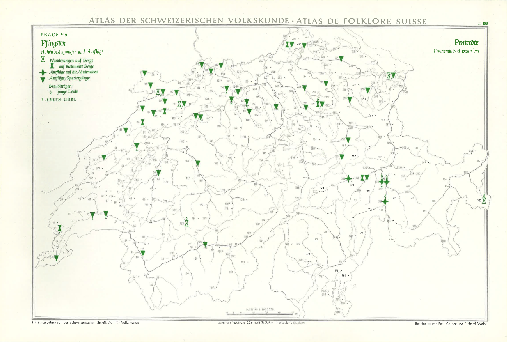

# Linked Open Usable Data for Cultural Heritage: Perspectives on Community Practices and Semantic Interoperability

PhD Thesis in Digital Humanities, completed as part of the Graduate School of Social Sciences' ({{ "G3S" | abbr | safe }}) doctoral programme. It was successfully defended on 18 November 2024 ([slides](https://julsraemy.ch/prezi/loud4ch-doctoral-examination.html)).

This page will host a lightweight {{ "HTML" | abbr | safe }} version of my thesis, optimised for easy access and readability. The PDF version (e-dissertation) is available on the University of Basel's repository: https://doi.org/10.5451/unibas-ep96807. 

Page in construction (please be patient ⌛)

##### Author 

- Dr. Julien A. Raemy (University of Basel) <a href="https://orcid.org/0000-0002-4711-5759" target="_blank">

https://orcid.org/0000-0002-4711-5759
</a>

##### Supervisors 
- Prof. Dr. Peter Fornaro (University of Basel) <a href="https://orcid.org/0000-0003-1485-4923" target="_blank">

https://orcid.org/0000-0003-1485-4923
</a>
- Prof. Dr. Walter Leimgruber (University of Basel) 
- Dr. Robert Sanderson (Yale University) <a href="https://orcid.org/0000-0003-4441-6852" target="_blank">

https://orcid.org/0000-0003-4441-6852
</a>

## Abstract {id="abstract"}

Digital technologies have fundamentally transformed how Cultural Heritage (CH) collections are accessed and engaged with. [Linked Open Usable Data](loud.html) ({{ "LOUD" | abbr | safe }}) specifications, including the [International Image Interoperability Framework (IIIF) Presentation API 3.0](https://iiif.io/api/presentation/3.0/), [Linked Art](https://linked.art), and the [W3C Web Annotation Data Model](https://www.w3.org/TR/annotation-model/), have emerged as web standards to facilitate the description and dissemination of these valuable resources. Despite the widespread adoption of {{ "IIIF" | abbr | safe }}, implementing {{ "LOUD" | abbr | safe }} specifications, particularly in combination, remains challenging. This is especially evident in the development and assessment of infrastructures, or sites of assemblage, that support these standards.

This research is guided by two perspectives: community practices and semantic interoperability. The first perspective assesses how organizations, individuals, and apparatuses engage with and contribute to the consensus-making processes surrounding {{ "LOUD" | abbr | safe }}. By examining these practices, the social fabrics of the {{ "LOUD" | abbr | safe }} ecosystem can be better understood. The second perspective focuses on making data meaningful to machines in a standardized, interoperable manner that promotes the exchange of well-formed information. This research is grounded in the {{ "SNSF" | abbr | safe }}-funded project, [Participatory Knowledge Practices in Analogue and Digital Image Archives](pia.html) ({{ "PIA" | abbr | safe }}) (2021–2025), which aims to develop a citizen science platform for three photographic collections from the Cultural Anthropology Switzerland ({{ "CAS" | abbr | safe }}) archives. Actor-Network Theory ({{ "ANT" | abbr | safe }}) forms the theoretical foundation, aiming to describe the collaborative structures of the {{ "LOUD" | abbr | safe }} ecosystem and emphasize the role of non-human actors.

Beyond its implementation within the {{ "PIA" | abbr | safe }} project, this research includes an analysis of the social dynamics within the {{ "IIIF" | abbr | safe }} and Linked Art communities and an investigation of Yale's Collections Discovery platform, [LUX](https://lux.collections.yale.edu/). The research identifies socio-technical requirements for developing specifications aligned with {{ "LOUD" | abbr | safe }} principles. It also examines how the implementation of {{ "LOUD" | abbr | safe }} standards in {{ "PIA" | abbr | safe }} highlights their potential benefits and limitations in facilitating data reuse and broader participation. Additionally, it explores Yale University's large-scale deployment of {{ "LOUD" | abbr | safe }} standards, emphasizing the importance of ensuring consistency between Linked Art and {{ "IIIF" | abbr | safe }} resources within the LUX platform for the {{ "CH" | abbr | safe }} domain.

The core methodology of this thesis is an actor- and practice-centered inquiry, focusing on a detailed examination of specific cosmologies within {{ "LOUD" | abbr | safe }}-driven communities, {{ "PIA" | abbr | safe }}, and LUX. This micro-perspective approach provides rich empirical evidence to unravel the intricate web of cultural processes and constellations in these contexts.

Key empirical findings indicate that {{ "LOUD" | abbr | safe }} enhances the discoverability and integration of data in {{ "CH" | abbr | safe }}, requiring community-driven consensus on model interoperability. However, significant challenges include engaging marginalized groups, sustaining long-term participation, and balancing technological and social factors. Strategic use of technology and the capture of digital materiality are critical, but {{ "LOUD" | abbr | safe }} also poses challenges related to resource investment, data consistency, and the broader implementation of complex patterns.

{{ "LOUD" | abbr | safe }} should lead efforts to improve the accessibility and usability of {{ "CH" | abbr | safe }} data. The community-driven methodologies of {{ "IIIF" | abbr | safe }} and Linked Art inherently foster collaboration and transparency, making these standards essential tools in evolving data management practices. Even for institutions and projects that do not adopt these specifications, the socio-technical practices of {{ "LOUD" | abbr | safe }} offer vital insights into effective digital stewardship and strategies for community engagement.

**Keywords**: Actor-Network Theory; Community of Practice; Cultural Anthropology Switzerland; Cultural Heritage; Digital Infrastructure; International Image Interoperability Framework; Knowledge Practices; Linked Art; Linked Data; LUX; Participatory Archives; Photographic Archives; Semantic Interoperability; Web Annotation Data Model

## Table of Contents {id="toc"}

1. [Introduction](#cha:intro) 
2. [Context](#cha:context)
3. [Interlinking Cultural Heritage Data](#cha:literature)
4. [Exploring Relationships through an Actor-Network Theory Lens](#cha:theoretical)
5. [Research Scope and Methodology](#cha:scope)
6. [The Social Fabrics of IIIF and Linked Art](#cha:social-fabrics)
7. [PIA as a Laboratory](#cha:pia-laboratory)
8. [Yale’s LUX and LOUD Consistency](#cha:lux-consistency)
9. [Discussion](#cha:discussion)
10. [Conclusion](#cha:conclusion)

## 1. Introduction {id="cha:intro"}

Since its inception in 2011, the {{ "IIIF" | abbr | safe }} has revolutionised[^1] the accessibility of image-based resources. Initially driven by the needs of manuscript scholars, {{ "IIIF" | abbr | safe }} focused on two-dimensional images, but has since expanded to encompass a wide range of image-based resources, including audiovisual materials and, in the near future, {{ "3D" | abbr | safe }} images. Similarly, Linked Art, formally established in 2017, initially concentrated on art museum objects but has since broadened its scope to model a variety of {{ "CH" | abbr | safe }} entities, leveraging {{ "CIDOC-CRM" | abbr | safe }}, a renowned ontology in the museum and {{ "DH" | abbr | safe }} space. Both initiatives aim to break down silos: {{ "IIIF" | abbr | safe }} focuses on improving the presentation of digital objects, while both initiatives enhance their dissemination. Together, they make {{ "CH" | abbr | safe }} data more accessible through {{ "IIIF" | abbr | safe }} and more meaningful through Linked Art for machines. These efforts have primarily benefited the {{ "CH" | abbr | safe }} domain. 

A key commonality is that the main {{ "API" | abbr | safe }}s these communities create align with the {{ "LOUD" | abbr | safe }} design principles, either intentionally or empirically demonstrated through use cases. These principles enable software developers to develop compliant tools and services without needing to fully understand {{ "RDF" | abbr | safe }}, a syntax for representing information on the web. Additionally, they may not need to grasp all {{ "LOD" | abbr | safe }} principles, which promote the interlinking of data from diverse datasets using tools like {{ "KOS" | abbr | safe }} such as thesauri. {{ "WADM" | abbr | safe }}, a {{ "W3C" | abbr | safe }} standard, is also recognised as a {{ "LOUD" | abbr | safe }} specification. It provides a framework for creating interoperable annotations on web resources, facilitating the linking and sharing of data across different platforms and applications. These {{ "LOUD" | abbr | safe }} design principles include the right abstraction for the audience, few barriers to entry, comprehensibility by introspection, documentation with working examples, and the use of many consistent patterns rather than few exceptions. Additionally, both {{ "IIIF" | abbr | safe }} and Linked Art are driven by vibrant communities, mainly comprising {{ "GLAM" | abbr | safe }} and higher education institutions. 

While the standards and principles discussed have broad applications, it is important to clarify the scope of this dissertation. This work does not focus on {{ "KG" | abbr | safe }}s by assessing triplestores -- databases specifically designed to store and retrieve triples, which are the fundamental data structures in {{ "RDF" | abbr | safe }}. Similarly, it does not deal with evaluating {{ "SPARQL" | abbr | safe }} engines, which are specifically designed to query {{ "KG" | abbr | safe }}s. Additionally, this dissertation does not address the intersection of {{ "ML" | abbr | safe }} and {{ "IIIF" | abbr | safe }}, or the ontological reasoning of Linked Art. 

Instead, this dissertation concentrates on {{ "LOUD" | abbr | safe }}, the consistency of its standards, design principles and the vibrant communities behind it. It examines {{ "JSON-LD" | abbr | safe }} serialisation efforts and the crucial intersection required to establish robust semantic interoperability baselines between presentation and semantic layers. It also presents real-world use case implementations, both on a small scale in a laboratory and flexible space within the {{ "PIA" | abbr | safe }} research project, and on a large scale at Yale, exemplified by the LUX platform that provides access to (meta)data from {{ "YUL" | abbr | safe }}, {{ "YCBA" | abbr | safe }}, {{ "YUAG" | abbr | safe }}, and {{ "YPM" | abbr | safe }}. 

The focus is therefore on digital infrastructures capable of delivering {{ "JSON-LD" | abbr | safe }} files from the above specifications, which are primarily, though not exclusively, {{ "CH" | abbr | safe }} resources. It is more about the different actors -- both human and non-human -- that create and maintain these interconnected systems and the dynamic interactions that sustain them. The deployment of various {{ "LOUD" | abbr | safe }} specifications addresses the need for semantic interoperability between {{ "CH" | abbr | safe }} resources and disparate datasets by establishing a standardised approach to representing and linking data, ensuring that information can be seamlessly shared and understood across different platforms and contexts. 

This dissertation seeks to carve out a distinct niche by addressing an often-overlooked aspect of {{ "IIIF" | abbr | safe }} and Linked Art. {{ "IIIF" | abbr | safe }} is sometimes perceived and studied merely as a service or an appendix, with the content it delivers taking precedence. However, this PhD thesis positions {{ "IIIF" | abbr | safe }} as a first-class citizen worthy of in-depth study. Similarly, Linked Art, despite its potential and its relatively recent establishment, has been the subject of very few scholarly papers. This gap underscores the significance of {{ "LOUD" | abbr | safe }} in this context. Furthermore, this thesis elevates Linked Art to a position of primary importance, recognising its significance and advocating for its thorough examination. To thoroughly study {{ "LOUD" | abbr | safe }} and its adherence to design principles, it is essential to immerse ourselves actively in both communities -- an approach I have embraced for years. The thesis also emphasises the importance of participatory efforts and collaboration between research projects, which typically have shorter lifespans, and memory institutions, which need to implement technical standards as a *lingua franca*. In doing so, it reveals the mediating role of {{ "LOUD" | abbr | safe }} in advancing the heritage sphere. To truly understand {{ "IIIF" | abbr | safe }}, Linked Art, and to a lesser extent {{ "WADM" | abbr | safe }}, it is crucial to examine the social fabrics and consensus decision-making of each community. Among these considerations are how the specifications can be implemented pragmatically, and how the standards can support the implementation and maintenance of more extensive semantic interoperability efforts. 

The significance of this research lies in highlighting the commitment and diligence of the individuals and organisations that make up both the {{ "IIIF" | abbr | safe }} and Linked Art communities. It aims to demonstrate that community-driven practices, such as those exemplified by {{ "IIIF" | abbr | safe }} and Linked Art, have a potential that goes beyond the mere sharing of digital objects and their associated metadata. The more people who embrace these approaches and implement the associated specifications, the more society as a whole will benefit. Furthermore, this research illustrates that {{ "IIIF" | abbr | safe }} is no longer limited to two-dimensional images, that Linked Art is not restricted to artworks, and that {{ "WADM" | abbr | safe }} is a simple, content-agnostic standard that can be easily integrated into a range of systems. This adaptability is a strength of {{ "LOUD" | abbr | safe }} standards, which are designed to be simple yet effective. {{ "LOUD" | abbr | safe }} can serve a variety of purposes, primarily rooted in {{ "CH" | abbr | safe }}, but with the potential to extend its benefits to other sectors. The true beauty of {{ "LOUD" | abbr | safe }} lies in its ability to foster networking opportunities and transparent socio-technical practices, demonstrating its value beyond mere technical implementation. 

By emphasising these aspects, this dissertation highlights the wider impact of {{ "LOUD" | abbr | safe }} in promoting semantic interoperability and enhancing collaborative efforts within the heritage field and beyond. In addition, the implementation of standards through {{ "PIA" | abbr | safe }} underlines the potential for similar participatory or citizen science projects, while the LUX initiative serves as an illustrative example of robust infrastructure and cross-unit engagement. These examples demonstrate the practical applications and far-reaching implications of adopting {{ "LOUD" | abbr | safe }} standards in different contexts. 

This dissertation is structured across ten chapters, each building upon the previous ones up to Chapter 5 to provide a comprehensive understanding of the research. These initial chapters lay the foundation of the study, establishing the context, theoretical framework, and methodological approaches. After this foundational section, Chapters 6, 7, and 8 present empirical studies that, while interconnected, can be read independently if desired. These chapters offer detailed insights into specific aspects of the research and can be appreciated on their own or as part of the broader narrative.

The thesis continues with [Chapter 2](#cha:context), which extends this introduction by providing more information about the research setting, specifically {{ "PIA" | abbr | safe }}. [Chapter 3](#cha:literature) follows with an extensive literature review, offering a comprehensive overview of methods to interlink {{ "CH" | abbr | safe }} data. Next, [Chapter 4](#cha:theoretical) presents the theoretical framework, conceptualised as a toolbox and firmly rooted in {{ "ANT" | abbr | safe }}, guiding the analysis and discussion throughout the dissertation. Following this, [Chapter 5](#cha:scope) details the research scope and methodology, explaining the approaches and methods employed in the study.

Moving on to the empirical work, [Chapter 6](#cha:social-fabrics) sheds light on the social fabrics of {{ "IIIF" | abbr | safe }} and Linked Art, exploring the communities and practices that underpin these initiatives.[Chapter 7](#cha:pia-laboratory) then examines the implementation of {{ "LOUD" | abbr | safe }} standards
within {{ "PIA" | abbr | safe }}, highlighting the practical aspects and challenges encountered. This is followed by [Chapter 8](#cha:lux-consistency), which focuses on the LUX initiative at Yale, examining the underlying governance and interdepartmental ownership of the Yale Collections Discovery platform. The discussion of findings is presented in [Chapter 9](#cha:discussion), where the results from the empirical chapters are synthesised and analysed in relation to the theoretical framework. Finally, [Chapter 10](#cha:conclusion) concludes
the thesis, summarising the key insights and contributions of the
research while outlining potential directions for future study.

## 2. Context {id="cha:context"}

In this chapter, I will set the stage for my PhD thesis by providing important background information. First, in [Section 2.1](#sec:title), I will explain why I chose the title for my thesis. This will give you an understanding of the main focus and the direction of my research. Next, in , I will describe the {{ "PIA" | abbr | safe }} research project, which is central to my work. This section will cover the project's goals, significance, and overall framework. In , I will detail my specific contributions to the {{ "PIA" | abbr | safe }} project. I will emphasise how my work fits into the larger project and its importance to my thesis. Finally, in , I will talk about my active participation in the {{ "IIIF" | abbr | safe }} and Linked Art communities. This section will highlight how my involvement in these communities has influenced my research and its broader implications.

### 2.1 PhD Title {id="sec:title"}

I chose the title ‘Linked Open Usable Data for Cultural Heritage: Perspectives on Community Practices and Semantic Interoperability’ as it encapsulates the essence of my research focus but I could have indeed chosen other ones.

During the initial stages of my research, multiple working titles were explored to capture the diverse facets of my interests and objectives. If I was quite sure about having in the title after the third iteration, I was quite unsure of what should follow and if a subtitle was actually needed at all. Amidst this dynamic progression, the underlying theme of my research remained steadfast -- to delve into the transformative potential of {{ "LOUD" | abbr | safe }} for {{ "CH" | abbr | safe }}.

I also opted to maintain in the title of my thesis subsection. While holds its appeal, my choice reflects a broader narrative that acknowledges the crucial role of {{ "CHI" | abbr | safe }}s and spotlighting the multifaceted nature of heritage preservation, encapsulating both its digital facets and the essential contribution of individuals and institutions in curating, interpreting, and making heritage accessible. 

As for the subtitle, while I do explore {{ "CoP" | abbr | safe }} as defined by @lave_situated_1991 and @wenger_communities_2011 through investigating the social fabrics of the {{ "IIIF" | abbr | safe }} and Linked Art communities, my main interest lies in the broader application of {{ "LOUD" | abbr | safe }} for describing and interlinking {{ "CH" | abbr | safe }} resources. Thus, I decided to opt for the more generic as the first axis or perspective. 

For the second perspective, I wanted to see how semantic interoperability can be achieved through standards adhering to the {{ "LOUD" | abbr | safe }} design principles, as they seem to be key enablers for seamless collaboration and knowledge exchange among practitioners. There was a time in my research when I envisaged decoupling and , perceiving them as two distinct dimensions. However, what really captivates me is the unification of these factors to facilitate collective reasoning for both humans and machines. 

In summary, this title reflects my enthusiasm for using web-based and community-driven technologies to transform the way we understand, share and value {{ "CH" | abbr | safe }}.

### 2.2 The PIA Research Project {id="sec:pia"}

I undertook my doctoral studies within the scope of the {{ "PIA" | abbr | safe }} research project financed by the {{ "SNSF" | abbr | safe }} under their Sinergia funding scheme from February 2021 to January 2025[^3]. The project aimed to analyse the interplay of participants, epistemological orders and the graphical representation of information and knowledge in relation to three photographic collections from {{ "CAS" | abbr | safe }}. It sought to bring together the world of data and things in an interdisciplinary manner, exploring the phases of the analogue and digital archive from a cultural anthropological, technical and design research perspective [@felsing_community_2023 p. 42]. As part of this endeavour, interfaces were developed to enable the collaborative indexing and use of photographic archival records [@chiquet_participatory_2023 p. 110]. I discuss in more detail the interdisciplinary components and briefly introduce the people involved in the project in [Subsection 2.2.1](#subsec:interdisciplinary), then talk about the photographic collections that were the overarching narrative of the research in [Subsection 2.2.2](#subsec:sgv_collections), and lastly in [Subsection 2.2.3](#subsec:pia_vision), the vision that we had put together.

The project, divided in three interdisciplinary teams, was led by the University of Basel through the Institute for Cultural Anthropology and European Ethnology[^4] (Team A) and the {{ "DHLab" | abbr | safe }}[^5] in collaboration with the {{ "DBIS" | abbr | safe }} group (Team B) as well as by the {{ "HKB" | abbr | safe }}[^6], an art school and department of the Bern University of Applied Sciences (Team C) [@felsing_community_2023 p. 43]. [Table 2.1](#tab:pia-team) lists the people who contributed to the project, broken down by the three teams and their particular perspectives.

<figure id="tab:pia-team" style="text-align: center;">
  <figcaption><strong>Table 2.1</strong>: PIA Team Core Members</figcaption>
  
  <table style="margin: 1em auto;">
    <thead>
      <tr>
        <th><strong>Perspective</strong></th>
        <th><strong>People</strong></th>
      </tr>
    </thead>
    <tbody>
      <tr>
        <td>A) Anthropological</td>
        <td>
          Prof. Dr. Walter Leimgruber, Team Leader and Dissertation Supervisor 
          Dr. Nicole Peduzzi, Photographic Restoration and Digitisation Supervisor 
          Regula Anklin, Conservation and Restoration Specialist (project partner at Anklin &amp; Assen) 
          Murielle Cornut, PhD Candidate in Cultural Anthropology 
          Birgit Huber, PhD Candidate in Cultural Anthropology 
          Fabienne Lüthi, PhD Candidate in Cultural Anthropology
        </td>
      </tr>
      <tr>
        <td>B) Technical</td>
        <td>
          Prof. Dr. Peter Fornaro, Team Leader and Dissertation Supervisor 
          Prof. Dr. Heiko Schuldt, Dissertation Supervisor (project partner at the University of Basel) 
          Dr. Vera Chiquet, Postdoctoral Researcher 
          Adrian Demleitner, Software Developer (2021-2023) 
          Fabian Frei, Software Developer (2023-2025) 
          Christoph Rohrer, Software Developer (2023-2025) 
          Julien A. Raemy, PhD Candidate in Digital Humanities 
          Florian Spiess, PhD Candidate in Computer Science
        </td>
      </tr>
      <tr>
        <td>C) Communicative</td>
        <td>
          Dr. Ulrike Felsing, Team Leader and Dissertation Supervisor 
          Prof. Dr. Tobias Hodel, Dissertation Supervisor (project partner at the University of Bern) 
          Daniel Schoeneck, Research Fellow 
          Lukas Zimmer, Designer (project partner at A/Z&amp;T) 
          Max Frischknecht, PhD Candidate in Digital Humanities
        </td>
      </tr>
    </tbody>
  </table>
</figure>

#### 2.2.2 Photographic Collections/Archives as Anchors {id="subsec:sgv_collections"}

{{ "CAS" | abbr | safe }} has historically been engaged in active collaborations that bridge the academic research and the public sphere, primarily through traditional analogue methods. The {{ "PIA" | abbr | safe }} project was created with the intention of exploring the complexities inherent in both analogue and digital approaches, and to encourage and investigate these collaborative endeavours between academia and the wider public. As such, {{ "PIA" | abbr | safe }} represents a paradigm shift within the scope of projects associated with or supported by {{ "CAS" | abbr | safe }}, facilitating the seamless integration of digital tools to explore multiple facets of participation and engagement. This transformative endeavour embodies a profound exploration of new intersections where scholarly endeavours intertwine with the active involvement of citizens.

{{ "PIA" | abbr | safe }} drew on three collections: one focusing on scientific cartography and titled (*Atlas der Schweizerischen Volkskunde*), a second from the estate of the photojournalist Ernst Brunner (1901--1979), and a third collection consisting of vernacular photography which was owned by the Kreis Family (1860--1970).

**SGV_05 {{ "ASV" | abbr | safe }}** consists of 292 maps and 1000 pages of commentary published from 1950 to 1995 --- an example of such a map is shown in [Figure 2.1](#fig:sgv-atlas). This collection was commissioned by the {{ "CAS" | abbr | safe }} to do an extensive survey of the Swiss population in the 1930s and 1940s on many issues pertaining, for instance, to everyday life, local laws, superstitions, celebrations or labour [@weiss_atlas_1940]. The contents were compiled by researchers and by people who were described as [^11]. Questions were asked about everyday habits, community rights, work, trade, superstitions, and many other topics [@schmoll_richard_2009; @schmoll_vermessung_2009]. This collection offers a snapshot of everyday life in Switzerland right before the beginning of a modernisation process that fundamentally changed lifestyles in all areas during the postwar period. A digitised version of the {{ "ASV" | abbr | safe }} would not only allow the results of that time to be enriched with further findings  [@schranz_critical_2021], but would also make transparent how knowledge was generated in cartographic form through a complex process along different types of media and actors. The restoration, digitisation, cataloguing and indexing efforts took all part throughout {{ "PIA" | abbr | safe }} under the supervision of Birgit Huber, who extensively based her doctoral research on this particular collection [see @huber_entdeckung_2023].

<figure id="fig:sgv-atlas" style="margin: 0 auto; text-align: center;">
  

  <figcaption>
    <strong>Figure 2.1</strong>: 
    Map from the SGV_05 Collection Relating to Question 93 Showing Walks and Excursions at Pentecost. {{ "ASV" | abbr | safe }}. {{ "CAS" | abbr | safe }}. CC BY-NC 4.0
  </figcaption>
</figure>

**SGV_10 Kreis Family** comprises approximately 20,000 loose photographic objects, where a quarter of them are organised and kept in 93 photo albums --- as illustrated by [Figure 2.2](#fig:sgv-kreis), from a wealthy Basel-based family and spanning from the 1850s to the 1980s. This private collection was acquired by {{ "CAS" | abbr | safe }} in 1991. The collection, which originally arrived in banana cases and was enigmatic due to the lack of clear organisation or accompanying information from the family, posed significant challenges. Despite these initial hurdles, {{ "CAS" | abbr | safe }} undertook meticulous efforts to catalogue and preserve its contents [@felsing_re-imagining_2024 p. 42]. The pictures were taken by studio photographers as well as by family members themselves. The Kreis Family collection represents a typical example of urban bourgeois culture and gives a comprehensive insight into the development of private photography over the course of a century [@pagenstecher_private_2009]. The photographic materials and formats are very diverse, ranging from prints to negatives, small, medium or large format photographs, black and white or colour. The collection also encompasses many photographic techniques, from the one-off daguerreotypes and ferrotypes, to the glass-based negatives that could be reproduced *en masse*, to the modern paper prints. While some of the albums and loose images were restored and digitised during the 2014 project, much of this work was completed during {{ "PIA" | abbr | safe }} and overseen by Murielle Cornut, whose doctoral investigation was centred on the study of photo albums [see @cornut_open_2023].

<figure id="fig:sgv-kreis" style="margin: 0 auto; text-align: center;">
  

  <figcaption>
    <strong>Figure 2.2</strong>: 
    A photo Album Page from the SGV_10 Collection, Bearing the Following Inscription: 
    <em>Botanische Excursion ins Wallis, Pfingster 1928</em>. 
    SGV_10A_00031_015. Kreis Family. {{ "CAS" | abbr | safe }}. 
    CC BY-NC 4.0
  </figcaption>
</figure>

**SGV_12 Ernst Brunner** is a donation of about 48,000 negatives and 20,000 prints to the {{ "CAS" | abbr | safe }} archives from Ernst Brunner, a self-taught photojournalist, who lived from 1901 to 1979 and who documented mainly in the 1930s and 1940s a wide range of folkloristic themes --- as shown by [Figure 2.3](#fig:sgv-brunner). He is one of the most important photographers of the era and one of the most outstanding visual chroniclers of Swiss society [@pfrunder_ernst_1995]. His photographs show rural lifestyles, but also urban motifs. In his late work, he led the documentation and research on farmhouses in a specific Swiss district, a project initiated by {{ "CAS" | abbr | safe }}. Before Ernst Brunner became an independent photojournalist in the mid-1930s, he worked as a carpenter, influenced by the ideas of the *Bauhaus* and *Neues Bauen* movements. This can also be seen in the aesthetics and formal language of his photography. If all the black and white negatives were digitised and recorded between 2014 and 2018, the digitisation of prints, which is a selection done by Ernst Brunner, was conducted at the end of the {{ "PIA" | abbr | safe }} research project. The latter was supervised by Fabienne Lüthi, whose PhD was about organisational systems and knowledge practices in the Ernst Brunner Collection.

<figure id="fig:sgv-brunner" style="margin: 0 auto; text-align: center;">
  

  <figcaption>
    <strong>Figure 2.3</strong>: 
    Picture from the SGV_12 Collection Showing Walkers Looking at the Timetable Train. 
    [Wanderer studieren den Fahrplan in der Bahnhofhalle]. 
    Lucerne, 1938. Ernst Brunner. SGV_12N_00716. {{ "CAS" | abbr | safe }}. 
    CC BY-NC 4.0
  </figcaption>
</figure>

Whereas for each of the PhD Candidates in Cultural Anthropology, a particular collection was assigned to them and its content was to varying degrees part of their subject of study, this was not exactly the same for the PhD Candidates in {{ "DH" | abbr | safe }}, including myself, and in Computer Science. Put differently, we had relative leeway in terms of what interested us in each or all of these three photographic collections. In my case, I briefly explain my contribution to the project more in and then in as part of the empirical portion of my thesis focusing on the deployment of {{ "LOUD" | abbr | safe }} specifications using the three {{ "CAS" | abbr | safe }} photographic collections.

Florian Spiess focused on the use of {{ "VR" | abbr | safe }} through vitrivr, a multimedia retrieval system developed by the {{ "DBIS" | abbr | safe }} research group at the Department of Mathematics and Computer Science [@spiess_multimodal_2022; @spiess_forschung_2023; @spiess_exploring_2024]. His work included experiments with {{ "PIA" | abbr | safe }}-related collections, such as the creation of virtual galleries clustered according to content-based similarity [see @peterhans_automatic_2022]. In the case of Max Frischknecht, his doctoral research centred on generative design[^12], a methodology to visualise dynamic cultural archives. He mostly worked on the {{ "ASV" | abbr | safe }} collection and on a mapping tool which is a cartographic visualisation designed to explore the {{ "CAS" | abbr | safe }} photographic archives [see @frischknecht_generating_2022; @eggmann_digitalisierung_2024].

It should also be mentioned that not only did we use the three collections of the {{ "CAS" | abbr | safe }} photographic archives within the project, but that both formal and informal meetings took place most commonly within the photographic archives at the Spalenvorstadt premises in the old Gewerbemuseum and later either at the on Allschwilerstrasse, though less frequently, or at Rheinsprung where the Institute for Cultural Anthropology and European Ethnology is located. This meant that there was a strong and sometimes blurred entanglement between those involved in the archives and the {{ "PIA" | abbr | safe }} core team members.

#### 2.2.3 Project Vision {id="subsec:pia_vision"}

Between December 2021 and March 2022, we worked together to develop and finalise a vision for the project[^13]. It includes seven key priorities, or pillars, which were meant to strengthen the interdisciplinary perspectives of {{ "PIA" | abbr | safe }}. Although ambitious, these elements were of paramount importance to us and served as a guiding blueprint for all {{ "PIA" | abbr | safe }} activities. Hereafter is a modified version of the vision[^14] taken from @cornut_annotations_2023 [p. 4].

1.  **Accessibility** by developing open interfaces and offering the     possibility of expanding the archive and turning it into an     instrument of current research that collects and evaluates knowledge     with the participation of other users (Citizen Science).

2.  **Heterogeneity** by making visible where, why and under what     circumstances the objects were created, how they were handled and     what path they have taken to get to and in the archive. We work on     visualisations that take into account the heterogeneous character of     archival materials and make their respective biographies visible.

3.  **Materiality** by conveying the material properties of the objects:     they have front and back sides, inscriptions, traces, development     errors, they are transparent, multi-layered or fabric-covered. They     tell of their origin, use, and peculiarities. We want to make this     knowledge accessible and understandable in digital form. To this     end, we also consider the necessary infrastructure involved in the     creation as part of their narrative: the restoration, the     relocation, the indexing, the storage devices, the research tools,     the display medium, as well as the process of repro-photography.

4.  **Interoperability** as a crucial component and which will be done     by supporting digital means that allow different stakeholders to     freely access and interact with the project's data. Both humans and     machines can use, contribute to, correct and annotate the existing     data in an open and interoperable manner, thus encouraging exchange     and the creation of new knowledge. To do this, we use web-based     standards that are widely adopted in the cultural heritage field.

5.  **Affinities** by leveraging data models and pattern recognition     which can uncover semantic relationships between entities that were     previously incomplete or difficult for users to access. Using     specific interfaces and visualisations, we make it possible to     explore digital assets and discover forms of relationships and     similarities between images.

6.  **{{ "AI" | abbr | safe }}** that     facilitates automated searches for simple image attributes such as     colour, shapes, and localisation of image components. It should also     become possible to recognise texts and object types for extracting     metadata.

7.  **Bias Management** by taking into account that associated metadata     was human-made[^15] and thus is never objective. Collections and     their metadata reflect biases or focus narrowly on selected areas     and perceptions. Machines working on the basis of such data     automatically reproduce the implicit biases in decision-making due     to so-called biased algorithms. Therefore, understanding the data     used for training and the algorithms applied for decision making is     crucial to ensure the integrity of the application of these     technologies in archives. We take ethical issues into account when     using {{ "AI" | abbr | safe }} and     visualisations, because the higher the awareness of a possible bias,     the faster it can be detected or brought up for consideration with     users.

As my thesis is notably concerned with semantic interoperability, **Interoperability** and **Affinities** are of particular importance to my PhD thesis, although I recognise the importance of all pillars. Each of these resonated with me and my fellow PhD Candidates. As we immersed ourselves in the vision of the {{ "PIA" | abbr | safe }} research project, it became a unifying thread that brought us together in our research ambitions. We found that all these priorities within the project spoke to us at different points and provided a strong point of communication and practice in the development of processes, prototypes or interfaces.

#### 2.3 Contribution to PIA and its Relevance to the Thesis {id="#sec:pia-contribution"}

To develop a participatory platform, an open and sustainable technological foundation for facilitating the reuse of {{ "CH" | abbr | safe }} resources was needed [@raemy_applying_2021]. Throughout the {{ "PIA" | abbr | safe }} project, I was mainly involved in the extension of the data infrastructure, the uptake of {{ "IIIF" | abbr | safe }} as well as designing the data model, leveraging Linked Art and {{ "WADM" | abbr | safe }} [@raemy_interlinking_2024]. As a member of Team B, I undertook this PhD as a bridge between the different teams, mostly participating in discussions with the three doctoral candidates from Team A to further develop and agree on the {{ "CAS" | abbr | safe }} data model and with the software developers from my team to discuss the impact of the data model on our evolving --- yet transitory --- infrastructure as well as helping in implementing the {{ "API" | abbr | safe }}s adhering to the {{ "LOUD" | abbr | safe }} design principles.

It was necessary to redesign the data model within the context of a database migration, from Salsah to the {{ "DSP" | abbr | safe }}, that happened between November 2021 and March 2024. This updated version, based on the Knora Base Ontology[^16], corresponded to the needs of the {{ "CAS" | abbr | safe }} archives and to some extent to those of {{ "PIA" | abbr | safe }}, in particular to enable the PhD Candidates in Cultural Anthropology to make more precise assertions, whether in terms of descriptive metadata, or in the ability to link one object to another or to provide comments on these objects in several narrative forms.

Moreover, an assessment of the appropriate technical standards for improved usability of the objects by both humans and machines was carried out, as a basis for extending the capabilities provided by {{ "DaSCH" | abbr | safe }}, such as helping the software developers to implement {{ "SIPI" | abbr | safe }}[^17], a `C++` image server compatible with the {{ "IIIF" | abbr | safe }} Image {{ "API" | abbr | safe }} and build services that create {{ "IIIF" | abbr | safe }} Presentation API 3.0 resources.

While the theoretical framework of the thesis extends across the scope of {{ "PIA" | abbr | safe }}, the empirical part focuses on a specific set of findings derived from the research project outlined in , under the title . In this chapter, I discuss the data model and its refinement as well as the generation of custom {{ "IIIF" | abbr | safe }} Manifests during the specific digitisation, cataloguing and indexing efforts that took place throughout the project for the three {{ "CAS" | abbr | safe }} collections (SGV_05, SGV_10 and SGV_12) under investigation, the implementation of {{ "LOUD" | abbr | safe }} standards, and the overall design of the technological underpinnings.

#### 2.4 Involvement within the IIIF and Linked Art communities {id="#sec:involvement_iiif_la"}

I must acknowledge the invaluable role that my involvement within the {{ "IIIF" | abbr | safe }} and Linked Art communities has played in shaping my journey as a trained information specialist and an aspiring {{ "DH" | abbr | safe }} practitioner. Being an active participant in both communities has not only broadened my understanding of the latest developments in the field but has also profoundly influenced the trajectory of this dissertation.

I have been involved within the {{ "IIIF" | abbr | safe }} community since October 2016 and the Working Groups Meeting that happened in The Hague[^18]. This significant journey was, in fact, initiated by a recommendation from my first supervisor, Peter Fornaro, during my time as an undergraduate doing an internship at the {{ "DHLab" | abbr | safe }}. Little did I know that this recommendation would lead me to be carrying out a PhD and looking at {{ "IIIF" | abbr | safe }} not only as community-driven standards but as an object of study. Engaging with the {{ "IIIF" | abbr | safe }} community exposed me to cutting-edge advances in image interoperability and standards, and fostered a deeper appreciation for the importance of digital representations of cultural heritage. Through collaborative discussions with experts from diverse backgrounds, I gained new perspectives on the potential of technology to advance humanities research and preserve our collective cultural memory.

Similarly, my involvement in the Linked Art community introduced me to the opportunities offered by {{ "LOUD" | abbr | safe }} and its transformative impact on research discourse. Exposure to Linked Data methodologies and the {{ "CIDOC-CRM" | abbr | safe }} has significantly influenced the way I have structured and interpreted the data in this dissertation, thereby enriching its scholarly breadth and rigour. I started to be actively involved in Linked Art at the beginning of my PhD in 2021, but I was already a by 2020, driven by the efforts of Rob Sanderson, my third supervisor. By mid-2023, I had become a member of the Editorial Board.

The individuals I have met and the knowledge shared in these vibrant communities have deeply informed my approach as a scholar. The invaluable connections and collaborations I have made have expanded my network of fellow researchers, educators, and experts, leading to fruitful discussions that have significantly shaped the research questions addressed in this thesis. The events and workshops organised by these communities have also provided immersive learning experiences, giving me first-hand insights into the tools, technologies and methodologies used in the context of describing and disseminating {{ "CH" | abbr | safe }} data. The dynamic ecosystem of these communities has served as an inspiring backdrop, fostering innovative thinking and encouraging a more holistic approach to my research.

## 3. Interlinking Cultural Heritage Data {id="cha:literature"}

Interlinking {{ "CH" | abbr | safe }} data is an important aspect of publishing heritage collections over the web, in particular by using {{ "LOD" | abbr | safe }} technologies to make assertions more easily readable and meaningful to machines [@marcondes_integrated_2021]. Due to the complexity of {{ "CH" | abbr | safe }} data and their intrinsic inter-relationships, it is necessary to define its nature and introduce controlled vocabularies and ontologies that can be integrated with existing web standards and interoperable with relevant platforms [@bruseker_cultural_2017; @hyvonen_using_2020].

Efforts to interlink {{ "CH" | abbr | safe }} data have brought about significant advancements, but challenges remain. One such challenge is finding a balance between completeness and precision of expression to ensure that the that {{ "CH" | abbr | safe }} data remain accessible and usable to a wider audience. Addressing this challenge, the Linked Open Usable Data ({{ "LOUD" | abbr | safe }}) design principles and the specifications that adhere to those, such as the {{ "IIIF" | abbr | safe }} Presentation {{ "API" | abbr | safe }} 3.0 and Linked Art, offer a promising approach [@raemy_enabling_2023]. By focusing on usability aspects from the perspective of software developers and data scientists involved in designing visualisation tools and data aggregation approaches, {{ "LOUD" | abbr | safe }} strives to enhance the overall user experience [@sanderson_keynote_2019].

Finding this equilibrium becomes crucial as {{ "CH" | abbr | safe }} data continues to grow in complexity and size, necessitating the seamless integration of native web technologies. The {{ "LOUD" | abbr | safe }} concept cultivates an environment that encourages the formation of vibrant {{ "CoP" | abbr | safe }} and the seamless integration of native web technologies, wherein an essential principle is the availability of comprehensive documentation supplemented with practical examples [@raemy_ameliorer_2022]. Moreover, the emphasis on leveraging widely adopted technologies enhances the interoperability of data and promotes its wider dissemination. With {{ "LOUD" | abbr | safe }} principles guiding the linking of {{ "CH" | abbr | safe }} data, the resulting web of knowledge becomes more than just a machine-readable resource; it transforms into a user-centric ecosystem where both accessibility of Linked Data and usability intersect to enable scholars and a wider audience to engage in the exploration and appreciation of {{ "CH" | abbr | safe }} [@newbury_loud_2018]. Finally, by fostering a collaborative, knowledge-sharing mindset, {{ "LOUD" | abbr | safe }} empowers software developers to implement data in a robust way, drawing insights from shared experiences [see @page_linked_2020].

In this chapter, which serves as the literature review of the PhD thesis, I attempt to draw on this brief introduction by dividing the insights into seven sections in order to provide an overview of the key concepts related to interlinking data in the {{ "CH" | abbr | safe }} domain. The literature review primarily encompasses works published up until December 2023, providing a comprehensive snapshot of the field's current state and its evolution. [Section 3.1](#sec:standout) discusses what makes {{ "CH" | abbr | safe }} data stand out and [Section 3.2](#sec:metadata) is about {{ "CH" | abbr | safe }} metadata standards, while ?????? explores the technological trends, scientific movements and guiding principles that have shaped the field. ?????? provides an overview of the web as an open platform, which are essential to understanding the current landscape of interlinking {{ "CH" | abbr | safe }} data. ?????? focuses on {{ "LOUD" | abbr | safe }}, while ?????? looks at characterising the community practices and semantic interoperability dimensions for {{ "CH" | abbr | safe }}. Finally, in ??????, I summarise key elements from each section and within each of these I give some initial thoughts with respect to {{ "LOUD" | abbr | safe }}, and then conclude the chapter with some considerations on why we as a society need to care about {{ "CH" | abbr | safe }} data.

### 3.1 What Makes Cultural Heritage Data Stand Out? {id="sec:standout"} 

Here, I aim to establish the indirect territory of my study, as I am situated on a distinct plane that focuses on web technologies and standards --- as well as software and services that enable them --- as the subjects of investigation. However, it is crucial to acknowledge that {{ "LOUD" | abbr | safe }} specifications owe their existence to the available data that have served as case studies. Thus, their significance can be best understood through the lens of data and I recognise here the pivotal role played by {{ "CH" | abbr | safe }} practitioners --- encompassing individuals from research and memory institutions --- who have had a significant impact on specifying a series of web-based standards and who have helped to move forward the discovery of {{ "CH" | abbr | safe }} data and beyond, in particular those belonging to the public domain, in an open manner.

In [Subsection 3.1.1](#subsec:cultural-heritage), I provide an introduction to {{ "CH" | abbr | safe }} as recognised by the {{ "UNESCO" | abbr | safe }}. I explore the tangible, intangible, and natural dimensions of {{ "CH" | abbr | safe }}, laying the foundation for further discussions on its representation and preservation, notably by giving a first definition of {{ "CH" | abbr | safe }} data. Next in [3.1.2](#subsec:reprez), I look at the challenges of representation and embodiment of {{ "CH" | abbr | safe }} data. This subsection examines the challenges in describing and preserving its materiality or embodied aspects. Understanding the significance of collective efforts, communities, and the interplay of technologies. Thirdly, I discuss what I called ‘Collectives and Apparatuses’ in [3.1.3](#subsec:collective-apparatus) where I highlight how actors in terms of collaborative actions and apparatuses play a pivotal role in {{ "CH" | abbr | safe }}.

#### 3.1.1 Cultural Heritage {id="subsec:cultural-heritage"}

The legacy of {{ "CH" | abbr | safe }} encompasses physical artefacts and intangible aspects inherited from past generations, reflecting the history and traditions of societies. Meanwhile, {{ "CH" | abbr | safe }} constantly evolves due to complex historical processes, necessitating preservation and protection efforts to prevent its loss over time [@loulanski_revising_2006]. The dynamic nature of {{ "CH" | abbr | safe }} demands collaborative actions, including documentation and the use of a range of technologies.

The concept of {{ "CH" | abbr | safe }} is also characterised by perpetual evolution, mirroring the historical processes that shape societies over time. Social, political, economic, and technological shifts invariably influence the definition and perception of {{ "CH" | abbr | safe }}, prompting continuous reinterpretations and reevaluations of its significance. Over the years, the enthusiasm for the protection of cultural property has enriched the term with new shades of meaning. As societies undergo transformations, new layers of meaning and relevance are superimposed on existing {{ "CH" | abbr | safe }}, perpetually enriching its essence. As articulated by [@ferrazzi_notion_2021 p. 765]:

> ‘Cultural heritage’, as an abstract legacy or as a merge of tangible and intangible values, is able to encompass the totality of culture(s); in so, assuming a symbolic value that brings a clear break with all other terminologies. In conclusion, ‘cultural heritage’ as a legal term has demonstrated more than any others to be a real ensemble of historical stratification and cultural diversity.

The advent of globalisation and rapid advancements in technology have further accelerated the evolution of {{ "CH" | abbr | safe }}. Increased interconnectedness and cross-cultural interactions have led to the fusion of traditions and the emergence of novel cultural expressions. Moreover, the digital era has facilitated the dissemination of {{ "CH" | abbr | safe }} resources on a global scale, transcending geographical barriers and preserving cultural knowledge for future generations as [@portales_digital_2018].

Thus, the intriguing nature of {{ "CH" | abbr | safe }} resources can be attributed to their multifaceted and diverse characteristics. The conservation and promotion of these resources demand a nuanced comprehension of the various types of heritage resources, culminating in effective preservation and promotion strategies that can account for their heterogeneity [@windhager_visualization_2019].

According to [@unesco_institute_for_statistics_unesco_2009], {{ "CH" | abbr | safe }} includes tangible and intangible heritage. Tangible {{ "CH" | abbr | safe }} refers to physical objects such as artworks, artefacts, monuments, and buildings, while intangible {{ "CH" | abbr | safe }} comprises practices, knowledge, folklore and traditions that hold cultural significance [@munjeri_tangible_2004]. The concept of heritage has evolved through a process of extension to include objects that were not traditionally considered part of the heritage. The criteria for selecting heritage have also changed, taking into account cultural value, identity, and the ability of the object to evoke memory. This shift has led to the recognition and protection of intangible {{ "CH" | abbr | safe }}, challenging a Eurocentric perspective and embracing cultural diversity as a valuable asset for humanity [@vecco_definition_2010].

Conservation guidelines have broadened the concept of heritage to include not only individual buildings and sites but also groups of buildings, historical areas, towns, environments, social factors, and intangible heritage [@ahmad_scope_2006]. In 2019, another instance of {{ "UNESCO" | abbr | safe }} defines {{ "CH" | abbr | safe }} in an even more comprehensive manner, taking into account natural heritage:

> Cultural heritage is, in its broadest sense, both a product and a process, which provides societies with a wealth of resources that are inherited from the past, created in the present and bestowed for the benefit of future generations. Most importantly, it includes not only tangible, but also natural and intangible heritage. [@unesco_culture_for_development_indicators_methodology_2014 p. 130]

In thinking about the concept of {{ "CH" | abbr | safe }}, I find this last definition particularly resonant. This broader perspective is motivated by my interest with {{ "LOUD" | abbr | safe }} specifications as a research area, particularly because of their notable data agnosticism and as it resonated with @hyvonen_cultural_2012 [pp. 1-3]'s subdivision of {{ "CH" | abbr | safe }} as well. These services have the adaptability to process and use different types of data, transcending the boundaries of specific domains or disciplines. Although grounded in concrete {{ "CH" | abbr | safe }} cases, their potential to extend to any type of data, including those from {{ "STEM" | abbr | safe }}, is a compelling prospect that warrants further exploration, a point that I will explore later.

The following sub-subsections aim to briefly discuss tangible, intangible, and natural heritage, as well as providing a definition of {{ "CH" | abbr | safe }} data which can serve as a foundational reference for this thesis.

##### 3.1.1.1 Tangible Heritage {id="subsubsec:tangible"}

Tangible {{ "CH" | abbr | safe }} encompasses physical artefacts and sites of immense cultural significance that are passed through generations in a society [@vecco_definition_2010]. These objects are tangible manifestations of human creativity, representing artistic creations, architectural achievements, archaeological remains as well as collections held by {{ "CHI" | abbr | safe }}s.

One aspect of tangible {{ "CH" | abbr | safe }} is artistic creations such as paintings, sculptures and traditional handicrafts. These artefacts embody cultural values and artistic expressions and serve as essential reflections of a society's collective ethos. For example, artworks such as ‘Irises’ from Vincent van Gogh[^19] and Alberto Giacometti's ‘L'Homme qui Marche I’ [^20] are revered works of art that have deep cultural significance in Europe and all over the world.

The built heritage, including monuments, temples and historic buildings, is another important component of the tangible {{ "CH" | abbr | safe }}. These architectural marvels not only represent past civilisations, but also convey the social values and aspirations of their time. The Taj Mahal, an exemplary white marble structure in India, stands as a poignant testament to Mughal architecture. Closer to where I write this dissertation one can mention the Abbey of St Gall, a convent from the century which is inscribed on the {{ "UNESCO" | abbr | safe }} World Heritage List. In the context of urban heritage, conventional definitions of built heritage often focus narrowly on the architectural and historical value of individual buildings and monuments, which are well protected by existing legislation. However, the challenge is to preserve urban fragments - areas within towns and cities that may not qualify as designated conservation areas, but are of significant cultural and morphological importance [@tweed_built_2007]. For instance, [@rautenberg_lemergence_1998] proposes two categories of built {{ "CH" | abbr | safe }}: heritage by designation and heritage by appropriation. Heritage by designation involves experts conferring heritage status on sites, buildings, and cultural objects through a top-down approach, often without public participation. This method can be predictable and uncontroversial, but can be criticised for being elitist and neglecting unconventional heritage. On the other hand, heritage by appropriation emphasises community and public involvement in identifying and preserving cultural expressions, leading to a more inclusive and dynamic understanding of heritage.

Archaeological sites are also an integral part of the tangible {{ "CH" | abbr | safe }}, offering invaluable insights into past societies and ways of life. As per May 2024, {{ "UNESCO" | abbr | safe }}'s long list of World Heritage Sites includes 1,199 cultural and natural sites in 168 different state parties --- including 48 sites in transboundary regions[^21]. Sites such as Machu Picchu, an impressive Inca citadel in the Peruvian Andes, bear witness to the architectural achievements and cultural practices of ancient civilisations. If archaeological sites are invaluable, they face significant threats such as looting, destruction, exploitation, and extreme weather phenomena [@bowman_transnational_2008; @micle_archaeological_2014]. To safeguard them, conservation efforts must be case-specific and include documentation and assessment of experiences gained [@aslan_protective_1997].

The preservation of tangible {{ "CH" | abbr | safe }} extends beyond physical objects to include libraries, archives and museums that house collections of books, manuscripts, historical documents and artefacts.

Incidentally, the term “cultural property” is also employed as a related concept to tangible {{ "CH" | abbr | safe }}, encompassing both movable and immovable properties as opposed to less tangible cultural expressions [@ahmad_scope_2006]. Cultural property is protected by a number of international conventions and national laws. For instance, the Blue Shield[^22] --- an international organisation established in 1996 by four non-governmental organisations[^23] --- aims to protect and preserve heritage in times of armed conflict and natural disasters [@van_der_auwera_unesco_2013]. Its mission has been revised in 2016:

> The Blue Shield is committed to the protection of the world’s cultural property, and is concerned with the protection of cultural and natural heritage, tangible and intangible, in the event of armed conflict, natural- or human-made disaster. [@blue_shield_blue_2016 art. 2.1]

Overall, tangible {{ "CH" | abbr | safe }} is a testament to human ingenuity and cultural diversity, and serves as a bridge between the past and the present. Its preservation is a collective responsibility, ensuring that the legacy of past generations endures and the wealth of cultural diversity continues to enrich the fabric of society.

##### 3.1.1.2 Intangible Heritage {id="subsubsec:intangible"}

The concept of intangible heritage emerged in the 1970s and was coined at the {{ "UNESCO" | abbr | safe }} Mexico Conference in 1982 [@leimgruber_switzerland_2010] with the aim of protecting cultural expressions that were previously excluded from preservation efforts [@hertz_politiques_2018]. {{ "UNESCO" | abbr | safe }}'s previous focus had been on material objects, primarily from wealthier regions of the global North, leaving the intangible cultural heritage of the South overlooked. Attempts to protect intangible heritage through legal measures like copyright and patents were ineffective due to the collective nature of these cultural expressions and the anonymity of creators. The Convention acknowledges that intangible {{ "CH" | abbr | safe }} is essential for cultural diversity and sustainable development.

Below is the definition given by the *Convention for the Safeguarding of the Intangible Cultural Heritage*:

> ‘The Intangible Cultural Heritage’ means the practices, representations, expressions, knowledge, skills – as well as the instruments, objects, artefacts and cultural spaces associated therewith – that communities, groups and, in some cases, individuals recognize as part of their cultural heritage. This intangible cultural heritage, transmitted from generation to generation, is constantly recreated by communities and groups in response to their environment, their interaction with nature and their history, and provides them with a sense of identity and continuity, thus promoting respect for cultural diversity and human creativity. [@unesco_basic_2022]

According to {{ "UNESCO" | abbr | safe }}, intangible {{ "CH" | abbr | safe }} can be manifested in the following domains:

-   oral traditions and expressions, including language as a vehicle of     the intangible {{ "CH" | abbr | safe }};
-   performing arts;
-   social practices, rituals and festive events;
-   knowledge and practices concerning nature and the universe;
-   traditional craftsmanship.

Overall, intangible {{ "CH" | abbr | safe }} is a multifaceted concept that encompasses both traditional practices inherited from the past and contemporary expressions in which diverse cultural groups actively participate [@munjeri_tangible_2004; @leimgruber_was_2008]. It includes inclusive elements shared by different communities, whether they are neighbouring villages, distant cities around the world, or practices adapted by migrant populations in new regions. These expressions have been passed down from generation to generation, evolving in response to their environment, and play a crucial role in shaping our collective identity and continuity. Intangible {{ "CH" | abbr | safe }} promotes social cohesion, strengthens a sense of belonging and responsibility, and enables individuals to connect with different communities and society at large.

Central to the nature of intangible {{ "CH" | abbr | safe }} is its representation within communities. Its value goes beyond mere exclusivity or exceptional importance; rather, it thrives on its association with the people who preserve and transmit their knowledge of traditions, skills and customs to others within the community and across generations. The recognition and preservation of intangible {{ "CH" | abbr | safe }} depends on the communities, groups or individuals directly involved in its creation, maintenance and transmission. Without their recognition, no external entity can decide on their behalf whether a particular practice or expression constitutes their heritage. The community-based approach ensures that intangible {{ "CH" | abbr | safe }} remains authentic and deeply rooted in the living fabric of society, protected by those who care for and perpetuate it.

In Switzerland, the Winegrower's Festival in Vevey (*La Fête des Vignerons*), a plurisecular event celebrating the world of wine making [@vinckMetiersOmbreFete2019] and the Carnival of Basel (*Basler Fasnacht*) [@chiquet_how_2023] are examples of traditions that are listed among {{ "UNESCO" | abbr | safe }}'s intangible {{ "CH" | abbr | safe }}.

(In)tangibility is not always a straightforward concept and can indeed be blurred, i.e. it goes beyond the mere idea of materialisation. Many artefacts and elements of {{ "CH" | abbr | safe }} possess both tangible and intangible qualities that intertwine and complement each other, making the distinction less clear-cut.

For instance, this Male Face Mask, held at the Art Institute Chicago[^24], also known as ‘Zamble’, from the Guro people in the Ivory Coast holds dual significance as both a tangible and intangible {{ "CH" | abbr | safe }}. As a tangible object, the mask is a physical artefact made from wood and pigment, fabric, and various adornments, that combines animal and human features representing the Guro people's artistic skills. On the other hand, as an intangible cultural object, the Zamble mask carries profound spiritual and cultural meaning. It plays a significant role in commemorating the deceased during a man's second funeral. These second funerals are organised months or even years after the actual burial as a way to honour and remember the departed [see @haxaire_power_2009]. Thus, the preservation and appreciation of both the tangible and intangible aspects of the mask are essential to its cultural relevance.

Another example of the blurred line between tangible and intangible heritage is emphasised by @de_muynke_ears_2022 in recreating reported perceptions of the acoustics of Notre-Dame de Paris through a collaboration between sciences of acoustics and anthropology. The authors highlight the heritage value of how people subjectively perceive sound in a space, particularly in places of worship where sound and music are integral to the religious experience. The authors advocate integrating the study of both material and non-material aspects to understand the changing sonic environments of heritage buildings [@de_muynke_ears_2022 pp. 1-2]. @katz_digitally_2023 articulates that ‘acoustics is an intangible product of a tangible building’. This integrated perspective could lead to a more holistic understanding of the dynamics between physical spaces and the perceptual and experiential dimensions attached to them.

##### 3.1.1.3 Natural Heritage {id="subsubsec:natural"}

Natural heritage, encompassing geological formations, biodiversity, and ecosystems of cultural, scientific, and aesthetic value, shares a significant overlap with {{ "CH" | abbr | safe }}. Many natural sites hold spiritual and symbolic importance for communities, becoming repositories of cultural memory and identity [@lowenthal_natural_2005]. Traditional ecological knowledge developed by various cultures also underscores the interconnectedness of cultural and natural heritage, as indigenous communities have accumulated wisdom on sustainable resource use and ecological balance [@azzopardi_what_2023]. Moreover, the conservation and sustainable management of natural heritage is often intertwined with efforts to protect {{ "CH" | abbr | safe }}, fostering a collective commitment to preserve these entangled legacies for future generations.

The link between natural and {{ "CH" | abbr | safe }} goes beyond their shared values; spatial overlaps further accentuate their interdependence. Natural sites may have cultural significance, while {{ "CH" | abbr | safe }} sites may be situated within natural landscapes. For example, a national park may include archaeological sites or culturally revered landscapes, thus intertwining the cultural and natural dimensions. This spatial intermingling highlights the inextricable relationship between human societies and the natural environment, as cultural practices and beliefs become intertwined with the landscapes they inhabit. In this way, the preservation of both natural and cultural heritage becomes essential not only for their intrinsic worth but also for sustaining the narrative of our shared human and environmental history.

Additionally, the distinction between nature and culture is not only subjective and dependent on human appreciation [@vandenhende_management_2017]. Rather, it is a concept intrinsically linked with the overarching framework of modernism, a perspective that has been critically examined and deconstructed by the influential sociologist and philosopher, Bruno Latour, that have argued that ‘we have never been modern’ [@latour_we_1993]. Latour's deconstruction of the modernist perspective extends to the recognition that the ‘the proliferation of hybrids has saturated the constitutional framework of the moderns’ [@latour_we_1993 p. 51]. This assertion underscores the fundamental challenge posed by hybrid entities -- those that blur the boundaries between nature and culture -- to the traditional categories upon which modernist thinking has been predicated. In essence, the concept of hybrids disrupts the neat divisions between the natural and social worlds that have been a hallmark of modernist discourse and provide us an opportunity to situate ourselves as ‘amodern’ as opposed to postmodern [@latour_postmodern_1990].

In addition to Latour's critique of the modernistic distinction between nature and culture, the concept of the ‘parasite’, as expounded by Michel Serres, one of the influential thinkers who significantly influenced Latour's intellectual development [@berressem_deja_2015]. It offers a valuable lens through which to examine the intricacies of interconnectedness and interdependence within our world. In his view, everything is enmeshed in a complex web of relationships that negates the existence of self-contained entities. Rather than seeing discrete and isolated entities, Serres invites us to see everything as an integral part of a larger system in which each component is inextricably dependent on the others [@serres_parasite_2014]. Together, these complementary perspectives invite us to reevaluate our understanding of the intricate tapestry of existence, emphasising the complexities of our relationship with the world.

Thus, the appreciation of nature and culture is not mutually exclusive, but rather forms a continuous and evolving relationship. The modern perspective has historically separated these realms, treating them as distinct and disconnected. However, a more inclusive approach dissolves this artificial boundary and recognises the interconnectedness of nature and culture [@haraway_encounters_2008; @haraway_staying_2016]. This paradigm shift challenges the traditional modern understanding and invites a more holistic view in which natural and cultural heritage are mutually constructed within a complex network of relationships.

Recognition of this relationship is essential in the context of heritage conservation and understanding. The dynamic interplay between nature and culture is recognised, and the acknowledgement of their coexistence promotes a more holistic approach to heritage conservation, where cultural practices, traditions and ecological systems are seen as interdependent aspects of the wider heritage tapestry. This recognition encourages us to see heritage sites not as isolated entities, but as part of a larger web of interconnectedness, and urges us to conserve and value both cultural and natural heritage with a shared responsibility. Adopting this interconnected perspective enables us to appreciate the profound connections between human societies and the natural world, and inspires a collective commitment to safeguarding these precious legacies for future generations.

##### 3.1.1.4 Cultural Heritage Data {id="subsubsec:chd"}

As I embark on the exploration of {{ "CH" | abbr | safe }} data, it is first necessary to establish a basic understanding of data in this context. At its core, data represents more than mere numbers and facts; it constitutes a collection of discrete or continuous values that are assembled for reference or in-depth analysis. In essence, data are the rich tapestry upon which the narratives of {{ "CH" | abbr | safe }} are woven, making its comprehension a critical prerequisite for our expedition into this domain.

Luciano Floridi --- a prominent philosopher in the field of information and digital ethics --- provides a thorough perspective on the term ‘data’ and offers valuable insights into its fundamental nature in its {{ "PI" | abbr | safe }}. He perceives ‘data at its most basic level as the absence of uniformity, whether in the real world or in some symbolic system. Only once such data have some recognisable structure and are given some meaning can they be considered information’ [@floridi_information_2010]. This initial definition sets the stage for a deeper exploration of Floridi's understanding of data, as he further focuses on its transformative journey into a more meaningful and structured form, which we will explore next.

Building upon Floridi's foundational concept of data as the absence of uniformity, his subsequent definition provides a more comprehensive perspective. In a previous work, @floridi_is_2005 [p. 357] argues that ‘data are definable as constraining affordances, exploitable by a system as input of adequate queries that correctly semanticise them to produce information as output’. This definition highlights the dynamic role of data, not only as raw entities awaiting structure and meaning but also as elements imbued with the potential to constrain and guide systems towards the generation of meaningful information.

Transitioning from Floridi's concept of data, we progress to the view that data can be notably seen as interpretable texts within the {{ "DH" | abbr | safe }} perspective. According to (Owens, 2011) @owens_defining_2011: there are four main perspectives on how Humanists can engage with data:

-   **Data as constructed artefacts**: data are a product of human creation, not something inherently raw or neutral;
-   **Data as interpretable texts**: Humanists can interpret data as     authored works, considering the intentions of the creators and how     different audiences understand and use the data;
-   **Data as processable information**: data can be processed by computers, allowing various forms of visualisation, manipulation and     analysis, which can lead to further perspectives and insights;
-   **Data can hold evidentiary value**: data, as a form of human artefact and cultural object, can provide evidence to support claims     and arguments.

These considerations highlight the multifaceted nature of data within the field of {{ "DH" | abbr | safe }}. It is in this complex landscape that we recognise that data transcends its traditional role as a passive entity. As @rodighiero_mapping_2021 [p. 26, citing [@akrich_sociologie_2006]] suggests that ‘there is no doubt that data are full-fledged actors that take part in the social network the actor-network theory describes, in which both human and non-human intertwine and overlap’  This notion -- rooted and borrowed from {{ "STS" | abbr | safe }} -- reinforces the idea that data, as an active and dynamic entity, plays a significant role in shaping the interactions between human and non-human actors in any digital spheres.

From these angles, I can look at the characteristics of {{ "CH" | abbr | safe }} data. @bruseker_cultural_2017 [p. 94] articulate that ‘data coming from the cultural heritage community comes in many shapes and sizes. Born from different disciplines, techniques, traditions, positions, and technologies, the data generated by the many different specializations that fall under this rubric come in an impressive array of forms’.

In exploring {{ "CH" | abbr | safe }} data, it is important to recognise the inherent diversity stemming from diverse disciplines, techniques, and traditions. @bruseker_cultural_2017 [p. 94] aptly emphasise this, highlighting the extensive array of forms in which data manifests. This heterogeneity raises fundamental questions about the unity and identity of {{ "CH" | abbr | safe }} data --- a crucial aspect deserving acknowledgement within this context. As the authors astutely ponder:

>  It could be a natural problem to pose from the beginning: if the data of this community indeed presents itself in such a state of heterogeneity, does it not beg the question if there is truly an identity and unity to cultural heritage data in the first place? It could be argued that Cultural Heritage, as a term, offers a fairly useful means to describe the fuzzy and approximate togetherness of a wide array of disciplines and traditions that concern themselves with the human past.

Expanding on these insights, {{ "CH" | abbr | safe }} data refer to digital or data-driven affordances of {{ "CH" | abbr | safe }}[^25], embodying a rich and varied compilation of insights originating from a variety of disciplines, techniques, traditions, positions and technologies. It encompasses both tangible and intangible aspects of a society's culture as well as natural heritage. These data, derived from a wide range of disciplines, offer a latent capacity to support the generation of knowledge relating to historical time periods, geospatial areas, as well as current and past human and non-human activities. They are collected, curated and maintained by various entities such as libraries, archives, museums, higher education institutions, non-governmental organisations, indigenous communities and local groups as well as by the wider public.

Building further on the mosaic of {{ "CH" | abbr | safe }} data, three primary dimensions come to the fore: heterogeneity, knowledge latency, and custodianship.

- **Heterogeneity**:   As a fundamental characteristic, signifies the diverse forms and     origins that shape this invaluable reservoir of human heritage.     Different techniques and varying viewpoints in treating modelling     also contribute to this heterogeneity [@guillem_faire_2023].

- **Knowledge latency**:   It highlights the temporal dimension, presenting     {{ "CH" | abbr | safe }} data as a     repository of latent knowledge awaiting discovery and     interpretation. Notably, not all artefacts are -- or should be --     digitised, and even among those that are, (mis)representation and     challenges in interconnecting them persist     [@rossenova_iterative_2022]. Besides, the issue of structured data     -- or the lack of it -- reinforces the aspect of knowledge latency     [@haciguzeller_emerging_2021].

- **Custodianship**:   This dimension reinforces the essential role played by a variety of     entities, predominantly {{ "CHI" | abbr | safe }}s, in safeguarding and managing     resources, ensuring their preservation and accessibility for present     and future generations. However, it is very important to acknowledge     the great divide in terms of resources, with indigenous and local     communities often facing challenges in custodianship     responsibilities.

Taken together, these dimensions contribute to a comprehensive understanding of the nuanced fabric of {{ "CH" | abbr | safe }} data. They reveal the diversity of forms and origins, the temporal aspects and the responsible stewardship that are crucial to the sustainability of such data.

By shifting our focus to the sphere of humanities data, we broaden our scope to extend beyond the peculiarities of {{ "CH" | abbr | safe }} data. Drawing parallels between these areas allows us to grasp the interconnectedness of our heritage.

{{ "CH" | abbr | safe }} data usually refers to information about cultural artefacts, sites, and practices that hold historical or cultural significance. Humanities data encompasses information about human culture, history, and society, including literature, philosophy, art, and language [@tasovac_cultural_2020]. Both often involve ethical considerations, such as ownership, access, and preservation, and require a comprehensive understanding of their various meanings and values [@ioannides_towards_2019]. Moreover, @schoch_big_2013 explains that data in the humanities, such as text and visual elements, have unique qualities. While these analogue forms could be considered data, they lack the ability to be analysed computationally as they are non-discrete. The semiotic nature of language, text and art introduces dimensions tied to meaning and context, making the term ‘data’ problematic. Critics question its use because it conflicts with humanistic principles such as contextual interpretation and the subjective position of the scholar.

@schoch_big_2013 distinguish data in the humanities further into two core types: smart and big data. The former tends to be small in volume, carefully curated, but harder to scale such as digital editions. As for the latter, it describes voluminous and varied data and it loosely relies on the three $Vs$ by @laney_3d_2001: volume, velocity and variety (see [3.3.1.2](#subsubsec:big_data)). Yet, big data in the humanities differs significantly from other fields as it rarely requires rapid real-time analysis, is less focused on handling massive volumes, and instead deals with diverse, unstructured data sources. @schoch_big_2013 concludes by arguing that ‘I believe the most interesting challenge for the next years when it comes to dealing with data in the humanities will be to actually transgress this opposition of smart and big data. What we need is bigger smart data or smarter big data, and to create and use it, we need to make use of new methods’.

Data processing offers great potential for humanities research as @owens_defining_2011 argues: ‘In the end, the kinds of questions humanists ask about texts and artifacts are just as relevant to ask of data. While the new and exciting prospects of processing data offer humanists a range of exciting possibilities for research, humanistic approaches to the textual and artifactual qualities of data also have a considerable amount to offer to the interpretation of data’.

While the term ‘data’ in the context of the humanities may raise questions due to its semiotic and contextual complexities, it serves as a foundation for understanding both {{ "CH" | abbr | safe }} data and broader humanities data. The data originating from {{ "CH" | abbr | safe }} and the humanities are inherently intertwined, as they often share a similar nature and purpose for scholars. This strong interconnection leads to a collaborative relationship between the {{ "GLAM" | abbr | safe }} sector and the humanities or {{ "DH" | abbr | safe }}. Scholars in the humanities frequently rely on digitised cultural artefacts, historical records, linguistic resources, and literary works provided by {{ "GLAM" | abbr | safe }} institutions to gain valuable insights into human history, culture, and traditions. The digitisation efforts and research collaborations between these entities play a pivotal role in preserving {{ "CH" | abbr | safe }} data and advancing our understanding of diverse societies, fostering a deeper appreciation of our shared human heritage. {{ "CH" | abbr | safe }} data and humanities data are distinct from other scientific data due to their qualitative and subjective nature, which requires different methods of analysis than quantitative scientific data. They include archival and special collections, rare books, manuscripts, photographs, recordings, artefacts, and other primary sources that reflect the cultural beliefs, identity, and memory of a people [see @sabharwal_2_2015; @izu_sociocultural_2022].

In summary, while {{ "CH" | abbr | safe }} data and humanities data share some commonalities, they differ in terms of scope and subject matter. {{ "CH" | abbr | safe }} data focuses specifically on the preservation and documentation of physical artefacts and intangible attributes, while humanities data encompasses a broader range of disciplines within the humanities [@munster_digital_2019]. However, it is important to note that the distinction between {{ "CH" | abbr | safe }} data and humanities data can be blurred, as (meta)data should ideally be co-created and integrated across both domains.

#### 3.1.2 Representation and Embodiment of Cultural Heritage Data {id="subsec:reprez"}

Digital representation of {{ "CH" | abbr | safe }} data, while preserving their context and complexity, remain a significant challenge. Those representations, sometimes referred to as digital surrogates or digital twins [@conway_digital_2015; @shao_digital_2018; @semeraro_digital_2021], of {{ "CH" | abbr | safe }} data can potentially lead to a loss of context and a reduction in the richness of the {{ "CH" | abbr | safe }} represented. For instance, a digital image of a cultural artefact may not capture its materiality, such as its texture, weight, and feel, which are essential aspects of the artefact's cultural significance [@force_context_2021]. Furthermore, digital representations may also exclude vital social, cultural, and historical contexts surrounding the object, which is crucial to understanding its full cultural value [@cameron_beyond_2007].

This subsection is structured around two key dimensions. Firstly, it explores materiality, highlighting how digital representations may fail to capture important aspects that are integral to understanding the significance of {{ "CH" | abbr | safe }} resources. Secondly, it navigates the convergence and divergence between digitised {{ "CH" | abbr | safe }} and digital heritage.

##### 3.1.2.1 Materiality {id="subsubsec:materiality"}

Briefly, materiality refers to the physical qualities of an object or artefact, such as its colour, texture, and composition. As part of built heritage, the emphasis for materiality relates primarily to architecture, its associated techniques and the range of materials used in the construction or renovation of a building. More specifically, materiality acts as a pivotal factor in the transformation of disparate fragments of material culture into heritage, providing a vital link to the intangible facets of heritage. It contributes significantly to an individual's social position and ability to navigate specific social milieus, thereby determining their ability to transmit cultural knowledge and values to future generations. The transformative potential of materiality in this regard underscores its fundamental role in perpetuating heritage and the transmission of cultural legacies [@carman_where_2009]. The physical attributes of objects, including texture, colour and shape, can evoke different emotions and associations, shaping people's perceptions and memories of these events. Beyond retrospective influences, the potential of materiality extends to the creation of new memories and meanings, as exemplified by the use of materials such as glass in contemporary art. In such cases, materials evoke not only their inherent properties but also symbolic connotations, adding new layers of meaning and memory to the artistic narrative [@fiorentino_persistence_2023].

@edwards_photographs_2004 [p. 3] argue that materiality is not just concerned with physical objects in a positivist sense, but also involves complex and fluid relationships between people, images, and things. This relationship is influenced by social, cultural, and historical contexts, and plays a crucial role in shaping our perceptions and experiences of the world. Moreover, materiality is central to giving meaning to non-human entities [see @latour_actor-network_1996; @haraway_companion_2003; @star_institutional_1989], which emphasises the role of both humans and non-humans in shaping social and cultural phenomena. For {{ "CH" | abbr | safe }} data, diversity is at its core, as it allows for the exploration of different ways of knowing, experiencing, and expressing the world. Therefore, it is important to approach materiality not as a static and fixed concept, but as a dynamic and evolving phenomenon that is shaped by multiple forces [@hahn_digitale_2018 pp. 62-63]. When discussing materiality, there is also its negation, i.e. the notion of space or emptiness, such as how people interact with it through built heritage, which is regarded as a primordial medium of material culture, as expounded by @guillem_rcc8_2023 [p. 2]:

>  The most intuitive and foundational definition of architecture is the built thing, that is the architecture qua building or built work. Human beings continuously interact with the built materiality through the non-materiality of space. Space as emptiness is formed and defined by the materiality that affects its existence. That relation between fullness and emptiness is what makes possible architecture as lived and experienced space.

Materiality also offers a means of challenging dominant narratives and power structures, particularly the Western-centric perspective on {{ "CH" | abbr | safe }}. It gives greater recognition to the importance of intangible {{ "CH" | abbr | safe }}, which often takes a back seat to tangible objects in dominant narratives [@lenzerini_intangible_2011]. By highlighting the materiality of marginalised or forgotten elements, individuals can reclaim their heritage and challenge dominant narratives that marginalise certain groups, contributing to a more inclusive and accurate representation of {{ "CH" | abbr | safe }}.

The primary focus in terms of digitisation is also on preserving material-based knowledge, often overlooking the dynamic and living nature of intangibility. @hou_digitizing_2022 stress the crucial role of computational heritage and information technologies advances in preserving and improving access to intangible {{ "CH" | abbr | safe }}. Effectively documenting the ephemeral aspects of intangible heritage and communicating the knowledge that is deeply linked to individuals are pressing challenges. Recent initiatives seek to capture the dynamic facets of cultural practices, using visualisation, augmentation, participation and immersive experiences to enhance experiential narratives. There is a strong call for a strategic re-evaluation of the intangible {{ "CH" | abbr | safe }} digitisation process, emphasising the human body as a vessel for traditions and memories, such as capturing traditional Southern Chinese martial arts, who has been passed down colloquially from generations and needs a methodological approach to capture such embodied knowledge [see @adamou_facets_2023; @hou_ontology-based_2024].

Even in cases where considerable efforts have been devoted to digitisation of physical objects such as medieval manuscripts and rare books over the past few decades [@nielsen_digitisation_2008], a lingering concern persists regarding the authentic encounter with the original artefact, despite its enhanced accessibility through digital surrogates [@van_lit_digital_2020]. Material attributes present a persistent challenge to achieving full replication. Despite advances facilitated by techniques such as {{ "RTI" | abbr | safe }}, {{ "3D" | abbr | safe }} digitisation, or {{ "VR" | abbr | safe }} and {{ "AR" | abbr | safe }}, which offer better experiential immersion and are more effective than two-dimensional representations in addressing certain materiality concerns, the ability to replicate the multifaceted sensory experience associated with the original object, including the palpable emotions and spatial sensation, remains an ongoing endeavour, presenting a complex and multifaceted dimension of a challenge that is quite unlikely and may never be fully feasible [see @endres_digitizing_2019].

##### 3.1.2.2 Digitised Cultural Heritage and Digital Heritage {id="subsubsec:digitised_digital_heritage"}

The concepts of digitised {{ "CH" | abbr | safe }} and digital heritage intersect through the use of digital technology for the preservation, access, and dissemination of {{ "CH" | abbr | safe }} resources. Digitised {{ "CH" | abbr | safe }} focuses on converting physical artefacts into digital forms, ensuring their long-term preservation and accessibility through digital means. Conversely, digital heritage includes a broader range of digital tools and resources ‘to preserve, research and communicate cultural heritage’ (@munster_digital_2021 p. 2, citing [@georgopoulos_cipas_2018]).

Digitised {{ "CH" | abbr | safe }} acts as a critical bridge, facilitating a transition from traditional or analogue {{ "GLAM" | abbr | safe }} practices to a digital environment. This shift is pivotal in unlocking the potential of digitised {{ "CH" | abbr | safe }}. These values extend beyond scholarly pursuits, despite the majority of digitisation efforts being driven by research funding. In doing so, it becomes evident that the creative reuse and data-driven innovation stemming from digitised {{ "CH" | abbr | safe }} necessitate substantial and sustained investment in the {{ "GLAM" | abbr | safe }} sector. This investment is fundamental, especially amidst reduced funding due to years of austerity. @terras_value_2021 underscore this need, shedding light on the delicate balance required with commercial outcomes. They emphasised that leveraging {{ "CH" | abbr | safe }} datasets offers vast opportunities for technological innovation and economic benefits, urging professionals from various domains to collaborate and experiment in a low-risk environment.

Digital heritage[^26] encompasses a wide range of human knowledge and expression in cultural, educational, scientific and various other domains. In today's rapidly evolving technological landscape, an increasing amount of this knowledge is either digitally created or in the process of being converted from analogue to digital formats [@he_digital_2017]. These digital resources cover a wide range, including text, multimedia, software and more, and require deliberate and strategic management to ensure their long-term preservation. This valuable heritage, spread across the globe and expressed in multiple languages [@unesco_charter_2009].

In summary, digitised {{ "CH" | abbr | safe }} not only forges the path to digital heritage but also embodies an ever-evolving cultural landscape. Recognising the transformative potency with digital heritage is essential to enriching our understanding and engagement with our cultural roots. Both concepts are intimately embedded in {{ "CH" | abbr | safe }} and play a vital role as conduits.

#### 3.1.3 Collectives and Apparatuses {id="subsec:collective-apparatus"}

The collaborative efforts of collectives and the operation of various apparatuses play a fundamental part in shaping the preservation, interpretation and dissemination of cultural artefacts and practices. This subsection is concerned with the central contributions of human and non-human actors engaged in cooperative action and the *modus operandi* of various apparatuses, such as building (digital) infrastructures. Some of these considerations are drawn from {{ "STS" | abbr | safe }}, which are more fully captured in , serving as the theoretical framework for the thesis.

Bruno Latour's concept of the importance of collectives and apparatuses [see @latour_habiter_2022 p. 15] can be extrapolated to {{ "CHI" | abbr | safe }}s. Every institution's or project's ultimate success hinges on the collaboration and support of individuals, as well as the tools, systems and technologies they use. Indeed, paralleling {{ "CHI" | abbr | safe }}s with wider contexts suggests that collective efforts and apparatuses play a critical role in shaping the effectiveness of any institution. This highlights the importance of recognising the influence of both human and non-human entities in institutional functioning and underlines the need for a more comprehensive understanding of the dynamics involved therein.

{{ "ANT" | abbr | safe }} can be a useful lens to analyse the creation, use, and dissemination of {{ "CH" | abbr | safe }} data. {{ "ANT" | abbr | safe }} posits that actors are not independent entities but are instead part of a network that consists of both human and non-human entities. According to {{ "ANT" | abbr | safe }}, every actor, be it a person or a technology, is a node in the network and contributes to the overall functioning of the network [@latour_reassembling_2005; @callon_actor_2001]. When we apply this framework to {{ "CHI" | abbr | safe }}s, we can identify the different actors involved in the creation, use, and dissemination of {{ "CH" | abbr | safe }} data. These actors can include individuals, such as curators, conservators, and historians, as well as non-human entities, such as databases, digitisation equipment, and software. Moreover, this approach can help us understand the interactions between these actors and how they shape the overall functioning of {{ "CHI" | abbr | safe }}s. For instance, digitisation equipment can enable the creation of high-quality digital images of artefacts, which can then be disseminated globally through online platforms. Examining the Notre-Dame de Paris, one can discern the keystones at the summit of its arches as indispensable actors within its architectural narrative. These keystones, imbued with historical narratives and a non-human facet, played a central role in the (digital) rescue and subsequent restoration efforts following the tragic roof fire in April 2019. @guillem_faire_2023's study further elucidates this restoration journey, emphasising how the keystones, with their individual narratives and structural significance, contributed to the (digital) reassembly.

Building on this perspective, we can explore the importance of community involvement in the preservation and management of {{ "CH" | abbr | safe }} data, thereby increasing the potential for sustainable practices and inclusive engagement.

Local communities have an integral part to play in the management and preservation {{ "CH" | abbr | safe }} data, especially in the digital age where resources are often scarce for {{ "GLAM" | abbr | safe }} institutions. Community involvement has several benefits, including increased engagement and participation, access to local knowledge and expertise, and more sustainable and inclusive management and preservation practices [@ridge_12_2021]. For instance, geophysical technologies such as ground-penetrating radar have been used with great success in identifying and evaluating the depth, extent, and composition of {{ "CH" | abbr | safe }} resources for research and management purposes, easing tensions when working with sensitive ancestral places [@nelson_role_2021]. Collaborative environments can also help with {{ "CH" | abbr | safe }} information sharing and communication tasks because of the way in which they provide a visual context to users, making it easier to find and relate {{ "CH" | abbr | safe }} content [@respaldiza_hidalgo_metadata_2011].

Embarking on @brown_communities_2023 [pp. 6-7]'s insightful analysis, a prominent illustration of exemplary community practice can be found in the sphere of community museums in Latin America: *Inicio - Museos Comunitarios de América*[^27]. The author highlights the role of community engagement and leadership in the creation and operation of these museums. Such engagement ensures that these museums are not imposed from outside, but rather emerge organically as museums the community, resonating with its unique {{ "CH" | abbr | safe }} and identity. This approach is consistent with the ethos of ‘telling a story’, building a future, which embodies a deep commitment to community empowerment and cultural preservation. This community-centric approach amplifies the museum's resonance with the community's lived experiences and historical narratives.

At the same time, institutions can also benefit from collaborating with peer communities like {{ "IIIF" | abbr | safe }} to promote greater access to their collections. {{ "IIIF" | abbr | safe }} provides a set of open standards for delivering high-quality digital objects online at scale, which can help memory and academic institutions share their collections with each other and with the wider public [@snydman_international_2015; @weinthal_iiif_2019]. By adopting {{ "IIIF" | abbr | safe }} standards, organisations can make their collections more discoverable and accessible to researchers, developers, and other {{ "CH" | abbr | safe }} professionals [@padfield_joseph_practical_2022]. Involvement in communities such as {{ "IIIF" | abbr | safe }} also helps to mitigate costs as they develop shared or adaptable resources and services [@raemy_international_2017].

Participation of communities in the management and preservation of {{ "CH" | abbr | safe }} resources is essential to ensure that {{ "CH" | abbr | safe }} is protected and accessible for future generations. By involving and participating in communities, {{ "GLAM" | abbr | safe }}s can tap into local as well as peer knowledge and expertise, making management and preservation practices more sustainable and inclusive. This approach also increases engagement and participation, ensuring that {{ "CH" | abbr | safe }} is valued and appreciated by the wider community. Thus, memory institutions need to collaborate closely with communities to ensure that {{ "CH" | abbr | safe }} data, and their underlying infrastructures and services, is being effectively curated [@delmas-glass_fostering_2020].

Closely related to this context, @star_ethnography_1999 points out the often unacknowledged role of infrastructure within society. She argues that infrastructures are necessary but often invisible and taken for granted:

> People commonly envision infrastructure as a system of substrates – railroad, lines, pipes and plumbing, electrical power plants, and wires. It is by definition invisible, part of the background for other kinds of work. It is ready-to-hand. This image holds up well enough for many purposes – turn on the faucet for a drink of water and you use a vast infrastructure of plumbing and water regulation without usually thinking much about it. [@star_ethnography_1999 p. 380]

@star_ethnography_1999 [pp. 381-382, citing [@star_steps_1994]] identifies nine dimensions to define infrastructure. They provide a comprehensive framework to comprehend the nuanced nature of infrastructure and its pervasive impact on diverse societal facets. The following dimensions are vital for analysing the often imperceptible, yet deeply embedded structures that constitute the foundational framework of both daily life and broader societal operations[^28]:

- **Embeddedness**:   Infrastructure is sunk into and inside of other structures, social     arrangements, and technologies. People do not necessarily     distinguish the several coordinated aspects of infrastructure.
- **Transparency**:   Infrastructure is transparent to use, in the sense that it does not     have to be reinvented each time or assembled for each task, but     invisibly supports those tasks.
- **Reach or scope**:   This may be either spatial or temporal -- infrastructure has reach     beyond a single event or one-site practice.
- **Learned as part of membership**:   Strangers and outsiders encounter infrastructure as a target object     to be learned about. New participants acquire a naturalised     familiarity with its objects, as they become members.
- **Links with conventions of practice**:   Infrastructure both shapes and is shaped by the conventions of a     community of practice.
- **Embodiment of standards**:   Modified by scope and often by conflicting conventions,     infrastructure takes on transparency by plugging into other     infrastructures and tools in a standardised fashion.
- **Built on an installed base**:   Infrastructure does not grow *de novo*; it wrestles with the inertia     of the installed based and inherits strengths and limitations from     that base.
- **Becomes visible upon breakdown**:   The normally invisible quality of working infrastructure becomes     visible when it breaks: the server is down, the bridge washes out,     there is a power blackout.
- **Is fixed in modular increments, not all at once or globally**:   Because infrastructure is big, layered, and complex, and because it     means different things locally, it is never changed from above.     Changes take time and negotiations, and adjustment with other     aspects of the systems are involved.

An appreciation of these dimensions is crucial to the analysis of the network of infrastructural systems that underpin contemporary society, and is necessary for the analysis of any digital infrastructure that manages {{ "CH" | abbr | safe }} data.

Digital infrastructures -- also known as e-infrastructures or cyberinfrastructures -- are forms of infrastructure that are essential for the functioning of today's society [see @jackson_understanding_2007; @ribes_sociotechnical_2010]. These kinds of infrastructure need to be understood as socio-technical systems, showcasing the interplay between technological components (such as hardware, software, and networks) and the social and organisational contexts in which they operate [@star_steps_1994]. According to @fresa_data_2013 [p. 33], digital {{ "CH" | abbr | safe }} infrastructures should be able to serve the research needs of humanities scholars as well as having dedicated services for education, learning, and general public access. In terms of requirements, @fresa_data_2013 [pp. 36-39] identifies three different layers of services: for content providers, for managing and adding value to the content, and for the research communities. For the latter, several sub-services tailored to research communities are listed. These encompass long-term preservation, {{ "PID" | abbr | safe }}s[^29], interoperability and aggregation, advanced search, data resource set-up, user authentication and access control, as well as rights management.

Overall, (digital) infrastructures are imperative apparatuses in preserving and sharing {{ "CH" | abbr | safe }} data. First, they support preservation by archiving digital artefacts and their metadata, protecting them from deterioration and loss. Secondly, these infrastructures facilitate accessibility, allowing a global audience to explore and appreciate cultural heritage online. Finally, they encourage interpretation and engagement, promoting cross-cultural understanding and knowledge sharing.

Moreover, infrastructure is a fundamental component that demands extensive investment, particularly in the creation of streamlined integration layers capable of interacting seamlessly with different systems. This can be exemplified by such institutions as the Rijksmuseum[^30] , where a well-constructed infrastructure allows for efficient integration and interaction with various technological and organisational systems [@dijkshoorn_building_2023]. This investment serves as the foundation for an institution's functionality, allowing for the smooth flow of data, the coordination of processes and the optimal use of resources. In a similar vein, @canning_power_2022 argue that the often invisible structures of metadata, particularly in Linked Data ontologies, play a crucial role in shaping the interpretation of data. These structures, while not immediately apparent, are imbued with value judgements and ideological implications, extending the impact of metadata beyond mere technicalities to encompass diverse and inter-sectional perspectives. This multidimensional ontological approach addresses the complexity and diversity of data sources, paralleling the need for sophisticated infrastructures in institutions like the Rijksmuseum. It underscores the importance of integrating inter-sectional feminist principles in information systems, reflecting a commitment to diverse ways of knowing and nuanced storytelling.

Furthermore, as all (meta)data requires storage, it raises an important concern in terms of the entrenched power dynamics governing knowledge representation within information systems, as pointed out by @canning_what_2023. This perspective, initially centred around museum objects, holds broader implications for all {{ "CH" | abbr | safe }} resources [see @simandiraki-grimshaw_what_2023]. Canning strongly advocates for the essential adaptation of databases to embrace a diverse array of epistemological approaches by introducing new types of affordances. Databases, despite their role in information preservation, wield significant influence that can inadvertently stifle diverse modes of knowledge interpretation and ‘can constrain ways of knowing’. Furthermore, she compellingly argues that modifications to databases extend beyond technical adjustments; they are inextricably linked to shifts in institutional power dynamics and the enduring, often inequitable, power dynamics governing the world of museums -- *or any {{ "CHI" | abbr | safe }}s* -- and their curation.

In understanding the interplay of collectives and apparatuses, it is clear that key actors, including individuals, institutions, local and global communities, as well as the sophisticated fabric of (digital) infrastructures and their components, are deeply entangled and interconnected. These entities, both human and non-human, collectively shape and navigate the rich networks of human interactions and technologies that underpin the foundations of contemporary society.

### 3.2 Cultural Heritage Metadata {id="sec:metadata"}

This subsection offers insights into the importance of metadata in {{ "CH" | abbr | safe }}, underlining its role in enhancing the understanding and accessibility of cultural artefacts. It is structured into ~~three~~ **four**[^400] essential parts. I start with an introductory segment in [3.2.1](#subsec:metadata-introduction), then I explore the types and functions of metadata in [3.2.2](#subsec:types-functions), thirdly in [3.2.3](#subsec:metadata-standards), I outline some of the most important {{ "CH" | abbr | safe }} metadata standards, and finally in [3.2.4](#subsec:kos), I explore the use of {{ "KOS" | abbr | safe }}, such as generic classification systems and controlled vocabularies.

#### 3.2.1 Data about Data {id="subsec:metadata-introduction"}

(...)

#### 3.2.2 Types and Functions {id="subsec:types-functions"}

(...)

#### 3.2.3 Standards {id="subsec:metadata-standards"}

(...)

#### 3.2.4 Knowledge Organisation Systems {id="subsec:kos"}

(...)

## 4. Exploring Relationships through an Actor-Network Theory Lens {id="cha:theoretical"}

> As Jim Clifford taught me, we need stories (and theories) that are just big enough to gather up the complexities and keep the edges open and greedy for surprising new and old connections. [@haraway_staying_2016 p. 101]

This chapter serves as the theoretical framework of the dissertation, and its primary goals are to elucidate the theoretical underpinnings and provide a comprehensive toolbox for addressing the identified problem. In the preceding literature review chapter, I highlighted the issue that necessitates attention around interlinking {{ "CH" | abbr | safe }}. The theoretical framework, sometimes referred to as the ‘toolbox’, which can be likened to ‘tools’ the that will be employed to understand and address this problem.

Here, the primary purpose of this chapter is to offer an in-depth exploration of the tools -- which comprises various theories, propositions, and concepts -- delineating their characteristics, behaviours, historical applications, interrelationships, relevance to the study's objectives, and potential limitations. Subsequently, the next chapter will elucidate how these tools will be operationalised in the research process.

(...)

## 5. Research Scope and Methodology {id="cha:scope"}

This chapter delineates the Research Scope and Methodology, laying the groundwork for the empirical exploration within this thesis.

(...)

## 6. The Social Fabrics of IIIF and Linked Art {id="cha:social-fabrics"}

(...)

## 7. PIA as a Laboratory {id="cha:pia-laboratory"}

(...)

## 8. Yale's LUX and LOUD Consistency {id="cha:lux-consistency"}

(...)

## 9. Discussion {id="cha:discussion"}

>     [Il] faut renoncer à l’idée d’une interopérabilité syntaxique ou structurelle par l’utilisation d’un modèle unique, qu’il s’agisse de la production, de stockage ou de l’exploitation au sein même d’un [système d'information]. [@poupeau_reflexions_2018] [^363]

This chapter presents a comprehensive discussion where I interpret, analyse and critically examine my findings in relation to the thesis and the wider application of {{ "LOUD" | abbr | safe }}. Through an in-depth analysis of the design principles of {{ "LOUD" | abbr | safe }} and their implications for {{ "CH" | abbr | safe }}, this discussion aims to demonstrate the many challenges and opportunities inherent in this framework. The focus is on achieving community-driven consensus, rather than simply pursuing technological breakthrough. 

The following sections are organised to provide a comprehensive review of the empirical findings, an evaluation abstracting {{ "LOUD" | abbr | safe }}, and a retrospective analysis of the research journey. Firstly, in [Section 9.1](#sec:empirical-findings), I will present a summary of the empirical findings from my research. This will include key themes and insights, structured to reflect the different areas of study and practice within {{ "LOUD" | abbr | safe }}. 

Secondly, in [Section 9.2](#sec:evaluation-loud) I will provide an evaluation of {{ "LOUD" | abbr | safe }} by means of using the {{ "LoA" | abbr | safe }} approach. This evaluation will focus on the impact of {{ "LOUD" | abbr | safe }} on the perception of Linked Data within the {{ "CH" | abbr | safe }} domain and the wider {{ "DH" | abbr | safe }} field. This will include the key themes and insights that have emerged, structured in a way that reflects four levels of abstraction. I will also explore the dual nature of {{ "LOUD" | abbr | safe }} implementation, involving both simplicity and complexity, and discuss the various factors that influence such dynamics. 

Finally, in [Section 9.3](#sec:retrospective-ant), I will offer a retrospective analysis of the research journey. This section will interpret the findings to situate {{ "LOUD" | abbr | safe }} as fully-fledged actors. It will reflect on the challenges, achievements, and lessons learned throughout the research process, providing a holistic view of the project's trajectory and its implications for the future of {{ "LOUD" | abbr | safe }}.

### 9.1 Empirical Findings {id="sec:empirical-findings"}

This section summarises the empirical findings of my research and already offers some suggestions. The structure does not follow the exact order of the three empirical chapters but is organised around overarching topics that emerged throughout the study. The seven topics include Community Practices and Standards, Inclusion and Marginalised Groups, Maintenance and Community Engagement, Interoperability and Usability, Future Directions and Sustainability, Digital Materiality and Representation, as well as Challenges of Scaling and Implementation.

**Community Practices and Standards** 

_GitHub serves as a vital hub for community involvement, with a core group of active contributors often attending meetings regularly. This platform simplifies decision-making within the community, although it also reflects biases similar to those in {{ "FLOSS" | abbr | safe }} communities. Behind visible activities like meetings, there is     substantial preparatory work managed by co-chairs, editorial boards, or driven by community-generated use cases. This foundational work often determines the direction and outcomes of formal gatherings. The LUX project at Yale, as seen in , has successfully fostered collaboration across various units, bringing together libraries and museums on a unified platform. The technological foundation of LUX, based on open standards, facilitates data integration and cross-collections discovery._

_Not only does the deployment of {{ "FLOSS" | abbr | safe }} tools contribute to these     achievements, but it also emphasises the social advantages of working collaboratively. The concept of the Tragedy of the Commons,     as described by @hardin_tragedy_1968, highlights the potential for     individual self-interest to deplete shared resources. However, @ostrom_governing_1990 offers a counterpoint by demonstrating how     communities can successfully manage common resources through     collective action and shared norms. In this context, initiatives like the {{ "CHAOSS" | abbr | safe }} initiative[^364] play a significant role by providing metrics that help evaluate the health and     sustainability of open source communities. These metrics include     contributions, issue resolution times, and community growth,     offering valuable insights into how collaborative efforts can be     maintained and improved._

_Reaching consensus is another critical aspect of community practices     and standards. While the minutes of meetings are valuable artefacts,     they often reflect an Anglo-Saxon approach to decision-making     characterised by few substantive points and critical turning points.     The formal aspects of conversations captured in minutes do not fully     encompass the decision-making process, which frequently involves     informal conversations, consensus-building through open dialogue,     and subtle cues that influence outcomes. These elements are integral     to the English and American approach and hold valuable lessons for     an international community. {{ "IIIF" | abbr | safe }} and Linked Art are international     communities, but decisions are made in English and the majority of     participants are based in North America and the UK, significantly     imprinting this approach. Understanding these nuances can help us     improve our collaborative efforts within the     {{ "IIIF" | abbr | safe }} and     Linked Art communities. By recognising and appreciating these     different facets of decision-making, we can learn from each other     and enhance our collective ability to make effective and inclusive     decisions._

_Some of the challenges associated with these practices include the     major demand on resources for community building, the slowness     inherent in distributed development, and the difficulty in achieving     consensus. Additionally, the concept of social sustainability can be     seen as an imaginary construct that papers over differences, as     discussed by @fitzpatrick_generous_2019. Addressing these challenges     is crucial for the long-term success and effectiveness of the     {{ "IIIF" | abbr | safe }} and     Linked Art communities._

**Inclusion and Marginalised Groups**

_The demographic homogeneity in these communities can perpetuate     biases and neglect issues relevant to underrepresented or     marginalised groups, as seen in . Participation in these     standardisation processes is itself a privilege. The assumption that     internet access and digital devices are universally available is     critically examined, revealing key actors in the digital landscape.     This mirrors issues within the {{ "IIIF" | abbr | safe }} community, where generating     {{ "IIIF" | abbr | safe }} resources     presupposes means that may not be accessible to all._

_We need clear terms of inclusion, as highlighted by     @hoffmann_terms_2021. She argues that effective inclusion requires a     critical examination of the frameworks and conditions under which     inclusion is offered. The framework should ensure that inclusion     initiatives do not merely add diversity to existing power structures     but work to transform these structures fundamentally. This involves     questioning who defines the terms of inclusion, who benefits from     them, and who may be inadvertently excluded. @hoffmann_terms_2021     suggests a participatory approach, where marginalised communities     are actively involved in shaping inclusion policies and practices,     thus making inclusion an ongoing, reflective process rather than a     static goal._

_The inclusion of marginalised groups is a necessary step, but it is     not sufficient. To truly make a difference, there must be a     strategic and concentrated effort to appropriate technologies, as     emphasised by     [@morales_apropiacion_2009; @morales_imaginacion_2017; @morales_apropiacion_2018] and further     articulated by     [@martinez_demarco_empowering_2019; @martinez_demarco_digital_2023]. This strategic approach highlights     the political significance of challenging dominant neoliberal and     consumerist perspectives on technology and individual engagement._

_@martinez_demarco_digital_2023 underscores the critical importance     of focusing on practices that go beyond mere inclusion. Instead, it     requires a deep understanding and critical assessment of how     technology is intertwined with social, economic, and ideological     contexts. It implies a reflective and deliberate process of     technology adoption in which individuals creatively tailor     technology to their specific needs, beliefs, and interests.     Moreover, a key aspect highlighted by @martinez_demarco_digital_2023     is the implicit and explicit critique of a universalist approach to     inclusion, which often lends itself to all too easy     instrumentalisation. Understanding and studying resistance to     inclusion in an oppressive digital transformation context is     paramount, particularly given the highly unequal conditions that     prevail._

_In this light, a comprehensive study of socio-material and symbolic     processes, practices, and involved in embedding technologies into     individuals' lives is needed. This approach also recognises     technology as a catalyst for change. It envisions the use of     technology to drive meaningful change at multiple dimensions and     realities---national, societal, or personal. By focusing on these     practices, empowering individuals to navigate and use technology     thoughtfully and purposefully becomes a reality, bridging the gap     between technological advances and societal progress     [@martinez_demarco_empowering_2019]._

**Maintenance and Community Engagement**

_The tension between creating advanced specifications and their     practical implementation by platforms is evident in the IIIF     Cookbook recipes and Linked Art patterns, as discussed in [Chapter 6](#cha:social-fabrics). This     ongoing development shows that the community is still finding the     best ways to achieve broad adoption and interoperability. The     deployment of the Change Discovery {{ "API" | abbr | safe }}, as illustrated in [Chapter 7](#cha:pia-laboratory), demonstrates     that establishing such a protocol on top of the     {{ "IIIF" | abbr | safe }}     Presentation {{ "API" | abbr | safe }} is feasible and straightforward.     High-level support from leadership, particularly Susan Gibbons as     Vice Provost, has been crucial in building trust and ensuring the     project's success as a valuable discovery layer at Yale. This     integration of diverse collections through a unified platform, based     on open standards, highlights the potential for transforming     teaching, learning, and research by leveraging collaborative     efforts. The topic modelling exercise in LUX reveals the intricate     actor-networks composed of organisations, individuals, and non-human     actors. This analysis underscores the importance of ongoing     processes and relationships in maintaining and evolving     infrastructure, akin to the concept of ‘infrastructuring’._

_As detailed in [Chapter 8](#cha:lux-consistency), following best practices and guidelines such as the     {{ "SHARED" | abbr | safe }}     Principles is essential for better involvement, but it is also     crucial to uphold these commitments consistently over the long term     to ensure meaningful participation. Between the     {{ "PIA" | abbr | safe }} team     members, there were sometimes ‘disconnects between different communities who undertake collaborative research’ [@vienni-baptista_foundations_2023].     This was something we had to navigate and learn from, which was     manageable within the context of a laboratory setting. However, for     any follow-up projects or whatever forms the digital infrastructure     we built may take, it is imperative that these disconnects are     addressed and solidified to ensure cohesive and sustained community     engagement._

**Interoperability and Usability**

_Within {{ "PIA" | abbr | safe }},     different {{ "API" | abbr | safe }}s     have been progressively deployed to meet various requirements while     allowing parallel exploration of data modelling. Each     {{ "API" | abbr | safe }} offers     unique advantages, but their collective integration promotes     semantic interoperability. For example, the     {{ "IIIF" | abbr | safe }} Image     {{ "API" | abbr | safe }} has been     instrumental in rationalising image distribution across prototypes,     providing efficient access to high-quality digital surrogates and     the ability to resize them for different uses. Adherence to     {{ "LOUD" | abbr | safe }} standards     and schemas within LUX has generally been positive, although     transitioning between versions of a specification can present     challenges, highlighting the need to improve the consistency of     compliant resources._

_Linked Art, for instance, has the capacity to generate various     insights and sources of truth around different entities. However,     additional or entirely new vocabularies from sources like the Getty     may need to be used -- such as Homosaurus. Complementary to Linked     Art, using {{ "WADM" | abbr | safe }} allows for assertions that go beyond     purely descriptive narratives, though it may sacrifice some semantic     richness. This complexity in managing vocabularies and maintaining     semantic richness directly ties into broader usability     considerations within the community._

_Addressing these usability concerns, Robert Sanderson has suggested     focusing on the use of full {{ "URI" | abbr | safe }}s in Linked Art to ensure computational     usability, in contrast to {{ "IIIF" | abbr | safe }}'s approach of minimising     {{ "URI" | abbr | safe }}s to enhance     readability. This difference highlights a fundamental question in     usability: balancing readability and computational usability.     Understanding developers' perspectives on these approaches is     critical._

_I would suggest as a way forward for the {{ "IIIF" | abbr | safe }} and Linked Art communities to focus     on further improving usability of the specifications. This includes     conducting comprehensive usability assessments of     {{ "API" | abbr | safe }}s to evaluate     the experiences of new developers versus existing ones,     understanding the steepness of the learning curve associated with     each {{ "API" | abbr | safe }}, and     guiding improvements in documentation, on-boarding processes, and     overall developer support. Efforts should be made to lower the     barriers to entry for new developers by developing more intuitive     and user-friendly tutorials, providing example projects, and     creating a robust support community. Ensuring that developers can     quickly and effectively leverage {{ "API" | abbr | safe }}s will foster greater adoption.     Addressing the challenges of transitioning between different     versions of specifications is critical, and developing tools and     guidelines that help maintain consistency across versions will     reduce friction and ensure smoother updates._

**Future Directions and Sustainability**

_Survey findings, as discussed in , underscore the need for ongoing     efforts to develop {{ "LOUD" | abbr | safe }} standards that foster an inclusive,     dynamic digital ecosystem. Future strategies should include creating     educational resources and frameworks that support interdisciplinary     collaboration and reduce barriers to participation. While the     Manifest serves as the fundamental unit within     {{ "IIIF" | abbr | safe }}, the     Linked Art protocol can play a similar central role as semantic     gateways in broader contexts, allowing round-tripping across the     {{ "API" | abbr | safe }}s. The topic     modelling exercise in LUX, detailed in , reveals complex     actor-networks of organisations, individuals, and non-human actors,     providing insights into the relationships sustaining the LUX     initiative._

_The next steps for Linked Art might involve forming a new consortium     independent of a {{ "CIDOC" | abbr | safe }} Working Group, which could provide     the necessary support to sustain the initiative. Alternatively,     integrating Linked Art into {{ "IIIF" | abbr | safe }} as a new {{ "TSG" | abbr | safe }} and specification could address the     discovery challenges within {{ "IIIF" | abbr | safe }}, as discussed during the birds of a     feather session led by Robert Sanderson [see @raemy_notes_2024] at     the 2024 {{ "IIIF" | abbr | safe }}     Conference in Los Angeles[^365]. Design principles that act as     bridges across different disciplines, as proposed by     @roke_pragmatic_2022, are crucial. {{ "IIIF" | abbr | safe }} has demonstrated that this     collaborative approach is feasible, and Linked Art could follow in     its footsteps. However, achieving this requires increased dedication     from passive members and broader adoption of the model and the     {{ "API" | abbr | safe }} ecosystem     in the near future._

**Digital Materiality and Representation**

_As explored in [Chapter 7](#cha:pia-laboratory), the detailed digital representation of photographic     albums, such as the Kreis Family Collection, demonstrates the need     to comprehensively capture the materiality of digital objects. This     includes the structure and context of images, which are crucial for     maintaining their historical and social significance. The     implementation of the {{ "IIIF" | abbr | safe }} Presentation     {{ "API" | abbr | safe }} in creating     a detailed digital replica of the Getty's Bayard Album shows how     digital materiality can be enhanced through thoughtful use of     technology, but also highlights the scalability challenges for such     detailed representations._

_Creating these detailed digital representations can be seen as a ‘boutique’     approach, which, while labour-intensive and resource-demanding, is     necessary for preserving the integrity and contextual significance     of cultural heritage objects. The challenge lies in developing the     appropriate means and methodologies to achieve this level of detail     consistently. Future endeavours, whether through research projects     or collaborative efforts between {{ "GLAM" | abbr | safe }} institutions and     {{ "DH" | abbr | safe }}     practitioners, should aim to address these challenges and create     sustainable practices for digital materiality and representation. As     Edwards aptly notes:_

> ‘Presentational forms equally reflect specific intent in the use and value of the photographs they embed, to the extent that the objects that embed photographs are in many cases meaningless without their photographs; for instance, empty frames or albums. These objects are only invigorated when they are again in conjunction with the images with which they have a symbiotic relationship, for display functions not only make the thing itself visible but make it more visible in certain ways‘.
[@edwards_photographs_2004 p. 11]

**Challenges of Scaling and Implementation**

_As seen in [Chapter 6](#cha:social-fabrics), the {{ "IIIF" | abbr | safe }} Cookbook recipes and Linked Art     patterns reflect the tension between creating advanced     specifications and their practical implementation. This gap between     ideation and real-world application underscores the challenges faced     by the community in achieving broad adoption and interoperability.     In [Chapter 7](#cha:pia-laboratory), the exploration of {{ "API" | abbr | safe }}s like the {{ "IIIF" | abbr | safe }} Change Discovery     {{ "API" | abbr | safe }} illustrates     the practical challenges and potential of scaling these technologies     for wider adoption. The successful implementation in     {{ "PIA" | abbr | safe }}     demonstrates viability, but also points to the need for continued     development and community engagement to fully realise the benefits._

_Furthermore, assessing the scalability of     {{ "IIIF" | abbr | safe }} image     servers, as discussed by [@duin_webassembly_2022] and exemplified by     the firm Q42 with their Edge-based service Micrio[^366], highlights     the importance of optimising data performance. Erwin Verbruggen     aptly noted that ‘optimising data performance in my opinion mens sending as little data over as needed’[^367], emphasising the need for efficient data     handling to enhance scalability. This insight reinforces the     necessity of continual refinement in scaling digital infrastructure     to support broader use and integration._

Reflecting on these findings, I would like to assert that continuous participation, particularly for institutions that can afford to be part of initiatives like {{ "IIIF-C" | abbr | safe }}, is essential. Active members should not only focus on their own use cases but also consider the needs and perspectives of other, perhaps marginalised, groups. Achieving the dual goals of making progress within one community, whether it be {{ "IIIF" | abbr | safe }} or Linked Art, while also engaging in effective outreach and creating a solid baseline, will benefit everyone in the {{ "CH" | abbr | safe }} sector and beyond. Addressing where {{ "LOUD" | abbr | safe }} fits in, how people perceive this new concept or paradigm, and understanding how {{ "LOUD" | abbr | safe }} differs from Linked Data in general are essential. These questions help to clarify the stages at which themes related to one of the {{ "LOUD" | abbr | safe }} design principles emerge, crystallise, and potentially disappear. My thesis does not fully resolve these queries but offers insights and hints for further exploration.

In conclusion, the empirical findings reveal the richness of the implementation and maintenance of {{ "LOUD" | abbr | safe }} standards in the {{ "CH" | abbr | safe }} domain. From the critical role of community practices and standards to the challenges of achieving interoperability and inclusivity, each theme underlines the complex interplay of social, technical and organisational factors. will look at the evaluation of {{ "LOUD" | abbr | safe }} and explore its overall impact, delving into the delta of what to do with it, particularly in terms of Linked Data versus {{ "LOUD" | abbr | safe }}, where my thesis provides pointers but does not provide definitive answers.

### 9.2 Evaluation: Abstracting LOUD {id="sec:evaluation-loud"}

In this section I will assess the impact of {{ "LOUD" | abbr | safe }} within the {{ "CH" | abbr | safe }} domain and the wider {{ "DH" | abbr | safe }} field, examining its implications for community practices and semantic interoperability, and secondarily whether {{ "LOUD" | abbr | safe }} has affected the perception of Linked Data.

(...)

### 9.3 Retrospective: Truding like an Ant {id="sec:retrospective-ant"}

(...)

## 10. Conclusion {id="cha:conclusion"}

>   For a better understanding of the past,  
    Our images have to be enhanced,  
    A new dialogue in three dimensions,  
    Must have openness at its heart,  
    For somewhere within the archive  
    Of our aggregated minds  
    Are a multitude of questions  
    And a multitude of answers,  
    Simply awaiting to be found.  
    [@mr_gee_day_2023]

This chapter brings to a close the journey undertaken since February 2021, aiming to clearly articulate the answers to the research questions, discuss how the research aligns with the objectives, elucidate the significance of the work, outline its shortcomings, and suggest avenues for future research. 

I had the privilege of hearing the above poem at EuropeanaTech in The Hague in October 2023. What struck me most, and what I have tried to convey in this thesis, was the powerful dialogue and collective spirit striving to harness the potential of our (digital) heritage. With a sense of conviction after this conference, I approached the next one in Geneva in February 2024 with confidence, believing that I had made a compelling case for the concept of {{ "LOUD" | abbr | safe }}. When a participant asked how {{ "LOUD" | abbr | safe }} differed from Linked Data, however, I found myself explaining the socio-technical ethos of {{ "IIIF" | abbr | safe }} and Linked Art, the richness of the individuals who make them up, the ability to combine these different standards, and the common use cases that emerge from these collaborations. Whether my answer was convincing remains uncertain, but I knew it was too brief. Perhaps it is here, in this conclusion, that my thoughts can find their full expression. 

I believe that {{ "LOUD" | abbr | safe }} should be at the forefront of efforts to improve the accessibility and usability of {{ "CH" | abbr | safe }} data, an endeavour that is increasingly relevant in a web-centric environment. This paradigm has gained considerable traction, particularly with the advent of Linked Art and the recognition that the {{ "IIIF" | abbr | safe }} Presentation {{ "API" | abbr | safe }} has been an inspiration for the {{ "LOUD" | abbr | safe }} design principles. The development and maintenance of {{ "LOUD" | abbr | safe }} standards by dedicated communities are characterised by collaboration, consensus building, and transparency. In the interstices of the {{ "IIIF" | abbr | safe }} and Linked Art communities, frameworks for interoperability are not only exposed, but revealed as profound testaments to the power of transparent collaboration across institutional boundaries. Both communities, it is true, are still very much Anglo-Saxon efforts, where the specifications have mainly been implemented in {{ "GLAM" | abbr | safe }} and/or {{ "DH" | abbr | safe }} research projects, or at least when we have been aware of them. It has clear guidelines on how to propose use cases, mostly using GitHub, and hides the sometimes unnecessary {{ "RDF" | abbr | safe }} complexity behind a set of {{ "JSON-LD" | abbr | safe }} `@ context`. {{ "IIIF" | abbr | safe }} is at the presentation layer and can really play its role as a mediator, with the Manifest as its central unit connecting other specifications, including semantic metadata, and preferably with simpatico specifications such as Linked Art. 

An important hypothesis arises from the observation that adherence to the {{ "LOUD" | abbr | safe }} design principles makes specifications more likely to be adopted. The primary benefit of adopting {{ "LOUD" | abbr | safe }} standards lies in their grassroots nature. This grassroots approach not only aligns with the core values of openness and collaboration within the {{ "DH" | abbr | safe }} community but also serves as a common denominator between {{ "DH" | abbr | safe }} practitioners and {{ "CHI" | abbr | safe }}s. This unique alignment fosters a sense of shared purpose and common ground. However, it's essential to acknowledge that while {{ "LOUD" | abbr | safe }} and its associated standards, including IIIF, hold immense promise, their limited recognition in the wider socio-technical ecosystem may currently hinder their full potential impact beyond the {{ "CH" | abbr | safe }} domain. 

Consideration of socio-technical requirements and the promotion of digital equity are essential to the development of specifications in line with the {{ "LOUD" | abbr | safe }} design principles. In the context of the {{ "IIIF" | abbr | safe }} and Linked Art communities, this means both recognising current challenges and building on existing practices. This includes forming alliances that support diverse forms of inclusion at both project and individual levels. For example, organisations should be encouraged to send representatives from diverse professional and personal backgrounds, such as underrepresented groups or non-technical fields. This can be facilitated by initiatives that lower the barriers to participation, such as financial support for travel and participation, flexible participation formats, and targeted outreach efforts. Furthermore, as these standards often align with open government data initiatives, they present opportunities for broader public engagement and institutional transparency. 

In the broader context of {{ "DH" | abbr | safe }}, understanding {{ "LOUD" | abbr | safe }} involves tracing the historical development of the field and its evolving relationship with technology. The interdisciplinary nature of {{ "DH" | abbr | safe }} has always integrated diverse scholarly and technical practices. In recent years, {{ "DH" | abbr | safe }} has seen a notable increase in interest in the use of Linked Data and semantic technologies to improve the discoverability and accessibility of {{ "CH" | abbr | safe }} collections. {{ "LOUD" | abbr | safe }}'s emphasis on user-centred design and usability aligns well with these goals. Consequently, the principles of {{ "LOUD" | abbr | safe }} hold great promise for advancing the integration and use of community-driven {{ "API" | abbr | safe }}s and/or Linked Data within {{ "DH" | abbr | safe }}. This can be seen within {{ "PIA" | abbr | safe }}, where the benefits of implementing {{ "IIIF" | abbr | safe }} helped us to streamline machine-generated annotations, integrate different thumbnails into {{ "GUI" | abbr | safe }} prototypes, model photo albums with different layers from the Kreis Family collection, and enable project members and students to engage in digital storytelling, an important participatory facet that can be seamlessly explored by {{ "DH" | abbr | safe }} efforts and {{ "CHI" | abbr | safe }}s with the help of the {{ "IIIF" | abbr | safe }} Image and Presentation {{ "API" | abbr | safe }}s. Data reuse is definitely a key {{ "LOUD" | abbr | safe }} driver, which could have been done more extensively with a productive instance of Linked Art. As for widening participation, this is definitely a strategic and political decision, rather than a technical one. That said, {{ "LOUD" | abbr | safe }} specifications can definitely be embedded through strategic citizen science initiatives. 

A recent example that highlights the comprehensive value of Linked Data was presented by @newbury_linked_2024 at the {{ "CNI" | abbr | safe }} Spring 2024 Meeting. He delineated its significance as extending well beyond single entities, such as the Getty Research Institute, to enrich a vast ecosystem. Specifically, he identified three principal areas of value: Firstly, within the ecosystem itself, where the utility of information is amplified through its application in diverse contexts. Secondly, for the audience, by directly addressing user needs and facilitating various conceptual frameworks. And finally, within the community, by enabling wider use and adaptation of data and code. This approach to Linked Data, as articulated by Newbury, not only enhances its utility across these dimensions, but also aligns seamlessly with the {{ "LOUD" | abbr | safe }} proposition, underscoring a shared vision for a digital space where the interconnectedness and accessibility of (meta)data serve as foundational principles for progress and community engagement. 

LUX, as a catalyst for {{ "LOUD" | abbr | safe }}, exemplifies a practical approach to implementing Linked Data that has garnered significant local engagement and support at Yale. This initiative demonstrates how sound socio-technical practices can be effectively applied within a supportive institutional environment. The consistency of the data within LUX aligns well with {{ "IIIF" | abbr | safe }} and Linked Art standards, with only a few minor adjustments required for full compliance. These quick fixes are manageable and do not detract from the overall robustness of the initiative. While it may be too early to fully assess the wider impact of using {{ "LOUD" | abbr | safe }} specifications on the LUX platform within the {{ "CH" | abbr | safe }} domain, the initiative has already attracted considerable interest in recent months. This growing attention suggests that the LUX approach is resonating with other organisations, suggesting the potential for wider adoption and impact. The enthusiastic local engagement at Yale provides a strong foundation for LUX and highlights its potential to serve as a model for similar projects aimed at enriching digital heritage through effective collaboration and agreed-upon standards. 

In carrying out this thesis, I have adhered to the five main objectives set out at the beginning of the PhD. These objectives have been accomplished to a high degree, reflecting a substantial and well-executed project. Furthermore, most of the outputs -- such as data models and scripts -- from this work are available on GitHub, providing open access to the wider community. In addition, I have published several papers, both individually and collaboratively, further disseminating the findings and contributions of this research. 

Additionally, this thesis is relevant because it sheds light on communities and implementations that can be celebrated not only for their standards but also for their operating ethos; {{ "IIIF" | abbr | safe }} and Linked Art present models ripe for emulation beyond their immediate digital confines. Here, agency and authority are most typically granted to the collective over the isolated, with each actor - be it an individual, an institution or an interface -- intricately interconnected. Yale's LUX initiative also embodies this ethos, demonstrating how collaborative efforts can lead to innovative solutions and wider impact. It is to be hoped, then, that these practices of openness and multiple partnerships will not be seen as limited to their origins in digital representation. At the very least, I hope that these socio-technical approaches can serve as exemplars or sources of inspiration in broader arenas, where the principles of mutual visibility and concerted action can point the way towards cohesive and adaptive collaborative architectures. 

Despite its contribution, this thesis is far from perfect and certainly contains several shortcomings. I will name here three significant ones. First, the visualisations included and the use of {{ "FOL" | abbr | safe }} are primarily designed to support my own self-reflection and may be more beneficial to me than to the broader academic community. While they provide insights into my research process and findings, their applicability and usefulness to others might be limited. Second, the theoretical framework I employed, while instrumental to my research, may not serve as a universally applicable toolbox. Nevertheless, I urge readers to pay close attention to {{ "STS" | abbr | safe }} methodologies and practices. The works of Bruno Latour, Donna Haraway, and Susan Leigh Star have been invaluable companions throughout this dissertation. Additionally, for those involved in conceptualising semantic information, I recommend exploring Floridi's {{ "PI" | abbr | safe }}, which offers profound insights into the nature and dynamics of information. These readings have greatly influenced my approach and understanding, and I believe they can offer valuable perspectives to others as well. Third, while the thesis aims to address both community practices and semantic interoperability, it leans more heavily towards the former. This emphasis on community practices may overshadow the broader discussion of semantic interoperability, potentially limiting the appeal of the thesis to those primarily interested in the technical aspects. 

Other shortcomings include the broad scope of the thesis, with three empirical chapters exploring different avenues. While this comprehensive approach provides a broad understanding of the research topic, it has also resulted in a rather lengthy thesis. This may be a challenge for the reader, as a topic of interest in one chapter may not be as compelling in another. The diversity of empirical focus, while enriching the research, may dilute the coherence for some readers, making it more difficult to maintain a consistent engagement throughout the dissertation. Despite these limitations, I hope that the different perspectives and findings contribute to a richer, more nuanced understanding of {{ "LOUD" | abbr | safe }} for {{ "CH" | abbr | safe }}. 

Avenues for future research are numerous and promising. One interesting area to explore is the comparative benefits experienced by early adopters of {{ "IIIF" | abbr | safe }} and Linked Art specifications versus those who implemented these standards later. Early adopters have the advantage of having their use cases discussed and resolved within the community, and it would be insightful to analyse the long-term impacts on their projects. Such a study is already feasible for early adopters of {{ "IIIF" | abbr | safe }} and will become possible to compare further implementations of Linked Art within a few years. Furthermore, future exploration could focus on the full implementation of Linked Art within {{ "PIA" | abbr | safe }} or similar efforts, as well as more performance-oriented testing with the deployed {{ "LOUD" | abbr | safe }} {{ "API" | abbr | safe }}s. These efforts should further validate the robustness and scalability of these specifications. Another important area for future investigation is the participation of institutions and individuals from the Global South in both the {{ "IIIF" | abbr | safe }} and Linked Art communities. It is crucial to explore how we can better support their uptake of these specifications and encourage their active involvement in these initiatives to ensure a more inclusive and globally representative environment. 

As I reflect on the journey of this thesis, I am reminded of the powerful dialogue and collective effort that has been at its heart. Mr Gee's poem resonates deeply with my own aspirations for this work: to enhance our understanding of the past through openness and collaboration, as can be seen in {{ "IIIF" | abbr | safe }} and Linked Art. As I bring this dissertation to a close, I am filled with a sense of accomplishment and a renewed commitment to promoting sound socio-technical practices. It is my hope that the insights and methodologies presented here will inspire others to engage in this ongoing dialogue, continually asking and answering the many questions that arise as we collectively explore our cultural heritage landscapes.

[^1]: Throughout this dissertation, British English spelling conventions are predominantly observed. However, there are instances of American English spelling where direct quotations from sources are used as well as referring to names of institutions, standards, or concepts.

[^3]: {{ "SNSF" | abbr | safe }} Data Portal - Grant number 193788:
    <https://data.snf.ch/grants/grant/193788>

[^4]: *Seminar für Kulturwissenschaft und Europäische Ethnologie*:
    <https://kulturwissenschaft.philhist.unibas.ch/>

[^5]: {{ "DHLab" | abbr | safe }}:
    <https://dhlab.philhist.unibas.ch/>

[^6]: {{ "HKB" | abbr | safe }}:
    <https://www.hkb.bfh.ch/>

[^7]: {{ "CAS" | abbr | safe }}, formerly
    {{ "SSFS" | abbr | safe }} (English)\
    *Empirische Kulturwissenschaft Schweiz*, formerly *Schweizerische
    Gesellschaft für Volkskunde* (German)\
    *Anthropologie Culturelle Suisse*, formerly *Société suisse des
    traditions populaires* (French)\
    *Anthropologia Culturale Svizzera*, formerly *Società svizzera per
    le tradizioni popolari* (Italian)

[^8]: Inventory of Cultural Property of National and Regional Importance
    (see Canton BS):\
    <https://www.babs.admin.ch/en/aufgabenbabs/kgs/inventar.html>

[^9]: Salsah: <https://www.salsah.org/>

[^10]: {{ "CAS" | abbr | safe }} photo
    archive website: <https://archiv.sgv-sstp.ch/>\
    The newer {{ "CAS" | abbr | safe }}
    multimedia archive is also accessible at
    <https://www.ekws.ch/de/archiv>

[^11]: The considerable size of the {{ "ASV" | abbr | safe }} collection, which includes over
    90,000 analogue objects, reflects not just the work of the main
    authors but also the contributions from numerous explorers and
    additional material beyond the maps and primary publications.

[^12]: Max Frischknecht's PhD: <https://phd.maxfrischknecht.ch/>

[^13]: {{ "PIA" | abbr | safe }} project
    website: <https://about.participatory-archives.ch/>

[^14]: The vision of the {{ "PIA" | abbr | safe }} project was first written in German
    and then translated into English and French.

[^15]: In our joint paper, we wrote ‘man-made’, corrected here, which makes me
    think of the transition within the
    {{ "CIDOC-CRM" | abbr | safe }}
    for the Entity `E22 Human-Made Object` from version 6.2.7 onward.

[^16]: Knora Base Ontology:
    <https://docs.dasch.swiss/2023.07.01/DSP-API/02-dsp-ontologies/knora-base/>

[^17]: {{ "SIPI" | abbr | safe }}
    documentation: <https://sipi.io/>

[^18]: {{ "IIIF" | abbr | safe }}
    Working Groups Meeting, The Hague, 2016:
    <https://iiif.io/event/2016/thehague/>

[^19]: Van Gogh, Vincent. (1889). *Irises* \[Oil on canvas\]. Getty
    Museum, Los Angeles, CA, USA. <https://www.getty.edu/art/collection/object/103JNH>

[^20]: Giacometti, Alberto. (1956). *L'homme qui marche I*
    \[Sculpture\]. Carnegie Museum of Art, Pittsburg, PA, USA.
    <https://www.wikidata.org/entity/Q706964>

[^21]: {{ "UNESCO" | abbr | safe }}
    World Heritage List: <https://whc.unesco.org/en/list/>

[^22]: Blue Shield International: <https://theblueshield.org/>

[^23]: The {{ "ICBS" | abbr | safe }}
    was founded by the {{ "ICA" | abbr | safe }}, {{ "ICOM" | abbr | safe }}, {{ "ICOMOS" | abbr | safe }}, and {{ "IFLA" | abbr | safe }}.

[^24]: Guro. (1900-1950). *Male Face Mask (Zamble)* \[Wood and
    pigment\]. Art Institute of Chicago, Chicago, IL, USA.
    <https://www.artic.edu/artworks/239464>

[^25]: I have opted for the term ‘affordance’ and not ‘representation’ as my intention is to maintain
    a comprehensive scope that encompasses various modalities such as
    modelling endeavours.

[^26]: To some degree, parallels can be drawn between the distinctions
    of cultural and digital heritage with those drawn between the
    humanities and {{ "DH" | abbr | safe }}.

[^27]: Inicio - Museos Comunitarios de América:
    <https://www.museoscomunitarios.org/>

[^28]: The descriptions of each of these nine dimensions are selected excerpts from @star_ethnography_1999.

[^29]: A {{ "PID" | abbr | safe }} is a long-lasting reference to a digital resource. It usually has two components: a unique identifier and a service that locates the resource over time, even if its location changes. The first helps to ensure the provenance of a digital resource (that it is what it purports to be), whilst the second will ensure that the identifier resolves to the correct current location [@digital_preservation_coalition_persistent_2017]

[^30]: Rijksmuseum: <https://www.rijksmuseum.nl/>

[^31]: @zeng_metadata_2022 [p. 11] articulate that . In the context of
    this thesis, I have chosen to favour the plural form of (meta)data.
    However, I acknowledge that I may occasionally use the singular form
    when referring to the overarching concepts or when quoting
    references verbatim.

[^32]: The snapshot of this bibliographic record was taken from
    <https://swisscovery.slsp.ch/permalink/41SLSP_UBS/11jfr6m/alma991170746542405501>.

[^33]: Seeing Standards: A Visualization of the Metadata Universe.
    2009-2010. Jenn Riley.\
    <https://jennriley.com/metadatamap/seeingstandards.pdf>

[^34]: A widespread example in the {{ "CH" | abbr | safe }} domain is the serialisation of
    metadata in {{ "XML" | abbr | safe }},
    a {{ "W3C" | abbr | safe }} standard.

[^35]: It is noteworthy that the diversity of metadata standards in the
    heritage domain, characterised primarily by a common emphasis on
    descriptive attributes, is not counter-intuitive. This variation
    reflects the diverse nature of {{ "CH" | abbr | safe }} resources and the nuanced needs of
    {{ "GLAM" | abbr | safe }}s.

[^36]: {{ "MARC" | abbr | safe }}
    Standards: <https://www.loc.gov/marc/>

[^37]: {{ "RDA" | abbr | safe }}:
    <https://www.loc.gov/aba/rda/>

[^38]: If {{ "RDA" | abbr | safe }} was
    initially envisioned as the third edition of
    {{ "AACR" | abbr | safe }}, it faces
    the challenge of maintaining a delicate balance between preserving
    the {{ "AACR" | abbr | safe }}
    tradition while embracing the necessary shifts required for a
    successful and relevant future for library catalogues that can
    easily be interconnected with standards from archives, museums, and
    other communities [see @coyle_resource_2007].

[^39]: {{ "MODS" | abbr | safe }}:
    <https://www.loc.gov/standards/mods/>

[^40]: {{ "METS" | abbr | safe }}:
    <https://www.loc.gov/standards/mets/>

[^42]: People might even argue that {{ "FRBR" | abbr | safe }} is only interesting as an
    [@zumer_functional_2007 p. 27].

[^44]: {{ "LRM" | abbr | safe }}er:
    <https://www.iflastandards.info/lrm/lrmer>

[^45]: {{ "BibFrame" | abbr | safe }}: <https://www.loc.gov/bibframe/>

[^46]: {{ "EAD" | abbr | safe }}:
    <https://www.loc.gov/ead/>

[^47]: {{ "ISAD(G)" | abbr | safe }}:
    General International Standard Archival Description - Second
    edition\
    <https://www.ica.org/en/isadg-general-international-standard-archival-description-second-edition>

[^48]: {{ "PREMIS" | abbr | safe }}:
    <https://www.loc.gov/standards/premis/>

[^49]: {{ "RiC" | abbr | safe }}
    Conceptual Model:
    <https://www.ica.org/en/records-in-contexts-conceptual-model>

[^50]: {{ "RiC" | abbr | safe }}-O:
    <https://www.ica.org/standards/RiC/ontology>

[^51]: {{ "CDWA" | abbr | safe }}:
    <https://www.getty.edu/research/publications/electronic_publications/cdwa/>

[^52]: {{ "CCO" | abbr | safe }}:
    <https://www.vraweb.org/cco>

[^53]: {{ "VRA" | abbr | safe }}:
    <https://www.vraweb.org/>

[^54]: {{ "VRA" | abbr | safe }} Core 4.0
    and {{ "CCO" | abbr | safe }} have a
    symbiotic relationship, with {{ "CCO" | abbr | safe }} providing data content guidelines and
    incorporating the {{ "VRA" | abbr | safe }} Core 4.0 methodology. The latter also
    been leveraged in other contexts to form the basis for more granular
    Linked Data vocabularies [see @mixter_using_2014].

[^55]: In French, the original language used for this acronym,
    {{ "CIDOC" | abbr | safe }} stands
    for *Comité international pour la documentation du Conseil
    international des musées*.

[^56]: {{ "LIDO" | abbr | safe }}:
    <https://cidoc.mini.icom.museum/working-groups/lido/>

[^57]: {{ "CIDOC" | abbr | safe }}
    Working Groups: <https://cidoc.mini.icom.museum/working-groups/>

[^58]: {{ "CIDOC-CRM" | abbr | safe }}: <https://cidoc-crm.org/>

[^59]: {{ "CRM-SIG" | abbr | safe }}
    Meetings: <https://www.cidoc-crm.org/meetings_all>

[^60]: {{ "CIDOC-CRM" | abbr | safe }} V7.1.2:
    <https://www.cidoc-crm.org/html/cidoc_crm_v7.1.2.html>

[^61]: For a quick overview of the classes and properties of
    {{ "CIDOC-CRM" | abbr | safe }}, I recommend visiting the dynamic
    periodic table created by Remo Grillo (Digital Humanities Research
    Associate at *I Tatti*, Harvard University Center for Italian
    Renaissance Studies):
    <https://remogrillo.github.io/cidoc-crm_periodic_table/>

[^62]: {{ "CIDOC-CRM" | abbr | safe }} compatible models and collaborations:
    <https://www.cidoc-crm.org/collaborations>

[^63]: At the time of writing none of these
    {{ "CIDOC-CRM" | abbr | safe }}
    extensions have been formally approved by
    {{ "CRM-SIG" | abbr | safe }}. It
    is also worth mentioning that other extensions based on
    {{ "CIDOC-CRM" | abbr | safe }}
    have been developed by the wider community, such as Bio CRM, a data
    model for representing biographical data for prosopographical
    research [see @tuominen_bio_2017] or ArchOnto, which is a model
    created for archives [see @hall_archonto_2020].

[^64]: CRMact: <https://www.cidoc-crm.org/crmact/>

[^65]: CRMarchaeo: <https://www.cidoc-crm.org/crmarchaeo/home-3> ---
    this is a curiously encoded {{ "URL" | abbr | safe }} that may not be permanently
    accessible.

[^66]: CRMba: <https://www.cidoc-crm.org/crmba/>

[^67]: CRMdig: <https://www.cidoc-crm.org/crmdig/>

[^68]: CRMgeo: <https://www.cidoc-crm.org/crmgeo/>

[^69]: CRMinf: <https://www.cidoc-crm.org/crminf/>

[^70]: CRMsci: <https://www.cidoc-crm.org/crmsci/>

[^71]: CRMsoc: <https://www.cidoc-crm.org/crmsoc/>

[^72]: CRMtex: <https://www.cidoc-crm.org/crmtex/>

[^73]: {{ "FRBR" | abbr | safe }}oo:
    <https://www.cidoc-crm.org/frbroo/>

[^74]: PRESSoo: <https://www.cidoc-crm.org/pressoo/>

[^75]: Linked Art: <https://linked.art>

[^76]: DCMI Metadata Terms:
    <https://www.dublincore.org/specifications/dublin-core/dcmi-terms/>

[^77]: Getty Vocabularies:
    <https://www.getty.edu/research/tools/vocabularies/>

[^78]: Mastodon: <https://joinmastodon.org/>

[^79]: Homosaurus: <https://homosaurus.org/>

[^80]: {{ "DOLCE" | abbr | safe }}:
    [www.loa.istc.cnr.it/dolce/overview.html](www.loa.istc.cnr.it/dolce/overview.html)

[^81]: It must be noted though that the use of {{ "DL" | abbr | safe }}s in {{ "KR" | abbr | safe }} predates the emergence of ontological
    modelling in the context of the Web, with its origins going back to
    the creation of the first {{ "DL" | abbr | safe }} modelling languages in the mid-1980s
    [@krotzsch_description_2013].

[^82]: LinkedDataGPT: <https://ld.gpt.liip.ch/>

[^83]: Neo4j: <https://neo4j.com/>

[^84]: {{ "GB" | abbr | safe }} and
    {{ "PB" | abbr | safe }} are units of
    digital information storage capacity. 1 {{ "GB" | abbr | safe }} is equal to 1,000,000,000 ($10^{9}$)
    bytes, 1 {{ "TB" | abbr | safe }} is
    equal to 1,000,000,000,000 ($10^{12}$) bytes, and 1
    {{ "PB" | abbr | safe }}, is equal to
    1,000,000,000,000,000 ($10^{15}$) bytes. If a standard
    high-definition movie is around 4-5 {{ "GB" | abbr | safe }}, then 1 {{ "PB" | abbr | safe }} could store tens of thousands of
    movies. In 2011, @gomes_survey_2011 [p. 414] reported that the
    Internet Archive held 150,000 million contents of archived websites
    -- crawled through the Wayback Machine -- or approximately 5.5
    {{ "PB" | abbr | safe }}. As of
    December 2021, it was about 57 {{ "PB" | abbr | safe }} of archived websites and a total used
    storage of 212 {{ "PB" | abbr | safe }}, see
    <https://archive.org/web/petabox.php>.

[^85]: In this context, {{ "UX" | abbr | safe }} is understood as an umbrella term
    encompassing both user and/or customer service, emphasising that the
    focus is on individuals who need or use a given service, regardless
    of their categorisation as users or customers.

[^86]: According to @nargesian_data_2019 [p. 1986], a data lake is a
    vast collection of datasets that has four characteristics. It can be
    stored in different storage systems, exhibit varying formats, may
    lack useful metadata or use differing metadata formats, and can
    change autonomously over time.

[^87]: An interesting initiative in this area is the use of
    {{ "RAIL" | abbr | safe }}, which
    empower developers to restrict the use of {{ "AI" | abbr | safe }} on the software they develop to
    prevent irresponsible and harmful applications:
    <https://www.licenses.ai/>

[^88]: Common Objects in Context: <https://cocodataset.org/>

[^89]: Viscounth -- A Large Dataset for Visual Question Answering for
    Cultural Heritage:\
    <https://github.com/misaelmongiovi/IDEHAdataset>

[^90]: Artificial Intelligence for Libraries, Archives & Museums:
    <https://sites.google.com/view/ai4lam>

[^91]: AEOLIAN Network: <https://www.aeolian-network.net/>

[^92]: Newspaper Navigator: <https://news-navigator.labs.loc.gov/>

[^93]: @perrigo_exclusive_2023 investigated that Kenyan workers made
    less than USD 2 an hour to identify and filter out harmful content
    for ChatGPT.

[^94]: FOSTER Plus (Fostering the practical implementation of Open
    Science in Horizon 2020 and beyond) was a 2-year EU-funded project
    initiated in 2017 with 11 partners across 6 countries. Its main goal
    was to promote a lasting shift in European researchers' behaviour
    towards Open Science becoming the norm.

[^95]: According to the Open Knowledge Foundation, a non-profit network
    established in 2004 in the U.K., which aims to promote the idea of
    open knowledge, sets out some some principles around the concept of
    openness and defines it as follows: .\
    See <https://opendefinition.org/>

[^96]: Phrenosis in philosophy is related to
    [@oxford_english_dictionary_phronesis_2023]

[^97]: Zooniverse: <https://www.zooniverse.org/>

[^98]: FromThePage: <https://fromthepage.com/>

[^99]: {{ "FAIR" | abbr | safe }}
    Principles: <https://www.go-fair.org/fair-principles/>

[^101]: {{ "FAIR" | abbr | safe }}
    Signposting: <https://signposting.org/FAIR/>. Signposting focuses on
    expressing the topology of digital objects on the web with a view to
    increasing the {{ "FAIR" | abbr | safe }}ness of scholarly objects in a
    distributed manner [@van_de_sompel_fair_2023].

[^102]: {{ "CARE" | abbr | safe }}
    Principles for Indigenous Data Governance:
    <https://www.gida-global.org/care>

[^103]: The Santa Barbara Statement on Collections as Data:
    <https://collectionsasdata.github.io/statement/>

[^104]: British Library's Research Repository: <https://bl.iro.bl.uk/>

[^105]: Data Foundry -- Data collections from the National Library of
    Scotland: <https://data.nls.uk/>

[^106]: {{ "LoC" | abbr | safe }} Labs
    Data Sandbox: <https://data.labs.loc.gov/>

[^107]: Royal Danish Library's Mediestream:
    <https://www2.statsbiblioteket.dk/mediestream/avis>

[^108]: Meemoo's Art in Flanders: <https://artinflanders.be/>

[^109]: BVMC Labs: <https://data.cervantesvirtual.com/>

[^110]: DATA-KBR-BE: <https://www.kbr.be/en/projects/data-kbr-be/>

[^111]: A Checklist to Publish Collections as Data in
    {{ "GLAM" | abbr | safe }}
    Institutions: <https://glamlabs.io/checklist/>

[^112]: The birth of the Web:
    <https://home.cern/science/computing/birth-web>

[^113]: All general-purpose servers must support the methods `GET` and
    `HEAD`. All other methods are optional.

[^114]: Schema.org: <https://schema.org/>

[^115]: [@wood_linked_2014 p. 35]

[^116]: {{ "FOL" | abbr | safe }}, also
    known as first-order predicate logic or first-order predicate
    calculus, is a formal system of symbolic logic used in mathematics,
    philosophy, and computer science. It is a logical framework for
    expressing and reasoning about statements involving objects and
    their properties and relationships. In {{ "FOL" | abbr | safe }}, statements are represented using
    variables, constants, functions, and predicates. It allows for the
    quantification of variables and the formulation of statements such
    as $\forall$ (for all) and $\exists$ (there exists), which enable
    the expression of universal and existential quantification. As such,
    {{ "FOL" | abbr | safe }} can express
    facts concerning some or all of the objects in the universe. Its
    epistemological commitment, i.e. what an agent believes about facts,
    is concentrated of what is true, false, or unknown\
    [see @russell_artificial_2010 pp. 285 ff.]

[^117]: It must be noted that {{ "DL" | abbr | safe }}, a subset of
    {{ "FOL" | abbr | safe }} -- briefly
    introduced in , has a more restricted syntax and semantics tailored
    for ontology modelling.

[^118]: {{ "IRI" | abbr | safe }} is an
    extension of {{ "URI" | abbr | safe }} that allows for the use of
    international characters and symbols in web addresses.

[^119]: {{ "JSON-LD" | abbr | safe }}
    will be discussed through examples in .

[^120]: 5-star Open Data: <https://5stardata.info/>

[^121]: It is worth mentioning a related initiative to illustrate all
    datasets available as {{ "LOD" | abbr | safe }} in a so-called
    {{ "LOD" | abbr | safe }} cloud,
    which attempts to show the extent of {{ "LOD" | abbr | safe }} by domain or type on the web, but the
    website (<https://lod-cloud.net/>) is sometimes inaccessible. The
    sequence of diagrams, from 2007 up to 2020, can still be accessed on
    Wikidata: <https://www.wikidata.org/entity/Q43984865>

[^122]: Pelagios network: <https://pelagios.org>

[^123]: Europeana: <https://www.europeana.eu/>

[^124]: {{ "BnF" | abbr | safe }} Data:
    <https://data.bnf.fr/>

[^125]: Swedish National Heritage Board: <https://www.raa.se/>

[^126]: Dutch Digital Heritage Network:
    <https://netwerkdigitaalerfgoed.nl>

[^127]: LOD4Culture: <https://lod4culture.gsic.uva.es/>

[^128]: [@linden_understanding_2003 p. 5]. The $x$ axis is concerned
    with maturity and the $y$ axis with visibility. The five phases of
    the curve, on the $y$ axis, are as follows: technology trigger, peak
    of inflated expectations, trough of disillusionment, slope of
    enlightenment, and plateau of productivity.

[^129]: Desgin Principles of {{ "LOUD" | abbr | safe }}: <https://linked.art/loud/>

[^130]: Initially, a snowballing method was considered to find
    additional references [see @wohlin_guidelines_2014], but it yielded
    limited results. Most papers referred to only one or two references
    related to {{ "LOUD" | abbr | safe }}, primarily citing
    @sanderson_shout_2018 and the design principles on the Linked Art
    website.

[^131]: &or; stands for OR and &and; for AND.

[^132]: Google Scholar: <https://scholar.google.com/>

[^133]: Semantic Scholar: <https://semanticscholar.org/>

[^134]: Zenodo: <https://zenodo.org/>

[^135]: lobid: <https://lobid.org>

[^136]: CAA Data Dragons: <https://datadragon.link/>

[^137]: Project at the Royal Museum for Central Africa:
    <https://fine-arts-museum.be/en/research/research-projects/loud>

[^138]: A good example of projects combining different specifications
    without explicitly mentioning {{ "LOUD" | abbr | safe }} is the O'Keefee Museum, where
    {{ "IIIF" | abbr | safe }} and
    Linked Art have been applied for cross-collection exploration [see
    @degler_georgia_2020].

[^139]: {{ "IIIF" | abbr | safe }}:
    <https://iiif.io> -- the acronym is pronounced .

[^140]: No, it wasn't a napkin.

[^141]: Shared Canvas Data Model:
    <https://iiif.io/api/model/shared-canvas/1.0/>

[^142]: {{ "OAI-ORE" | abbr | safe }}: <https://www.openarchives.org/ore/>

[^143]: {{ "IIIF" | abbr | safe }}
    Slack: <https://iiif.slack.com>

[^144]: OpenURL:
    <https://developers.exlibrisgroup.com/sfx/apis/web_services/openurl/>

[^145]: Grants allocated to Stanford University by the Mellon Foundation
    to support the development of {{ "IIIF" | abbr | safe }}:\
    <https://www.mellon.org/grant-details/international-image-interoperability-framework-9268>
    and\
    <https://www.mellon.org/grant-details/lam-convergence-via-iiif-shared-canvas-devconx-and-bumblebee-10319>

[^146]: See
    <https://training.iiif.io/time_machine/iiif_intro/timeline.html>

[^147]: Mirador: <https://projectmirador.org/>

[^148]: {{ "UV" | abbr | safe }}:
    <https://universalviewer.io/>

[^149]: {{ "OSD" | abbr | safe }}:
    <https://openseadragon.github.io/>

[^150]: {{ "DICOM" | abbr | safe }}:
    <https://www.dicomstandard.org/>

[^151]: {{ "IIIF" | abbr | safe }}
    Groups: <https://iiif.io/community/groups/>

[^152]: {{ "IIIF" | abbr | safe }}
    Groups Framework: <https://iiif.io/community/groups/framework/>

[^153]: Past {{ "IIIF" | abbr | safe }}-Hosted Events:
    <https://iiif.io/event/>

[^154]: {{ "IIIF-C" | abbr | safe }}:
    <https://iiif.io/community/consortium/>

[^155]: {{ "IIIF" | abbr | safe }}
    Editorial Committee: <https://iiif.io/community/editors/>

[^156]: {{ "CoCo" | abbr | safe }}:
    <https://iiif.io/community/coordinating-committee/>

[^157]: {{ "TRC" | abbr | safe }}:
    <https://iiif.io/community/trc/>

[^158]: {{ "IIIF" | abbr | safe }}
    Specifications: <https://iiif.io/api/>

[^159]: i18n: <https://jsonforms.io/docs/i18n/> -- [@sheldon_what_2023].

[^160]: For instance, if all {{ "IIIF" | abbr | safe }} {{ "API" | abbr | safe }}s try to avoid dependencies on
    technology, per the fourth {{ "IIIF" | abbr | safe }} design principle, there are still
    individuals and institutions from the wider community that have done
    research on the current and best options in terms of image formats
    (JPEG2000 versus pyramidal TIFF), types of conversion, storage, and
    optimal software [see
    @gomez_iiif_2020; @robson_evaluating_2023; @cossu_getty_2019; @rosenthaler_long-term_2023].

[^161]: {{ "IIIF" | abbr | safe }}
    Editorial Process: <https://iiif.io/community/policy/editorial/>

[^162]: {{ "IIIF" | abbr | safe }}-Discuss (mailing list):
    <https://groups.google.com/g/iiif-discuss>

[^163]: {{ "IIIF" | abbr | safe }} on
    GitHub: <https://github.com/iiif>

[^164]: {{ "IIIF" | abbr | safe }} Image
    {{ "API" | abbr | safe }} Compliance,
    Version 3: <https://iiif.io/api/image/3.0/compliance/>

[^165]: {{ "IIIF" | abbr | safe }} Image
    {{ "API" | abbr | safe }} Validator:
    <https://iiif.io/api/image/validator/>

[^166]: However, to provide such semantic metadata,
    {{ "IIIF" | abbr | safe }} adopters
    can leverage the `rdfs:seeAlso` property and point to structured
    metadata for aggregation and discovery purposes
    [@raemy_enabling_2020 pp. 15-16]. A registry of profiles is
    available for this specific use case:
    <https://iiif.io/api/registry/profiles/>.

[^167]: {{ "IIIF" | abbr | safe }}
    Cookbook: <https://iiif.io/api/cookbook/>

[^168]: GeoJSON-LD: <https://geojson.org/geojson-ld/>

[^169]: {{ "IIIF" | abbr | safe }}
    Presentation {{ "API" | abbr | safe }} Validator:
    <https://presentation-validator.iiif.io/>

[^170]: {{ "IIIF" | abbr | safe }}
    Registry: <https://registry.iiif.io/>

[^171]: Cologny, Fondation Martin Bodmer, Cod. Bodmer 600a: The Life of
    Buddha, first book (Shaka no Honji, jō).
    <https://doi.org/10.5076/e-codices-fmb-cb-0600a>

[^172]: Durham University's Jalava:
    <https://iiif.durham.ac.uk/jalava/universe.html>

[^174]: IIPImage: <https://iipimage.sourceforge.io/>

[^175]: Cantaloupe: <https://cantaloupe-project.github.io/>

[^176]: {{ "SIPI" | abbr | safe }}:
    <https://sipi.io/>

[^177]: Leaflet-{{ "IIIF" | abbr | safe }}:
    <https://github.com/mejackreed/Leaflet-IIIF>

[^178]: Annona:
    <https://ncsu-libraries.github.io/annona/multistoryboard/>

[^179]: Clover: <https://samvera-labs.github.io/clover-iiif/>

[^180]: Ramp: <https://iiif-react-media-player.netlify.app/>

[^181]: {{ "IIIF" | abbr | safe }} 3.0
    Viewer Matrix: <https://iiif.io/api/cookbook/recipe/matrix/>

[^182]: Storiiies: <https://www.cogapp.com/storiiies>

[^183]: Exhibit: <https://www.exhibit.so/>

[^184]: Awesome {{ "IIIF" | abbr | safe }}:
    <https://github.com/IIIF/awesome-iiif>

[^185]: e-codices: <https://www.e-codices.ch/>

[^186]: Guides to finding {{ "IIIF" | abbr | safe }} resources:
    <https://iiif.io/guides/finding_resources/>

[^187]: Cultural Japan: <https://cultural.jp/>

[^188]: {{ "WADM" | abbr | safe }}:
    <https://www.w3.org/TR/annotation-model/>

[^189]: {{ "OAC" | abbr | safe }}
    specified the Open Annotation Data Model, a precursor of
    {{ "WADM" | abbr | safe }}:\
    <https://web.archive.org/web/20230328030315/http://www.openannotation.org/spec/core/>

[^190]: Wikibase: <https://wikiba.se/>

[^191]: The idea for such formulation is not mine and can be credited to
    [@kembellec_je_2023] on his tweet about Bruno Bachimont and
    {{ "IIIF" | abbr | safe }}. I have
    revisited this thought to discuss Web Annotations.

[^192]: The Web Annotation Working Group was chartered from August 2014
    to October 2016, and was extended to February 2017 when
    {{ "WADM" | abbr | safe }} was
    officially vetted as a standard.\
    See <https://www.w3.org/groups/wg/annotation/>.

[^193]: Linked Art: <https://linked.art>

[^194]: Linked Art on GitHub: <https://github.com/linked-art/linked.art>

[^195]: Linked Art Call, 8am Pacific, 11am Eastern on 2019-01-30 --
    Message on the Linked Art Google Group by Robert Sanderson:
    <https://groups.google.com/g/linked-art/c/OCoz0lEdpYY>

[^196]: Kress Foundation: <https://www.kressfoundation.org/>

[^197]: {{ "AHRC" | abbr | safe }}:
    <https://www.ukri.org/councils/ahrc/>

[^198]: {{ "AAC" | abbr | safe }}:
    <https://americanart.si.edu/about/american-art-collaborative>

[^199]: Pharos: <http://pharosartresearch.org/>

[^200]: ResearchSpace: <https://researchspace.org/>

[^201]: Linked Art Data Model: <https://linked.art/model/>

[^202]: Linked Art Profile of {{ "CIDOC-CRM" | abbr | safe }}: <https://linked.art/model/profile/>

[^203]: Notes on colours for data visualisation purposes: brown is used
    for physical objects, purple for digital objects, green for place,
    yellow and orange for conceptual entities, blue for activity, teal
    for timespan, and red for agents.

[^204]: Linked Art Baseline Patterns: <https://linked.art/model/base/>

[^205]: Van Rijn, Rembrandt (1642). *De Nachtwacht* \[Oil on canvas\].
    Amsterdam Museum on permanent loan to Rijksmuseum, Amsterdam, The
    Netherlands. <http://hdl.handle.net/10934/RM0001.COLLECT.5216>

[^206]: Vocabulary Terms in Linked Art:
    <https://linked.art/model/vocab/>

[^208]: The {{ "CIDOC-CRM" | abbr | safe }} namespaces from classes and
    properties, their prefix numbers, inconsistencies (`is_`, `was_`,
    etc.), as well as most dashes are removed in Linked Art. `CamelCase`
    is also used as common practice for classes.

[^209]: Linked Art {{ "API" | abbr | safe }} Design Principles and Requirements:
    <https://linked.art/api/1.0/principles/>

[^210]: Linked Art {{ "API" | abbr | safe }} Endpoints:
    <https://linked.art/api/1.0/endpoint/>

[^211]: Linked Art Schema Definitions:
    <https://linked.art/api/1.0/schema_docs/>

[^212]: Linked Art {{ "HAL" | abbr | safe }} Links:
    <https://linked.art/api/rels/1/>

[^213]: Linked Art Community: <https://linked.art/community/>

[^214]: Oxford e-Research Centre: <https://oerc.ox.ac.uk/>

[^215]: First {{ "AHRC" | abbr | safe }}
    grant associated with Linked Art:\
    <https://linked.art/community/projects/researchnetwork/>

[^216]: Second {{ "AHRC" | abbr | safe }} grant associated with Linked Art:
    <https://linked.art/community/projects/linkedartii/>

[^217]: Pre-Raphaelites Online: <https://preraphaelitesonline.org/>

[^218]: Linked Conservation Data:
    <https://www.ligatus.org.uk/project/linked-conservation-data>

[^219]: LD4 Art & Design Affinity Group:
    <https://ld4.github.io/art-design/>

[^220]: {{ "EODEM" | abbr | safe }}:
    <https://cidoc.mini.icom.museum/working-groups/documentation-standards/eodem-home/>

[^221]: {{ "SARI" | abbr | safe }}
    Documentation: <https://docs.swissartresearch.net/>

[^222]: Arches: <https://www.archesproject.org/>

[^223]: Getty Conservation Institute:
    <https://www.getty.edu/conservation/>

[^224]: World Monuments Fund: <https://www.wmf.org/>

[^225]: {{ "LINCS" | abbr | safe }}:
    <https://lincsproject.ca/>

[^226]: {{ "HIMMS" | abbr | safe }}:
    <https://www.himss.org>

[^227]: It is worth noting that although archives and museums have
    standardised their metadata practices later than libraries, they
    seem to have identified core models that can be more easily
    implemented to meet Linked Data principles.

[^228]: [@bueger_praxiography_2019]

[^229]: NetworkX: <https://networkx.org/>

[^230]: Gephi: <https://gephi.org/>

[^231]: pandas -- Python Data Analysis Library:
    <https://pandas.pydata.org/>

[^232]: RStudio: <https://posit.co/download/rstudio-desktop/>

[^233]: The {{ "LOUD" | abbr | safe }}
    Social Fabrics: <https://github.com/julsraemy/loud-socialfabrics>

[^234]: Salsah:
    <https://web.archive.org/web/20240229093041/https://www.salsah.org/>

[^235]: Linked Art Collection Data Workflow:
    <https://github.com/tgra/Linked-Art-Collection-Data-Workflow>

[^236]: Whisper: <https://github.com/openai/whisper>

[^237]: {{ "IIIF" | abbr | safe }}
    Presentation API Validator:
    <https://presentation-validator.iiif.io/>

[^238]: {{ "LOUD" | abbr | safe }}
    Consistency: <https://github.com/julsraemy/loud-consistency>

[^239]: Bourdieu's theory of fields conceptualises social life as a
    series of distinct but interrelated arenas or , each with its own
    rules, structures and forms of capital. Actors within these fields
    compete for dominance, status and resources, guided by both their
    and the specific capital they possess.

[^240]: {{ "LOUD" | abbr | safe }} for
    Cultural Heritage -- PhD Thesis by Julien A. Raemy:
    <https://phd.julsraemy.ch>

[^241]: The {{ "LOUD" | abbr | safe }}
    Social Fabrics: <https://github.com/julsraemy/loud-socialfabrics/>

[^242]: In the earlier days of the {{ "IIIF" | abbr | safe }} community, there was much more
    fluidity in terms of roles and responsibilities, especially within
    the Editorial Board, something Linked Art is still experiencing.

[^244]: Do we have a documented example for expressing image rights?:
    <https://github.com/linked-art/linked.art/issues/311>

[^245]: {{ "API" | abbr | safe }}
    Displacements and/or Transclusions:
    <https://github.com/linked-art/linked.art/issues/411>

[^246]: Inject classes/properties into the CRM hierarchy?:
    <https://github.com/linked-art/linked.art/issues/479>

[^247]: {{ "IIIF" | abbr | safe }}
    Discovery {{ "TSG" | abbr | safe }}:
    <https://iiif.io/community/groups/discovery/>

[^248]: Cf. The {{ "LOUD" | abbr | safe }} Social Fabrics -- Meeting Minutes:
    <https://github.com/julsraemy/loud-socialfabrics/tree/main/01_consensus-advocacy/meeting-minutes>

[^249]: Registry of Profiles: <https://iiif.io/api/registry/profiles/>

[^250]: Thinking about {{ "IIIF" | abbr | safe }} and {{ "SEO" | abbr | safe }}:
    <https://guides.iiif.io/IIIF-and-SEO/>

[^253]: For one of these face-to-face meetings, documentation was
    produced daily over four days, resulting in four distinct meeting
    records. Therefore, while only five face-to-face gatherings
    occurred, they account for eight entries in the total of 115
    meetings documented.

[^254]: Release Image API and Presentation {{ "API" | abbr | safe }} 3.0:
    <https://github.com/IIIF/trc/issues/37>

[^255]: Further details can be found in the official announcement of the
    final release of the third version of the core
    {{ "IIIF" | abbr | safe }}
    specifications, available at
    <https://iiif.io/news/2020/06/04/IIIF-C-Announces-Final-Release-of-3.0-Specifications/>

[^256]: The {{ "TRC" | abbr | safe }}
    includes a distinct group of *ex officio* members alongside IIIF-C
    representatives and up to five community representatives. As of May
    2020, {{ "IIIF-C" | abbr | safe }}
    comprised 58 member institutions. Despite the significance of the
    issue at hand, less than half of the eligible voting members,
    totalling 30, participated in this decision-making process, which
    can take place asynchronously and as late as two weeks after the
    meeting.

[^257]: An example of deviation from the {{ "IIIF" | abbr | safe }} specifications can be seen in the
    *Digitaler Lesesaal* of the archives of Basel-Stadt and St. Gallen.
    Despite their efforts to implement {{ "IIIF" | abbr | safe }} within their systems [see
    @kansy_going_2022], there are technical challenges that could hinder
    the accessibility of {{ "IIIF" | abbr | safe }} Manifests beyond their portals. Key
    issues include non-compliant {{ "IIIF" | abbr | safe }} Manifests, problematic
    {{ "CORS" | abbr | safe }} header
    configurations, and the way in which {{ "URI" | abbr | safe }}s are minted, which prevent their use in
    external {{ "IIIF" | abbr | safe }}
    clients. Such practices not only challenge the core tenets of
    interoperability, but also suggest the need for greater adherence to
    the {{ "IIIF" | abbr | safe }}
    design principles and the exploration of alternatives that would
    still ensure compliance.

[^259]: A few months after this investigation, Aviary, the Glycerine
    Viewer, Theseus, and the Curation Viewer have been added to the
    support matrix.

[^260]: More information can be found at
    <https://github.com/julsraemy/loud-socialfabrics/tree/main/01_consensus-advocacy/guidelines>.

[^261]: Embedding HTML in descriptive properties:
    <https://iiif.io/api/cookbook/recipe/0007-string-formats/>

[^262]: Rigths statement:
    <https://iiif.io/api/cookbook/recipe/0008-rights/>

[^263]: Support Deep Viewing with Basic Use of a
    {{ "IIIF" | abbr | safe }} Image API
    Service: <https://iiif.io/api/cookbook/recipe/0005-image-service/>

[^264]: Image in Annotations:
    <https://iiif.io/api/cookbook/recipe/0377-image-in-annotation/>

[^265]: Image of the Gänseliesel in Göttingen taken at the 2019
    {{ "IIIF" | abbr | safe }}
    Conference:
    <https://iiif.io/api/image/3.0/example/reference/918ecd18c2592080851777620de9bcb5-gottingen/full/max/0/default.jpg>

[^266]: Mahler Symphony Audio:
    <https://fixtures.iiif.io/audio/indiana/mahler-symphony-3/CD1/medium/128Kbps.mp4>

[^267]: Lunchroom Manners Video:
    <https://fixtures.iiif.io/video/indiana/lunchroom_manners/high/lunchroom_manners_1024kb.mp4>

[^268]: It must be said that each time a new pattern is created or
    modified on the Linked Art website, it is likely that existing
    {{ "URI" | abbr | safe }}s of
    {{ "JSON-LD" | abbr | safe }}
    serialisation may also change as they have been dynamically minted.

[^269]: Baseline Patterns: <https://linked.art/model/base/>

[^270]: More information can be found at
    <https://github.com/julsraemy/loud-socialfabrics/blob/main/01_consensus-advocacy/guidelines/patterns/linked_art_patterns_similarity.csv>

[^271]: The survey was being promoted primarily on the Slack workspace
    of both communities, on their respective mailing list, as well as on
    Mastodon [see @raemy_dear_2023].

[^272]: Among the survey respondents, 16 individuals reported
    involvement in both the {{ "IIIF" | abbr | safe }} and Linked Art communities,
    demonstrating a notable cross-community engagement. In addition, 38
    participants were active in either {{ "IIIF" | abbr | safe }} or Linked Art, with a significant
    majority, 36 respondents, aligning themselves with the
    {{ "IIIF" | abbr | safe }}
    community. In contrast, a much smaller group, only 2 respondents,
    indicated that they were exclusively involved with Linked Art.
    Interestingly, a significant proportion, 25 individuals, indicated
    no affiliation with either community, highlighting the diverse
    levels of engagement and interest within the {{ "CH" | abbr | safe }} field.

[^273]: {{ "IIIF" | abbr | safe }}
    Ambassadors: <https://iiif.io/community/ambassadors/>

[^274]: Codeberg: <https://codeberg.org/>

[^275]: {{ "IIIF" | abbr | safe }}
    Commons: <https://github.com/IIIF-Commons>

[^276]: The contrasting models of support between these Mirador and
    {{ "UV" | abbr | safe }} illustrate
    the diversity of needs and approaches within the
    {{ "IIIF" | abbr | safe }}
    ecosystem. The goal is to balance the development of versatile,
    multi-functional tools with the creation of specialised, task-driven
    applications.

[^278]: Geonames: <https://www.geonames.org/>

[^279]: The legacy data model in {{ "JSON-LD" | abbr | safe }} ca be viewed at
    <https://raw.githubusercontent.com/Participatory-Image-Archives/pia-data-model/main/ontology/SGV-EKWS/salsah/sgv_old_ontology.json>.

[^280]: Cf. <https://en.wikipedia.org/wiki/Camel_case>

[^281]: Within {{ "PIA" | abbr | safe }},
    a dedicated tool was created so that the conservator-restorers could
    write notes about their work on objects from the three collections:
    <https://pia-restoration.dhlab.unibas.ch/>.

[^283]: salsah-export: <https://codeberg.org/PIA/salsah-export>

[^284]: {{ "DSP" | abbr | safe }}-INGEST:
    <https://docs.dasch.swiss/latest/Dsp-Ingest/>

[^285]: Knora Base Ontology:
    <https://docs.dasch.swiss/latest/DSP-API/02-dsp-ontologies/kb/>

[^286]: The Knora Base Ontology is identified by the
    {{ "IRI" | abbr | safe }}
    `http://www.knora.org/ontology/kb` and typically abbreviated as `kb`
    in documentation.

[^287]: The colour schemes used in this representation follow best
    practices similar to those used in
    {{ "CIDOC-CRM" | abbr | safe }}
    and Linked Art data visualisations, and help to identify entity
    types. It is important to note, however, that the colour coding does
    not reflect mappings to the Knora Base Ontology, as this ontology
    focuses primarily on media-based entities.

[^288]: {{ "CAS" | abbr | safe }} Data
    Model (Ontology) on {{ "DSP" | abbr | safe }}-{{ "API" | abbr | safe }}:
    <https://api.dasch.swiss/ontology/0812/ekws/v2>

[^289]: Omeka S: <https://omeka.org/s/>

[^290]: Kakadu is the fastest library for encoding JPEG2000, yet it is
    not open source [see @robson_evaluating_2023].

[^291]: ICC: <https://www.color.org>

[^292]: Leaflet-{{ "IIIF" | abbr | safe }}:
    <https://github.com/mejackreed/Leaflet-IIIF>

[^293]: Approximately 21{{ "TB" | abbr | safe }} from the {{ "CAS" | abbr | safe }} dataset were uploaded onto
    {{ "DSP" | abbr | safe }}.

[^294]: The short code for {{ "CAS" | abbr | safe }} on {{ "DSP" | abbr | safe }} is $0812$. See
    <https://ark.dasch.swiss/ark:/72163/1/0812>

[^295]: Apache Jena Fuseki:
    <https://jena.apache.org/documentation/fuseki2/>

[^296]: Finding {{ "IIIF" | abbr | safe }} Image {{ "API" | abbr | safe }} URLs from {{ "DSP" | abbr | safe }}:
    <https://github.com/Participatory-Image-Archives/pia-data-model/tree/main/dsp-migration/find-iiif-url>

[^297]: Host Application for {{ "PIA" | abbr | safe }} {{ "IIIF" | abbr | safe }} Resources -- Boilerplates:\
    <https://codeberg.org/PIA/pia-iiif-manifest-host/src/branch/main/boilerplates>

[^298]: Not all metadata fields have been translated in all official
    Swiss languages and English. As far as the metadata itself is
    concerned, the cataloguing has been done almost exclusively in
    German.

[^300]: Laravel: <https://laravel.com/>

[^301]: vitrivr: <https://vitrivr.org/>

[^302]: Brunner, Ernst. \[Ringtanz während der Masüras auf der Alp
    Sura\]. Guarda, 1939. Black and White Negative, 6x6cm. SGV_12 Ernst
    Brunner. SGV_12N_08589. CC BY-NC 4.0\
    {{ "CAS" | abbr | safe }} Photo
    Archive Website: <https://archiv.sgv-sstp.ch/resource/430824>.\
    {{ "DSP" | abbr | safe }}-APP:
    <https://ark.dasch.swiss/ark:/72163/1/0812/T6ITgGbkVomteyknedSDsA7>

[^303]: This global tour showcased photographs that emphasised universal
    human experiences and cultural moments. The collection has been
    permanently displayed at Clervaux Castle in Luxembourg since 1994.

[^304]: iiif-prezi3: <https://iiif-prezi.github.io/iiif-prezi3/>

[^305]: {{ "IIIF" | abbr | safe }}
    Manifest for SGV_10 Photo Albums:
    <https://github.com/Participatory-Image-Archives/iiif-photoalbum>

[^306]: Digital Bodleian's {{ "IIIF" | abbr | safe }} Change Discovery
    {{ "API" | abbr | safe }}:
    <https://iiif.bodleian.ox.ac.uk/iiif/activity/all-changes>

[^307]: {{ "PIA" | abbr | safe }} Data
    {{ "API" | abbr | safe }}:
    <https://json.participatory-archives.ch/>

[^308]: {{ "PIA" | abbr | safe }} Omeka S
    {{ "REST" | abbr | safe }}
    {{ "API" | abbr | safe }}:
    <https://participatory-archives.ch/api>

[^309]: {{ "PIA" | abbr | safe }} Linked
    Art {{ "API" | abbr | safe }}:
    <https://data.participatory-archives.ch/> -- Note that the
    production instance for this {{ "API" | abbr | safe }} hasn't been deployed.

[^310]: Ernst Brunner Thesaurus:
    <https://vocab.participatory-archives.ch/>

[^311]: {{ "PIA" | abbr | safe }} Linked
    Art (GitHub):
    <https://github.com/Participatory-Image-Archives/linkedart/>

[^312]: Linked Art II: Developing Community, Practice, and Scholarship:\
    <https://linked.art/community/projects/linkedartii/>

[^313]: Linked Art Collection Data Workflow:
    <https://github.com/tgra/Linked-Art-Collection-Data-Workflow>

[^314]: The source of this image is: Brunner, Ernst. \[Wäsche im
    Freien\]. Eggiwil, March 1944. Black and White Negative, 6x6cm.
    SGV_12 Ernst Brunner. SGV_12N_19859. CC BY-NC 4.0\
    {{ "CAS" | abbr | safe }} Photo
    Archive Website: <https://archiv.sgv-sstp.ch/resource/442094>.\
    {{ "DSP" | abbr | safe }}-APP:
    <https://ark.dasch.swiss/ark:/72163/1/0812/_Xn9IpyYWzSwkrObzG=q0Qp>

[^315]: SkoHub: <https://skohub.io/>

[^316]: {{ "ARK" | abbr | safe }}
    Alliance: <https://arks.org/>

[^317]: {{ "PIA" | abbr | safe }}
    {{ "ARK" | abbr | safe }} (public
    archive): <https://github.com/Participatory-Image-Archives/ark>

[^318]: {{ "N2T" | abbr | safe }}:
    <https://n2t.net/>

[^319]: Cf. N2T feature: suffix passthrough:
    <https://arks.org/about/ark-naans-and-systems/>

[^320]: For example, we deployed a meme generator that could easily
    leverage the {{ "IIIF" | abbr | safe }} Image {{ "API" | abbr | safe }} {{ "URL" | abbr | safe }} syntax.

[^321]: Cf. Multiple Choice of Images in a Single View (Canvas):
    <https://iiif.io/api/cookbook/recipe/0033-choice/>

[^322]: Bayard Album:
    <https://www.getty.edu/art/collection/object/1040J2>\
    Custom {{ "IIIF" | abbr | safe }}
    Manifest: <https://data.getty.edu/media/manifest/bayard-custom>

[^323]: As mentioned earlier, the Linked Art {{ "API" | abbr | safe }} and the {{ "ETL" | abbr | safe }} pipeline have not been deployed in a
    production environment. Ensuring that these components are fully
    implemented and operational remains an ongoing task that may serve
    as a benchmark for collaboration with other
    {{ "CHI" | abbr | safe }}s.

[^324]: It is anticipated that the {{ "IIIF" | abbr | safe }} Presentation
    {{ "API" | abbr | safe }} 3.0 will
    also be accessible through {{ "DSP" | abbr | safe }}, a development I have been
    coordinating (cf. <https://github.com/dasch-swiss/daschiiify>).
    However, the hosting of machine-generated annotations would still
    require additional infrastructure, and hotlinking could be employed
    so that the annotations remain visible on a given client.

[^326]: Some of these considerations are elements that have been
    discussed on the {{ "IIIF" | abbr | safe }} Slack Workspace technical channel.

[^327]: brotli: <https://github.com/google/brotli>

[^328]: {{ "DSP" | abbr | safe }}
    {{ "ARK" | abbr | safe }} resolver:
    <https://github.com/dasch-swiss/ark-resolver>

[^329]: Detektiva avdelningen: <https://eu-citizen.science/project/326>

[^330]: Transkribus: <https://www.transkribus.org/>

[^331]: Apart from perhaps handwritten records made by people involved
    in collecting evidence for the {{ "ASV" | abbr | safe }} collection, and the identification of
    terms used by Ernst Brunner to label some of his photographs in the
    eponymous collection.

[^332]: LUX: <https://lux.collections.yale.edu/>

[^333]: Blacklight: <https://projectblacklight.org/>

[^334]: As a matter of fact, the development and refinement of LUX
    actually benefited significantly from the effects of the pandemic,
    as meetings were moved to Zoom, increasing productivity and
    inclusiveness [see @bishop_making_2023].

[^335]: LUX - Who We Are: :
    <https://lux.collections.yale.edu/content/who-we-are>

[^336]: MarkLogic: <https://www.marklogic.com>

[^337]: LUX code base: <https://github.com/project-lux/>

[^338]: {{ "GND" | abbr | safe }}:
    <https://gnd.network>

[^339]: {{ "LoC" | abbr | safe }} Linked
    Data Service: <https://id.loc.gov>

[^340]: Web {{ "NDL" | abbr | safe }}
    Authorities: <https://id.ndl.go.jp/auth/ndla> and
    <http://id.ndl.go.jp/auth/ndlsh>

[^341]: {{ "VIAF" | abbr | safe }}:
    <https://viaf.org>

[^342]: Data Transformation Pipeline Code:
    <https://github.com/project-lux/data-pipeline>

[^343]: The 20 individuals interviewed represented various Yale units: 6
    from {{ "ITS" | abbr | safe }}, 2
    from {{ "CSC" | abbr | safe }}, 8
    from {{ "YUL" | abbr | safe }}, 1
    from {{ "YUAG" | abbr | safe }}, 2
    from {{ "YCBA" | abbr | safe }}, and
    1 from {{ "YPM" | abbr | safe }}.

[^344]: Whisper: <https://github.com/openai/whisper/>

[^345]: Topic extraction tool for documents and social media:
    <https://nocodefunctions.com/topics/topic_extraction_tool.html>

[^346]: The figure can be recreated using the data provided in this
    Gist, which was fed into Gephi to create this
    {{ "SNA" | abbr | safe }}-based
    visualisation:
    <https://gist.github.com/julsraemy/027a194a1a1090b249ea08c2d03fbbee>

[^347]: {{ "JSON" | abbr | safe }}
    Schema Validation of Linked Art Resources:
    <https://github.com/linked-art/json-validator>

[^348]: {{ "SHACL" | abbr | safe }}
    Linked Art Validator: <https://github.com/linked-art/shacl>

[^349]: {{ "IIIF" | abbr | safe }} Image
    {{ "API" | abbr | safe }} Validator:
    <https://iiif.io/api/image/validator/>

[^350]: {{ "IIIF" | abbr | safe }}
    Presentation {{ "API" | abbr | safe }} Validator:
    <https://presentation-validator.iiif.io/>

[^351]: Validator for the Presentation {{ "API" | abbr | safe }}:
    <https://github.com/IIIF/presentation-validator>

[^352]: This is to some of extent documented in the Viewer Matrix:
    <https://iiif.io/api/cookbook/recipe/matrix/>

[^353]: Forked Linked Art {{ "JSON" | abbr | safe }} Validator:
    <https://github.com/julsraemy/json-validator>

[^354]: A comprehensive analysis is documented on GitHub at\
    <https://github.com/julsraemy/loud-consistency/tree/main/linked-art>.

[^355]: Linked Art Core Schema Definition:
    <https://linked.art/api/1.0/schema/core.json>

[^356]: {{ "AAT" | abbr | safe }} --
    goddesses: <http://vocab.getty.edu/aat/300343852> /
    <https://vocab.getty.edu/aat/300343852.json> (Linked Art)

[^357]: LUX -- goddesses:
    <https://lux.collections.yale.edu/data/concept/6891f2d0-455f-47f9-96d6-b718c0a05fe2>

[^358]: A dedicated CSV with the Getty terms found in
    {{ "YCBA" | abbr | safe }} and
    {{ "YUAG" | abbr | safe }} can be
    found at
    <https://github.com/julsraemy/loud-consistency/blob/main/linked-art/ycba-yuag-vocab.csv>.

[^359]: Validator for the Presentation {{ "API" | abbr | safe }} (Fork):
    <https://github.com/julsraemy/presentation-validator/>

[^360]: GNU Gzip: <https://www.gnu.org/software/gzip/>

[^361]: Although {{ "HTTPS" | abbr | safe }} {{ "URI" | abbr | safe }}s are listed as the and are recommended
    for general usage, the canonical form for machine-readable layers,
    as used in the {{ "IIIF" | abbr | safe }} Presentation API should be
    {{ "HTTP" | abbr | safe }}. This is
    because the Presentation {{ "API" | abbr | safe }}'s enumeration of values is primarily
    software-driven, and thus, the {{ "HTTP" | abbr | safe }} form is considered the canonical form
    for software infrastructures. See
    <https://github.com/IIIF/trc/issues/32>

[^362]: Paul Mellon Centre: <https://www.paul-mellon-centre.ac.uk/>

[^363]: Author's translation: ‘We need to give up on the idea of syntactic or structural interoperability through the use of a single model, whether for producing, storing or managing data within an information system’. 

[^364]: {{ "CHAOSS" | abbr | safe }}:
    <https://chaoss.community/>

[^365]: {{ "IIIF" | abbr | safe }}
    Annual Conference and Showcase - Los Angeles, CA, USA - June 4-7,
    2024: <https://iiif.io/event/2024/los-angeles/>

[^366]: Micrio: <https://micr.io/>

[^367]: Message written on the {{ "IIIF" | abbr | safe }} Slack Workspace on 28 October 2022.

[^368]: mirador-image-tools:
    <https://github.com/ProjectMirador/mirador-image-tools>

[^369]: For instance, this user interface view of Claude Monet
    (1840-1926):
    <https://lux.collections.yale.edu/view/person/642a0152-1567-4fbe-93f3-66f11c5cab9a>
    and its Linked Art counterpart:
    <https://lux.collections.yale.edu/data/person/642a0152-1567-4fbe-93f3-66f11c5cab9a>

[^370]: QLever: <https://github.com/ad-freiburg/qlever>

[^371]: The title of the section is an homage to Bruno Latour and a
    passage found in his book ‘We have never been modern’.

[^400]: In the original version, these instances contained typographical 
  or factual errors. They have been struck through and corrected here.